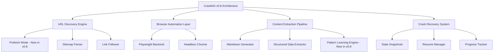
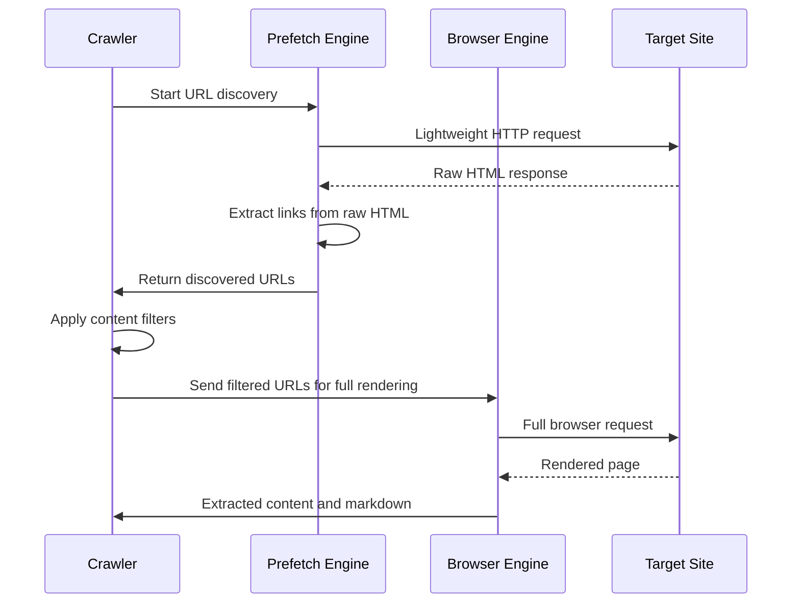
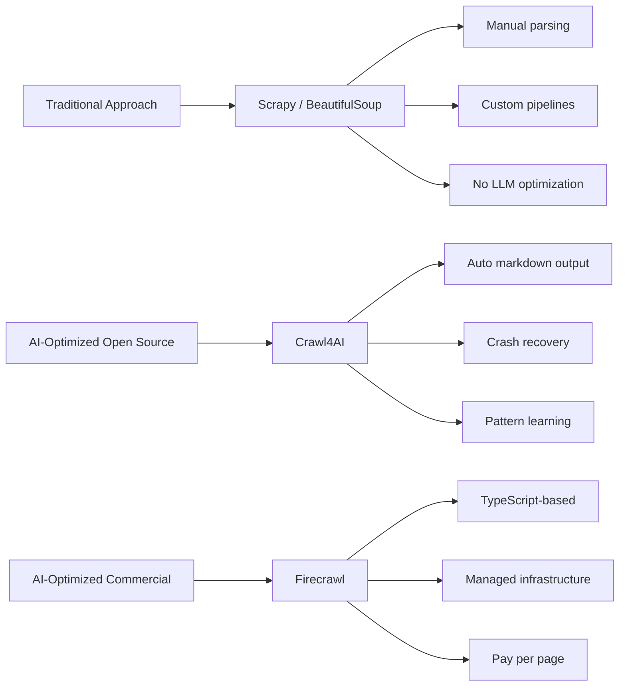

Crawlers are no longer just fetching HTML and dumping it into databases -- they need to produce clean, structured output that large language models can actually consume. Crawl4AI has been building toward this goal for several releases, and its v0.8 release (January 2026) introduces features that address the two biggest pain points in large-scale AI crawling: interrupted crawls and slow URL discovery.

This guide covers the most impactful new features in Crawl4AI v0.8, shows how to configure each one, and compares the tool against alternatives so you can decide whether it fits your pipeline.

## What Is Crawl4AI and Why Does It Matter

Crawl4AI is an open-source Python library designed specifically for turning websites into LLM-ready data. Unlike traditional scrapers that focus on extracting specific fields from specific pages, Crawl4AI produces clean markdown or structured JSON optimized for feeding directly into AI models -- whether you are building a retrieval-augmented generation system, fine-tuning a model, or populating a knowledge base.

It sits in a distinct niche between general-purpose frameworks like Scrapy (which give you maximum control but require you to handle output formatting yourself) and commercial services like Firecrawl (which offer convenience but at a cost and with less transparency).



## Getting Started with Crawl4AI

Installation is straightforward. Crawl4AI requires Python 3.9 or later and uses Playwright under the hood for browser automation.

```python
# Install Crawl4AI
# pip install crawl4ai
# playwright install chromium

import asyncio
from crawl4ai import AsyncWebCrawler

async def basic_crawl():
    async with AsyncWebCrawler() as crawler:
        result = await crawler.arun(url="https://example.com")

        # result.markdown contains clean, LLM-ready markdown
        print(result.markdown[:500])

        # result.extracted_content has structured data if configured
        print(result.extracted_content)

asyncio.run(basic_crawl())
```

For JavaScript-heavy sites, you can enable full browser rendering and wait for dynamic content to settle before extraction.

```javascript
// Node.js alternative using Crawl4AI's REST API
// (Crawl4AI can run as a service with a REST endpoint)

const response = await fetch("http://localhost:11235/crawl", {
    method: "POST",
    headers: { "Content-Type": "application/json" },
    body: JSON.stringify({
        urls: ["https://example.com"],
        word_count_threshold: 10,
        extraction_config: {
            type: "markdown",
            include_links: true
        }
    })
});

const data = await response.json();
console.log(data.results[0].markdown);
```

## Crash Recovery for Deep Crawls

This is the headline feature for anyone running large-scale crawling jobs. Before v0.8, if a deep crawl of thousands of pages was interrupted -- whether by a network failure, a Docker container restart, or an out-of-memory crash -- you had to start over from the beginning. For crawls that take hours or days, that is a devastating loss.

The new crash recovery system works by periodically snapshotting the crawler's state: which URLs have been visited, which are queued, what data has been extracted, and where the crawler is in its traversal graph.

```python
import asyncio
from crawl4ai import AsyncWebCrawler, CrawlerRunConfig, CacheMode

async def resilient_deep_crawl():
    config = CrawlerRunConfig(
        # Enable crash recovery
        crash_recovery=True,
        recovery_checkpoint_dir="./crawl_checkpoints",
        checkpoint_interval=50,  # Save state every 50 pages

        # Deep crawl settings
        deep_crawl=True,
        max_depth=5,
        max_pages=10000,

        cache_mode=CacheMode.ENABLED,
        word_count_threshold=20,
    )

    async with AsyncWebCrawler() as crawler:
        results = await crawler.arun_many(
            urls=["https://docs.example.com"],
            config=config,
        )

        print(f"Crawled {len(results)} pages successfully")

asyncio.run(resilient_deep_crawl())
```

If the crawl is interrupted, resuming is as simple as pointing to the same checkpoint directory.

```python
async def resume_interrupted_crawl():
    config = CrawlerRunConfig(
        crash_recovery=True,
        recovery_checkpoint_dir="./crawl_checkpoints",

        # The crawler detects existing state and resumes
        resume_from_checkpoint=True,

        deep_crawl=True,
        max_depth=5,
        max_pages=10000,
    )

    async with AsyncWebCrawler() as crawler:
        # Automatically skips already-crawled pages
        results = await crawler.arun_many(
            urls=["https://docs.example.com"],
            config=config,
        )

        print(f"Resumed and completed {len(results)} additional pages")

asyncio.run(resume_interrupted_crawl())
```

Checkpoint files are compact -- typically a few megabytes even for crawls of tens of thousands of pages -- so the storage overhead is negligible compared to the time saved by not re-crawling.

## Prefetch Mode: 5-10x Faster URL Discovery

Traditional web crawlers discover new URLs by fully loading each page, parsing the DOM, and extracting links. This means that even if a page has no useful content, you still pay the full rendering cost just to find the URLs it links to.

Prefetch mode decouples URL discovery from content extraction. It performs a lightweight HTTP HEAD or partial GET request first, discovers links from the raw HTML without rendering JavaScript, and queues them for full processing. Only pages that pass your content filters get the expensive full-browser treatment.



```python
async def fast_discovery_crawl():
    config = CrawlerRunConfig(
        # Enable prefetch mode for faster URL discovery
        prefetch_mode=True,
        prefetch_concurrency=20,  # Parallel prefetch requests

        # Content filters -- only fully render pages matching these
        content_filter={
            "must_contain": ["documentation", "tutorial", "guide"],
            "min_word_count": 100,
        },

        deep_crawl=True,
        max_depth=3,
        max_pages=5000,
    )

    async with AsyncWebCrawler() as crawler:
        results = await crawler.arun_many(
            urls=["https://docs.example.com"],
            config=config,
        )

        print(f"Discovered and crawled {len(results)} relevant pages")

asyncio.run(fast_discovery_crawl())
```

The performance difference is substantial. On a documentation site with 3,000 pages, prefetch mode can discover all URLs in under a minute compared to over ten minutes with traditional full-page crawling. The actual content extraction still takes the same time per page, but you avoid wasting rendering cycles on pages you do not need.

## Pattern Learning: Adapting to Website Changes

Websites change their structure regularly -- a class name gets renamed, a wrapper div gets added, a pagination scheme switches from page numbers to infinite scroll. Traditional scrapers break silently when this happens. Crawl4AI v0.8 introduces pattern learning algorithms that track extraction patterns across runs and detect when the underlying page structure has shifted.

```python
from crawl4ai import AsyncWebCrawler, CrawlerRunConfig
from crawl4ai.extraction_strategy import JsonCssExtractionStrategy

async def adaptive_extraction():
    schema = {
        "name": "Product Listings",
        "baseSelector": ".product-card",
        "fields": [
            {"name": "title", "selector": "h2.product-title", "type": "text"},
            {"name": "price", "selector": ".price-value", "type": "text"},
            {"name": "description", "selector": ".product-desc", "type": "text"},
        ]
    }

    config = CrawlerRunConfig(
        extraction_strategy=JsonCssExtractionStrategy(schema),

        # Enable pattern learning
        pattern_learning=True,
        pattern_history_dir="./pattern_data",

        # Alert threshold -- warn if extraction yield drops
        pattern_drift_threshold=0.3,
    )

    async with AsyncWebCrawler() as crawler:
        result = await crawler.arun(
            url="https://shop.example.com/products",
            config=config,
        )

        if result.pattern_drift_detected:
            print("WARNING: Page structure may have changed")
            print(f"Expected ~{result.expected_field_count} fields, "
                  f"got {result.actual_field_count}")

        print(result.extracted_content)

asyncio.run(adaptive_extraction())
```

Pattern learning does not magically fix broken selectors -- that would require understanding the site's intent. What it does is give you early warning that something has changed, so you can update your extraction logic before accumulating corrupted data across thousands of pages.

## Docker Security Fixes

This is less flashy than the other features but critically important for production deployments. Earlier versions of the Crawl4AI Docker image ran the browser process as root, which created a container escape risk if a malicious page exploited a Chromium vulnerability. The v0.8 image runs Chromium as a restricted user with proper sandboxing enabled by default.

```python
# Docker deployment example (docker-compose.yml)
# Note: v0.8 handles security settings automatically

# Running Crawl4AI as a containerized service:
# docker pull unclecode/crawl4ai:0.8.0
# docker run -p 11235:11235 unclecode/crawl4ai:0.8.0

import httpx

async def crawl_via_docker_service():
    async with httpx.AsyncClient(timeout=60.0) as client:
        response = await client.post(
            "http://localhost:11235/crawl",
            json={
                "urls": ["https://example.com"],
                "extraction_config": {
                    "type": "markdown",
                    "word_count_threshold": 10,
                }
            }
        )

        data = response.json()
        for result in data["results"]:
            print(f"URL: {result['url']}")
            print(f"Markdown length: {len(result['markdown'])}")

asyncio.run(crawl_via_docker_service())
```

If you are running Crawl4AI in production, upgrading the Docker image to v0.8 should be a priority regardless of whether you need the other new features.

## How Crawl4AI Compares to Alternatives

The AI crawling space is evolving rapidly. The following comparison shows how Crawl4AI fits alongside the main alternatives.



Crawl4AI vs Scrapy: Scrapy is a mature, battle-tested crawling framework with excellent middleware support and a plugin ecosystem. If you need to extract specific structured data at massive scale and feed it into a traditional database, Scrapy remains the better choice. Crawl4AI wins when your end goal is LLM-ready content -- it handles markdown conversion, content cleaning, and structured extraction out of the box.

Crawl4AI vs Firecrawl: Firecrawl is a TypeScript-based commercial service that also converts web pages into LLM-friendly formats. Its managed infrastructure means you do not need to worry about browser instances or Docker containers. The trade-offs are cost (you pay per page crawled), less transparency into the extraction logic, and vendor lock-in. Crawl4AI gives you full control and zero per-page costs, at the expense of managing your own infrastructure.

Crawl4AI vs a custom Playwright setup: You can absolutely build your own AI-ready crawler using Playwright directly. The question is whether you want to spend time implementing markdown conversion, content cleaning, crash recovery, and extraction strategies yourself. Crawl4AI packages these concerns into a coherent library, which saves development time if your requirements align with its defaults.

## Extracting Structured Data for LLMs

One of Crawl4AI's most useful capabilities is its ability to extract structured data using CSS-based schemas or LLM-powered extraction. The following example combines both approaches.

```python
from crawl4ai import AsyncWebCrawler, CrawlerRunConfig
from crawl4ai.extraction_strategy import LLMExtractionStrategy

async def structured_extraction():
    config = CrawlerRunConfig(
        extraction_strategy=LLMExtractionStrategy(
            instruction="""
            Extract all products from this page as a JSON array.
            Each product should have: name, price, rating, availability.
            If a field is missing, use null.
            """,
            # Uses your configured LLM provider
            provider="openai/gpt-4o-mini",
        ),
        word_count_threshold=10,
    )

    async with AsyncWebCrawler() as crawler:
        result = await crawler.arun(
            url="https://shop.example.com/products",
            config=config,
        )

        # Structured JSON output
        import json
        products = json.loads(result.extracted_content)
        for product in products:
            print(f"{product['name']}: {product['price']}")

asyncio.run(structured_extraction())
```

The LLM extraction strategy is powerful but comes with per-call costs and latency. For pages with predictable structures, the CSS-based approach is faster and free. A practical workflow is to use LLM extraction during development to understand the page structure, then lock it down to CSS selectors for production runs.

## Putting It All Together

The following example combines crash recovery, prefetch mode, and structured extraction into a production-ready crawling pipeline.

```python
import asyncio
from crawl4ai import AsyncWebCrawler, CrawlerRunConfig, CacheMode
from crawl4ai.extraction_strategy import JsonCssExtractionStrategy

async def production_pipeline():
    schema = {
        "name": "Documentation Pages",
        "baseSelector": "article",
        "fields": [
            {"name": "title", "selector": "h1", "type": "text"},
            {"name": "content", "selector": ".content", "type": "text"},
            {"name": "last_updated", "selector": ".date", "type": "text"},
        ]
    }

    config = CrawlerRunConfig(
        # Crash recovery
        crash_recovery=True,
        recovery_checkpoint_dir="./checkpoints/docs_crawl",
        checkpoint_interval=100,
        resume_from_checkpoint=True,

        # Prefetch for speed
        prefetch_mode=True,
        prefetch_concurrency=15,

        # Extraction
        extraction_strategy=JsonCssExtractionStrategy(schema),

        # Pattern learning
        pattern_learning=True,
        pattern_history_dir="./pattern_data",

        # Crawl boundaries
        deep_crawl=True,
        max_depth=4,
        max_pages=5000,
        cache_mode=CacheMode.ENABLED,
        word_count_threshold=50,
    )

    async with AsyncWebCrawler() as crawler:
        results = await crawler.arun_many(
            urls=["https://docs.example.com"],
            config=config,
        )

        successful = [r for r in results if r.success]
        failed = [r for r in results if not r.success]

        print(f"Completed: {len(successful)} pages")
        print(f"Failed: {len(failed)} pages")

        # Save results for LLM consumption
        for result in successful:
            with open(f"./output/{result.url_hash}.md", "w") as f:
                f.write(result.markdown)

asyncio.run(production_pipeline())
```

## What to Watch Next

Crawl4AI v0.8 is a solid step forward for AI-oriented web crawling, but the space is moving fast. Crawlers are evolving from general-purpose data collection tools into specialized components of AI data pipelines. Features like crash recovery and prefetch mode are not just convenience improvements -- they reflect the reality that AI crawling jobs are getting larger, longer-running, and more mission-critical.

If you are building systems that need to feed web content into language models, Crawl4AI is worth evaluating. The open-source nature means you can inspect the extraction logic, customize the output format, and avoid per-page costs that add up quickly at scale.
