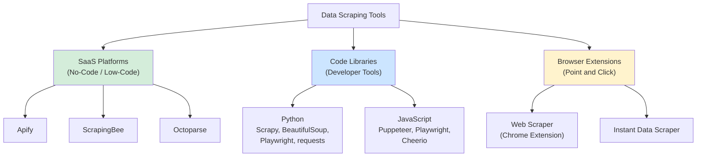
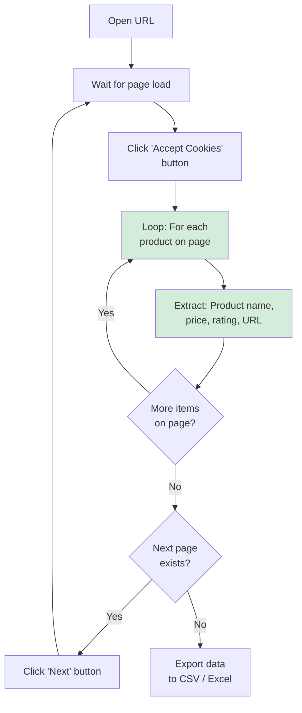
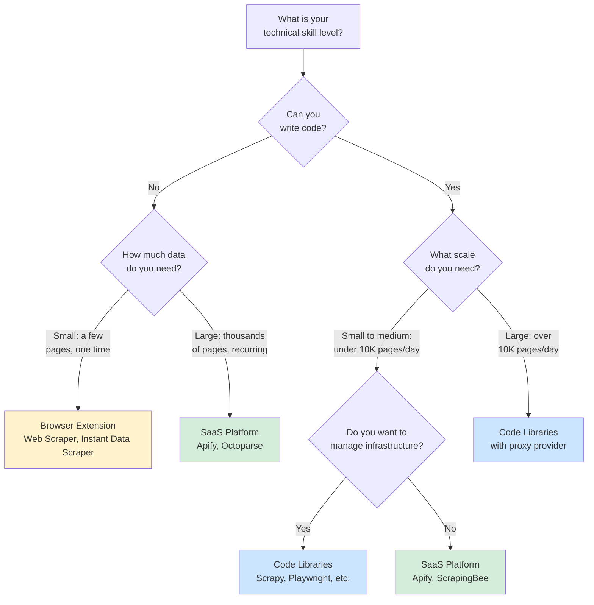
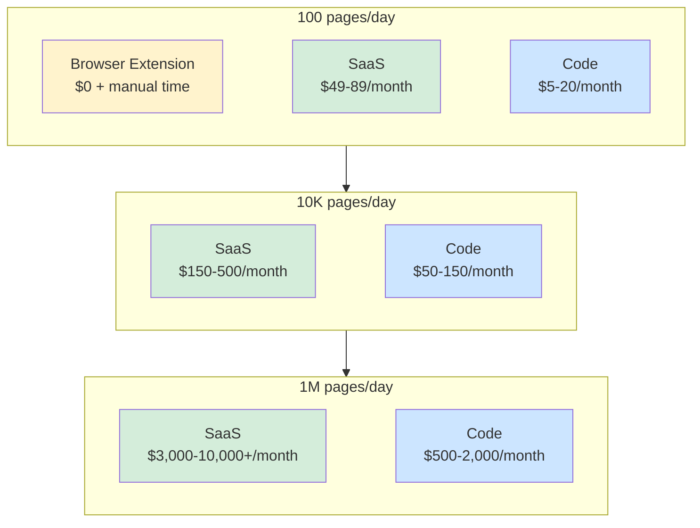

The [web scraping industry](/posts/web-scraping-industry-2026-market-size-trends/) tool landscape breaks down into three distinct categories: SaaS platforms that handle everything for you, code libraries that give you full control, and browser extensions that let you point and click your way to data. Each category serves a different user profile, budget, and scale requirement. Choosing the wrong one can mean overpaying for simple tasks or spending weeks building infrastructure you could have rented. This post walks through all three categories with real tools, honest trade-offs, and a cost analysis at different scales so you can pick the right approach for your situation.

## The Three Categories

Before diving into individual tools, it helps to see how these categories relate to each other. The fundamental trade-off is between ease of use and control. As you move from browser extensions to SaaS platforms to code libraries, the learning curve increases but so does your ability to handle complex, large-scale scraping jobs.



Each category has tools that range from simple to sophisticated. A SaaS platform like Apify can be as simple as clicking "run" on a pre-built scraper or as complex as deploying custom code to their cloud. Similarly, a browser extension like Web Scraper supports surprisingly elaborate multi-page workflows if you take the time to configure its sitemap feature. The categories are not rigid walls -- they are regions on a spectrum.

## SaaS Platforms: No-Code and Low-Code Scraping

SaaS scraping platforms are the fastest way to go from "I need this data" to "I have this data." They abstract away the hard parts: proxy rotation, browser rendering, CAPTCHA solving, retry logic, and infrastructure management. You pay a monthly fee or per-API-call cost and get data back in structured formats.

### Apify

Apify is a cloud platform built around the concept of "Actors" -- pre-built or custom scraping programs that run on Apify's infrastructure. The Actor Store has hundreds of ready-made scrapers for specific sites and use cases. If you need to scrape Google search results, Amazon product listings, or Instagram profiles, there is probably an Actor already built and tested for it.

What sets Apify apart is its flexibility. You can use it as a pure no-code platform by running existing Actors with point-and-click configuration. Or you can write your own Actors in JavaScript or Python, deploy them to Apify's cloud, and take advantage of their proxy infrastructure, scheduling, and storage systems. This makes it one of the few SaaS platforms that scales from non-technical users to developers.

```javascript
// Example: Using Apify's client to run a pre-built Actor
import { ApifyClient } from "apify-client";

const client = new ApifyClient({ token: "YOUR_API_TOKEN" });

// Run the Google Search Results Scraper Actor
const run = await client.actor("apify/google-search-scraper").call({
  queries: "data scraping tools comparison",
  maxPagesPerQuery: 3,
  languageCode: "en",
  countryCode: "us",
});

// Fetch results from the Actor's default dataset
const { items } = await client.dataset(run.defaultDatasetId).listItems();
console.log(`Found ${items.length} search results`);
```

Apify's free tier gives you $5 worth of platform usage per month, which is enough for light scraping. Paid plans start at $49/month with more compute, storage, and proxy bandwidth. For teams that need a managed scraping infrastructure without building one from scratch, it is a strong option.

### ScrapingBee

ScrapingBee takes a different approach. Instead of a platform with pre-built scrapers, it provides a single API endpoint that handles the messy parts of web scraping. You send a URL, and ScrapingBee returns the rendered HTML. Behind the scenes, it manages headless browsers, rotates proxies, and handles JavaScript rendering.

The API-first design makes ScrapingBee easy to integrate into existing codebases. You do not need to learn a new platform or workflow. You make an HTTP request and parse the response however you like.

```python
# Example: Using ScrapingBee's API with Python
import requests

response = requests.get(
    "https://app.scrapingbee.com/api/v1/",
    params={
        "api_key": "YOUR_API_KEY",
        "url": "https://example.com/products",
        "render_js": "true",
        "premium_proxy": "true",
        "country_code": "us",
    },
)

html = response.text
# Parse html with BeautifulSoup, lxml, or any parser you prefer
```

ScrapingBee charges per API credit. A standard request costs 1 credit. JavaScript rendering costs 5 credits. Premium proxies cost 10-75 credits depending on the country. Plans start at $49/month for 1,000 credits. At high volumes, the per-request cost can add up quickly, but for moderate-scale scraping with tough targets, the proxy and rendering infrastructure saves significant development time.

### Octoparse

Octoparse is a visual, point-and-click web scraper designed for non-technical users. You load a website in Octoparse's built-in browser, click on the data you want, and it generates extraction rules automatically. It handles pagination, scrolling, and form interactions through a visual workflow builder.

The workflow builder uses a flowchart-style interface where each step represents an action: navigate to URL, click element, extract data, scroll page, wait for element. You build scraping logic by chaining these steps together without writing a single line of code.



Octoparse offers a free tier with limited features and up to 10,000 records per export. Paid plans start at $89/month and include cloud execution, scheduling, and IP rotation. The visual approach works well for straightforward scraping tasks but can become unwieldy for complex sites with heavy JavaScript or unconventional page structures.

### SaaS Platform Pros and Cons

**Pros:**
- No coding required for most use cases
- Infrastructure is fully managed -- no servers, proxies, or browsers to maintain
- Proxy rotation and CAPTCHA handling are often included
- Built-in scheduling, monitoring, and data export
- Fast time-to-value for standard scraping tasks

**Cons:**
- Expensive at scale -- costs grow linearly with volume
- Limited customization compared to code-based approaches
- Vendor lock-in -- migrating scrapers between platforms is painful
- Debugging is harder when you cannot see the underlying code
- Rate limits and quotas can block high-volume projects
- Some platforms restrict scraping certain categories of sites

<figure>
  
  <figcaption>No-code tools lower the barrier, but flexibility has limits. <span class="img-credit">Photo by Firmbee.com / <a href="https://www.pexels.com" target="_blank" rel="noopener noreferrer">Pexels</a></span></figcaption>
</figure>

## Code Libraries: Developer Tools

Code libraries give you maximum control over every aspect of the scraping process. You choose the language, the parser, the proxy provider, the scheduling system, and the data storage layer. The trade-off is that you also own all of those decisions and the infrastructure that comes with them.

### Python Libraries

Python dominates the web scraping ecosystem thanks to its readable syntax, excellent libraries, and large community. The main libraries cover different parts of the scraping stack.

**Scrapy** is a full-featured scraping framework. It handles request scheduling, retry logic, rate limiting, data pipelines, and output formats out of the box. You define Spiders -- classes that describe how to navigate a site and extract data -- and Scrapy manages the rest. For large-scale crawling projects, Scrapy's asynchronous architecture processes thousands of pages efficiently.

```python
# Example: A Scrapy spider for product data
import scrapy

class ProductSpider(scrapy.Spider):
    name = "products"
    start_urls = ["https://example.com/products"]

    def parse(self, response):
        for product in response.css("div.product-card"):
            yield {
                "name": product.css("h2.title::text").get(),
                "price": product.css("span.price::text").get(),
                "rating": product.css("div.rating::attr(data-score)").get(),
                "url": response.urljoin(
                    product.css("a.product-link::attr(href)").get()
                ),
            }

        # Follow pagination
        next_page = response.css("a.next-page::attr(href)").get()
        if next_page:
            yield response.follow(next_page, self.parse)
```

**BeautifulSoup** is a parsing library, not a scraping framework. It takes HTML and gives you a clean API for navigating and extracting data from the document tree. You pair it with `requests` or `httpx` for fetching pages. If you are deciding between the lightweight [requests approach and full Selenium](/posts/python-requests-vs-selenium-speed-performance-comparison/), the choice usually comes down to whether the target page requires JavaScript rendering. This combination is the simplest way to scrape static pages in Python.

```python
# Example: BeautifulSoup with requests
import requests
from bs4 import BeautifulSoup

response = requests.get("https://example.com/products")
soup = BeautifulSoup(response.text, "html.parser")

products = []
for card in soup.select("div.product-card"):
    products.append({
        "name": card.select_one("h2.title").get_text(strip=True),
        "price": card.select_one("span.price").get_text(strip=True),
    })
```

**Playwright for Python** handles sites that require JavaScript rendering. It controls a real browser (Chromium, Firefox, or WebKit) and lets you interact with pages programmatically. When a site loads data through API calls after the initial page load, or when content is rendered client-side by a JavaScript framework, Playwright is the tool that gets you to the final rendered state.

```python
# Example: Playwright for dynamic content
from playwright.sync_api import sync_playwright

with sync_playwright() as p:
    browser = p.chromium.launch(headless=True)
    page = browser.new_page()

    page.goto("https://example.com/products")
    page.wait_for_selector("div.product-card")

    products = page.evaluate("""
        () => Array.from(document.querySelectorAll('div.product-card')).map(card => ({
            name: card.querySelector('h2.title')?.textContent?.trim(),
            price: card.querySelector('span.price')?.textContent?.trim(),
        }))
    """)

    browser.close()
```

### JavaScript Libraries

JavaScript has its own strong scraping ecosystem, particularly for browser automation.

**Puppeteer** is Google's Node.js library for controlling Chrome and Chromium. It provides a high-level API for navigating pages, interacting with elements, and extracting data. Puppeteer's tight integration with Chrome gives it excellent rendering fidelity and access to Chrome DevTools Protocol features like network interception and performance tracing.

**Playwright for Node.js** is Microsoft's cross-browser automation library. It supports Chromium, Firefox, and WebKit with a single API. Playwright's auto-waiting mechanism reduces the need for explicit waits, and its context isolation makes parallel scraping cleaner. It has largely overtaken Puppeteer in developer adoption for new projects. For a detailed head-to-head, see our [Selenium vs Puppeteer comparison](/posts/selenium-vs-puppeteer-definitive-comparison-web-scraping/).

```javascript
// Example: Playwright for Node.js
const { chromium } = require("playwright");

(async () => {
  const browser = await chromium.launch({ headless: true });
  const page = await browser.newPage();

  await page.goto("https://example.com/products");
  await page.waitForSelector("div.product-card");

  const products = await page.$$eval("div.product-card", (cards) =>
    cards.map((card) => ({
      name: card.querySelector("h2.title")?.textContent?.trim(),
      price: card.querySelector("span.price")?.textContent?.trim(),
    }))
  );

  console.log(products);
  await browser.close();
})();
```

**Cheerio** is the Node.js equivalent of BeautifulSoup. It parses static HTML using a jQuery-like API. It is extremely fast because it does not render JavaScript or load a browser -- it just parses the HTML string. Pair it with `axios` or `node-fetch` for a lightweight scraping stack.

```javascript
// Example: Cheerio with axios
const axios = require("axios");
const cheerio = require("cheerio");

const { data: html } = await axios.get("https://example.com/products");
const $ = cheerio.load(html);

const products = [];
$("div.product-card").each((i, el) => {
  products.push({
    name: $(el).find("h2.title").text().trim(),
    price: $(el).find("span.price").text().trim(),
  });
});
```

### Code Library Pros and Cons

**Pros:**
- Full control over every aspect of the scraping process
- Free and open source -- no per-request costs
- Unlimited customization for complex scraping logic
- Large community support, documentation, and tutorials
- Can handle any site structure, authentication flow, or data format
- No vendor lock-in -- your code runs anywhere

**Cons:**
- Requires programming skills
- You manage your own infrastructure: servers, proxies, scheduling, monitoring
- Browser automation is resource-intensive and needs tuning
- Proxy rotation, CAPTCHA solving, and retry logic must be built or integrated separately
- Development time is measured in days or weeks, not minutes

## Browser Extensions: Point-and-Click Scraping

Browser extensions sit at the most accessible end of the spectrum. They run inside your browser, let you visually select elements on a page, and export the extracted data to CSV or JSON. No servers, no APIs, no code. Open the extension, click on what you want, and download the data.

### Web Scraper (Chrome Extension)

Web Scraper is the most popular scraping extension for Chrome, with over 2 million users. It uses a "sitemap" concept where you define the structure of the data you want to extract. You create selectors by clicking on elements in the page, specify pagination or link-following rules, and run the scraper.

The sitemap approach supports surprisingly complex workflows. You can define parent-child relationships between selectors, follow links to detail pages, handle pagination through next-page buttons or scroll loading, and extract attributes like `href` or `src` in addition to text content.

Web Scraper also offers a cloud version (Web Scraper Cloud) that adds scheduling, proxy support, and larger-scale execution. The browser extension itself is free. The cloud service starts at $50/month.

### Instant Data Scraper

Instant Data Scraper takes a more automated approach. Instead of manually defining selectors, it uses heuristics to detect tabular data on the page automatically. When you activate it, it analyzes the page structure and suggests data tables it can extract. You review the detected data, adjust if needed, and export.

This works remarkably well for pages with obvious repeating structures like search results, product listings, or directory pages. It struggles with unconventional layouts or pages where the data is not arranged in a clear list or grid pattern. But for the sites where it works, it is the fastest path from page to spreadsheet.

### Browser Extension Pros and Cons

**Pros:**
- Zero setup -- install from the Chrome Web Store and start scraping
- Visual element selection -- no need to write CSS selectors or XPath
- Good for one-off data extraction tasks
- Free or very low cost
- Works with the page exactly as you see it in the browser

**Cons:**
- No scheduling -- you must manually trigger each scrape
- Limited scale -- your browser must be open and active
- Cannot handle authentication flows or complex interactions easily
- No proxy rotation -- your real IP is always exposed
- Data export is manual (download CSV/JSON files)
- Extension updates or browser updates can break functionality
- Not practical for ongoing, automated data collection

<figure>
  
  <figcaption>Extensions work best for quick, small-scale jobs. <span class="img-credit">Photo by Mikhail Nilov / <a href="https://www.pexels.com" target="_blank" rel="noopener noreferrer">Pexels</a></span></figcaption>
</figure>

## Comparison Table

Here is how the three categories stack up across the dimensions that matter most when choosing a scraping approach.

| Dimension | SaaS Platforms | Code Libraries | Browser Extensions |
|---|---|---|---|
| **Cost** | $49-500+/month | Free (plus infrastructure) | Free |
| **Scale** | Thousands to millions of pages | Unlimited (with infrastructure) | Dozens to hundreds of pages |
| **Customization** | Moderate | Full | Limited |
| **Learning curve** | Low to moderate | Moderate to high | Very low |
| **Maintenance** | Provider handles updates | You handle everything | Minimal |
| **Scheduling** | Built-in | DIY (cron, Airflow, etc.) | None |
| **Proxy support** | Included | BYO or integrate a provider | None |
| **JavaScript rendering** | Usually included | Requires browser automation lib | Automatic (runs in browser) |
| **Anti-bot handling** | Often included | DIY or use stealth libraries | N/A (manual browsing) |
| **Data output** | API, webhook, database | Anything you build | CSV, JSON download |
| **Best for** | Teams, ongoing projects | Developers, complex/large jobs | Quick one-off extractions |

## Decision Guide

The right tool depends on who you are, what you are scraping, and how often you need to do it. Here is a framework for deciding.



**Non-technical users** should start with browser extensions for small, one-off tasks. If the data need is recurring or involves thousands of pages, move to a SaaS platform like Octoparse (visual, no-code) or Apify (broader ecosystem with pre-built scrapers).

**Developers working solo** should default to code libraries. The initial development time is higher, but the per-page cost is essentially zero once the scraper is built. Use Scrapy for large crawls, BeautifulSoup/Cheerio for static pages, and Playwright/Puppeteer for JavaScript-heavy sites. Our [mega comparison of Playwright, Puppeteer, Selenium, and Scrapy](/posts/playwright-vs-puppeteer-vs-selenium-vs-scrapy-2026-mega-comparison/) breaks down exactly when each one fits best. Consider a SaaS API like ScrapingBee when you need proxies and rendering but do not want to manage that infrastructure yourself.

**Mixed teams** -- where business analysts define what to scrape and developers build the tooling -- often benefit from a layered approach. Use a SaaS platform for standard data sources where pre-built scrapers exist, and write custom code for edge cases, complex sites, or high-volume targets where SaaS costs become prohibitive.

**Scale is the ultimate tiebreaker.** At low volume, the convenience of SaaS platforms and browser extensions outweighs their limitations. At high volume, the economics of code libraries become impossible to ignore.

## Cost Analysis at Different Scales

The cost comparison shifts dramatically depending on how many pages you need to scrape. Here is a rough breakdown at three scales, using realistic pricing as of early 2026.

### 100 Pages Per Day (3,000/month)

At this scale, all three approaches are viable and the cost differences are small.

| Approach | Monthly Cost | Notes |
|---|---|---|
| Browser extension | $0 | Manual effort: ~30 min/day |
| SaaS (ScrapingBee) | $49 | Starter plan covers this easily |
| SaaS (Apify) | $0-49 | Free tier may suffice for simple actors |
| SaaS (Octoparse) | $89 | Standard plan |
| Code (self-hosted) | $5-20 | Small VPS + your time to build |

At 100 pages per day, the real cost is your time, not the tooling. A browser extension is free but requires daily manual effort. A SaaS platform costs $49-89/month but runs automatically. A custom script on a cheap VPS costs almost nothing in infrastructure but requires upfront development time. For a one-time project, the browser extension wins. For an ongoing data feed, SaaS is the most practical unless you already have a codebase set up.

### 10,000 Pages Per Day (300,000/month)

At this scale, browser extensions are no longer viable and cost differences between SaaS and code become significant.

| Approach | Monthly Cost | Notes |
|---|---|---|
| Browser extension | Not viable | Cannot handle this volume |
| SaaS (ScrapingBee) | $200-400 | Business plan, depends on JS rendering |
| SaaS (Apify) | $150-500 | Depends on actor complexity and compute |
| SaaS (Octoparse) | $250-400 | Professional plan with cloud execution |
| Code (self-hosted) | $50-150 | VPS + proxy service subscription |

The code-based approach starts showing clear cost advantages here. A $50/month VPS running Scrapy can process 10,000 pages per day without breaking a sweat for static sites. Add a $50-100/month proxy service if you need residential IPs or rotation, and you are still well under the SaaS price. The catch is that you need several days of development time upfront and ongoing maintenance when sites change their structure.

For JavaScript-heavy sites at this scale, the infrastructure cost for code-based scraping increases because you need more CPU and RAM to run headless browsers. A dedicated server or multiple VPS instances might cost $100-200/month. Still cheaper than SaaS, but the gap narrows.

### 1,000,000 Pages Per Day (30,000,000/month)

At this scale, the economics overwhelmingly favor code-based approaches. SaaS platforms either cannot handle this volume or charge enterprise prices that dwarf the cost of self-managed infrastructure.

| Approach | Monthly Cost | Notes |
|---|---|---|
| Browser extension | Not viable | -- |
| SaaS (ScrapingBee) | $3,000-10,000+ | Enterprise plan required |
| SaaS (Apify) | $2,000-8,000+ | Enterprise compute and proxy costs |
| SaaS (Octoparse) | Not designed for this | Contact sales |
| Code (self-hosted) | $500-2,000 | Multiple servers + proxy service |

At a million pages per day, you are running a serious data operation. The code-based approach using Scrapy or a custom distributed crawler costs a fraction of any SaaS option. You will need a cluster of servers (or containers on a cloud provider), a proxy rotation service with sufficient bandwidth, and monitoring infrastructure to keep everything running. But even with all of that, you are looking at $500-2,000/month versus $3,000-10,000+ for a managed service.

The trade-off is engineering time. Building and maintaining a crawler at this scale is a significant engineering investment. If your team has the skills, the ROI is clear. If you would need to hire a dedicated engineer, factor that salary into the equation -- it may still be cheaper than SaaS at this volume, but the breakeven point depends on how long you need the data.



## Hybrid Approaches Worth Considering

In practice, many teams do not pick just one category. They combine tools based on the task at hand.

A common pattern is to use a SaaS platform for discovery and prototyping, then move high-volume or complex scrapers to custom code once the requirements are clear. Apify is particularly well-suited for this workflow because you can start with a pre-built Actor, then write a custom one when you outgrow it, and eventually self-host your code using Apify's open-source SDK.

Another pattern is to use ScrapingBee or a similar API as a rendering and proxy layer inside your own code. Instead of managing headless browsers and proxy rotation yourself, you offload those concerns to the API and focus your code on parsing and data processing. This gives you the customization of code with some of the infrastructure benefits of SaaS.

```python
# Hybrid: Using ScrapingBee as a rendering layer inside custom code
import requests
from bs4 import BeautifulSoup

def fetch_with_scrapingbee(url):
    """Use ScrapingBee for rendering, handle parsing ourselves."""
    response = requests.get(
        "https://app.scrapingbee.com/api/v1/",
        params={
            "api_key": "YOUR_KEY",
            "url": url,
            "render_js": "true",
        },
    )
    return BeautifulSoup(response.text, "html.parser")

def extract_products(soup):
    """Custom parsing logic for our specific use case."""
    products = []
    for card in soup.select("div.product-card"):
        name = card.select_one("h2.title")
        price = card.select_one("span.price")
        rating = card.select_one("div.rating")

        products.append({
            "name": name.get_text(strip=True) if name else None,
            "price": price.get_text(strip=True) if price else None,
            "rating": rating.get("data-score") if rating else None,
        })
    return products

# Use the hybrid approach
soup = fetch_with_scrapingbee("https://example.com/products")
data = extract_products(soup)
```

For browser extensions, the hybrid angle is simpler: use them for initial exploration and testing selectors, then implement the real scraper in code or SaaS. Loading a page in your browser with the Web Scraper extension is a fast way to figure out which CSS selectors target the data you need before committing to a full implementation.

## What to Watch For

A few practical considerations that cut across all three categories.

**Site changes break scrapers.** Regardless of your tooling, web scraping is inherently fragile because you are depending on someone else's HTML structure. SaaS platforms with pre-built scrapers handle maintenance for you -- that is part of what you pay for. Code-based scrapers require you to monitor and fix breakages yourself. Browser extensions usually require manual reconfiguration.

**Anti-bot detection is getting more sophisticated.** Sites increasingly use fingerprinting, CAPTCHAs, and behavioral analysis to block automated access. SaaS platforms invest heavily in staying ahead of these defenses. Code-based approaches require you to integrate [stealth browsers and anti-detection tools](/posts/stealth-browsers-in-2026-camoufox-nodriver-and-the-anti-detection-arms-race/) along with proxy services. Browser extensions sidestep this entirely because they run in a real browser with real user behavior, but they do not scale.

**Legal and ethical boundaries apply to all tools.** The tool you use does not change the legal status of what you are scraping. Public data is generally fair game, but terms of service, copyright, and privacy regulations like GDPR apply regardless of whether you are using Apify, Scrapy, or a Chrome extension. Always review the legal landscape for your specific use case and jurisdiction.

**Data quality requires post-processing.** Raw scraped data is messy. Prices come with currency symbols and formatting. Names have extra whitespace. Addresses are inconsistent. Budget time for data cleaning and validation no matter which tool you choose. SaaS platforms sometimes include basic data cleaning features, but serious data quality work happens downstream.

## Wrapping Up

The best scraping tool is the one that matches your skills, budget, and scale. Browser extensions are unbeatable for quick, small-scale extractions where you just need a spreadsheet of data. SaaS platforms trade money for time and are the right choice when you need reliable, scheduled scraping without managing infrastructure. Code libraries cost nothing but your time and give you unlimited power -- they are the only realistic option at very large scales.

Start by asking three questions: How many pages do I need? How often do I need them? Can I write code? The answers will point you to the right category. From there, experiment with the specific tools. Most have free tiers or trials, so you can validate your choice before committing.
