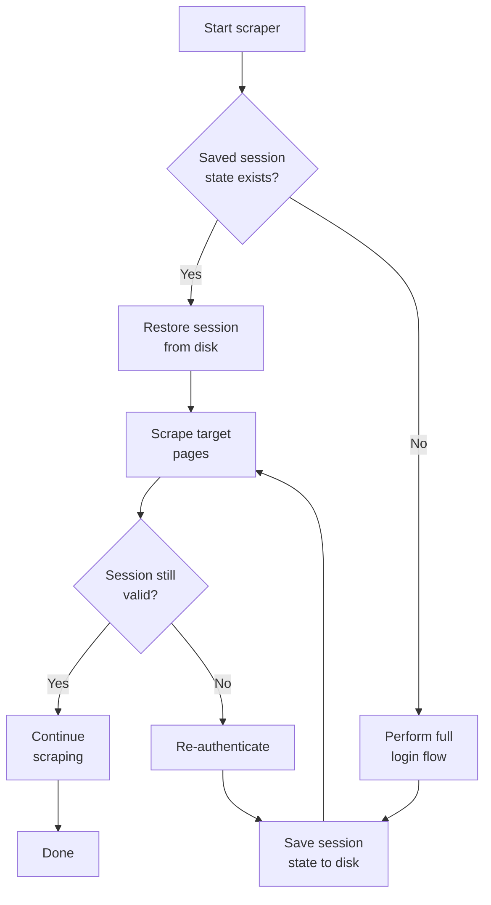
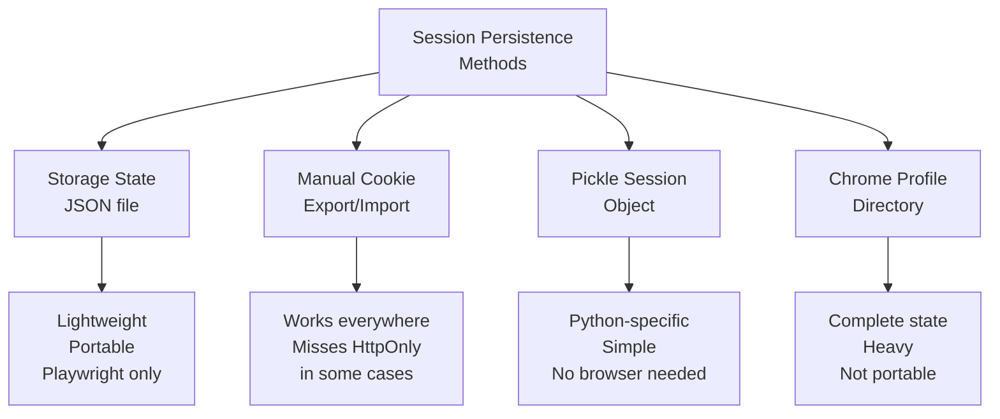

Logging in for every single scraping run is one of the most wasteful patterns in automation. Each login attempt burns time navigating forms, waiting for redirects, and processing MFA prompts. Worse, it raises your risk profile -- security systems monitor login frequency, flag bursts of authentication from unfamiliar IPs, and rate-limit or lock accounts that exceed thresholds. A scraper that logs in fifty times a day looks nothing like a human who logs in once and stays logged in for weeks. Session persistence solves this by flipping the model: you authenticate once, save the resulting session state to disk, and restore it on every subsequent run. When the session eventually expires, you detect the failure and re-authenticate automatically. This post walks through the complete workflow across Playwright, Selenium, and raw HTTP clients, with production-grade patterns for expiration detection, auto-refresh, and multi-account management.

## The Session Persistence Workflow

The core idea is a loop: authenticate, persist, restore, scrape, and only re-authenticate when the session dies. Here is the full lifecycle.



Every tool in the automation ecosystem handles the "save" and "restore" steps differently. Some make it trivial. Others require manual plumbing. The sections below cover each approach in detail.

## Playwright Storage State: The Gold Standard

Playwright provides first-class support for session persistence through its storage state API. A single method call serializes all cookies and localStorage for every origin visited by the browser context into a JSON file. Restoring is equally simple -- you pass the file path when creating a new context.

### Saving State After Login

```python
from playwright.sync_api import sync_playwright

with sync_playwright() as p:
    browser = p.chromium.launch(headless=True)
    context = browser.new_context()
    page = context.new_page()

    # Navigate to login page
    page.goto("https://example.com/login")

    # Fill credentials and submit (see [how to automate web form filling](/posts/how-to-automate-web-form-filling-complete-guide/) for more complex login flows)
    page.fill("#username", "myuser")
    page.fill("#password", "mypassword")
    page.click("#login-button")

    # Wait for navigation to confirm successful login
    page.wait_for_url("**/dashboard**")

    # Save all cookies and localStorage to a file
    context.storage_state(path="auth.json")
    print("Session state saved to auth.json")

    browser.close()
```

The `auth.json` file contains a structured dump of every cookie and localStorage entry. Its format looks like this:

```json
{
  "cookies": [
    {
      "name": "session_id",
      "value": "a1b2c3d4e5f6",
      "domain": ".example.com",
      "path": "/",
      "expires": 1738972800,
      "httpOnly": true,
      "secure": true,
      "sameSite": "Lax"
    }
  ],
  "origins": [
    {
      "origin": "https://example.com",
      "localStorage": [
        {
          "name": "auth_token",
          "value": "eyJhbGciOi..."
        }
      ]
    }
  ]
}
```

### Restoring State on the Next Run

```python
from playwright.sync_api import sync_playwright
import os

with sync_playwright() as p:
    browser = p.chromium.launch(headless=True)

    # Create context with saved session state
    if os.path.exists("auth.json"):
        context = browser.new_context(storage_state="auth.json")
        print("Restored session from auth.json")
    else:
        context = browser.new_context()
        print("No saved session found, starting fresh")

    page = context.new_page()
    page.goto("https://example.com/dashboard")

    # Check if we landed on the dashboard or got redirected to login
    if "login" in page.url:
        print("Session expired, need to re-authenticate")
    else:
        print("Session valid, scraping authenticated content")
        # ... proceed with scraping ...

    browser.close()
```

The `storage_state` parameter on `browser.new_context()` accepts either a file path string or a dictionary matching the same structure. This means you can also build or modify the state programmatically before passing it in.

## Selenium: Manual Cookie and localStorage Persistence

Selenium does not have a single-call equivalent to Playwright's `storage_state()`. You need to handle cookies and localStorage separately, and localStorage requires JavaScript execution because Selenium has no native API for it. For a deeper look at the full range of [Selenium session management techniques for saving cookies and localStorage](/posts/selenium-session-management-saving-cookies-localstorage/), that dedicated guide covers the edge cases.

### Saving Cookies

```python
import json
from selenium import webdriver
from selenium.webdriver.common.by import By
from selenium.webdriver.support.ui import WebDriverWait
from selenium.webdriver.support import expected_conditions as EC

driver = webdriver.Chrome()
driver.get("https://example.com/login")

# Perform login
driver.find_element(By.ID, "username").send_keys("myuser")
driver.find_element(By.ID, "password").send_keys("mypassword")
driver.find_element(By.ID, "login-button").click()

# Wait for login to complete
WebDriverWait(driver, 15).until(
    EC.url_contains("/dashboard")
)

# Save cookies
cookies = driver.get_cookies()
with open("selenium_cookies.json", "w") as f:
    json.dump(cookies, f, indent=2)

print(f"Saved {len(cookies)} cookies")
```

### Saving localStorage

```python
# Extract all localStorage entries via JavaScript
local_storage = driver.execute_script("""
    let storage = {};
    for (let i = 0; i < localStorage.length; i++) {
        let key = localStorage.key(i);
        storage[key] = localStorage.getItem(key);
    }
    return storage;
""")

with open("selenium_localstorage.json", "w") as f:
    json.dump(local_storage, f, indent=2)

print(f"Saved {len(local_storage)} localStorage entries")
driver.quit()
```

### Restoring Both on the Next Run

Restoring cookies in Selenium has a well-known constraint: you must first navigate to the target domain before adding cookies, because Selenium rejects cookies whose domain does not match the current page.

```python
import json
from selenium import webdriver

driver = webdriver.Chrome()

# Navigate to the domain first -- required before adding cookies
driver.get("https://example.com")

# Restore cookies
with open("selenium_cookies.json", "r") as f:
    cookies = json.load(f)

for cookie in cookies:
    # Remove problematic fields that some sites set
    cookie.pop("sameSite", None)
    try:
        driver.add_cookie(cookie)
    except Exception as e:
        print(f"Skipping cookie {cookie['name']}: {e}")

# Restore localStorage
with open("selenium_localstorage.json", "r") as f:
    local_storage = json.load(f)

for key, value in local_storage.items():
    escaped_value = value.replace("'", "\\'")
    driver.execute_script(
        f"localStorage.setItem('{key}', '{escaped_value}');"
    )

# Now navigate to the actual target page
driver.get("https://example.com/dashboard")

if "login" in driver.current_url:
    print("Session expired")
else:
    print("Session restored successfully")
```

## Requests Library: Pickle the Session

When you do not need a browser at all -- for example, when the target site uses server-side rendering and standard cookie-based auth -- the Python `requests` library is lighter and faster. The `requests.Session` object maintains cookies across requests automatically. You can persist the entire session using `pickle` or just save its cookies.

### Saving and Restoring with Pickle

```python
import requests
import pickle
import os

SESSION_FILE = "session.pkl"

def get_session():
    """Load existing session or create a new one."""
    if os.path.exists(SESSION_FILE):
        with open(SESSION_FILE, "rb") as f:
            session = pickle.load(f)
        print("Loaded existing session")
        return session
    return requests.Session()

def save_session(session):
    """Persist session to disk."""
    with open(SESSION_FILE, "wb") as f:
        pickle.dump(session, f)
    print("Session saved")

def login(session):
    """Perform authentication."""
    resp = session.post("https://example.com/api/login", json={
        "username": "myuser",
        "password": "mypassword"
    })
    resp.raise_for_status()
    print("Login successful")
    return session

# Main flow
session = get_session()

# Test if session is still valid
resp = session.get("https://example.com/api/profile")
if resp.status_code == 401:
    print("Session expired, logging in again")
    session = login(session)

save_session(session)

# Now scrape with the authenticated session
data = session.get("https://example.com/api/data")
print(f"Got {len(data.json())} records")
```

### Cookie Jar Export (No Pickle)

If you prefer not to pickle the entire session object, you can export just the cookies to a portable JSON format.

```python
import requests
import json

session = requests.Session()

# After login, save cookies as a dictionary
def save_cookies(session, path="request_cookies.json"):
    cookie_dict = dict(session.cookies)
    with open(path, "w") as f:
        json.dump(cookie_dict, f, indent=2)

def load_cookies(session, path="request_cookies.json"):
    with open(path, "r") as f:
        cookie_dict = json.load(f)
    session.cookies.update(cookie_dict)
    return session
```


<figure>
  
  <figcaption>Cookies are small, but they carry the weight of authentication. <span class="img-credit">Photo by hello aesthe / <a href="https://www.pexels.com" target="_blank" rel="noopener noreferrer">Pexels</a></span></figcaption>
</figure>

## Chrome User Data Directory: Persistent Browser Profiles

Both Playwright and Selenium can use Chrome's built-in profile system to persist state across runs. Instead of saving and restoring state manually, you point the browser at a persistent profile directory. Chrome handles cookie storage, localStorage, IndexedDB, and even cached credentials automatically.

### Playwright with Persistent Context

```python
from playwright.sync_api import sync_playwright

USER_DATA_DIR = "/tmp/playwright-profile"

with sync_playwright() as p:
    # launch_persistent_context uses a real Chrome profile directory
    context = p.chromium.launch_persistent_context(
        user_data_dir=USER_DATA_DIR,
        headless=False,  # first run: headed so you can log in manually
        channel="chrome"
    )

    page = context.pages[0] if context.pages else context.new_page()
    page.goto("https://example.com/dashboard")

    # On first run, you log in manually or programmatically.
    # On subsequent runs, the profile already has your session.

    input("Press Enter when done...")
    context.close()
```

### Selenium with User Data Directory

```python
from selenium import webdriver
from selenium.webdriver.chrome.options import Options

USER_DATA_DIR = "/tmp/selenium-profile"

options = Options()
options.add_argument(f"--user-data-dir={USER_DATA_DIR}")
options.add_argument("--profile-directory=Default")

driver = webdriver.Chrome(options=options)
driver.get("https://example.com/dashboard")

# The profile retains all cookies, localStorage, and login state
# across browser restarts
```

The profile approach has one major advantage: it captures everything, including HttpOnly cookies, service workers, and IndexedDB data that manual extraction would miss. The downside is that profile directories are large (hundreds of megabytes), browser-version-specific, and not easily portable between machines.



## Detecting Expired Sessions

No session lasts forever. Cookies expire, tokens get revoked, and servers rotate secrets. Your scraper needs to detect when a session has died and react accordingly. There are several reliable signals.

### URL-Based Detection

The most common pattern: the server redirects unauthenticated requests to a login page.

```python
def is_session_valid(page):
    """Check if we are still on an authenticated page."""
    current_url = page.url
    login_indicators = ["/login", "/signin", "/auth", "/sso"]
    return not any(indicator in current_url for indicator in login_indicators)
```

### HTTP Status Code Detection

APIs and some web applications return 401 (Unauthorized) or 403 (Forbidden) when the session is invalid.

```python
def check_session_api(session):
    """Test session validity against an API endpoint."""
    resp = session.get("https://example.com/api/me", allow_redirects=False)

    if resp.status_code == 200:
        return True
    elif resp.status_code in (401, 403):
        return False
    elif resp.status_code in (301, 302):
        # Redirect to login page
        return False
    else:
        # Unexpected status -- treat as potentially valid
        # but log for investigation
        print(f"Unexpected status: {resp.status_code}")
        return True
```

### Content-Based Detection

Some sites return 200 OK even for unauthenticated requests but serve a login form instead of the expected content.

```python
def is_authenticated_content(page):
    """Check page content for signs of authenticated access."""
    # Look for elements that only appear when logged in
    logout_button = page.query_selector("[data-testid='logout']")
    user_menu = page.query_selector(".user-profile-menu")

    # Look for elements that indicate we are NOT logged in
    login_form = page.query_selector("form#login-form")

    if login_form:
        return False
    if logout_button or user_menu:
        return True

    return False
```

## Auto-Refresh: Re-Authenticate When Sessions Expire

Combining detection with automatic re-login creates a scraper that runs indefinitely without manual intervention. The pattern wraps your scraping logic in a session-aware loop.

```python
from playwright.sync_api import sync_playwright
import os
import time

AUTH_FILE = "auth.json"

class PersistentScraper:
    def __init__(self):
        self.pw = sync_playwright().start()
        self.browser = self.pw.chromium.launch(headless=True)
        self.context = None
        self.page = None

    def _login(self):
        """Perform full login and save session state."""
        if self.context:
            self.context.close()

        self.context = self.browser.new_context()
        self.page = self.context.new_page()

        self.page.goto("https://example.com/login")
        self.page.fill("#username", os.environ["SITE_USERNAME"])
        self.page.fill("#password", os.environ["SITE_PASSWORD"])
        self.page.click("#login-button")
        self.page.wait_for_url("**/dashboard**")

        # Save state for future runs
        self.context.storage_state(path=AUTH_FILE)
        print("Logged in and saved session state")

    def _restore_or_login(self):
        """Try to restore session, fall back to fresh login."""
        if os.path.exists(AUTH_FILE):
            self.context = self.browser.new_context(
                storage_state=AUTH_FILE
            )
            self.page = self.context.new_page()
            self.page.goto("https://example.com/dashboard")

            if self._is_session_valid():
                print("Restored session successfully")
                return
            else:
                print("Saved session expired")

        self._login()

    def _is_session_valid(self):
        """Check if current session is authenticated."""
        return "login" not in self.page.url

    def _ensure_session(self):
        """Validate session before each action, refresh if needed."""
        if not self._is_session_valid():
            print("Session expired mid-run, re-authenticating")
            self._login()

    def scrape_page(self, url):
        """Scrape a single page with automatic session management."""
        self.page.goto(url)
        self._ensure_session()
        return self.page.content()

    def run(self, urls):
        """Main entry point."""
        self._restore_or_login()

        results = []
        for url in urls:
            try:
                html = self.scrape_page(url)
                results.append({"url": url, "html": html})
                print(f"Scraped {url}")
            except Exception as e:
                print(f"Error scraping {url}: {e}")

            time.sleep(2)  # polite delay

        return results

    def close(self):
        """Clean up resources."""
        if self.context:
            self.context.close()
        self.browser.close()
        self.pw.stop()
```


<figure>
  
  <figcaption>Managing cookies well means fewer blocked requests and more reliable scraping. <span class="img-credit">Photo by Anastasia  Shuraeva / <a href="https://www.pexels.com" target="_blank" rel="noopener noreferrer">Pexels</a></span></figcaption>
</figure>

## Security: Protecting Stored Session State

Session state files contain the keys to your accounts. Treat them like passwords.

### Encrypt Stored Credentials

Never store plaintext passwords in your code. Use environment variables for credentials and encrypt session state files at rest.

```python
import os
from cryptography.fernet import Fernet

# Generate a key once and store it securely
# key = Fernet.generate_key()
# Store in environment variable: export SESSION_KEY="your-key-here"

def encrypt_session_file(input_path, output_path):
    """Encrypt a session state file."""
    key = os.environ["SESSION_KEY"].encode()
    fernet = Fernet(key)

    with open(input_path, "rb") as f:
        data = f.read()

    encrypted = fernet.encrypt(data)

    with open(output_path, "wb") as f:
        f.write(encrypted)

    # Remove the unencrypted file
    os.remove(input_path)

def decrypt_session_file(input_path, output_path):
    """Decrypt a session state file for use."""
    key = os.environ["SESSION_KEY"].encode()
    fernet = Fernet(key)

    with open(input_path, "rb") as f:
        encrypted = f.read()

    decrypted = fernet.decrypt(encrypted)

    with open(output_path, "wb") as f:
        f.write(decrypted)
```

### Environment Variables for Credentials

```python
import os

# Never hardcode credentials
USERNAME = os.environ.get("SCRAPER_USERNAME")
PASSWORD = os.environ.get("SCRAPER_PASSWORD")

if not USERNAME or not PASSWORD:
    raise EnvironmentError(
        "Set SCRAPER_USERNAME and SCRAPER_PASSWORD environment variables"
    )
```

### File Permissions

On Unix systems, restrict session files so only your user can read them.

```python
import os
import stat

def save_secure(path, content):
    """Write a file with restricted permissions."""
    with open(path, "w") as f:
        f.write(content)
    # Owner read/write only -- no group or world access
    os.chmod(path, stat.S_IRUSR | stat.S_IWUSR)
```

## Multi-Account Management

When you need to rotate between multiple accounts -- for load distribution, geographic targeting, or scraping different user-specific data -- keep each account's session state in a separate file.

```python
import os
import random
from playwright.sync_api import sync_playwright

ACCOUNTS = [
    {"username": "user1", "password_env": "PASS_USER1", "state": "auth_user1.json"},
    {"username": "user2", "password_env": "PASS_USER2", "state": "auth_user2.json"},
    {"username": "user3", "password_env": "PASS_USER3", "state": "auth_user3.json"},
]

class MultiAccountScraper:
    def __init__(self):
        self.pw = sync_playwright().start()
        self.browser = self.pw.chromium.launch(headless=True)

    def _login_account(self, account):
        """Login a specific account and save its state."""
        context = self.browser.new_context()
        page = context.new_page()

        page.goto("https://example.com/login")
        page.fill("#username", account["username"])
        page.fill("#password", os.environ[account["password_env"]])
        page.click("#login-button")
        page.wait_for_url("**/dashboard**")

        context.storage_state(path=account["state"])
        context.close()
        print(f"Logged in and saved state for {account['username']}")

    def get_context_for_account(self, account):
        """Get an authenticated context for a specific account."""
        if not os.path.exists(account["state"]):
            self._login_account(account)

        context = self.browser.new_context(
            storage_state=account["state"]
        )

        # Validate the session
        page = context.new_page()
        page.goto("https://example.com/dashboard")

        if "login" in page.url:
            context.close()
            self._login_account(account)
            context = self.browser.new_context(
                storage_state=account["state"]
            )

        return context

    def scrape_with_rotation(self, urls):
        """Scrape URLs, rotating between accounts."""
        results = []
        for url in urls:
            account = random.choice(ACCOUNTS)
            context = self.get_context_for_account(account)
            page = context.pages[0] if context.pages else context.new_page()

            page.goto(url)
            results.append({
                "url": url,
                "account": account["username"],
                "html": page.content()
            })

            context.close()
        return results

    def close(self):
        self.browser.close()
        self.pw.stop()
```

## Complete Example: Persistent Login Scraper with Auto-Refresh

This final example ties everything together. It restores a Playwright session from disk, validates it before scraping, re-authenticates on expiration, saves updated state, and handles errors gracefully. It uses environment variables for credentials, detects expiration through both URL checks and content inspection, and writes results to a JSON output file.

```python
import os
import json
import time
from datetime import datetime
from playwright.sync_api import sync_playwright

AUTH_FILE = "auth_state.json"
OUTPUT_FILE = "scrape_results.json"
MAX_RETRIES = 3


class ProductionScraper:
    """
    A persistent scraper that maintains login state across runs.
    Automatically re-authenticates when sessions expire.
    """

    def __init__(self):
        self.pw = sync_playwright().start()
        self.browser = self.pw.chromium.launch(headless=True)
        self.context = None
        self.page = None
        self._session_valid = False

    def start(self):
        """Initialize with saved session or fresh login."""
        if os.path.exists(AUTH_FILE):
            print(f"Found saved session at {AUTH_FILE}")
            self.context = self.browser.new_context(
                storage_state=AUTH_FILE
            )
            self.page = self.context.new_page()

            # Validate the restored session
            self.page.goto(
                "https://example.com/dashboard",
                wait_until="domcontentloaded"
            )

            if self._check_authenticated():
                self._session_valid = True
                print("Session restored and validated")
                return
            else:
                print("Saved session is expired")
                self.context.close()

        # No valid session found -- perform login
        self._full_login()

    def _full_login(self):
        """Perform complete login flow."""
        username = os.environ.get("SITE_USER")
        password = os.environ.get("SITE_PASS")

        if not username or not password:
            raise RuntimeError("SITE_USER and SITE_PASS must be set")

        self.context = self.browser.new_context()
        self.page = self.context.new_page()

        print("Navigating to login page...")
        self.page.goto("https://example.com/login")
        self.page.wait_for_selector("#username", state="visible")

        self.page.fill("#username", username)
        self.page.fill("#password", password)
        self.page.click("button[type='submit']")

        # Wait for successful login
        self.page.wait_for_url(
            "**/dashboard**",
            timeout=30000
        )

        if not self._check_authenticated():
            raise RuntimeError("Login appeared to succeed but validation failed")

        # Save session state
        self.context.storage_state(path=AUTH_FILE)
        self._session_valid = True
        print("Login successful, session state saved")

    def _check_authenticated(self):
        """Determine if the current page shows authenticated content."""
        url = self.page.url

        # Check URL -- did we get redirected to login?
        if any(x in url for x in ["/login", "/signin", "/auth"]):
            return False

        # Check for a known authenticated element
        try:
            self.page.wait_for_selector(
                ".user-menu, .dashboard-content, [data-user]",
                timeout=5000
            )
            return True
        except Exception:
            return False

    def _ensure_authenticated(self):
        """Re-login if session has expired."""
        if not self._check_authenticated():
            print("Session expired, re-authenticating...")
            self.context.close()
            self._full_login()

    def scrape(self, url, retries=0):
        """Scrape a single URL with session management."""
        try:
            self.page.goto(url, wait_until="domcontentloaded")
            self._ensure_authenticated()

            # Extract data from the page
            title = self.page.title()
            content = self.page.inner_text("main") if self.page.query_selector("main") else ""

            return {
                "url": url,
                "title": title,
                "content": content[:5000],
                "scraped_at": datetime.utcnow().isoformat(),
                "success": True
            }

        except Exception as e:
            if retries < MAX_RETRIES:
                print(f"Error on {url}, retry {retries + 1}: {e}")
                time.sleep(2 ** retries)  # exponential backoff
                return self.scrape(url, retries + 1)

            return {
                "url": url,
                "error": str(e),
                "scraped_at": datetime.utcnow().isoformat(),
                "success": False
            }

    def run(self, urls):
        """Scrape a list of URLs with session persistence."""
        self.start()

        results = []
        for i, url in enumerate(urls):
            print(f"[{i + 1}/{len(urls)}] Scraping {url}")
            result = self.scrape(url)
            results.append(result)

            if result["success"]:
                print(f"  OK: {result['title']}")
            else:
                print(f"  FAILED: {result.get('error', 'unknown')}")

            # Save updated session state after each page
            # in case cookies were refreshed server-side
            self.context.storage_state(path=AUTH_FILE)

            # Respectful delay between requests
            time.sleep(2)

        # Write results
        with open(OUTPUT_FILE, "w") as f:
            json.dump(results, f, indent=2)

        succeeded = sum(1 for r in results if r["success"])
        print(f"\nDone: {succeeded}/{len(results)} pages scraped")
        print(f"Results saved to {OUTPUT_FILE}")

        return results

    def close(self):
        """Clean up all resources."""
        if self.context:
            # Save final session state before shutdown
            try:
                self.context.storage_state(path=AUTH_FILE)
            except Exception:
                pass
            self.context.close()
        self.browser.close()
        self.pw.stop()


if __name__ == "__main__":
    urls_to_scrape = [
        "https://example.com/dashboard",
        "https://example.com/orders",
        "https://example.com/account/settings",
        "https://example.com/reports/monthly",
    ]

    scraper = ProductionScraper()
    try:
        scraper.run(urls_to_scrape)
    finally:
        scraper.close()
```

## Choosing the Right Approach

The best method depends on your stack and requirements.

| Method | Best For | Pros | Cons |
|--------|----------|------|------|
| Playwright `storage_state` | Browser automation with Playwright | Single API call, captures cookies + localStorage | Playwright only |
| Selenium cookie export | Browser automation with Selenium | Works with any Selenium setup | Manual localStorage handling, domain restrictions |
| `requests` Session pickle | HTTP-level scraping, APIs | Lightweight, no browser needed | No JavaScript, no localStorage |
| Chrome profile directory | Complex sites with service workers, IndexedDB | Captures everything automatically | Large files, not portable, version-sensitive |

For most automation projects, Playwright's `storage_state` offers the cleanest developer experience. If you are already invested in Selenium, the cookie plus localStorage export approach works well with some extra code. For API-only scraping, pickling a `requests.Session` is the simplest path. You can also manage cookies at the HTTP level using [Playwright's cookie management](/posts/playwright-cookie-management-http-level-scraping/) if you need finer control. And when you need to preserve absolutely everything about a browser session, a persistent Chrome profile directory is the only option that captures it all.

The common thread across all approaches is the same: authenticate once, persist the result, validate before use, and re-authenticate only when necessary. That single pattern eliminates redundant logins, reduces your risk of triggering security systems, and makes your scrapers faster and more reliable.
