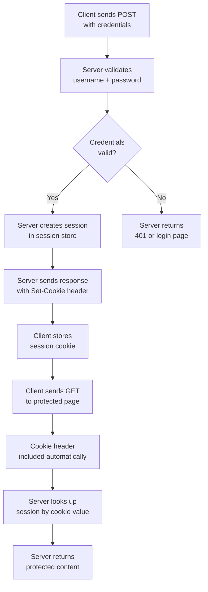
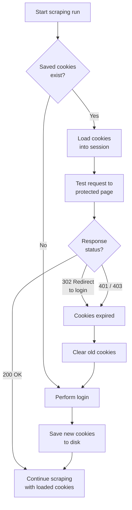

Most authenticated web scraping depends on cookies. Once a server accepts your credentials, it hands back a small token -- a session cookie -- that proves you are logged in. Send that cookie with every subsequent request and you never need to log in again for the lifetime of that session. Lose it, forget to send it, or let it expire without noticing, and every request after the login page will bounce you right back to a login form. The Python `requests` library makes cookie management straightforward through its `Session` object, but there are enough edge cases around persistence, expiration, CSRF tokens, and multi-domain auth that it is worth walking through the full picture. For a comparison of when to use `requests` versus a full browser, see [Python requests vs Selenium for speed and performance](/posts/python-requests-vs-selenium-speed-performance-comparison/).

## How Session Cookies Work

At the HTTP level, cookies are nothing more than headers. After a successful login, the server includes a `Set-Cookie` header in the response. The browser (or your HTTP client) stores this cookie and attaches it to every future request to the same domain via the `Cookie` header.

```
POST /login HTTP/1.1
Host: example.com
Content-Type: application/x-www-form-urlencoded

username=admin&password=secret123

HTTP/1.1 302 Found
Set-Cookie: session_id=a7f3c9e1b2d4; Path=/; HttpOnly; Secure
Location: /dashboard
```

From this point forward, every request to `example.com` includes:

```
GET /dashboard HTTP/1.1
Host: example.com
Cookie: session_id=a7f3c9e1b2d4
```

The server looks up `a7f3c9e1b2d4` in its session store, finds the associated user record, and serves the protected content. No cookie, no access.

## The Login Flow

The full cookie exchange follows a predictable pattern that repeats across nearly every web application.



The critical insight for scraping is that your HTTP client must behave like a browser: store the cookie after login, then attach it to every subsequent request. If you use raw `requests.get()` and `requests.post()` calls without a session, each request starts with a blank cookie jar and the server has no idea you already authenticated.

## Python requests.Session: Automatic Cookie Persistence

The `requests.Session` object is the simplest way to handle this. It maintains a cookie jar internally, captures any `Set-Cookie` headers from responses, and automatically includes stored cookies in future requests.

```python
import requests

session = requests.Session()

# Step 1: Log in
login_data = {
    'username': 'admin',
    'password': 'secret123'
}
response = session.post('https://example.com/login', data=login_data)

# Step 2: Access protected content -- cookie is sent automatically
dashboard = session.get('https://example.com/dashboard')
print(dashboard.status_code)  # 200 if login succeeded

# Step 3: Keep scraping -- session cookie persists
profile = session.get('https://example.com/profile')
orders = session.get('https://example.com/orders')
```

There is no manual cookie extraction or header manipulation. The session object handles the entire lifecycle. It also persists other state across requests, including custom headers, auth tokens, and connection pools, which makes it faster than creating a new connection for every request.

## The Login and Scrape Pattern

A practical authenticated scraper follows this skeleton:

```python
import requests
from bs4 import BeautifulSoup

def create_authenticated_session(login_url, credentials):
    """Log in and return a session with valid cookies."""
    session = requests.Session()

    # Some sites require you to visit the login page first
    # to pick up initial cookies (e.g., CSRF tokens)
    session.get(login_url)

    response = session.post(login_url, data=credentials)

    # Verify login succeeded
    if response.url == login_url:
        raise Exception('Login failed -- still on login page')

    return session

def scrape_protected_page(session, url):
    """Fetch and parse a protected page using an existing session."""
    response = session.get(url)
    response.raise_for_status()
    return BeautifulSoup(response.text, 'html.parser')

# Usage
session = create_authenticated_session(
    'https://example.com/login',
    {'username': 'admin', 'password': 'secret123'}
)

soup = scrape_protected_page(session, 'https://example.com/dashboard')
items = soup.select('.data-row')
for item in items:
    print(item.text.strip())
```

The key pattern is: create the session once, log in once, then reuse the session object for all subsequent requests. The session carries your authentication state everywhere it goes.


<figure>
  
  <figcaption>Sessions are the web's memory — lose them and you start over. <span class="img-credit">Photo by Vladimir Srajber / <a href="https://www.pexels.com" target="_blank" rel="noopener noreferrer">Pexels</a></span></figcaption>
</figure>

## Inspecting Cookies

Sometimes you need to see what cookies the server set, debug authentication issues, or extract a specific cookie value. The `session.cookies` attribute is a `RequestsCookieJar` that supports dictionary-like access and iteration.

```python
import requests

session = requests.Session()
session.post('https://example.com/login', data={
    'username': 'admin',
    'password': 'secret123'
})

# View all cookies
for cookie in session.cookies:
    print(f'{cookie.name}: {cookie.value}')
    print(f'  Domain: {cookie.domain}')
    print(f'  Path:   {cookie.path}')
    print(f'  Secure: {cookie.secure}')
    print(f'  Expires: {cookie.expires}')
    print()

# Get a specific cookie by name
session_id = session.cookies.get('session_id')
print(f'Session ID: {session_id}')

# Get a cookie for a specific domain
token = session.cookies.get('token', domain='api.example.com')

# Check how many cookies are stored
print(f'Total cookies: {len(session.cookies)}')
```

You can also convert the cookie jar to a plain dictionary with `requests.utils.dict_from_cookiejar(session.cookies)` when you need to pass cookies to another tool. If you work with browser-based tools, the same principles apply to [Selenium session management for saving cookies and localStorage](/posts/selenium-session-management-saving-cookies-localstorage/).

## Saving Cookies to Disk

If you are scraping on a schedule, logging in every single run is wasteful and potentially suspicious. Saving cookies to disk lets you restore a valid session without hitting the login endpoint again.

You can use `pickle.dump(session.cookies)` for the simplest approach, but pickle files are not human-readable and unpickling untrusted data is a security risk. JSON is the better choice for a portable, inspectable format.

```python
import json
import requests

session = requests.Session()
session.post('https://example.com/login', data={
    'username': 'admin',
    'password': 'secret123'
})

# Save cookies as JSON
cookies_list = []
for cookie in session.cookies:
    cookies_list.append({
        'name': cookie.name,
        'value': cookie.value,
        'domain': cookie.domain,
        'path': cookie.path,
        'secure': cookie.secure,
        'expires': cookie.expires
    })

with open('cookies.json', 'w') as f:
    json.dump(cookies_list, f, indent=2)

# Load cookies from JSON
session2 = requests.Session()
with open('cookies.json', 'r') as f:
    cookies_list = json.load(f)

for cookie_data in cookies_list:
    session2.cookies.set(
        cookie_data['name'],
        cookie_data['value'],
        domain=cookie_data['domain'],
        path=cookie_data['path']
    )

response = session2.get('https://example.com/dashboard')
```

JSON files are easy to inspect, version-control, and share across different tools or languages.

## Loading Saved Cookies to Skip Login

The complete pattern for cookie-based session resumption checks whether saved cookies exist and are still valid before falling back to a fresh login.

```python
import json
import os
import requests

COOKIE_FILE = 'cookies.json'
LOGIN_URL = 'https://example.com/login'
CHECK_URL = 'https://example.com/dashboard'

def save_cookies(session):
    cookies_list = []
    for cookie in session.cookies:
        cookies_list.append({
            'name': cookie.name,
            'value': cookie.value,
            'domain': cookie.domain,
            'path': cookie.path,
            'secure': cookie.secure,
            'expires': cookie.expires
        })
    with open(COOKIE_FILE, 'w') as f:
        json.dump(cookies_list, f, indent=2)

def load_cookies(session):
    if not os.path.exists(COOKIE_FILE):
        return False
    with open(COOKIE_FILE, 'r') as f:
        cookies_list = json.load(f)
    for c in cookies_list:
        session.cookies.set(c['name'], c['value'],
                            domain=c['domain'], path=c['path'])
    return True

def is_logged_in(session):
    """Check if the current session is still authenticated."""
    response = session.get(CHECK_URL, allow_redirects=False)
    # A redirect to the login page means the session expired
    return response.status_code == 200

def get_authenticated_session():
    session = requests.Session()

    # Try to load existing cookies
    if load_cookies(session) and is_logged_in(session):
        print('Resumed session from saved cookies')
        return session

    # Fall back to fresh login
    print('Logging in...')
    session.cookies.clear()
    session.post(LOGIN_URL, data={
        'username': 'admin',
        'password': 'secret123'
    })
    save_cookies(session)
    return session

session = get_authenticated_session()
page = session.get('https://example.com/protected-data')
print(page.status_code)
```

This approach reduces login frequency, which is polite to the server and less likely to trigger rate limiting or account lockouts.


<figure>
  
  <figcaption>Cookies carry the context that keeps you logged in across requests. <span class="img-credit">Photo by hello aesthe / <a href="https://www.pexels.com" target="_blank" rel="noopener noreferrer">Pexels</a></span></figcaption>
</figure>

## Cookie Expiration and Re-Authentication

Session cookies do not last forever. Servers assign expiration times, and some cookies are session-only, meaning they vanish when the "browser" closes (which for a script means when the process exits). Your scraper needs to handle the moment a session becomes invalid.



A robust implementation wraps requests with automatic re-authentication:

```python
import requests

class AuthenticatedScraper:
    def __init__(self, login_url, credentials, max_retries=2):
        self.login_url = login_url
        self.credentials = credentials
        self.max_retries = max_retries
        self.session = requests.Session()
        self._login()

    def _login(self):
        response = self.session.post(self.login_url, data=self.credentials)
        if response.url == self.login_url:
            raise Exception('Login failed')
        print(f'Logged in, cookies: {len(self.session.cookies)}')

    def _is_auth_failure(self, response):
        """Detect expired sessions."""
        if response.status_code in (401, 403):
            return True
        if response.status_code == 302:
            location = response.headers.get('Location', '')
            if 'login' in location.lower():
                return True
        return False

    def get(self, url, **kwargs):
        """GET with automatic re-authentication on session expiry."""
        kwargs.setdefault('allow_redirects', False)
        for attempt in range(self.max_retries):
            response = self.session.get(url, **kwargs)
            if not self._is_auth_failure(response):
                return response
            print(f'Session expired, re-authenticating (attempt {attempt + 1})')
            self.session.cookies.clear()
            self._login()
        raise Exception(f'Failed to access {url} after {self.max_retries} re-auth attempts')

# Usage
scraper = AuthenticatedScraper(
    'https://example.com/login',
    {'username': 'admin', 'password': 'secret123'}
)

# If the session expires mid-scrape, re-auth happens transparently
for page_num in range(1, 50):
    response = scraper.get(f'https://example.com/data?page={page_num}')
    print(f'Page {page_num}: {response.status_code}')
```

## CSRF Tokens

Many modern web applications include a Cross-Site Request Forgery (CSRF) token in their login forms. The server generates a unique token, embeds it in a hidden form field, and expects it back with the POST request. If your scraper skips this step, the login will fail even with correct credentials.

```python
import requests
from bs4 import BeautifulSoup

session = requests.Session()

# Step 1: GET the login page to retrieve the CSRF token
login_page = session.get('https://example.com/login')
soup = BeautifulSoup(login_page.text, 'html.parser')

# The token is usually in a hidden input field
csrf_token = soup.select_one('input[name="csrf_token"]')['value']
print(f'CSRF token: {csrf_token}')

# Step 2: POST with both credentials and the CSRF token
response = session.post('https://example.com/login', data={
    'username': 'admin',
    'password': 'secret123',
    'csrf_token': csrf_token
})

# Step 3: Now you can scrape authenticated pages
dashboard = session.get('https://example.com/dashboard')
```

Some frameworks (like Django) also store the CSRF token in a cookie. In that case you can pull it from the cookie jar instead of parsing HTML:

```python
session = requests.Session()
session.get('https://example.com/login')

# Django stores the CSRF token in a cookie called csrfmiddlewaretoken
# or csrftoken
csrf_token = session.cookies.get('csrftoken')

# Django also expects the token in a custom header for AJAX requests
session.headers.update({
    'X-CSRFToken': csrf_token,
    'Referer': 'https://example.com/login'
})

response = session.post('https://example.com/login', data={
    'username': 'admin',
    'password': 'secret123',
    'csrfmiddlewaretoken': csrf_token
})
```

The important detail is that the GET request to the login page and the POST request must share the same session. The server ties the CSRF token to the session cookie it issued on the GET, so using a different session for each will always fail.

## Multi-Domain Auth

Some applications split their services across multiple domains. You might log in at `auth.example.com` but scrape data from `api.example.com` and `app.example.com`. Cookies are scoped to domains, so a cookie set for `.example.com` will be sent to all subdomains, but a cookie set for `auth.example.com` will only be sent to that exact subdomain.

```python
import requests

session = requests.Session()

# Log in at the auth domain
session.post('https://auth.example.com/login', data={
    'username': 'admin',
    'password': 'secret123'
})

# Check which cookies we got and their domains
for cookie in session.cookies:
    print(f'{cookie.name} -> {cookie.domain}')
# session_id -> .example.com       (shared across subdomains)
# auth_flag  -> auth.example.com   (auth domain only)

# Requests to api.example.com will include session_id
# but NOT auth_flag
api_data = session.get('https://api.example.com/v1/data')
app_page = session.get('https://app.example.com/dashboard')
```

For browser-level cookie handling, [Playwright's cookie management at the HTTP level](/posts/playwright-cookie-management-http-level-scraping/) offers similar domain-scoping controls. If the application uses a separate API domain that does not share the cookie scope, you may need to extract a token from the login response and set it manually:

```python
# Extract a token from the login response for a different domain
token = session.post('https://auth.example.com/login', data=credentials).json().get('api_token')

# Option 1: Set it as a cookie for the other domain
session.cookies.set('api_token', token, domain='api.otherdomain.com')

# Option 2: Use an Authorization header instead
session.headers.update({'Authorization': f'Bearer {token}'})
```

## Complete Example: Authenticated Scraper with Cookie Persistence

Here is a complete, production-ready scraper that ties together every technique from this post: CSRF handling, cookie persistence, expiration detection, and automatic re-authentication.

```python
import json, os, time, requests
from bs4 import BeautifulSoup

class SessionCookieScraper:
    """Authenticated scraper with cookie persistence and auto re-auth."""

    def __init__(self, config):
        self.login_url = config['login_url']
        self.credentials = config['credentials']
        self.cookie_file = config.get('cookie_file', 'session_cookies.json')
        self.check_url = config.get('check_url', self.login_url)
        self.session = requests.Session()

    # _save_cookies / _load_cookies use the JSON pattern shown above

    def _extract_csrf_token(self):
        """GET the login page and extract a CSRF token if present."""
        response = self.session.get(self.login_url)
        soup = BeautifulSoup(response.text, 'html.parser')
        for name in ('csrf_token', 'csrfmiddlewaretoken', '_token', 'authenticity_token'):
            field = soup.select_one(f'input[name="{name}"]')
            if field:
                return name, field['value']
        csrf_cookie = self.session.cookies.get('csrftoken')
        if csrf_cookie:
            return 'csrfmiddlewaretoken', csrf_cookie
        return None, None

    def _login(self):
        csrf_name, csrf_value = self._extract_csrf_token()
        post_data = dict(self.credentials)
        if csrf_name:
            post_data[csrf_name] = csrf_value
        self.session.post(self.login_url, data=post_data)
        self._save_cookies()

    def ensure_authenticated(self):
        if self._load_cookies() and self._is_authenticated():
            return
        self.session.cookies.clear()
        self._login()

    def get(self, url, **kwargs):
        """GET with automatic re-authentication on 401/403."""
        response = self.session.get(url, **kwargs)
        if response.status_code in (401, 403):
            self.session.cookies.clear()
            self._login()
            response = self.session.get(url, **kwargs)
        return response

# Usage
scraper = SessionCookieScraper({
    'login_url': 'https://example.com/login',
    'credentials': {'username': 'admin', 'password': 'secret123'},
    'check_url': 'https://example.com/dashboard',
})
scraper.ensure_authenticated()

for page in range(1, 11):
    response = scraper.get(f'https://example.com/data?page={page}')
    soup = BeautifulSoup(response.text, 'html.parser')
    for item in soup.select('.result-item'):
        print(item.text.strip())
    time.sleep(1)
```

## Key Takeaways

Session cookie management is not complicated, but it does require attention to a few things that are easy to overlook:

- Always use `requests.Session()` instead of bare `requests.get()` and `requests.post()` calls when dealing with authenticated pages. The session object handles cookie storage and transmission automatically.
- Visit the login page with a GET before POSTing credentials. This picks up initial cookies and CSRF tokens that the server expects. Our guide on [automating web form filling](/posts/how-to-automate-web-form-filling-complete-guide/) covers more complex login flows that require multi-step interaction.
- Save cookies to disk between runs. JSON is portable and inspectable. Pickle is simpler but less transparent.
- Check for cookie expiration before relying on saved cookies. A single test request to a protected page tells you whether the session is still valid.
- Build re-authentication into your scraper. Sessions expire, servers restart, and cookies get invalidated. A scraper that can detect this and log in again without human intervention is far more reliable than one that crashes.
- Pay attention to cookie domains in multi-domain setups. A cookie scoped to `auth.example.com` will not be sent to `api.example.com`.

Cookies are a simple mechanism, but they underpin almost all session management on the web. Handle them correctly in your scraper and you eliminate an entire class of "why is my scraper seeing the login page" bugs.
