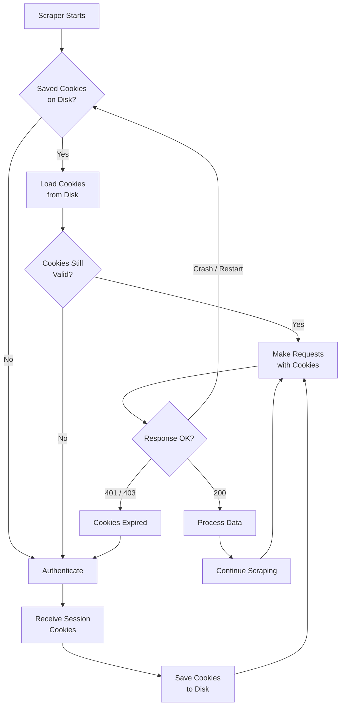
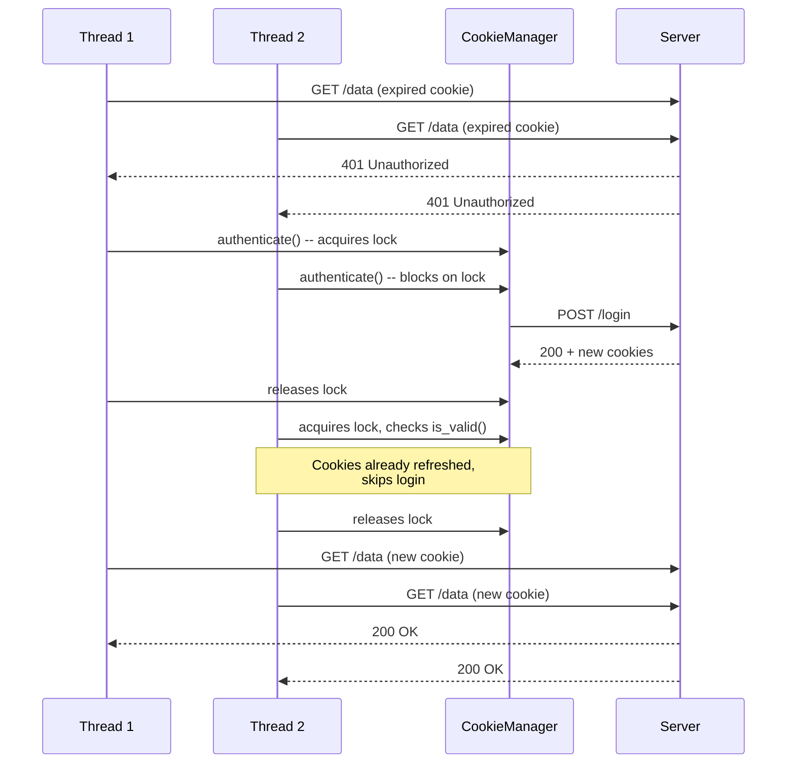

Long-running scrapers live and die by how well they manage cookies. A scraper that runs for hours or days will inevitably face expired authentication tokens, rotated session identifiers, and restarts caused by crashes or deployments. If your cookie state evaporates every time one of these events occurs, your scraper wastes time re-authenticating, loses its place in a crawl, and risks triggering rate limits or account locks from repeated logins. Proper [cookie and session management](/posts/session-management-cookies-storage-user-state/) means your scraper can survive restarts, detect when authentication has lapsed, and renew sessions automatically without human intervention. This post covers every technique you need to build that resilience into your Python scrapers using `requests.Session`, `http.cookiejar`, and browser automation tools.

## The Cookie Lifecycle in a Long-Running Scraper

A long-running scraper goes through a predictable cycle with cookies. It authenticates, receives session cookies, uses them for a potentially unbounded number of requests, and eventually those cookies expire or get invalidated. The scraper must detect this and re-authenticate to continue.



The key insight is that cookie persistence and expiration detection form a loop. Every successful authentication saves state. Every failed request checks whether re-authentication is needed. Every restart loads state from disk instead of starting from scratch.

## Using requests.Session for Automatic Cookie Handling

The `requests.Session` object is the foundation of cookie management in Python scrapers. It maintains a `CookieJar` across requests, automatically sending and receiving cookies just like a browser would.

```python
import requests

session = requests.Session()

# Login -- the session automatically captures Set-Cookie headers
login_payload = {"username": "scraper_user", "password": "s3cret"}
resp = session.post("https://example.com/login", data=login_payload)

# Subsequent requests include the session cookies automatically
data_resp = session.get("https://example.com/api/data?page=1")
print(data_resp.status_code)  # 200, because session cookies are sent

# Inspect the cookies the session is holding
for cookie in session.cookies:
    print(f"{cookie.name} = {cookie.value} (domain={cookie.domain}, expires={cookie.expires})")
```

Without a `Session`, each call to `requests.get()` or `requests.post()` is stateless. The `Set-Cookie` headers from the login response would be discarded, and the next request would arrive at the server without any session identifier. The `Session` object solves this by maintaining a `RequestsCookieJar` internally, which is a subclass of `http.cookiejar.CookieJar`.

You can also pre-load cookies into a session manually:

```python
session.cookies.set("session_id", "abc123", domain="example.com", path="/")
session.cookies.set("csrf_token", "xyz789", domain="example.com", path="/")
```

This is useful when you have cookies from another source, like a browser or a previous scraper run. For the basics of [managing cookies across requests](/posts/session-cookie-management-maintaining-auth-across-requests/), including how `requests.Session` handles `Set-Cookie` headers, our introductory guide covers the fundamentals.

## Persisting Cookies to Disk

A session that only lives in memory is useless across restarts. You need to serialize cookies to disk so the scraper can pick up where it left off.

### JSON Serialization

JSON is human-readable and easy to debug. The trade-off is that you lose some cookie metadata that `http.cookiejar` tracks internally, but for most scraping use cases the essential fields are enough.

```python
import json
import time
from pathlib import Path

COOKIE_FILE = Path("cookies.json")

def save_cookies_json(session, filepath=COOKIE_FILE):
    """Save session cookies to a JSON file."""
    cookies = []
    for cookie in session.cookies:
        cookies.append({
            "name": cookie.name,
            "value": cookie.value,
            "domain": cookie.domain,
            "path": cookie.path,
            "expires": cookie.expires,
            "secure": cookie.secure,
            "rest": {"HttpOnly": cookie.has_nonstandard_attr("HttpOnly")},
        })
    filepath.write_text(json.dumps(cookies, indent=2))

def load_cookies_json(session, filepath=COOKIE_FILE):
    """Load cookies from a JSON file into a session."""
    if not filepath.exists():
        return False
    cookies = json.loads(filepath.read_text())
    for c in cookies:
        session.cookies.set(
            c["name"],
            c["value"],
            domain=c["domain"],
            path=c["path"],
        )
    return True
```

### Using http.cookiejar for Native Persistence

The `http.cookiejar` module in the standard library includes `MozillaCookieJar` and `LWPCookieJar`, both of which support saving and loading cookies to disk in standard formats.

```python
import http.cookiejar
import requests

def create_persistent_session(cookie_path="cookies.txt"):
    """Create a requests session backed by a persistent MozillaCookieJar."""
    cookie_jar = http.cookiejar.MozillaCookieJar(cookie_path)

    # Load existing cookies if the file exists
    try:
        cookie_jar.load(ignore_discard=True, ignore_expires=True)
        print(f"Loaded {len(cookie_jar)} cookies from {cookie_path}")
    except FileNotFoundError:
        print("No existing cookie file, starting fresh")

    session = requests.Session()
    session.cookies = cookie_jar
    return session

def save_session_cookies(session, cookie_path="cookies.txt"):
    """Persist current session cookies to disk."""
    session.cookies.save(ignore_discard=True, ignore_expires=True)
    print(f"Saved {len(session.cookies)} cookies to {cookie_path}")
```

The `ignore_discard=True` flag saves session cookies (those without an explicit expiry) that would normally be discarded when the "browser" closes. The `ignore_expires=True` flag saves cookies even if they have already expired, which can be useful for debugging.

### Pickle Serialization

Pickle preserves the full `CookieJar` object graph, but it is not human-readable and comes with the usual pickle security caveats -- only load pickle files you trust.

```python
import pickle

def save_cookies_pickle(session, filepath="cookies.pkl"):
    with open(filepath, "wb") as f:
        pickle.dump(session.cookies, f)

def load_cookies_pickle(session, filepath="cookies.pkl"):
    try:
        with open(filepath, "rb") as f:
            session.cookies = pickle.load(f)
        return True
    except FileNotFoundError:
        return False
```

For most scraping projects, JSON serialization strikes the right balance. It is debuggable, portable, and does not carry the security baggage of pickle.

## Cookie Expiration Detection

Cookies expire. Session cookies vanish when the process ends. Persistent cookies have an `expires` timestamp after which they should not be sent. And servers can invalidate cookies at any time without the expiry changing. A robust scraper checks for expiration both proactively and reactively.

### Proactive: Checking Expiry Timestamps

```python
import time

def has_valid_cookies(session, required_cookie="session_id"):
    """Check whether the session holds a non-expired required cookie."""
    for cookie in session.cookies:
        if cookie.name == required_cookie:
            if cookie.expires is None:
                return True  # Session cookie -- valid as long as process is alive
            if cookie.expires > time.time():
                return True
            print(f"Cookie '{cookie.name}' expired at {cookie.expires}")
            return False
    print(f"Cookie '{required_cookie}' not found in jar")
    return False
```

### Reactive: Catching 401 and 403 Responses

Proactive checks are not enough. A server might revoke a session at any time. The scraper must treat `401 Unauthorized` and `403 Forbidden` responses as signals that re-authentication is needed.

```python
REAUTH_STATUS_CODES = {401, 403}

def needs_reauth(response):
    """Determine if a response indicates expired authentication."""
    if response.status_code in REAUTH_STATUS_CODES:
        return True

    # Some sites redirect to a login page instead of returning 401/403
    if response.status_code == 200 and "/login" in response.url:
        return True

    return False
```


<figure>
  
  <figcaption>Cookies are small, but they carry the weight of authentication. <span class="img-credit">Photo by hello aesthe / <a href="https://www.pexels.com" target="_blank" rel="noopener noreferrer">Pexels</a></span></figcaption>
</figure>

## Auto-Renewal: Detecting Expired Auth and Re-Authenticating

Combining proactive and reactive detection with automatic re-authentication creates a self-healing scraper. The pattern is straightforward: wrap every request in logic that checks the response and retries after re-authenticating if needed.

```python
import requests
import time
import logging

logger = logging.getLogger(__name__)

class AuthenticatedSession:
    def __init__(self, login_url, credentials, max_retries=2):
        self.login_url = login_url
        self.credentials = credentials
        self.max_retries = max_retries
        self.session = requests.Session()

    def authenticate(self):
        """Perform login and capture session cookies."""
        logger.info("Authenticating at %s", self.login_url)
        resp = self.session.post(self.login_url, data=self.credentials)
        resp.raise_for_status()

        if not self.session.cookies:
            raise RuntimeError("Authentication succeeded but no cookies were set")

        logger.info("Authentication successful, got %d cookies", len(self.session.cookies))

    def request(self, method, url, **kwargs):
        """Make an authenticated request with auto-renewal on auth failure."""
        for attempt in range(self.max_retries + 1):
            resp = self.session.request(method, url, **kwargs)

            if not needs_reauth(resp):
                return resp

            logger.warning(
                "Auth expired (status=%d, url=%s), re-authenticating (attempt %d/%d)",
                resp.status_code, resp.url, attempt + 1, self.max_retries,
            )
            self.authenticate()

        raise RuntimeError(f"Failed to authenticate after {self.max_retries} retries")

    def get(self, url, **kwargs):
        return self.request("GET", url, **kwargs)

    def post(self, url, **kwargs):
        return self.request("POST", url, **kwargs)
```

This pattern keeps the calling code clean. The scraper just calls `session.get(url)` and the session handles re-authentication transparently.

## Building a CookieManager Class

Bringing persistence and renewal together into a single class gives you a reusable component for any long-running scraper.

```python
import json
import time
import logging
import requests
import http.cookiejar
from pathlib import Path

logger = logging.getLogger(__name__)


class CookieManager:
    """Manages cookie persistence, expiration detection, and auto-renewal."""

    def __init__(
        self,
        cookie_file="cookies.json",
        login_url=None,
        credentials=None,
        required_cookie="session_id",
        renewal_buffer_seconds=300,
    ):
        self.cookie_file = Path(cookie_file)
        self.login_url = login_url
        self.credentials = credentials
        self.required_cookie = required_cookie
        self.renewal_buffer = renewal_buffer_seconds
        self.session = requests.Session()
        self._load()

    def _load(self):
        """Load cookies from disk if available."""
        if not self.cookie_file.exists():
            logger.info("No cookie file found at %s", self.cookie_file)
            return

        try:
            data = json.loads(self.cookie_file.read_text())
            for c in data:
                self.session.cookies.set(
                    c["name"], c["value"],
                    domain=c.get("domain", ""),
                    path=c.get("path", "/"),
                )
            logger.info("Loaded %d cookies from %s", len(data), self.cookie_file)
        except (json.JSONDecodeError, KeyError) as exc:
            logger.warning("Failed to load cookies: %s", exc)

    def save(self):
        """Persist current cookies to disk."""
        cookies = []
        for cookie in self.session.cookies:
            cookies.append({
                "name": cookie.name,
                "value": cookie.value,
                "domain": cookie.domain,
                "path": cookie.path,
                "expires": cookie.expires,
                "secure": cookie.secure,
            })
        self.cookie_file.write_text(json.dumps(cookies, indent=2))
        logger.info("Saved %d cookies to %s", len(cookies), self.cookie_file)

    def is_valid(self):
        """Check if required cookies exist and are not expired."""
        for cookie in self.session.cookies:
            if cookie.name == self.required_cookie:
                if cookie.expires is None:
                    return True
                remaining = cookie.expires - time.time()
                if remaining > self.renewal_buffer:
                    return True
                logger.info(
                    "Cookie '%s' expires in %.0f seconds (buffer=%d)",
                    cookie.name, remaining, self.renewal_buffer,
                )
                return False
        return False

    def authenticate(self):
        """Perform login and save new cookies."""
        if not self.login_url or not self.credentials:
            raise RuntimeError("Cannot authenticate: login_url or credentials not set")

        logger.info("Authenticating at %s", self.login_url)
        resp = self.session.post(self.login_url, data=self.credentials)
        resp.raise_for_status()
        self.save()

    def ensure_valid(self):
        """Ensure the session has valid cookies, re-authenticating if needed."""
        if not self.is_valid():
            self.authenticate()

    def request(self, method, url, **kwargs):
        """Make a request with automatic cookie management."""
        self.ensure_valid()
        resp = self.session.request(method, url, **kwargs)

        if resp.status_code in {401, 403}:
            logger.warning("Got %d from %s, re-authenticating", resp.status_code, url)
            self.authenticate()
            resp = self.session.request(method, url, **kwargs)

        return resp

    def get(self, url, **kwargs):
        return self.request("GET", url, **kwargs)

    def post(self, url, **kwargs):
        return self.request("POST", url, **kwargs)
```

Usage is straightforward:

```python
manager = CookieManager(
    cookie_file="scraper_cookies.json",
    login_url="https://example.com/login",
    credentials={"username": "scraper", "password": "s3cret"},
    required_cookie="session_id",
    renewal_buffer_seconds=600,  # renew 10 minutes before expiry
)

for page in range(1, 1001):
    resp = manager.get(f"https://example.com/api/products?page={page}")
    products = resp.json()
    process_products(products)

    # Save cookies periodically so a crash does not lose state
    if page % 50 == 0:
        manager.save()
```

## Browser Automation Cookies: Saving Playwright and Selenium State

When scraping sites that require a full browser -- heavy JavaScript, anti-bot checks, complex [login and form automation flows](/posts/how-to-automate-web-form-filling-complete-guide/) -- you need to persist browser-level cookies between runs.

### Playwright Storage State

Playwright has built-in support for saving and restoring the entire browser context state, including cookies and localStorage.

```python
from playwright.sync_api import sync_playwright
import json
from pathlib import Path

STORAGE_FILE = "playwright_state.json"

def save_playwright_state(context, filepath=STORAGE_FILE):
    """Save browser context state including cookies and localStorage."""
    state = context.storage_state()
    Path(filepath).write_text(json.dumps(state, indent=2))

def scrape_with_playwright():
    with sync_playwright() as p:
        browser = p.chromium.launch(headless=True)

        # Try to restore previous state
        if Path(STORAGE_FILE).exists():
            context = browser.new_context(storage_state=STORAGE_FILE)
            print("Restored previous browser state")
        else:
            context = browser.new_context()
            page = context.new_page()

            # Perform login
            page.goto("https://example.com/login")
            page.fill("#username", "scraper_user")
            page.fill("#password", "s3cret")
            page.click("#login-button")
            page.wait_for_url("**/dashboard**")

            # Save state after login
            save_playwright_state(context)
            print("Saved browser state after login")

        # Now scrape with authenticated context
        page = context.new_page()
        page.goto("https://example.com/data")
        data = page.content()

        # Save state periodically
        save_playwright_state(context)
        browser.close()
```

### Selenium Cookie Management

Selenium does not have a built-in storage state mechanism, so you have to extract and restore cookies manually.

```python
from selenium import webdriver
from selenium.webdriver.chrome.options import Options
import json
from pathlib import Path

SELENIUM_COOKIE_FILE = "selenium_cookies.json"

def save_selenium_cookies(driver, filepath=SELENIUM_COOKIE_FILE):
    """Save Selenium cookies to JSON."""
    cookies = driver.get_cookies()
    Path(filepath).write_text(json.dumps(cookies, indent=2))

def load_selenium_cookies(driver, url, filepath=SELENIUM_COOKIE_FILE):
    """Load cookies into a Selenium driver."""
    if not Path(filepath).exists():
        return False

    # Must navigate to the domain first before setting cookies
    driver.get(url)
    cookies = json.loads(Path(filepath).read_text())

    for cookie in cookies:
        # Remove keys that Selenium does not accept in add_cookie
        cookie.pop("sameSite", None)
        try:
            driver.add_cookie(cookie)
        except Exception as e:
            print(f"Skipped cookie {cookie.get('name')}: {e}")

    driver.refresh()
    return True
```

The important detail with Selenium is that you must navigate to the target domain before calling `add_cookie()`. Selenium enforces domain scoping -- you cannot set a cookie for `example.com` while the driver is on `about:blank`.


<figure>
  
  <figcaption>Managing cookies well means fewer blocked requests and more reliable scraping. <span class="img-credit">Photo by Anastasia  Shuraeva / <a href="https://www.pexels.com" target="_blank" rel="noopener noreferrer">Pexels</a></span></figcaption>
</figure>

## Cookie Jars for Multiple Sites

A scraper that targets multiple sites needs separate cookie management for each domain. Mixing cookies across domains causes subtle bugs and can leak session tokens to the wrong server.

```python
class MultiSiteCookieManager:
    """Manage separate cookie state for multiple target domains."""

    def __init__(self, cookie_dir="cookies"):
        self.cookie_dir = Path(cookie_dir)
        self.cookie_dir.mkdir(exist_ok=True)
        self.managers = {}

    def get_manager(self, domain, login_url=None, credentials=None):
        """Get or create a CookieManager for a specific domain."""
        if domain not in self.managers:
            cookie_file = self.cookie_dir / f"{domain.replace('.', '_')}.json"
            self.managers[domain] = CookieManager(
                cookie_file=str(cookie_file),
                login_url=login_url,
                credentials=credentials,
            )
        return self.managers[domain]

    def save_all(self):
        """Persist cookies for all managed domains."""
        for domain, manager in self.managers.items():
            manager.save()

    def get(self, url, **kwargs):
        """Route a request through the correct domain-specific manager."""
        from urllib.parse import urlparse
        domain = urlparse(url).netloc
        manager = self.get_manager(domain)
        return manager.get(url, **kwargs)
```

Each domain gets its own `CookieManager` instance, its own cookie file on disk, and its own authentication credentials. The `get()` method parses the URL to route requests through the correct manager automatically.

## Thread Safety: Sharing Cookies Across Concurrent Scrapers

When running concurrent scraping threads or async tasks, the cookie jar becomes a shared mutable resource. Without synchronization, you get race conditions -- two threads might detect an expired cookie and both try to re-authenticate simultaneously, stomping on each other's session.

```python
import threading
import requests
import logging

logger = logging.getLogger(__name__)


class ThreadSafeCookieManager(CookieManager):
    """A CookieManager that is safe to share across threads."""

    def __init__(self, **kwargs):
        self._lock = threading.Lock()
        super().__init__(**kwargs)

    def authenticate(self):
        with self._lock:
            # Double-check: another thread may have already re-authenticated
            if self.is_valid():
                logger.info("Another thread already refreshed cookies")
                return
            super().authenticate()

    def save(self):
        with self._lock:
            super().save()

    def request(self, method, url, **kwargs):
        # ensure_valid and the actual request must be atomic
        with self._lock:
            self.ensure_valid()

        # The request itself can run without holding the lock
        resp = self.session.request(method, url, **kwargs)

        if resp.status_code in {401, 403}:
            self.authenticate()
            resp = self.session.request(method, url, **kwargs)

        return resp
```

The double-check pattern inside `authenticate()` is critical. When multiple threads detect a 401 simultaneously, only the first one should actually log in. The others should see that the cookies are now valid and skip the redundant authentication.



For `asyncio`-based scrapers, replace `threading.Lock` with `asyncio.Lock` and use `aiohttp.ClientSession` instead of `requests.Session`.

## Common Issues

### Secure Cookies Over HTTP

Cookies marked with the `Secure` flag are only sent over HTTPS connections. If your scraper is connecting over plain HTTP -- for example through a local proxy for debugging -- secure cookies will silently disappear from requests.

```python
# Check if you are accidentally dropping secure cookies
for cookie in session.cookies:
    if cookie.secure:
        print(f"WARNING: '{cookie.name}' is Secure-only, requires HTTPS")
```

### Domain Scoping

A cookie set for `.example.com` is sent to `www.example.com`, `api.example.com`, and any other subdomain. A cookie set for `www.example.com` (without the leading dot) is only sent to that exact host. If your scraper authenticates on `www.example.com` but fetches data from `api.example.com`, the session cookie might not be included. Iterate over `session.cookies` and compare each cookie's `domain` against the target URL's hostname to diagnose missing cookies.

### Path Matching

A cookie with `path=/api` is only sent for requests to URLs starting with `/api`. If the login endpoint sets a cookie with a restrictive path, requests to other paths will not include it. Check `cookie.path` for any cookie that is not set to `"/"`.

### Cookie Size and Count Limits

Browsers limit cookies to about 4 KB each and roughly 50 cookies per domain. If a site sets a very large number of cookies, some may be silently dropped. The `requests` library does not enforce these limits, but upstream proxies or load balancers might.

## Putting It All Together

The `CookieManager` class above already handles every scenario a long-running scraper needs: it loads cookies on startup, detects expiration before and during requests, re-authenticates automatically, and saves state after each login. To build a production scraper, instantiate the manager, add a signal handler to call `manager.save()` on shutdown, and wrap your main loop around `manager.get()`. Add the `MultiSiteCookieManager` when you target multiple domains. Wrap it in `ThreadSafeCookieManager` when you add concurrency. Swap in Playwright's `storage_state` when a full browser is required. The core loop -- load, validate, use, renew, save -- stays the same regardless of the underlying HTTP client.

The pattern scales to more complex setups, including [keeping logins alive](/posts/user-session-persistence-keeping-logins-alive-automation/) across days-long runs. The `RENEWAL_BUFFER` in the `CookieManager` ensures re-authentication happens before the cookie actually expires, avoiding the brief window where a request goes out with a cookie that expires between sending the request and receiving the response.
