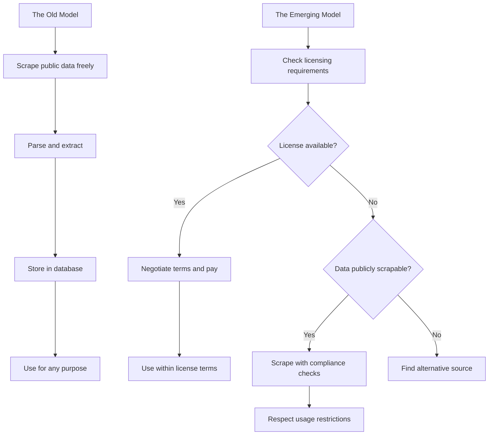
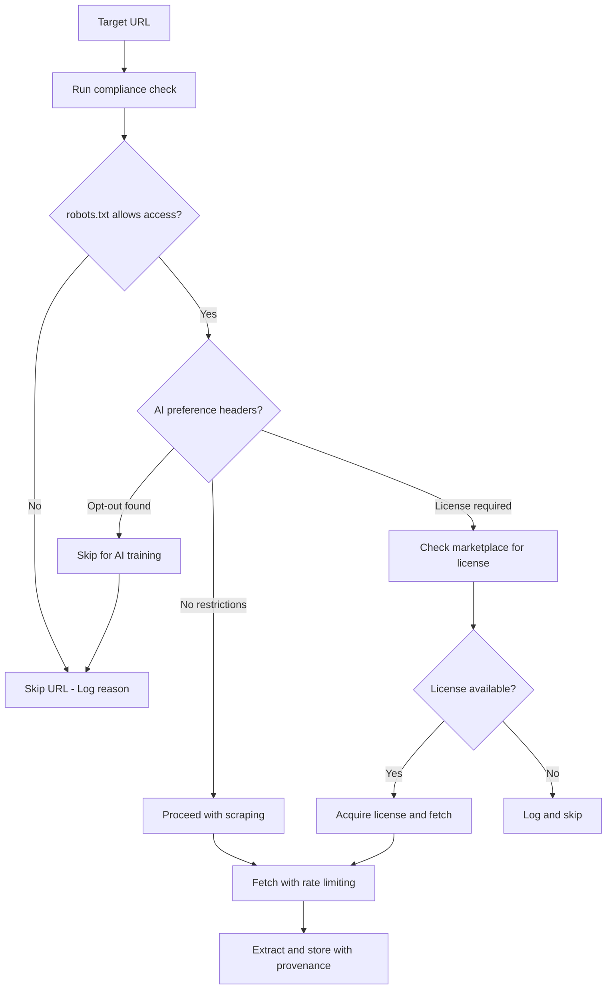

On February 4, 2026, Microsoft launched its Publisher Content Marketplace -- a platform where publishers set licensing terms and AI companies pay for the right to use their content as training data. Launch partners include Business Insider, Conde Nast, Hearst, The Associated Press, USA TODAY, and Vox Media. This is not a subtle move. It is a signal that the era of scraping everything and sorting out the consequences later is coming to an end.

For anyone who builds and maintains web scrapers, this is the most important industry shift in years. Not because scraping is going away -- it is not -- but because the boundary between what you can scrape and what you should license is becoming formalized, standardized, and increasingly enforced.

## The Old Model vs The New Model

For most of web scraping's history, the implicit rule was simple: if data is publicly accessible, it is fair game. You request a page, parse the HTML, extract what you need, and store it. The website's only recourse was to block your IP, implement CAPTCHAs, or send a cease-and-desist letter. The legal situation was ambiguous enough that most scrapers operated in a gray zone.

That model is breaking down under the pressure of AI training at scale. When a language model consumes millions of articles to learn how to generate text, the economic impact on publishers is qualitatively different from a price-comparison scraper pulling product listings. The content is not just being read -- it is being absorbed, repurposed, and used to generate competing output.



## The Legal Cases That Got Us Here

Microsoft's marketplace did not appear in a vacuum. It is the product of a rapidly evolving legal environment that has made the costs of unauthorized scraping increasingly clear.

### Reddit vs Perplexity AI (October 2025)

Reddit sued Perplexity AI for scraping its platform to generate AI-powered search answers. Reddit's argument was straightforward: Perplexity was taking user-generated content at scale, producing summaries that competed directly with Reddit's own traffic, and paying nothing for the privilege. The case put a spotlight on how AI companies consume content that communities create.

### Anthropic Lawsuit (June 2025)

Reddit also pursued legal action against Anthropic in June 2025 over similar scraping claims. The pattern was consistent: large AI companies ingesting community-generated content to train models, without compensation or explicit permission from the platform.

### Meta vs Bright Data (2024)

In a result that surprised many in the scraping community, Meta lost its case against Bright Data. The court found that scraping publicly available data did not violate the Computer Fraud and Abuse Act. This ruling mattered because it reaffirmed that public data scraping itself is not inherently illegal -- but it also highlighted that the legal question is moving beyond access rights toward usage rights. You may be allowed to scrape the data, but what you do with it afterward is where the legal risk now lives.

### IETF AIPREF Working Group (January 2026)

The Internet Engineering Task Force launched the AIPREF working group in January 2026, tasked with developing technical standards for how websites communicate their preferences about AI consumption of their content. Think of it as a next-generation robots.txt specifically for AI crawlers -- a machine-readable way for publishers to say "you can index this for search, but not for training."

## The Economics of Scraping vs Licensing

The AI-based web scraping market is projected to reach $3.16 billion by 2029, and 62% of scraping professionals reported increased spending across 2025 and 2026. These numbers reflect a simple reality: demand for web data is accelerating, even as access is becoming more restricted and expensive.

The economic calculus for scraping teams breaks down into three parts.

The cost of scraping includes infrastructure (proxies, browsers, compute), engineering time to maintain scrapers against anti-bot systems, legal exposure, and reputation risk. These costs have been rising steadily as websites invest in protection.

The cost of licensing includes direct per-article or per-dataset fees, API access costs, contractual compliance overhead, and usage restrictions. These costs are predictable and come with legal certainty.

Then there is the hidden cost of not licensing: lawsuits, negative publicity, platform bans, and the possibility that scraped data becomes legally toxic -- meaning you cannot use models trained on it without indemnification risk.

For many use cases, the licensing path is already economically rational. If you are training a model on news articles, paying a fraction of a cent per article through Microsoft's marketplace is cheaper than maintaining a fleet of rotating proxies, solving CAPTCHAs, and retaining a legal team.

## Cloudflare's 402 Payment Required

Cloudflare has been rolling out support for HTTP 402 (Payment Required) responses, which allow websites to signal that content access requires payment or licensing. This is a quiet but notable infrastructure change. When the CDN layer itself can enforce licensing requirements, the technical barrier to scraping licensed content becomes much higher.

The following examples show how to handle 402 responses in your scraping code.

```python
import requests
import json

class LicenseAwareScraper:
    def __init__(self):
        self.session = requests.Session()
        self.session.headers.update({
            "User-Agent": "MyBot/1.0 (contact@example.com)"
        })

    def fetch(self, url):
        """
        Fetch a URL with license-aware response handling.
        """
        response = self.session.get(url, allow_redirects=True)

        if response.status_code == 200:
            return {"status": "ok", "content": response.text}

        elif response.status_code == 402:
            # Payment Required -- content is behind a license
            licensing_info = self.extract_licensing_info(response)
            return {
                "status": "license_required",
                "licensing": licensing_info,
                "content": None,
            }

        elif response.status_code == 403:
            return {"status": "forbidden", "content": None}

        else:
            return {"status": f"error_{response.status_code}", "content": None}

    def extract_licensing_info(self, response):
        """
        Parse licensing metadata from a 402 response.
        """
        info = {}

        # Check for licensing headers
        if "X-License-URL" in response.headers:
            info["license_url"] = response.headers["X-License-URL"]

        if "X-Content-License" in response.headers:
            info["license_type"] = response.headers["X-Content-License"]

        # Check response body for licensing details
        try:
            body = response.json()
            if "licensing" in body:
                info.update(body["licensing"])
        except (json.JSONDecodeError, ValueError):
            pass

        return info

# Usage
scraper = LicenseAwareScraper()
result = scraper.fetch("https://news.example.com/article/12345")

if result["status"] == "license_required":
    print(f"This content requires a license: {result['licensing']}")
elif result["status"] == "ok":
    print(f"Content retrieved: {len(result['content'])} chars")
```

```javascript
// JavaScript equivalent for Node.js scrapers

async function licenseAwareFetch(url) {
    const response = await fetch(url, {
        headers: {
            "User-Agent": "MyBot/1.0 (contact@example.com)"
        }
    });

    if (response.status === 200) {
        const content = await response.text();
        return { status: "ok", content };
    }

    if (response.status === 402) {
        const licenseUrl = response.headers.get("X-License-URL");
        const licenseType = response.headers.get("X-Content-License");

        let bodyLicensing = {};
        try {
            const body = await response.json();
            bodyLicensing = body.licensing || {};
        } catch (e) {
            // Response body may not be JSON
        }

        return {
            status: "license_required",
            licensing: { licenseUrl, licenseType, ...bodyLicensing }
        };
    }

    return { status: `error_${response.status}`, content: null };
}

// Usage
const result = await licenseAwareFetch("https://news.example.com/article/12345");
if (result.status === "license_required") {
    console.log("License needed:", result.licensing);
}
```

## Checking for AI Preference Signals

With the IETF AIPREF working group developing standards, forward-thinking scrapers should already be checking for AI-specific directives. While the formal standard is still in development, several publishers have started using draft headers and robots.txt extensions to signal their preferences.

```python
from urllib.robotparser import RobotFileParser
import requests

class AIComplianceChecker:
    def __init__(self, user_agent="MyAIBot/1.0"):
        self.user_agent = user_agent

    def check_robots_txt(self, base_url):
        """
        Check robots.txt for both standard and AI-specific directives.
        """
        rp = RobotFileParser()
        robots_url = f"{base_url.rstrip('/')}/robots.txt"
        rp.set_url(robots_url)
        rp.read()

        standard_allowed = rp.can_fetch(self.user_agent, base_url)

        # Also check for common AI-specific bot names
        ai_bots = ["GPTBot", "ChatGPT-User", "CCBot", "anthropic-ai"]
        ai_restrictions = {}
        for bot in ai_bots:
            ai_restrictions[bot] = rp.can_fetch(bot, base_url)

        return {
            "standard_allowed": standard_allowed,
            "ai_restrictions": ai_restrictions,
        }

    def check_ai_headers(self, url):
        """
        Check response headers for AI content preference signals.
        """
        response = requests.head(url, headers={
            "User-Agent": self.user_agent
        })

        preferences = {}

        # Draft AIPREF headers
        if "X-AI-Preference" in response.headers:
            preferences["ai_preference"] = response.headers["X-AI-Preference"]

        if "X-Training-Opt-Out" in response.headers:
            preferences["training_opt_out"] = (
                response.headers["X-Training-Opt-Out"].lower() == "true"
            )

        # TDM (Text and Data Mining) reservation headers
        if "TDM-Reservation" in response.headers:
            preferences["tdm_reservation"] = response.headers["TDM-Reservation"]

        return preferences

    def full_compliance_check(self, url):
        """
        Run all compliance checks before crawling.
        """
        from urllib.parse import urlparse
        base_url = f"{urlparse(url).scheme}://{urlparse(url).netloc}"

        robots = self.check_robots_txt(base_url)
        headers = self.check_ai_headers(url)

        return {
            "url": url,
            "robots_txt": robots,
            "ai_headers": headers,
            "recommendation": self.get_recommendation(robots, headers),
        }

    def get_recommendation(self, robots, headers):
        if not robots["standard_allowed"]:
            return "DO NOT CRAWL - blocked by robots.txt"

        if headers.get("training_opt_out"):
            return "DO NOT USE FOR TRAINING - publisher has opted out"

        if headers.get("tdm_reservation"):
            return "CHECK LICENSE - TDM reservation in effect"

        blocked_ai_bots = [
            bot for bot, allowed in robots["ai_restrictions"].items()
            if not allowed
        ]
        if blocked_ai_bots:
            return f"CAUTION - AI bots blocked: {', '.join(blocked_ai_bots)}"

        return "PROCEED WITH STANDARD COMPLIANCE"

# Usage
checker = AIComplianceChecker(user_agent="MyResearchBot/1.0")
report = checker.full_compliance_check("https://news.example.com/article/12345")

print(f"URL: {report['url']}")
print(f"Recommendation: {report['recommendation']}")
print(f"AI Headers: {report['ai_headers']}")
```

## Building a Compliant Scraping Pipeline

Putting all of this together, the following pattern shows how to build scrapers that respect the emerging licensing rules while still being effective at data collection.



```python
import asyncio
import json
from datetime import datetime

class CompliantScrapingPipeline:
    def __init__(self, config):
        self.checker = AIComplianceChecker(user_agent=config["user_agent"])
        self.results = []
        self.skipped = []

    async def process_urls(self, urls):
        """
        Process a list of URLs with full compliance checking.
        """
        for url in urls:
            compliance = self.checker.full_compliance_check(url)
            recommendation = compliance["recommendation"]

            if recommendation.startswith("DO NOT"):
                self.skipped.append({
                    "url": url,
                    "reason": recommendation,
                    "timestamp": datetime.utcnow().isoformat(),
                })
                continue

            if recommendation.startswith("CHECK LICENSE"):
                # Log for manual review
                self.skipped.append({
                    "url": url,
                    "reason": "License check needed",
                    "tdm_info": compliance["ai_headers"].get("tdm_reservation"),
                    "timestamp": datetime.utcnow().isoformat(),
                })
                continue

            # Proceed with compliant scraping
            content = await self.fetch_with_provenance(url, compliance)
            if content:
                self.results.append(content)

    async def fetch_with_provenance(self, url, compliance):
        """
        Fetch content and attach provenance metadata.
        """
        import aiohttp

        async with aiohttp.ClientSession() as session:
            async with session.get(url) as response:
                if response.status == 200:
                    text = await response.text()
                    return {
                        "url": url,
                        "content": text,
                        "fetched_at": datetime.utcnow().isoformat(),
                        "compliance": {
                            "robots_allowed": True,
                            "ai_restrictions": compliance["robots_txt"]["ai_restrictions"],
                            "recommendation": compliance["recommendation"],
                        },
                    }

                elif response.status == 402:
                    self.skipped.append({
                        "url": url,
                        "reason": "402 Payment Required",
                        "timestamp": datetime.utcnow().isoformat(),
                    })

        return None

    def export_provenance_log(self, filepath):
        """
        Export a full log of what was scraped and what was skipped.
        """
        log = {
            "scraped": len(self.results),
            "skipped": len(self.skipped),
            "skipped_details": self.skipped,
            "generated_at": datetime.utcnow().isoformat(),
        }
        with open(filepath, "w") as f:
            json.dump(log, f, indent=2)

# Usage
pipeline = CompliantScrapingPipeline(config={
    "user_agent": "MyResearchBot/1.0 (contact@example.com)"
})

urls = [
    "https://news.example.com/article/1",
    "https://news.example.com/article/2",
    "https://blog.example.com/post/100",
]

asyncio.run(pipeline.process_urls(urls))
pipeline.export_provenance_log("./provenance_log.json")
```

## What This Means for Scraping Professionals

The shift from scraping to licensing will not happen overnight, and it will not be absolute. There will always be legitimate uses for web scraping that do not require licensing -- competitive intelligence on public pricing, academic research, search engine indexing, and personal data collection all remain on solid legal and ethical ground.

But if you are scraping content at scale to train AI models, or if you are building a product that repurposes publisher content, the calculus has changed. Microsoft's marketplace makes it cheaper and easier to do the right thing than to risk a lawsuit. The IETF AIPREF standards will make it technically straightforward for websites to communicate their preferences. And court cases like Reddit vs Perplexity AI are establishing precedents that make unauthorized AI training increasingly risky.

Some practical steps for anyone building scraping infrastructure today:

Build compliance checks into your pipeline from day one. Adding licensing awareness to a new system is much easier than retrofitting it onto an existing one. The code examples above show that the overhead is minimal.

Track provenance for every piece of scraped data. Know where your data came from, when it was collected, and what the compliance status was at collection time. If your data ever gets audited -- and in an era of AI regulation, that is increasingly likely -- you want a clean paper trail.

Monitor the IETF AIPREF working group. The standards they produce will likely become the de facto way websites communicate AI preferences. Early adoption of these standards will save retrofitting work later.

Evaluate Microsoft's Publisher Content Marketplace for your use case. If you are already spending significant money on proxy infrastructure to scrape news content, licensing that content directly may be cheaper and comes with zero legal risk.

The web scraping industry is not dying -- it is maturing. The tools, the legal frameworks, and the business models are all evolving toward a more sustainable equilibrium. The professionals who adapt early will be best positioned as the new rules solidify.
