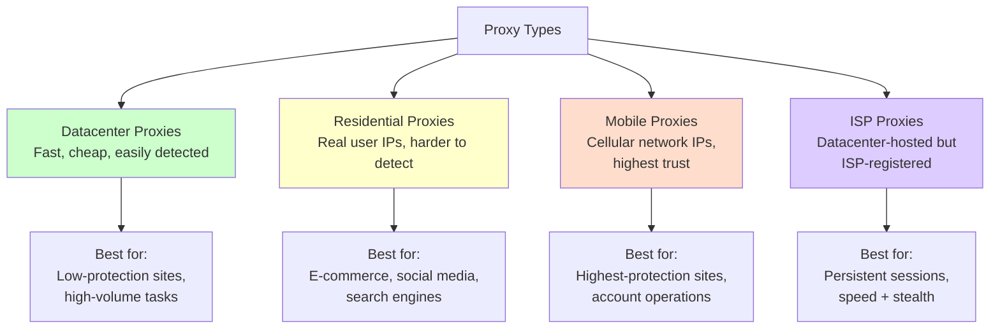
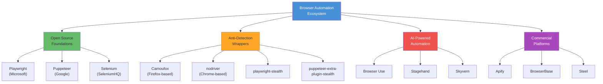
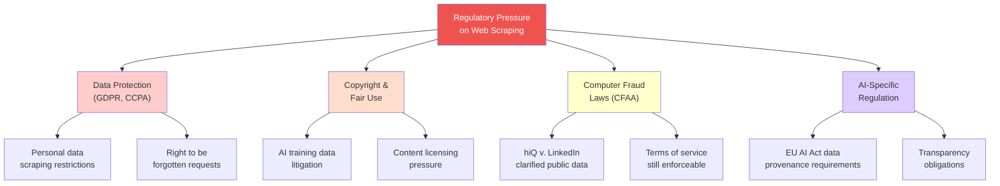
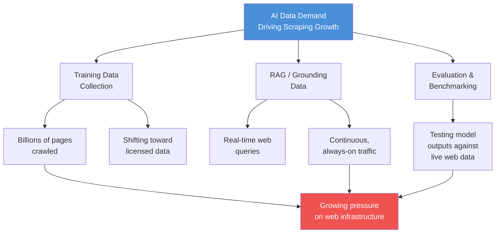
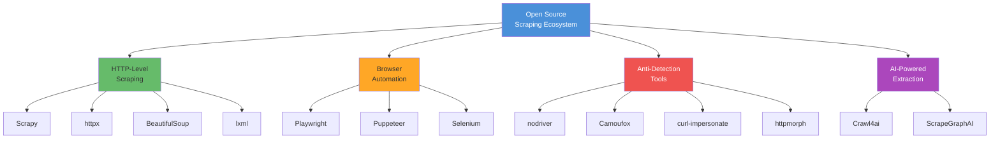
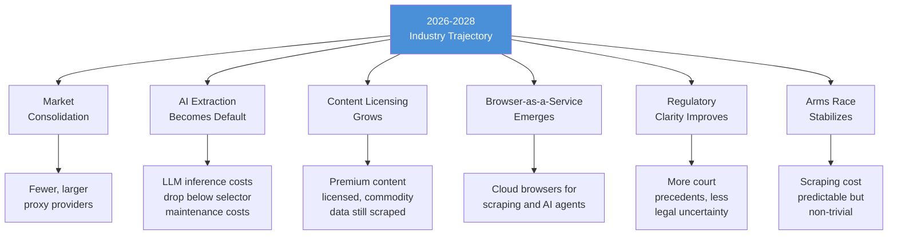

Web scraping has evolved from a niche technical activity practiced by a handful of data engineers into a multi-billion dollar industry with its own ecosystem of vendors, tools, and career paths. What was once a DIY affair -- writing BeautifulSoup scripts to grab prices off a handful of product pages -- now encompasses enterprise-grade scraping platforms, residential proxy networks spanning millions of IPs, AI-powered data extraction engines, and an entire anti-bot defense industry that exists specifically to counter scrapers. The market has matured, professionalized, and, in the process, become one of the most important but least understood segments of the broader data economy.

This post maps the web scraping industry as it stands in early 2026: who the major players are, how big the market is, what trends are reshaping the landscape, and where things are headed over the next two to three years.

## Market Size and Growth

Estimating the exact size of the web scraping market is difficult because the industry spans multiple categories that market research firms track separately -- web scraping tools, proxy services, data extraction platforms, anti-bot solutions, and pre-packaged data marketplaces. Taken together, credible estimates place the global web scraping services and tools market somewhere between $8 billion and $12 billion in 2026, depending on what you include in the definition.

Several data points help frame the scale:

- The proxy services market alone was valued at approximately $4.2 billion in 2025, according to estimates from Verified Market Research, with residential proxies driving the majority of growth.
- Grand View Research estimated the broader data extraction and web scraping tools market at $3.8 billion in 2024, projecting compound annual growth rates above 13% through 2030.
- The anti-bot detection and mitigation market -- companies like Cloudflare, Akamai, PerimeterX (now HUMAN), and DataDome -- adds another $2-3 billion, and this segment is growing even faster than scraping itself.
- Data marketplace and data-as-a-service revenue (companies selling pre-scraped datasets) contributes an additional $1-2 billion.

The growth is being driven by several converging forces: the explosion of AI training data demand, the shift toward real-time data for retrieval-augmented generation, increasing e-commerce competition requiring continuous price and product monitoring, and financial services firms that consume alternative data feeds at scale.

```mermaid
flowchart TD
    A["Web Scraping Industry<br>~$8-12B Total Market (2026)"] --> B["Proxy Services<br>~$4.2B"]
    A --> C["Scraping Tools &<br>Platforms ~$3.8B"]
    A --> D["Anti-Bot &<br>Detection ~$2-3B"]
    A --> E["Data Marketplaces<br>& DaaS ~$1-2B"]

    B --> B1["Residential Proxies"]
    B --> B2["Datacenter Proxies"]
    B --> B3["Mobile Proxies"]
    B --> B4["ISP Proxies"]

    C --> C1["Scraping-as-a-Service"]
    C --> C2["Browser Automation"]
    C --> C3["Open Source Tools"]
    C --> C4["AI Extraction Engines"]

    D --> D1["Bot Detection"]
    D --> D2["CAPTCHA Services"]
    D --> D3["Fingerprinting"]
    D --> D4["Rate Limiting"]

    E --> E1["Pre-Built Datasets"]
    E --> E2["Custom Data Feeds"]
    E --> E3["AI Training Data"]
    E --> E4["Content Licensing"]

    style A fill:#4a90d9,color:#fff
    style B fill:#66bb6a
    style C fill:#ffa726
    style D fill:#ef5350,color:#fff
    style E fill:#ab47bc,color:#fff
```



<figure>
  
  <figcaption>The infrastructure behind web data collection has become its own industry. <span class="img-credit">Photo by Brett Sayles / <a href="https://www.pexels.com" target="_blank" rel="noopener noreferrer">Pexels</a></span></figcaption>
</figure>

## Key Industry Segments

The web scraping industry is not a monolith. It breaks down into several distinct segments, each with its own business models, competitive dynamics, and growth drivers.

### Scraping-as-a-Service (SaaS Platforms)

These are companies that offer managed scraping infrastructure -- you tell them what data you want, and they handle the crawling, proxy rotation, CAPTCHA solving, and data delivery. The value proposition is that customers do not need to build or maintain scraping infrastructure themselves.

**Major players:**

- **Bright Data** (formerly Luminati) -- The largest player in this space, offering both proxy infrastructure and a full scraping platform. Bright Data operates one of the world's largest residential proxy networks with over 72 million IPs.
- **Oxylabs** -- A direct competitor to Bright Data, headquartered in Lithuania, with a strong proxy network and scraping API products. Their Scraper API product handles JavaScript rendering and anti-bot bypass.
- **Zyte** (formerly Scrapinghub) -- The company behind Scrapy, the most popular open-source scraping framework. Zyte offers a commercial platform (Scrapy Cloud) and an automatic extraction API.
- **ScrapingBee** -- A developer-focused scraping API that handles headless browser rendering and proxy rotation. Popular with smaller teams and individual developers.
- **Apify** -- A platform for running web scraping and automation scripts (called "actors") in the cloud. Apify has built a marketplace where developers publish and monetize their scrapers.

These platforms typically charge per API call or per successful data delivery, with pricing that ranges from fractions of a cent per request for simple pages to several cents per request for JavaScript-heavy pages that require full browser rendering.

### Proxy Providers

Proxy infrastructure is the backbone of commercial web scraping. Without proxies, scrapers get IP-banned quickly. The proxy market has become increasingly sophisticated, with providers offering residential, datacenter, mobile, and ISP proxy types.



**Major proxy providers include:**

- **Bright Data** -- Market leader with 72M+ residential IPs
- **Oxylabs** -- 100M+ residential IPs, strong in enterprise
- **Smartproxy** -- Mid-market positioning, competitive pricing
- **IPRoyal** -- Budget-friendly residential proxies
- **NetNut** -- ISP proxy specialist
- **Soax** -- Mobile and residential proxy focus
- **PacketStream** -- Peer-to-peer residential proxy network

Proxy pricing has been falling on a per-gigabyte basis due to increased competition, but total spending continues to climb because volume is growing even faster. In 2025, roughly 58% of scraping professionals reported increased proxy budgets year over year.

### Anti-Bot Vendors

Every action has a reaction. The growth of commercial scraping has spawned an equally large anti-bot detection and mitigation industry. These companies sell to website operators who want to distinguish bots from humans and block unwanted automated access.

**Major anti-bot companies:**

- **Cloudflare** -- The dominant player, protecting over 20% of all websites. Their Bot Management product uses machine learning, behavioral analysis, and their massive traffic dataset to detect bots. In 2026, Cloudflare's AI Labyrinth feature introduced honeypot pages designed to trap and waste the resources of AI scrapers.
- **Akamai** -- Enterprise-focused bot management through their Bot Manager product, leveraging their CDN's traffic visibility.
- **HUMAN** (formerly PerimeterX and White Ops) -- Specializes in bot detection using behavioral biometrics and device intelligence.
- **DataDome** -- Real-time bot detection with a focus on e-commerce and classified ads sites.
- **Kasada** -- Takes a different approach by making automation computationally expensive through proof-of-work challenges.
- **Imperva** -- Offers bot management as part of their broader web application security suite.

The anti-bot market is growing faster than scraping itself, which tells you something about the escalation dynamics. As scraping tools get better at evading detection, anti-bot vendors develop more sophisticated countermeasures, which in turn drives demand for better scraping tools. It is a self-reinforcing cycle that benefits vendors on both sides.

### Data Marketplaces

Rather than scraping data yourself, you can buy pre-collected datasets from data marketplaces. This segment has grown significantly as AI companies need training data and enterprises need alternative data for analytics.

**Key players:**

- **Bright Data's Data Collector** -- Pre-built dataset products alongside their scraping infrastructure
- **Datarade** -- A marketplace connecting data buyers with data providers
- **Databricks Marketplace** -- Offering data products alongside their analytics platform
- **AWS Data Exchange** -- Amazon's marketplace for third-party data
- **Microsoft's Content Marketplace** -- A newer entrant, positioning itself as a legitimate alternative to scraping by facilitating direct licensing deals between AI companies and content publishers

### Browser Automation Tools

Browser automation is the engine that powers JavaScript-heavy scraping. This segment includes both open-source tools and commercial products built on top of them.



## Trends Shaping 2026

Six major trends are reshaping the web scraping industry in 2026. Understanding these trends is essential for anyone building, buying, or defending against scrapers.

### 1. AI-Powered Scraping Replacing Manual Selector Writing

The most transformative trend in scraping right now is the shift from manually writing CSS selectors and XPath expressions to using LLMs for data extraction. Traditional scraping is brittle: you write selectors targeting specific HTML elements, and when the site changes its layout, your selectors break and you have to rewrite them.

AI-powered scraping changes this equation. Instead of telling a scraper exactly which `div.product-price span.amount` element to extract, you describe what data you want in natural language or as a structured schema, and an LLM figures out where that data lives on the page.

Tools like Crawl4ai, ScrapeGraphAI, and the structured output features of commercial platforms like Zyte and Apify are making this practical. The workflow looks like this:

```python
# Traditional approach -- brittle selectors
price = page.query_selector("div.product-price span.amount").text_content()
title = page.query_selector("h1.product-title").text_content()

# AI-powered approach -- schema-driven extraction
from pydantic import BaseModel

class Product(BaseModel):
    title: str
    price: float
    currency: str
    availability: str
    description: str

# The LLM figures out where these fields are on the page
result = extractor.extract(html=page_content, schema=Product)
```

The tradeoff is cost and speed. LLM-based extraction is slower and more expensive per page than hand-written selectors. For large-scale, ongoing scraping jobs where the target sites are stable, traditional selectors still win on economics. But for one-off extractions, scraping across many different sites with different layouts, or situations where maintenance cost matters more than per-page cost, AI extraction is increasingly the better choice.

### 2. Content Licensing vs. Scraping

A significant shift is underway in how AI companies access web content. Rather than simply scraping everything and dealing with legal risk, some companies are pursuing licensing agreements with content publishers.

Microsoft's Content Marketplace is the most visible example. Launched in late 2025, it positions itself as a legitimate alternative to scraping by facilitating direct deals between AI companies that need training and grounding data, and publishers who want to monetize their content. The idea is that publishers set terms and prices, AI companies get clean data with clear legal rights, and everyone avoids the legal uncertainty of unlicensed scraping.

Whether licensing will replace scraping is a different question. The historical precedent from the music industry (Napster to Spotify) suggests that a mix of licensed and unlicensed access tends to persist, with licensing gradually capturing more of the market as enforcement mechanisms improve and the cost of compliance drops. In the web data context, licensing is likely to dominate for high-value, attribution-sensitive content (news articles, academic papers, premium datasets) while scraping continues for commodity data (product prices, public records, job listings) where licensing does not make economic sense.

### 3. Anti-Bot Escalation Driving Tool Innovation

The arms race between scrapers and anti-bot systems is accelerating. In 2025 and early 2026, several developments raised the bar significantly:

- **Cloudflare's AI Labyrinth** -- Honeypot pages that generate fake but plausible content to waste scraper resources. Instead of simply blocking bots, Labyrinth traps them in endless loops of AI-generated pages.
- **TLS fingerprinting maturation** -- Anti-bot services now routinely analyze the TLS handshake to identify automation tools. Each browser has a distinctive TLS fingerprint (the cipher suites it supports, the order it presents them, the extensions it includes), and most automation tools produce fingerprints that differ from real browsers. Tools like httpmorph and curl-impersonate exist specifically to solve this problem.
- **Behavioral analysis** -- Moving beyond simple IP reputation and rate limiting, anti-bot systems now model human behavior patterns: mouse movements, scroll patterns, typing rhythms, and navigation sequences. Bot traffic that moves too quickly, too uniformly, or in patterns that deviate from human norms gets flagged.
- **Shadow DOM adoption** -- More sites are using Shadow DOM to encapsulate page components, which breaks traditional DOM-based selector approaches.

Each escalation on the defense side drives innovation on the scraping side, fueling the rise of [stealth browsers like Camoufox and nodriver](/posts/stealth-browsers-in-2026-camoufox-nodriver-and-the-anti-detection-arms-race/). The result is a market where both scraping tools and anti-bot products are getting more sophisticated and more expensive, creating a growing addressable market for vendors on both sides.

### 4. Regulatory Pressure

The legal and regulatory landscape around web scraping is getting more complex, not less. Several regulatory threads are converging:

**GDPR and data protection** -- In the EU, scraping personal data without a lawful basis remains a legal risk. The distinction between publicly available data and data you can freely collect and process is not as clear-cut as many scrapers assume. Several enforcement actions in 2024 and 2025 targeted companies that scraped personal data from social media platforms.

**AI training data debates** -- The ongoing litigation between content creators and AI companies (NYT v. OpenAI, Getty v. Stability AI, and others) is creating uncertainty about whether scraping content for AI training constitutes fair use. While these cases have not fully resolved, the legal risk is pushing some AI companies toward licensing arrangements.

**The Computer Fraud and Abuse Act (CFAA)** -- In the US, the hiQ v. LinkedIn Supreme Court decision (2022) clarified that scraping publicly accessible data does not violate the CFAA, but the scope of that ruling is still being tested in subsequent cases. Terms of service violations remain a separate and more ambiguous legal theory.

**The EU AI Act** -- Enacted in 2024 with phased implementation through 2026, requires transparency about training data sources for certain categories of AI systems. This creates compliance incentives for AI companies to use licensed data with clear provenance rather than scraped data of uncertain origin.



### 5. Browser Automation Converging with AI Agents

Browser automation is no longer just about scraping. A major trend in 2026 is the convergence of browser automation tools with AI agent frameworks. Instead of writing scripts that follow hardcoded navigation paths, AI agents can use browsers as tools -- clicking, typing, navigating, and extracting data based on high-level instructions.

This convergence is happening through several channels:

- **MCP (Model Context Protocol) servers** -- Microsoft's Playwright and Google's Puppeteer now have MCP server implementations that allow AI models to control browsers through a standardized protocol. An AI agent can launch a browser, navigate to a page, interact with elements, and extract data without anyone writing page-specific automation code.
- **Agent frameworks** -- Projects like Browser Use, Stagehand, and Skyvern wrap browser automation in agent-friendly interfaces. Browser Use, for example, lets an LLM control a Playwright browser through natural language commands.
- **Commercial browser-as-a-service** -- Companies like BrowserBase and Steel provide cloud-hosted browsers designed specifically for AI agent use cases, handling the infrastructure complexity of running browsers at scale.

This trend matters for the scraping industry because it lowers the technical barrier to entry. Tasks that previously required a skilled developer to write and maintain Playwright scripts can increasingly be accomplished by an AI agent operating a browser. The long-term implication is that the "writing scrapers" part of the value chain may get commoditized, shifting value toward data processing, analysis, and the business applications built on top of scraped data.

### 6. The AI Training Data Connection

The single largest demand driver for web scraping in 2025-2026 has been AI companies collecting training data for large language models. This demand is massive, unprecedented, and has fundamentally changed the economics of the scraping industry.

The scale is staggering. Major AI labs are scraping billions of pages. Common Crawl, the open dataset that many LLMs use as a training data source, contains over 250 billion pages. But AI companies also conduct their own proprietary crawls to get fresher, higher-quality, or more domain-specific data.

As noted in our analysis of [the AI bot traffic explosion](/posts/the-ai-bot-traffic-explosion-what-1-bot-per-31-humans-means-for-the-web/), the nature of AI-driven scraping demand is shifting from batch training data collection to continuous RAG (retrieval-augmented generation) queries. This shift has important implications:

- **Volume:** RAG-driven scraping is continuous, not periodic, meaning total request volume is higher
- **Freshness:** RAG needs current data, so caching and dataset reuse are less effective
- **Breadth:** RAG queries hit a wider variety of sites than focused training crawls
- **Legal exposure:** Real-time RAG queries are harder to characterize as fair use than batch training data collection



## Career Opportunities

The growth of the web scraping industry has created a range of career paths that did not exist a decade ago. If you work with web data, these are the roles with the strongest demand:

**Data Engineer (Scraping Focus)** -- Building and maintaining scraping pipelines at scale. This role requires proficiency in Python, familiarity with browser automation tools (Playwright, Puppeteer), proxy management, and distributed systems. Compensation ranges from $120K to $200K at well-funded startups and mid-size companies, with senior roles at companies like Bright Data or Zyte paying at the upper end.

**Scraping Specialist / Web Data Engineer** -- A more focused role that lives at the intersection of web technologies and data engineering. You need deep knowledge of HTTP, HTML/CSS, JavaScript rendering, anti-bot evasion techniques, and data quality assurance. These roles are common at data-as-a-service companies and competitive intelligence firms.

**Anti-Bot Researcher** -- Working on the defense side, analyzing bot behavior, developing detection algorithms, and staying ahead of evasion techniques. Companies like Cloudflare, HUMAN, DataDome, and Kasada hire for these roles. Backgrounds in security research, machine learning, and browser internals are valuable. This is a niche but well-compensated specialty.

**AI Data Operations** -- A newer role emerging at AI companies, focused on managing the data collection pipeline that feeds model training and RAG systems. This includes designing crawling strategies, managing data quality, handling licensing relationships, and ensuring compliance with data protection regulations.

**Freelance Scraping Developer** -- A viable freelance career path. Platforms like Upwork and Fiverr have active markets for scraping projects, and rates for experienced developers range from $50 to $200 per hour depending on complexity. Many freelancers also build and sell pre-built scraper templates on platforms like Apify's marketplace.

<figure>
  
  <figcaption>Web scraping skills are in demand across data engineering, ML, and product teams. <span class="img-credit">Photo by Daniil Komov / <a href="https://www.pexels.com" target="_blank" rel="noopener noreferrer">Pexels</a></span></figcaption>
</figure>

## The Open Source Ecosystem

Open source tools form the foundation of the web scraping industry. Even companies that sell commercial scraping products typically build on top of open-source components. For a detailed [comparison of SaaS, code, and browser extension approaches](/posts/data-scraping-tools-comparison-saas-code-browser-extensions/), see our tools landscape overview. The major projects:

**Scrapy** -- The most mature and widely used open-source scraping framework, written in Python. Maintained by Zyte (formerly Scrapinghub), Scrapy provides a structured, pipeline-based approach to building scrapers. It handles request scheduling, retry logic, data pipelines, and can scale to millions of pages. Scrapy is best suited for HTTP-level scraping of static or server-rendered pages.

**Playwright** -- Microsoft's browser automation library, available in Python, JavaScript, TypeScript, Java, and .NET. Playwright has become the dominant tool for JavaScript-heavy scraping because it supports Chromium, Firefox, and WebKit, and provides built-in features for waiting on dynamic content, intercepting network requests, and managing browser contexts. Its MCP server integration is making it a key tool for AI agent workflows.

**Puppeteer** -- Google's Node.js library for controlling Chrome and Chromium. Puppeteer was the standard for browser-based scraping before Playwright emerged, and it remains widely used, especially in Node.js ecosystems. Our [Playwright vs Puppeteer vs Selenium vs Scrapy mega comparison](/posts/playwright-vs-puppeteer-vs-selenium-vs-scrapy-2026-mega-comparison/) breaks down exactly how they stack up in 2026. Its integration with Chrome DevTools Protocol provides fine-grained control over browser behavior.

**Crawl4ai** -- An open-source framework specifically designed for AI-oriented web scraping. Crawl4ai focuses on extracting structured data from web pages using LLMs, with features like schema-driven extraction, session management, and built-in support for multiple LLM providers. It represents the newer generation of scraping tools that treat AI extraction as a first-class feature.

**nodriver** -- A Python library for [undetected Chrome automation](/posts/nodriver-complete-guide-undetected-browser-automation-python/). Unlike Playwright or Puppeteer, nodriver patches Chrome at a lower level to avoid detection by anti-bot systems. It does not use the Chrome DevTools Protocol in the standard way, making it harder for anti-bot scripts to detect. nodriver is the successor to the popular undetected-chromedriver library.

**Other notable projects:**

- **BeautifulSoup** -- HTML/XML parsing library, often the first tool beginners learn
- **lxml** -- High-performance HTML/XML parser, faster than BeautifulSoup for large documents
- **httpx** -- Modern async HTTP client for Python, increasingly replacing requests for scraping
- **Camoufox** -- Anti-detection Firefox browser based on LibreWolf, designed to resist fingerprinting
- **curl-impersonate** -- Curl fork that mimics real browser TLS fingerprints
- **httpmorph** -- Python HTTP client with native TLS fingerprint impersonation



## Challenges Facing the Industry

Despite its growth, the web scraping industry faces significant challenges that could shape its trajectory:

**Legal uncertainty** -- The legal status of web scraping varies by jurisdiction and is still evolving. The hiQ v. LinkedIn decision provided some clarity in the US for publicly accessible data, but ongoing AI training data lawsuits, GDPR enforcement in Europe, and the patchwork of global data protection laws create a complex compliance landscape. Companies operating at scale need legal counsel, and the cost of legal risk is becoming a meaningful line item.

**Ethical debates** -- Beyond legality, the ethics of web scraping are contested. Scraping public data for price comparison feels different from scraping copyrighted articles to train a competitor's AI model. The industry lacks a widely accepted ethical framework, and the debate over AI training data has made this more contentious. Some practitioners advocate for strict adherence to robots.txt and site terms of service. Others argue that publicly accessible data should be freely available. The reality is that the industry operates in a gray area that makes both positions defensible and neither fully satisfying.

**Technical arms race** -- The escalating sophistication of both scraping and anti-bot tools means that the cost of playing the game keeps rising. What worked a year ago may not work today. TLS fingerprinting, behavioral analysis, Shadow DOM encapsulation, AI-generated honeypot pages -- each new defensive technique requires scrapers to invest in new tools and approaches. This dynamic favors well-funded operations over small teams and individual developers, potentially consolidating the market around larger players.

**Infrastructure costs** -- Despite falling per-unit prices for proxies and compute, total infrastructure costs for scraping operations continue to climb. The shift from HTTP-level scraping to full browser rendering has dramatically increased compute requirements. A Scrapy spider consuming a few hundred megabytes of RAM can be replaced by a Playwright-based scraper that needs gigabytes of RAM per browser instance. Cloud browser services like BrowserBase help manage this complexity but add their own costs.

**Data quality** -- As anti-bot systems deploy honeypot pages with fake data, and as websites increasingly serve different content to suspected bots, data quality has become a growing concern. A scraper that successfully bypasses anti-bot detection can still collect garbage data if the site is serving decoy content. Verifying the accuracy and completeness of scraped data is becoming a critical part of the scraping workflow.

## Predictions for the Next Two to Three Years

Based on current trajectories, here is where the web scraping industry is likely heading by 2028:

**Market consolidation.** The proxy market is already consolidating, with larger players acquiring smaller ones. Expect the same pattern in scraping-as-a-service and anti-bot detection. The number of viable independent proxy providers will shrink as Bright Data, Oxylabs, and a few others achieve scale advantages that smaller competitors cannot match.

**AI extraction becomes the default.** Within two to three years, AI-powered data extraction will be the standard approach for new scraping projects, with traditional selector-based scraping reserved for high-volume, cost-sensitive jobs where the target sites are stable. The cost of LLM inference is dropping fast enough that the economics will tip in favor of AI extraction for most use cases.

**Content licensing grows but does not replace scraping.** Licensing arrangements like Microsoft's Content Marketplace will capture a growing share of AI training data acquisition, particularly for premium content. But scraping will remain the dominant method for commodity data, real-time monitoring, and any use case where licensing is impractical or uneconomical.

**Browser-as-a-service becomes a category.** Cloud-hosted browsers designed for scraping and AI agent use cases will become a recognized product category. BrowserBase, Steel, and similar services will grow, and major cloud providers (AWS, GCP, Azure) may launch their own managed browser services.

**Regulatory clarity improves, slowly.** The current wave of AI-related litigation will produce more precedents over the next two to three years. While a single clear legal framework is unlikely, the accumulation of court decisions, regulatory guidance, and industry self-regulation will reduce uncertainty compared to the current state. Companies that invest in compliance infrastructure now will have an advantage.

**The anti-bot arms race reaches an equilibrium.** Not a cessation, but a stabilization. The back-and-forth between scrapers and anti-bot systems will settle into a pattern where the cost of scraping a well-protected site is significant but predictable. The winners will be vendors who can operate at that cost point efficiently, and the losers will be small-scale scrapers who cannot afford the infrastructure to bypass modern defenses.



## Where This Leaves Practitioners

If you work in web scraping -- building scrapers, selling scraping services, defending against bots, or consuming scraped data -- the industry you operate in has grown up. It is no longer a wild west where anyone with a Python script and a VPS can scrape anything. It is an industry with real revenue, real regulation, real competition, and real career paths.

The practical takeaways:

- **If you are building scrapers:** Invest in AI-powered extraction skills alongside traditional selector-based approaches. Learn how MCP servers and AI agent frameworks interact with browser automation. Both skills will be needed for the foreseeable future.
- **If you are buying scraping services:** The market has enough competition that you should be evaluating multiple vendors. Ask about data quality verification, legal compliance, and how they handle anti-bot detection. The cheapest provider is rarely the best value.
- **If you are defending against scraping:** Understand that determined, well-funded scrapers will get through. Your goal is to raise the cost of scraping to a level that deters casual and medium-effort scrapers while making the economics less attractive for large-scale operations. Honeypot pages, behavioral analysis, and TLS fingerprinting are the current state of the art.
- **If you are looking at this as a career:** The demand for scraping expertise is growing faster than the supply. Data engineering roles with scraping experience command premium compensation, and the intersection of scraping and AI is where the most interesting work is happening.

The web scraping industry in 2026 is mature enough to be taken seriously and young enough that significant opportunities remain. The companies and practitioners who navigate the legal, technical, and ethical complexities well will be the ones who capture the most value as the market continues to grow.
