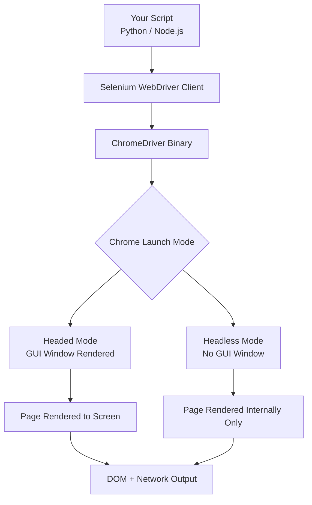
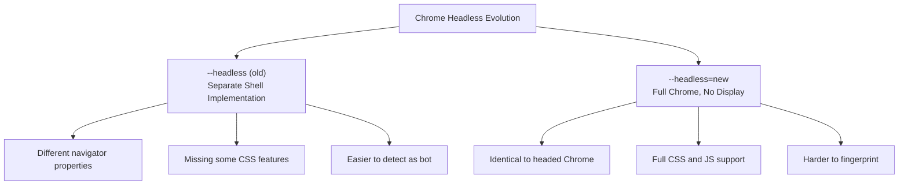
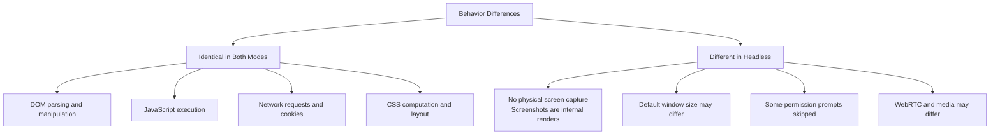

Headless mode runs Chrome without a visible browser window. There is no GUI, no address bar, no rendered pixels hitting your monitor -- just a fully functional browser engine executing in the background. This is not a stripped-down simulation. Headless Chrome uses the same Blink rendering engine and V8 JavaScript engine as regular Chrome, producing identical DOM output and network behavior. For servers without a display, CI/CD pipelines running automated tests, and production scraping infrastructure, headless operation is not optional. It is the only mode that makes sense when there is no screen to render to.

## How Headless Mode Actually Works

When Chrome launches in headless mode, it skips the compositor and window management layers. The page still renders internally -- CSS is computed, layout is calculated, JavaScript executes -- but the final step of painting pixels to a screen buffer is eliminated. This distinction matters because it means headless Chrome can still take screenshots and generate PDFs. It is doing all the work; it just does not send the output to a physical display.



Both modes produce the same DOM. The difference is purely about whether the rendering pipeline outputs to a display.

## Python Selenium Headless Setup

Modern Selenium 4+ makes headless configuration straightforward. The key is using `--headless=new`, the updated headless mode introduced in Chrome 112.

```python
from selenium import webdriver
from selenium.webdriver.chrome.options import Options
from selenium.webdriver.common.by import By
from selenium.webdriver.support.ui import WebDriverWait
from selenium.webdriver.support import expected_conditions as EC

def create_headless_driver():
    options = Options()
    options.add_argument('--headless=new')
    options.add_argument('--no-sandbox')
    options.add_argument('--disable-dev-shm-usage')
    options.add_argument('--disable-gpu')
    options.add_argument('--window-size=1920,1080')

    driver = webdriver.Chrome(options=options)
    return driver

driver = create_headless_driver()
driver.get('https://example.com')

# Wait for an element, just like headed mode
wait = WebDriverWait(driver, 10)
heading = wait.until(
    EC.presence_of_element_located((By.TAG_NAME, 'h1'))
)
print(heading.text)

driver.quit()
```

Every Selenium 4 API call works identically in headless mode. Element finding, clicking, form filling, JavaScript execution, cookie management -- none of it changes. The only difference is that no window appears on your screen.

## Node.js Selenium Headless Setup

The Node.js equivalent follows the same pattern. Install `selenium-webdriver` via npm and configure Chrome options.

```javascript
const { Builder, By, until } = require('selenium-webdriver');
const chrome = require('selenium-webdriver/chrome');

async function createHeadlessDriver() {
    const options = new chrome.Options();
    options.addArguments('--headless=new');
    options.addArguments('--no-sandbox');
    options.addArguments('--disable-dev-shm-usage');
    options.addArguments('--disable-gpu');
    options.addArguments('--window-size=1920,1080');

    const driver = await new Builder()
        .forBrowser('chrome')
        .setChromeOptions(options)
        .build();

    return driver;
}

(async () => {
    const driver = await createHeadlessDriver();

    try {
        await driver.get('https://example.com');
        const heading = await driver.wait(
            until.elementLocated(By.tagName('h1')),
            10000
        );
        console.log(await heading.getText());
    } finally {
        await driver.quit();
    }
})();
```

The API surface is nearly identical across languages. If you know how to drive Selenium in Python, the Node.js version reads the same way with different syntax.

## The "New" Headless Mode

Chrome has two headless implementations, and the difference between them matters significantly.

The old `--headless` flag (now called `--headless=old`) launched a separate headless shell that shared the rendering engine but had a different browser implementation. This caused subtle behavioral differences. Some JavaScript APIs returned unexpected values, certain CSS features were not fully supported, and the browser fingerprint was distinctly different from regular Chrome.

Chrome 112 introduced `--headless=new`, which runs the full headed Chrome browser with the display output disabled. This is a critical change. The new headless mode uses exactly the same browser code path as headed Chrome, meaning:

```python
# Old headless -- separate implementation, behavioral differences
options.add_argument('--headless')       # Equivalent to --headless=old

# New headless -- same as headed Chrome, no display output
options.add_argument('--headless=new')   # Use this one
```

The practical impact is substantial. Pages that broke under old headless mode work correctly with `--headless=new`. Navigator properties, WebGL rendering, and media APIs all behave identically to headed Chrome. If you are still using `--headless` without `=new`, switch immediately.



## Common Additional Flags

Beyond `--headless=new`, several flags are commonly needed depending on your environment. Each one solves a specific problem.

```python
options = Options()
options.add_argument('--headless=new')

# Required when running as root (Docker, CI/CD)
# Chrome refuses to run as root with sandboxing enabled
options.add_argument('--no-sandbox')

# /dev/shm is too small in many Docker containers (default 64MB)
# This flag tells Chrome to write shared memory files to /tmp instead
options.add_argument('--disable-dev-shm-usage')

# Prevents GPU-related crashes on Linux servers without GPU hardware
options.add_argument('--disable-gpu')

# Set explicit window size -- headless defaults can be small
# Many responsive sites serve different content at different widths
options.add_argument('--window-size=1920,1080')

# Disable extensions to reduce attack surface and startup time
options.add_argument('--disable-extensions')

# Reduce noise in logs
options.add_argument('--log-level=3')

# Disable image loading for faster page loads when scraping text
# options.add_argument('--blink-settings=imagesEnabled=false')
```

On Linux servers, `--no-sandbox` and `--disable-dev-shm-usage` are effectively mandatory. Without them, Chrome will crash on startup in most container environments. On macOS and Windows development machines, they are typically unnecessary but harmless.


<figure>
  
  <figcaption>Selenium pioneered browser automation and remains widely used today. <span class="img-credit">Photo by ThisIsEngineering / <a href="https://www.pexels.com" target="_blank" rel="noopener noreferrer">Pexels</a></span></figcaption>
</figure>

## ChromeDriver Version Management

ChromeDriver must match your installed Chrome version. A ChromeDriver built for Chrome 120 will not work with Chrome 122. This version coupling is the single most common source of Selenium setup failures.

There are three approaches to solving this, from most manual to most automated.

**Manual download:** Visit the ChromeDriver downloads page, find the version matching your Chrome installation, download the binary, and place it in your PATH. This works but breaks every time Chrome auto-updates.

**webdriver-manager:** A Python package that automatically downloads the correct ChromeDriver version at runtime.

```python
# pip install webdriver-manager
from selenium import webdriver
from selenium.webdriver.chrome.service import Service
from webdriver_manager.chrome import ChromeDriverManager

service = Service(ChromeDriverManager().install())
options = webdriver.ChromeOptions()
options.add_argument('--headless=new')

driver = webdriver.Chrome(service=service, options=options)
```

**Selenium Manager (built-in):** Since Selenium 4.6, the library includes its own driver management tool called Selenium Manager. If you do not specify a driver path or service, Selenium automatically downloads and caches the correct ChromeDriver.

```python
from selenium import webdriver

# Selenium Manager handles ChromeDriver automatically
# No service object, no webdriver-manager, just this:
options = webdriver.ChromeOptions()
options.add_argument('--headless=new')

driver = webdriver.Chrome(options=options)
```

Selenium Manager is the simplest approach and works well for most use cases. It caches drivers in `~/.cache/selenium/` and only downloads when the cached version does not match the installed browser. For production environments where you control the Chrome version precisely, pinning a specific ChromeDriver in your Docker image is more reliable.

## Docker Setup for CI/CD

Running headless Chrome in Docker is the standard approach for production scraping and CI/CD pipelines. Here is a minimal Dockerfile that works.

```dockerfile
FROM python:3.12-slim

# Install Chrome dependencies
RUN apt-get update && apt-get install -y \
    wget \
    gnupg2 \
    apt-transport-https \
    ca-certificates \
    && wget -q -O - https://dl.google.com/linux/linux_signing_key.pub | apt-key add - \
    && echo "deb [arch=amd64] http://dl.google.com/linux/chrome/deb/ stable main" \
        > /etc/apt/sources.list.d/google-chrome.list \
    && apt-get update \
    && apt-get install -y google-chrome-stable \
    && apt-get clean \
    && rm -rf /var/lib/apt/lists/*

# Install Python dependencies
COPY requirements.txt .
RUN pip install --no-cache-dir -r requirements.txt

COPY scraper.py .

CMD ["python", "scraper.py"]
```

The corresponding `requirements.txt` is minimal:

```text
selenium>=4.15.0
```

And the scraper script running inside Docker needs the container-appropriate flags:

```python
from selenium import webdriver
from selenium.webdriver.chrome.options import Options

def create_docker_driver():
    options = Options()
    options.add_argument('--headless=new')
    options.add_argument('--no-sandbox')
    options.add_argument('--disable-dev-shm-usage')
    options.add_argument('--disable-gpu')
    options.add_argument('--window-size=1920,1080')
    options.add_argument('--single-process')

    # Selenium Manager finds Chrome and downloads ChromeDriver
    driver = webdriver.Chrome(options=options)
    return driver
```

For CI/CD systems like GitHub Actions, many runners provide Chrome pre-installed. You can skip the Docker setup entirely and run Selenium directly in the workflow:

```yaml
# .github/workflows/scrape.yml
name: Scrape
on:
  schedule:
    - cron: '0 */6 * * *'

jobs:
  scrape:
    runs-on: ubuntu-latest
    steps:
      - uses: actions/checkout@v4
      - uses: actions/setup-python@v5
        with:
          python-version: '3.12'
      - run: pip install selenium
      - run: python scraper.py
```

GitHub Actions runners include Chrome and ChromeDriver out of the box. Selenium Manager handles matching them automatically.

## Headless vs Headed: What Actually Changes

Most behavior is identical between headless and headed mode when using `--headless=new`. But there are edge cases worth knowing about.



Screenshots taken in headless mode are rendered internally, not captured from a physical display. This means they are pixel-perfect and unaffected by screen resolution, DPI settings, or other windows overlapping your browser. In some ways, headless screenshots are more reliable than headed ones.

The default window size in headless mode can be different from headed mode. Always set `--window-size` explicitly to avoid responsive layout differences. A site that renders a desktop layout in your headed browser might show a mobile layout in headless if the default viewport is smaller.

Permission dialogs (notifications, geolocation, camera) are automatically denied in headless mode since there is no UI to display them. If your scraping target requires granting permissions, you need to set them via Chrome preferences:

```python
options = Options()
options.add_argument('--headless=new')

# Grant geolocation permission
prefs = {
    'profile.default_content_setting_values.geolocation': 1,
    'profile.default_content_setting_values.notifications': 1,
}
options.add_experimental_option('prefs', prefs)
```

## Debugging Headless Sessions

The biggest disadvantage of headless mode is that you cannot see what is happening. When a script fails, you are debugging blind unless you set up proper visibility tools.

**Screenshots on failure** are your first line of defense:

```python
from selenium import webdriver
from selenium.webdriver.chrome.options import Options

options = Options()
options.add_argument('--headless=new')
options.add_argument('--window-size=1920,1080')
driver = webdriver.Chrome(options=options)

try:
    driver.get('https://example.com')
    # ... your automation steps ...
except Exception as e:
    driver.save_screenshot('/tmp/debug_screenshot.png')
    with open('/tmp/debug_page.html', 'w') as f:
        f.write(driver.page_source)
    raise
finally:
    driver.quit()
```

**Saving page source** alongside screenshots gives you the DOM state at the moment of failure. Many bugs are immediately obvious when you look at the actual HTML the browser received.

**Chrome remote debugging** lets you attach DevTools to a running headless instance. This is the most powerful debugging technique:

```python
options = Options()
options.add_argument('--headless=new')
options.add_argument('--remote-debugging-port=9222')

driver = webdriver.Chrome(options=options)
driver.get('https://example.com')
# Browser is now running, navigate to chrome://inspect in another Chrome window
# or open http://localhost:9222 to see available targets
```

With remote debugging enabled, you can open `chrome://inspect` in a regular Chrome window, find your headless instance under "Remote Target", and click "inspect" to get full DevTools access. You can inspect the DOM, watch network requests, debug JavaScript, and see the rendered page in real time. This is invaluable for diagnosing why a selector is not finding an element or why a page is not loading correctly.

**Console log capture** lets you see JavaScript errors without DevTools:

```python
from selenium import webdriver
from selenium.webdriver.chrome.options import Options

options = Options()
options.add_argument('--headless=new')
options.add_argument('--enable-logging')

driver = webdriver.Chrome(options=options)
driver.get('https://example.com')

# Get browser console logs
for entry in driver.get_log('browser'):
    print(f"[{entry['level']}] {entry['message']}")
```


<figure>
  
  <figcaption>A decade of Selenium set the stage for everything that followed. <span class="img-credit">Photo by Lukas Blazek / <a href="https://www.pexels.com" target="_blank" rel="noopener noreferrer">Pexels</a></span></figcaption>
</figure>

## Performance Characteristics

Headless mode is faster than headed mode, but the magnitude depends on the workload. The speedup comes from skipping the compositing and painting steps that push pixels to the screen.

For page loads dominated by network time, the difference is minimal. A page that takes 3 seconds to download its resources will still take approximately 3 seconds in headless mode. The rendering overhead saved is measured in milliseconds.

If you do not need a full browser at all, [Python requests can be significantly faster than Selenium](/posts/python-requests-vs-selenium-speed-performance-comparison/) for simple data collection. For workloads that involve rendering many pages in sequence, the savings compound. Typical benchmarks show 10-20% faster execution times and 15-30% lower memory usage for headless compared to headed.

```python
import time
from selenium import webdriver
from selenium.webdriver.chrome.options import Options

urls = [
    'https://example.com',
    'https://example.org',
    'https://example.net',
]

def benchmark(headless=True):
    options = Options()
    if headless:
        options.add_argument('--headless=new')
    options.add_argument('--window-size=1920,1080')

    driver = webdriver.Chrome(options=options)
    start = time.time()

    for url in urls:
        driver.get(url)
        driver.find_element('tag name', 'body')  # Wait for body

    elapsed = time.time() - start
    driver.quit()
    return elapsed

print(f"Headless: {benchmark(True):.2f}s")
print(f"Headed:   {benchmark(False):.2f}s")
```

The more significant resource advantage is memory. On a server running 10 concurrent browser instances, the memory savings from headless mode can be the difference between staying within your container limits and getting OOM-killed.

## Headless Detection and Mitigation

Headless Chrome has a different fingerprint than headed Chrome. Anti-bot systems can detect these differences, and the [evolution of detection methods](/posts/evolution-web-scraping-detection-methods-timeline/) shows how quickly these checks have advanced. While `--headless=new` closed many of the old detection vectors, some remain.

Common detection signals include:

- **navigator.webdriver** is set to `true` by default when Chrome is controlled by automation tools
- **Missing browser plugins** -- headed Chrome reports installed plugins, headless Chrome often reports none
- **WebGL renderer** -- headless may report a software renderer like SwiftShader instead of a hardware GPU
- **Screen dimensions** -- `screen.width` and `screen.height` may return unexpected values in headless mode

You can also apply [selenium-stealth patches](/posts/selenium-stealth-making-selenium-less-detectable/) for a quick improvement. Basic mitigation involves overriding these properties via Chrome DevTools Protocol:

```python
from selenium import webdriver
from selenium.webdriver.chrome.options import Options

options = Options()
options.add_argument('--headless=new')
options.add_argument('--window-size=1920,1080')

# Remove the "controlled by automation" info bar and webdriver flag
options.add_argument('--disable-blink-features=AutomationControlled')
options.add_experimental_option('excludeSwitches', ['enable-automation'])
options.add_experimental_option('useAutomationExtension', False)

driver = webdriver.Chrome(options=options)

# Override navigator.webdriver
driver.execute_cdp_cmd('Page.addScriptToEvaluateOnNewDocument', {
    'source': '''
        Object.defineProperty(navigator, 'webdriver', {
            get: () => undefined
        });
    '''
})

driver.get('https://example.com')
```

This handles the most basic checks. Sophisticated anti-bot systems examine dozens of signals simultaneously -- canvas fingerprints, font enumeration, audio context behavior, and timing patterns. For serious anti-detection work, dedicated tools like undetected-chromedriver, [Camoufox, or nodriver](/posts/stealth-browsers-in-2026-camoufox-nodriver-and-the-anti-detection-arms-race/) are more appropriate than manual flag-setting on vanilla Selenium. Our [nodriver complete guide](/posts/nodriver-complete-guide-undetected-browser-automation-python/) walks through the setup from scratch.

## Common Errors and Solutions

Several errors occur frequently when setting up headless ChromeDriver. Here are the ones you are most likely to encounter and how to fix them.

**Chrome binary not found:**

```
selenium.common.exceptions.WebDriverException:
Message: unknown error: cannot find Chrome binary
```

Chrome is not installed, or it is installed in a non-standard location. On Linux, install `google-chrome-stable`. If Chrome is in a custom path, tell Selenium where to find it:

```python
options = Options()
options.binary_location = '/opt/google/chrome/chrome'
options.add_argument('--headless=new')
```

**ChromeDriver version mismatch:**

```
selenium.common.exceptions.SessionNotCreatedException:
Message: session not created: This version of ChromeDriver only supports
Chrome version 120. Current browser version is 122.0.6261.94
```

Your ChromeDriver does not match your Chrome version. Remove any manually installed ChromeDriver and let Selenium Manager handle it, or update your `webdriver-manager` installation:

```python
# Let Selenium Manager handle it automatically
driver = webdriver.Chrome(options=options)

# Or update webdriver-manager
# pip install --upgrade webdriver-manager
```

**DevToolsActivePort file does not exist:**

```
selenium.common.exceptions.WebDriverException:
Message: unknown error: Chrome failed to start: exited abnormally.
  (unknown error: DevToolsActivePort file doesn't exist)
```

This is the most common crash on Linux servers and Docker containers. Chrome failed to start, usually because of missing dependencies or sandbox issues. Fix it with:

```python
options.add_argument('--no-sandbox')
options.add_argument('--disable-dev-shm-usage')
options.add_argument('--headless=new')
options.add_argument('--disable-gpu')
```

If that does not help, check that all Chrome shared library dependencies are installed:

```bash
# Check for missing dependencies
ldd /opt/google/chrome/chrome | grep "not found"

# Install common missing dependencies on Debian/Ubuntu
apt-get install -y \
    libnss3 \
    libatk1.0-0 \
    libatk-bridge2.0-0 \
    libcups2 \
    libxkbcommon0 \
    libxcomposite1 \
    libxrandr2 \
    libgbm1 \
    libpango-1.0-0 \
    libasound2
```

**Timeout waiting for elements:**

```
selenium.common.exceptions.TimeoutException:
Message: timeout 10 seconds waiting for element to be present
```

The page may be loading differently in headless mode. Check the page source to verify the element exists. Responsive designs might serve different markup at different viewport sizes, so ensure `--window-size` is set to a desktop resolution.

## Putting It All Together

Here is a production-ready headless Chrome setup that incorporates the patterns covered above:

```python
import logging
from pathlib import Path
from selenium import webdriver
from selenium.webdriver.chrome.options import Options
from selenium.webdriver.common.by import By
from selenium.webdriver.support.ui import WebDriverWait
from selenium.webdriver.support import expected_conditions as EC

logging.basicConfig(level=logging.INFO)
logger = logging.getLogger(__name__)

def create_headless_driver(
    window_size='1920,1080',
    page_load_timeout=30,
    implicit_wait=0,
):
    options = Options()
    options.add_argument('--headless=new')
    options.add_argument(f'--window-size={window_size}')
    options.add_argument('--no-sandbox')
    options.add_argument('--disable-dev-shm-usage')
    options.add_argument('--disable-gpu')
    options.add_argument('--disable-extensions')
    options.add_argument('--disable-blink-features=AutomationControlled')
    options.add_experimental_option('excludeSwitches', ['enable-automation'])

    driver = webdriver.Chrome(options=options)
    driver.set_page_load_timeout(page_load_timeout)
    driver.implicitly_wait(implicit_wait)

    return driver

def safe_scrape(driver, url, debug_dir='/tmp/debug'):
    debug_path = Path(debug_dir)
    debug_path.mkdir(parents=True, exist_ok=True)

    try:
        logger.info(f"Loading {url}")
        driver.get(url)

        wait = WebDriverWait(driver, 15)
        body = wait.until(
            EC.presence_of_element_located((By.TAG_NAME, 'body'))
        )

        title = driver.title
        logger.info(f"Page title: {title}")
        return driver.page_source

    except Exception as e:
        logger.error(f"Failed to scrape {url}: {e}")
        screenshot_file = debug_path / 'error_screenshot.png'
        source_file = debug_path / 'error_page.html'

        driver.save_screenshot(str(screenshot_file))
        source_file.write_text(driver.page_source)

        logger.info(f"Debug files saved to {debug_dir}")
        raise

if __name__ == '__main__':
    driver = create_headless_driver()
    try:
        html = safe_scrape(driver, 'https://example.com')
        print(f"Got {len(html)} bytes of HTML")
    finally:
        driver.quit()
```

Headless ChromeDriver setup is straightforward once you understand the moving parts: use `--headless=new` for the modern implementation, set container-appropriate flags for your environment, let Selenium Manager handle driver versions, and always build in debugging hooks so you can diagnose failures without a visible window. The combination of explicit waits, error screenshots, and page source dumps gives you the same visibility into headless sessions that you get from watching a headed browser -- you just have to be deliberate about capturing it.
