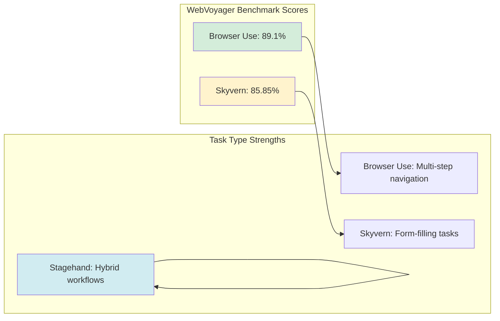
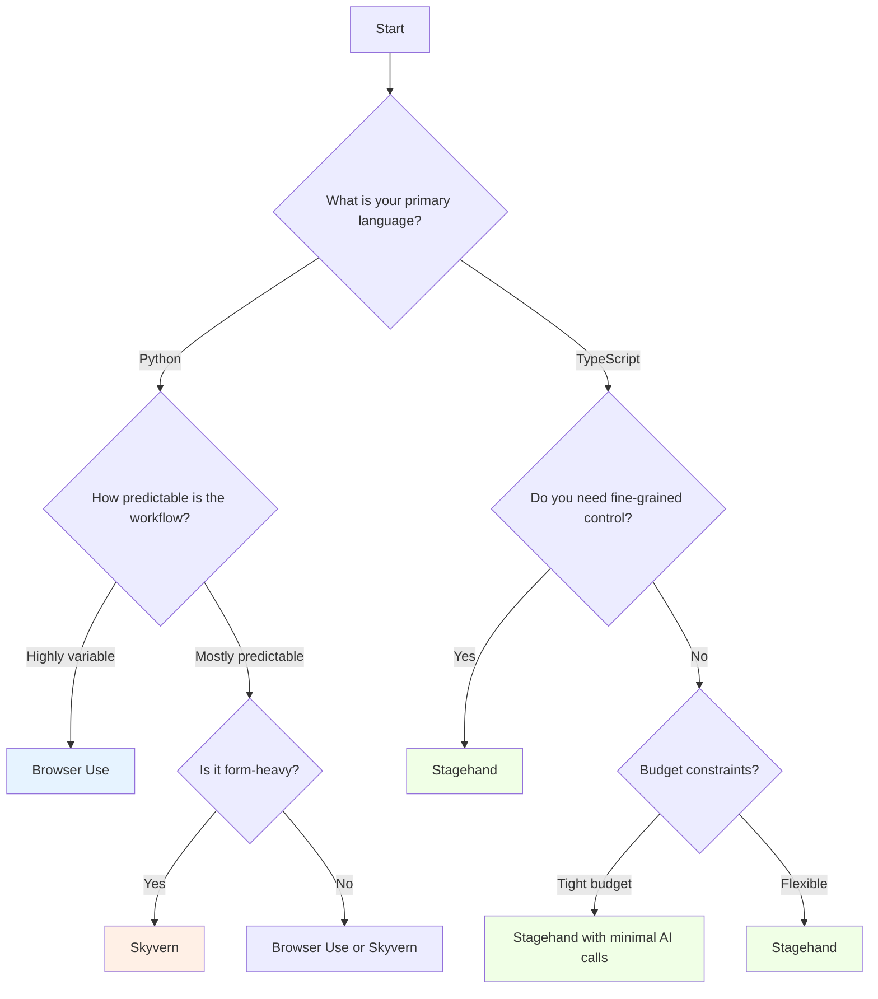

Browser automation has moved past the era of manually coding every click and selector. Traditional tools like Selenium and Playwright still offer fine-grained programmatic control, but a newer wave of AI-powered agent frameworks now lets you describe what you want to accomplish and delegates the execution details to a language model.

Three frameworks stand out in this space: Browser Use, Stagehand, and Skyvern. Each takes a different architectural approach to the same problem, and understanding those differences matters when choosing the right tool. The agentic browser market is projected to grow from $4.5 billion in 2024 to $76.8 billion by 2034, so this category is worth paying attention to.

## The Three Architectural Philosophies

The core design philosophy behind each framework shapes everything: what tasks the tool handles well, where it struggles, and how it fits into an existing automation stack.

```mermaid
graph TD
    subgraph "Browser Use"
        A1[LLM Reasoning Loop] --> A2[Observe Page State]
        A2 --> A3[Decide Next Action]
        A3 --> A4[Execute via Browser]
        A4 --> A5[Reassess Results]
        A5 --> A2
    end

    subgraph "Stagehand"
        B1[Playwright Script] --> B2{Ambiguous Task?}
        B2 -->|Yes| B3[Natural Language AI Command]
        B2 -->|No| B4[Standard Playwright Code]
        B3 --> B5[Return to Script Flow]
        B4 --> B5
    end

    subgraph "Skyvern"
        C1[Task Description] --> C2[LLM Interprets Page]
        C2 --> C3[Computer Vision Analysis]
        C3 --> C4[Combined Action Plan]
        C4 --> C5[Execute and Verify Visually]
    end

    style A1 fill:#e6f3ff
    style B1 fill:#f0ffe6
    style C1 fill:#fff0e6
```



Browser Use is agent-first. An LLM sits in a continuous reasoning loop, observing the page, deciding what to do next, executing the action, and reassessing the result. The AI drives everything.

Stagehand is deterministic-first. You write standard Playwright scripts and only hand off to AI when the task is ambiguous. The developer stays in control of the overall flow.

Skyvern is visual-first. It combines LLMs with computer vision to understand pages the way a human would, making it strong for form-heavy workflows where visual layout matters more than DOM structure.

## Browser Use: The Agent-First Approach

Browser Use is the leading open-source Python framework for building browser agents. It achieved an 89.1% success rate on the WebVoyager benchmark across 586 real-world web tasks, placing it among the highest-performing frameworks available.

The core idea is straightforward: give the agent a goal in natural language, and it figures out how to accomplish it through a loop of observe, decide, execute, and reassess.

### Basic Task Automation

```python
from browser_use import Agent
from langchain_openai import ChatOpenAI

import asyncio

async def search_and_extract():
    agent = Agent(
        task="Go to Google, search for 'best budget laptops 2026', "
             "click the first non-ad result, and extract the top 3 "
             "laptop recommendations with their prices.",
        llm=ChatOpenAI(model="gpt-4o"),
    )

    result = await agent.run()
    print(result)

asyncio.run(search_and_extract())
```

No selectors, XPaths, or wait conditions appear anywhere in this code. The agent handles navigation, scrolling, clicking, and extraction on its own.

### Multi-Step Workflow with Context

```python
from browser_use import Agent, Controller
from langchain_openai import ChatOpenAI

import asyncio

controller = Controller()

async def complex_workflow():
    agent = Agent(
        task=(
            "1. Navigate to news.ycombinator.com\n"
            "2. Find the top 5 stories on the front page\n"
            "3. For each story, extract the title, URL, points, "
            "and number of comments\n"
            "4. Return the results as structured data"
        ),
        llm=ChatOpenAI(model="gpt-4o"),
        controller=controller,
    )

    result = await agent.run()
    return result

data = asyncio.run(complex_workflow())
```

### Strengths and Weaknesses

Browser Use excels at exploratory tasks where the exact page structure is unpredictable. It handles multi-step workflows well because the reasoning loop can adapt to unexpected pop-ups, CAPTCHAs, or layout changes. The downside is latency and cost. A task that Playwright finishes in 2 seconds might take Browser Use 30 seconds because every action requires a round-trip to the language model.

## Stagehand: The Deterministic-First Approach

Stagehand, built by Browserbase, takes the opposite approach. With over 50,000 GitHub stars, it has become the leading TypeScript framework for AI-augmented browser automation. Rather than handing everything to an AI agent, Stagehand extends Playwright with natural language capabilities that you invoke only when needed.

The philosophy is pragmatic: use standard Playwright for predictable flows and switch to AI commands only for ambiguous tasks like interpreting visual layouts or handling dynamic content.

### Hybrid Automation Pattern

```javascript
const { Stagehand } = require("@browserbasehq/stagehand");

async function hybridAutomation() {
  const stagehand = new Stagehand({
    env: "LOCAL",
    modelName: "gpt-4o",
  });
  await stagehand.init();

  const page = stagehand.page;

  // Deterministic: standard Playwright navigation
  await page.goto("https://example-shop.com/products");

  // AI-powered: let the model figure out the cookie banner
  await page.act("Close the cookie consent banner if one appears");

  // Deterministic: reliable selector-based interaction
  await page.selectOption("#category-filter", "electronics");
  await page.waitForLoadState("networkidle");

  // AI-powered: extract structured data from complex layouts
  const products = await page.extract({
    instruction: "Extract all product names and prices from the listing",
    schema: {
      type: "array",
      items: {
        type: "object",
        properties: {
          name: { type: "string" },
          price: { type: "string" },
        },
      },
    },
  });

  console.log(products);
  await stagehand.close();
}

hybridAutomation();
```

### Using observe and act

```javascript
const { Stagehand } = require("@browserbasehq/stagehand");

async function observeAndAct() {
  const stagehand = new Stagehand({
    env: "LOCAL",
    modelName: "gpt-4o",
  });
  await stagehand.init();

  const page = stagehand.page;
  await page.goto("https://example-dashboard.com");

  // Observe: ask the AI what actions are possible
  const actions = await page.observe(
    "What navigation options are available on this page?"
  );
  console.log("Available actions:", actions);

  // Act: perform a natural language action
  await page.act("Click on the Analytics section in the sidebar");

  // Deterministic: now use Playwright for precise data extraction
  await page.waitForSelector(".analytics-chart");
  const chartData = await page.evaluate(() => {
    return window.__CHART_DATA__ || null;
  });

  console.log("Chart data:", chartData);
  await stagehand.close();
}

observeAndAct();
```

### Strengths and Weaknesses

Stagehand offers deterministic reliability where possible and AI flexibility where needed. Debugging is easier because most of the code is standard Playwright that you can step through line by line. The downside is more developer effort upfront. You need to know which parts of the workflow are predictable and which are not, and you still need Playwright expertise.

## Skyvern: The Visual-First Approach

Skyvern takes another path, combining LLMs with computer vision to interpret web pages visually. Backed by Y Combinator with $2.7 million raised in December 2025, Skyvern achieved 85.85% on the WebVoyager benchmark and stands out as the top-performing framework for form-filling tasks.

Its visual approach means it can handle pages where the DOM structure is messy or obfuscated, because it processes the page the way a human would.

### Task Configuration

```python
import requests

# Skyvern exposes a REST API for task execution
task_payload = {
    "url": "https://example-insurance.com/get-quote",
    "navigation_goal": (
        "Fill out the insurance quote form with the following "
        "information and submit it"
    ),
    "data_extraction_goal": "Extract the quoted premium amount",
    "navigation_payload": {
        "first_name": "Jane",
        "last_name": "Smith",
        "date_of_birth": "1990-05-15",
        "zip_code": "94105",
        "coverage_type": "comprehensive",
        "deductible": "500",
    },
    "proxy_location": "RESIDENTIAL",
}

response = requests.post(
    "http://localhost:8000/api/v1/tasks",
    json=task_payload,
    headers={"x-api-key": "your-api-key"},
)

task = response.json()
print(f"Task ID: {task['task_id']}")
```

### Workflow Chains

```python
import requests

API_BASE = "http://localhost:8000/api/v1"
HEADERS = {"x-api-key": "your-api-key"}

# Skyvern supports chained workflows for multi-page processes
workflow_payload = {
    "title": "Competitor Price Check",
    "steps": [
        {
            "step_type": "task",
            "url": "https://competitor-a.com/products",
            "navigation_goal": "Search for 'wireless headphones' "
                               "and find the cheapest option",
            "data_extraction_goal": (
                "Extract the product name, price, and rating "
                "of the cheapest wireless headphones"
            ),
        },
        {
            "step_type": "task",
            "url": "https://competitor-b.com/search",
            "navigation_goal": "Search for 'wireless headphones' "
                               "and find the cheapest option",
            "data_extraction_goal": (
                "Extract the product name, price, and rating "
                "of the cheapest wireless headphones"
            ),
        },
    ],
}

response = requests.post(
    f"{API_BASE}/workflows",
    json=workflow_payload,
    headers=HEADERS,
)

workflow = response.json()
print(f"Workflow ID: {workflow['workflow_id']}")
```

### Strengths and Weaknesses

Skyvern's visual understanding makes it strong for form-filling automation, especially on sites with complex, multi-step forms where field labels do not map cleanly to DOM attributes. The no-code workflow builder also makes it accessible to non-developers. The tradeoff is that computer vision analysis adds overhead, and the REST API architecture means less fine-grained control compared to the in-process approach of Browser Use or Stagehand.

## The Same Task, Three Ways

To make the comparison concrete, here is how you would approach the same task in each framework: navigate to a product listing, apply a filter, and extract the results.

### Browser Use (Python)

```python
from browser_use import Agent
from langchain_openai import ChatOpenAI
import asyncio

async def extract_products():
    agent = Agent(
        task=(
            "Go to https://example-shop.com/products, "
            "filter by 'Electronics' category, sort by price "
            "low to high, and extract the first 10 products "
            "with their names, prices, and ratings."
        ),
        llm=ChatOpenAI(model="gpt-4o"),
    )
    return await agent.run()

results = asyncio.run(extract_products())
```

### Stagehand (TypeScript)

```javascript
const { Stagehand } = require("@browserbasehq/stagehand");

async function extractProducts() {
  const stagehand = new Stagehand({ env: "LOCAL", modelName: "gpt-4o" });
  await stagehand.init();
  const page = stagehand.page;

  // Deterministic navigation
  await page.goto("https://example-shop.com/products");
  await page.selectOption("#category-filter", "electronics");
  await page.click('[data-sort="price-asc"]');
  await page.waitForLoadState("networkidle");

  // AI extraction for complex layouts
  const products = await page.extract({
    instruction: "Extract the first 10 products with name, price, and rating",
    schema: {
      type: "array",
      items: {
        type: "object",
        properties: {
          name: { type: "string" },
          price: { type: "string" },
          rating: { type: "string" },
        },
      },
    },
  });

  await stagehand.close();
  return products;
}

extractProducts().then(console.log);
```

### Skyvern (Python/API)

```python
import requests

task_payload = {
    "url": "https://example-shop.com/products",
    "navigation_goal": (
        "Filter products by Electronics category and sort "
        "by price from low to high"
    ),
    "data_extraction_goal": (
        "Extract the first 10 products including their names, "
        "prices, and star ratings"
    ),
}

response = requests.post(
    "http://localhost:8000/api/v1/tasks",
    json=task_payload,
    headers={"x-api-key": "your-api-key"},
)
print(response.json())
```

## Benchmark Analysis

Performance on standardized benchmarks shows where each framework does best. The WebVoyager benchmark tests agents across 586 real-world web tasks and provides the most thorough comparison available.



Browser Use leads overall with 89.1% on WebVoyager, benefiting from its agent-first architecture that reasons through unexpected situations. Skyvern follows at 85.85%, with particular strength in form-filling tasks where computer vision shines. Stagehand does not publish a single benchmark number because its performance depends on how much of the workflow is handled by deterministic Playwright code versus AI --- which is exactly the point of its design.

For reference, OpenAI's Operator launched in January 2025, achieved 38.1% on OSWorld and 58.1% on WebArena, and was deprecated by August 2025. The pace of change in this space is rapid.

## Choosing the Right Framework

The decision between these three comes down to your team's skills, your use case, and your tolerance for cost versus control.



### Choose Browser Use when:
- You want the agent to handle the entire workflow autonomously
- Tasks are exploratory and you cannot predict exact page structures
- You are building in Python and want the highest benchmark accuracy
- You can tolerate higher latency and LLM costs per task

### Choose Stagehand when:
- You have Playwright expertise on your team
- Most of your workflow is predictable with a few ambiguous steps
- You need fine-grained debugging and deterministic test coverage
- You want to minimize LLM API costs by limiting AI calls

### Choose Skyvern when:
- Your primary use case involves complex forms and data entry
- You need a no-code option for non-technical team members
- Visual page understanding matters more than DOM structure
- You are building workflows that chain across multiple sites

## Cost and Performance Considerations

One factor that often gets overlooked is cost. Every AI call in these frameworks hits an LLM API, and those costs add up at scale.

Browser Use makes the most LLM calls because every action in its reasoning loop requires a model inference. A single task involving ten page interactions could trigger 30 or more API calls as the agent observes, decides, and verifies at each step.

Stagehand's hybrid approach lets you control costs directly. If 80% of your workflow uses deterministic Playwright and only 20% invokes AI, your LLM costs drop proportionally.

Skyvern's vision-based approach adds image processing costs on top of text-based LLM calls. However, its no-code workflow builder can cut development time, which may offset the higher per-task cost depending on your team's composition.

## Looking Ahead

The browser agent space is moving fast. Google launched Chrome Auto Browse on January 28, 2026, powered by Gemini 3, putting major cloud providers in direct competition with these open-source frameworks. The arrival of big-tech entries validates the approach but raises questions about the long-term positioning of independent tools.

The most effective strategy right now is not to bet on a single framework but to understand the architectural tradeoffs well enough to pick the right tool for each job. An agent-first approach for exploratory research, a deterministic-first approach for production pipelines, and a visual-first approach for form automation can all coexist in the same organization. As the space matures, teams that understand the tradeoffs early will have the easiest time adapting.
