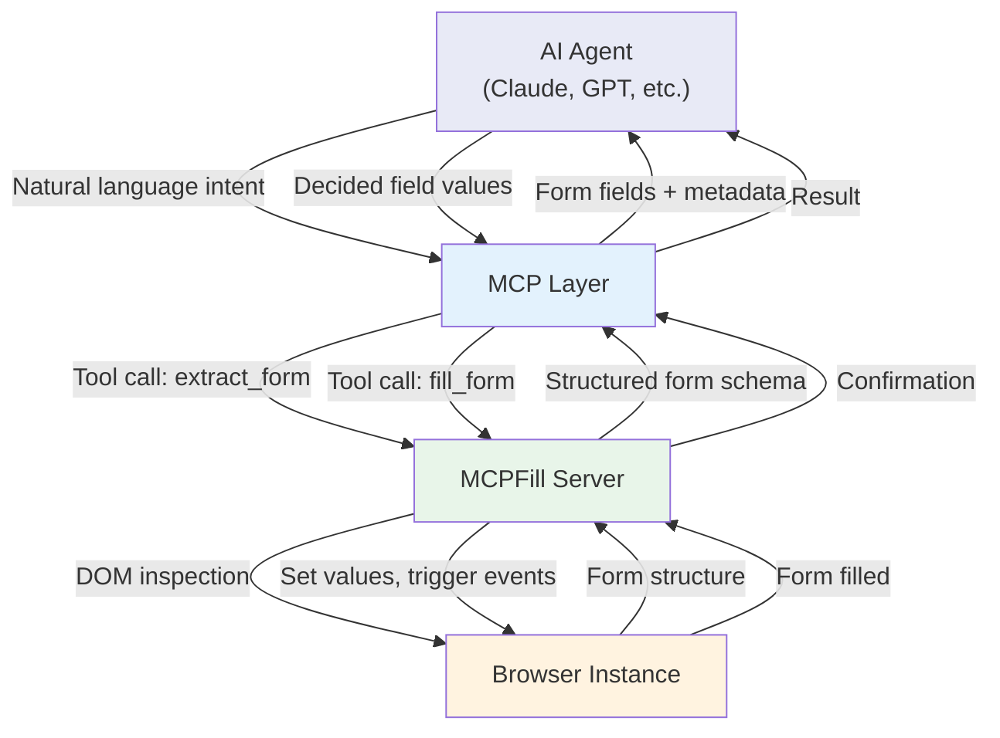
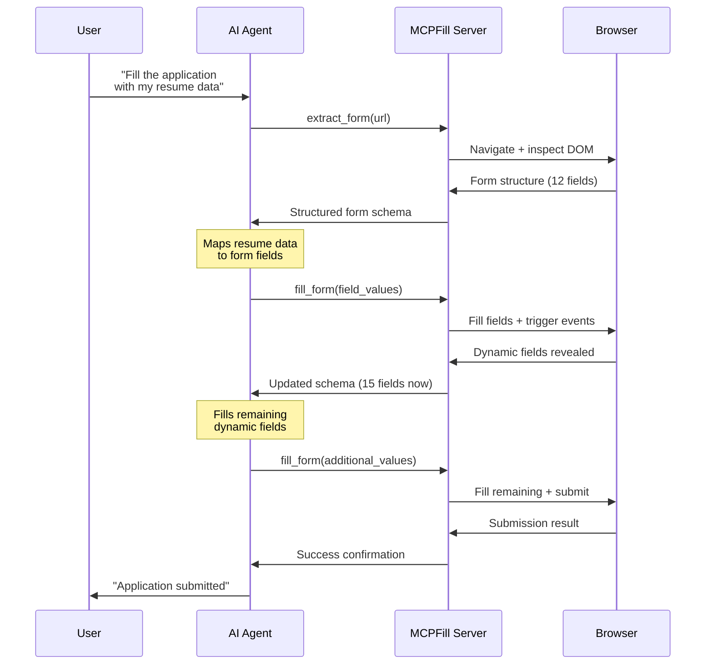
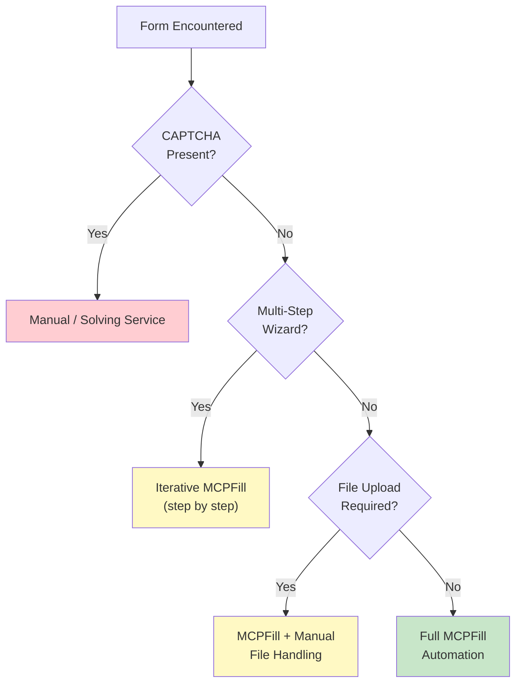
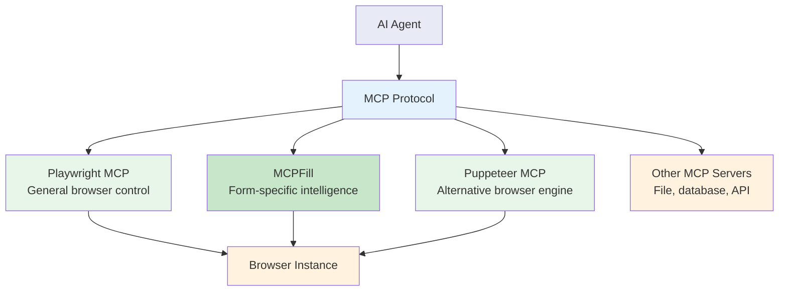

Web forms are everywhere -- account signups, government applications, checkout flows, survey portals, insurance quotes. For years, automating them meant writing brittle scripts that hardcoded selectors and field values. MCPFill takes a fundamentally different approach. It bridges AI agents and web forms through the Model Context Protocol, letting a large language model understand a form's structure, decide what to fill, and execute the filling -- all through a standardized tool interface. Instead of writing a script per form, you describe what you want in natural language and let the AI handle the rest.

For a broader look at the traditional scripted approach, see our guide on [how to automate web form filling](/posts/how-to-automate-web-form-filling-complete-guide/). This post breaks down what MCPFill is, how it works, why form filling is harder than it looks for AI, and where this approach fits alongside traditional browser automation.

## What MCPFill Is

MCPFill is an MCP-based tool that exposes form-filling capabilities to AI agents. At its core, it is a bridge between an LLM and the browser's form layer. The tool inspects a web page, extracts the structure of every form it finds -- field names, types, labels, validation rules, required flags -- and presents that structure to the AI agent as a callable MCP tool. The agent then decides what values to fill based on context, user instructions, or available data, and MCPFill handles the actual DOM manipulation.

The key distinction from traditional automation is where the intelligence lives. In a Playwright or Selenium script, the developer encodes all the logic: which field gets which value, how to handle dropdowns, when to click submit. With MCPFill, the LLM makes those decisions. The developer provides the intent ("fill out this job application with my resume data"), and the AI figures out how to map that intent onto the specific form it encounters.



## The Form-Filling Problem for AI

Forms look simple to a human. You see a label, you type a value. But for an AI agent driving a browser, forms present a stack of challenges that go well beyond locating an input element.

**Labels and semantics.** A field labeled "Phone" might accept `(555) 123-4567` or `5551234567` but reject `+1-555-123-4567`. The label alone does not tell you the expected format. Some forms use placeholder text instead of labels. Others use `aria-label` attributes that are invisible on screen. Matching the right value to the right field requires semantic understanding, not just selector matching.

**Validation rules.** Client-side validation can be embedded in HTML attributes (`required`, `pattern`, `minlength`), in JavaScript event handlers, or in third-party validation libraries. An AI agent needs to know these constraints before it fills a field, or it will trigger error states that block submission.

**Dynamic behavior.** Selecting "Yes" in a radio button might reveal three additional fields. Choosing a country from a dropdown might change the available states or provinces. These conditional fields do not exist in the DOM until a previous field is filled, which means the form's structure changes as you interact with it.

**Non-standard controls.** Date pickers, multi-select dropdowns, rich text editors, slider inputs, and custom-built components all require different interaction patterns. A standard `page.fill()` call will not work on a React Select component or a Flatpickr date widget.

```python
# The manual approach: every field needs explicit handling
from playwright.sync_api import sync_playwright

with sync_playwright() as p:
    browser = p.chromium.launch(headless=False)
    page = browser.new_page()
    page.goto("https://example.com/application")

    # Each field requires knowing the selector AND the expected format
    page.fill("#first-name", "Jane")
    page.fill("#last-name", "Doe")
    page.fill("#email", "jane.doe@example.com")
    page.fill("#phone", "(555) 123-4567")  # Format matters

    # Dropdowns need special handling
    page.select_option("#country", value="US")

    # Wait for dynamic fields to appear after country selection
    page.wait_for_selector("#state")
    page.select_option("#state", value="CA")

    # Date pickers are their own adventure
    page.click("#date-of-birth")
    page.click(".datepicker .prev-month")  # Navigate to correct month
    page.click(".datepicker td[data-day='15']")

    # Checkboxes
    page.check("#terms-agreement")

    page.click("#submit-button")
    browser.close()
```

This script is tightly coupled to one specific form. Change the layout, rename a field, swap the date picker library, and the script breaks. That brittleness is exactly what MCPFill aims to eliminate.

## How MCPFill Solves It

MCPFill operates in two phases: extraction and filling.

### Phase 1: Form Structure Extraction

When the AI agent asks MCPFill to analyze a page, it traverses the DOM and builds a structured representation of every form element. This representation includes:

- Field type (text, email, select, checkbox, radio, textarea, date, file)
- Associated label text (from `<label>`, `aria-label`, `placeholder`, or nearby text nodes)
- Validation constraints (required, pattern, min/max length, min/max value)
- Current value if pre-filled
- Available options for select elements and radio groups
- Whether the field is visible, disabled, or hidden behind a conditional

```json
{
  "form_id": "application-form",
  "action": "/api/submit-application",
  "method": "POST",
  "fields": [
    {
      "selector": "#first-name",
      "type": "text",
      "label": "First Name",
      "required": true,
      "maxlength": 50,
      "value": ""
    },
    {
      "selector": "#country",
      "type": "select",
      "label": "Country",
      "required": true,
      "options": [
        {"value": "US", "text": "United States"},
        {"value": "GB", "text": "United Kingdom"},
        {"value": "CA", "text": "Canada"}
      ],
      "value": ""
    },
    {
      "selector": "#terms-agreement",
      "type": "checkbox",
      "label": "I agree to the Terms of Service",
      "required": true,
      "checked": false
    }
  ]
}
```

This schema gives the LLM everything it needs to make decisions: what each field means, what constraints apply, and what options are available.

### Phase 2: Intelligent Filling

The AI agent receives the form schema and decides what values to fill based on context. This is where the LLM's reasoning shines. Given a user instruction like "fill this form with my profile data" and a data source containing the user's information, the LLM can:

- Map "First Name" to the user's first name from the data source
- Choose the correct country option from a dropdown
- Format a phone number to match the expected pattern
- Check required checkboxes like terms agreements
- Skip optional fields that are not relevant

The agent sends the decided values back to MCPFill, which handles the actual DOM manipulation -- filling text fields, selecting dropdown options, checking boxes, and triggering the appropriate JavaScript events so that dynamic fields and validation respond correctly.



Notice the iterative loop. MCPFill re-extracts the form after filling fields that trigger dynamic behavior, so the agent can handle conditional sections without the developer predicting them in advance.


<figure>
  
  <figcaption>MCP gives AI agents a structured way to control browsers. <span class="img-credit">Photo by tom analogicus / <a href="https://www.pexels.com" target="_blank" rel="noopener noreferrer">Pexels</a></span></figcaption>
</figure>

## Setup and Configuration

MCPFill follows the standard MCP server pattern. You install it, configure your AI agent to connect to it, and then interact through natural language.

```bash
# Install the MCPFill server
npm install -g mcpfill

# Or run it directly with npx
npx mcpfill --port 3100
```

For Claude Desktop, add MCPFill to your MCP server configuration:

```json
{
  "mcpServers": {
    "mcpfill": {
      "command": "npx",
      "args": ["mcpfill"],
      "env": {
        "BROWSER": "chromium",
        "HEADLESS": "false"
      }
    }
  }
}
```

The server exposes several tools to the connected AI agent:

| Tool | Description |
|------|-------------|
| `extract_form` | Navigates to a URL and returns the structured form schema |
| `fill_form` | Fills specified fields with provided values |
| `submit_form` | Clicks the submit button and returns the result |
| `get_form_state` | Returns the current state of all fields without modifying them |
| `validate_form` | Triggers client-side validation and reports any errors |

Each tool accepts and returns structured JSON, which is exactly what LLMs are good at reasoning about.

```python
# Example: Using MCPFill programmatically through an MCP client
from mcp import ClientSession, StdioServerParameters
from mcp.client.stdio import stdio_client

server_params = StdioServerParameters(
    command="npx",
    args=["mcpfill"]
)

async def fill_application():
    async with stdio_client(server_params) as (read, write):
        async with ClientSession(read, write) as session:
            await session.initialize()

            # Step 1: Extract the form structure
            form_schema = await session.call_tool(
                "extract_form",
                arguments={"url": "https://example.com/apply"}
            )

            # Step 2: Let your application logic decide values
            # (or pass form_schema to an LLM for decision-making)
            field_values = map_data_to_form(form_schema, user_data)

            # Step 3: Fill the form
            result = await session.call_tool(
                "fill_form",
                arguments={"values": field_values}
            )

            # Step 4: Submit
            submission = await session.call_tool("submit_form", arguments={})
            print(f"Submission result: {submission}")
```

## Use Cases

MCPFill is most valuable when the forms are varied, numerous, or unpredictable. Here are the scenarios where it outperforms traditional script-based automation.

### Automated Data Entry

Organizations that process the same data through multiple web portals -- entering employee information into HR systems, submitting financial data to regulatory portals, or syncing records across platforms that lack APIs -- benefit from MCPFill's ability to handle different form layouts without per-form scripts.

```python
# Traditional approach: one script per form
def fill_hr_portal_a(page, employee):
    page.fill("#emp-first", employee["first_name"])
    page.fill("#emp-last", employee["last_name"])
    page.select_option("#dept-select", value=employee["department"])
    # ... 20 more fields, each hardcoded

def fill_hr_portal_b(page, employee):
    page.fill("input[name='fname']", employee["first_name"])
    page.fill("input[name='lname']", employee["last_name"])
    page.click(f"label:has-text('{employee['department']}')")
    # ... completely different selectors for the same data

# MCPFill approach: one instruction for any form
# "Fill this HR form with the employee record for Jane Doe"
```

### Form Testing

QA teams can use MCPFill to test forms with varied inputs without writing test scripts for each combination. The AI agent can generate edge cases, test boundary values, and identify fields that accept invalid input -- all driven by natural language instructions.

### Government and Compliance Forms

Government portals are notorious for complex, multi-section forms with conditional logic, strict validation, and inconsistent UI patterns across agencies. MCPFill's extraction phase handles the complexity of understanding each form, while the AI's reasoning handles mapping data to unfamiliar layouts.

### Lead Generation and Research

Sales teams that need to fill out contact forms, demo request forms, or registration forms across hundreds of target websites can use MCPFill to handle the variety without maintaining a script for each site.


<figure>
  
  <figcaption>Protocol-level integration makes browser automation composable. <span class="img-credit">Photo by Peter Xie / <a href="https://www.pexels.com" target="_blank" rel="noopener noreferrer">Pexels</a></span></figcaption>
</figure>

## Limitations

MCPFill is not a silver bullet. Several categories of forms remain challenging.

**CAPTCHAs.** Any form protected by reCAPTCHA, hCaptcha, or similar challenge systems will block automated submission. MCPFill does not attempt to solve CAPTCHAs. If you encounter them, you need a separate strategy -- CAPTCHA solving services, browser profiles with established reputation, or manual intervention for the challenge step.

**Complex multi-step wizards.** Forms that span multiple pages with server-side state management (where each step requires a server round-trip and session validation) add complexity that a single extraction pass cannot handle. MCPFill's iterative approach helps, but deeply nested multi-step flows with branching paths can still trip up the system.

**File uploads.** While MCPFill can identify file upload fields, the actual file selection involves OS-level file dialogs that sit outside the browser DOM. This requires separate handling through Playwright's `set_input_files()` or equivalent methods.

**Custom web components.** Heavily customized components built with Web Components, [Shadow DOM](/posts/shadow-dom-the-silent-killer-of-ai-web-scraping/), or framework-specific rendering (like Material UI's Autocomplete or Ant Design's DatePicker) may not expose their structure through standard DOM inspection. MCPFill can fall back to accessibility tree inspection, but results vary.

**Token cost.** Every extraction and filling cycle consumes LLM tokens. For a form with 30 fields, the schema alone might be several hundred tokens, and the agent's reasoning about what to fill adds more. At scale, this cost adds up compared to a hardcoded script that uses zero LLM tokens per execution.



## MCPFill vs. Manual Playwright Form Filling

The choice between MCPFill and traditional Playwright scripting depends on your use case.

| Factor | MCPFill | Manual Playwright |
|--------|---------|-------------------|
| **Setup time per form** | Minutes (natural language) | Hours (inspect, code, test) |
| **Reliability** | Depends on LLM accuracy | Deterministic once working |
| **Maintenance** | Self-adapting to UI changes | Breaks when selectors change |
| **Speed** | Slower (LLM round-trips) | Fast (direct execution) |
| **Cost per execution** | Token costs per run | Zero marginal cost |
| **Handling varied forms** | Excellent | One script per form |
| **Debugging** | Harder (LLM reasoning is opaque) | Standard debugging tools |

For high-volume, single-form automation (like submitting the same form thousands of times with different data), manual Playwright wins on speed and cost. The script runs in milliseconds, never makes a wrong decision, and costs nothing per execution.

For low-volume, high-variety automation (like filling out a different form every time), MCPFill wins on development time and adaptability. You do not need to write and maintain a separate script for each form.

```python
# Manual Playwright: fast, predictable, but rigid
async def fill_checkout(page, order):
    await page.fill("#card-number", order["card"])
    await page.fill("#card-expiry", order["expiry"])
    await page.fill("#card-cvc", order["cvc"])
    await page.fill("#billing-zip", order["zip"])
    await page.click("#place-order")
    # This works perfectly for this one checkout form
    # and breaks the moment the form changes

# MCPFill: flexible, intelligent, but slower
# Agent instruction: "Complete the checkout with the payment
# method on file for order #12345"
# MCPFill extracts the form, the LLM figures out the mapping,
# and the form gets filled regardless of layout changes
```

The hybrid approach is often the best strategy. Use MCPFill for initial exploration and prototyping -- let it figure out the form structure and the right field mappings. Then, if you need to automate that same form at scale, convert the MCPFill output into a hardcoded Playwright script for production use.

## The Broader MCP Ecosystem for Browser Automation

MCPFill does not exist in isolation. It is part of a growing ecosystem of MCP servers that expose browser capabilities to AI agents.

**[Playwright MCP Server](/posts/playwright-mcp-and-cli-making-browser-automation-ai-agent-friendly/)** (`@playwright/mcp`) provides general browser automation -- navigation, clicking, typing, screenshots, and accessibility snapshots. MCPFill complements it by adding form-specific intelligence on top.

**Puppeteer MCP Server** offers similar browser control through Puppeteer instead of Playwright. If your infrastructure is built on Puppeteer, you can pair it with MCPFill for form-specific tasks.

**[Browser-Use and Stagehand](/posts/browser-agent-frameworks-compared-browser-use-vs-stagehand-vs-skyvern/)** are higher-level agent frameworks that already include form-filling capabilities as part of their broader automation toolkit. They take a different approach by embedding the browser interaction logic inside the agent framework rather than exposing it through MCP.



The MCP approach has a structural advantage: composability. An AI agent can use the Playwright MCP server for navigation, MCPFill for form filling, and a database MCP server for fetching the data to fill -- all in the same conversation, all through the same protocol.

## What Comes Next

The trajectory of tools like MCPFill points toward a future where AI agents -- including those built on [Playwright for browser automation](/posts/playwright-for-browser-automation-in-ai-agents/) -- handle any form based on natural language instructions alone. Several developments are pushing in that direction.

**Better form understanding.** As LLMs improve at reading and reasoning about DOM structures, the extraction phase becomes more accurate. Models that can process accessibility trees, visual layouts, and HTML simultaneously will handle edge cases that trip up current systems.

**Pre-trained form knowledge.** Future versions of MCPFill could ship with knowledge of common form patterns -- the standard Shopify checkout, the typical WordPress contact form, the common SaaS signup flow. This would reduce the extraction overhead for frequently encountered forms.

**Autonomous multi-step flows.** Handling a five-page insurance application that branches based on previous answers requires the agent to maintain state, anticipate future steps, and backtrack when it makes a wrong choice. Current MCPFill implementations handle this iteratively, but future versions could plan the entire flow before starting.

**Validation-aware filling.** Instead of filling a field and then discovering it failed validation, future tools could predict validation failures by analyzing the constraints in the schema and adjusting values before they are entered.

The combination of MCP as a protocol standard and LLMs as the reasoning engine creates a foundation where form filling is no longer about scripting specific interactions. It is about describing intent and letting the AI handle the mechanics. MCPFill is an early implementation of that vision, and as the MCP ecosystem matures, tools like it will become the default approach for anyone who needs to automate forms at any meaningful variety or scale.
