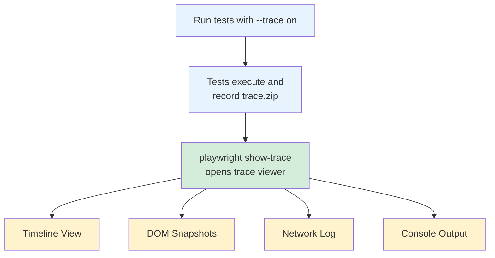
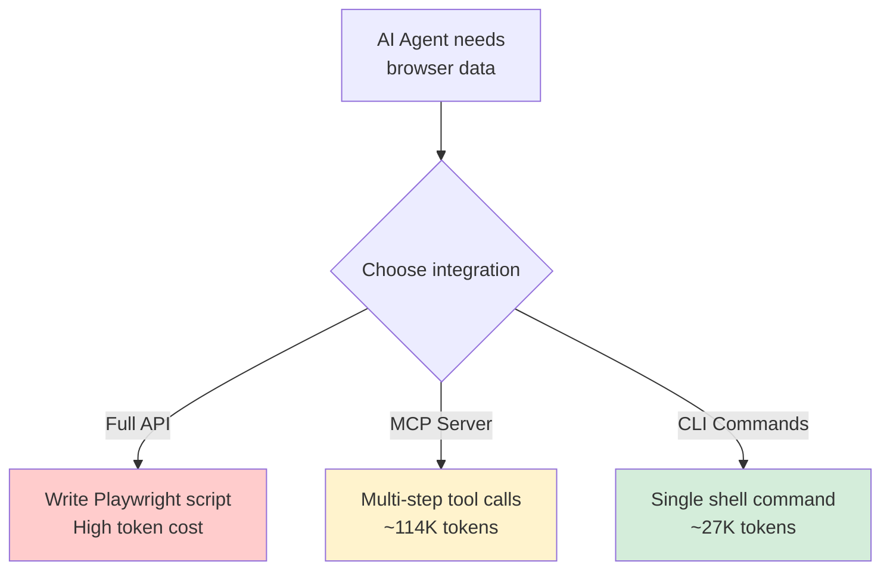

Playwright ships with a powerful command-line interface that most developers never touch. You can launch browsers, record interactions, generate test code, take screenshots, and produce PDFs without writing a single script. If you have ever spun up a throwaway Node.js file just to check how a page renders or grab a selector, the Playwright CLI replaces that entire workflow with one-liners you can run directly from your terminal.

This post walks through every major Playwright CLI command, shows what the output looks like, and covers the practical scenarios where the CLI saves you time compared to writing full automation scripts.

## Installing Playwright and Its Browsers

Before using any CLI commands, you need Playwright installed along with the browser binaries it drives.

**Node.js (npm):**

```bash
# Install Playwright as a project dependency
npm init -y
npm install playwright

# Install browser binaries (Chromium, Firefox, WebKit)
npx playwright install
```

```text
Downloading Chromium 131.0.6778.33 (playwright build v1150)...
Downloading Firefox 132.0 (playwright build v1465)...
Downloading WebKit 18.2 (playwright build v2104)...
Downloading FFMPEG playwright build v1010...
```

**Python (pip):**

```bash
# Install the Playwright Python package
pip install playwright

# Install browser binaries
playwright install
```

```text
Downloading Chromium 131.0.6778.33 (playwright build v1150) - 162.4 MiB
Downloading Firefox 132.0 (playwright build v1465) - 85.7 MiB
Downloading WebKit 18.2 (playwright build v2104) - 73.1 MiB
```

You can also install a single browser if you do not need all three:

```bash
npx playwright install chromium
npx playwright install firefox
npx playwright install webkit
```

The `--with-deps` flag installs system-level dependencies required by the browsers, which is especially useful on CI servers running fresh Linux images:

```bash
npx playwright install --with-deps chromium
```

## playwright open: Launch a Browser Interactively

The `open` command launches a browser window you can interact with manually. This is the fastest way to inspect a page, test a URL, or check how a site behaves in a specific browser engine.

```bash
# Open a URL in Chromium (default)
npx playwright open https://example.com
```

```bash
# Open in Firefox
npx playwright open --browser firefox https://example.com
```

```bash
# Open in WebKit (Safari's engine)
npx playwright open --browser webkit https://example.com
```

When the browser opens, you get a standard browser window plus Playwright's inspector panel. You can click around the page, open DevTools, and see how the site renders. The inspector panel shows the Playwright selectors for whatever element you hover over, making it a quick way to find the right locator without digging through HTML.

```bash
# Open with a specific viewport size
npx playwright open --viewport-size="1280,720" https://example.com
```

```bash
# Open in a specific timezone and locale
npx playwright open --timezone="America/New_York" --lang="en-US" https://example.com
```

```bash
# Emulate a mobile device
npx playwright open --device="iPhone 14" https://example.com
```

The device emulation flag is particularly useful for testing responsive layouts. Playwright ships with a built-in device registry that sets the correct viewport, user agent, and device scale factor.

## playwright codegen: Record and Generate Code

This is the CLI command that saves the most time. `codegen` opens a browser, watches everything you do, and generates working Playwright code in real time. Click a button, fill a form, navigate between pages --- each action becomes a line of code.

```bash
# Start recording and generate JavaScript code
npx playwright codegen https://example.com
```

```bash
# Generate Python code instead
npx playwright codegen --target python https://example.com
```

```bash
# Generate Python async code
npx playwright codegen --target python-async https://example.com
```

```bash
# Generate C# code
npx playwright codegen --target csharp https://example.com
```

When you run `codegen`, two windows appear: the browser you interact with and a code panel that updates live. Here is an example of what gets generated after navigating to a site and clicking a few elements:

```python
from playwright.sync_api import sync_playwright

def run(playwright):
    browser = playwright.chromium.launch(headless=False)
    context = browser.new_context()
    page = context.new_page()

    page.goto("https://httpbin.org/forms/post")
    page.get_by_label("Customer name:").fill("John Doe")
    page.get_by_label("Telephone:").fill("555-1234")
    page.get_by_label("E-mail address:").fill("john@example.com")
    page.get_by_label("Large").check()
    page.get_by_label("Bacon").check()
    page.get_by_label("Onion").check()
    page.get_by_role("button", name="Submit order").click()

    context.close()
    browser.close()

with sync_playwright() as playwright:
    run(playwright)
```

The generated selectors use Playwright's recommended locator strategy: `get_by_role`, `get_by_label`, and `get_by_text` rather than fragile CSS selectors or XPath. These accessibility-based selectors are more resilient to page layout changes. For dropdown-specific interactions, the generated code pairs well with the [Playwright select_option API](/posts/playwright-select-option-python-complete-signature-guide/).

```bash
# Record with a specific viewport
npx playwright codegen --viewport-size="1920,1080" https://example.com
```

```bash
# Record with saved authentication state
npx playwright codegen --load-storage=auth.json https://example.com
```

```bash
# Save authentication state after recording
npx playwright codegen --save-storage=auth.json https://example.com/login
```

The storage flags are useful for sites that require login. Record your login flow once with `--save-storage`, then replay subsequent recordings with `--load-storage` so you start already authenticated.

## playwright screenshot: Capture Pages from the Command Line

Need a quick screenshot of a page without writing a script? The `screenshot` command handles it in a single line.

```bash
# Take a screenshot of a page
npx playwright screenshot https://example.com screenshot.png
```

```text
Navigating to https://example.com
Capturing screenshot to screenshot.png
```

```bash
# Full-page screenshot (captures everything, not just the viewport)
npx playwright screenshot --full-page https://example.com full.png
```

```bash
# Screenshot with a specific viewport size
npx playwright screenshot --viewport-size="1440,900" https://example.com desktop.png
```

```bash
# Screenshot using WebKit
npx playwright screenshot --browser webkit https://example.com safari.png
```

```bash
# Wait for the page to fully load before capturing
npx playwright screenshot --wait-for-timeout=3000 https://example.com loaded.png
```

This is invaluable for CI/CD pipelines where you need visual verification. Instead of maintaining a screenshot script, add a single CLI command to your pipeline:

```yaml
# Example GitHub Actions step
- name: Capture deployment screenshot
  run: |
    npx playwright install chromium --with-deps
    npx playwright screenshot --full-page https://staging.example.com screenshot.png

- name: Upload screenshot artifact
  uses: actions/upload-artifact@v4
  with:
    name: deployment-screenshot
    path: screenshot.png
```

## playwright pdf: Generate PDFs from Web Pages

The `pdf` command converts a web page to a PDF document. This only works with Chromium since Firefox and WebKit do not support PDF generation through their automation protocols.

```bash
# Generate a PDF from a web page
npx playwright pdf https://example.com page.pdf
```

```text
Navigating to https://example.com
Saving as pdf to page.pdf
```

```bash
# PDF with specific paper format
npx playwright pdf --format="A4" https://example.com report.pdf
```

```bash
# Landscape orientation
npx playwright pdf --landscape https://example.com landscape.pdf
```

```bash
# Wait for dynamic content to load before generating
npx playwright pdf --wait-for-timeout=5000 https://example.com dynamic.pdf
```

This is practical for generating reports from dashboards, converting documentation pages to distributable PDFs, or archiving web content. The output respects CSS print styles, so pages designed with `@media print` rules will render correctly.

## playwright test: Run Your Test Suite

If you are using Playwright Test (the Node.js test runner), the `test` command runs your test files.

```bash
# Run all tests
npx playwright test
```

```text
Running 24 tests using 4 workers

  ✓ [chromium] tests/login.spec.ts:3:1 - should login (2.1s)
  ✓ [chromium] tests/login.spec.ts:15:1 - should show error (1.8s)
  ✓ [firefox] tests/login.spec.ts:3:1 - should login (3.2s)
  ✓ [firefox] tests/login.spec.ts:15:1 - should show error (2.4s)
  ...

  24 passed (18.3s)
```

```bash
# Run a specific test file
npx playwright test tests/login.spec.ts
```

```bash
# Run tests in headed mode (visible browser)
npx playwright test --headed
```

```bash
# Run tests in a specific browser only
npx playwright test --project=chromium
```

```bash
# Run tests matching a grep pattern
npx playwright test --grep "login"
```

```bash
# Run tests with the interactive UI mode
npx playwright test --ui
```

The UI mode is worth calling out. It opens a visual test runner where you can see each test step, inspect DOM snapshots at each point, and re-run individual tests. For debugging flaky tests, it is far more productive than reading log output.

```bash
# Generate an HTML report after running tests
npx playwright test --reporter=html
npx playwright show-report
```


<figure>
  
  <figcaption>Browser automation turns repetitive tasks into reliable scripts. <span class="img-credit">Photo by ThisIsEngineering / <a href="https://www.pexels.com" target="_blank" rel="noopener noreferrer">Pexels</a></span></figcaption>
</figure>

## playwright show-trace: Debug with Execution Traces

Playwright can record traces during test execution --- a complete timeline of every action, network request, DOM snapshot, and console log. The `show-trace` command opens these trace files in a visual viewer.

```bash
# Run tests with tracing enabled
npx playwright test --trace on
```

```bash
# Open a trace file in the viewer
npx playwright show-trace test-results/login-test/trace.zip
```

The trace viewer displays:

- A timeline of every action (navigation, clicks, typed text)
- DOM snapshots before and after each action
- Network requests with full headers and payloads
- Console logs and errors
- Screenshots at each step



For CI environments, you can configure tracing to only capture on failure, which avoids the performance overhead on passing tests:

```bash
npx playwright test --trace retain-on-failure
```

The trace files are self-contained ZIP archives that can be shared with teammates or uploaded as CI artifacts. Anyone can open them in the viewer without needing access to your source code.

## playwright install: Manage Browser Installations

The `install` command manages browser binaries. Beyond the basic installation we covered earlier, it has options for controlling exactly what gets installed and where.

```bash
# List installed browsers and their paths
npx playwright install --dry-run
```

```bash
# Install a specific browser version
npx playwright install chromium
```

```bash
# Install all browsers plus system dependencies
npx playwright install --with-deps
```

```bash
# Force reinstall browsers
npx playwright install --force
```

On CI servers, browser management matters. Each Playwright version pins specific browser builds, so upgrading Playwright in your project automatically pulls the correct browser versions. The `--with-deps` flag handles system packages like `libnss3` and `libatk-bridge` that browsers need on headless Linux environments.

```bash
# Check which browser versions the current Playwright expects
npx playwright --version
```

```text
Version 1.50.1
```

## Practical Use Cases

The CLI commands map to real workflows that come up repeatedly in development, testing, and automation.

**Quick page inspection:**

```bash
# Something looks wrong on staging --- check it immediately
npx playwright open --device="iPhone 14" https://staging.example.com/checkout

# Compare rendering across engines
npx playwright open --browser firefox https://staging.example.com/checkout
npx playwright open --browser webkit https://staging.example.com/checkout
```

**Generating selector code for a scraping project:**

```bash
# Record your interactions and get working selectors
npx playwright codegen --target python https://target-site.com

# The generated code gives you exact selectors:
# page.get_by_role("link", name="Next Page")
# page.locator("#product-grid .item")
```

Instead of manually inspecting the DOM and guessing selectors, you click through the page and the code writes itself. This is especially valuable for sites with complex or dynamic DOM structures where CSS selectors are fragile.

**CI/CD visual checks:**

```bash
# After deployment, capture screenshots of critical pages
for url in "/" "/pricing" "/docs" "/login"; do
  npx playwright screenshot \
    --full-page \
    "https://staging.example.com${url}" \
    "screenshots/$(echo $url | tr '/' '-').png"
done
```

**Quick PDF generation for reporting:**

```bash
# Generate a PDF of your analytics dashboard
npx playwright pdf \
  --wait-for-timeout=5000 \
  --format="A4" \
  "https://dashboard.example.com/weekly-report" \
  weekly-report.pdf
```

## Combining with AI Agents

The Playwright CLI was explicitly designed with AI agent workflows in mind. For a deeper look at how the CLI fits into the broader AI tooling picture, see our post on [Playwright MCP and CLI for AI agents](/posts/playwright-mcp-and-cli-making-browser-automation-ai-agent-friendly/). When an LLM-powered agent needs to interact with a browser, the CLI provides a token-efficient interface compared to programmatic APIs or MCP integrations.



An agent can run `playwright screenshot` to visually inspect a page, `playwright codegen` to generate interaction code it can then execute, or chain CLI commands together for multi-step workflows. Each command is a single subprocess call with structured output, rather than a multi-turn conversation managing browser state.

```bash
# An agent can capture and analyze a page in two commands
npx playwright screenshot --full-page https://target.com page.png
# Agent analyzes the screenshot visually

# Then generate interaction code
npx playwright codegen --target python https://target.com
# Agent refines the generated code for its specific task
```

Beyond the CLI, [Playwright is becoming the default browser engine for AI agents](/posts/playwright-for-browser-automation-in-ai-agents/) across many frameworks. The key insight is that CLI commands are self-contained. The agent does not need to maintain a persistent browser session or track state across multiple API calls. Each command launches a browser, performs its task, outputs the result, and exits. This maps cleanly onto how LLMs work --- stateless tool calls with structured inputs and outputs.

## Tips and Common Flags

A few flags apply across most CLI commands and are worth memorizing.

**Use `--headed` for visual debugging:**

```bash
# By default, screenshot and pdf run headless
# Add --headed to watch what happens
npx playwright screenshot --headed https://example.com debug.png
```

**Specify the browser engine:**

```bash
# Default is Chromium. Use --browser to switch.
npx playwright screenshot --browser firefox https://example.com firefox.png
npx playwright screenshot --browser webkit https://example.com webkit.png
```

**Set viewport dimensions:**

```bash
# Test at specific screen sizes
npx playwright open --viewport-size="375,812" https://example.com   # iPhone X
npx playwright open --viewport-size="1920,1080" https://example.com # Full HD
```

**Emulate devices:**

```bash
# Full device emulation including user agent and touch support
npx playwright open --device="Pixel 7" https://example.com
npx playwright open --device="iPad Pro 11" https://example.com
```

**Set geolocation and permissions:**

```bash
npx playwright open \
  --geolocation="37.7749,-122.4194" \
  --lang="en-US" \
  https://maps.google.com
```

**Handle authentication:**

```bash
# Save cookies and local storage after login
npx playwright codegen --save-storage=state.json https://app.example.com

# Reuse saved state in subsequent commands
npx playwright open --load-storage=state.json https://app.example.com/dashboard
npx playwright screenshot --load-storage=state.json https://app.example.com/dashboard dash.png
```

## Quick Reference

Here is a summary of the commands covered in this post:

| Command | Purpose | Example |
|---------|---------|---------|
| `playwright open` | Launch browser interactively | `npx playwright open https://example.com` |
| `playwright codegen` | Record and generate code | `npx playwright codegen --target python URL` |
| `playwright screenshot` | Capture page screenshot | `npx playwright screenshot --full-page URL out.png` |
| `playwright pdf` | Generate PDF from page | `npx playwright pdf --format=A4 URL out.pdf` |
| `playwright test` | Run test suite | `npx playwright test --headed` |
| `playwright show-trace` | View execution traces | `npx playwright show-trace trace.zip` |
| `playwright install` | Manage browsers | `npx playwright install --with-deps` |

The Playwright CLI turns common browser automation tasks into shell one-liners. For quick inspections, generating selector code, CI screenshots, and AI agent integrations, it eliminates the overhead of writing and maintaining scripts. Keep these commands in your toolkit alongside the full Playwright API --- they handle the ad-hoc tasks where spinning up a full script is overkill.
