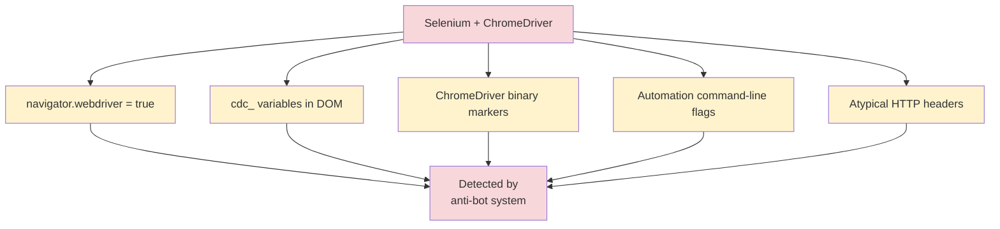
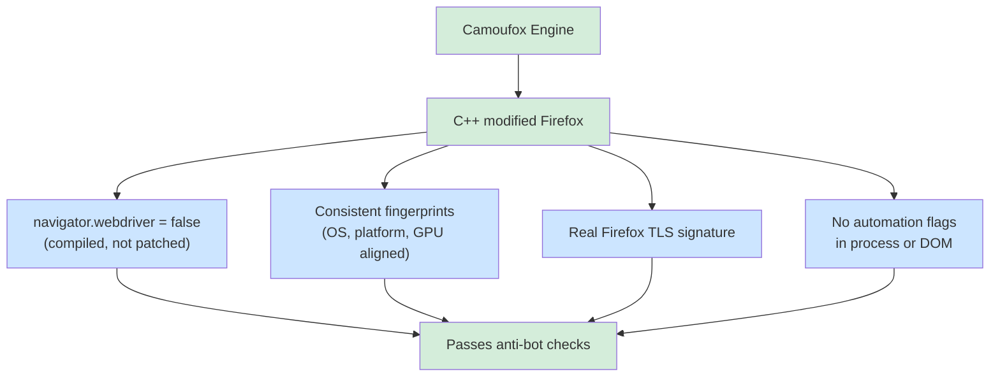
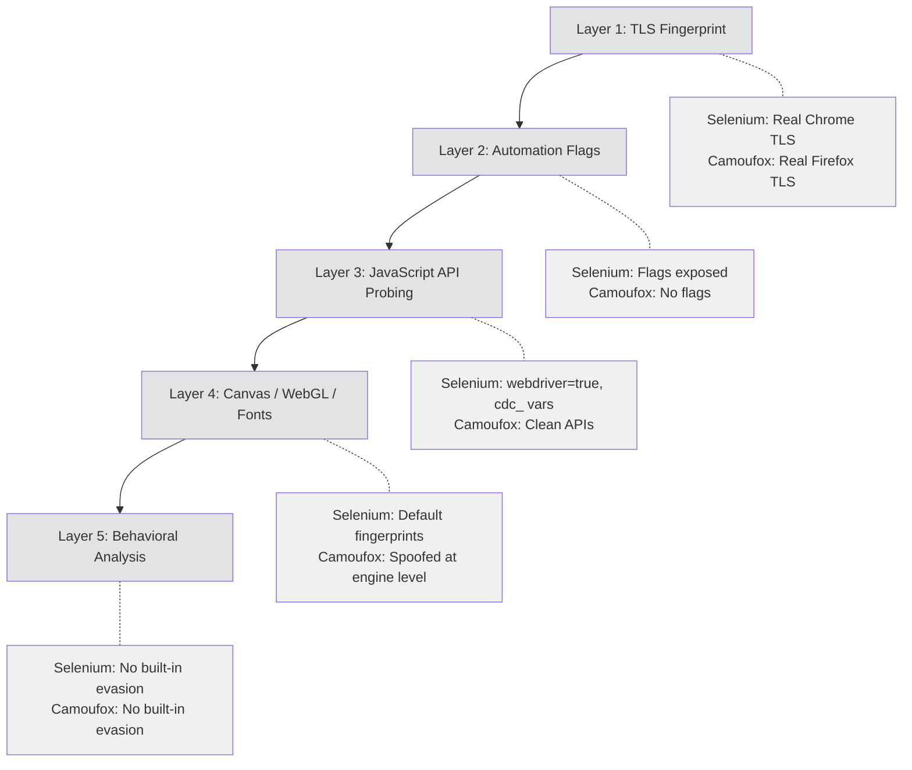
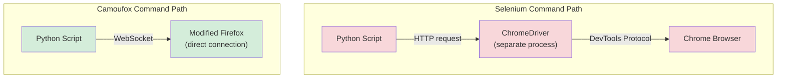
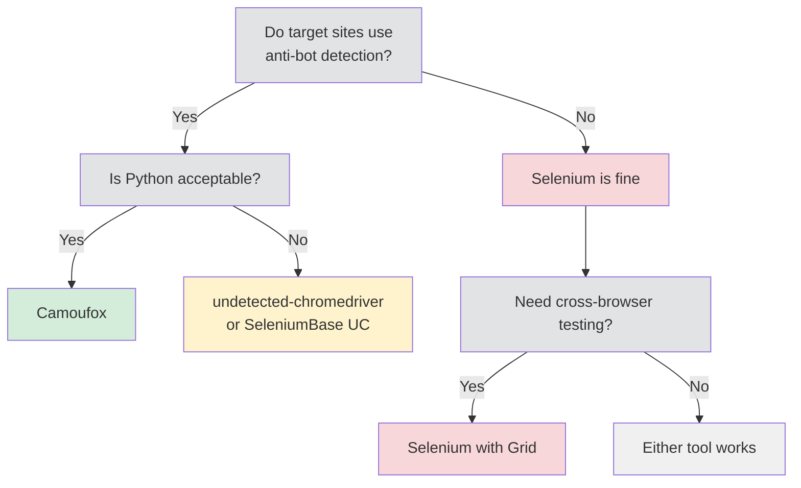

Selenium and Camoufox sit at opposite ends of the [stealth browser](/posts/stealth-browsers-in-2026-camoufox-nodriver-and-the-anti-detection-arms-race/) spectrum. Selenium was never designed to hide itself --- it was built to test web applications, and it loudly announces its presence through automation flags, binary markers, and distinctive header patterns. Camoufox was purpose-built for invisibility, modifying Firefox at the C++ engine level so that no JavaScript probe or fingerprinting script can distinguish it from a real user's browser. If you are choosing between them for scraping work, the question is not just which API you prefer --- it is whether your target sites care that you are automated.

## Selenium's Detection Problem

Selenium's detection surface is enormous. Every standard Selenium setup leaks automation signals at multiple layers, and anti-bot systems have had over a decade to catalog them.

The most well-known leak is `navigator.webdriver`. When Chrome is controlled by ChromeDriver, this property returns `true`. Any site can check it with a single line of JavaScript:

```javascript
if (navigator.webdriver) {
  console.log("Automated browser detected");
}
```

But that is just the beginning. ChromeDriver injects variables into the page's DOM that start with `cdc_` (short for ChromeDriver). These are internal references that ChromeDriver uses to communicate with the browser, and they are trivially detectable:

```javascript
// Anti-bot scripts scan for ChromeDriver artifacts
const cdcKeys = Object.keys(document).filter(k => k.startsWith('cdc_'));
if (cdcKeys.length > 0) {
  console.log("ChromeDriver detected via DOM variables");
}
```

The ChromeDriver binary itself contains identifiable strings. Some anti-bot systems examine the browser process to find references to `chromedriver`, `webdriver`, or automation-related command-line flags like `--enable-automation` and `--remote-debugging-port`.

Selenium-controlled browsers also produce HTTP header patterns that differ from normal browsers. The `Accept-Language`, `Accept-Encoding`, and `User-Agent` headers may be missing, truncated, or ordered differently than a real browser would send them. Sophisticated fingerprinting services aggregate these signals and score each session.



Every one of these signals is a separate detection vector, and many anti-bot services check all of them simultaneously.

## How Camoufox Achieves Stealth

Camoufox takes a fundamentally different approach. Instead of trying to patch over automation artifacts after the fact, it modifies the Firefox source code at the C++ level before compilation. The result is a browser binary that produces fingerprints indistinguishable from a normal Firefox installation.

There are no JavaScript shims to discover. When a detection script probes `navigator.webdriver`, the answer comes from compiled C++ code that returns `false` --- not from a JavaScript override that can be detected by checking property descriptors or prototype chains. Canvas fingerprints, WebGL renderer strings, font enumeration results, and screen dimensions all come from the engine level, making them consistent and resistant to cross-checking.

Camoufox also handles the fingerprint consistency problem that trips up most spoofing tools. When you change a User-Agent string to claim you are running macOS but your `navigator.platform` still says Linux, detection scripts catch the mismatch. Camoufox generates internally consistent fingerprint sets where every value --- platform, OS, screen resolution, GPU renderer, timezone, locale --- aligns correctly.



Out of the box, with zero configuration, Camoufox passes detection checks that would flag a vanilla Selenium setup instantly.

## Detection Layers and How Each Tool Handles Them

Modern anti-bot systems operate across multiple detection layers. The following diagram shows where Selenium and Camoufox sit at each layer.



Both tools use real browser engines, so TLS fingerprints are genuine. As the [evolution of web scraping detection methods](/posts/evolution-web-scraping-detection-methods-timeline/) shows, both also lack built-in behavioral evasion --- neither simulates human-like mouse movement or typing patterns natively. The critical difference is in layers two through four, where Selenium fails by default and Camoufox succeeds by design.

## Making Selenium Stealthier

The Selenium community has produced several tools to reduce its detection footprint. None of them fully close the gap, but they each address specific problems.

### selenium-stealth

The [`selenium-stealth` library](/posts/selenium-stealth-making-selenium-less-detectable/) patches common detection vectors by injecting JavaScript before page load:

```python
from selenium import webdriver
from selenium_stealth import stealth

driver = webdriver.Chrome()

stealth(driver,
    languages=["en-US", "en"],
    vendor="Google Inc.",
    platform="Win32",
    webgl_vendor="Intel Inc.",
    renderer="Intel Iris OpenGL Engine",
    fix_hairline=True,
)

driver.get("https://example.com")
print(driver.title)
driver.quit()
```

This patches `navigator.webdriver`, `navigator.languages`, `navigator.vendor`, and several other properties. The problem is that these are JavaScript-level patches. Detection scripts can discover them by examining property descriptors:

```javascript
// Detect if navigator.webdriver was overridden via JavaScript
const desc = Object.getOwnPropertyDescriptor(Navigator.prototype, 'webdriver');
if (desc && desc.get && desc.get.toString().includes('native code') === false) {
  console.log("webdriver property was patched");
}
```

### undetected-chromedriver

`undetected-chromedriver` takes a more aggressive approach. It patches the ChromeDriver binary itself, removing identifiable strings and modifying the way Chrome is launched:

```python
import undetected_chromedriver as uc

driver = uc.Chrome()
driver.get("https://example.com")
print(driver.title)
driver.quit()
```

This removes `cdc_` variables, suppresses `--enable-automation`, and patches the ChromeDriver binary to avoid static detection. It is significantly more effective than `selenium-stealth` alone and handles many sites that block vanilla Selenium. However, it still uses ChromeDriver under the hood, which means some detection vectors remain --- particularly those based on timing analysis of how commands are sent to the browser.

### SeleniumBase UC Mode

SeleniumBase includes an "Undetected Chrome" mode that combines the approaches above with additional patches:

```python
from seleniumbase import SB

with SB(uc=True) as sb:
    sb.uc_open_with_reconnect("https://example.com", 4)
    sb.uc_gui_click_captcha()
    print(sb.get_title())
```

UC mode disconnects ChromeDriver before loading the page, reconnects after the page has loaded, and includes helpers for interacting with CAPTCHAs. It is the most automated approach to Selenium stealth, but it adds complexity and can be fragile when anti-bot systems update their detection methods.

## Camoufox: Stealth Out of the Box

Camoufox requires no stealth configuration. The browser itself is the stealth mechanism:

```python
from camoufox.sync_api import Camoufox

with Camoufox() as browser:
    page = browser.new_page()
    page.goto("https://example.com")
    print(page.title())
```

That is the entire setup. No stealth plugins, no binary patching, no pre-page-load JavaScript injection. The browser launches with a realistic fingerprint, clean automation APIs, and a genuine Firefox TLS signature.

For more control over the fingerprint, Camoufox accepts configuration options (see also [using Camoufox with JavaScript](/posts/camoufox-with-javascript-browser-automation-without-detection/) if your team prefers Node.js):

```python
from camoufox.sync_api import Camoufox

with Camoufox(
    os="windows",
    humanize=True,
    screen={"width": 1920, "height": 1080},
) as browser:
    page = browser.new_page()
    page.goto("https://example.com")
    data = page.content()
    print(data[:500])
```

The `humanize` parameter adds small random delays to interactions, and the `os` parameter selects which operating system fingerprint to generate. All supporting fingerprint values --- navigator properties, screen metrics, font lists --- are adjusted to match.


<figure>
  
  <figcaption>Firefox's architecture offers unique advantages for fingerprint resistance. <span class="img-credit">Photo by Caio / <a href="https://www.pexels.com" target="_blank" rel="noopener noreferrer">Pexels</a></span></figcaption>
</figure>

## API Comparison

Selenium uses the WebDriver API, which is a W3C standard. Camoufox uses the Playwright API, which is a newer protocol with different design principles.

```python
# Selenium: finding elements
from selenium import webdriver
from selenium.webdriver.common.by import By
from selenium.webdriver.support.ui import WebDriverWait
from selenium.webdriver.support import expected_conditions as EC

driver = webdriver.Chrome()
driver.get("https://example.com")

# Explicit wait for element
wait = WebDriverWait(driver, 10)
element = wait.until(
    EC.presence_of_element_located((By.CSS_SELECTOR, "h1"))
)
print(element.text)
driver.quit()
```

```python
# Camoufox (Playwright API): finding elements
from camoufox.sync_api import Camoufox

with Camoufox() as browser:
    page = browser.new_page()
    page.goto("https://example.com")

    # Auto-waiting is built in
    heading = page.locator("h1")
    print(heading.text_content())
```

Key API differences:

| Feature | Selenium | Camoufox (Playwright) |
|---|---|---|
| Element lookup | `find_element(By.CSS, "h1")` | `page.locator("h1")` |
| Waiting | Explicit `WebDriverWait` | Auto-wait built in |
| Navigation | `driver.get(url)` | `page.goto(url)` |
| Page content | `driver.page_source` | `page.content()` |
| Screenshots | `driver.save_screenshot()` | `page.screenshot(path=)` |
| Multiple tabs | Window handles | `browser.new_page()` |
| Network interception | Not native | `page.route()` |

The Playwright API that Camoufox exposes is generally more concise. Auto-waiting eliminates the need for explicit wait boilerplate, and network interception is built into the API rather than requiring a proxy.

## Code Comparison: Same Scraping Task

Here is the same scraping task --- extracting product titles and prices from a listing page --- implemented in both tools.

### Selenium Version

```python
from selenium import webdriver
from selenium.webdriver.common.by import By
from selenium.webdriver.support.ui import WebDriverWait
from selenium.webdriver.support import expected_conditions as EC
from selenium.webdriver.chrome.options import Options
import json

options = Options()
options.add_argument("--headless=new")
options.add_argument("--disable-blink-features=AutomationControlled")

driver = webdriver.Chrome(options=options)

try:
    driver.get("https://shop.example.com/products")

    wait = WebDriverWait(driver, 15)
    wait.until(
        EC.presence_of_all_elements_located(
            (By.CSS_SELECTOR, ".product-card")
        )
    )

    products = []
    cards = driver.find_elements(By.CSS_SELECTOR, ".product-card")

    for card in cards:
        title = card.find_element(By.CSS_SELECTOR, ".title").text
        price = card.find_element(By.CSS_SELECTOR, ".price").text
        products.append({"title": title, "price": price})

    print(json.dumps(products, indent=2))
finally:
    driver.quit()
```

### Camoufox Version

```python
from camoufox.sync_api import Camoufox
import json

with Camoufox(headless=True) as browser:
    page = browser.new_page()
    page.goto("https://shop.example.com/products")

    # Auto-waits for elements to appear
    cards = page.locator(".product-card").all()

    products = []
    for card in cards:
        title = card.locator(".title").text_content()
        price = card.locator(".price").text_content()
        products.append({"title": title, "price": price})

    print(json.dumps(products, indent=2))
```

The Camoufox version is shorter because auto-waiting eliminates explicit wait logic, and the context manager handles browser cleanup. More importantly, the Camoufox version will pass detection checks on sites that block the Selenium version entirely.

## Performance Considerations

Selenium supports multiple browser engines --- Chrome, Firefox, Edge, Safari --- through the WebDriver protocol. This gives you flexibility but does not change the fundamental performance characteristics. ChromeDriver communicates with Chrome over HTTP, which adds latency to every command.

Camoufox is Firefox-based exclusively. It communicates over a WebSocket connection using the Playwright protocol, which is faster for command batching and event streaming. However, Firefox generally uses more memory than Chrome, and Camoufox's fingerprint modifications add a small overhead to startup time.



Selenium's extra hop through ChromeDriver adds measurable latency. For scraping tasks that make thousands of small interactions, Camoufox's direct connection is noticeably faster. For tasks that mostly wait for page loads, the difference is negligible.

In headless mode, both tools perform well for typical scraping workloads. The performance difference rarely matters as much as the detection difference.

## Ecosystem and Maturity

Selenium has been around since 2004. Its ecosystem is massive:

- Bindings in Python, Java, C#, Ruby, JavaScript, Kotlin
- Selenium Grid for distributed execution
- Thousands of Stack Overflow answers
- Integration with every CI/CD system
- Commercial support from BrowserStack, Sauce Labs, LambdaTest
- IDE plugins for recording and generating tests

Camoufox is significantly newer. Its ecosystem is focused:

- Python bindings (primary)
- Built on Playwright's protocol (access to Playwright's tooling)
- Smaller community, fewer tutorials
- No native grid or distributed execution
- Growing but limited third-party integration

If you need to run 500 browser instances across a Selenium Grid with Java bindings and integrate with Jenkins, Selenium is the only realistic choice. If you need one browser instance that can visit a site protected by Cloudflare or DataDome without being blocked, Camoufox is the better tool.

## Migration Difficulty

Selenium and Camoufox use entirely different APIs. There is no adapter library, no compatibility layer, and no gradual migration path. Moving from one to the other means rewriting your browser interaction code.

The conceptual mapping is straightforward --- both tools open browsers, navigate to URLs, find elements, and extract data --- but every method call changes:

```python
# Selenium
driver.get("https://example.com")
elem = driver.find_element(By.CSS_SELECTOR, ".target")
text = elem.text
driver.execute_script("return document.title")
driver.find_element(By.CSS_SELECTOR, "input").send_keys("query")
driver.find_element(By.CSS_SELECTOR, "button").click()

# Camoufox (Playwright API)
page.goto("https://example.com")
elem = page.locator(".target")
text = elem.text_content()
page.evaluate("document.title")
page.locator("input").fill("query")
page.locator("button").click()
```

For small scripts, the rewrite takes minutes. For large test suites with hundreds of tests, custom page object models, and framework integrations, migration is a significant effort. Consider running both tools in parallel during transition rather than attempting a big-bang rewrite.

## When to Use Which

The decision between Selenium and Camoufox comes down to your primary use case.

**Use Selenium when:**

- You are writing automated tests for your own application
- You need cross-browser testing (Chrome, Firefox, Safari, Edge)
- Your target sites do not employ anti-bot detection
- You have an existing Selenium codebase and no detection problems
- You need distributed execution via Selenium Grid
- Your team works in Java, C#, or another language Camoufox does not support

**Use Camoufox when:**

- Your target sites actively block automated browsers
- You need to bypass fingerprinting and bot detection
- You are working in Python
- You want stealth without configuring multiple anti-detection plugins
- You are building a new scraping project without legacy constraints
- The target uses Cloudflare, DataDome, PerimeterX, or similar protection



## Combining Both Tools

Some teams use both. Selenium handles the test suite and runs against staging environments where detection is not a concern. Camoufox handles the production scraping pipeline where stealth matters.

This is a pragmatic approach, but it means maintaining two sets of browser automation code with different APIs. If your scraping needs are limited, it may be simpler to standardize on Camoufox and use it for both testing and scraping --- the Playwright API it exposes is well-suited to testing, even if the stealth features go unused.

```python
# Using Camoufox for a simple test (stealth is a bonus, not a requirement)
from camoufox.sync_api import Camoufox

def test_homepage_loads():
    with Camoufox() as browser:
        page = browser.new_page()
        page.goto("https://myapp.example.com")
        assert page.title() == "My Application"
        assert page.locator("h1").text_content() == "Welcome"
```

## The Bottom Line

Selenium is the established standard for browser automation testing. It has unmatched ecosystem breadth, language support, and community resources. But it was never designed to be invisible, and making it stealthy requires layering multiple third-party patches that introduce their own fragility.

Camoufox was built for the single purpose of being undetectable. It trades ecosystem breadth for detection evasion depth. If your work requires visiting sites that actively try to block automated browsers, Camoufox solves the problem that Selenium's architecture makes fundamentally difficult. For a broader look at how Playwright compares on the stealth front, see our [Playwright vs Selenium stealth comparison](/posts/playwright-vs-selenium-stealth-which-evades-detection-better/).

For testing and legacy automation: Selenium. For stealth-critical scraping: Camoufox. The tools are complementary, not competitive, because they were designed for different jobs.
