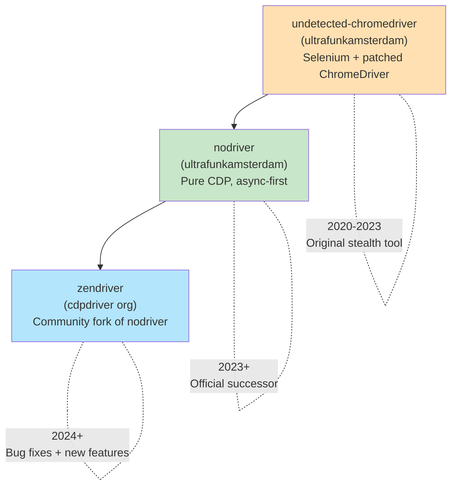
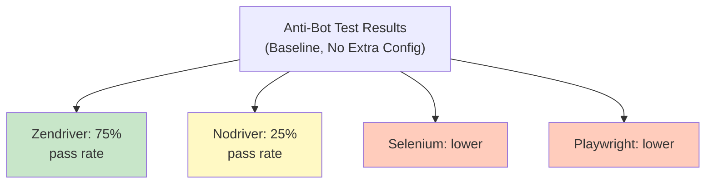
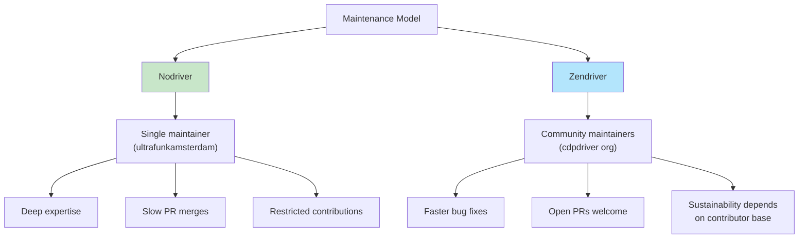

Both nodriver and zendriver exist because Selenium-based stealth tools hit a wall. They share the same DNA --- direct Chrome DevTools Protocol communication, async-first Python, no WebDriver binary --- but they have diverged in maintenance philosophy, feature set, and community dynamics. If you are choosing between them for a new project, the differences matter more than the similarities.

## The Lineage: How We Got Here

The story starts with undetected-chromedriver, the original Selenium wrapper by ultrafunkamsterdam that patched ChromeDriver to remove automation flags. If you are new to this space, our [complete guide to nodriver](/posts/nodriver-complete-guide-undetected-browser-automation-python/) covers the fundamentals before diving into the fork comparison here. It worked, but the architecture was inherently limited: you still had a ChromeDriver binary sitting between your code and the browser, and anti-bot systems learned to detect the artifacts it left behind.

The author's answer was nodriver --- a complete rewrite that threw out Selenium and ChromeDriver entirely. Instead of patching a middleman, nodriver connects directly to Chrome over a WebSocket using the Chrome DevTools Protocol. No driver binary, no `navigator.webdriver` flag, no `cdc_` variables. The browser launches clean.

Zendriver came later, as a community fork of nodriver under the cdpdriver GitHub organization. The motivation was straightforward: contributions to the original nodriver repo were heavily restricted, pull requests with critical bug fixes sat unmerged for months, and the issue tracker was largely closed to new reports. Zendriver forked the codebase, merged those fixes, and opened the door to community contributions.



This lineage matters because it determines who fixes what, how fast patches land, and where the project is headed.

## Nodriver: The Original Author's Vision

Nodriver is maintained by ultrafunkamsterdam, the same developer who created undetected-chromedriver. The project lives at `ultrafunkamsterdam/nodriver` on GitHub and has accumulated over 2,000 stars. It is available on PyPI as `nodriver`.

The core design decisions are:

- **Async-first**: every interaction with the browser is an `await` call, built on Python's `asyncio` event loop
- **Pure CDP**: communication happens over WebSocket using the Chrome DevTools Protocol, with no intermediary binaries
- **No Selenium dependency**: the entire Selenium/WebDriver stack is removed from the equation
- **Minimal surface area**: the API is deliberately lean, covering navigation, element interaction, JavaScript execution, and CDP access

Nodriver's stealth advantage comes from what it does not do. It never injects automation markers, never sets `--enable-automation`, and never spawns a ChromeDriver process. The browser is in its factory-default state, which means detection scripts that probe for Selenium or WebDriver artifacts find nothing.

```python
import nodriver as uc

async def main():
    browser = await uc.start()
    page = await browser.get("https://example.com")

    # Find an element by CSS selector
    element = await page.query_selector("h1")
    text = element.text
    print(f"Page heading: {text}")

    # Execute JavaScript
    title = await page.evaluate("document.title")
    print(f"Title: {title}")

    await browser.stop()

if __name__ == "__main__":
    uc.loop().run_until_complete(main())
```

The `uc.loop().run_until_complete()` pattern is specific to nodriver --- it manages its own event loop rather than relying on `asyncio.run()`. This is a deliberate choice by the author, though it can surprise developers who expect standard asyncio patterns.

### Nodriver Strengths

- Single maintainer with deep knowledge of the anti-detection space
- Stable core API that does not change frequently
- Proven track record going back to undetected-chromedriver
- Lightweight dependency footprint

### Nodriver Limitations

- Contributions from the community are difficult to merge
- Bug fixes can take a long time to land
- Issue tracker has limited engagement
- No official Docker support
- The custom event loop pattern can conflict with other async libraries

## Zendriver: The Community Fork

Zendriver was created under the cdpdriver GitHub organization specifically to address the contribution and maintenance gaps in nodriver. The project has over 1,200 stars on GitHub and is available on PyPI as `zendriver`.

The fork started by merging pull requests that had been sitting open on the nodriver repository, fixing known bugs that affected real-world usage. From there, the maintainers added features that the original project had not prioritized.

```python
import asyncio
import zendriver as zd

async def main():
    browser = await zd.start()
    page = await browser.get("https://example.com")

    # Find an element by CSS selector
    element = await page.query_selector("h1")
    text = element.text
    print(f"Page heading: {text}")

    # Execute JavaScript
    title = await page.evaluate("document.title")
    print(f"Title: {title}")

    await browser.stop()

if __name__ == "__main__":
    asyncio.run(main())
```

Notice the key difference: zendriver uses standard `asyncio.run(main())` instead of nodriver's custom event loop. The rest of the API is nearly identical, which is expected from a fork that aims to preserve compatibility while extending functionality.

### What Zendriver Adds

Zendriver's feature additions over nodriver include:

- **Docker support**: an officially maintained `zendriver-docker` project template that packages Chrome with a virtual display, making deployment on headless servers straightforward. This includes VNC support for remote debugging.
- **Cookie persistence**: built-in mechanisms for saving and loading cookies to a file, allowing you to preserve login sessions across runs without manual serialization.
- **Typed CDP bindings**: improved type hints for Chrome DevTools Protocol domains, methods, and events, which makes IDE autocompletion and static analysis more useful.
- **Standard asyncio patterns**: uses `asyncio.run()` instead of a custom event loop, which plays better with other async libraries.
- **Active issue tracker**: bugs can be reported and discussed openly, and pull requests are reviewed and merged on a regular cadence.

### Zendriver Limitations

- Younger project with a shorter track record
- Community-maintained, which means the long-term sustainability depends on contributor engagement
- Some features may be less battle-tested than the stable nodriver equivalents
- Smaller overall user base compared to nodriver

## Architecture Comparison

Both tools share the same fundamental architecture since zendriver is a fork. The differences are in the wrapper layer and developer experience, not in how they communicate with Chrome.

```mermaid
graph TD
    subgraph "Shared Architecture"
        A["Python async code"] -->|"WebSocket"| B["Chrome DevTools Protocol"]
        B --> C["Unmodified Chrome"]
        C --> D["Target Website"]
    end

    subgraph "Nodriver Layer"
        E["uc.start()"] --> F["Custom event loop"]
        F --> G["Lean API surface"]
    end

    subgraph "Zendriver Layer"
        H["zd.start()"] --> I["Standard asyncio"]
        I --> J["Extended API +<br>Docker + cookies"]
    end

    style A fill:#f5f5f5
    style B fill:#f5f5f5
    style C fill:#f5f5f5
    style D fill:#f5f5f5
    style E fill:#c8e6c9
    style F fill:#c8e6c9
    style G fill:#c8e6c9
    style H fill:#b3e5fc
    style I fill:#b3e5fc
    style J fill:#b3e5fc
```



The stealth properties are identical in both tools because they stem from the same approach: launching an unmodified Chrome instance and communicating via CDP without injecting automation artifacts. Neither tool patches the browser, neither uses a driver binary, and neither sets automation flags.

## Side-by-Side Feature Table

Here is a direct comparison of what each tool offers:

| Feature | Nodriver | Zendriver |
|---|---|---|
| CDP communication | Yes | Yes |
| Async-first | Yes | Yes |
| No Selenium dependency | Yes | Yes |
| Event loop | Custom (`uc.loop()`) | Standard (`asyncio.run()`) |
| Docker support | No official support | Official `zendriver-docker` |
| VNC debugging | No | Yes (via Docker template) |
| Cookie persistence | Manual | Built-in save/load |
| Typed CDP bindings | Basic | Improved |
| PyPI package | `nodriver` | `zendriver` |
| GitHub stars | ~2,300 | ~1,200 |
| Maintainer | Original UC author | Community (cdpdriver org) |
| Issue tracker | Limited | Open |
| PR acceptance | Restricted | Active |

## Installation

Both packages install cleanly from PyPI with no system-level dependencies beyond having Chrome or Chromium installed on your machine.

```bash
# Nodriver
pip install nodriver

# Zendriver
pip install zendriver
```

Neither package bundles a browser binary. You need Chrome or Chromium available in your system PATH or at a known location. This is different from Playwright, which downloads its own browser builds. For a step-by-step walkthrough of setting up nodriver from scratch, see [getting started with nodriver](/posts/getting-started-nodriver-python-installation-first-script/).

For zendriver's Docker deployment:

```bash
# Clone the official Docker template
git clone https://github.com/cdpdriver/zendriver-docker.git
cd zendriver-docker

# Start with Docker Compose
docker-compose up
```

The Docker setup includes a virtual display (Xvfb) and a VNC server, which lets you run Chrome in headed mode on a headless server --- useful for debugging anti-bot issues where headless mode behaves differently.

## Code Comparison: Scraping a Page

The similarity between the two libraries becomes clear when you compare the same task side by side.

### Nodriver Version

```python
import nodriver as uc

async def scrape_quotes():
    browser = await uc.start()
    page = await browser.get("https://quotes.toscrape.com")

    quotes = await page.query_selector_all(".quote")
    for quote in quotes:
        text_el = await quote.query_selector(".text")
        author_el = await quote.query_selector(".author")
        print(f"{text_el.text} - {author_el.text}")

    await browser.stop()

if __name__ == "__main__":
    uc.loop().run_until_complete(scrape_quotes())
```

### Zendriver Version

```python
import asyncio
import zendriver as zd

async def scrape_quotes():
    browser = await zd.start()
    page = await browser.get("https://quotes.toscrape.com")

    quotes = await page.query_selector_all(".quote")
    for quote in quotes:
        text_el = await quote.query_selector(".text")
        author_el = await quote.query_selector(".author")
        print(f"{text_el.text} - {author_el.text}")

    await browser.stop()

if __name__ == "__main__":
    asyncio.run(scrape_quotes())
```

The only differences are the import line and the event loop invocation at the bottom. The actual scraping logic is identical. This means migrating between the two tools is a matter of changing two or three lines of code.


<figure>
  
  <figcaption>Staying undetected requires understanding what detection systems look for. <span class="img-credit">Photo by Maxim Landolfi / <a href="https://www.pexels.com" target="_blank" rel="noopener noreferrer">Pexels</a></span></figcaption>
</figure>

## Anti-Bot Performance

Both tools share the same stealth baseline because they use the same approach to browser control. However, independent benchmarks have shown differences in how well they perform against anti-bot services in practice.

One notable comparison by Dima Kynal tested nodriver, zendriver, Selenium, and Playwright against major anti-bot services including Cloudflare, DataDome, CloudFront, and Akamai. In that baseline test, zendriver achieved a higher pass rate than nodriver --- 75% versus 25%.



Take these numbers with appropriate caution. Anti-bot performance depends heavily on the specific site, the Chrome version, the test methodology, and whether additional configuration (proxies, fingerprint adjustments, timing) is applied. The bug fixes in zendriver may account for some of the difference, particularly if nodriver had issues with specific CDP interactions at the time of testing.

Neither tool is a silver bullet. Both will be detected by sophisticated behavioral analysis systems that track mouse movements, scroll patterns, and timing. The CDP-based approach defeats signature-based detection, not behavioral detection.

## Community and Maintenance

This is where the two projects differ most significantly.

**Nodriver** is a single-maintainer project. ultrafunkamsterdam has deep expertise in the anti-detection space, having maintained undetected-chromedriver for years before writing nodriver. The downside is that a single maintainer becomes a bottleneck. When the author is unavailable, bugs accumulate, PRs sit unreviewed, and the issue tracker goes quiet. The project's contribution model is deliberately restrictive, which keeps the codebase focused but limits the pace of improvement.

**Zendriver** adopted an open-contribution model. The cdpdriver organization accepts pull requests, triages issues publicly, and has merged fixes that nodriver had not accepted. The risk is the usual one for community forks: if the core contributors lose interest or move on, the project could stall. As of early 2026, development appears active, with regular releases and responsive issue handling.



## When to Choose Nodriver

Pick nodriver when:

- You want the tool maintained by the original author of undetected-chromedriver
- You prefer a stable, minimal API that does not change often
- You are not deploying to Docker or headless servers
- You do not need built-in cookie persistence
- You trust a single expert maintainer over a community governance model
- Your project is simple enough that you do not need the extra features zendriver adds

Install it with:

```bash
pip install nodriver
```

## When to Choose Zendriver

Pick zendriver when:

- You need Docker deployment with VNC debugging
- You want built-in cookie save/load without writing serialization code
- You prefer standard `asyncio.run()` patterns that integrate cleanly with other async libraries
- You want an active issue tracker where you can report bugs and get responses
- You value the merged bug fixes that nodriver has not accepted
- You are comfortable with a community-maintained project

Install it with:

```bash
pip install zendriver
```

## Migration Between the Two

Because zendriver is a fork of nodriver, switching between them is straightforward. The changes are almost entirely in the import and the event loop:

```python
# From nodriver to zendriver:
# 1. Change the import
# Before:
import nodriver as uc
# After:
import zendriver as zd

# 2. Change the start call
# Before:
browser = await uc.start()
# After:
browser = await zd.start()

# 3. Change the event loop
# Before:
uc.loop().run_until_complete(main())
# After:
import asyncio
asyncio.run(main())
```

The rest of your code --- element queries, navigation, JavaScript execution, CDP calls --- should work without modification. If you hit compatibility issues, they are most likely in edge cases around CDP event handling or browser configuration options where zendriver has diverged from nodriver's behavior.

## The Honest Assessment

Both tools are good at what they do, and both are better than Selenium-based stealth solutions for most anti-detection use cases. They sit alongside tools like [Camoufox and other stealth browsers](/posts/stealth-browsers-in-2026-camoufox-nodriver-and-the-anti-detection-arms-race/) in the broader anti-detection landscape. The choice between them is less about technical capability and more about project philosophy:

- **Nodriver** is the safe, conservative choice. It has the original author, a proven history, and a stable API. It is the option you pick when you want something that works and do not need extras.
- **Zendriver** is the pragmatic choice for teams that need Docker deployment, want an active bug-fix pipeline, or prefer open-source projects with community governance. It carries the usual risks of a fork --- potential divergence from upstream, dependency on volunteer maintainers --- but it addresses real gaps in nodriver's maintenance model.

For most individual developers starting a new project, nodriver remains the default recommendation because of its provenance and stability. For teams deploying to production, especially in containerized environments, zendriver's Docker support and active maintenance make it worth serious consideration.

If you prefer a library that communicates over CDP with a different design philosophy, [Pydoll](/posts/pydoll-vs-playwright-lightweight-python-browser-control/) is another lightweight option worth evaluating.

Whichever you choose, the migration path is trivial. You are not locked in.
