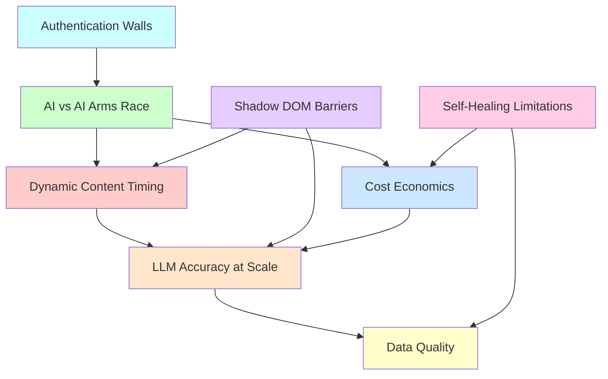
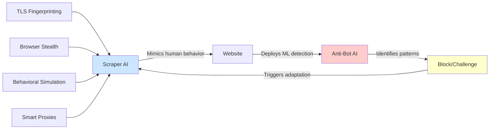
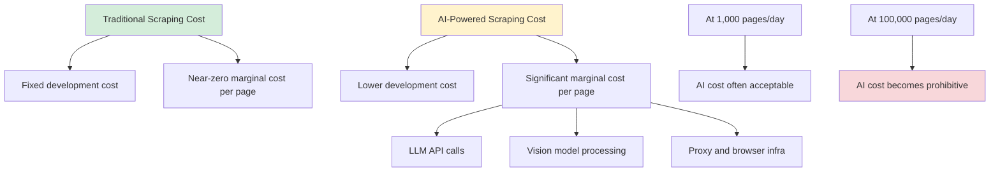

AI has transformed web scraping from a fragile, selector-driven craft into something that feels almost magical. Point a vision model at a webpage, describe what you want, and structured data comes back. But beneath the impressive demos lies a set of hard, unsolved problems that the industry has not cracked yet. These are not minor inconveniences. They are barriers that limit what AI-powered scraping can reliably do at scale.

The numbers tell the story. AI bot traffic has surged to roughly 1 bot per 31 humans, up from 1 per 200 in the first quarter of 2025. Proxy spending is up 65.8% year-over-year. And 62% of scraping professionals reported increased spending in the latest industry surveys. The stakes keep rising, and so do the obstacles.

## The Web of Interconnected Problems

These unsolved problems do not exist in isolation. They feed into and amplify each other, creating a tangle that makes comprehensive solutions hard to build.



Solving any one of these alone provides only marginal improvement. Real progress will come from solutions that address multiple problems at once.

## Problem 1: Dynamic Content Timing Mismatch

Modern websites do not render all at once. JavaScript-heavy sites load content asynchronously, and what a scraper sees depends entirely on when it looks. Server-side rendering frameworks like Next.js and Nuxt return different HTML depending on context: a server-rendered shell on first load, then hydrated client-side content milliseconds later, then lazily loaded sections as the user scrolls.

The result is that scrapers frequently capture placeholder content, loading spinners, or partially rendered states.

```python
from playwright.sync_api import sync_playwright

def demonstrate_timing_problem():
    with sync_playwright() as p:
        browser = p.chromium.launch()
        page = browser.new_page()

        page.goto("https://example-spa.com/dashboard")

        # This often captures the loading skeleton, not real data
        immediate_content = page.content()
        print("Immediate:", "Loading..." in immediate_content)  # True

        # Waiting for network idle helps, but not always
        page.wait_for_load_state("networkidle")
        after_idle = page.content()
        print("After idle:", "Loading..." in after_idle)  # Sometimes still True

        # Some content loads only after user interaction or scroll
        page.evaluate("window.scrollTo(0, document.body.scrollHeight)")
        page.wait_for_timeout(3000)
        after_scroll = page.content()
        print("After scroll:", "Loading..." in after_scroll)  # May still be True

        # The fundamental problem: there is no reliable signal
        # that tells you "all content has finished loading"
        browser.close()

demonstrate_timing_problem()
```

The `networkidle` wait strategy fails when sites use WebSocket connections, long-polling, or service workers that keep network activity alive indefinitely. Waiting for specific selectors works only if you know what to wait for, which defeats the purpose of AI-driven scraping. Fixed timeouts are inherently wasteful and unreliable.

No framework has solved this reliably. The best current approaches use a combination of mutation observers and heuristic stabilization checks, but they still fail on sites with continuous background updates like dashboards and real-time feeds.

## Problem 2: LLM Accuracy at Scale

When you ask a vision model to extract a price from a single product page, it works well. When you ask it to extract prices from ten thousand pages across fifty different site layouts, accuracy degrades in ways that are difficult to detect and nearly impossible to fix systematically.

```python
# Demonstrating how LLM extraction can silently fail

# Scenario: extracting financial data from a table
page_html = """
<table class="financials">
  <tr><td>Revenue</td><td>$1,234,567</td></tr>
  <tr><td>Net Income</td><td>($234,567)</td></tr>
  <tr><td>EPS</td><td>$2.34</td></tr>
</table>
"""

# What the LLM might return on different runs:
extraction_run_1 = {
    "revenue": 1234567,       # Correct
    "net_income": -234567,    # Correct: understood parentheses = negative
    "eps": 2.34,              # Correct
}

extraction_run_2 = {
    "revenue": 1234567,       # Correct
    "net_income": 234567,     # WRONG: missed the parentheses convention
    "eps": 2.34,              # Correct
}

# The problem: both responses look structurally valid.
# There is no automated way to know which is correct
# without domain-specific validation logic for every field.
```

LLMs are probabilistic, and their interpretation of visual layouts varies based on font size, column alignment, whitespace, and surrounding context. Financial data in parentheses might be read as negative in one layout and positive in another. A percentage sign next to a number might be captured or dropped depending on how the model tokenizes the surrounding text.

Accuracy typically sits between 92% and 97% for well-structured pages. That sounds good until you realize that at 95% accuracy across 10,000 pages, you have 500 incorrect records with no reliable way to identify which ones they are.

## Problem 3: The Self-Healing Illusion

"Self-healing selectors" is one of the most marketed features of AI scraping tools and one of the least honest. The promise is that when a website changes its layout, the scraper automatically adapts. The reality is much more limited.

```python
# What "self-healing" actually handles well:
# CSS class name changes that preserve structure

# Before site redesign
old_selector = "div.product-card > span.price-text"

# After site redesign
new_selector = "div.item-listing > span.cost-display"

# AI can often figure this out because the surrounding
# context (product name, image, add-to-cart button) stayed the same.

# What self-healing CANNOT handle:
# Fundamental structural changes

# Before: prices shown inline with products
# <div class="product">
#   <span class="name">Widget</span>
#   <span class="price">$29.99</span>
# </div>

# After: prices loaded via separate API and injected dynamically
# <div class="product">
#   <span class="name">Widget</span>
#   <div class="price-container" data-sku="W001"></div>
# </div>
# Price appears only after a separate JS fetch completes

# No amount of selector intelligence can bridge this gap
# without understanding the new data-loading architecture.
```

True self-healing would require understanding not just what the page looks like, but how it works: which JavaScript modules load what data, which API endpoints feed which components, and how the rendering pipeline transforms raw data into visible elements. Current AI models can match visual patterns, but they cannot reverse-engineer application architecture on the fly.

## Problem 4: The AI vs AI Arms Race

Anti-bot systems now use machine learning behavioral analysis to detect automation, while scraping frameworks use AI to mimic human behavior. The result is an escalating arms race where both sides continuously adapt.



```javascript
// The multi-layered evasion stack required in 2026
const puppeteer = require("puppeteer-extra");
const StealthPlugin = require("puppeteer-extra-plugin-stealth");

puppeteer.use(StealthPlugin());

async function evadeDetection() {
  const browser = await puppeteer.launch({
    headless: false,
    args: [
      "--disable-blink-features=AutomationControlled",
      "--no-sandbox",
    ],
  });

  const page = await browser.newPage();

  // Layer 1: Basic stealth (navigator.webdriver, chrome runtime)
  // Handled by StealthPlugin

  // Layer 2: Behavioral simulation
  await page.goto("https://protected-site.com");

  // Simulate human-like mouse movements
  await page.mouse.move(100, 200, { steps: 25 });
  await page.mouse.move(400, 300, { steps: 30 });

  // Simulate reading time
  await page.waitForTimeout(2000 + Math.random() * 3000);

  // Layer 3: Scroll patterns that look organic
  for (let i = 0; i < 5; i++) {
    const scrollAmount = 200 + Math.floor(Math.random() * 300);
    await page.evaluate(
      (amount) => window.scrollBy(0, amount),
      scrollAmount
    );
    await page.waitForTimeout(500 + Math.random() * 1500);
  }

  // Layer 4: Even with all this, advanced ML detection
  // can still flag the session based on:
  // - Mouse movement velocity curves
  // - Scroll deceleration patterns
  // - Time between actions distribution
  // - Canvas/WebGL fingerprint consistency
  // There is no comprehensive solution.

  await browser.close();
}

evadeDetection();
```

The asymmetry makes this problem especially hard. Defenders only need to detect anomalies, while scrapers must perfectly replicate the full distribution of human behavior across every measurable dimension. As anti-bot systems incorporate more behavioral signals --- mouse movement physics, scroll momentum curves, keystroke timing distributions --- the bar for convincing simulation keeps rising.

## Problem 5: Data Quality at Scale

Even when extraction succeeds technically, the extracted data is often contaminated. Noise, duplicates, spam, bot-generated content, and fake accounts pollute datasets in ways that are hard to filter programmatically.

```python
# Demonstrating the data quality problem

raw_extractions = [
    {"name": "Widget Pro", "price": "$29.99", "reviews": 1247},
    {"name": "Widget Pro", "price": "$29.99", "reviews": 1247},   # Duplicate
    {"name": "Widget Pro!!", "price": "$29.99", "reviews": 1247}, # Near-dup
    {"name": "BEST DEAL CLICK HERE", "price": "$0.01", "reviews": 5},  # Spam
    {"name": "Widget Pro", "price": "Contact for price", "reviews": 0},
    {"name": "Widget Pro", "price": "$29.99", "reviews": 98432},  # Fake reviews
]

# Basic deduplication catches exact matches
seen = set()
deduped = []
for item in raw_extractions:
    key = (item["name"], item["price"])
    if key not in seen:
        seen.add(key)
        deduped.append(item)

# But fuzzy duplicates, spam, and fake data require
# domain-specific heuristics that do not generalize.
# "Widget Pro!!" is clearly the same product, but
# automated fuzzy matching creates false positives
# when applied across millions of records.

# Review count of 98432 might be legitimate for a
# popular product or might indicate review manipulation.
# There is no universal threshold.
```

AI models can help with classification, but they introduce their own accuracy problems (see Problem 2), creating a recursive challenge: you need AI to clean data that was extracted by AI that has its own error rate.

## Problem 6: Shadow DOM and Web Component Barriers

Modern design systems built on Web Components (Shoelace, Lit, and others) hide their internal structure inside shadow roots. This is a deliberate encapsulation mechanism that prevents external styles and scripts from accessing internal elements. It also prevents scrapers from reaching them.

```javascript
// Attempting to access shadow DOM content

const puppeteer = require("puppeteer");

async function shadowDomChallenge() {
  const browser = await puppeteer.launch();
  const page = await browser.newPage();
  await page.goto("https://example-components.com");

  // Standard selector: finds nothing inside shadow roots
  const price = await page.$eval(".price-display", (el) => el.textContent);
  // Throws: "Error: No element found for selector .price-display"

  // The element exists, but inside a shadow root:
  // <product-card>
  //   #shadow-root (closed)
  //     <div class="price-display">$29.99</div>
  // </product-card>

  // Workaround for open shadow roots
  const openShadowPrice = await page.evaluate(() => {
    const host = document.querySelector("product-card");
    if (host && host.shadowRoot) {
      return host.shadowRoot.querySelector(".price-display").textContent;
    }
    return null;
  });

  // But closed shadow roots are completely inaccessible
  // from external JavaScript. The shadowRoot property
  // returns null for mode: "closed".

  // Even accessibility tree snapshots, which AI agents
  // rely on, cannot reliably reach inside closed shadow roots.

  console.log("Open shadow:", openShadowPrice);
  await browser.close();
}

shadowDomChallenge();
```

As more organizations adopt component libraries with shadow DOM encapsulation, this problem will only grow. The accessibility tree, which many AI browser agents use as their primary page representation, does not consistently surface content hidden inside shadow roots. This creates blind spots that no amount of AI reasoning can work around.

## Problem 7: Cost Economics

LLM-powered scraping remains expensive, and the economics do not scale the way traditional scraping does.



```python
# Back-of-envelope cost comparison

# Traditional Playwright scraping
traditional_cost_per_page = 0.001  # Mostly compute and proxy costs
traditional_daily_pages = 100_000
traditional_daily_cost = traditional_cost_per_page * traditional_daily_pages
# $100/day

# AI-powered scraping with vision models
ai_cost_per_page = 0.02  # LLM API + vision processing
ai_daily_pages = 100_000
ai_daily_cost = ai_cost_per_page * ai_daily_pages
# $2,000/day

# The 20x cost multiplier makes AI scraping impractical
# for high-volume use cases, even with caching and
# batching optimizations.

# Hybrid approach: use AI for template discovery,
# then generate traditional selectors for production
hybrid_ai_calls = 500  # One per unique page template
hybrid_ai_cost = hybrid_ai_calls * 0.02  # $10
hybrid_traditional_cost = traditional_daily_cost  # $100
# $110/day total, but requires engineering to build
# the template-to-selector pipeline
```

The hybrid approach --- using AI to discover page structures and then generating deterministic extraction logic --- is the most promising cost optimization strategy. But building that pipeline is itself a large engineering challenge, and it reintroduces the brittleness that AI scraping was supposed to eliminate.

## Problem 8: Authentication and Session Persistence

Scraping behind login walls breaks most AI agents. Authentication flows involve CAPTCHAs, multi-factor authentication, session tokens with short lifespans, and anti-fraud systems that flag automated logins. Maintaining persistent sessions across multiple scraping runs adds another layer of complexity.

```python
from playwright.sync_api import sync_playwright

def authentication_challenge():
    with sync_playwright() as p:
        browser = p.chromium.launch()
        context = browser.new_context()
        page = context.new_page()

        page.goto("https://example-app.com/login")

        # Step 1: Fill credentials - AI agents can do this
        page.fill("#email", "user@example.com")
        page.fill("#password", "secure_password")
        page.click("#login-button")

        # Step 2: Handle MFA - major blocker for automation
        # The site sends an SMS code or requires an authenticator app.
        # AI agents cannot access the user's phone.
        # mfa_code = ???

        # Step 3: Session persistence across runs
        # Save cookies and storage state
        storage = context.storage_state()
        # But tokens expire, sessions invalidate, and
        # the site may require re-authentication based on
        # IP changes, browser fingerprint changes, or
        # time-based policies.

        # Step 4: Anti-fraud detection
        # Even with valid credentials, automated login patterns
        # (consistent timing, same IP, no mouse movement on
        # login page) trigger fraud alerts that lock accounts.

        browser.close()

authentication_challenge()
```

This problem compounds with the AI vs AI arms race: anti-fraud systems are themselves AI-powered, trained on millions of login attempts to distinguish humans from bots. No current framework offers a robust, general-purpose solution for authenticated scraping at scale.

## Where Do We Go From Here

These eight problems share a common thread: they exist at the intersection of increasing web complexity and the limitations of current AI systems. LLMs are powerful pattern matchers, but they lack the architectural understanding, deterministic guarantees, and cost efficiency needed for reliable scraping at scale.

The areas worth watching are hybrid architectures that use AI strategically rather than universally, better standardization around web accessibility (which benefits both humans and scrapers), and more sophisticated caching layers that amortize AI costs across similar pages.

These are hard problems. Anyone selling a fully autonomous, self-healing, infinitely scalable AI scraping solution in 2026 is ahead of what the technology can actually deliver. The practitioners who succeed will be the ones who understand these limitations clearly enough to engineer around them.
