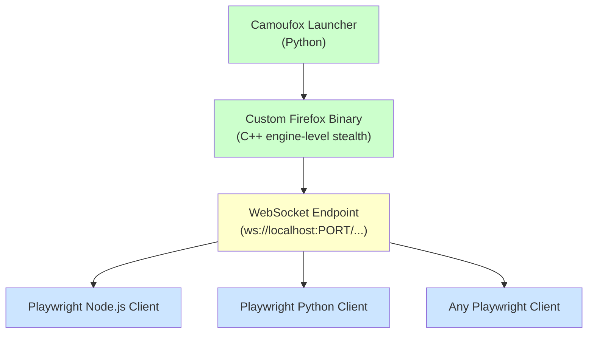
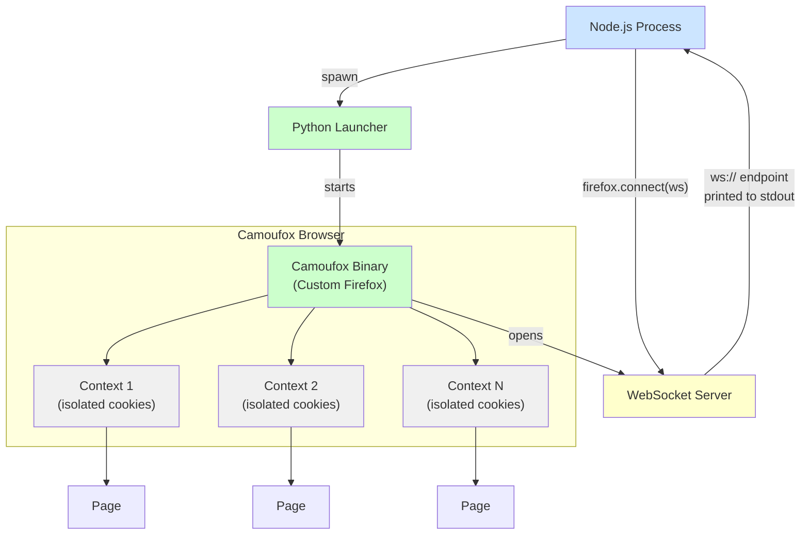
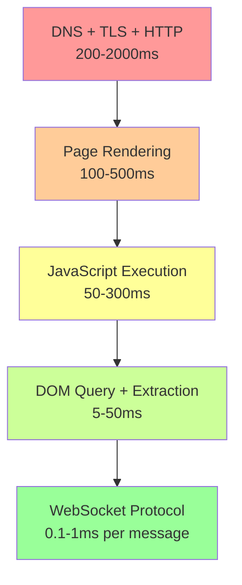
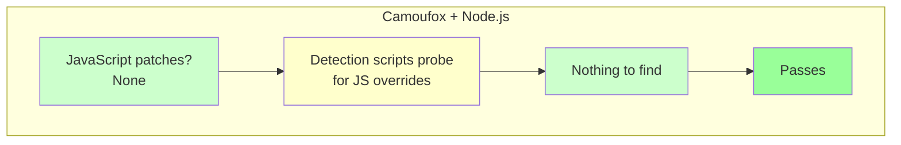
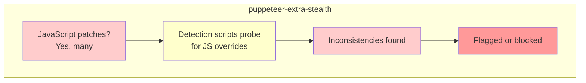

Camoufox is built as a Python tool. If you have not already seen how it [compares to Selenium on the anti-detection front](/posts/camoufox-vs-selenium-anti-detection-approaches-compared/), that context is helpful before diving into the JavaScript integration covered here. Its API is Python, its package manager is pip, and every official example is written in Python. But Camoufox is not actually locked to Python. Under the hood, it launches a custom-compiled Firefox binary and exposes a Playwright-compatible WebSocket endpoint. Any Playwright client that can connect over WebSocket --- including the Node.js version --- can drive that browser. This means you can get Camoufox's engine-level fingerprint resistance while writing all of your automation logic in JavaScript or TypeScript, using the Playwright API your team already knows.

## Why This Works

Playwright's architecture separates the browser process from the client library. The client communicates with the browser over a WebSocket connection using a protocol that is identical across all language bindings. When you call `page.goto()` in Python or `page.goto()` in Node.js, both send the same protocol message over the same WebSocket transport.

Camoufox leverages Playwright internally. When you launch Camoufox, it starts its custom Firefox binary and creates a WebSocket server. Any Playwright client --- Python, Node.js, Java, .NET --- can connect to that endpoint and control the browser.



The key insight: Camoufox's stealth properties live in the browser binary, not in the client library. The client is just a remote control. Swapping the remote control from Python to Node.js does not affect the browser's fingerprint.

## Launching Camoufox from Python and Connecting from Node.js

The most straightforward approach uses Python to launch Camoufox and extract the WebSocket endpoint, then connects from a separate Node.js process. This two-step pattern keeps the launch mechanism in Python (where Camoufox is natively supported) while moving all automation logic to JavaScript.

### Step 1: Python Launcher Script

Create a small Python script that launches Camoufox and prints the WebSocket endpoint:

```python
# launch_camoufox.py
import sys
import json
from camoufox.sync_api import Camoufox

def main():
    with Camoufox(
        headless=True,
        # Optional: configure fingerprint
        os="windows",
    ) as browser:
        # Get the WebSocket endpoint
        ws_endpoint = browser.browser.ws_endpoint

        # Print it so the Node.js process can read it
        print(json.dumps({"wsEndpoint": ws_endpoint}), flush=True)

        # Keep the browser alive until stdin is closed
        # (the Node.js process will close stdin when done)
        try:
            sys.stdin.read()
        except KeyboardInterrupt:
            pass

if __name__ == "__main__":
    main()
```

The script prints the WebSocket URL as JSON and then blocks on `stdin.read()`. When the Node.js process finishes and closes the pipe, the Python script exits and Camoufox shuts down cleanly.

### Step 2: Node.js Connection Script

On the JavaScript side, spawn the Python launcher, read the WebSocket endpoint, and connect Playwright:

```javascript
// connect_camoufox.mjs
import { spawn } from "child_process";
import { firefox } from "playwright";
import { createInterface } from "readline";

async function launchCamoufox() {
  return new Promise((resolve, reject) => {
    const proc = spawn("python", ["launch_camoufox.py"], {
      stdio: ["pipe", "pipe", "pipe"],
    });

    const rl = createInterface({ input: proc.stdout });

    rl.on("line", (line) => {
      try {
        const data = JSON.parse(line);
        if (data.wsEndpoint) {
          resolve({ wsEndpoint: data.wsEndpoint, process: proc });
        }
      } catch {
        // Not JSON, skip
      }
    });

    proc.on("error", reject);
    proc.on("exit", (code) => {
      if (code !== 0) {
        reject(new Error(`Camoufox launcher exited with code ${code}`));
      }
    });
  });
}

async function main() {
  console.log("Launching Camoufox...");
  const { wsEndpoint, process: camoufoxProc } = await launchCamoufox();
  console.log(`Connected to: ${wsEndpoint}`);

  // Connect Playwright to the running Camoufox instance
  const browser = await firefox.connect(wsEndpoint);
  const context = await browser.newContext();
  const page = await context.newPage();

  try {
    await page.goto("https://example.com");
    console.log("Title:", await page.title());
  } finally {
    await browser.close();
    // Signal the Python process to exit
    camoufoxProc.stdin.end();
  }
}

main().catch(console.error);
```

This gives you full Playwright Node.js API access while the actual browser is Camoufox's stealth Firefox. Every `page.goto()`, `page.click()`, and `page.evaluate()` call works exactly as it would with a normal Playwright Firefox instance.

## Pure Node.js Approach: Launching the Binary Directly

If you want to eliminate the Python runtime dependency from your workflow (assuming Camoufox is already installed and the binary is cached), you can locate and launch the Camoufox binary directly from Node.js.

Camoufox stores its custom Firefox binary in a known location after the first Python launch. You can find it and start it with the appropriate flags:

```javascript
// launch_direct.mjs
import { execSync, spawn } from "child_process";
import { firefox } from "playwright";
import path from "path";

async function findCamoufoxBinary() {
  // Camoufox stores its binary path in the Python package
  // Use Python to resolve it
  const binaryPath = execSync(
    'python -c "from camoufox.pkgman import get_path; print(get_path(\'camoufox\'))"',
    { encoding: "utf-8" }
  ).trim();

  return binaryPath;
}

async function launchCamoufoxDirect() {
  const binaryPath = await findCamoufoxBinary();

  // Launch the browser with Playwright-compatible flags
  const userDataDir = `/tmp/camoufox-profile-${Date.now()}`;

  // Use Playwright's built-in browser server launch
  const browserServer = await firefox.launchServer({
    executablePath: binaryPath,
    headless: true,
    args: ["--no-remote"],
  });

  return browserServer;
}

async function main() {
  const server = await launchCamoufoxDirect();
  const wsEndpoint = server.wsEndpoint();
  console.log(`Browser server running at: ${wsEndpoint}`);

  const browser = await firefox.connect(wsEndpoint);
  const page = await browser.newPage();

  try {
    await page.goto("https://example.com");
    console.log("Page title:", await page.title());
    console.log("User agent:", await page.evaluate(() => navigator.userAgent));
  } finally {
    await browser.close();
    await server.close();
  }
}

main().catch(console.error);
```

A caveat with this approach: launching the binary directly bypasses Camoufox's Python-side configuration layer, which handles fingerprint randomization, screen dimension spoofing, and GeoIP-based locale settings. You get the core engine-level stealth (the C++ modifications to canvas, WebGL, and fonts), but you lose the automated fingerprint orchestration that Camoufox's Python API provides. For most use cases, the hybrid Python-launcher approach from the previous section gives you the best of both worlds.

## Scraping Example: Full Workflow

Here is a complete example that launches Camoufox, connects from Node.js, and scrapes structured data from a page:

```javascript
// scrape_with_camoufox.mjs
import { spawn } from "child_process";
import { firefox } from "playwright";
import { createInterface } from "readline";

function startCamoufox() {
  return new Promise((resolve, reject) => {
    const proc = spawn("python", ["-c", `
import sys, json
from camoufox.sync_api import Camoufox

with Camoufox(headless=True) as browser:
    ws = browser.browser.ws_endpoint
    print(json.dumps({"ws": ws}), flush=True)
    sys.stdin.read()
`], { stdio: ["pipe", "pipe", "pipe"] });

    const rl = createInterface({ input: proc.stdout });
    rl.on("line", (line) => {
      try {
        const { ws } = JSON.parse(line);
        if (ws) resolve({ ws, proc });
      } catch {}
    });

    proc.on("error", reject);

    setTimeout(() => reject(new Error("Camoufox launch timeout")), 30000);
  });
}

async function scrapeProducts(page, url) {
  await page.goto(url, { waitUntil: "domcontentloaded" });

  // Wait for product elements to render
  await page.waitForSelector(".product-card", { timeout: 10000 });

  // Extract structured data
  const products = await page.$$eval(".product-card", (cards) =>
    cards.map((card) => ({
      name: card.querySelector(".product-title")?.textContent?.trim(),
      price: card.querySelector(".product-price")?.textContent?.trim(),
      rating: card.querySelector(".product-rating")?.textContent?.trim(),
      url: card.querySelector("a")?.href,
    }))
  );

  return products;
}

async function main() {
  const { ws, proc } = await startCamoufox();

  const browser = await firefox.connect(ws);
  const context = await browser.newContext();
  const page = await context.newPage();

  try {
    // Navigate and scrape
    const products = await scrapeProducts(
      page,
      "https://example.com/products"
    );

    console.log(`Found ${products.length} products:`);
    for (const product of products) {
      console.log(`  ${product.name} - ${product.price}`);
    }

    // Pagination example
    let currentPage = 1;
    const allProducts = [...products];

    while (currentPage < 5) {
      const nextButton = await page.$('a[rel="next"]');
      if (!nextButton) break;

      await nextButton.click();
      await page.waitForLoadState("domcontentloaded");
      await page.waitForSelector(".product-card", { timeout: 10000 });

      const moreProducts = await page.$$eval(".product-card", (cards) =>
        cards.map((card) => ({
          name: card.querySelector(".product-title")?.textContent?.trim(),
          price: card.querySelector(".product-price")?.textContent?.trim(),
          rating: card.querySelector(".product-rating")?.textContent?.trim(),
          url: card.querySelector("a")?.href,
        }))
      );
      allProducts.push(...moreProducts);
      currentPage++;
    }

    console.log(`\nTotal products scraped: ${allProducts.length}`);
  } finally {
    await browser.close();
    proc.stdin.end();
  }
}

main().catch(console.error);
```

Because the browser is Camoufox, every page load carries engine-level fingerprint resistance. Canvas hashes, WebGL renderer strings, and font enumeration all produce realistic, consistent values from the modified C++ code --- not from JavaScript patches that detection scripts can discover.


<figure>
  
  <figcaption>Firefox's architecture offers unique advantages for fingerprint resistance. <span class="img-credit">Photo by Caio / <a href="https://www.pexels.com" target="_blank" rel="noopener noreferrer">Pexels</a></span></figcaption>
</figure>

## Handling Multiple Pages and Contexts

Camoufox supports multiple browser contexts through the same WebSocket connection. Each context gets its own cookies, storage, and session state while sharing the same stealth browser:

```javascript
// multi_context.mjs
import { firefox } from "playwright";

async function runWithMultipleContexts(wsEndpoint) {
  const browser = await firefox.connect(wsEndpoint);

  // Create isolated contexts for different tasks
  const contexts = await Promise.all([
    browser.newContext(),
    browser.newContext(),
    browser.newContext(),
  ]);

  // Run tasks in parallel across contexts
  const results = await Promise.all(
    contexts.map(async (context, i) => {
      const page = await context.newPage();
      await page.goto(`https://example.com/category/${i + 1}`);
      const title = await page.title();
      await context.close();
      return { category: i + 1, title };
    })
  );

  console.log("Results:", results);
  await browser.close();
}
```

Each context operates independently. Cookies set in one context do not leak into another. This is useful for scraping multiple sections of a site simultaneously without session interference.

## Architecture: How the Pieces Fit Together



The Node.js process is the orchestrator. It spawns Python only to launch the browser, then communicates exclusively over WebSocket. The Python process is dormant after startup --- it just keeps the browser alive.

## Why Use JavaScript with Camoufox

There are practical reasons to drive Camoufox from Node.js instead of using its native Python API:

**Existing codebase.** If your automation pipeline is already built in Node.js with Playwright, switching to Python means rewriting working code. Connecting Camoufox over WebSocket lets you drop in stealth capabilities without touching your existing page interaction logic.

**Team expertise.** Not every team has Python developers. If your engineers are JavaScript-first, forcing them to learn Python just for the browser launcher creates friction and bugs. The WebSocket bridge lets them stay in familiar territory.

**Playwright JS ecosystem.** The Playwright Node.js library has extensive TypeScript support, mature testing utilities, and a large ecosystem of plugins and helpers. Some teams prefer these tools over their Python equivalents.

**Unified toolchain.** If your data processing, API servers, and frontend are all JavaScript, adding a Python dependency for one component adds operational complexity. The hybrid approach minimizes the Python footprint to a single launcher script.


<figure>
  
  <figcaption>Anti-detection is as much about consistency as it is about spoofing. <span class="img-credit">Photo by Mikhail Nilov / <a href="https://www.pexels.com" target="_blank" rel="noopener noreferrer">Pexels</a></span></figcaption>
</figure>

## Limitations and Trade-offs

This approach is not without cost. You should understand the trade-offs before committing.

**Camoufox must be installed via Python.** There is no npm package for Camoufox. You need Python and pip on whatever machine runs the browser. In containerized environments, this means your Docker image needs both Node.js and Python runtimes.

```dockerfile
# Example: Docker image with both runtimes
FROM node:20-slim

# Install Python and Camoufox
RUN apt-get update && apt-get install -y python3 python3-pip
RUN pip3 install camoufox[geoip]

# Install Node.js dependencies
WORKDIR /app
COPY package*.json ./
RUN npm install
COPY . .

CMD ["node", "scrape_with_camoufox.mjs"]
```

**Extra launch step.** The Python-to-Node.js handoff adds a few seconds to startup. The Python process must boot, import Camoufox, download the binary on first run, and launch Firefox before the WebSocket endpoint is available. Subsequent runs skip the download but still need the Python import and Firefox launch.

**Configuration lives in Python.** Camoufox's advanced configuration --- fingerprint selection, GeoIP locale matching, screen dimension randomization --- is set through its Python API. If you want to change these settings dynamically, you need to modify the Python launcher or pass configuration through environment variables.

```python
# launch_configured.py
import sys, json, os
from camoufox.sync_api import Camoufox

config = {
    "headless": os.environ.get("CAMOUFOX_HEADLESS", "true") == "true",
    "os": os.environ.get("CAMOUFOX_OS", "windows"),
}

with Camoufox(**config) as browser:
    ws = browser.browser.ws_endpoint
    print(json.dumps({"ws": ws}), flush=True)
    sys.stdin.read()
```

```javascript
// Use environment variables to control Camoufox config from Node.js
const proc = spawn("python", ["launch_configured.py"], {
  stdio: ["pipe", "pipe", "pipe"],
  env: {
    ...process.env,
    CAMOUFOX_HEADLESS: "true",
    CAMOUFOX_OS: "macos",
  },
});
```

**Error handling across processes.** When the Python launcher crashes, the Node.js process needs to detect the broken WebSocket connection and handle it gracefully. Playwright throws errors when the browser disconnects unexpectedly, so wrap your automation in try/catch blocks.

## Performance: WebSocket Overhead

The WebSocket connection between Node.js and the Camoufox browser adds minimal overhead. Playwright's protocol messages are small JSON payloads, and modern systems handle WebSocket communication with sub-millisecond latency when both processes run on the same machine.

Here is where the time goes in a typical request:



Network and rendering dominate every page load. The WebSocket transport between your Node.js client and the local Camoufox browser is negligible by comparison. You will not see measurable performance differences between using Camoufox from Python versus from Node.js.

The one scenario where overhead matters is high-frequency DOM queries --- if you are calling `page.evaluate()` thousands of times in a tight loop, each call incurs a round-trip over the WebSocket. In practice, this is the same cost you would pay with any remote Playwright connection and is rarely a bottleneck.

## Comparison: Camoufox via JS vs puppeteer-extra-plugin-stealth

If your goal is stealth browser automation in JavaScript, you have two main options: connecting to Camoufox over WebSocket, or using puppeteer-extra with the stealth plugin (or its spiritual successors, since the original was discontinued in early 2025). Our [Playwright vs Puppeteer comparison](/posts/playwright-vs-puppeteer-speed-stealth-developer-experience/) covers the broader speed, stealth, and developer experience trade-offs between these frameworks.

| Aspect | Camoufox via Node.js | puppeteer-extra-stealth |
|--------|---------------------|------------------------|
| **Stealth approach** | C++ engine modifications | JavaScript API overrides |
| **Browser** | Custom Firefox | Stock Chromium |
| **Detection resistance** | High --- no JS shim layer to discover | Moderate --- patches can be probed |
| **Setup complexity** | Requires Python + Node.js | Pure Node.js |
| **Canvas fingerprint** | Native C++ spoofing | JS canvas override |
| **WebGL fingerprint** | Native C++ spoofing | JS WebGL override |
| **TLS fingerprint** | Firefox TLS stack | Chrome TLS stack |
| **Maintenance** | Active (Camoufox project) | Community forks only |
| **API** | Playwright (all languages) | Puppeteer (Node.js) |





The fundamental difference is where stealth lives. Camoufox's protections are compiled into the browser binary. There is no JavaScript shim layer for detection scripts to find. Puppeteer-stealth and its descendants work by hooking into JavaScript APIs, which means a sufficiently sophisticated detection script can identify the hooks.

That said, puppeteer-extra-stealth is simpler to set up. It is pure Node.js with no Python dependency. For sites with basic bot detection, it may be sufficient. Camoufox becomes the better choice when you are dealing with advanced anti-bot systems like DataDome, Kasada, or aggressive Cloudflare configurations that specifically probe for JavaScript-level inconsistencies. Our [overview of stealth browsers in 2026](/posts/stealth-browsers-in-2026-camoufox-nodriver-and-the-anti-detection-arms-race/) covers the full range of tools in this space.

## When to Use Python Directly Instead

If your team can use Python, the native Camoufox API is simpler and avoids the cross-process complexity:

```python
from camoufox.sync_api import Camoufox

with Camoufox(headless=True) as browser:
    page = browser.new_page()
    page.goto("https://example.com/products")

    page.wait_for_selector(".product-card")
    products = page.eval_on_selector_all(
        ".product-card",
        """cards => cards.map(card => ({
            name: card.querySelector('.product-title')?.textContent?.trim(),
            price: card.querySelector('.product-price')?.textContent?.trim(),
        }))"""
    )

    for product in products:
        print(f"{product['name']} - {product['price']}")
```

No WebSocket bridge. No process spawning. No cross-language error handling. The Python API gives you direct access to all of Camoufox's configuration options --- fingerprint selection, GeoIP, screen dimensions, locale --- without environment variable workarounds.

The JavaScript approach makes sense when:
- Your existing automation codebase is in Node.js and rewriting it is not practical
- Your team's primary expertise is JavaScript/TypeScript
- You need Playwright's Node.js-specific features or TypeScript type safety
- Your infrastructure is Node.js-centric and adding Python is a larger operational burden than the WebSocket bridge

The Python approach makes sense when:
- You are starting a new project with no existing codebase constraints
- You want the simplest possible setup with the fewest moving parts
- You need full access to Camoufox's configuration API without workarounds
- Your team is comfortable with Python

## Quick Reference: Connecting to Camoufox from Node.js

For teams that just want the minimal code to get started:

```javascript
// 1. Install dependencies
// pip install camoufox[geoip]
// npm install playwright

// 2. Launch and connect
import { spawn } from "child_process";
import { firefox } from "playwright";
import { createInterface } from "readline";

const proc = spawn("python", ["-c", `
import sys, json
from camoufox.sync_api import Camoufox
with Camoufox(headless=True) as browser:
    print(json.dumps({"ws": browser.browser.ws_endpoint}), flush=True)
    sys.stdin.read()
`], { stdio: ["pipe", "pipe", "pipe"] });

const rl = createInterface({ input: proc.stdout });

rl.on("line", async (line) => {
  try {
    const { ws } = JSON.parse(line);
    if (!ws) return;

    const browser = await firefox.connect(ws);
    const page = await browser.newPage();

    await page.goto("https://example.com");
    console.log(await page.title());

    await browser.close();
    proc.stdin.end();
  } catch (err) {
    console.error(err);
    proc.kill();
  }
});
```

That is the entire integration. Python launches the stealth browser. Node.js drives it. If you are evaluating whether to use Selenium or Puppeteer instead, our [Selenium vs Puppeteer comparison](/posts/selenium-vs-puppeteer-definitive-comparison-web-scraping/) may also help inform your decision. The browser's fingerprint resistance works identically regardless of which language is sending the commands.
