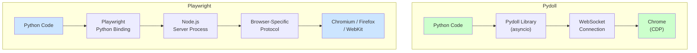
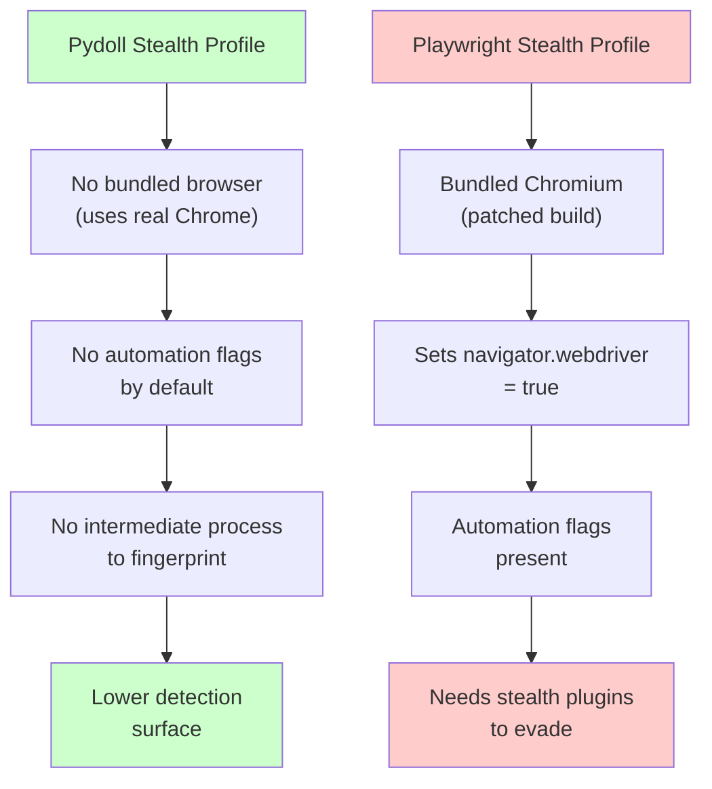
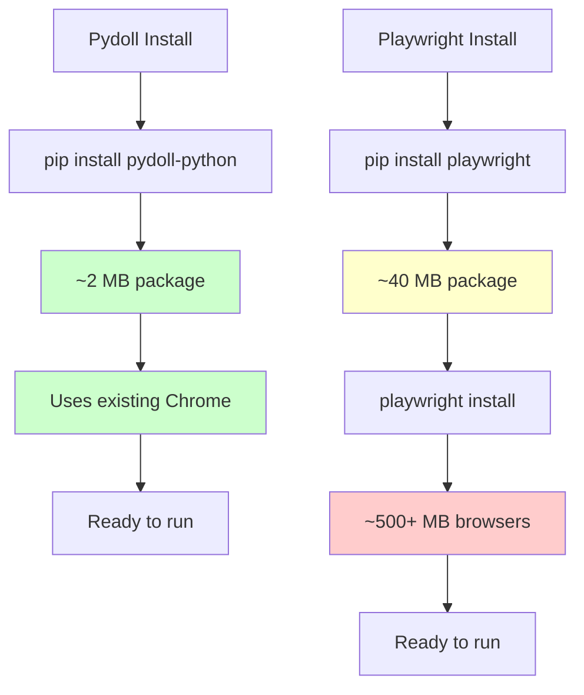

Pydoll is a newer Python browser automation library that skips bundled browsers, driver binaries, and intermediate server processes entirely. Instead it communicates with Chrome directly over the Chrome DevTools Protocol using async Python. That puts it in an interesting position relative to Playwright, which is the dominant browser automation framework in 2026 but carries a heavier architecture with bundled browser builds and a Node.js server process sitting between your code and the browser. If you write Python and want thinner, more direct browser control, Pydoll is worth understanding --- even if Playwright remains the safer production choice for most teams.

## What Pydoll Is

Pydoll is a Python-only library that connects to Chrome (or any Chromium-based browser) using the Chrome DevTools Protocol over WebSocket. It is async-first, built on top of `asyncio`, and designed to give you direct access to CDP domains like `Network`, `Page`, `DOM`, `Runtime`, and `Input` without abstraction layers hiding what is happening underneath.

There are no browser binaries bundled with the package. You install it with `pip`, point it at a Chrome installation already on your machine, and start automating. The library handles the WebSocket connection, CDP message serialization, and event handling, but it does not try to be a full testing framework.

```bash
pip install pydoll-python
```

Key characteristics:

- Pure Python, async-first (`async`/`await` throughout)
- No bundled browsers --- uses whatever Chrome is already installed
- No intermediate server process --- direct WebSocket to Chrome
- Exposes CDP domains directly for low-level control
- Lighter dependency tree than Playwright

## What Playwright Is

Playwright is Microsoft's browser automation framework. The Python version (`playwright` on PyPI) is a binding to a Node.js server that manages browser instances. When you run `playwright install`, it downloads Chromium, Firefox, and WebKit builds specifically patched for Playwright. Your Python code talks to the Playwright server process, which translates commands into browser-specific protocols.

```python
# Installing Playwright for Python
pip install playwright
playwright install
```

Key characteristics:

- Multi-browser support (Chromium, Firefox, WebKit)
- Bundled browser binaries (hundreds of megabytes)
- Node.js server process between your Python code and the browser
- Auto-waiting for elements, network idle, and navigation
- Rich selector engine with CSS, XPath, text, and role selectors
- Massive ecosystem, documentation, and community

## Architecture Comparison

The fundamental difference is the number of layers between your Python code and the browser.



Pydoll has two hops: your code to the library, the library to Chrome over CDP. Playwright has four: your code to the Python binding, the binding to the Node.js server, the server to the browser protocol layer, and then the browser itself. Those extra layers buy you multi-browser support, auto-waiting, and a polished API, but they also add overhead, startup time, and complexity when debugging.

## Code Comparison: Scraping a Page

Let us compare a basic task: navigating to a page, waiting for content, extracting text from multiple elements, and taking a screenshot.

### Pydoll Version

```python
import asyncio
from pydoll.browser import Chrome
from pydoll.connection import ConnectionHandler


async def scrape_with_pydoll():
    async with Chrome() as browser:
        page = await browser.get_page()

        await page.go_to("https://example.com/products")

        # Wait for product cards to appear
        await page.wait_element("div.product-card", timeout=10000)

        # Extract product names using CDP Runtime.evaluate
        products = await page.find_elements("div.product-card h2")
        for product in products:
            name = await product.get_text()
            print(name)

        # Take a screenshot
        await page.screenshot("products.png")


asyncio.run(scrape_with_pydoll())
```

### Playwright Version

```python
import asyncio
from playwright.async_api import async_playwright


async def scrape_with_playwright():
    async with async_playwright() as p:
        browser = await p.chromium.launch()
        page = await browser.new_page()

        await page.goto("https://example.com/products")

        # Auto-waits for elements by default
        products = await page.query_selector_all("div.product-card h2")
        for product in products:
            name = await product.text_content()
            print(name)

        # Take a screenshot
        await page.screenshot(path="products.png")

        await browser.close()


asyncio.run(scrape_with_playwright())
```

Both accomplish the same task. Playwright's auto-waiting means you often do not need explicit wait calls. Pydoll gives you more explicit control but requires you to handle waits yourself.

## Element Selection and Interaction

The APIs diverge more when you get into element interaction, evaluation, and event handling.

### Finding Elements

```python
# Pydoll - CSS selectors
element = await page.find_element("input#search")
elements = await page.find_elements("ul.results li")

# Pydoll - XPath
element = await page.find_element("//input[@id='search']",
                                   by="xpath")
```

```python
# Playwright - multiple selector engines
element = await page.query_selector("input#search")
elements = await page.query_selector_all("ul.results li")

# Playwright - text selector
element = await page.get_by_text("Submit")

# Playwright - role selector
element = await page.get_by_role("button", name="Submit")

# Playwright - locator API (preferred)
locator = page.locator("input#search")
await locator.fill("search query")
```

Playwright's selector engine is significantly richer. Text selectors, role selectors, and the locator API with built-in auto-waiting are features Pydoll does not have.

### Executing JavaScript

```python
# Pydoll - direct CDP Runtime.evaluate access
result = await page.execute_script(
    "return document.querySelectorAll('.item').length"
)
```

```python
# Playwright - evaluate
result = await page.evaluate(
    "document.querySelectorAll('.item').length"
)

# Playwright - evaluate with arguments
result = await page.evaluate(
    "(selector) => document.querySelectorAll(selector).length",
    ".item"
)
```

### Typing and Clicking

```python
# Pydoll
search_box = await page.find_element("input#search")
await search_box.type_text("browser automation")
submit = await page.find_element("button[type='submit']")
await submit.click()
```

```python
# Playwright
await page.fill("input#search", "browser automation")
await page.click("button[type='submit']")

# Or with locator API
await page.locator("input#search").fill("browser automation")
await page.locator("button[type='submit']").click()
```

Playwright's one-liner methods that combine finding and interacting are more concise. Pydoll separates finding from acting, which is more verbose but closer to how CDP actually works.

## Network Interception

Both tools support intercepting network requests, but they do it differently.

### Pydoll: CDP Network Domain

```python
async with Chrome() as browser:
    page = await browser.get_page()

    # Enable network events through CDP
    await page.enable_network()

    # Listen for responses
    page.on("response_received", handle_response)

    # Block specific resource types
    await page.set_request_interception(True)
    page.on("request_paused", block_images)

    await page.go_to("https://example.com")
```

Pydoll exposes CDP network events directly. You subscribe to `response_received`, `request_will_be_sent`, and other CDP events using the same event names that appear in the Chrome DevTools Protocol documentation.

### Playwright: Route API

```python
async with async_playwright() as p:
    browser = await p.chromium.launch()
    page = await browser.new_page()

    # Block images
    await page.route("**/*.{png,jpg,jpeg,gif}",
                     lambda route: route.abort())

    # Intercept and modify requests
    async def handle_route(route):
        headers = {**route.request.headers, "X-Custom": "value"}
        await route.continue_(headers=headers)

    await page.route("**/api/**", handle_route)

    await page.goto("https://example.com")
```

Playwright's route API is more ergonomic, with glob pattern matching and a clean handler interface. Pydoll's approach is more raw but gives you access to every CDP network event.


<figure>
  
  <figcaption>Browser automation turns repetitive tasks into reliable scripts. <span class="img-credit">Photo by ThisIsEngineering / <a href="https://www.pexels.com" target="_blank" rel="noopener noreferrer">Pexels</a></span></figcaption>
</figure>

## Stealth and Detection

This is where Pydoll has a genuine architectural advantage.



### Pydoll's Natural Stealth

Because Pydoll connects to a regular Chrome installation (not a patched Chromium build), the browser fingerprint is identical to a normal user session. There is no `--enable-automation` flag. The `navigator.webdriver` property is not set to `true`. The `window.chrome` object is fully populated with standard properties. Anti-bot systems looking for automation markers see a normal browser.

This is similar to how [nodriver and zendriver](/posts/nodriver-vs-zendriver-picking-right-undetected-chrome-wrapper/) achieve stealth --- by removing the automation artifacts at the architectural level rather than patching them after the fact.

```python
# Pydoll - connecting to Chrome without automation markers
async with Chrome() as browser:
    page = await browser.get_page()

    # navigator.webdriver is undefined by default
    result = await page.execute_script(
        "return navigator.webdriver"
    )
    print(result)  # undefined / None
```

### Playwright's Detection Surface

Playwright launches a custom Chromium build with automation hooks baked in. Out of the box, it is trivially detectable:

```python
# Playwright - detectable by default
async with async_playwright() as p:
    browser = await p.chromium.launch()
    page = await browser.new_page()

    result = await page.evaluate("navigator.webdriver")
    print(result)  # True
```

To make Playwright stealthy, you need the `playwright-stealth` plugin or manual patches:

```python
# Playwright with stealth plugin
from playwright.async_api import async_playwright
from playwright_stealth import stealth_async


async def stealthy_playwright():
    async with async_playwright() as p:
        browser = await p.chromium.launch(headless=False)
        page = await browser.new_page()
        await stealth_async(page)
        await page.goto("https://example.com")
```

Even with stealth plugins, Playwright's patched Chromium can still be fingerprinted by advanced detection systems that check for subtle differences in rendering behavior, WebGL output, or API timing patterns. For a deeper look at the [stealth browser landscape in 2026](/posts/stealth-browsers-in-2026-camoufox-nodriver-and-the-anti-detection-arms-race/), including Camoufox and nodriver, see our dedicated overview.

## CDP Access

Pydoll gives you raw CDP access as a first-class feature. Playwright supports CDP through its `CDPSession` API, but it is clearly a secondary interface.

### Pydoll: CDP Is the API

```python
async with Chrome() as browser:
    page = await browser.get_page()

    # Direct CDP command
    result = await page.execute_command(
        "Performance.getMetrics"
    )
    print(result)

    # Enable a CDP domain
    await page.execute_command("Debugger.enable")

    # Subscribe to CDP events
    page.on("Debugger.scriptParsed", handle_script)
```

### Playwright: CDP as Secondary Interface

```python
async with async_playwright() as p:
    browser = await p.chromium.launch()
    page = await browser.new_page()

    # Create CDP session
    cdp = await page.context.new_cdp_session(page)

    # Send CDP command
    result = await cdp.send("Performance.getMetrics")
    print(result)

    # Listen to CDP events
    cdp.on("Debugger.scriptParsed", handle_script)
```

Playwright's CDP access works, but it requires creating a separate session object. In Pydoll, every method is ultimately a CDP call, so the mapping between your code and the protocol is direct and transparent.

## Resource Footprint

The installation and runtime footprint differs significantly.



At runtime, Pydoll launches Chrome and connects over a single WebSocket. Playwright starts a Node.js server process alongside the browser. On resource-constrained systems --- containers, CI runners, small VPS instances --- this difference matters.

```bash
# Pydoll runtime processes
chrome --remote-debugging-port=9222  # Chrome itself
python script.py                      # Your script

# Playwright runtime processes
node playwright/server.js             # Playwright server
chromium --headless                    # Bundled Chromium
python script.py                      # Your script
```

## Async Patterns

Both libraries support async Python, but Pydoll was designed async-first while Playwright offers both sync and async APIs.

### Pydoll: Async Only

```python
import asyncio
from pydoll.browser import Chrome


async def main():
    async with Chrome() as browser:
        page = await browser.get_page()
        await page.go_to("https://example.com")

        # Concurrent page operations
        page2 = await browser.get_page()
        await asyncio.gather(
            page.go_to("https://example.com/page1"),
            page2.go_to("https://example.com/page2"),
        )


asyncio.run(main())
```

### Playwright: Sync and Async

```python
# Sync API - simpler for scripts
from playwright.sync_api import sync_playwright

with sync_playwright() as p:
    browser = p.chromium.launch()
    page = browser.new_page()
    page.goto("https://example.com")
    print(page.title())
    browser.close()

# Async API - better for concurrent work
from playwright.async_api import async_playwright
import asyncio


async def main():
    async with async_playwright() as p:
        browser = await p.chromium.launch()
        page = await browser.new_page()
        await page.goto("https://example.com")
        print(await page.title())
        await browser.close()


asyncio.run(main())
```

If you are writing async Python and prefer a library that does not even offer a sync path, Pydoll's consistency is appealing. If you want quick scripts without async boilerplate, Playwright's sync API is convenient.

## Multi-Browser Support

This is straightforward. Playwright supports Chromium, Firefox, and WebKit. Pydoll supports Chrome and Chromium-based browsers only.

If you need to test or scrape across multiple browser engines, Playwright is the only choice. If you only need Chrome --- which covers the vast majority of scraping use cases --- this limitation does not matter. For many tasks, you may not need a browser at all; our [Python requests vs Selenium speed comparison](/posts/python-requests-vs-selenium-speed-performance-comparison/) shows when a lightweight HTTP client is the faster choice.


<figure>
  
  <figcaption>Modern tooling makes browser control accessible to every developer. <span class="img-credit">Photo by MASUD GAANWALA / <a href="https://www.pexels.com" target="_blank" rel="noopener noreferrer">Pexels</a></span></figcaption>
</figure>

## Error Handling and Debugging

Playwright provides detailed error messages, trace recording, and an inspector tool:

```python
# Playwright trace recording
async with async_playwright() as p:
    browser = await p.chromium.launch()
    context = await browser.new_context()

    await context.tracing.start(screenshots=True, snapshots=True)
    page = await context.new_page()
    await page.goto("https://example.com")
    await context.tracing.stop(path="trace.zip")

    # View with: playwright show-trace trace.zip
```

Pydoll's debugging is closer to raw CDP debugging. You can log CDP messages, inspect WebSocket frames, and use Chrome's built-in DevTools alongside your automation. This is powerful if you understand CDP, but there is no built-in trace viewer or inspector.

```python
# Pydoll - enable verbose CDP logging
import logging
logging.basicConfig(level=logging.DEBUG)

async with Chrome() as browser:
    page = await browser.get_page()
    # CDP messages will appear in logs
    await page.go_to("https://example.com")
```

## Maturity and Ecosystem

This comparison is lopsided and it would be dishonest to pretend otherwise.

| Aspect | Playwright | Pydoll |
|--------|-----------|--------|
| First release | 2020 | 2024 |
| Maintainer | Microsoft | Community |
| GitHub stars | 70,000+ | Growing |
| Stack Overflow questions | Thousands | Minimal |
| CI/CD integrations | Extensive | Manual setup |
| Plugin ecosystem | Large | Small |
| Documentation | Comprehensive | Basic |
| Breaking changes | Rare, well-communicated | Possible |

Playwright is production-grade software backed by a major company with a dedicated team. Pydoll is a younger community project that fills a specific niche. Choosing Pydoll for a mission-critical production system today means accepting that you are an early adopter.

## When to Use Pydoll

Pydoll makes sense when:

- You want lightweight Python browser automation without downloading hundreds of megabytes of bundled browsers
- You need direct CDP access without going through abstraction layers
- Stealth matters and you want a clean browser fingerprint without plugins
- You are building async Python applications and want a library that matches that paradigm natively
- You are experimenting, prototyping, or building personal tools where a smaller community is acceptable
- You are running on resource-constrained environments where Playwright's footprint is a problem
- You want to learn how browser automation actually works at the protocol level

## When to Use Playwright

Playwright makes sense when:

- You need multi-browser support (Firefox, WebKit, not just Chrome)
- You are building production scraping infrastructure that must be reliable and maintainable
- Your team includes developers of varying experience levels who benefit from auto-waiting and rich selectors
- You need CI/CD integration, trace recording, or the [Playwright CLI for quick browser testing](/posts/using-playwright-cli-quick-browser-testing/)
- You want extensive documentation, thousands of Stack Overflow answers, and a large community
- You need the sync API for simple scripts
- You are doing testing alongside scraping
- Long-term stability and backwards compatibility matter

## The Bottom Line

Pydoll is not trying to replace Playwright. It occupies a different point in the design space: thinner, more direct, Python-native, and closer to the protocol. If you have ever been frustrated by Playwright's weight --- the bundled browsers, the Node.js server, the layers of abstraction --- and you only need Chrome, Pydoll offers a cleaner path.

But cleaner is not the same as better for every situation. Playwright's layers exist for good reasons: cross-browser compatibility, auto-waiting that prevents flaky scripts, a polished developer experience, and the kind of battle-testing that only comes from millions of users over years. For production systems, team projects, and anything where reliability outweighs minimalism, Playwright remains the standard.

The two libraries serve different temperaments as much as different use cases. If you prefer explicit control and thin abstractions, try Pydoll. If you prefer comprehensive tooling and proven reliability, stay with Playwright. Both are valid choices --- they just optimize for different things.
