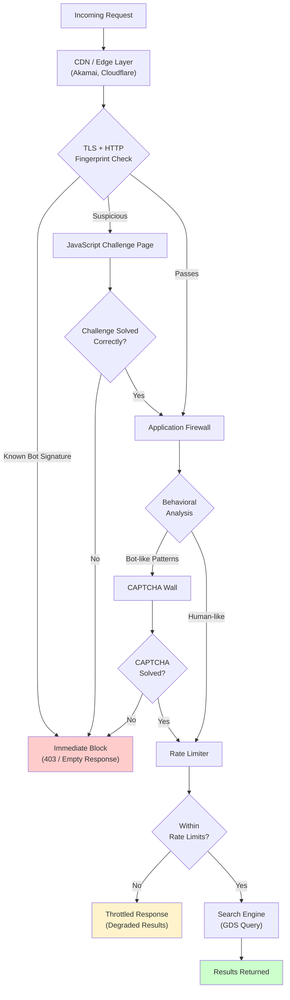
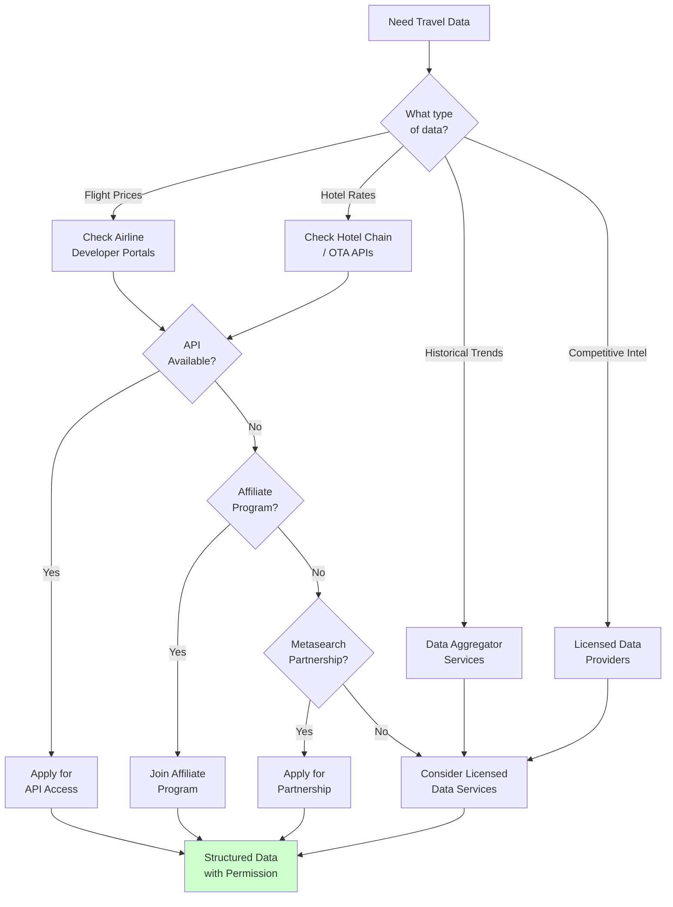
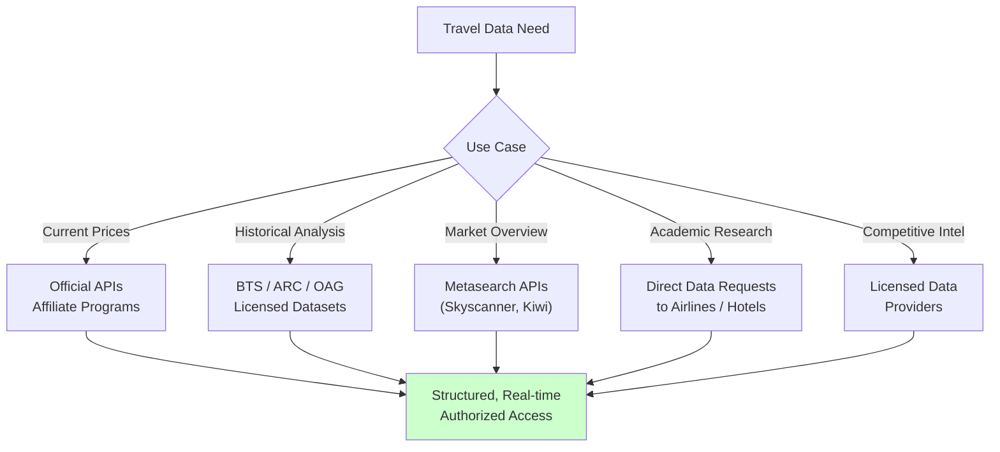

Travel booking sites run some of the most sophisticated anti-bot systems on the internet. Airlines, hotel chains, online travel agencies (OTAs), and metasearch engines have invested heavily in detecting and blocking automated access. If you have ever tried to scrape flight prices or hotel availability, you have likely hit walls that do not exist on most other websites. This is not accidental. The travel industry has specific, revenue-driven reasons for protecting its data, and understanding those reasons is the first step toward approaching travel data collection responsibly.

This post explores why travel sites are so heavily defended, what protections they use, the legal landscape around price data, and -- most importantly -- how to get the data you need through legitimate channels. We will also cover the edge cases where scraping may be appropriate and the best practices to follow if you do proceed.

## Why Travel Sites Are Heavily Protected

The travel industry operates on razor-thin margins and dynamic pricing models. A single flight route might have dozens of fare classes, each with different prices that change multiple times per day based on demand, competition, inventory levels, and time until departure. Hotels operate similarly, adjusting rates based on occupancy forecasts, seasonal demand, and competitive positioning.

This creates several business incentives to block scrapers.

**Price scraping undermines revenue management.** Airlines and hotels use sophisticated yield management systems that assume a certain level of opacity. If competitors can monitor every price change in real time, they can undercut instantly, triggering price wars that erode margins across the industry. Revenue management teams at major carriers spend millions building pricing algorithms that assume their pricing decisions are not immediately transparent to every competitor.

**Competitive intelligence at scale distorts the market.** When a competitor scrapes your entire route network every hour, they gain an asymmetric advantage. They can see your pricing strategy, identify your weak routes, and selectively compete where you are most vulnerable. This is not theoretical -- it has driven multiple legal disputes between airlines.

**Inventory hoarding and fare manipulation.** Some bots do not just look at prices. They initiate booking flows, hold inventory in shopping carts, and then release it -- effectively creating artificial scarcity. This is a real problem that costs airlines and hotels measurable revenue. Even legitimate price monitoring can inadvertently strain booking engines that were designed for human-speed interaction.

**Infrastructure costs are significant.** Travel search is computationally expensive. A single flight search query might fan out to multiple GDS (Global Distribution System) providers, aggregate results, apply business rules, and return a response. Each query costs the airline or OTA real money. A scraper making thousands of searches per hour can generate infrastructure costs without generating any revenue.

## Common Anti-Bot Protections on Travel Sites

Travel sites deploy layered defense systems that are more aggressive than what you will encounter on typical e-commerce or content sites. Here is what you are likely to face.

### Enterprise Bot Management Platforms

Most major travel sites use one or more commercial bot management solutions. Akamai Bot Manager is extremely common among airlines and large hotel chains. PerimeterX (now HUMAN Security) and Cloudflare Bot Management are also widely deployed. These platforms operate at the CDN or edge layer, meaning your requests are evaluated before they ever reach the application server.

These systems fingerprint your [TLS handshake](/posts/httpmorph-solving-tls-fingerprinting-with-a-c-native-python-http-client/), HTTP/2 settings, header order, and dozens of other signals before the page even begins to load. They correlate behavior across sessions and IP addresses, building risk scores that determine whether you see real content or a challenge page.

### JavaScript Challenges and Browser Fingerprinting

Beyond edge-level detection, travel sites deploy client-side JavaScript that profiles your browser environment in detail. These scripts check for automation frameworks by looking for telltale properties like `navigator.webdriver`, specific DOM mutations, or the presence of known automation libraries. They generate canvas fingerprints, WebGL fingerprints, and audio fingerprints to identify your browser across sessions.

### CAPTCHA Walls and Challenge Pages

When risk scores exceed a threshold, users are presented with CAPTCHA challenges. Many travel sites use custom CAPTCHA implementations or reCAPTCHA Enterprise with elevated difficulty settings. Some deploy invisible challenges that only trigger for suspicious traffic, while others gate high-value endpoints (like search results and booking pages) behind explicit challenges during periods of heavy bot traffic.

### Session and Behavioral Analysis

Travel sites track mouse movements, scroll patterns, typing cadence, and navigation sequences. A human user browsing flights typically visits a homepage, enters an origin and destination, selects dates, and then views results. A scraper that jumps directly to a search API endpoint with fully formed parameters looks nothing like a human. These behavioral signals feed into risk models that flag automated access.

### Rate Limiting and Progressive Penalties

Search endpoints on travel sites have strict rate limits, often much lower than you would expect. An airline might allow a few dozen searches per session before requiring re-authentication or presenting challenges. OTAs might throttle results quality -- showing fewer options or stale prices -- rather than blocking outright, making it hard to even detect that you are being limited.

## The Typical Travel Site Protection Stack

Here is how these layers fit together in a typical deployment.



Our [timeline of web scraping detection methods](/posts/evolution-web-scraping-detection-methods-timeline/) traces how these layers developed over the years. Each layer adds cost and complexity for automated access. Passing the TLS fingerprint check does not mean you are through -- you still face JavaScript challenges, behavioral analysis, CAPTCHAs, and rate limits. This defense-in-depth approach means that even if you solve one layer, the next one catches you.


<figure>
  
  <figcaption>Anti-bot systems are getting smarter — and so are the tools to navigate them. <span class="img-credit">Photo by Kelly / <a href="https://www.pexels.com" target="_blank" rel="noopener noreferrer">Pexels</a></span></figcaption>
</figure>

## The Legal Landscape Around Travel Data

The legal situation around scraping travel sites is complex and jurisdiction-dependent. For a broader look at where the law stands, our article on [whether robots.txt is legally binding](/posts/is-robots-txt-legally-binding-scraping-law-explained/) covers the key precedents. Here are the key considerations.

### Price Data and Copyright

Prices are generally considered factual information and are not copyrightable in most jurisdictions. The US Supreme Court's decision in Feist Publications v. Rural Telephone Service established that factual compilations require some minimal degree of creativity to qualify for copyright protection. A list of flight prices from New York to London is factual data that no one can own through copyright.

However, the specific presentation of that data -- the layout, the filtering options, the way results are organized -- may be protected. And the database as a whole might be protected under database rights in the EU (the sui generis database right under Directive 96/9/EC).

### Terms of Service and Contractual Claims

This is where most legal risk actually lies. Nearly every travel site includes terms of service that prohibit automated access, scraping, or data collection. When you use a website, you are arguably entering into a contract governed by those terms. Violating them creates a contractual claim, not a copyright claim.

The legal enforceability of browsewrap agreements (terms you did not explicitly agree to) varies by jurisdiction. US courts have been inconsistent on this point. The hiQ Labs v. LinkedIn case provided some protection for scraping publicly available data, but subsequent cases have muddied the waters. The CFAA (Computer Fraud and Abuse Act) has been narrowed by the Van Buren decision, but it still applies to access that exceeds authorization.

### Industry-Specific Regulations

The airline industry has additional complications. IATA (International Air Transport Association) and individual airlines have fought legal battles over screen scraping. Some airlines have pursued legal action against metasearch engines and fare aggregators, arguing that scraping violates both TOS and industry data agreements.

In the EU, the Digital Markets Act and related regulations have created obligations for designated gatekeepers to provide data access, which may eventually affect how major OTAs handle data sharing.

## Responsible Approaches to Travel Data

Before reaching for a scraper, consider these legitimate alternatives that provide better data with less risk.

### Official APIs

Many airlines and hotel chains offer official APIs for accessing pricing and availability data. These APIs are designed for partners, developers, and integration use cases.

**Airline APIs:**
- Amadeus for Developers provides a self-service API with flight search, hotel search, and airport information. Free tier available for testing.
- Sabre Dev Studio offers APIs for flights, hotels, and travel intelligence.
- Travelport provides GDS access through its API platform.
- Some airlines offer direct APIs for partners (check developer portals for airlines you are interested in).

**Hotel APIs:**
- Booking.com has an affiliate API that provides property data and pricing.
- Expedia Group offers the Rapid API for hotel content and pricing.
- Google Hotel Prices API is available to authorized partners.



### Affiliate Programs

Most major OTAs and hotel chains offer affiliate programs that provide structured data access as part of the relationship. Booking.com, Expedia, Hotels.com, and others provide affiliate APIs that return real-time pricing and availability. You get data access and earn commissions on bookings -- a genuinely win-win arrangement.

Affiliate data is typically fresher and more reliable than scraped data because it comes directly from the booking engine. You also avoid the arms race of maintaining scraping infrastructure against constantly evolving bot detection.

### Metasearch Partnerships

If you are building a product that displays travel prices, metasearch partnerships provide a structured way to access pricing data. Companies like Skyscanner, Kayak, and Google Flights operate as metasearch engines and offer various levels of API access to qualified partners.

These partnerships typically come with data usage restrictions, but they provide clean, structured data that is far more reliable than scraped content.

### Publicly Available Data Only

If you do collect data from travel sites, limit yourself to information that is genuinely publicly available without requiring authentication, account creation, or circumvention of access controls. This includes publicly listed prices on search result pages, publicly available property descriptions, and published route information.

Even with publicly available data, you should still respect robots.txt directives and rate limits.

## Technical Challenges Unique to Travel Scraping

Even if you have a legitimate reason to collect travel data (and have confirmed it is legally permissible in your situation), the technical challenges are substantial.

### Dynamic Pricing

Travel prices are not static. The same flight search executed twice within minutes might return different prices. This is not a bug -- it is the yield management system at work, adjusting prices based on real-time demand, remaining inventory, and time-to-departure.

This means that scraped price data has an extremely short shelf life. A price you collected 30 minutes ago might already be wrong. If you are building a service that displays prices to users, stale data creates a terrible user experience and potential consumer protection issues.

```python
# Illustration of the dynamic pricing problem
# These are NOT actual API calls -- just showing the concept

search_params = {
    "origin": "JFK",
    "destination": "LHR",
    "date": "2026-06-15",
    "passengers": 1
}

# Search at 10:00 AM
result_1 = search_flights(search_params)
# Returns: $487 (Economy, 8 seats left)

# Same search at 10:05 AM
result_2 = search_flights(search_params)
# Returns: $512 (Economy, 6 seats left)
# Two seats were booked in the interim, price adjusted

# Same search at 10:06 AM from a different IP
result_3 = search_flights(search_params)
# Returns: $499 (Economy, 6 seats left)
# Different price due to geo-targeting or A/B testing
```

### Session-Based Pricing

Many travel sites show different prices based on whether you are logged in, what your browsing history looks like, and what cookies you carry. A first-time visitor might see a promotional price. A returning visitor who has searched the same route three times might see a higher price (the controversial practice of "price discrimination" based on perceived intent to purchase).

This makes it nearly impossible to collect "the" price for a given search. There is no single canonical price -- there are many prices, shown to different users under different conditions.

### Geo-Based Pricing

Travel sites serve different prices based on your geographic location. A flight from New York to London might be priced differently when searched from a US IP versus a UK IP versus an Indian IP. This is partly due to point-of-sale regulations, currency differences, and market-specific pricing strategies.

If you are collecting prices through a VPN or proxy network, you are seeing prices for the exit node's location, not necessarily the prices a real user in your target market would see. This makes the data less useful for many analytical purposes.

### Rate Limiting on Search Endpoints

Travel search is expensive on the backend. Each search might query multiple fare databases, apply complex pricing rules, and aggregate results from multiple suppliers. Travel sites enforce strict rate limits on search endpoints -- often far stricter than what robots.txt would suggest.

Hitting these rate limits does not just get you blocked. It can degrade the experience for legitimate users. A scraper hammering a search endpoint can slow down the booking engine for everyone.

## When Scraping May Be Appropriate

There are legitimate use cases where collecting data from travel sites is reasonable and potentially protected.

### Academic Research

Researchers studying pricing algorithms, market dynamics, or consumer behavior may need travel pricing data. Academic research generally receives more legal protection, and many universities have institutional review processes for this kind of data collection. Even in academic contexts, researchers should contact the travel company first to request data access -- many will cooperate with academic research directly.

### Consumer Rights and Advocacy

Consumer protection organizations monitoring price discrimination, hidden fees, or deceptive pricing practices may have legitimate reasons to collect pricing data. In some jurisdictions, this kind of monitoring is explicitly protected or encouraged by consumer protection regulations.

### Price Transparency Initiatives

Regulatory bodies or authorized consumer advocacy groups working to improve pricing transparency in travel markets may collect pricing data as part of their mandate. The EU's focus on pricing transparency for airlines has created some structured requirements for price display that implicitly require data collection.

## When Scraping Is Not Appropriate

There are clear cases where scraping travel sites crosses ethical and legal lines.

**Large-scale commercial scraping without permission.** Building a business on scraped travel data without any agreement with the data sources is legally risky and ethically questionable. If your business model depends on travel pricing data, negotiate for API access or data licensing.

**Inventory manipulation.** Using automated tools to hold inventory, check seat maps, or interfere with booking flows is harmful and potentially illegal. This goes beyond data collection into active interference with a business.

**Undermining fare rules.** Some scraping operations are designed to find and exploit pricing errors or fare construction loopholes. While consumers who stumble upon error fares are generally protected, systematically scanning for them with automated tools raises different considerations.

**Reselling scraped data.** Collecting pricing data from one travel site and selling it to competitors is a business that invites legal action. Multiple airlines have successfully sued companies doing exactly this.

## Alternative Data Sources

If you need travel data but scraping is not appropriate for your use case, several alternative sources exist.

### Price Comparison APIs

Services like Google Flights ITA Matrix, Skyscanner API, and Kiwi.com Tequila API aggregate travel pricing data through legitimate partnerships with airlines and OTAs. These services handle the data access agreements and provide clean APIs for developers.

### Historical Data Services

Companies that specialize in travel data analytics offer historical pricing datasets. These include services from Hopper, ARC (Airlines Reporting Corporation), and OAG (Official Airline Guide). These datasets are collected through authorized channels and are available through data licensing agreements.

### Government and Regulatory Data

The US Department of Transportation publishes airline pricing and performance data through the Bureau of Transportation Statistics. This includes fare data (DB1B), on-time performance, and route-level statistics. Similar data is available from aviation authorities in other countries.



### Open Data Sources

The OpenFlights database provides route and airport data. Wikipedia and Wikidata contain structured travel-related information. ADS-B flight tracking data (from services like FlightAware and FlightRadar24) provides real-time flight position data, though not pricing.

## Best Practices If You Do Scrape

If you have determined that scraping is appropriate and legally permissible for your specific situation, follow these best practices to minimize impact and risk.

### Keep Volume Low

Do not scrape at scale. If you need a handful of data points for personal research, that is fundamentally different from running millions of queries per day. Set conservative rate limits on your own requests -- far below what would trigger detection. Think single-digit requests per minute, not per second.

### Respect robots.txt

Check and follow robots.txt directives. If a travel site disallows crawling of search endpoints, honor that. The robots.txt file is a clear signal of the site operator's intent, even if its legal enforceability varies by jurisdiction.

```python
# Always check robots.txt before making requests
import time
import urllib.robotparser

rp = urllib.robotparser.RobotFileParser()
rp.set_url("https://example-travel-site.com/robots.txt")
rp.read()

target_url = "/flights/search"

if rp.can_fetch("*", target_url):
    # Proceed with caution and rate limiting
    crawl_delay = rp.crawl_delay("*")
    if crawl_delay:
        time.sleep(crawl_delay)
    # Make your request
else:
    print(f"robots.txt disallows access to {target_url}")
    # Do NOT proceed
```

### Cache Aggressively

If you collect a price for a specific route and date combination, cache it. Do not re-request the same data point within a short window. Build your system to use cached data wherever possible and only refresh when the cached data is stale beyond your tolerance.

```python
import hashlib
import json
import time

class TravelDataCache:
    """Simple cache to avoid redundant requests."""

    def __init__(self, ttl_seconds=1800):
        self.cache = {}
        self.ttl = ttl_seconds  # 30 minutes default

    def _make_key(self, params):
        """Create a deterministic cache key from search params."""
        serialized = json.dumps(params, sort_keys=True)
        return hashlib.sha256(serialized.encode()).hexdigest()

    def get(self, params):
        key = self._make_key(params)
        if key in self.cache:
            entry = self.cache[key]
            if time.time() - entry["timestamp"] < self.ttl:
                return entry["data"]
            else:
                del self.cache[key]
        return None

    def set(self, params, data):
        key = self._make_key(params)
        self.cache[key] = {
            "data": data,
            "timestamp": time.time()
        }

# Usage
cache = TravelDataCache(ttl_seconds=1800)

search_params = {"origin": "JFK", "destination": "LHR", "date": "2026-06-15"}

# Check cache first
cached_result = cache.get(search_params)
if cached_result:
    print("Using cached data -- no new request needed")
    result = cached_result
else:
    # Only fetch if not cached
    result = fetch_travel_data(search_params)
    cache.set(search_params, result)
```

### Identify Yourself

Our guide on [configuring rate limiting and user-agent rotation responsibly](/posts/how-to-configure-rate-limiting-user-agent-rotation-responsibly/) covers these practices in detail. Use a descriptive User-Agent string that identifies your bot, your organization, and provides contact information. This allows site operators to reach out if they have concerns, rather than simply blocking you.

```
User-Agent: TravelResearchBot/1.0 (academic research; contact@university.edu; +https://research.university.edu/travel-study)
```

### Monitor for Blocks and Back Off

If you receive 403 responses, CAPTCHA challenges, or degraded results, stop immediately. Do not attempt to circumvent these signals. They are the site operator telling you that your access is not welcome. Back off, review your approach, and consider whether an alternative data source would be more appropriate.

### Do Not Store Personal Data

If you encounter any personal data during your collection process -- user reviews with names, booking details, or other personally identifiable information -- do not store it. This is both an ethical obligation and a legal requirement under GDPR, CCPA, and similar privacy regulations.

## The Bigger Picture

The travel industry's aggressive anti-bot posture exists because automated access has real costs -- financial, operational, and competitive. Respecting these protections is not just about avoiding legal risk. It is about recognizing that the data you want to collect belongs to businesses that invested significant resources in creating it.

The best approach is almost always to seek authorized access. APIs, affiliate programs, and data partnerships exist specifically because there is legitimate demand for travel data. These channels provide better data, more reliably, without the maintenance burden of keeping a scraper running against evolving bot detection.

If you do scrape, do it responsibly. Keep volumes low, respect the signals that site operators send you, cache everything, and be transparent about what you are doing. The goal is to get the data you need without imposing costs on others or crossing ethical boundaries.

The travel data ecosystem is gradually moving toward more structured data sharing. As APIs improve and data licensing models mature, the need to scrape will continue to decrease. Building your workflow around authorized access today means you will not need to rebuild it when scraping becomes even harder tomorrow.
