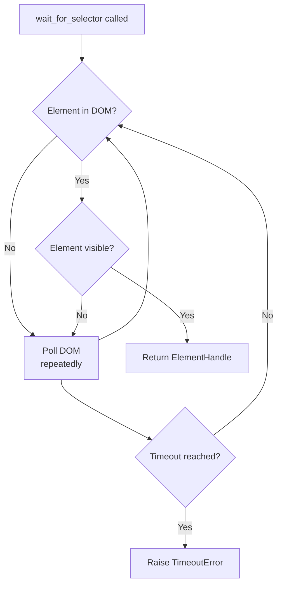
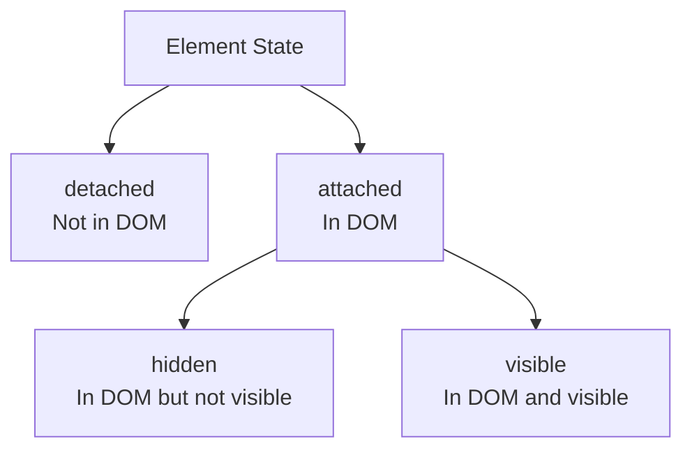
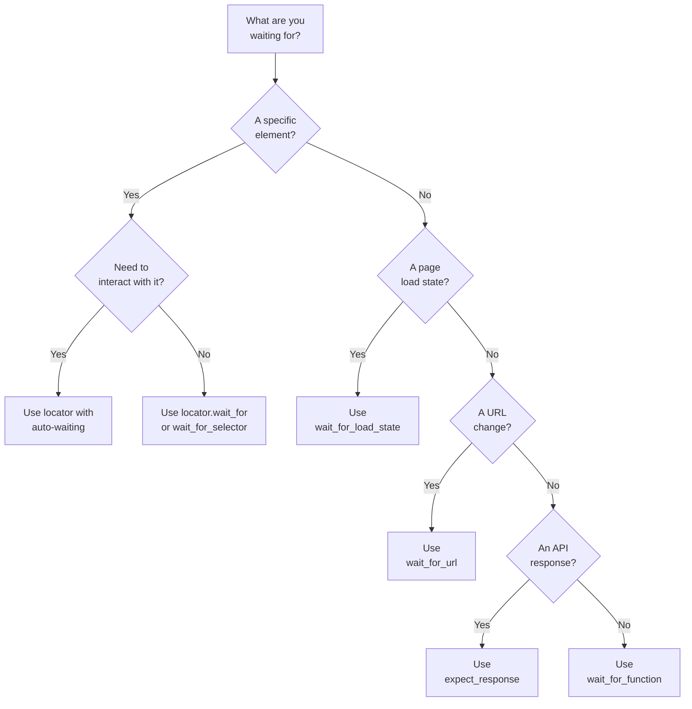

Modern websites rarely deliver their content in the initial HTML response. Data tables, product listings, and search results are loaded by JavaScript after the page shell arrives. If your script reads the DOM before that JavaScript finishes, it gets empty results. Playwright for Python provides several explicit and implicit mechanisms for waiting on elements, and understanding when to use each one is the difference between a script that works reliably and one that fails on every other run. This post covers every waiting strategy Playwright offers, from the classic `wait_for_selector` through the modern locator-based approach and into the patterns you will actually use in production.

## page.wait_for_selector --- The Classic Approach

The `page.wait_for_selector()` method pauses execution until a CSS selector matches an element in the DOM. It returns the `ElementHandle` for the first matching element, or raises `TimeoutError` if the element never appears.

```python
from playwright.sync_api import sync_playwright

with sync_playwright() as p:
    browser = p.chromium.launch()
    page = browser.new_page()
    page.goto("https://example.com/dashboard")

    # Wait until the table appears in the DOM
    page.wait_for_selector("table.data-grid")

    rows = page.query_selector_all("table.data-grid tr")
    print(f"Found {len(rows)} rows")

    browser.close()
```

You can also use it inline to get a reference and extract data immediately:

```python
element = page.wait_for_selector("div.price-tag")
price = element.inner_text()
```

By default, `wait_for_selector` waits for the element to be both **present in the DOM** and **visible** on the page. Visibility means the element has a non-zero bounding box and is not hidden by `display: none`, `visibility: hidden`, or `opacity: 0`.



## Locator-Based Waiting: The Modern Approach

Playwright now recommends locators over `wait_for_selector`. A locator is a lazy reference to an element --- it does not query the DOM until you act on it. The `wait_for()` method gives you the same waiting behavior with a cleaner API.

```python
from playwright.sync_api import sync_playwright

with sync_playwright() as p:
    browser = p.chromium.launch()
    page = browser.new_page()
    page.goto("https://example.com/dashboard")

    table_locator = page.locator("table.data-grid")
    table_locator.wait_for(state="visible")

    row_count = page.locator("table.data-grid tr").count()
    print(f"Found {row_count} rows")

    browser.close()
```

The key advantage: locators retry automatically. When you call `table_locator.inner_text()`, Playwright waits for the element to be visible before reading. Many scripts do not need an explicit `wait_for()` at all.

| Feature | `page.wait_for_selector()` | `locator.wait_for()` |
|---|---|---|
| Returns | `ElementHandle` | `None` (use locator for actions) |
| Status | Legacy pattern | Current recommendation |
| Auto-retry on actions | No | Yes |

## Wait States: attached, visible, hidden, detached

Both methods accept a `state` parameter with four options:

- **`attached`** --- element exists in the DOM, regardless of visibility
- **`visible`** --- element is in the DOM and visible (the default)
- **`hidden`** --- element is either absent or not visible. Use this to wait for spinners to disappear
- **`detached`** --- element has been removed from the DOM entirely

```python
# Wait for a hidden element to exist in the DOM
page.wait_for_selector("div.modal-container", state="attached")

# Wait for a loading overlay to vanish
page.wait_for_selector("div.loading-overlay", state="hidden")

# Wait for a splash screen to be removed from the DOM
page.wait_for_selector("div.splash-screen", state="detached")
```



## Timeout Configuration

The default timeout is 30 seconds. You can customize it at three levels:

```python
# Per-call: wait up to 10 seconds for this element
page.wait_for_selector("table.data-grid", timeout=10000)

# Page-level: change default for all waits on this page
page.set_default_timeout(5000)

# Context-level: change default for all pages in this context
context = browser.new_context()
context.set_default_timeout(15000)
```

All values are in milliseconds. Pass `timeout=0` to wait indefinitely, but be careful --- a hanging script is worse than a crashed one.

## Auto-Waiting: When You Do Not Need Explicit Waits

Playwright automatically waits for actionability before performing `.click()`, `.fill()`, `.check()`, and similar methods on locators. It checks that the element is attached, visible, stable, enabled, and not obscured.

```python
page.goto("https://example.com/login")

# No explicit wait needed --- Playwright waits automatically
page.locator("input#username").fill("user@example.com")
page.locator("input#password").fill("password123")
page.locator("button[type='submit']").click()
```

For more complex form workflows --- multi-step wizards, dynamically added fields, conditional inputs --- see our [guide to automating web form filling](/posts/how-to-automate-web-form-filling-complete-guide/). You still need explicit waits when you are **reading data** (auto-wait does not apply to `query_selector_all` on the page object), waiting for an element to **disappear**, or waiting for a **non-element condition**.

## page.wait_for_load_state

Waits for the page to reach a loading milestone. Three states are available:

- **`domcontentloaded`** --- HTML parsed, external resources may still be loading
- **`load`** --- HTML and all synchronous sub-resources finished (the default for `goto`)
- **`networkidle`** --- no network requests for 500ms

```python
page.goto("https://example.com/dashboard")
page.wait_for_load_state("networkidle")

rows = page.query_selector_all("table.data-grid tr")
```

Be cautious with `networkidle`. Pages with analytics beacons, WebSocket connections, or polling scripts may never reach network idle, causing a timeout.


<figure>
  
  <figcaption>Browser automation turns repetitive tasks into reliable scripts. <span class="img-credit">Photo by ThisIsEngineering / <a href="https://www.pexels.com" target="_blank" rel="noopener noreferrer">Pexels</a></span></figcaption>
</figure>

## page.wait_for_url

Wait for the URL to change after navigation, form submission, or a redirect:

```python
page.locator("button[type='submit']").click()
page.wait_for_url("**/dashboard")
print(page.url)  # https://example.com/dashboard
```

Supports glob patterns (`**/products/*`), exact strings, and regex (`re.compile(r".*/order/\d+")`).

## page.expect_response: Intercept API Data

Instead of waiting for the DOM to update, intercept the API response directly:

```python
with page.expect_response("**/api/products*") as response_info:
    page.goto("https://example.com/products")

response = response_info.value
data = response.json()
print(f"Got {len(data['items'])} products from API")
```

You can use a predicate for complex matching:

```python
def is_product_api(response):
    return "/api/products" in response.url and response.status == 200

response = page.wait_for_response(is_product_api)
```

This is powerful for scraping because you get raw JSON without parsing the DOM.

## Custom Waits with page.wait_for_function

Run arbitrary JavaScript and wait until it returns a truthy value:

```python
# Wait for at least 10 table rows
page.wait_for_function(
    "document.querySelectorAll('table.data-grid tr').length >= 10"
)

# Wait for an image to finish loading
page.wait_for_function("""
    () => {
        const img = document.querySelector('img.product-main');
        return img && img.complete && img.naturalWidth > 0;
    }
""")

# Wait for a global variable set by the app
page.wait_for_function("typeof window.__DATA__ !== 'undefined'")
data = page.evaluate("window.__DATA__")
```

You can pass arguments from Python:

```python
min_count = 5
page.wait_for_function(
    """(minCount) => {
        const rows = document.querySelectorAll('table.data-grid tr');
        return rows.length >= minCount;
    }""",
    min_count,
)
```

## Common Patterns

### Wait for a Loading Spinner to Disappear

```python
page.goto("https://example.com/search?q=python")
page.locator("div.spinner").wait_for(state="hidden")

results = page.locator("div.search-result")
print(f"Found {results.count()} results")
```

### Wait for a Data Table to Populate

```python
page.goto("https://example.com/reports")
page.locator("table.report tbody tr").first.wait_for(state="visible")

rows = page.locator("table.report tbody tr")
for i in range(rows.count()):
    cells = rows.nth(i).locator("td")
    row_data = [cells.nth(j).inner_text() for j in range(cells.count())]
    print(row_data)
```

### Wait for Infinite Scroll Content

```python
previous_count = 0

for _ in range(10):
    current_count = page.locator("div.feed-item").count()

    if current_count == previous_count and previous_count > 0:
        break

    previous_count = current_count
    page.evaluate("window.scrollTo(0, document.body.scrollHeight)")

    try:
        page.wait_for_function(
            f"document.querySelectorAll('div.feed-item').length > {current_count}",
            timeout=5000,
        )
    except Exception:
        break

print(f"Total items: {page.locator('div.feed-item').count()}")
```

## Error Handling: TimeoutError and Retries

When a wait times out, Playwright raises `TimeoutError`. Always handle it in production:

```python
from playwright.sync_api import sync_playwright, TimeoutError as PlaywrightTimeout

with sync_playwright() as p:
    browser = p.chromium.launch()
    page = browser.new_page()
    page.goto("https://example.com/dashboard")

    try:
        page.wait_for_selector("table.data-grid", timeout=10000)
        rows = page.query_selector_all("table.data-grid tr")
        print(f"Found {len(rows)} rows")
    except PlaywrightTimeout:
        print("Data table did not appear within 10 seconds")
        page.screenshot(path="timeout_debug.png")

    browser.close()
```

A retry wrapper with increasing timeouts handles flaky pages:

```python
def wait_with_retry(page, selector, max_retries=3, initial_timeout=5000):
    for attempt in range(max_retries):
        timeout = initial_timeout * (attempt + 1)
        try:
            return page.wait_for_selector(selector, timeout=timeout)
        except PlaywrightTimeout:
            if attempt < max_retries - 1:
                page.reload()
                page.wait_for_load_state("domcontentloaded")
            else:
                raise
```

## Quick Reference

| Method | Waits For | Default Timeout |
|---|---|---|
| `page.wait_for_selector(sel)` | CSS selector to match a visible element | 30s |
| `locator.wait_for(state=...)` | Locator to reach specified state | 30s |
| `page.wait_for_load_state(state)` | Page load milestone | 30s |
| `page.wait_for_url(pattern)` | URL to match pattern after navigation | 30s |
| `page.expect_response(pattern)` | Network response matching pattern | 30s |
| `page.wait_for_function(js)` | JavaScript expression to return truthy | 30s |

### Decision Flowchart



If elements are hidden inside [shadow DOM trees](/posts/shadow-dom-the-silent-killer-of-ai-web-scraping/), standard selectors will not find them regardless of how long you wait --- you will need to pierce the shadow root first. For a broader look at how Playwright stacks up against other frameworks, see our [Playwright vs Puppeteer vs Selenium vs Scrapy mega comparison](/posts/playwright-vs-puppeteer-vs-selenium-vs-scrapy-2026-mega-comparison/). Choose the most specific wait method for your situation. `wait_for_function` is the escape hatch when nothing else fits, but prefer the built-in methods when they apply --- they produce clearer error messages and are easier to debug when they fail.
