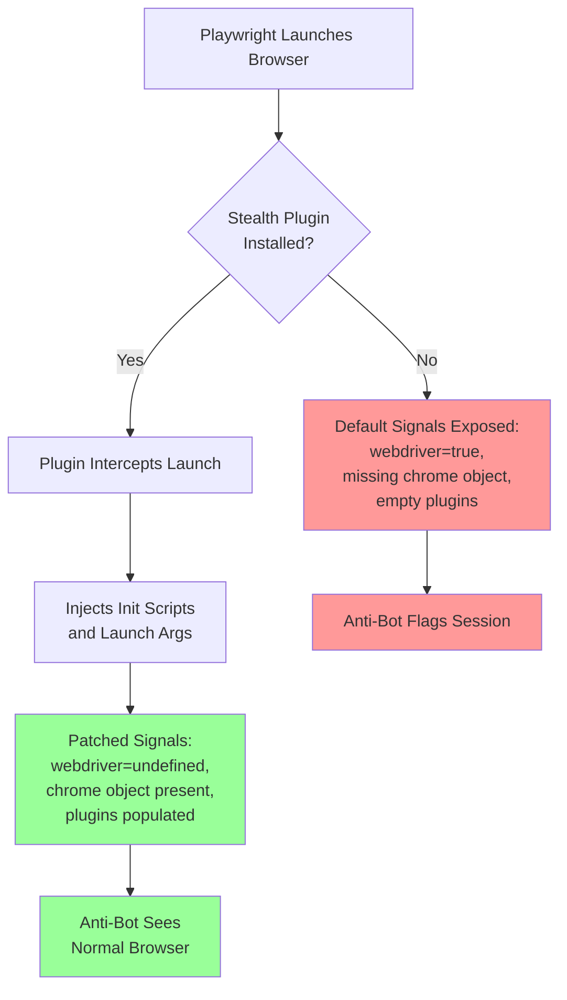
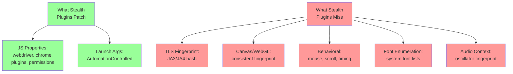
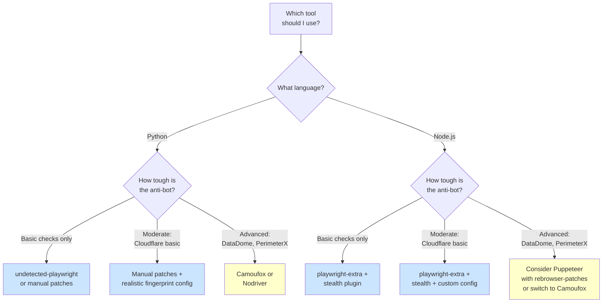

[Playwright](/posts/playwright-vs-puppeteer-speed-stealth-developer-experience/) is a powerful browser automation framework, but it gets flagged by anti-bot systems out of the box. The community has responded with stealth plugins that patch the most obvious detection vectors --- `navigator.webdriver`, missing browser properties, plugin arrays, and more. The two most popular options are **playwright-stealth** (for the Node.js `playwright-extra` ecosystem) and **undetected-playwright** (a Python package that patches Playwright directly). Both aim to solve the same problem, but they take different approaches, target different language ecosystems, and have different maintenance trajectories. This post breaks down what each one does, how to set them up, what they actually patch, and which one you should reach for depending on your project.

## How Stealth Plugins Work

At a high level, every stealth plugin does the same thing: it injects JavaScript overrides or modifies browser launch arguments before the page loads, so that detection scripts see a browser that looks like a normal user session rather than an automated one.



The difference between plugins comes down to what they patch, how they inject those patches, and how well they keep up with [evolving detection methods](/posts/evolution-web-scraping-detection-methods-timeline/).

## playwright-stealth: The Node.js Ecosystem

The `playwright-stealth` plugin lives inside the `playwright-extra` ecosystem. If you have used `puppeteer-extra-plugin-stealth`, this is its Playwright equivalent. It follows the same plugin architecture: you wrap Playwright with `playwright-extra`, then register the stealth plugin.

### What It Patches

The stealth plugin applies a set of evasion modules, each targeting a specific detection vector:

| Evasion Module | What It Does |
|---|---|
| `navigator.webdriver` | Sets `navigator.webdriver` to `undefined` |
| `chrome.runtime` | Adds a mock `window.chrome` object with `runtime` property |
| `navigator.plugins` | Populates `navigator.plugins` with realistic Chrome plugin entries |
| `navigator.permissions` | Overrides `Permissions.prototype.query` to return `prompt` for notifications |
| `navigator.languages` | Sets `navigator.languages` to `["en-US", "en"]` |
| `window.outerdimensions` | Sets `window.outerWidth` and `window.outerHeight` to match viewport |
| `webgl.vendor` | Overrides WebGL vendor and renderer strings |
| `media.codecs` | Reports support for common media codecs |
| `sourceurl` | Hides `//# sourceURL=` markers from injected scripts |
| `iframe.contentWindow` | Patches cross-origin iframe detection checks |

These evasion modules are ported from `puppeteer-extra-plugin-stealth`, which was built and maintained by the `berstend` developer. The Playwright version inherits the same logic.

### Installation and Setup

```bash
npm install playwright-extra puppeteer-extra-plugin-stealth
```

```javascript
// stealth-example.js
const { chromium } = require("playwright-extra");
const stealth = require("puppeteer-extra-plugin-stealth");

// Register the stealth plugin with playwright-extra
chromium.use(stealth());

(async () => {
  const browser = await chromium.launch({ headless: true });
  const context = await browser.newContext({
    viewport: { width: 1920, height: 1080 },
    userAgent:
      "Mozilla/5.0 (Windows NT 10.0; Win64; x64) " +
      "AppleWebKit/537.36 (KHTML, like Gecko) " +
      "Chrome/120.0.0.0 Safari/537.36",
  });

  const page = await context.newPage();
  await page.goto("https://bot.sannysoft.com/");

  // Take a screenshot to verify stealth results
  await page.screenshot({ path: "stealth-result.png", fullPage: true });

  const webdriverValue = await page.evaluate(() => navigator.webdriver);
  console.log("navigator.webdriver:", webdriverValue); // undefined

  await browser.close();
})();
```

The key detail is that you import `chromium` from `playwright-extra` rather than from `playwright` itself. The `use()` method registers plugins before launch. You can still pass all standard Playwright options.

Under the hood, `playwright-extra` hooks into the browser context creation lifecycle. When you call `launch()` or `newContext()`, the stealth plugin calls `addInitScript()` for each evasion module. These scripts run before any page JavaScript executes, so detection scripts see the patched values from the first moment they probe.

## undetected-playwright: The Python Package

`undetected-playwright` is a Python package that wraps Playwright's Python API and applies stealth patches at the browser launch level. It modifies Chromium launch arguments and injects JavaScript overrides to reduce detection signals.

### What It Patches

The package focuses on a core set of detection vectors:

| Patch | What It Does |
|---|---|
| `navigator.webdriver` | Removes the `webdriver` flag via init script |
| Launch arguments | Removes `--enable-automation` flag that Chrome adds by default |
| `window.chrome` | Injects a mock `chrome` object with `app`, `csi`, and `runtime` stubs |
| `navigator.plugins` | Adds `ChromePlugin` entries to the plugins array |
| `navigator.permissions` | Patches `Permissions.prototype.query` |
| `chrome.csi` | Adds a mock `chrome.csi()` function returning timing data |
| `chrome.loadTimes` | Adds a mock `chrome.loadTimes()` returning page load metrics |

The approach is similar to what `playwright-stealth` does on the Node.js side, but packaged for Python and applied through Playwright's Python API.

### Installation and Setup

```bash
pip install undetected-playwright
playwright install chromium
```

```python
# stealth_example.py
import asyncio
from undetected_playwright.async_api import async_playwright

async def main():
    async with async_playwright() as p:
        browser = await p.chromium.launch(headless=True)
        context = await browser.new_context(
            viewport={"width": 1920, "height": 1080},
            user_agent=(
                "Mozilla/5.0 (Windows NT 10.0; Win64; x64) "
                "AppleWebKit/537.36 (KHTML, like Gecko) "
                "Chrome/120.0.0.0 Safari/537.36"
            ),
        )
        page = await context.new_page()
        await page.goto("https://bot.sannysoft.com/")

        webdriver_val = await page.evaluate("navigator.webdriver")
        print(f"navigator.webdriver: {webdriver_val}")  # None (undefined)

        await page.screenshot(path="stealth-result.png", full_page=True)
        await browser.close()

asyncio.run(main())
```

A synchronous API is also available via `undetected_playwright.sync_api`. Notice the import path changes from `playwright.sync_api` / `playwright.async_api` to `undetected_playwright.sync_api` / `undetected_playwright.async_api`. Everything else follows standard Playwright conventions.

## Detection Test Comparison

Both plugins target the same fundamental detection vectors, but they differ in coverage and depth. Here is how they perform against common detection checks:

| Check | playwright-stealth | undetected-playwright |
|---|---|---|
| `navigator.webdriver` | Pass | Pass |
| `window.chrome` object | Pass | Pass |
| `navigator.plugins` | Pass | Pass |
| `Permissions.prototype.query` | Pass | Pass |
| WebGL vendor/renderer | Pass | Partial --- depends on version |
| iframe contentWindow | Pass | Not patched |
| Media codec support | Pass | Not patched |
| Source URL hiding | Pass | Not patched |
| `chrome.csi` / `chrome.loadTimes` | Not patched | Pass |

The `playwright-stealth` plugin has broader coverage because it inherits the full set of evasion modules from `puppeteer-extra-plugin-stealth`, which has been battle-tested across thousands of users over several years. `undetected-playwright` covers the core checks but misses some of the more obscure vectors.

That said, neither plugin handles TLS fingerprinting, behavioral analysis, or canvas/WebGL fingerprint consistency. These are the checks that actually matter against serious anti-bot systems like Cloudflare Turnstile, DataDome, and PerimeterX.


<figure>
  
  <figcaption>Browser automation turns repetitive tasks into reliable scripts. <span class="img-credit">Photo by ThisIsEngineering / <a href="https://www.pexels.com" target="_blank" rel="noopener noreferrer">Pexels</a></span></figcaption>
</figure>

## Maintenance Status

This is where the practical differences become significant.

### playwright-stealth / playwright-extra

The `playwright-extra` ecosystem is maintained by the `berstend` developer who also created `puppeteer-extra`. The npm packages see periodic updates, though the pace has slowed. The underlying evasion modules are shared with `puppeteer-extra-plugin-stealth`, which means Puppeteer improvements flow to the Playwright version.

However, the plugin architecture adds complexity. You depend on `playwright-extra` as a wrapper around Playwright, and version compatibility between `playwright-extra` and the latest Playwright release can lag. Breaking changes in Playwright occasionally require updates to `playwright-extra` before you can upgrade.

### undetected-playwright

The `undetected-playwright` package is a community-maintained Python project. It tends to have a smaller contributor base. Issue response times can vary. When Playwright ships a new version that changes internal APIs, there can be a delay before `undetected-playwright` catches up.

The package is simpler in architecture --- it patches Playwright directly rather than wrapping it in an extensible plugin system. This means fewer moving parts, but also fewer hooks for customization.

### Quick Comparison

| Factor | playwright-stealth | undetected-playwright |
|---|---|---|
| Language | Node.js | Python |
| Architecture | Plugin system (playwright-extra) | Direct wrapper |
| Evasion breadth | 10+ modules | 6-7 core patches |
| Inherited from | puppeteer-extra-plugin-stealth | Standalone |
| Customizable | Yes --- enable/disable individual modules | Limited |
| Version lag risk | Moderate | Moderate |
| Community size | Larger (npm ecosystem) | Smaller (PyPI) |

## The Broader Picture: Plugin Ecosystems vs Standalone

The `playwright-extra` ecosystem gives you more than just stealth. It is a plugin architecture that supports:

- **stealth** --- the anti-detection patches discussed above
- **recaptcha** --- automatic CAPTCHA solving via third-party services
- **adblocker** --- blocks ads and trackers to reduce noise
- **custom plugins** --- write your own by extending the base plugin class

```javascript
// Using multiple plugins together
const { chromium } = require("playwright-extra");
const stealth = require("puppeteer-extra-plugin-stealth");
const recaptcha = require("puppeteer-extra-plugin-recaptcha");

chromium.use(stealth());
chromium.use(
  recaptcha({
    provider: {
      id: "2captcha",
      token: "YOUR_API_KEY",
    },
    visualFeedback: true,
  })
);

(async () => {
  const browser = await chromium.launch({ headless: true });
  const page = await browser.newPage();
  await page.goto("https://example.com/login");

  // Stealth patches are active automatically
  // CAPTCHA solving is available via page.solveRecaptchas()
  const { solved } = await page.solveRecaptchas();
  console.log(`Solved ${solved.length} CAPTCHAs`);

  await browser.close();
})();
```

`undetected-playwright` does not have this plugin system. It is a single-purpose tool: apply stealth patches and get out of the way. For Python users who just want to reduce detection signals, this simplicity is an advantage. For teams that need extensibility, it is a limitation.

## Alternative: Manual Init Script Patches

Sometimes you do not need a plugin at all. Both `playwright-stealth` and `undetected-playwright` ultimately do the same thing you can do yourself: call `addInitScript()` (or `add_init_script()` in Python) with JavaScript that overrides detection-targeted properties.

The advantage of manual patches is zero dependencies, full control over what gets patched, and no version compatibility concerns. The disadvantage is that you need to know exactly what to patch and maintain the scripts yourself.

Here is a comprehensive manual stealth setup that covers the most important detection vectors:

```python
from playwright.sync_api import sync_playwright


STEALTH_SCRIPTS = [
    # 1. Remove navigator.webdriver
    """
    Object.defineProperty(navigator, 'webdriver', {
        get: () => undefined,
    });
    """,

    # 2. Add window.chrome object
    """
    window.chrome = {
        app: { isInstalled: false },
        runtime: {
            OnInstalledReason: { INSTALL: 'install', UPDATE: 'update', CHROME_UPDATE: 'chrome_update' },
            PlatformOs: { WIN: 'win', MAC: 'mac', LINUX: 'linux', ANDROID: 'android', CROS: 'cros' },
            connect: function() {},
            sendMessage: function() {},
            id: undefined,
        },
        csi: function() { return {}; },
        loadTimes: function() { return {}; },
    };
    """,

    # 3. Populate navigator.plugins
    """
    Object.defineProperty(navigator, 'plugins', {
        get: () => {
            const plugins = [
                { name: 'Chrome PDF Plugin', filename: 'internal-pdf-viewer', description: 'Portable Document Format' },
                { name: 'Chrome PDF Viewer', filename: 'mhjfbmdgcfjbbpaeojofohoefgiehjai', description: '' },
                { name: 'Native Client', filename: 'internal-nacl-plugin', description: '' },
            ];
            plugins.length = 3;
            return plugins;
        },
    });
    """,

    # 4. Fix permissions API
    """
    const originalQuery = window.navigator.permissions.query;
    window.navigator.permissions.query = (parameters) =>
        parameters.name === 'notifications'
            ? Promise.resolve({ state: Notification.permission })
            : originalQuery(parameters);
    """,

    # 5. Set languages
    """
    Object.defineProperty(navigator, 'languages', {
        get: () => ['en-US', 'en'],
    });
    """,

    # 6. Fix outer dimensions to match viewport
    """
    Object.defineProperty(window, 'outerWidth', {
        get: () => window.innerWidth,
    });
    Object.defineProperty(window, 'outerHeight', {
        get: () => window.innerHeight + 85,
    });
    """,
]


def create_stealth_context(playwright, **kwargs):
    """Launch a browser with manual stealth patches applied."""
    browser = playwright.chromium.launch(
        headless=kwargs.pop("headless", False),
        args=[
            "--disable-blink-features=AutomationControlled",
            "--no-first-run",
            "--no-default-browser-check",
        ],
    )

    context = browser.new_context(
        viewport=kwargs.pop("viewport", {"width": 1920, "height": 1080}),
        user_agent=kwargs.pop(
            "user_agent",
            "Mozilla/5.0 (Windows NT 10.0; Win64; x64) "
            "AppleWebKit/537.36 (KHTML, like Gecko) "
            "Chrome/120.0.0.0 Safari/537.36",
        ),
        locale=kwargs.pop("locale", "en-US"),
        timezone_id=kwargs.pop("timezone_id", "America/New_York"),
        **kwargs,
    )

    # Inject all stealth scripts
    for script in STEALTH_SCRIPTS:
        context.add_init_script(script)

    return browser, context


# Usage
with sync_playwright() as p:
    browser, context = create_stealth_context(p, headless=True)
    page = context.new_page()

    page.goto("https://bot.sannysoft.com/")
    page.screenshot(path="manual-stealth.png", full_page=True)

    # Verify patches
    checks = page.evaluate("""
        () => ({
            webdriver: navigator.webdriver,
            chrome: !!window.chrome,
            plugins: navigator.plugins.length,
            languages: navigator.languages,
        })
    """)
    print(checks)
    # {'webdriver': None, 'chrome': True, 'plugins': 3, 'languages': ['en-US', 'en']}

    browser.close()
```

The same pattern works in Node.js --- create an array of init scripts and call `context.addInitScript()` for each one before navigating.

This manual approach gives you exactly the same result as the plugins for the patches you include. You can add or remove individual overrides, update them when detection methods change, and avoid depending on third-party packages that may not keep pace with Playwright releases. For a broader overview of these techniques in context, see [stealth scraping techniques](/posts/stealth-scraping-techniques-flying-under-radar/).


<figure>
  
  <figcaption>Modern tooling makes browser control accessible to every developer. <span class="img-credit">Photo by MASUD GAANWALA / <a href="https://www.pexels.com" target="_blank" rel="noopener noreferrer">Pexels</a></span></figcaption>
</figure>

## When Plugins Are Not Enough

Both `playwright-stealth` and `undetected-playwright` patch JavaScript properties. That is only one layer of detection. Modern anti-bot systems go deeper.



If you are hitting anti-bot walls that stealth plugins cannot solve, it is time to look at tools that work at a deeper level. The [stealth browser ecosystem in 2026](/posts/stealth-browsers-in-2026-camoufox-nodriver-and-the-anti-detection-arms-race/) covers the full landscape of these options:

### Camoufox

Camoufox modifies Firefox at the C++ engine level. Canvas and WebGL fingerprints come from the engine itself, not from JavaScript overrides. TLS fingerprints match a real Firefox browser. Detection scripts that probe for patched `Object.defineProperty` calls find nothing because the values are native.

```python
# pip install camoufox[geoip]
from camoufox.sync_api import Camoufox

with Camoufox(headless=True) as browser:
    page = browser.new_page()
    page.goto("https://nowsecure.nl/")
    # Camoufox passes checks that no JS-level patch can handle
    page.screenshot(path="camoufox-result.png")
```

### Nodriver

Nodriver communicates with Chrome via raw Chrome DevTools Protocol without using any automation framework. There is no `--enable-automation` flag, no webdriver property injected, and no framework-specific artifacts. The browser is a completely standard Chrome instance.

```python
# pip install nodriver
import nodriver as uc

async def main():
    browser = await uc.start()
    page = await browser.get("https://nowsecure.nl/")
    # No patches needed --- the browser is not instrumented at all
    await page.screenshot("nodriver-result.png")

uc.loop().run_until_complete(main())
```

The trade-off is that Nodriver and Camoufox have different APIs than Playwright. If your codebase is built on Playwright, switching requires rewriting your automation logic. Stealth plugins let you stay on Playwright while addressing the most common detection vectors.

## Decision Framework

Choosing between these tools depends on your language, your targets, and how serious the anti-bot systems you face are.



### For Python Projects

**Use `undetected-playwright`** when you want a drop-in replacement for Playwright's Python API that handles the basic detection vectors automatically. It is the simplest option --- change your import and your sessions become stealthier.

**Use manual `add_init_script` patches** when you want full control over what gets injected, you want to avoid third-party dependencies, or `undetected-playwright` has fallen behind Playwright's latest version. The manual approach shown above covers the same ground and gives you the ability to add custom patches for specific targets.

**Escalate to Camoufox or Nodriver** when JavaScript-level patches are not enough. If you are being blocked despite passing all the standard JS checks, the detection is likely at the TLS, canvas, or behavioral layer.

### For Node.js Projects

**Use `playwright-extra` with the stealth plugin** as your starting point. It has the broadest evasion coverage of any Playwright stealth solution, benefits from the puppeteer-extra ecosystem, and supports a plugin architecture for adding CAPTCHA solving and other capabilities.

**Fall back to manual `addInitScript` patches** if `playwright-extra` has compatibility issues with the latest Playwright version or if you need to minimize dependencies.

## Summary

| | playwright-stealth | undetected-playwright | Manual Patches |
|---|---|---|---|
| **Language** | Node.js | Python | Both |
| **Install** | `npm install playwright-extra puppeteer-extra-plugin-stealth` | `pip install undetected-playwright` | None |
| **Setup** | Change import, call `.use()` | Change import | Add init scripts yourself |
| **Evasion depth** | 10+ modules | 6-7 core patches | Whatever you write |
| **Extensible** | Yes (plugin system) | No | Fully custom |
| **Maintenance** | Active, benefits from puppeteer-extra | Community-maintained | You maintain it |
| **Handles TLS** | No | No | No |
| **Handles canvas** | Partial | No | No |

For a broader comparison of how Playwright and Selenium compare on stealth, see [Playwright vs Selenium stealth](/posts/playwright-vs-selenium-stealth-which-evades-detection-better/). Neither plugin is a silver bullet. They close the most obvious detection gaps --- `navigator.webdriver`, missing browser objects, empty plugin arrays --- and that is enough for sites with basic bot detection. For anything more sophisticated, you need tools that operate at a lower level than JavaScript property overrides. But for the majority of automation tasks where you just need to avoid tripping the most common checks, either plugin does the job. Pick the one that matches your language and keep the manual patch approach in your back pocket for when you need fine-grained control.
