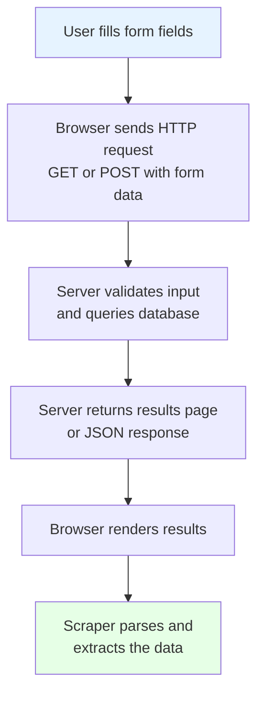
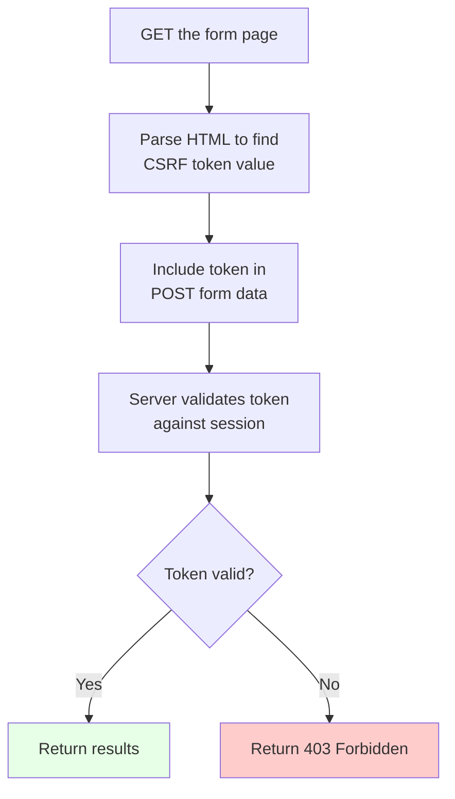
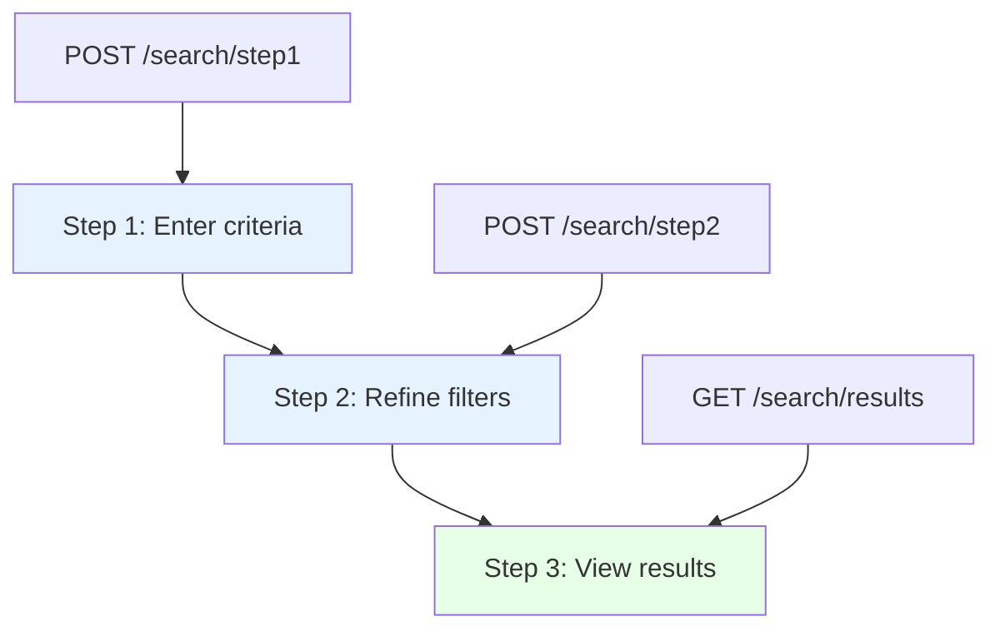
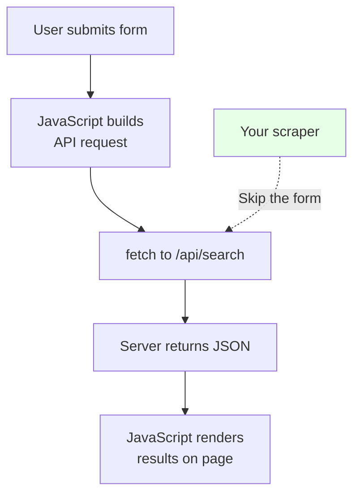
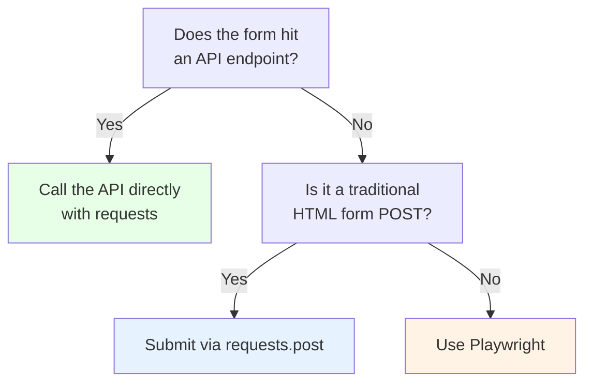

Many websites hide their most valuable data behind search forms, filter panels, or login pages. If you need a primer on [how to automate web form filling](/posts/how-to-automate-web-form-filling-complete-guide/), start there before diving into the extraction techniques below. The information you need does not appear in the HTML until you type a query, select some options, and click Submit. Price comparison engines, government record databases, academic search portals, and internal business tools all follow this pattern. If you try to scrape the initial page, you get an empty form and nothing else. To reach the data, your scraper has to do what a human does: fill the form, submit it, and then parse whatever comes back.

This post covers two fundamental approaches -- submitting forms with raw HTTP requests and automating them with a real browser -- along with the common complications you will hit: CSRF tokens, AJAX submissions, paginated results, and multi-step wizard forms.

## How Form Submission Works

Before writing any code, it helps to understand what happens when a user submits a form on a web page.



The key insight is that step B is just an HTTP request. If you can replicate that request -- with the right method, URL, headers, and form data -- you do not need a browser at all.

## Approach 1: Submit Forms via HTTP POST with Requests

The `requests` library can submit form data directly. This approach is faster, uses less memory, and does not require a browser. For a deeper look at when plain HTTP requests outperform a full browser, see our [Python requests vs Selenium speed comparison](/posts/python-requests-vs-selenium-speed-performance-comparison/). It works well for traditional server-rendered forms that do not rely heavily on JavaScript.

### Inspecting the Form in DevTools

Open the page in Chrome, right-click the form, and choose Inspect. You need three pieces of information:

1. The `action` attribute -- the URL the form submits to
2. The `method` attribute -- usually `POST`, sometimes `GET`
3. The `name` attributes of every input field

```html
<!-- Example: a property search form -->
<form action="/search/results" method="POST">
    <input type="text" name="location" placeholder="City or ZIP">
    <select name="property_type">
        <option value="house">House</option>
        <option value="apartment">Apartment</option>
    </select>
    <input type="number" name="min_price" placeholder="Min Price">
    <input type="number" name="max_price" placeholder="Max Price">
    <input type="hidden" name="csrf_token" value="a1b2c3d4e5">
    <button type="submit">Search</button>
</form>
```

### Sending the POST Request

Once you know the field names and the target URL, building the request is straightforward.

```python
import requests
from bs4 import BeautifulSoup

session = requests.Session()

form_data = {
    "location": "Austin, TX",
    "property_type": "house",
    "min_price": "200000",
    "max_price": "500000",
}

response = session.post(
    "https://example.com/search/results",
    data=form_data,
)

# Parse the results
soup = BeautifulSoup(response.text, "html.parser")
listings = soup.select("div.listing-card")

for listing in listings:
    title = listing.select_one("h3.listing-title")
    price = listing.select_one("span.listing-price")
    if title and price:
        print(f"{title.text.strip()} - {price.text.strip()}")
```

Notice the use of `requests.Session()` instead of a bare `requests.post()`. A session object automatically stores and sends cookies, which is essential when the server uses session tracking or CSRF protection.

## Approach 2: Browser Automation with Playwright

Sometimes raw HTTP requests are not enough. Use a browser when you see any of these patterns:

- Form fields are rendered by JavaScript after page load
- Selecting one option changes what other fields appear
- CSRF tokens are injected by JavaScript rather than embedded in HTML
- Results load via additional AJAX calls after the initial response

```python
from playwright.sync_api import sync_playwright

with sync_playwright() as p:
    browser = p.chromium.launch(headless=True)
    page = browser.new_page()

    page.goto("https://example.com/search")

    # Fill in the form
    page.fill('input[name="location"]', "Austin, TX")
    page.select_option('select[name="property_type"]', "house")
    page.fill('input[name="min_price"]', "200000")
    page.fill('input[name="max_price"]', "500000")

    # Submit and wait for results
    page.click('button[type="submit"]')
    page.wait_for_load_state("networkidle")

    # Extract data
    listings = page.query_selector_all("div.listing-card")
    for listing in listings:
        title_el = listing.query_selector("h3.listing-title")
        price_el = listing.query_selector("span.listing-price")
        if title_el and price_el:
            print(f"{title_el.inner_text()} - {price_el.inner_text()}")

    browser.close()
```

Playwright handles cookies, JavaScript execution, redirects, and rendering automatically. The trade-off is speed -- each submission takes seconds instead of milliseconds. Make sure you understand [how to wait for elements reliably in Playwright](/posts/playwright-wait-for-selector-python-waiting-elements-reliably/) to avoid flaky form submissions.

## Handling CSRF Tokens

Cross-Site Request Forgery tokens are the most common obstacle when submitting forms with raw HTTP requests. The server generates a unique token, embeds it in the form, and expects it back with the submission.



The solution is a two-step process: load the form page to grab the token, then include it in your POST.

```python
import requests
from bs4 import BeautifulSoup

session = requests.Session()

# Step 1: Load the form page to get the CSRF token
form_page = session.get("https://example.com/search")
soup = BeautifulSoup(form_page.text, "html.parser")

# Check for a hidden input field
csrf_token = None
csrf_input = soup.select_one('input[name="csrf_token"]')
if csrf_input:
    csrf_token = csrf_input.get("value")

# Some frameworks use a meta tag instead
if not csrf_token:
    csrf_meta = soup.select_one('meta[name="csrf-token"]')
    if csrf_meta:
        csrf_token = csrf_meta.get("content")

# Step 2: Include the token in the form submission
form_data = {
    "location": "Austin, TX",
    "property_type": "house",
    "csrf_token": csrf_token,
}

response = session.post(
    "https://example.com/search/results",
    data=form_data,
)
```

The `session` object is critical. The server ties the CSRF token to a session cookie, so the same session must be used for both the GET and the POST. Some frameworks also expect the token in a request header -- Django, for example, uses `X-CSRFToken`:

```python
response = session.post(
    "https://example.com/search/results",
    data=form_data,
    headers={"X-CSRFToken": csrf_token},
)
```

## Handling Pagination of Results

Forms that return many results usually paginate them. The simplest pattern passes a page number in the form data or URL.

```python
import requests
from bs4 import BeautifulSoup

session = requests.Session()
all_results = []
page_num = 1

while True:
    form_data = {
        "location": "Austin, TX",
        "property_type": "house",
        "page": str(page_num),
    }

    response = session.post(
        "https://example.com/search/results",
        data=form_data,
    )

    soup = BeautifulSoup(response.text, "html.parser")
    listings = soup.select("div.listing-card")

    if not listings:
        break

    for listing in listings:
        title = listing.select_one("h3.listing-title")
        if title:
            all_results.append(title.text.strip())

    print(f"Page {page_num}: found {len(listings)} results")
    page_num += 1

print(f"Total results collected: {len(all_results)}")
```

Other sites use "Next" links instead. Follow those until there is no next page:

```python
# After initial form submission...
while True:
    soup = BeautifulSoup(response.text, "html.parser")
    # ... extract results from current page ...

    next_link = soup.select_one("a.pagination-next")
    if not next_link or not next_link.get("href"):
        break

    next_url = next_link["href"]
    if not next_url.startswith("http"):
        next_url = "https://example.com" + next_url

    response = session.get(next_url)
```

## Handling AJAX Form Submissions

Many modern forms do not perform a traditional POST-and-redirect. They send data via `fetch()` and update the page dynamically, returning JSON instead of HTML.

Open DevTools, go to the Network tab, and submit the form. Look for XHR or Fetch requests. Once you find the API endpoint, call it directly and skip the form entirely.

```python
import requests

session = requests.Session()

response = session.post(
    "https://example.com/api/search",
    json={
        "location": "Austin, TX",
        "type": "house",
        "minPrice": 200000,
        "maxPrice": 500000,
    },
    headers={
        "Content-Type": "application/json",
        "X-Requested-With": "XMLHttpRequest",
    },
)

data = response.json()
for result in data.get("results", []):
    print(f"{result['title']} - ${result['price']}")
```

The `X-Requested-With: XMLHttpRequest` header is worth including. Many servers check for it to distinguish AJAX calls from regular page loads.

For high-throughput AJAX scraping without a browser, an [async HTTP client like httpx](/posts/web-scraping-httpx-async-http-fast-data-collection/) can handle hundreds of concurrent API calls efficiently. If you need the browser to discover the API endpoint at runtime, Playwright can intercept network requests:

```python
from playwright.sync_api import sync_playwright

captured_requests = []

def handle_request(request):
    if "/api/" in request.url and request.method == "POST":
        captured_requests.append({
            "url": request.url,
            "method": request.method,
            "post_data": request.post_data,
        })

with sync_playwright() as p:
    browser = p.chromium.launch(headless=True)
    page = browser.new_page()
    page.on("request", handle_request)

    page.goto("https://example.com/search")
    page.fill('input[name="location"]', "Austin, TX")
    page.click('button[type="submit"]')
    page.wait_for_load_state("networkidle")
    browser.close()

for req in captured_requests:
    print(f"URL: {req['url']}")
    print(f"Payload: {req['post_data']}")
```

Now you know the exact URL and payload format. You can replay these requests with `requests` and skip the browser for future runs.


<figure>
  
  <figcaption>Forms are the web's input mechanism — and automating them requires precision. <span class="img-credit">Photo by Tima Miroshnichenko / <a href="https://www.pexels.com" target="_blank" rel="noopener noreferrer">Pexels</a></span></figcaption>
</figure>

## Full Example: Submitting a Search Form with Requests

Here is a complete example that ties together form loading, CSRF extraction, submission, and paginated result parsing.

```python
import requests
from bs4 import BeautifulSoup
import time

BASE_URL = "https://example.com"
session = requests.Session()
session.headers.update({
    "User-Agent": (
        "Mozilla/5.0 (Windows NT 10.0; Win64; x64) "
        "AppleWebKit/537.36 (KHTML, like Gecko) "
        "Chrome/120.0.0.0 Safari/537.36"
    ),
})


def get_csrf_token():
    """Load the search page and extract the CSRF token."""
    response = session.get(f"{BASE_URL}/search")
    response.raise_for_status()
    soup = BeautifulSoup(response.text, "html.parser")
    token_input = soup.select_one('input[name="csrf_token"]')
    if token_input:
        return token_input["value"]
    raise ValueError("Could not find CSRF token")


def submit_search(query, page_num=1):
    """Submit the search form and return parsed results."""
    csrf_token = get_csrf_token()
    response = session.post(
        f"{BASE_URL}/search/results",
        data={"q": query, "page": str(page_num), "csrf_token": csrf_token},
    )
    response.raise_for_status()
    return response.text


def parse_results(html):
    """Extract structured data from the results page."""
    soup = BeautifulSoup(html, "html.parser")
    results = []

    for card in soup.select("div.result-card"):
        title_el = card.select_one("h3.title")
        link_el = card.select_one("a.result-link")
        if title_el:
            results.append({
                "title": title_el.text.strip(),
                "url": link_el["href"] if link_el else "",
            })

    has_next = soup.select_one("a.next-page") is not None
    return results, has_next


def scrape_all_results(query, max_pages=10):
    """Scrape all pages of results for a given query."""
    all_results = []
    for page_num in range(1, max_pages + 1):
        print(f"Fetching page {page_num}...")
        html = submit_search(query, page_num)
        results, has_next = parse_results(html)
        all_results.extend(results)

        if not has_next:
            break
        time.sleep(1.5)

    return all_results


results = scrape_all_results("python web scraping", max_pages=5)
print(f"\nTotal results: {len(results)}")
for r in results[:5]:
    print(f"  {r['title']}: {r['url']}")
```

## Full Example: Same Task with Playwright

The same scraping task using Playwright, for sites where the requests approach does not work.

```python
from playwright.sync_api import sync_playwright
import time


def scrape_with_playwright(query, max_pages=10):
    all_results = []

    with sync_playwright() as p:
        browser = p.chromium.launch(headless=True)
        page = browser.new_page()

        page.goto("https://example.com/search")
        page.fill('input[name="q"]', query)
        page.click('button[type="submit"]')
        page.wait_for_load_state("networkidle")

        for page_num in range(1, max_pages + 1):
            print(f"Scraping page {page_num}...")
            cards = page.query_selector_all("div.result-card")

            for card in cards:
                title_el = card.query_selector("h3.title")
                link_el = card.query_selector("a.result-link")
                if title_el:
                    all_results.append({
                        "title": title_el.inner_text(),
                        "url": link_el.get_attribute("href") if link_el else "",
                    })

            next_button = page.query_selector("a.next-page")
            if not next_button:
                break

            next_button.click()
            page.wait_for_load_state("networkidle")
            time.sleep(1.0)

        browser.close()
    return all_results


results = scrape_with_playwright("python web scraping", max_pages=5)
print(f"\nTotal results: {len(results)}")
for r in results[:5]:
    print(f"  {r['title']}: {r['url']}")
```

## Multi-Step Forms: Handling Wizard-Style Flows

Some forms are broken into multiple steps. Each step may submit to a different endpoint or dynamically reveal the next section on the same page.



With `requests`, you parse each step's response for hidden fields (tokens, session IDs) and submit to the next endpoint:

```python
import requests
from bs4 import BeautifulSoup

session = requests.Session()

# Step 1
page1 = session.get("https://example.com/search/step1")
soup1 = BeautifulSoup(page1.text, "html.parser")
token1 = soup1.select_one('input[name="step_token"]')["value"]

step1_resp = session.post("https://example.com/search/step1", data={
    "category": "electronics",
    "keyword": "laptop",
    "step_token": token1,
})

# Step 2
soup2 = BeautifulSoup(step1_resp.text, "html.parser")
token2 = soup2.select_one('input[name="step_token"]')["value"]
session_id = soup2.select_one('input[name="search_session"]')["value"]

step2_resp = session.post("https://example.com/search/step2", data={
    "min_price": "500",
    "max_price": "2000",
    "step_token": token2,
    "search_session": session_id,
})
```

With Playwright, wizard forms are simpler because the browser handles tokens and session state automatically:

```python
from playwright.sync_api import sync_playwright

with sync_playwright() as p:
    browser = p.chromium.launch(headless=True)
    page = browser.new_page()
    page.goto("https://example.com/search/step1")

    # Step 1
    page.select_option('select[name="category"]', "electronics")
    page.fill('input[name="keyword"]', "laptop")
    page.click('button.next-step')
    page.wait_for_load_state("networkidle")

    # Step 2
    page.fill('input[name="min_price"]', "500")
    page.fill('input[name="max_price"]', "2000")
    page.click('button.next-step')
    page.wait_for_load_state("networkidle")

    # Extract results
    results = page.query_selector_all("div.result-card")
    for result in results:
        title = result.query_selector("h3.title")
        if title:
            print(title.inner_text())

    browser.close()
```

## When the Form Is Just a Frontend for an API

This is the best scenario for a scraper. Many single-page applications use forms purely as a UI layer -- the real data retrieval happens through an API endpoint.



When you find an API behind a form, skip everything else and call the API directly:

```python
import requests

session = requests.Session()
session.get("https://example.com")  # Get session cookies

all_items = []
total_pages = 1

for page_num in range(1, total_pages + 1):
    response = session.post(
        "https://example.com/api/v2/search",
        json={
            "query": "laptop",
            "category": "electronics",
            "priceRange": {"min": 500, "max": 2000},
            "page": page_num,
            "pageSize": 50,
        },
        headers={
            "Content-Type": "application/json",
            "X-Requested-With": "XMLHttpRequest",
        },
    )

    data = response.json()
    all_items.extend(data["results"])
    total_pages = data["pagination"]["totalPages"]

print(f"Collected {len(all_items)} items across {total_pages} pages")
```

## Choosing the Right Approach



Start by checking the Network tab in DevTools. If you see an API call, use that -- you get structured JSON instead of HTML, and pagination is usually a query parameter. If you see a standard form POST, replicate it with `requests`. Only reach for Playwright when the form has JavaScript-driven complexity that you cannot bypass. Once you have the raw HTML, an [LLM-based structured data extraction pipeline](/posts/best-llm-structured-data-extraction-html-2026/) can turn messy form results into clean, typed data automatically.

In practice, you will often start with Playwright to understand how a form works, then switch to raw requests once you have reverse-engineered the submission flow.
