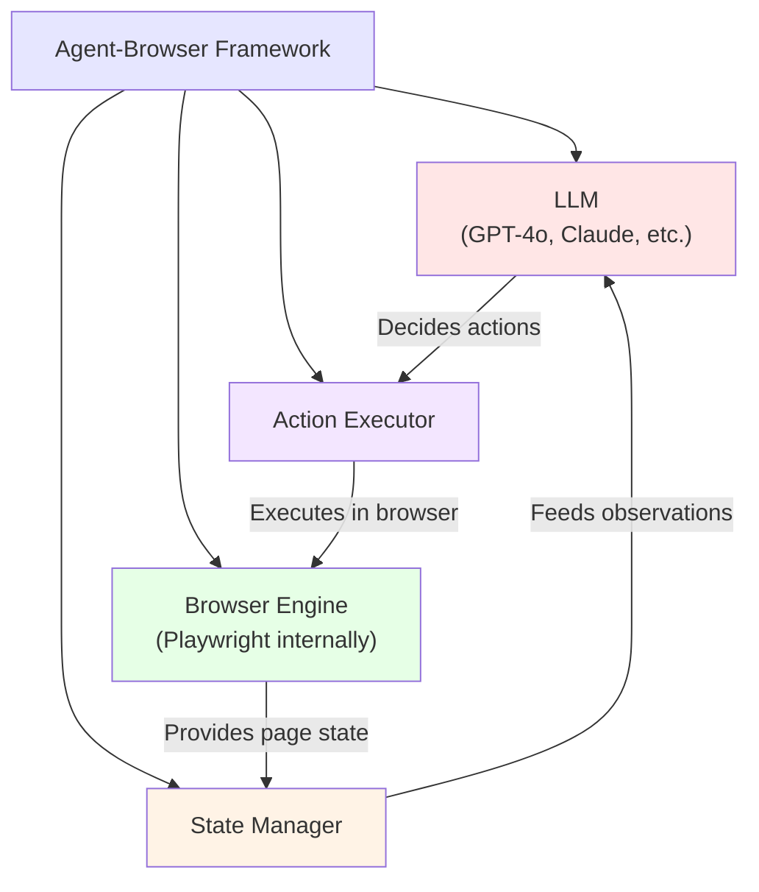
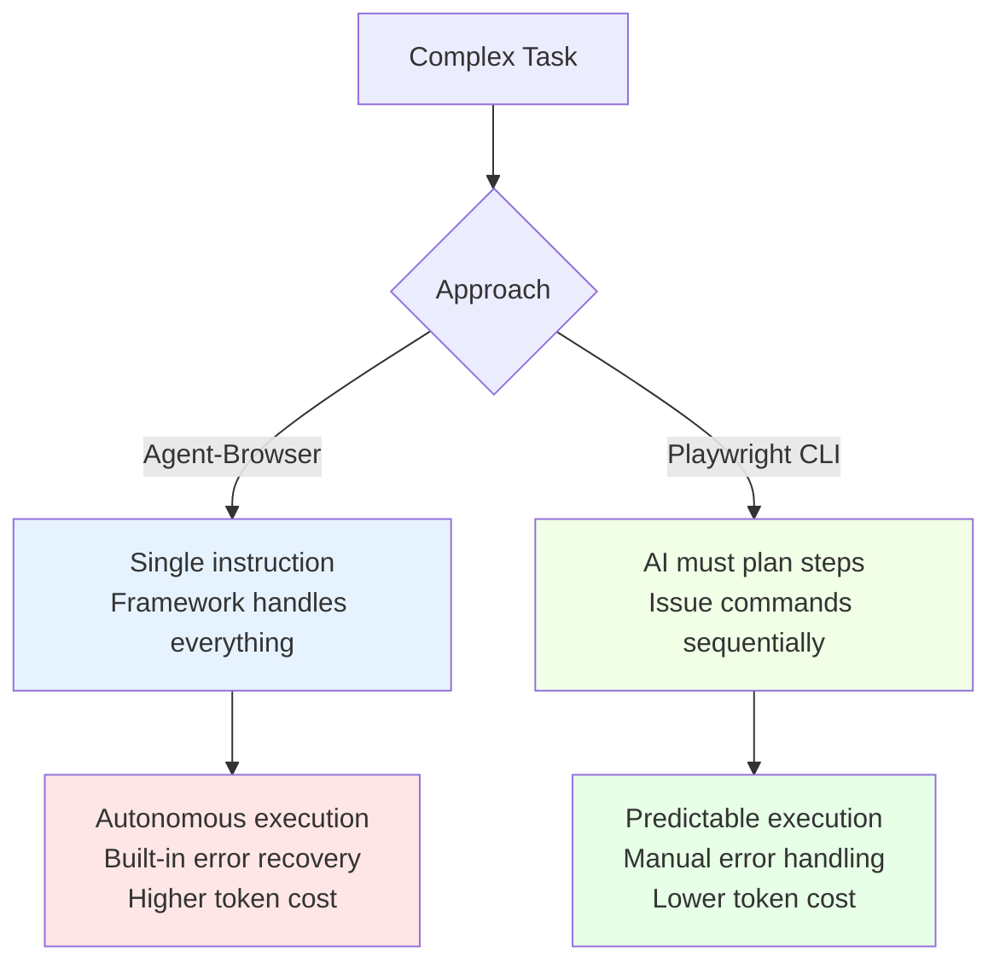
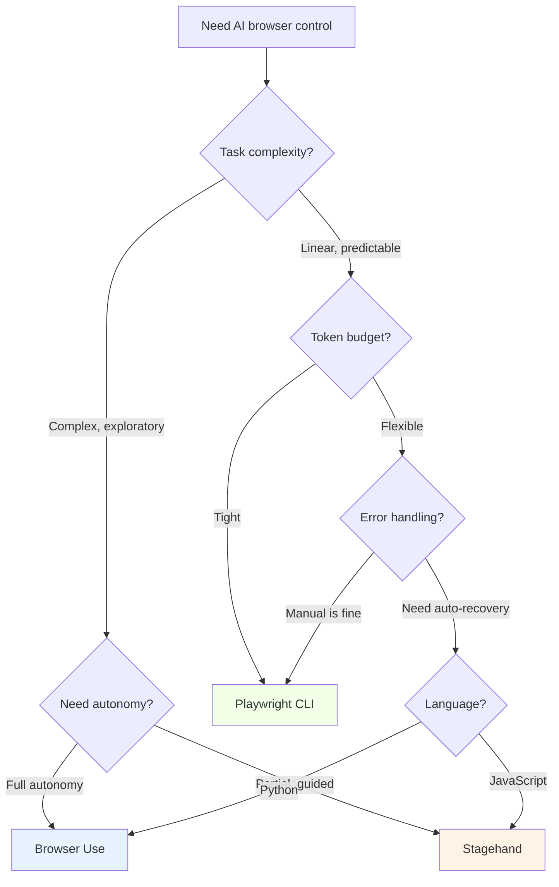
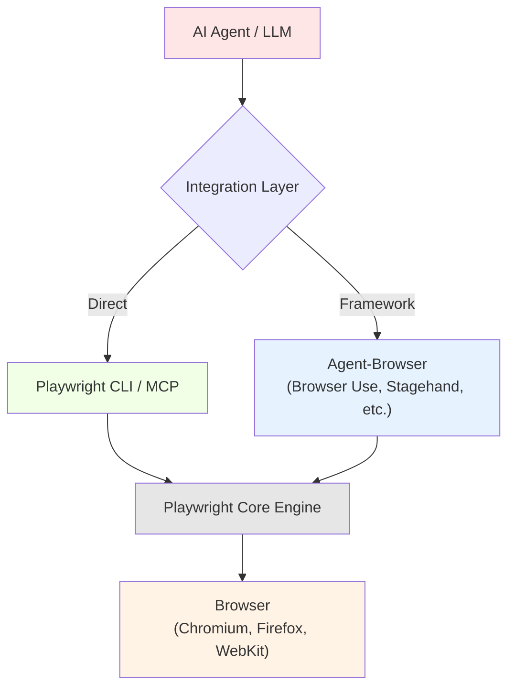

AI agents need to interact with the web, and two distinct approaches have emerged to make that happen. On one side, dedicated agent-browser frameworks like Browser Use, Stagehand, and AgentQL wrap browser automation in AI-native abstractions. On the other, Playwright's CLI and MCP server expose traditional browser control through interfaces designed for machine consumption. Both aim to let an LLM drive a browser, but they make fundamentally different architectural decisions about where the intelligence lives and how much autonomy the AI gets.

Choosing between them is not a matter of which is "better" in the abstract. It depends on your task complexity, token budget, reliability requirements, and how much control you want the AI to have over the browsing session.

## Two Philosophies of AI Browser Control

The split between agent-browsers and Playwright CLI mirrors a broader tension in AI tooling: should the AI drive the entire workflow, or should it operate within a structured command interface?

Agent-browser frameworks give the LLM a reasoning loop. The AI observes the page, decides what to do, executes an action, checks the result, and repeats. The human provides a goal; the AI figures out the steps.

Playwright CLI takes the opposite approach. The AI issues discrete commands -- navigate here, click this, extract that -- and receives structured responses. The AI still makes decisions, but within a tighter, more predictable interface.

```mermaid
graph TD
    subgraph AB["Agent-Browser Approach"]
        A1["Human provides goal"] --> A2["LLM observes page state"]
        A2 --> A3["LLM decides next action"]
        A3 --> A4["Execute in browser"]
        A4 --> A5["LLM evaluates result"]
        A5 -->|"Not done"| A2
        A5 -->|"Done"| A6["Return result"]
    end

    subgraph PC["Playwright CLI Approach"]
        B1["AI issues command"] --> B2["CLI executes action"]
        B2 --> B3["Return structured output"]
        B3 --> B4["AI processes response"]
        B4 --> B5["AI issues next command"]
        B5 --> B2
    end

    style AB fill:#e6f3ff
    style PC fill:#f0ffe6
```



The architectural difference has practical consequences. Agent-browsers are more autonomous but consume more tokens and are harder to debug. Playwright CLI is more predictable but requires the AI to handle more of the planning itself.

## How Playwright CLI Works with AI

Playwright's CLI, shipped as `@playwright/mcp`, was designed specifically for AI agent integration. It exposes browser automation through terminal commands that return structured, token-efficient output. An AI agent calls these commands through standard tool-use patterns, receives text or screenshot responses, and decides what to do next.

The key design decision is output format. Instead of returning raw HTML or DOM trees, the CLI returns accessibility snapshots -- compact text representations of the page that describe interactive elements, their roles, and their states. This keeps token usage low while giving the AI enough information to make decisions.

```bash
# Navigate to a page and get an accessibility snapshot
npx playwright navigate --url "https://example.com/products"

# Take a screenshot for visual understanding
npx playwright screenshot --output page.png

# Click an element identified by its accessibility role
npx playwright click --ref "link:Products"

# Type into an input field
npx playwright type --ref "searchbox:Search" --text "laptop"

# Extract the current page's accessibility tree
npx playwright snapshot
```

```python
import subprocess
import json


def playwright_cli(command, **kwargs):
    """Run a Playwright CLI command and parse the output."""
    cmd = ["npx", "@playwright/mcp", command]
    for key, value in kwargs.items():
        cmd.extend([f"--{key}", str(value)])

    result = subprocess.run(
        cmd,
        capture_output=True,
        text=True,
        timeout=30
    )
    try:
        return json.loads(result.stdout)
    except json.JSONDecodeError:
        return result.stdout


# Agent workflow: navigate, observe, act
page_state = playwright_cli("navigate", url="https://example.com/products")
snapshot = playwright_cli("snapshot")

# The AI processes the snapshot and decides the next action
# This decision happens in the LLM, not in the CLI
print("Page elements:", snapshot)
```

The MCP server variant works similarly but uses the Model Context Protocol for communication. For a deep dive into how the [Playwright MCP and CLI make browser automation AI-agent friendly](/posts/playwright-mcp-and-cli-making-browser-automation-ai-agent-friendly/), see our dedicated post. Instead of subprocess calls, the AI connects through a standardized protocol that handles tool discovery, invocation, and response formatting.

```javascript
// Playwright MCP server exposes these tools to any MCP-compatible agent
const mcpTools = [
  "browser_navigate",    // Go to a URL
  "browser_snapshot",    // Get accessibility tree
  "browser_click",       // Click an element
  "browser_type",        // Type into a field
  "browser_screenshot",  // Capture visual state
  "browser_select_option", // Select from dropdown
  "browser_hover",       // Hover over element
  "browser_go_back",     // Navigate back
  "browser_go_forward",  // Navigate forward
  "browser_press_key",   // Press a keyboard key
];

// Each tool returns structured data the AI can parse
// without needing to understand Playwright internals
```

## How Agent-Browsers Work

Agent-browser frameworks like Browser Use take a fundamentally different approach. Instead of exposing browser commands for an external AI to call, they embed the AI inside the automation loop. The framework manages the browser, the LLM connection, and the decision-making cycle as a single integrated system.

```python
from browser_use import Agent
from langchain_openai import ChatOpenAI
import asyncio


async def search_products():
    """Browser Use handles the entire workflow autonomously."""
    agent = Agent(
        task=(
            "Go to example.com/products, find all laptops under $500, "
            "and return a list with name, price, and rating for each."
        ),
        llm=ChatOpenAI(model="gpt-4o"),
    )
    result = await agent.run()
    return result


asyncio.run(search_products())
```

The developer provides a natural language goal. The framework handles page observation, action selection, execution, error recovery, and result extraction. Under the hood, most of these frameworks use [Playwright for browser automation in AI agents](/posts/playwright-for-browser-automation-in-ai-agents/) (or occasionally Puppeteer) as their browser engine, but they abstract it away entirely.



Stagehand from Browserbase takes a middle path. It extends the Playwright API with AI-powered methods that you call when you need them, keeping deterministic control for the parts of your workflow that are predictable.

```javascript
// Stagehand: AI assistance within a Playwright script
import { Stagehand } from "@browserbasehq/stagehand";

const stagehand = new Stagehand({
  env: "LOCAL",
  modelName: "gpt-4o",
});

await stagehand.init();
await stagehand.page.goto("https://example.com/products");

// Use AI only when the task is ambiguous
const products = await stagehand.page.extract({
  instruction: "Extract all product names and prices from the page",
  schema: {
    type: "object",
    properties: {
      products: {
        type: "array",
        items: {
          type: "object",
          properties: {
            name: { type: "string" },
            price: { type: "string" },
          },
        },
      },
    },
  },
});

console.log(products);
await stagehand.close();
```

AgentQL takes yet another approach, using natural language queries to locate elements without CSS selectors or XPath.

```python
import agentql

session = agentql.start_session("https://example.com/products")

# Natural language element location
products = session.query("""
{
    product_cards[] {
        name
        price
        rating
        in_stock
    }
}
""")

for product in products.product_cards:
    print(f"{product.name}: {product.price}")

session.stop()
```

## Playwright CLI Strengths

Playwright CLI has several concrete advantages that matter in production.

**Official backing and stability.** Microsoft maintains Playwright and its CLI. Updates are regular, breaking changes are documented, and the API surface is designed for long-term stability. Agent-browser frameworks, while impressive, are mostly early-stage open-source projects with smaller teams.

**Token efficiency by design.** The CLI returns accessibility tree snapshots instead of raw HTML. A typical page that produces 50,000 tokens of HTML might generate only 2,000 tokens as an accessibility snapshot. The MCP integration was measured at around 114,000 tokens for a complex task; the CLI achieved the same result in roughly 27,000 tokens.

**Predictable behavior.** Each CLI command does exactly one thing and returns a structured result. There are no hidden retry loops, no autonomous decision-making, and no multi-step reasoning that might go off track. When something fails, you know exactly which command failed and why.

**Screenshot support.** The CLI can return screenshots alongside accessibility data. This lets multimodal AI models combine structural understanding with visual context, which is particularly useful for pages where layout conveys meaning that the accessibility tree misses.

```python
# Combining accessibility snapshot with screenshot
# for richer page understanding
snapshot = playwright_cli("snapshot")
playwright_cli("screenshot", output="/tmp/page.png")

# Send both to a multimodal LLM
# The snapshot provides structure; the screenshot provides visual context
agent_context = {
    "accessibility_tree": snapshot,
    "screenshot_path": "/tmp/page.png",
    "task": "Find the checkout button and describe its location"
}
```

**Broad language support.** Since the CLI operates through subprocess calls, any programming language can use it. Python, JavaScript, Go, Rust -- if it can spawn a process, it can control a browser through Playwright CLI.


<figure>
  
  <figcaption>AI is reshaping how we think about web data extraction. <span class="img-credit">Photo by Pavel Danilyuk / <a href="https://www.pexels.com" target="_blank" rel="noopener noreferrer">Pexels</a></span></figcaption>
</figure>

## Agent-Browser Strengths

Agent-browser frameworks excel in different areas.

**Higher-level task specification.** Instead of breaking a task into individual browser commands, you describe the goal. "Find the cheapest flight from New York to London next Tuesday" is a single instruction to Browser Use. With Playwright CLI, the AI has to plan the sequence of navigations, clicks, form fills, and extractions itself.

**Built-in error recovery.** When a click fails or a page loads unexpectedly, agent-browsers can reassess and try alternative approaches. They handle pop-ups, cookie banners, and layout variations without explicit programming. Playwright CLI requires the calling AI to handle all error cases.

**Task planning and decomposition.** Frameworks like Browser Use include planning capabilities that break complex goals into subtasks. The AI does not just react to the current page state; it maintains a plan and adjusts it as circumstances change.

**Integrated LLM reasoning.** The observation-action loop is tightly coupled with the LLM. The framework manages context windows, handles prompt construction, and optimizes the information flow between the browser and the model. With Playwright CLI, the calling agent is responsible for all of this.



## Token Efficiency Comparison

Both approaches aim to minimize token consumption, but they use different strategies.

Playwright CLI reduces tokens at the interface level. Accessibility snapshots are compact. Commands are terse. Responses are structured. The AI spends tokens on decision-making, not on parsing verbose page representations.

Agent-browsers reduce tokens through smarter observation. They filter page state before sending it to the LLM, highlighting relevant elements and suppressing noise. Browser Use, for example, assigns reference numbers to interactive elements and only includes those in the prompt, rather than the full DOM.

```python
# Token usage comparison for a product search task

# Playwright CLI approach
# Step 1: Navigate (response ~200 tokens)
# Step 2: Snapshot (response ~2,000 tokens)
# Step 3: Type search query (response ~100 tokens)
# Step 4: Snapshot after search (response ~3,000 tokens)
# Step 5: Click product (response ~100 tokens)
# Step 6: Snapshot product page (response ~2,500 tokens)
# Step 7: Extract data (response ~500 tokens)
# Total response tokens: ~8,400
# Total with prompts: ~15,000-20,000

# Agent-browser approach (Browser Use)
# Iteration 1: Observe page, decide to search (~4,000 tokens)
# Iteration 2: Observe results, decide to click (~5,000 tokens)
# Iteration 3: Observe product page, extract (~6,000 tokens)
# Iteration 4: Verify extraction complete (~3,000 tokens)
# Total tokens: ~18,000-30,000
# (varies significantly based on page complexity)
```

The numbers vary widely depending on the task. Simple, linear workflows favor Playwright CLI. Complex tasks with branching logic and error recovery can actually be more token-efficient with agent-browsers, because the framework handles retries internally rather than requiring the AI to re-prompt from scratch.

## Setup and Integration

Playwright CLI wins on simplicity. Installation is a single npm command, and integration requires only the ability to call subprocess commands.

```bash
# Playwright CLI setup - that is it
npm install -g @playwright/mcp
npx playwright install chromium
```

```python
# Minimal integration - works from any language
import subprocess

result = subprocess.run(
    ["npx", "@playwright/mcp", "navigate",
     "--url", "https://example.com"],
    capture_output=True,
    text=True
)
print(result.stdout)
```

For MCP integration, the setup involves configuring your AI client to connect to the Playwright MCP server. We compare the Puppeteer and Playwright MCP servers in our [Puppeteer MCP vs Playwright MCP](/posts/puppeteer-mcp-vs-playwright-mcp-model-context-protocol-browsers/) guide.

```json
{
  "mcpServers": {
    "playwright": {
      "command": "npx",
      "args": ["@anthropic-ai/mcp-server-playwright"]
    }
  }
}
```

Agent-browser frameworks require more configuration. You need the framework itself, an LLM API key, and often additional dependencies for specific features.

```bash
# Browser Use setup
pip install browser-use
pip install langchain-openai
playwright install chromium
```

```python
# Browser Use requires LLM configuration
import os
os.environ["OPENAI_API_KEY"] = "sk-..."

from browser_use import Agent
from langchain_openai import ChatOpenAI
import asyncio


async def run():
    agent = Agent(
        task="Navigate to example.com and extract the page title",
        llm=ChatOpenAI(model="gpt-4o"),
        browser_config={
            "headless": True,
            "disable_security": False,
        },
    )
    return await agent.run()


asyncio.run(run())
```

```bash
# Stagehand setup
npm install @browserbasehq/stagehand
npx playwright install chromium
```

```javascript
// Stagehand requires model configuration
import { Stagehand } from "@browserbasehq/stagehand";

const stagehand = new Stagehand({
  env: "LOCAL",
  modelName: "gpt-4o",
  modelClientOptions: {
    apiKey: process.env.OPENAI_API_KEY,
  },
});

await stagehand.init();
// Now you can use stagehand.page like a regular Playwright page
// with added AI methods
```

The configuration difference matters at scale. If you are deploying browser automation across multiple services or environments, Playwright CLI's minimal footprint is easier to manage. Agent-browser frameworks carry more dependencies and configuration surface area.


<figure>
  
  <figcaption>Machine learning adds intelligence to what was once a mechanical process. <span class="img-credit">Photo by Google DeepMind / <a href="https://www.pexels.com" target="_blank" rel="noopener noreferrer">Pexels</a></span></figcaption>
</figure>

## When to Use Each

The decision tree is fairly straightforward once you understand the trade-offs.

**Use Playwright CLI when:**

- You need predictable, debuggable browser automation
- Token cost is a primary concern
- The AI agent already has strong planning capabilities
- You want the AI to control the browsing flow but not the browser internals
- You are building a multi-tool agent where browser control is one of many capabilities
- You need to support multiple programming languages

**Use agent-browser frameworks when:**

- Tasks are complex and require adaptive decision-making
- You want to describe goals in natural language rather than programming steps
- Error recovery and handling unexpected page states is important
- You are building a dedicated browser automation agent, not a general-purpose one
- Rapid prototyping matters more than production optimization
- The task involves exploration -- searching for information without knowing the exact path



## The Convergence

Here is the thing that makes this comparison interesting: most agent-browser frameworks use Playwright internally. Browser Use runs on Playwright. Stagehand is built directly on top of the Playwright API. Even Skyvern uses Playwright for its browser interactions. We cover these frameworks in detail in our [browser agent frameworks comparison: Browser Use vs Stagehand vs Skyvern](/posts/browser-agent-frameworks-compared-browser-use-vs-stagehand-vs-skyvern/).

This means the two approaches are not really competing technologies. They are different layers of the same stack.



Playwright CLI and MCP are the low-level interface. Agent-browser frameworks are the high-level interface. You can mix them. An agent could use Playwright CLI for predictable parts of a workflow and hand off to Browser Use for the parts that require exploration.

This convergence also means improvements to Playwright benefit everyone. When Playwright v1.57 switched to Chrome for Testing, every framework built on top of it got the same fingerprinting improvements for free. When the MCP server gets new capabilities, agent-browsers can expose them through their higher-level abstractions.

The practical takeaway: start with Playwright CLI if you want control and efficiency. Move to an agent-browser framework when your tasks outgrow what structured commands can handle. And do not treat the choice as permanent -- hybrid approaches that use both are often the most effective in production.

## Key Takeaways

Playwright CLI and agent-browser frameworks solve the same problem at different levels of abstraction. The CLI gives AI agents a structured, token-efficient interface to browser actions. Agent-browsers wrap that same browser engine in autonomous reasoning loops that handle complex, unpredictable tasks.

Neither approach is universally better. Playwright CLI excels at controlled, predictable workflows where token efficiency matters. Agent-browsers shine when tasks require adaptive decision-making and error recovery. Since agent-browsers are built on Playwright anyway, the two approaches complement rather than compete with each other.

For most teams, the right strategy is to use Playwright CLI as the default and reach for agent-browser frameworks when the task genuinely requires autonomous browsing. That keeps costs down, maintains debuggability, and reserves the heavier tooling for situations where it actually adds value. For a broader look at the challenges ahead, see [the unsolved problems of AI web scraping in 2026](/posts/the-unsolved-problems-of-ai-web-scraping-in-2026/).
