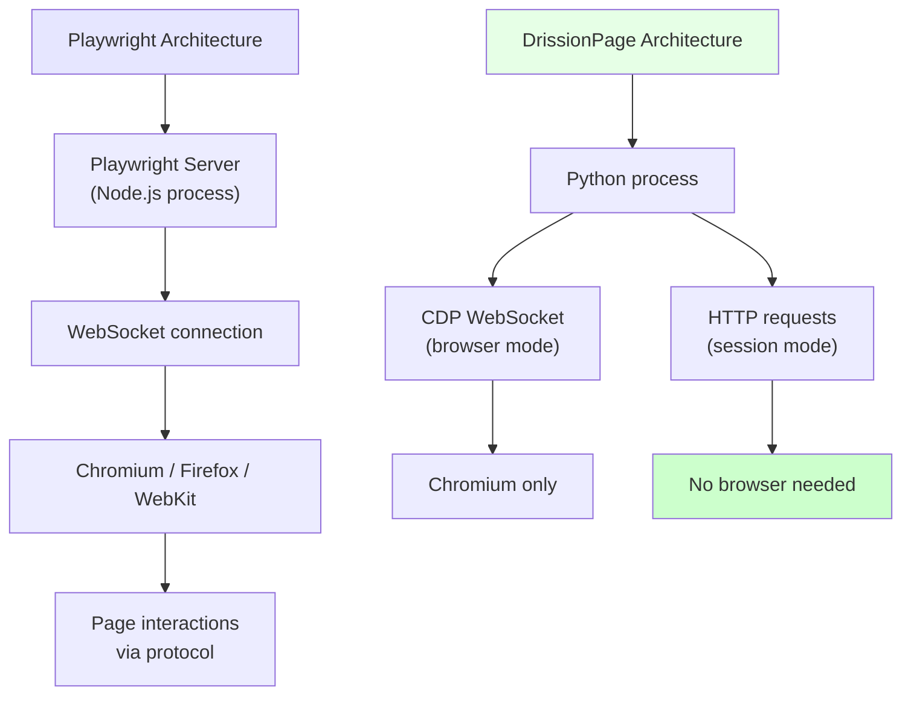
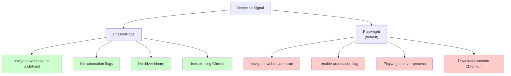
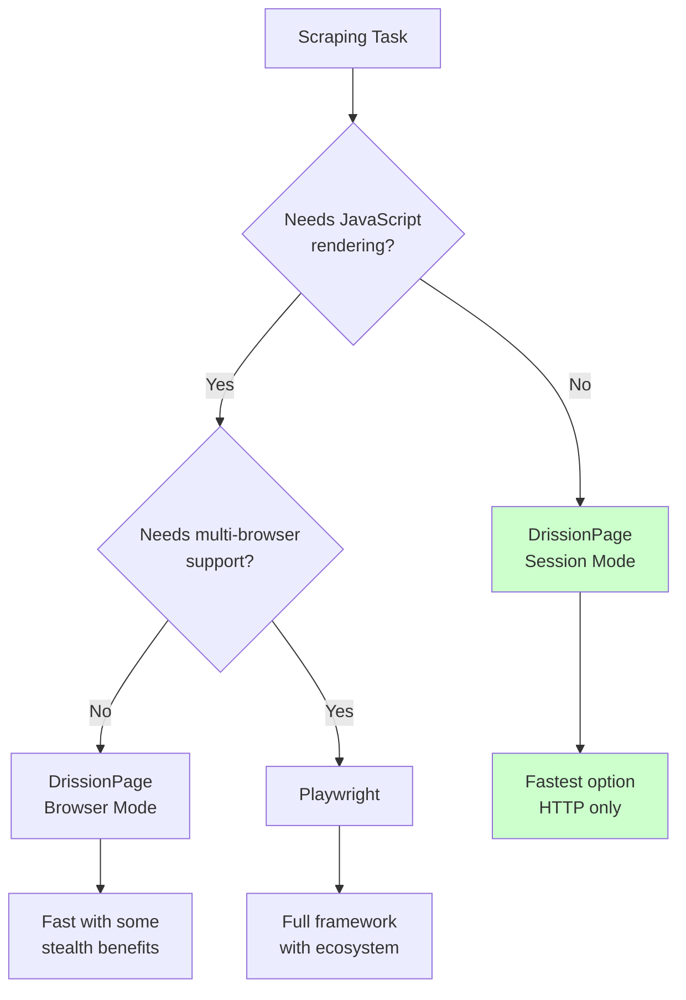

DrissionPage is a Python library that started in the Chinese open-source community and is steadily gaining attention outside it. The pitch is straightforward: combine the speed of raw HTTP requests with the power of full browser automation in a single tool, and let the developer switch between them mid-session. That hybrid approach sets it apart from Playwright, Selenium, and every other major automation framework that forces you to pick one mode and stick with it. Whether DrissionPage is ready to replace Playwright depends on what you need, but understanding what it offers --- and where it falls short --- is worth the time if you work in Python and scrape anything more complex than static HTML.

## What DrissionPage Actually Is

DrissionPage provides two core page objects. `ChromiumPage` controls a Chromium browser via the Chrome DevTools Protocol (CDP), similar to how Puppeteer or [nodriver](/posts/nodriver-complete-guide-undetected-browser-automation-python/) work. `SessionPage` handles plain HTTP requests, similar to Python's `requests` library but with built-in session management, cookie persistence, and HTML parsing. A third object, `WebPage`, wraps both and lets you switch between them without losing your session state.

The library is pure Python. There is no Node.js dependency, no separate browser binary download step like Playwright requires, and no driver executable like Selenium's ChromeDriver. It connects to whatever Chrome or Chromium installation you already have on your machine.

```python
from DrissionPage import ChromiumPage, SessionPage

# Browser mode --- controls a real Chromium instance
browser = ChromiumPage()
browser.get("https://example.com")
title = browser.title
print(title)

# HTTP mode --- fast requests, no browser overhead
session = SessionPage()
session.get("https://example.com")
text = session.html
print(text)
```

The naming convention is intentional. "Dri" comes from Driver (browser control) and "ssion" comes from Session (HTTP requests). The library merges both concepts into one package.

## How the Architecture Differs

Playwright and DrissionPage take fundamentally different approaches to browser automation. Playwright is a cross-language, cross-browser framework backed by Microsoft. DrissionPage is a Python-only library focused on Chromium and built around the idea that most scraping tasks do not need a browser at all.



Playwright launches its own server process, downloads specific browser builds, and communicates through a layered protocol. DrissionPage connects directly to your existing Chrome installation over CDP, or skips the browser entirely and makes HTTP calls. There is no intermediate server, no binary management, and no browser download on first run.

## The Dual-Mode Advantage

The most compelling feature in DrissionPage is the ability to start with HTTP requests and escalate to a full browser only when the page demands it. This is not two separate tools glued together --- it is a single session that preserves cookies, headers, and authentication state across mode switches.

Consider a common scraping scenario: you need to log into a site that uses JavaScript-rendered login forms, then scrape hundreds of pages that return plain HTML once authenticated.

```python
from DrissionPage import WebPage

page = WebPage()

# Start in browser mode to handle the JS login form
page.get("https://example.com/login")
page.ele("#username").input("myuser")
page.ele("#password").input("mypass")
page.ele("#submit-btn").click()

# Wait for login to complete
page.wait.load_start()

# Switch to session mode --- cookies carry over automatically
page.change_mode()

# Now scrape with fast HTTP requests, no browser overhead
for i in range(1, 101):
    page.get(f"https://example.com/data?page={i}")
    items = page.eles(".item-card")
    for item in items:
        print(item.ele(".item-title").text)
        print(item.ele(".item-price").text)
```

In Playwright, achieving the same workflow requires manually extracting cookies from the browser context and injecting them into a separate HTTP client like [httpx](/posts/web-scraping-httpx-async-http-fast-data-collection/) or [requests](/posts/python-requests-vs-selenium-speed-performance-comparison/). That is doable but tedious, error-prone, and breaks whenever the site changes its cookie structure.

```python
# Playwright equivalent --- more manual work required
from playwright.sync_api import sync_playwright
import httpx

with sync_playwright() as p:
    browser = p.chromium.launch()
    context = browser.new_context()
    page = context.new_page()

    # Browser login
    page.goto("https://example.com/login")
    page.fill("#username", "myuser")
    page.fill("#password", "mypass")
    page.click("#submit-btn")
    page.wait_for_load_state("networkidle")

    # Extract cookies manually
    cookies = context.cookies()
    cookie_dict = {c["name"]: c["value"] for c in cookies}

    browser.close()

# Switch to HTTP client manually
client = httpx.Client(cookies=cookie_dict)
for i in range(1, 101):
    response = client.get(f"https://example.com/data?page={i}")
    # Parse HTML separately with BeautifulSoup or similar
    # ...
```

The DrissionPage version is shorter, maintains state automatically, and does not require a separate parsing library.

## API Style Differences

DrissionPage and Playwright have noticeably different API conventions. DrissionPage leans toward a more Pythonic, concise style. Playwright follows a more explicit, method-heavy approach inherited from its cross-language design.

### Finding Elements

```python
# DrissionPage
page.ele("#main-content")           # by CSS selector
page.ele("@name=email")             # by attribute
page.ele("tag:div")                 # by tag name
page.ele("text:Sign In")            # by visible text
page.ele("xpath://div[@class='x']") # by XPath
page.eles(".items")                 # multiple elements
```

```python
# Playwright
page.locator("#main-content")
page.locator("[name=email]")
page.locator("div")
page.get_by_text("Sign In")
page.locator("xpath=//div[@class='x']")
page.locator(".items").all()
```

### Interacting with Elements

```python
# DrissionPage
element = page.ele("#search-box")
element.input("query text")
element.click()
print(element.text)
print(element.attr("href"))
print(element.html)

# Chaining
page.ele("#form").ele("#input").input("value")
```

```python
# Playwright
element = page.locator("#search-box")
element.fill("query text")
element.click()
print(element.text_content())
print(element.get_attribute("href"))
print(element.inner_html())

# Chaining
page.locator("#form").locator("#input").fill("value")
```

DrissionPage uses properties where Playwright uses methods: `element.text` vs `element.text_content()`, `element.html` vs `element.inner_html()`. DrissionPage also uses `input()` instead of `fill()`, which more naturally describes what the user is doing.

### Waiting for Content

```python
# DrissionPage
page.wait.load_start()
page.wait.ele_displayed("#result")
page.wait.ele_deleted("#loading")
element = page.ele("#data", timeout=10)
```

```python
# Playwright
page.wait_for_load_state("domcontentloaded")
page.locator("#result").wait_for(state="visible")
page.locator("#loading").wait_for(state="detached")
element = page.locator("#data")
element.wait_for(timeout=10000)
```

DrissionPage bakes timeouts into element lookups directly. If you call `page.ele("#data", timeout=10)`, it will wait up to 10 seconds for that element to appear before raising an error. Playwright separates the locator creation from the wait, which is more flexible but also more verbose.

## Stealth Characteristics

DrissionPage communicates with Chrome over CDP using a direct WebSocket connection, similar to nodriver. It does not inject a driver binary, does not set `navigator.webdriver` to `true`, and does not add automation flags to the browser launch arguments. This gives it some inherent stealth advantages over Playwright's default configuration.



That said, DrissionPage is not an anti-detection tool in the same league as Camoufox or a fully patched nodriver setup, as we discuss in [stealth browsers in 2026: Camoufox, nodriver, and the anti-detection arms race](/posts/stealth-browsers-in-2026-camoufox-nodriver-and-the-anti-detection-arms-race/). It does not spoof TLS fingerprints, randomize canvas or WebGL output, or handle advanced behavioral analysis. Its stealth comes from simply not adding the obvious automation markers that Playwright does. Against basic bot detection, that is often enough. Against Cloudflare Turnstile or Akamai Bot Manager, you will still need additional measures regardless of which tool you choose.

## Handling Tabs and Iframes

DrissionPage has a straightforward approach to tabs and iframes that differs from Playwright's context model.

```python
# DrissionPage --- tabs
page.new_tab("https://example.com")
all_tabs = page.get_tabs()
page.to_tab(1)  # switch by index

# DrissionPage --- iframes
iframe = page.get_frame("#my-iframe")
iframe.ele("#inner-element").click()
```

```python
# Playwright --- tabs/pages
new_page = context.new_page()
new_page.goto("https://example.com")
pages = context.pages
pages[1].bring_to_front()

# Playwright --- iframes
iframe = page.frame_locator("#my-iframe")
iframe.locator("#inner-element").click()
```

Both approaches work, but DrissionPage treats tabs as switchable views of the same page object, while Playwright creates entirely new page objects. DrissionPage's iframe handling returns a frame object that uses the same `ele()` API, keeping the interface consistent.

## Network Interception

Playwright has a significant advantage in network interception and request modification. Its `route()` API lets you intercept, modify, or mock any network request with fine-grained control.

```python
# Playwright --- powerful network interception
def handle_route(route):
    if "analytics" in route.request.url:
        route.abort()
    else:
        route.continue_()

page.route("**/*", handle_route)
```

DrissionPage does not have an equivalent built-in route interception system. In session mode, you control the requests directly since you are making them yourself. In browser mode, you can listen to network events via CDP, but modifying or blocking requests requires working with the raw CDP protocol rather than a clean abstraction.

```python
# DrissionPage --- listening to network traffic (browser mode)
page.listen.start("api/data")
page.get("https://example.com")
packet = page.listen.wait()
print(packet.response.body)
```

The `listen` API is useful for capturing API responses that load data on a page, which is a common scraping pattern. But it is a listener, not an interceptor --- you observe traffic rather than modify it.

## Documentation and Community

This is where Playwright pulls decisively ahead. Playwright's documentation is comprehensive, available in English, and covers every API method with examples. The community is massive, with thousands of Stack Overflow answers, blog posts, tutorials, and active GitHub discussions.

DrissionPage's documentation is primarily in Chinese. The official site at [drissionpage.cn](https://drissionpage.cn) has detailed guides and API references, but English-language resources are limited. The GitHub repository has an English README and some translated documentation, but if you hit an edge case, you will likely find the answer in Chinese forum posts or the Chinese documentation.

| Factor | DrissionPage | Playwright |
|---|---|---|
| Primary language | Python only | Python, JS, Java, C# |
| Browser support | Chromium only | Chromium, Firefox, WebKit |
| Documentation language | Chinese (English improving) | English (multi-language) |
| GitHub stars | Growing (30k+) | Very large (70k+) |
| Stack Overflow presence | Minimal | Extensive |
| Package ecosystem | Standalone | Rich plugin ecosystem |
| Corporate backing | Community-driven | Microsoft |

## Performance Comparison

In session mode, DrissionPage's HTTP requests are comparable in speed to raw `requests` or `httpx` calls. There is no browser overhead, no rendering engine, and no JavaScript execution. For scraping tasks that do not require JS rendering, this mode is dramatically faster than any browser-based approach.

In browser mode, DrissionPage and Playwright perform similarly for page loads and interactions since both are ultimately controlling a Chromium instance. Playwright may have a slight edge in complex multi-page scenarios due to its optimized connection management and auto-waiting logic, but the difference is rarely significant in practice.



The real performance win is the hybrid approach. Starting 100 pages in session mode and only falling back to browser mode for the 5 pages that require JavaScript execution is orders of magnitude faster than rendering all 100 pages in a browser.

## When to Choose DrissionPage

DrissionPage is the stronger choice when your project hits several of these criteria:

- **Python-only stack.** You do not need JavaScript, Java, or C# support.
- **Hybrid scraping.** Some pages need a browser, most do not, and you want one tool to handle both.
- **Session continuity matters.** You need cookies and auth state to transfer seamlessly between HTTP and browser modes.
- **Chromium is sufficient.** You do not need Firefox or WebKit testing.
- **Chinese web targets.** The library was built with Chinese web patterns in mind, and its community has deep experience scraping Chinese sites.
- **Minimal setup.** You want to use your existing Chrome installation without downloading separate browser binaries.

## When to Choose Playwright

Playwright remains the better choice in these situations:

- **Multi-language teams.** Your team uses JavaScript, Python, Java, or C# and needs a consistent API across all of them.
- **Cross-browser testing.** You need to test or scrape across Chromium, Firefox, and WebKit.
- **Network interception.** You need to modify, mock, or block network requests programmatically.
- **Large ecosystem.** You want access to a mature plugin ecosystem, extensive documentation, and a massive community.
- **Corporate support.** You need the stability and long-term maintenance that comes with Microsoft backing.
- **Complex automation.** You are building test suites, CI/CD pipelines, or production automation systems that need robust error handling and reporting.

## A Practical Side-by-Side

Here is a complete example that scrapes product listings, implemented in both libraries, to show the practical differences in a realistic scenario.

```python
# DrissionPage version
from DrissionPage import WebPage

page = WebPage()

# Use browser mode for the search (JS required)
page.get("https://example-store.com")
page.ele("#search-input").input("wireless headphones")
page.ele("#search-btn").click()
page.wait.ele_displayed(".results-grid")

# Switch to session mode for pagination (static HTML)
page.change_mode()

products = []
for pg in range(1, 6):
    page.get(f"https://example-store.com/search?q=wireless+headphones&page={pg}")
    for card in page.eles(".product-card"):
        products.append({
            "name": card.ele(".product-name").text,
            "price": card.ele(".product-price").text,
            "rating": card.ele(".product-rating").attr("data-score"),
            "url": card.ele("tag:a").attr("href"),
        })

print(f"Collected {len(products)} products")
```

```python
# Playwright version
from playwright.sync_api import sync_playwright
import httpx
from bs4 import BeautifulSoup

with sync_playwright() as p:
    browser = p.chromium.launch()
    context = browser.new_context()
    page = context.new_page()

    # Browser for the search
    page.goto("https://example-store.com")
    page.fill("#search-input", "wireless headphones")
    page.click("#search-btn")
    page.locator(".results-grid").wait_for()

    # Extract cookies for HTTP requests
    cookies = context.cookies()
    cookie_dict = {c["name"]: c["value"] for c in cookies}
    browser.close()

# HTTP client for pagination
client = httpx.Client(cookies=cookie_dict)
products = []
for pg in range(1, 6):
    resp = client.get(
        f"https://example-store.com/search?q=wireless+headphones&page={pg}"
    )
    soup = BeautifulSoup(resp.text, "html.parser")
    for card in soup.select(".product-card"):
        products.append({
            "name": card.select_one(".product-name").get_text(),
            "price": card.select_one(".product-price").get_text(),
            "rating": card.select_one(".product-rating")["data-score"],
            "url": card.select_one("a")["href"],
        })

print(f"Collected {len(products)} products")
```

The DrissionPage version is 19 lines. The Playwright version is 30 lines and requires two additional imports. Both accomplish the same task, but the DrissionPage approach eliminates the manual cookie transfer and the need for a separate HTML parser.

## The Bottom Line

DrissionPage is not a Playwright replacement. It is a different tool with a different philosophy. Playwright is a general-purpose automation framework that excels at cross-browser testing, complex automation pipelines, and large-scale projects with diverse language requirements. DrissionPage is a Python scraping tool that excels at the specific workflow of mixing fast HTTP requests with browser automation when JavaScript rendering is unavoidable.

If you are a Python developer building scrapers that need to handle both static and dynamic pages, DrissionPage deserves a serious look. For another lightweight Python contender worth comparing, see our [Pydoll vs Playwright](/posts/pydoll-vs-playwright-lightweight-python-browser-control/) writeup. The dual-mode architecture solves a real problem that every other tool forces you to handle manually. The API is clean, the learning curve is reasonable, and the stealth characteristics give it a practical edge for scraping work.

The main risks are the documentation barrier (if you do not read Chinese) and the smaller community. If you hit a bug or an undocumented edge case, you will have fewer places to turn for help. For many Python scraping projects, though, the productivity gains from the hybrid approach outweigh those risks.
