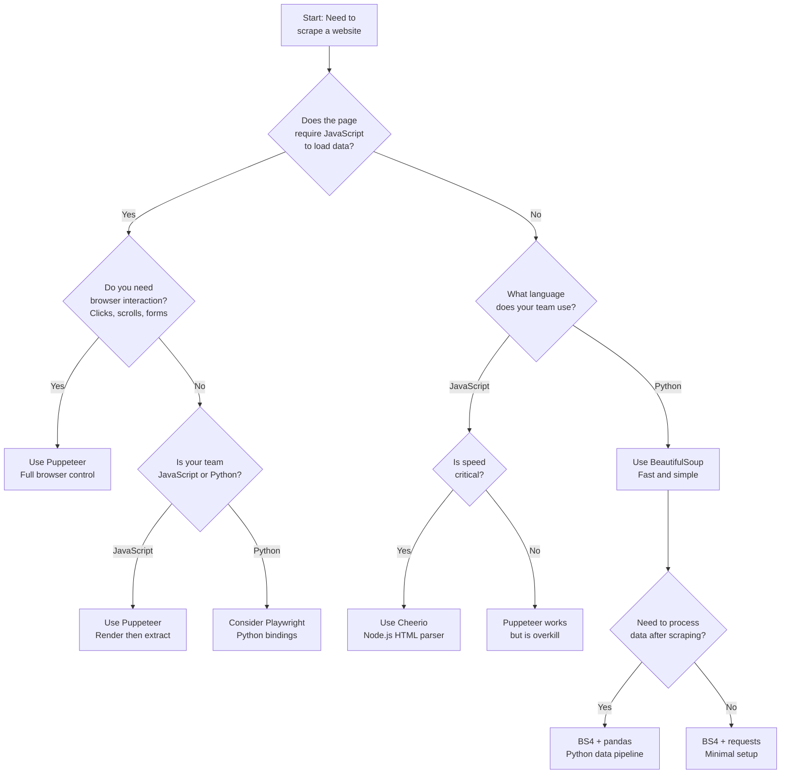

Comparing Puppeteer to BeautifulSoup is like comparing a forklift to a hand saw. They are different tools, written in different languages, solving different problems at different layers of the stack. Puppeteer is a Node.js library that launches and controls a headless Chrome browser. BeautifulSoup is a Python library that parses HTML strings into navigable trees. They do not compete with each other in any technical sense. But developers asking "Puppeteer vs BeautifulSoup" are really asking a deeper question: should I use a browser-based JavaScript approach or a lightweight Python parsing approach? That is the question this post answers.

The answer depends on the target site, the data you need, the language your team works in, and how much infrastructure you are willing to maintain. Both approaches have clear strengths and equally clear limitations.

## The JavaScript Approach: Puppeteer

Puppeteer is Google's official Node.js library for controlling Chrome and Chromium browsers via the DevTools Protocol. For a head-to-head with Selenium, see our [Selenium vs Puppeteer definitive comparison](/posts/selenium-vs-puppeteer-definitive-comparison-web-scraping/). When you use Puppeteer, you are launching a real browser instance. That browser fetches pages, executes JavaScript, renders the DOM, loads images, fires network requests -- everything a human's browser does.

Here is a minimal Puppeteer script that navigates to a page and extracts text:

```javascript
const puppeteer = require('puppeteer');

(async () => {
  const browser = await puppeteer.launch({ headless: true });
  const page = await browser.newPage();

  await page.goto('https://example.com/products', {
    waitUntil: 'networkidle2'
  });

  const titles = await page.evaluate(() => {
    const elements = document.querySelectorAll('h2.product-title');
    return Array.from(elements).map(el => el.textContent.trim());
  });

  console.log(titles);
  await browser.close();
})();
```

Several things happen here that do not happen with BeautifulSoup:

1. A Chromium process starts in the background
2. The page fully renders, including all JavaScript execution
3. Network requests for API data, images, and scripts all complete
4. The DOM is queried using the browser's native `querySelectorAll`

This means Puppeteer can scrape pages that BeautifulSoup cannot even see -- single-page applications, React dashboards, pages that load data from APIs after the initial HTML loads.

### Key Puppeteer Methods

The Puppeteer API is built around the `Browser` and `Page` objects:

```javascript
// Launch browser
const browser = await puppeteer.launch({ headless: true });
const page = await browser.newPage();

// Navigate
await page.goto('https://example.com');

// Wait for specific elements
await page.waitForSelector('.product-list');

// Extract data using DOM APIs inside the browser context
const data = await page.evaluate(() => {
  return document.querySelector('.price').textContent;
});

// Take a screenshot
await page.screenshot({ path: 'page.png', fullPage: true });

// Click elements
await page.click('button.load-more');

// Type into inputs
await page.type('#search-box', 'web scraping');

// Get page HTML (for hybrid approaches)
const html = await page.content();

await browser.close();
```

The `page.evaluate()` method is where most extraction happens. You pass a function that runs inside the browser context, with full access to the DOM, `document`, `window`, and any JavaScript the page has loaded.

## The Python Approach: BeautifulSoup

BeautifulSoup (BS4) is a Python library that parses HTML and XML markup into a tree structure you can search and navigate. It does not fetch pages. It does not run JavaScript. It does not launch a browser. You give it an HTML string, and it gives you methods to find elements.

The typical BS4 workflow pairs it with the `requests` library for fetching:

```python
import requests
from bs4 import BeautifulSoup

response = requests.get("https://example.com/products")
soup = BeautifulSoup(response.text, "html.parser")

titles = soup.select("h2.product-title")
for title in titles:
    print(title.get_text(strip=True))
```

This is dramatically simpler than the Puppeteer equivalent. No browser launches. No waiting for JavaScript. No managing Chromium processes. You send an HTTP request, parse the response, and extract what you need.

### Key BS4 Methods

The API is small, consistent, and focused entirely on parsing:

```python
from bs4 import BeautifulSoup

soup = BeautifulSoup(html_string, "html.parser")

# CSS selectors
elements = soup.select("div.product > span.price")

# Find first match
link = soup.find("a", {"class": "next-page"})

# Find all matches
rows = soup.find_all("tr", class_="data-row")

# Extract text
text = element.get_text(strip=True)

# Extract attributes
href = element.get("href")
data_id = element["data-id"]

# Navigate the tree
parent = element.parent
siblings = element.find_next_siblings("div")

# Parse different markup
soup_xml = BeautifulSoup(xml_string, "lxml-xml")
soup_lxml = BeautifulSoup(html_string, "lxml")
```

BS4 supports multiple parsers. The built-in `html.parser` works without extra dependencies. The `lxml` parser is faster. The `html5lib` parser handles broken HTML more forgivingly. All of them produce the same navigable tree.

## When to Use Puppeteer

Puppeteer is the right choice when the target requires a real browser. These scenarios include:

**JavaScript-rendered content.** If the page is a React, Vue, or Angular application, the initial HTML will be mostly empty divs and script tags. BeautifulSoup would parse that empty shell and find nothing. Puppeteer renders the full page and gives you the complete DOM.

```javascript
// React app -- initial HTML has no data
// Puppeteer waits for JS to render, then extracts
await page.goto('https://spa-example.com/dashboard');
await page.waitForSelector('.data-table tbody tr');

const rows = await page.evaluate(() => {
  return Array.from(document.querySelectorAll('.data-table tbody tr')).map(row => ({
    name: row.cells[0].textContent.trim(),
    value: row.cells[1].textContent.trim()
  }));
});
```

**Browser interaction required.** Some data is only accessible after clicking buttons, scrolling infinite lists, submitting forms, or navigating through multi-step flows. Puppeteer can simulate all of these actions.

```javascript
// Infinite scroll -- load more content by scrolling
async function scrollToBottom(page) {
  let previousHeight = 0;
  while (true) {
    const currentHeight = await page.evaluate('document.body.scrollHeight');
    if (currentHeight === previousHeight) break;
    previousHeight = currentHeight;
    await page.evaluate('window.scrollTo(0, document.body.scrollHeight)');
    await new Promise(resolve => setTimeout(resolve, 2000));
  }
}

await page.goto('https://example.com/feed');
await scrollToBottom(page);
```

**Screenshots and visual testing.** Puppeteer can take full-page screenshots, generate PDFs, and capture specific elements visually. BS4 has no concept of visual rendering.

**Your team works in Node.js.** If your data pipeline, backend, and tooling are all JavaScript, Puppeteer fits naturally into the stack without introducing a second language.

## When to Use BeautifulSoup

BeautifulSoup is the right choice when the data is in the raw HTML and you do not need browser interaction. These scenarios include:

**Static HTML pages.** Traditional server-rendered pages deliver all their content in the initial HTML response. News articles, blog posts, documentation sites, government data portals -- these are BS4 territory.

```python
import requests
from bs4 import BeautifulSoup

response = requests.get("https://news-site.com/articles")
soup = BeautifulSoup(response.text, "html.parser")

articles = []
for card in soup.select("div.article-card"):
    articles.append({
        "title": card.select_one("h3").get_text(strip=True),
        "url": card.select_one("a")["href"],
        "date": card.select_one("time")["datetime"],
        "summary": card.select_one("p.summary").get_text(strip=True)
    })
```

**Speed matters.** BS4 with `requests` is orders of magnitude faster than Puppeteer. No browser startup. No JavaScript execution. No rendering pipeline. A simple HTTP request and string parsing is all that happens.

**Simple extraction tasks.** If you need to pull links, text, or attributes from straightforward HTML, BS4's API is more concise and readable than Puppeteer's `page.evaluate()` pattern.

**Your team works in Python.** If your data processing uses pandas, your ML pipeline uses scikit-learn, and your backend is Django or Flask, BS4 keeps everything in one language.

**Resource-constrained environments.** BS4 uses negligible memory and CPU. Puppeteer launches a Chromium process that consumes hundreds of megabytes of RAM per instance.


<figure>
  
  <figcaption>Headless browsers opened a new chapter in web automation. <span class="img-credit">Photo by Bibek ghosh / <a href="https://www.pexels.com" target="_blank" rel="noopener noreferrer">Pexels</a></span></figcaption>
</figure>

## Code Comparison: Extracting Links

Here is the same task -- extracting all article links from a page -- in both tools. This makes the ergonomic differences concrete.

**Puppeteer (JavaScript):**

```javascript
const puppeteer = require('puppeteer');

(async () => {
  const browser = await puppeteer.launch({ headless: true });
  const page = await browser.newPage();
  await page.goto('https://example.com/blog');

  const links = await page.evaluate(() => {
    return Array.from(document.querySelectorAll('a.article-link')).map(a => ({
      text: a.textContent.trim(),
      href: a.href
    }));
  });

  console.log(JSON.stringify(links, null, 2));
  await browser.close();
})();
```

**BeautifulSoup (Python):**

```python
import requests
from bs4 import BeautifulSoup
import json

response = requests.get("https://example.com/blog")
soup = BeautifulSoup(response.text, "html.parser")

links = [
    {"text": a.get_text(strip=True), "href": a["href"]}
    for a in soup.select("a.article-link")
]

print(json.dumps(links, indent=2))
```

For this particular task on a static page, the BS4 version is shorter, faster, and uses a fraction of the resources. But if that blog page loads articles via a JavaScript API call after the initial page load, the BS4 version returns an empty list while the Puppeteer version returns the actual data.

## Ecosystem Comparison

These two tools live in entirely different ecosystems, which affects everything from installation to deployment.

### Puppeteer's Ecosystem (Node.js)

```bash
# Install
npm install puppeteer

# Puppeteer downloads a compatible Chromium binary automatically
# Total disk footprint: ~300-400 MB
```

Puppeteer integrates naturally with:

- **Express / Fastify** for building scraping APIs
- **Cheerio** for fast HTML parsing when you already have the rendered HTML
- **puppeteer-extra** and **puppeteer-extra-plugin-stealth** for anti-detection
- **p-queue** or **async** for concurrency management
- **TypeScript** for type safety across large scraping projects

A common pattern is to use Puppeteer to render the page, then pass the HTML to Cheerio (a Node.js HTML parser similar to BS4) for extraction:

```javascript
const puppeteer = require('puppeteer');
const cheerio = require('cheerio');

const browser = await puppeteer.launch({ headless: true });
const page = await browser.newPage();
await page.goto('https://spa-example.com/data');
await page.waitForSelector('.content-loaded');

// Get rendered HTML, parse with Cheerio
const html = await page.content();
const $ = cheerio.load(html);

const items = [];
$('.product-card').each((i, el) => {
  items.push({
    name: $(el).find('.name').text().trim(),
    price: $(el).find('.price').text().trim()
  });
});

await browser.close();
```

### BeautifulSoup's Ecosystem (Python)

```bash
# Install
pip install beautifulsoup4 requests lxml

# Total disk footprint: ~10-20 MB
```

BS4 integrates naturally with:

- **requests** for HTTP fetching
- **lxml** for fast parsing
- **Scrapy** for large-scale crawling
- **pandas** for data manipulation after extraction
- **SQLAlchemy** for database storage
- **aiohttp** + **asyncio** for concurrent requests

```python
import requests
from bs4 import BeautifulSoup
import pandas as pd

response = requests.get("https://example.com/products")
soup = BeautifulSoup(response.text, "lxml")

products = [
    {
        "name": card.select_one(".name").get_text(strip=True),
        "price": card.select_one(".price").get_text(strip=True),
        "url": card.select_one("a")["href"]
    }
    for card in soup.select(".product-card")
]

df = pd.DataFrame(products)
df.to_csv("products.csv", index=False)
```

The Python ecosystem has a significant advantage for data processing after scraping. pandas, numpy, and the entire scientific Python stack are right there.

## Performance Comparison

The performance gap between these two approaches is not subtle. It is enormous.

### Startup Time

| Metric | Puppeteer | BS4 + requests |
|--------|-----------|----------------|
| Browser launch | 500-2000 ms | N/A |
| First page load | 1000-5000 ms | 200-800 ms |
| Per-page overhead | 500-3000 ms | 50-200 ms |
| Memory per instance | 200-500 MB | 10-50 MB |

### Throughput on Static Pages

For static pages where both tools produce the same result, BS4 dominates:

```python
# BS4: scrape 100 static pages
import requests
from bs4 import BeautifulSoup
import time

urls = [f"https://example.com/page/{i}" for i in range(100)]

start = time.time()
for url in urls:
    response = requests.get(url)
    soup = BeautifulSoup(response.text, "html.parser")
    titles = [t.get_text() for t in soup.select("h2")]
elapsed = time.time() - start
# Typical result: 15-30 seconds
```

```javascript
// Puppeteer: scrape 100 static pages
const puppeteer = require('puppeteer');

const urls = Array.from({length: 100}, (_, i) =>
  `https://example.com/page/${i}`
);

const start = Date.now();
const browser = await puppeteer.launch({ headless: true });
const page = await browser.newPage();

for (const url of urls) {
  await page.goto(url, { waitUntil: 'networkidle2' });
  const titles = await page.evaluate(() =>
    Array.from(document.querySelectorAll('h2')).map(h => h.textContent)
  );
}

await browser.close();
const elapsed = (Date.now() - start) / 1000;
// Typical result: 120-300 seconds
```

On static pages, BS4 is typically 5-10x faster. The browser overhead -- launching Chromium, rendering CSS, executing JavaScript that the page does not need -- is pure waste when the data is already in the HTML. Our [Python requests vs Selenium speed comparison](/posts/python-requests-vs-selenium-speed-performance-comparison/) quantifies this gap in more detail.

### Where Puppeteer Is Faster

Puppeteer "wins" on performance when the alternative is not possible. If the data only exists after JavaScript runs, BS4's speed is irrelevant because it cannot access the data at all. Speed comparisons only matter when both tools can do the job.


<figure>
  
  <figcaption>Node.js gave browser automation a native home in JavaScript. <span class="img-credit">Photo by Daniil Komov / <a href="https://www.pexels.com" target="_blank" rel="noopener noreferrer">Pexels</a></span></figcaption>
</figure>

## Complexity Comparison

### Parsing Complexity

For pure HTML parsing tasks, BS4 is simpler in every way:

```python
# BS4: find all links in a specific section
links = soup.select("nav.sidebar a[href^='/docs']")
```

```javascript
// Puppeteer: same task
const links = await page.evaluate(() => {
  return Array.from(
    document.querySelectorAll("nav.sidebar a[href^='/docs']")
  ).map(a => ({ text: a.textContent.trim(), href: a.href }));
});
```

The Puppeteer version requires wrapping everything in `page.evaluate()`, converting NodeLists to arrays, and handling the serialization boundary between the browser context and Node.js.

### Interaction Complexity

For browser interaction, Puppeteer is purpose-built and BS4 simply cannot participate:

```javascript
// Login, navigate, extract data behind auth
const page = await browser.newPage();
await page.goto('https://example.com/login');
await page.type('#username', 'user@example.com');
await page.type('#password', 'secret');
await page.click('#login-button');
await page.waitForNavigation();

// Now scrape authenticated content
await page.goto('https://example.com/dashboard');
const data = await page.evaluate(() => {
  return document.querySelector('.private-data').textContent;
});
```

BS4 cannot click buttons, fill forms, or maintain browser sessions. You can use `requests.Session()` to maintain cookies for simple cookie-based auth, but anything requiring JavaScript interaction is beyond its reach.

## Can You Combine Them?

Not directly. Puppeteer runs in Node.js. BeautifulSoup runs in Python. They cannot share objects or call each other's functions. But you can build pipelines that use both.

### Pipeline Approach: Puppeteer Renders, Python Processes

The most practical pattern is using Puppeteer to render JavaScript-heavy pages and save the HTML or extracted data, then processing it with Python tools:

```javascript
// Step 1: Node.js script renders pages and saves HTML
const puppeteer = require('puppeteer');
const fs = require('fs');

(async () => {
  const browser = await puppeteer.launch({ headless: true });
  const page = await browser.newPage();
  await page.goto('https://spa-example.com/data');
  await page.waitForSelector('.content-loaded');

  const html = await page.content();
  fs.writeFileSync('rendered-page.html', html);

  await browser.close();
})();
```

```python
# Step 2: Python script parses the rendered HTML
from bs4 import BeautifulSoup
import pandas as pd

with open("rendered-page.html") as f:
    soup = BeautifulSoup(f.read(), "lxml")

data = [
    {
        "name": row.select_one(".name").get_text(strip=True),
        "value": row.select_one(".value").get_text(strip=True)
    }
    for row in soup.select("tr.data-row")
]

df = pd.DataFrame(data)
df.to_csv("extracted-data.csv", index=False)
```

### JSON Handoff

A cleaner approach is to have Puppeteer extract data directly to JSON, which Python then consumes:

```javascript
// render-and-extract.js
const puppeteer = require('puppeteer');
const fs = require('fs');

(async () => {
  const browser = await puppeteer.launch({ headless: true });
  const page = await browser.newPage();
  await page.goto('https://spa-example.com/products');
  await page.waitForSelector('.product-grid');

  const products = await page.evaluate(() => {
    return Array.from(document.querySelectorAll('.product-card')).map(card => ({
      name: card.querySelector('.name')?.textContent.trim(),
      price: card.querySelector('.price')?.textContent.trim(),
      sku: card.dataset.sku
    }));
  });

  fs.writeFileSync('products.json', JSON.stringify(products, null, 2));
  await browser.close();
})();
```

```python
# process-data.py
import json
import pandas as pd

with open("products.json") as f:
    products = json.load(f)

df = pd.DataFrame(products)
df["price"] = df["price"].str.replace("$", "").astype(float)
df_filtered = df[df["price"] < 50.00]
df_filtered.to_csv("affordable-products.csv", index=False)
```

Orchestrate both with a shell script or task runner:

```bash
#!/bin/bash
node render-and-extract.js && python process-data.py
```

## Decision Flowchart

Use this flowchart to decide which tool fits your situation:



## Alternatives That Bridge the Gap

The Puppeteer-vs-BS4 debate has a false premise: that you must choose between JavaScript browser automation and Python HTML parsing. Several tools bridge this gap.

### Playwright (Python Bindings)

Playwright is Microsoft's browser automation library. Unlike Puppeteer, which is JavaScript-only, Playwright has official Python bindings. This gives you browser rendering and interaction with Python's data processing ecosystem:

```python
from playwright.sync_api import sync_playwright
from bs4 import BeautifulSoup
import pandas as pd

with sync_playwright() as p:
    browser = p.chromium.launch(headless=True)
    page = browser.new_page()
    page.goto("https://spa-example.com/products")
    page.wait_for_selector(".product-grid")

    # Get rendered HTML, then parse with BS4
    html = page.content()
    browser.close()

soup = BeautifulSoup(html, "lxml")
products = [
    {
        "name": card.select_one(".name").get_text(strip=True),
        "price": card.select_one(".price").get_text(strip=True)
    }
    for card in soup.select(".product-card")
]

df = pd.DataFrame(products)
```

Playwright for Python is the most direct answer to "I need Puppeteer but I work in Python." For a full breakdown of all the major tools, see our [Playwright vs Puppeteer vs Selenium vs Scrapy mega comparison](/posts/playwright-vs-puppeteer-vs-selenium-vs-scrapy-2026-mega-comparison/). It renders JavaScript, supports browser interaction, and integrates with BS4 for parsing and pandas for processing.

### Selenium (Python + Browser)

Selenium is the oldest browser automation tool and has mature Python bindings. It is slower and more verbose than Playwright, but it supports all major browsers and has the largest community:

```python
from selenium import webdriver
from selenium.webdriver.common.by import By
from selenium.webdriver.support.ui import WebDriverWait
from selenium.webdriver.support import expected_conditions as EC

driver = webdriver.Chrome()
driver.get("https://spa-example.com/products")

WebDriverWait(driver, 10).until(
    EC.presence_of_element_located((By.CSS_SELECTOR, ".product-grid"))
)

cards = driver.find_elements(By.CSS_SELECTOR, ".product-card")
products = [
    {
        "name": card.find_element(By.CSS_SELECTOR, ".name").text,
        "price": card.find_element(By.CSS_SELECTOR, ".price").text
    }
    for card in cards
]

driver.quit()
```

### Cheerio (Node.js HTML Parser)

If you are in the JavaScript ecosystem but the target page is static, Cheerio is the BS4 equivalent for Node.js. It parses HTML without launching a browser:

```javascript
const axios = require('axios');
const cheerio = require('cheerio');

const { data: html } = await axios.get('https://example.com/blog');
const $ = cheerio.load(html);

const articles = [];
$('.article-card').each((i, el) => {
  articles.push({
    title: $(el).find('h3').text().trim(),
    url: $(el).find('a').attr('href')
  });
});
```

Cheerio is to Node.js what BeautifulSoup is to Python -- a fast, lightweight HTML parser with no browser overhead.

## Summary

| Factor | Puppeteer | BeautifulSoup |
|--------|-----------|---------------|
| Language | JavaScript (Node.js) | Python |
| Type | Browser automation | HTML parser |
| JavaScript rendering | Yes | No |
| Speed (static pages) | Slow | Fast |
| Memory usage | High (200-500 MB) | Low (10-50 MB) |
| Browser interaction | Full support | None |
| Screenshots / PDF | Yes | No |
| Learning curve | Moderate | Low |
| Installation size | ~400 MB | ~20 MB |
| Best for | Dynamic JS sites | Static HTML sites |

If neither Puppeteer nor BeautifulSoup fits your workflow, explore the [top Puppeteer alternatives](/posts/top-puppeteer-alternatives-what-to-use-instead/) for other browser-driven options, or consider an [LLM-based structured data extraction approach](/posts/best-llm-structured-data-extraction-html-2026/) that can parse messy HTML automatically. The choice is not really Puppeteer vs BeautifulSoup. It is "does my target require a browser?" If yes, use a browser tool -- Puppeteer for JavaScript teams, Playwright for Python teams. If no, use a parser -- BeautifulSoup for Python teams, Cheerio for JavaScript teams. Match the tool to the problem, then match the language to your team.
