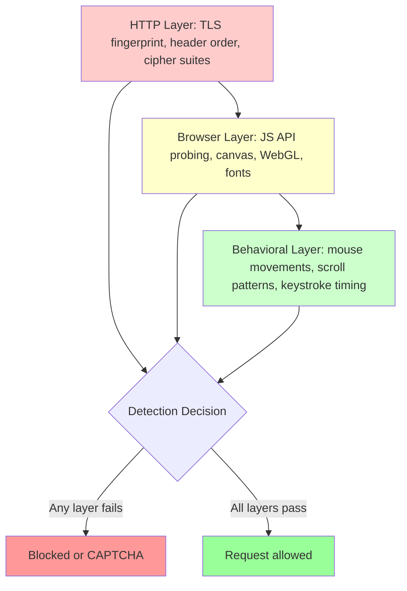
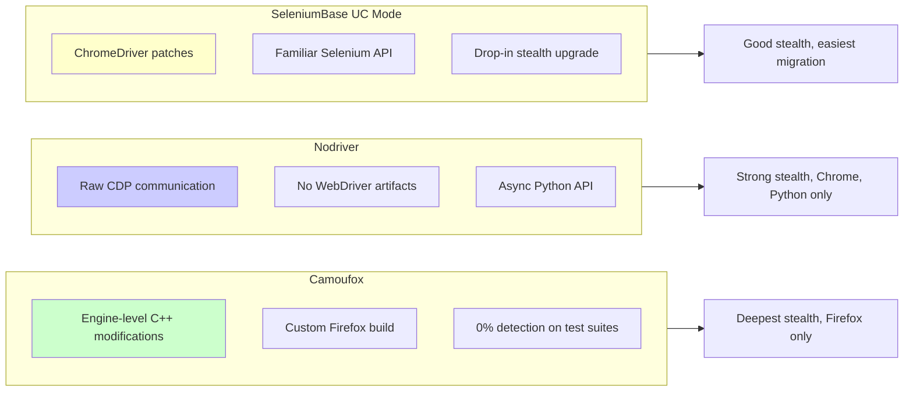
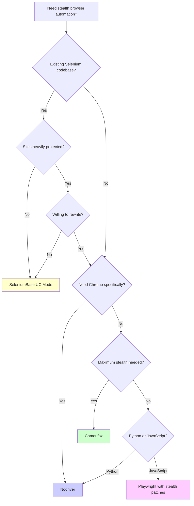

The gap between bot detection systems and stealth browsers has never been narrower. Over the past year, anti-bot vendors like Cloudflare, DataDome, and Akamai have rolled out detection layers that go far beyond checking `navigator.webdriver`. They now scrutinize TLS handshakes, probe dozens of JavaScript APIs for inconsistencies, and analyze whether mouse movements look human or robotic. The old tricks no longer work.

On the other side, a new generation of stealth browsers has risen to meet the challenge. Camoufox rewrites Firefox at the C++ engine level. Nodriver communicates with Chrome through raw DevTools Protocol with zero automation fingerprints. SeleniumBase UC Mode layers stealth patches onto Selenium for teams that cannot afford a full rewrite. And puppeteer-stealth, once a popular option, was discontinued in February 2025, leaving a gap that these tools are now filling.

This post covers how each framework approaches stealth, what detection systems they defeat, and how to choose the right one for your project.

## The Three Layers of Bot Detection

Before looking at stealth tools, you need to understand what you are defending against. Modern anti-bot systems do not rely on a single check. They stack multiple detection layers, and your browser must pass every one.



### HTTP Layer

This is the first wall. Before your browser even renders a page, the server inspects the TLS handshake. Every browser has a distinctive TLS fingerprint based on its cipher suites, extensions, and negotiation order. A standard Python `requests` library has a completely different TLS fingerprint than Chrome, and detection systems like Cloudflare flag this using tools based on JA3 and JA4 hashing. Header order also matters: Chrome sends headers in a specific sequence, and deviating from that sequence raises a red flag.

### Browser Layer

Once past the HTTP layer, JavaScript-based probes kick in. Detection scripts check properties like `navigator.webdriver`, `navigator.plugins`, `navigator.languages`, and the presence of `window.chrome`. They render invisible canvases and compare the output to known browser signatures. They enumerate installed fonts, probe WebGL renderer strings, and measure screen dimensions against reported viewport sizes. Any inconsistency between what your browser claims to be and how it actually behaves triggers a flag.

### Behavioral Layer

The most advanced layer examines how you interact with the page. Real humans produce mouse movements with natural acceleration curves and micro-jitters. They scroll at variable speeds. They pause before clicking. They type with inconsistent intervals between keystrokes. Automated tools that teleport the cursor, click instantly, or type at perfectly uniform intervals fail this layer.

## Camoufox: Engine-Level Stealth

Camoufox takes the most radical approach to stealth of any tool available. Rather than patching JavaScript properties or wrapping an existing browser, Camoufox modifies Firefox at the C++ source code level. Detection scripts cannot discover inconsistencies between JavaScript-level patches and the underlying engine behavior, because there are no patches to find. The engine itself behaves differently.

### How It Works

Camoufox compiles a custom build of Firefox with deep hooks into the rendering engine, the fingerprint generation code, and the automation detection paths. When a detection script queries canvas fingerprints, WebGL renderer strings, or font metrics, the responses come from the engine itself rather than from JavaScript overrides that can be detected.

In testing against major anti-bot test suites, Camoufox achieves 0% detection scores --- none of the standard fingerprinting checks flag it as automated.

### Setting Up Camoufox

```python
# Install: pip install camoufox[geoip]
# On first run, Camoufox downloads its custom Firefox build

from camoufox.sync_api import Camoufox

# Basic setup with automatic fingerprint generation
with Camoufox(headless=True) as browser:
    page = browser.new_page()
    page.goto("https://example.com")

    # Scrape as if you were a normal Firefox user
    title = page.title()
    content = page.query_selector("body").inner_text()
    print(f"Title: {title}")
    print(f"Content length: {len(content)} characters")
```

```python
# Advanced Camoufox configuration with custom fingerprint
from camoufox.sync_api import Camoufox

with Camoufox(
    headless=True,
    os="windows",            # Spoof the operating system
    humanize=True,           # Add human-like behavioral patterns
    geoip=True,              # Match geolocation to your IP address
    screen={"width": 1920, "height": 1080},
) as browser:
    page = browser.new_page()
    page.goto("https://nowsecure.nl")

    # Check detection results
    page.wait_for_timeout(5000)
    result_text = page.query_selector("body").inner_text()
    print(result_text)
```

```javascript
// Camoufox also exposes a Playwright-compatible API
// You can connect to it from Node.js via its WebSocket endpoint

const { firefox } = require('playwright');

async function connectToCamoufox() {
    // Camoufox exposes a WebSocket endpoint when launched with --ws flag
    const browser = await firefox.connect(
        'ws://localhost:34587/camoufox'
    );

    const page = await browser.newPage();
    await page.goto('https://example.com');

    const title = await page.title();
    console.log(`Page title: ${title}`);

    await browser.close();
}

connectToCamoufox();
```

### When to Use Camoufox

Camoufox is the right choice when targeting sites with the most aggressive detection systems. If Cloudflare's managed challenge or DataDome's bot detection is blocking you and other tools have failed, Camoufox is likely your strongest option. The trade-off is that it runs Firefox rather than Chrome, which may matter if you need Chrome-specific behavior.

## Nodriver: Async Chrome Without the Fingerprints

Nodriver is the successor to the widely-used undetected-chromedriver library. Instead of wrapping Selenium or patching ChromeDriver, Nodriver communicates directly with Chrome through the raw Chrome DevTools Protocol. There is no Selenium dependency, no ChromeDriver binary, and no `navigator.webdriver` flag.

### How It Works

Standard browser automation tools like Selenium inject a WebDriver binary that communicates with Chrome through a well-defined protocol. Anti-bot systems detect this by checking for the `navigator.webdriver` property, the presence of `cdc_` variables in the DOM, and other artifacts left by ChromeDriver. Nodriver avoids all of this by speaking CDP directly, launching Chrome as a normal user process rather than a WebDriver-controlled instance.

The library is fully asynchronous, built on Python's `asyncio` from the ground up, making it well-suited for high-concurrency scraping where you need dozens of pages open at once.

```python
# Install: pip install nodriver

import nodriver as uc
import asyncio

async def scrape_with_nodriver():
    # Launch Chrome with no automation artifacts
    browser = await uc.start(
        headless=False,
        browser_args=[
            '--disable-gpu',
            '--no-first-run',
        ]
    )

    page = await browser.get("https://example.com")

    # Wait for content to load
    await page.sleep(2)

    # Extract data using CSS selectors
    heading = await page.select("h1")
    if heading:
        text = await heading.get_text()
        print(f"Heading: {text}")

    # Evaluate JavaScript directly
    user_agent = await page.evaluate("navigator.userAgent")
    webdriver_flag = await page.evaluate("navigator.webdriver")
    print(f"User Agent: {user_agent}")
    print(f"Webdriver flag: {webdriver_flag}")  # Should be False or undefined

    browser.stop()

asyncio.run(scrape_with_nodriver())
```

```python
# Nodriver with multiple concurrent pages
import nodriver as uc
import asyncio

async def scrape_page(browser, url):
    page = await browser.get(url, new_tab=True)
    await page.sleep(2)

    title_el = await page.select("title")
    title = await title_el.get_text() if title_el else "No title"

    await page.close()
    return {"url": url, "title": title}

async def concurrent_scrape():
    browser = await uc.start()

    urls = [
        "https://example.com",
        "https://httpbin.org/headers",
        "https://www.whatismybrowser.com",
    ]

    tasks = [scrape_page(browser, url) for url in urls]
    results = await asyncio.gather(*tasks)

    for result in results:
        print(f"{result['url']}: {result['title']}")

    browser.stop()

asyncio.run(concurrent_scrape())
```

### When to Use Nodriver

Nodriver is the best choice for Python developers who need Chrome-based stealth with a clean, modern API. Its async-first design makes it strong for scraping at scale. However, it is Python-only, and it does not modify Chrome's fingerprinting at the engine level the way Camoufox modifies Firefox. For the most heavily protected sites, combining Nodriver with additional fingerprint spoofing techniques may be necessary.

## SeleniumBase UC Mode: Stealth for Existing Codebases

If your team has an existing Selenium codebase and cannot justify a full rewrite, SeleniumBase's Undetected ChromeDriver (UC) mode offers a pragmatic middle ground. It patches Selenium's ChromeDriver to remove the most common detection artifacts while preserving the familiar Selenium API.

```python
# Install: pip install seleniumbase

from seleniumbase import SB

# UC mode handles stealth patches automatically
with SB(uc=True, headless=True) as sb:
    sb.open("https://nowsecure.nl")
    sb.sleep(3)

    # Use the familiar Selenium-style API
    if sb.is_text_visible("passed", "body"):
        print("Detection test passed")
    else:
        print("Detection test failed")

    # Standard Selenium operations work as expected
    sb.open("https://example.com")
    heading = sb.get_text("h1")
    print(f"Heading: {heading}")
```

```javascript
// For JavaScript teams, undetected-chromedriver is a similar approach
// though the Node.js ecosystem increasingly favors Playwright-based solutions

const { Builder } = require('selenium-webdriver');
const chrome = require('selenium-webdriver/chrome');

async function stealthSelenium() {
    const options = new chrome.Options();
    options.addArguments(
        '--disable-blink-features=AutomationControlled',
        '--disable-dev-shm-usage',
        '--no-first-run',
        '--no-default-browser-check'
    );

    // Remove navigator.webdriver via CDP
    const driver = await new Builder()
        .forBrowser('chrome')
        .setChromeOptions(options)
        .build();

    // Execute CDP command to remove webdriver flag
    await driver.executeCdpCommand(
        'Page.addScriptToEvaluateOnNewDocument',
        {
            source: `
                Object.defineProperty(navigator, 'webdriver', {
                    get: () => undefined
                });
            `
        }
    );

    await driver.get('https://example.com');
    const title = await driver.getTitle();
    console.log(`Title: ${title}`);

    await driver.quit();
}

stealthSelenium();
```

### When to Use SeleniumBase UC Mode

UC Mode is best for teams migrating from Selenium who need improved stealth without rewriting their automation logic. It will not match Camoufox or Nodriver against the most aggressive detection systems, but it handles a wide range of medium-security sites and is the easiest to adopt.

## Comparing the Three Approaches

Each framework attacks the detection problem at a different level.



On detection evasion depth, Camoufox operates at the deepest level by modifying the browser engine itself. Nodriver works at the protocol level, avoiding automation artifacts entirely. SeleniumBase UC Mode works at the application level, patching over detectable markers.

On ease of adoption, SeleniumBase UC Mode wins for teams with existing Selenium code. Nodriver is straightforward for any Python developer starting fresh. Camoufox requires learning its Playwright-compatible API but is well-documented.

On performance, Nodriver's async architecture gives it an edge for high-concurrency workloads. Camoufox and SeleniumBase are both capable but not async-first.

On browser support, Camoufox uses Firefox while Nodriver and SeleniumBase UC Mode use Chrome. If you need a specific browser, this narrows the choice immediately.

## Choosing the Right Framework

The decision often comes down to your threat model and existing codebase.



## The Fingerprint Verification Test

Regardless of which framework you choose, verify your stealth configuration by checking what detection scripts actually see. Here is a practical way to audit your browser's fingerprint.

```python
# Fingerprint audit script - run with any stealth browser
# This checks the same properties that anti-bot systems probe

FINGERPRINT_CHECKS = """
(() => {
    const results = {};

    // Automation flags
    results.webdriver = navigator.webdriver;
    results.automationControlled = navigator.domAutomationController !== undefined;
    results.selenium = document.documentElement.getAttribute('webdriver') !== null;

    // Browser identity
    results.userAgent = navigator.userAgent;
    results.platform = navigator.platform;
    results.languages = navigator.languages;
    results.pluginCount = navigator.plugins.length;

    // Canvas fingerprint
    const canvas = document.createElement('canvas');
    const ctx = canvas.getContext('2d');
    ctx.textBaseline = 'top';
    ctx.font = '14px Arial';
    ctx.fillText('fingerprint test', 2, 2);
    results.canvasHash = canvas.toDataURL().slice(-50);

    // WebGL renderer
    const gl = canvas.getContext('webgl');
    if (gl) {
        const debugInfo = gl.getExtension('WEBGL_debug_renderer_info');
        results.webglVendor = gl.getParameter(debugInfo.UNMASKED_VENDOR_WEBGL);
        results.webglRenderer = gl.getParameter(debugInfo.UNMASKED_RENDERER_WEBGL);
    }

    // Screen properties
    results.screenWidth = screen.width;
    results.screenHeight = screen.height;
    results.colorDepth = screen.colorDepth;
    results.outerWidth = window.outerWidth;
    results.outerHeight = window.outerHeight;

    return JSON.stringify(results, null, 2);
})()
"""

import nodriver as uc
import asyncio
import json

async def audit_fingerprint():
    browser = await uc.start()
    page = await browser.get("https://example.com")
    await page.sleep(1)

    result = await page.evaluate(FINGERPRINT_CHECKS)
    fingerprint = json.loads(result)

    print("=== Fingerprint Audit ===")
    for key, value in fingerprint.items():
        status = "PASS" if not _is_suspicious(key, value) else "FAIL"
        print(f"  [{status}] {key}: {value}")

    browser.stop()

def _is_suspicious(key, value):
    if key == "webdriver" and value is True:
        return True
    if key == "automationControlled" and value is True:
        return True
    if key == "pluginCount" and value == 0:
        return True
    if key == "outerHeight" and value == 0:
        return True
    return False

asyncio.run(audit_fingerprint())
```

## The Arms Race Never Ends

One pattern holds consistent in the stealth browser space: every major detection bypass is eventually countered, and every new detection method eventually gets bypassed. Cloudflare rolls out a new JavaScript challenge, and within weeks the stealth browser maintainers adapt. DataDome adds a new behavioral heuristic, and framework authors respond with more realistic mouse simulation.

This is not a problem you solve once. It is a continuous investment. Whichever framework you choose, you need to stay current with updates and monitor your success rates. A stealth configuration that works perfectly today may start failing in a month as detection systems update their models.

The open-source stealth browser community is more active than ever. Camoufox, Nodriver, and SeleniumBase are all under active development with responsive maintainers. The community shares detection bypass techniques, test results, and configuration tips openly.

On the detection side, anti-bot vendors are investing heavily too. They are incorporating machine learning models that analyze behavioral patterns across millions of requests, correlating TLS fingerprints with JavaScript fingerprints with behavioral signals to build holistic risk scores. Simple property spoofing is no longer enough on its own.

## Practical Recommendations

For a new stealth project starting today:

- Start with Nodriver if you work in Python and target Chrome. Its clean async API and strong default stealth will handle most sites.
- Escalate to Camoufox when you hit detection walls that Nodriver cannot bypass. The engine-level approach is currently the strongest available.
- Use SeleniumBase UC Mode if you have existing Selenium code and your targets are not using the most aggressive detection.
- Always test your fingerprint before running at scale. The audit script above catches the most common leaks.
- Monitor and adapt. Set up alerts for increased block rates and update your stealth tools regularly.

The stealth browser space will continue to evolve. The frameworks that survive will be the ones that adapt fastest to new detection methods while keeping their APIs developer-friendly. For now, Camoufox, Nodriver, and SeleniumBase UC Mode cover the strongest options available, each filling a clear niche in the anti-detection ecosystem.
