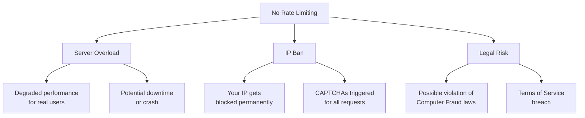
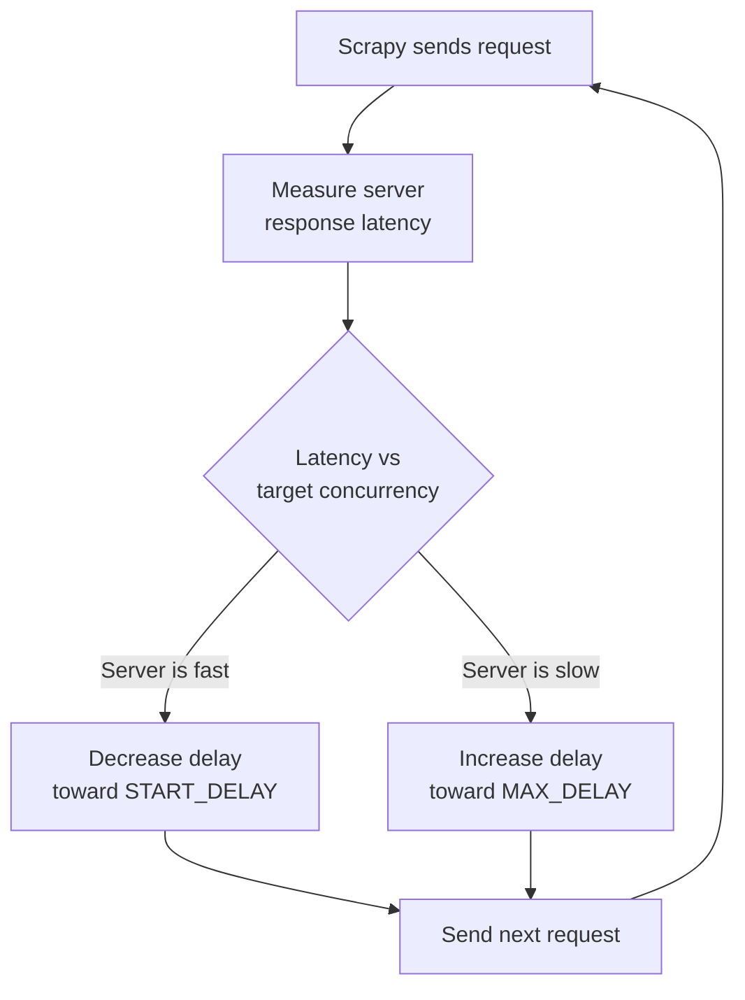
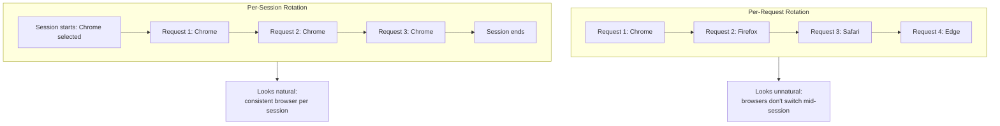
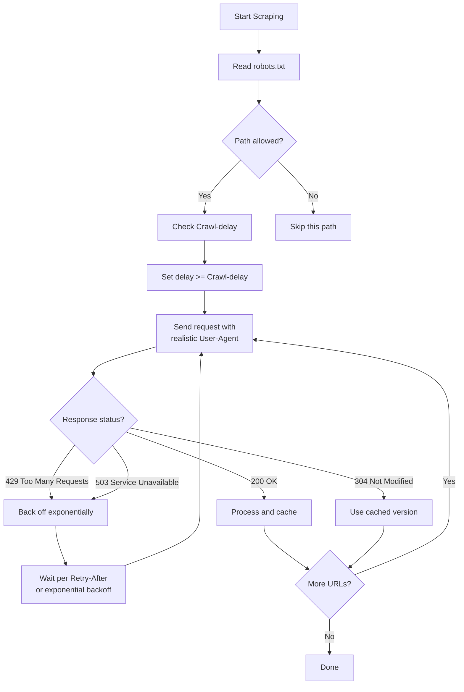

Rate limiting and user-agent management are the two most fundamental aspects of responsible web scraping. Get them wrong and you risk hammering servers, burning through IP addresses, and earning yourself a permanent ban. Get them right and your scraper becomes a polite, sustainable tool that can run for months without incident. This post covers practical implementations in Python -- working code you can drop into your projects today -- along with the reasoning behind each technique and the mistakes you should avoid.

## Why Rate Limiting Matters

Every HTTP request your scraper sends consumes resources on the target server: CPU cycles to process the request, memory to generate the response, bandwidth to deliver it. A single human browsing a site might make one request every few seconds. A scraper with no rate limiting can fire off hundreds of requests per second.

The consequences of skipping rate limiting fall into three categories:



Being a good internet citizen is reason enough. Sites like travel booking platforms take aggressive countermeasures against unthrottled bots, as we discuss in [bypassing anti-bot on travel sites without violating TOS](/posts/bypassing-anti-bot-travel-sites-without-violating-tos/). But even from a purely selfish perspective, rate limiting keeps your scraper running longer and more reliably. A server that returns clean 200 responses at one request per second is far more useful than one that returns 429s and blocks at fifty requests per second.

## Simple Rate Limiting with time.sleep()

The most basic approach is inserting a delay between requests. It is crude but effective for small-scale scrapers.

```python
import time
import requests

urls = [
    "https://example.com/page/1",
    "https://example.com/page/2",
    "https://example.com/page/3",
]

session = requests.Session()

for url in urls:
    response = session.get(url)
    print(f"{response.status_code} - {url}")
    time.sleep(2)  # Wait 2 seconds between requests
```

This works but has a problem: the delay is fixed. If the server is fast, you wait unnecessarily. If the server is struggling, two seconds might not be enough. It also does not account for time spent processing the response -- if your parsing takes a second, the actual gap between requests is three seconds, not two. A better approach is to track `time.monotonic()` around each request and sleep only for the remaining interval. But for real control, you want a proper rate limiter.

## Token Bucket Rate Limiter

For more sophisticated control, a token bucket algorithm lets you set an average rate while allowing short bursts. The bucket holds a fixed number of tokens. Each request consumes one token. Tokens are added at a steady rate. If the bucket is empty, the caller must wait.

```python
import time
import threading


class TokenBucket:
    """
    A thread-safe token bucket rate limiter.

    Args:
        rate: Number of tokens added per second.
        capacity: Maximum number of tokens the bucket can hold.
    """

    def __init__(self, rate: float, capacity: int):
        self.rate = rate
        self.capacity = capacity
        self.tokens = capacity
        self.last_refill = time.monotonic()
        self.lock = threading.Lock()

    def _refill(self):
        now = time.monotonic()
        elapsed = now - self.last_refill
        new_tokens = elapsed * self.rate
        self.tokens = min(self.capacity, self.tokens + new_tokens)
        self.last_refill = now

    def acquire(self, timeout: float = None) -> bool:
        """
        Acquire a token, blocking until one is available.

        Args:
            timeout: Maximum seconds to wait. None means wait forever.

        Returns:
            True if a token was acquired, False if timed out.
        """
        deadline = None if timeout is None else time.monotonic() + timeout

        while True:
            with self.lock:
                self._refill()
                if self.tokens >= 1:
                    self.tokens -= 1
                    return True

                # Calculate wait time for next token
                wait_time = (1 - self.tokens) / self.rate

            if deadline is not None:
                remaining = deadline - time.monotonic()
                if remaining <= 0:
                    return False
                wait_time = min(wait_time, remaining)

            time.sleep(wait_time)
```

Using it with requests:

```python
import requests

# Allow 1 request per second on average, with bursts of up to 5
limiter = TokenBucket(rate=1.0, capacity=5)

session = requests.Session()

def fetch(url: str) -> requests.Response:
    limiter.acquire()
    return session.get(url)

# The first 5 requests fire immediately (burst capacity).
# After that, requests are spaced ~1 second apart.
for i in range(20):
    response = fetch(f"https://example.com/page/{i}")
    print(f"{response.status_code} - page {i}")
```

The token bucket is a good general-purpose limiter because it handles both steady-state throughput and occasional bursts gracefully. You can tune the `rate` and `capacity` parameters independently.


<figure>
  
  <figcaption>Web scraping is the bridge between the visible web and usable data. <span class="img-credit">Photo by Google DeepMind / <a href="https://www.pexels.com" target="_blank" rel="noopener noreferrer">Pexels</a></span></figcaption>
</figure>

## Rate Limiting with a Custom requests Adapter

For projects that use `requests.Session` extensively, you can bake rate limiting directly into the transport layer using a custom `HTTPAdapter`. This way every request through the session is automatically throttled without any changes to calling code.

```python
import time
import threading
import requests
from requests.adapters import HTTPAdapter


class RateLimitedAdapter(HTTPAdapter):
    """
    An HTTP adapter that enforces a minimum delay between requests.
    Thread-safe for use with concurrent futures or threading.
    """

    def __init__(self, requests_per_second: float = 1.0, **kwargs):
        self.min_interval = 1.0 / requests_per_second
        self.last_request_time = 0.0
        self.lock = threading.Lock()
        super().__init__(**kwargs)

    def send(self, request, **kwargs):
        with self.lock:
            now = time.monotonic()
            elapsed = now - self.last_request_time
            wait = self.min_interval - elapsed
            if wait > 0:
                time.sleep(wait)
            self.last_request_time = time.monotonic()

        return super().send(request, **kwargs)


# Usage
session = requests.Session()
adapter = RateLimitedAdapter(requests_per_second=2.0)
session.mount("http://", adapter)
session.mount("https://", adapter)

# Every request through this session is now rate-limited to 2/sec
response = session.get("https://example.com/data")
```

## Rate Limiting in Scrapy

Scrapy has built-in settings for polite crawling. You do not need custom middleware for basic rate limiting -- just configure the right settings. For an async HTTP alternative, [httpx](/posts/web-scraping-httpx-async-http-fast-data-collection/) pairs well with token-bucket limiters when you do not need a full framework.

```python
# settings.py

# Seconds to wait between consecutive requests to the same domain
DOWNLOAD_DELAY = 2

# Maximum concurrent requests across all domains
CONCURRENT_REQUESTS = 8

# Maximum concurrent requests per domain
CONCURRENT_REQUESTS_PER_DOMAIN = 2

# Maximum concurrent requests per IP (overrides per-domain if set)
CONCURRENT_REQUESTS_PER_IP = 2

# Enable AutoThrottle for adaptive rate limiting
AUTOTHROTTLE_ENABLED = True
AUTOTHROTTLE_START_DELAY = 2
AUTOTHROTTLE_MAX_DELAY = 60
AUTOTHROTTLE_TARGET_CONCURRENCY = 1.0

# Show throttling stats in the log for debugging
AUTOTHROTTLE_DEBUG = False
```

Scrapy's `AutoThrottle` extension adjusts the download delay dynamically based on how long the server takes to respond. If the server slows down, AutoThrottle increases the delay. If the server responds quickly, it decreases the delay (down to `AUTOTHROTTLE_START_DELAY`). This is one of Scrapy's strongest features for responsible crawling.




<figure>
  
  <figcaption>The web is vast, but the right tools make it navigable. <span class="img-credit">Photo by Matheus Bertelli / <a href="https://www.pexels.com" target="_blank" rel="noopener noreferrer">Pexels</a></span></figcaption>
</figure>

## Adaptive Rate Limiting: Responding to 429s

A fixed rate is a starting point, but a truly responsible scraper adapts to what the server tells it. HTTP 429 (Too Many Requests) is the server's explicit signal that you are going too fast. A 503 (Service Unavailable) often means the same thing.

Here is an adaptive rate limiter that backs off exponentially on 429s and gradually speeds up when the server is healthy:

```python
import time
import requests


class AdaptiveRateLimiter:
    """
    Adjusts request delay based on server responses.

    Backs off exponentially on 429/503 responses.
    Gradually speeds up after sustained success.
    """

    def __init__(
        self,
        initial_delay: float = 1.0,
        min_delay: float = 0.5,
        max_delay: float = 60.0,
        backoff_factor: float = 2.0,
        recovery_threshold: int = 10,
        recovery_factor: float = 0.9,
    ):
        self.delay = initial_delay
        self.min_delay = min_delay
        self.max_delay = max_delay
        self.backoff_factor = backoff_factor
        self.recovery_threshold = recovery_threshold
        self.recovery_factor = recovery_factor
        self.consecutive_successes = 0

    def wait(self):
        """Sleep for the current delay period."""
        time.sleep(self.delay)

    def on_response(self, status_code: int):
        """
        Adjust rate based on response status.

        Call this after every request with the HTTP status code.
        """
        if status_code in (429, 503):
            # Back off: multiply delay by backoff_factor
            self.delay = min(self.delay * self.backoff_factor, self.max_delay)
            self.consecutive_successes = 0
            retry_msg = f"Rate limited ({status_code}). Delay now {self.delay:.1f}s"
            print(retry_msg)

        elif 200 <= status_code < 400:
            self.consecutive_successes += 1
            # After enough consecutive successes, speed up slightly
            if self.consecutive_successes >= self.recovery_threshold:
                self.delay = max(
                    self.delay * self.recovery_factor, self.min_delay
                )
                self.consecutive_successes = 0

    @property
    def current_delay(self) -> float:
        return self.delay


def scrape_with_adaptive_limiting(urls: list[str]) -> list[requests.Response]:
    limiter = AdaptiveRateLimiter(initial_delay=1.0)
    session = requests.Session()
    responses = []

    for url in urls:
        for attempt in range(3):  # Up to 3 attempts per URL
            limiter.wait()
            response = session.get(url)
            limiter.on_response(response.status_code)

            if response.status_code == 429:
                # Respect Retry-After header if present
                retry_after = response.headers.get("Retry-After")
                if retry_after:
                    try:
                        wait_seconds = int(retry_after)
                        print(f"Retry-After header: waiting {wait_seconds}s")
                        time.sleep(wait_seconds)
                    except ValueError:
                        pass  # Non-integer Retry-After (HTTP date) -- skip
                continue  # Retry the same URL

            responses.append(response)
            break  # Success, move to next URL

    return responses
```

The key insight here is respecting the `Retry-After` header. When a server sends a 429, it often includes this header telling you exactly how long to wait. Ignoring it is both rude and counterproductive.

## User-Agent Rotation

Many websites check the `User-Agent` header and block requests that use default library identifiers like `python-requests/2.31.0`. The [evolution of web scraping detection methods](/posts/evolution-web-scraping-detection-methods-timeline/) shows how these checks have grown more sophisticated over time. This is not paranoia on their part -- it is a simple heuristic to separate human traffic from automated traffic.

User-agent rotation serves two purposes: it prevents your scraper from being trivially identified by a static string, and it makes your traffic pattern look more like a mix of real browsers.

### Maintaining a Realistic UA List

A good user-agent list uses strings from currently shipping browser versions. Outdated user agents are a red flag -- real users update their browsers.

```python
USER_AGENTS = [
    # Chrome 122 on Windows
    "Mozilla/5.0 (Windows NT 10.0; Win64; x64) AppleWebKit/537.36 "
    "(KHTML, like Gecko) Chrome/122.0.0.0 Safari/537.36",
    # Firefox 123 on Windows
    "Mozilla/5.0 (Windows NT 10.0; Win64; x64; rv:123.0) "
    "Gecko/20100101 Firefox/123.0",
    # Safari 17.3 on macOS
    "Mozilla/5.0 (Macintosh; Intel Mac OS X 10_15_7) AppleWebKit/605.1.15 "
    "(KHTML, like Gecko) Version/17.3 Safari/605.1.15",
    # Edge 122 on Windows
    "Mozilla/5.0 (Windows NT 10.0; Win64; x64) AppleWebKit/537.36 "
    "(KHTML, like Gecko) Chrome/122.0.0.0 Safari/537.36 Edg/122.0.0.0",
]
```

Include variants for macOS and other platforms as needed -- the key is to use strings from currently shipping browser versions and update them periodically.

### Rotating Per Request vs Per Session

There are two strategies for rotation:

**Per-request rotation** assigns a random user agent to each individual request. This is simple but can look unnatural -- real users do not switch browsers between page loads.

**Per-session rotation** picks a user agent at the start of a session (a logical group of requests, like crawling one site) and keeps it consistent. This better mimics real browsing behavior.



Per-session rotation is almost always the better choice. Here is a helper class that handles both:

```python
import random


class UserAgentRotator:
    """
    Manages user-agent rotation with per-session consistency.

    Args:
        user_agents: List of user-agent strings.
        rotate_every: Number of requests before rotating.
                      Set to 1 for per-request rotation.
    """

    def __init__(self, user_agents: list[str], rotate_every: int = 50):
        self.user_agents = user_agents
        self.rotate_every = rotate_every
        self.current_ua = random.choice(user_agents)
        self.request_count = 0

    def get(self) -> str:
        """Return the current user agent, rotating if needed."""
        self.request_count += 1
        if self.request_count >= self.rotate_every:
            self.current_ua = random.choice(self.user_agents)
            self.request_count = 0
        return self.current_ua
```


<figure>
  
  <figcaption>Scraping at scale is a craft that balances speed, stealth, and reliability. <span class="img-credit">Photo by Quang Nguyen Vinh / <a href="https://www.pexels.com" target="_blank" rel="noopener noreferrer">Pexels</a></span></figcaption>
</figure>

## Complete Example: Rate-Limited Scraper with UA Rotation

Putting it all together -- a scraper that combines the token bucket limiter, adaptive backoff, and user-agent rotation using `requests`:

```python
import time
import random
import requests
from dataclasses import dataclass

@dataclass
class ScraperConfig:
    requests_per_second: float = 1.0
    min_delay: float = 0.5
    max_delay: float = 60.0
    backoff_factor: float = 2.0
    max_retries: int = 3
    rotate_ua_every: int = 50

class PoliteScraper:
    """A rate-limited scraper with adaptive backoff and UA rotation."""

    def __init__(self, config: ScraperConfig = None):
        self.config = config or ScraperConfig()
        self.delay = 1.0 / self.config.requests_per_second
        self.session = requests.Session()
        self.ua_rotator = UserAgentRotator(
            USER_AGENTS, rotate_every=self.config.rotate_ua_every
        )
        self.last_request_time = 0.0

    def fetch(self, url: str, **kwargs) -> requests.Response | None:
        headers = kwargs.pop("headers", {})
        headers.setdefault("User-Agent", self.ua_rotator.get())
        headers.setdefault("Accept-Language", "en-US,en;q=0.9")

        for attempt in range(self.config.max_retries):
            # Enforce minimum delay between requests
            elapsed = time.monotonic() - self.last_request_time
            if elapsed < self.delay:
                time.sleep(self.delay - elapsed)
            self.last_request_time = time.monotonic()

            try:
                response = self.session.get(url, headers=headers, **kwargs)
            except requests.RequestException as e:
                print(f"Request error for {url}: {e}")
                time.sleep(self.delay)
                continue

            if response.status_code in (429, 503):
                self.delay = min(self.delay * self.config.backoff_factor,
                                 self.config.max_delay)
                wait = float(response.headers.get("Retry-After", self.delay))
                print(f"{response.status_code} on {url}. Waiting {wait:.1f}s")
                time.sleep(wait)
                continue

            # Gradually recover delay after success
            if self.delay > 1.0 / self.config.requests_per_second:
                self.delay = max(self.delay * 0.9,
                                 1.0 / self.config.requests_per_second)
            return response

        print(f"Max retries exceeded for {url}")
        return None

    def close(self):
        self.session.close()
```

This combines the `TokenBucket` for burst control, the `AdaptiveRateLimiter` for backoff, and the `UserAgentRotator` for session-consistent UA rotation into a single class. Use it as a drop-in replacement for raw `requests.get()` calls.

For Scrapy-based projects, the settings shown earlier (`DOWNLOAD_DELAY`, `AUTOTHROTTLE_ENABLED`, and `CONCURRENT_REQUESTS_PER_DOMAIN`) cover the rate limiting side. For user-agent rotation in Scrapy, create a downloader middleware that calls `random.choice()` on your UA list in `process_request`, and disable the default `UserAgentMiddleware` in your `DOWNLOADER_MIDDLEWARES` setting.

## Respecting Crawl-delay in robots.txt

Some websites specify a `Crawl-delay` directive in their `robots.txt` file. This tells crawlers how many seconds to wait between requests. While not part of the original robots.txt standard, it is widely used and should be respected.

```python
from urllib.robotparser import RobotFileParser
from urllib.parse import urlparse


def get_crawl_delay(base_url: str, user_agent: str = "*") -> float | None:
    """
    Read the Crawl-delay from a site's robots.txt.

    Returns the delay in seconds, or None if not specified.
    """
    parsed = urlparse(base_url)
    robots_url = f"{parsed.scheme}://{parsed.netloc}/robots.txt"

    rp = RobotFileParser()
    rp.set_url(robots_url)
    rp.read()

    delay = rp.crawl_delay(user_agent)
    return delay


# Usage: adjust your scraper's rate to respect the crawl delay
crawl_delay = get_crawl_delay("https://example.com")
if crawl_delay is not None:
    print(f"robots.txt specifies Crawl-delay: {crawl_delay}s")
    # Use this as your minimum delay
    config = ScraperConfig(
        requests_per_second=1.0 / crawl_delay
    )
else:
    # No crawl delay specified -- use a reasonable default
    config = ScraperConfig(requests_per_second=1.0)
```

Your scraper should always check `robots.txt` before crawling and use the `Crawl-delay` as a minimum bound on your request interval. If `robots.txt` says `Crawl-delay: 10`, sending more than one request every ten seconds is explicitly going against the site operator's wishes.

## Other Polite Scraping Practices

Rate limiting and user-agent rotation are the foundation, but truly responsible scraping involves several other practices.

### Cache Responses Locally

Never re-download a page you already have. Use a local cache so that if your scraper crashes and restarts, it picks up where it left off without hitting the server again.

A simple file-based cache using `hashlib.sha256(url)` as the filename and `json.dump()` for the response body, status code, and headers is sufficient. For Scrapy projects, enable `HTTPCACHE_ENABLED = True` with a 24-hour expiration instead.

### Use Conditional Requests

If you scrape the same pages periodically, use `If-Modified-Since` or `If-None-Match` headers. The server can respond with 304 (Not Modified) instead of sending the full page again, saving bandwidth for both sides.

```python
headers = {}
if last_modified:
    headers["If-Modified-Since"] = last_modified
if etag:
    headers["If-None-Match"] = etag

response = session.get(url, headers=headers)
if response.status_code == 304:
    # Use cached version -- server confirmed nothing changed
    pass
```

Store the `Last-Modified` and `ETag` values from each response, and include them on the next request to the same URL.

### Scrape During Off-Peak Hours

If you are scraping a business website, their peak traffic is likely during business hours in their timezone. Schedule your crawls for late night or early morning their time.

Check the current hour in the target site's timezone using `pytz` or `zoneinfo`, and only run your scraper during off-peak hours (typically 10 PM to 6 AM local time).

## What NOT to Do

Some practices are not just impolite -- they cross ethical and legal lines.

### Do Not Spoof Googlebot

Setting your user agent to `Googlebot/2.1 (+http://www.google.com/bot.html)` to bypass restrictions is deceptive. Sites often serve different content to Googlebot, and many verify the claim by checking whether the request actually comes from Google's IP range. If caught, you will be permanently banned and potentially face legal consequences.

### Do Not Ignore 429 and 503 Responses

A 429 means "slow down." A 503 means "I'm overloaded." Continuing to send requests at the same rate after receiving these responses is the automated equivalent of shoving your way through a crowd. Your scraper should always back off, not power through.

### Do Not Forge or Omit Identification

While rotating user agents is acceptable, completely hiding your identity is problematic. Consider including a custom header or using a user agent that includes contact information for large-scale crawls:

```python
headers = {
    "User-Agent": (
        "Mozilla/5.0 (compatible; YourBotName/1.0; "
        "+https://yoursite.com/bot-policy)"
    ),
    "From": "your-email@yoursite.com",
}
```

This lets site operators contact you if your scraper causes problems, which is far better than having them block your entire IP range.

### Do Not Ignore robots.txt Disallow Rules

[`robots.txt` is not legally binding](/posts/is-robots-txt-legally-binding-scraping-law-explained/) in every jurisdiction, but ignoring it shows bad faith. Courts have used robots.txt compliance (or lack thereof) as evidence in scraping-related lawsuits. Respecting it is both the ethical default and the legally safer position.



Rate limiting and user-agent management are not optional add-ons to a scraper. They are core requirements. A scraper without rate limiting is a denial-of-service tool waiting to happen. A scraper with a static default user agent is announcing itself as a bot on every request. The techniques in this post -- token bucket limiting, adaptive backoff, session-based UA rotation, conditional requests, and robots.txt compliance -- form the baseline for any scraping project that expects to run reliably and responsibly over time. For help choosing the right tool to pair these techniques with, see our [Playwright vs Puppeteer vs Selenium vs Scrapy mega comparison](/posts/playwright-vs-puppeteer-vs-selenium-vs-scrapy-2026-mega-comparison/). Build them in from the start, not as an afterthought.
