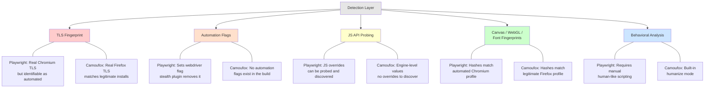
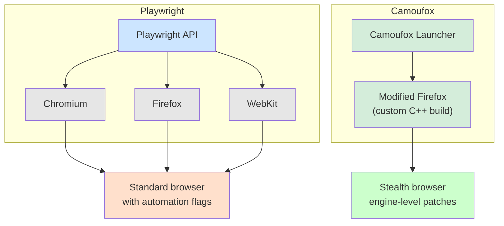
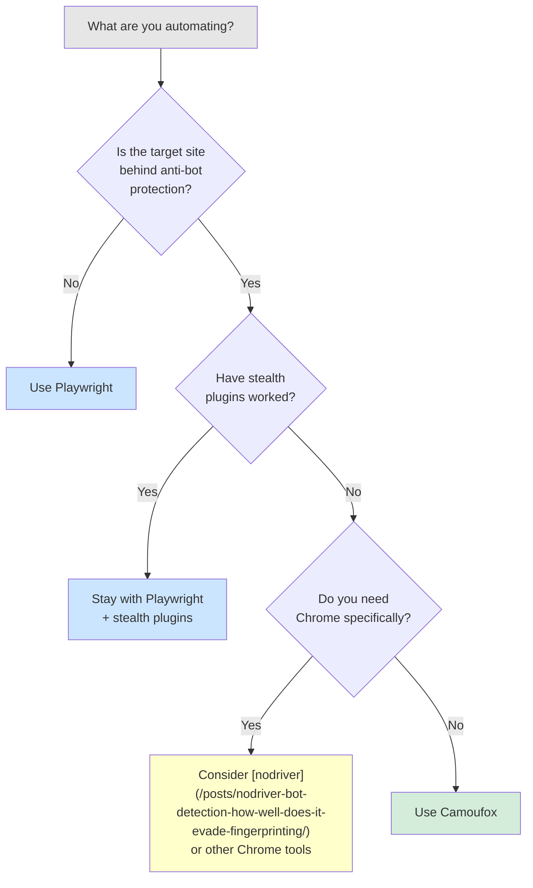

Playwright is the dominant browser automation framework. It has official support from Microsoft, works across Chromium, Firefox, and WebKit, and powers testing pipelines at thousands of companies. But Playwright was built for testing, not stealth. When you point it at a site protected by Cloudflare, DataDome, or Akamai, it gets flagged almost instantly. Camoufox was built for the opposite scenario: a modified Firefox engine designed from the ground up to be undetectable, part of the broader [stealth browser arms race](/posts/stealth-browsers-in-2026-camoufox-nodriver-and-the-anti-detection-arms-race/) reshaping web scraping in 2026. The interesting part is that Camoufox exposes a Playwright-compatible API, so the two tools are not as different on the surface as you might expect. The differences are under the hood, and that is exactly where detection systems look.

## How Playwright Approaches Stealth

Playwright was designed as a testing framework. It launches browsers with automation flags set, injects helper scripts for reliable element targeting, and modifies browser behavior to make tests deterministic. None of this is a problem when you are running end-to-end tests on your own application. It becomes a serious problem when you are automating against a site that does not want to be automated.

The community has built workarounds. The most popular is `playwright-stealth`, a plugin that patches known detection vectors -- we compare it against alternatives in [undetected Playwright vs playwright-stealth: which plugin?](/posts/undetected-playwright-vs-playwright-stealth-which-plugin/). It patches known detection vectors by overriding JavaScript properties like `navigator.webdriver`, faking plugin arrays, and spoofing the `chrome.runtime` object. You can also inject init scripts that run before any page JavaScript executes, giving you a window to mask automation artifacts.

```python
from playwright.sync_api import sync_playwright
from playwright_stealth import stealth_sync

with sync_playwright() as p:
    browser = p.chromium.launch(headless=False)
    context = browser.new_context(
        viewport={"width": 1920, "height": 1080},
        user_agent="Mozilla/5.0 (Windows NT 10.0; Win64; x64) "
                   "AppleWebKit/537.36 (KHTML, like Gecko) "
                   "Chrome/120.0.0.0 Safari/537.36",
        locale="en-US",
    )
    page = context.new_page()

    # Apply stealth patches
    stealth_sync(page)

    page.goto("https://example.com")
    print(page.title())
    browser.close()
```

The problem is that these patches operate at the JavaScript level. Detection systems have learned to look beneath them. They compare canvas fingerprints against known browser-version hashes, probe WebGL renderer strings that JavaScript overrides cannot fully control, and analyze TLS handshake characteristics that no amount of JS patching can change. Playwright-stealth buys you time, but it does not solve the fundamental problem: the browser still knows it is being automated.

## How Camoufox Approaches Stealth

Camoufox takes the opposite strategy. Instead of patching detection vectors after the browser launches, Camoufox modifies the Firefox source code at the C++ level before compilation. The resulting binary is a custom Firefox build where the engine itself produces fingerprints that match a legitimate browser installation.

When a detection script renders an invisible canvas and hashes the result, the hash comes from modified rendering code, not from a JavaScript override. When it queries WebGL parameters, the response originates in compiled C++ code. When it checks font metrics, the values are consistent with the spoofed operating system because the font enumeration code itself has been changed.

```python
from camoufox.sync_api import Camoufox

with Camoufox(headless=True) as browser:
    page = browser.new_page()
    page.goto("https://example.com")

    # No stealth plugin needed. The browser itself is stealth.
    print(page.title())
    content = page.query_selector("body").inner_text()
    print(f"Content length: {len(content)} characters")
```

There is no stealth plugin to install, no init scripts to inject, and no property overrides to maintain. The stealth is baked into the browser binary.

## Detection Comparison: What Each Tool Leaks

Modern anti-bot systems operate across multiple detection layers. Each layer probes a different aspect of your browser, and failing any single layer is enough to get blocked or served a CAPTCHA.



The critical difference is depth. Playwright's stealth plugins operate at the JavaScript layer --- they override properties and intercept API calls. But the underlying browser engine is unmodified. Sophisticated detection systems can compare responses across multiple APIs and discover inconsistencies that JavaScript-level patches cannot fully mask.

Camoufox operates at the engine layer. There is no gap between what the browser claims and what it actually is, because the engine itself has been changed. Detection scripts that cross-reference canvas hashes, WebGL strings, and font metrics against known browser profiles find a consistent picture.

## API Similarity: Almost Identical Code

One of the most surprising things about Camoufox is that it uses a Playwright-compatible API. If you already know Playwright, you already know most of the Camoufox API. The Camoufox launcher returns a browser object that behaves like a Playwright Firefox browser instance.

Here is the same scraping task written in both tools.

### Playwright Version

```python
from playwright.sync_api import sync_playwright
from playwright_stealth import stealth_sync

def scrape_with_playwright(url):
    with sync_playwright() as p:
        browser = p.chromium.launch(headless=False)
        context = browser.new_context(
            viewport={"width": 1920, "height": 1080},
            user_agent="Mozilla/5.0 (Windows NT 10.0; Win64; x64) "
                       "AppleWebKit/537.36 (KHTML, like Gecko) "
                       "Chrome/120.0.0.0 Safari/537.36",
        )
        page = context.new_page()
        stealth_sync(page)

        page.goto(url, wait_until="networkidle")
        page.wait_for_selector("h1")

        title = page.title()
        heading = page.query_selector("h1").inner_text()
        links = page.query_selector_all("a[href]")
        hrefs = [link.get_attribute("href") for link in links]

        browser.close()

    return {
        "title": title,
        "heading": heading,
        "link_count": len(hrefs),
        "links": hrefs[:10],
    }

result = scrape_with_playwright("https://example.com")
print(result)
```

### Camoufox Version

```python
from camoufox.sync_api import Camoufox

def scrape_with_camoufox(url):
    with Camoufox(headless=True, humanize=True) as browser:
        page = browser.new_page()

        page.goto(url, wait_until="networkidle")
        page.wait_for_selector("h1")

        title = page.title()
        heading = page.query_selector("h1").inner_text()
        links = page.query_selector_all("a[href]")
        hrefs = [link.get_attribute("href") for link in links]

    return {
        "title": title,
        "heading": heading,
        "link_count": len(hrefs),
        "links": hrefs[:10],
    }

result = scrape_with_camoufox("https://example.com")
print(result)
```

The core page interaction code --- `goto`, `wait_for_selector`, `query_selector`, `query_selector_all`, `inner_text`, `get_attribute` --- is identical. The differences are in the setup: Playwright requires explicit stealth patches, user agent strings, and viewport configuration. Camoufox handles all of that internally.

This API compatibility means migrating from Playwright to Camoufox for specific targets is straightforward. You keep your existing page interaction logic and swap the launcher.


<figure>
  
  <figcaption>Browser automation turns repetitive tasks into reliable scripts. <span class="img-credit">Photo by ThisIsEngineering / <a href="https://www.pexels.com" target="_blank" rel="noopener noreferrer">Pexels</a></span></figcaption>
</figure>

## Browser Engine Differences

Playwright supports three browser engines: Chromium, Firefox, and WebKit. You can switch between them with a single line change. This is valuable for cross-browser testing and for choosing whichever engine a target site is least likely to scrutinize.

```python
from playwright.sync_api import sync_playwright

with sync_playwright() as p:
    # Switch engines by changing one word
    browser = p.chromium.launch()   # Chromium
    # browser = p.firefox.launch()  # Firefox
    # browser = p.webkit.launch()   # WebKit
    page = browser.new_page()
    page.goto("https://example.com")
    browser.close()
```

Camoufox is locked to its modified Firefox build. You cannot switch to Chromium or WebKit. This is a deliberate trade-off: the stealth modifications are deeply embedded in the Firefox source code, and porting them to another engine would be a massive undertaking.



In practice, most stealth-critical automation runs on Chromium anyway, because Chrome is the most common browser on the web and blending in with real traffic means looking like Chrome. Camoufox bets on Firefox instead, which is less common but benefits from Firefox's stronger privacy defaults and a detection landscape that is less focused on Firefox fingerprints.

## When Playwright Wins

Playwright is the better tool in several important scenarios.

**Cross-browser testing.** If you need to verify that a site works in Chromium, Firefox, and WebKit, Playwright is the only option. Camoufox does not support multiple engines.

**Rich ecosystem.** Playwright has extensive documentation, thousands of Stack Overflow answers, official Microsoft support, and integrations with CI/CD systems, test runners, and reporting tools. The community is massive. If you hit a problem, someone has already solved it.

**Testing infrastructure.** Playwright was built for testing. Features like auto-waiting, network interception, request mocking, trace recording, and codegen are mature and battle-tested. Camoufox inherits some of these through its Playwright-compatible API, but the primary focus is stealth, not test infrastructure.

**Speed in non-protected environments.** When stealth is not a concern --- internal tools, your own sites, public APIs --- Playwright is faster to set up and has lower overhead. You do not need to download a custom browser build.

**TypeScript and JavaScript support.** Playwright has first-class support for TypeScript, JavaScript, Python, C#, and Java. Camoufox is Python-first. You can connect to a running Camoufox instance from Node.js via WebSocket, but the primary workflow is Python.

```python
# Playwright's network interception: hard to match
from playwright.sync_api import sync_playwright

with sync_playwright() as p:
    browser = p.chromium.launch()
    page = browser.new_page()

    # Block images and CSS for faster loading
    def handle_route(route):
        if route.request.resource_type in ("image", "stylesheet"):
            route.abort()
        else:
            route.continue_()

    page.route("**/*", handle_route)
    page.goto("https://example.com")

    # Mock API responses
    def mock_api(route):
        route.fulfill(
            status=200,
            content_type="application/json",
            body='{"mocked": true}',
        )

    page.route("**/api/data", mock_api)
    browser.close()
```

## When Camoufox Wins

Camoufox is the better tool when stealth is non-negotiable.

**Heavily protected sites.** Cloudflare's managed challenge (including the new [AI Labyrinth honeypot system](/posts/cloudflare-ai-labyrinth-how-honeypot-pages-are-trapping-scrapers/)), DataDome, Akamai Bot Manager, PerimeterX --- these systems actively probe for automation artifacts. Playwright with stealth plugins fails against the most aggressive configurations. Camoufox passes because the detection scripts find a consistent, legitimate-looking browser.

**Canvas and WebGL fingerprinting.** Sites that hash canvas output and compare it against known browser profiles will catch Playwright's JavaScript-level overrides. Camoufox's engine-level rendering produces hashes that match real Firefox installations.

**Long-running sessions.** Some detection systems watch for behavioral consistency over time. A browser that suddenly changes its fingerprint mid-session gets flagged. Camoufox maintains a consistent fingerprint for the entire session because the fingerprint comes from the engine, not from scripts that might fail to re-apply.

**OS-level spoofing.** Camoufox can convincingly impersonate a different operating system. When you set `os="windows"` on a Linux machine, the font metrics, canvas rendering, and system information all align because the engine itself changes its behavior.

```python
from camoufox.sync_api import Camoufox

# Target a heavily protected site
with Camoufox(
    headless=True,
    os="windows",
    humanize=True,
    geoip=True,
    screen={"width": 1920, "height": 1080},
) as browser:
    page = browser.new_page()

    # Navigate to a Cloudflare-protected site
    page.goto("https://protected-site.example.com")

    # Wait for any challenge to resolve
    page.wait_for_timeout(5000)

    # The page loads normally because the browser
    # passes all detection checks at the engine level
    content = page.query_selector("body").inner_text()
    print(content)
```

## Can You Use Both?

Yes, and this is often the smartest approach. Use Playwright for the 90% of your automation that does not require stealth, and switch to Camoufox for the protected targets.

Since Camoufox uses a Playwright-compatible API, you can share most of your page interaction code between the two tools. The only part that changes is the browser setup.

```python
from playwright.sync_api import sync_playwright
from camoufox.sync_api import Camoufox


def scrape_page(page, url):
    """Shared scraping logic that works with both tools."""
    page.goto(url, wait_until="networkidle")
    page.wait_for_selector("body")

    return {
        "title": page.title(),
        "text": page.query_selector("body").inner_text(),
        "url": page.url,
    }


def scrape_with_playwright(url):
    """Use Playwright for unprotected sites."""
    with sync_playwright() as p:
        browser = p.chromium.launch(headless=True)
        page = browser.new_page()
        result = scrape_page(page, url)
        browser.close()
    return result


def scrape_with_camoufox(url):
    """Use Camoufox for protected sites."""
    with Camoufox(headless=True, humanize=True) as browser:
        page = browser.new_page()
        result = scrape_page(page, url)
    return result


# Route targets to the right tool
protected_domains = {"protected-site.com", "heavily-guarded.com"}

targets = [
    "https://example.com",
    "https://protected-site.com/data",
    "https://public-api.example.org",
    "https://heavily-guarded.com/products",
]

for url in targets:
    from urllib.parse import urlparse
    domain = urlparse(url).netloc

    if domain in protected_domains:
        result = scrape_with_camoufox(url)
        print(f"[Camoufox] {result['title']}")
    else:
        result = scrape_with_playwright(url)
        print(f"[Playwright] {result['title']}")
```

This hybrid approach gives you the best of both worlds: Playwright's speed and ecosystem for general work, and Camoufox's stealth for hardened targets.

## Performance Comparison

Performance is not just about raw speed. It includes startup time, memory usage, and how each tool handles concurrent pages.

| Metric | Playwright (Chromium) | Camoufox |
|---|---|---|
| Browser startup | ~1-2 seconds | ~2-4 seconds (custom build download on first run) |
| Page load overhead | Minimal | Minimal (same underlying Playwright connection) |
| Memory per page | ~50-80 MB (Chromium) | ~40-70 MB (Firefox, typically lower) |
| Concurrent pages | Excellent (browser contexts) | Good (browser contexts supported) |
| Headless support | Native | Native |
| First-run setup | Download browser (~150 MB) | Download custom Firefox (~300 MB) |
| Stealth overhead | Low (JS patches are lightweight) | None (stealth is the default state) |

Playwright has a slight edge on startup time because you are launching a stock browser binary. Camoufox's first run is slower because it downloads its custom Firefox build, but subsequent launches are comparable.

For concurrent scraping, Playwright's browser context isolation is mature and well-tested. Camoufox supports the same browser context model through its Playwright-compatible API, but the concurrency patterns are less battle-tested in the community simply because the user base is smaller.

```python
# Concurrent scraping with Playwright
from playwright.sync_api import sync_playwright

with sync_playwright() as p:
    browser = p.chromium.launch(headless=True)

    urls = [f"https://example.com/page/{i}" for i in range(10)]
    results = []

    for url in urls:
        context = browser.new_context()
        page = context.new_page()
        page.goto(url)
        results.append(page.title())
        context.close()

    browser.close()
    print(f"Scraped {len(results)} pages")
```

```python
# Concurrent scraping with Camoufox
from camoufox.sync_api import Camoufox

with Camoufox(headless=True) as browser:
    urls = [f"https://example.com/page/{i}" for i in range(10)]
    results = []

    for url in urls:
        page = browser.new_page()
        page.goto(url)
        results.append(page.title())
        page.close()

    print(f"Scraped {len(results)} pages")
```

In both cases, the actual page interaction performance is similar. The difference shows up when detection systems are involved: Playwright may need to retry after being blocked, while Camoufox passes through on the first attempt.

## Decision Framework

The choice between Playwright and Camoufox is not about which tool is better. It is about what you are trying to do.



**Choose Playwright when:**
- You are testing your own application across browsers
- The target site has no anti-bot protection
- You need Chromium, Firefox, and WebKit support
- Your team uses TypeScript, JavaScript, C#, or Java
- You need mature CI/CD integration and test reporting
- Stealth plugins like `playwright-stealth` are sufficient (see also [Playwright vs Selenium stealth: which evades detection better](/posts/playwright-vs-selenium-stealth-which-evades-detection-better/))

**Choose Camoufox when:**
- The target site uses aggressive bot detection (Cloudflare, DataDome, Akamai)
- Playwright with stealth plugins is getting blocked
- You need consistent fingerprints across canvas, WebGL, and font metrics
- You want stealth without maintaining a library of patches and workarounds (for a Selenium-focused take, see [Camoufox vs Selenium anti-detection approaches](/posts/camoufox-vs-selenium-anti-detection-approaches-compared/))
- Your workflow is Python-based

**Use both when:**
- You have a mix of protected and unprotected targets
- You want Playwright's ecosystem for development and testing, and Camoufox for production scraping on hardened sites
- You are building a scraping pipeline that routes requests to different tools based on detection difficulty

## Verdict

Playwright is the general-purpose choice. It is well-documented, well-supported, works across multiple browsers and languages, and handles the vast majority of automation tasks without issue. For testing, prototyping, and scraping unprotected sites, there is no reason to look elsewhere.

Camoufox is the specialist. It exists because Playwright's approach to stealth --- patching detection vectors at the JavaScript level --- has a fundamental ceiling. Sites with advanced bot detection can see through those patches. Camoufox removes the ceiling by modifying the browser engine itself, at the cost of being locked to Firefox and a smaller ecosystem.

The fact that Camoufox uses a Playwright-compatible API makes the two tools complementary rather than competing. You can learn one API and use it for both. Start with Playwright. When you hit a wall that stealth plugins cannot solve, bring in Camoufox for those specific targets. That is the pragmatic path.
