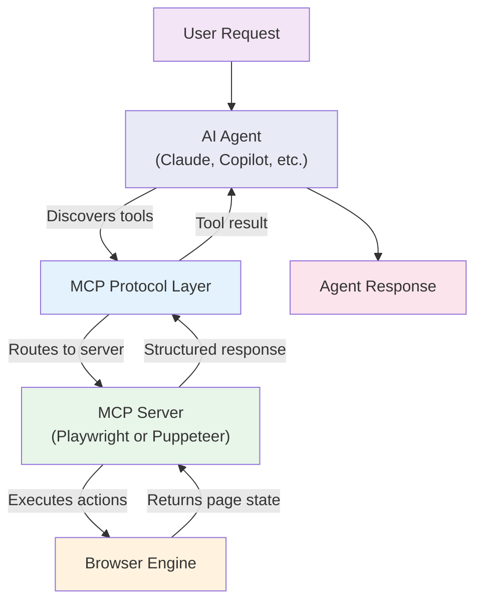
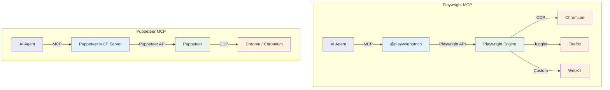
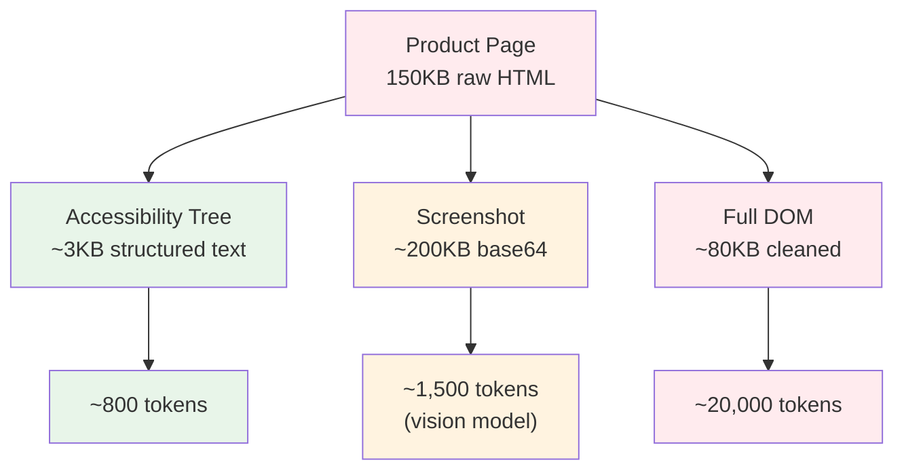
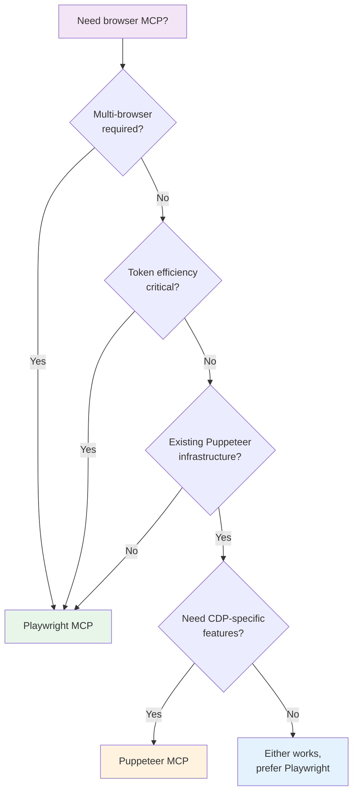

The Model Context Protocol has become the standard way for AI agents to interact with external tools, and browser automation is one of its most compelling use cases. Both Puppeteer and Playwright now have MCP server implementations that let language models drive a browser without writing automation code. But the two approaches differ in significant ways -- from official backing and browser support to token efficiency and the set of tools they expose. If you are building an AI agent that needs to interact with web pages, the choice between Puppeteer MCP and Playwright MCP will shape your architecture, your costs, and what you can actually do.

## What Is the Model Context Protocol

MCP is an open protocol that standardizes the connection between large language models and external tools. It was introduced by Anthropic and has been widely adopted across the AI ecosystem. The protocol defines a simple contract: an MCP server exposes a set of tools, each with a name, description, and parameter schema. An AI agent discovers those tools, decides which ones to call based on the user's request, and receives structured results it can reason about.

For browser automation, MCP removes the need for the AI agent to know any specific browser automation API. This is central to how [Playwright is being used for browser automation in AI agents](/posts/playwright-for-browser-automation-in-ai-agents/). The agent does not write Playwright code or Puppeteer code. It calls tools like `browser_navigate`, `browser_click`, or `browser_snapshot`, and the MCP server translates those calls into the underlying automation framework.



The power of this pattern is interchangeability. In theory, any MCP-compatible AI agent can connect to any MCP server. In practice, the quality of the server implementation matters enormously.

## Playwright MCP: The Official Implementation

The Playwright MCP Server is published as `@playwright/mcp` and is maintained by Microsoft as part of the Playwright project. For background on how the [Playwright MCP and CLI make browser automation AI-agent friendly](/posts/playwright-mcp-and-cli-making-browser-automation-ai-agent-friendly/), see our earlier post. It was originally published under `@anthropic-ai/mcp-server-playwright` before being consolidated under the official Playwright namespace. This is not a community side project -- it has the backing of the same team that builds Playwright itself.

The server exposes Playwright's full browser control capabilities through MCP tools. It handles browser lifecycle management, element resolution, waiting strategies, and error recovery internally. The AI agent simply calls high-level tools and gets back structured results.

### Key Features

**Accessibility tree snapshots.** This is the defining feature of Playwright MCP. Instead of returning raw HTML (which is massive and full of irrelevant markup), the server returns an accessibility tree snapshot of the page. The accessibility tree is a structured representation of the page content that screen readers use. It contains the meaningful elements -- headings, buttons, links, form fields, text content -- without the noise of CSS classes, inline styles, and layout divs.

```json
{
  "name": "browser_snapshot",
  "description": "Returns the accessibility snapshot of the current page",
  "arguments": {}
}
```

A typical response looks like this:

```text
- heading "Welcome to Example.com" [level=1]
  - text "Your account dashboard"
- navigation "Main Menu"
  - link "Home" [ref=s1e3]
  - link "Settings" [ref=s1e4]
  - link "Logout" [ref=s1e5]
- main
  - heading "Recent Activity" [level=2]
  - list
    - listitem "Order #1234 - Shipped"
    - listitem "Order #1235 - Processing"
  - button "View All Orders" [ref=s1e12]
```

Each interactive element gets a `ref` attribute that the agent can use in subsequent tool calls. This is dramatically more token-efficient than sending the full DOM.

**Screenshot support.** When the accessibility tree is not enough -- for example, when dealing with canvas elements, complex visualizations, or pages that rely heavily on visual layout -- the server can return screenshots that multimodal models can interpret.

```json
{
  "name": "browser_screenshot",
  "description": "Takes a screenshot of the current page",
  "arguments": {
    "raw": true
  }
}
```

**Multi-browser support.** Because Playwright supports Chromium, Firefox, and WebKit, the MCP server can drive any of these browsers. This matters for testing scenarios and for sites that behave differently across browser engines.

**Structured element interaction.** The server provides tools for clicking, typing, hovering, selecting options, and other interactions. Each tool accepts element references from the accessibility snapshot, so the agent does not need to construct CSS selectors or XPaths.

```json
{
  "name": "browser_click",
  "arguments": {
    "element": "View All Orders",
    "ref": "s1e12"
  }
}
```

## Puppeteer MCP: Community Implementations

Puppeteer does not have an official MCP server from Google. For a broader look at how the two automation libraries compare outside the MCP context, see our [Selenium vs Puppeteer definitive comparison](/posts/selenium-vs-puppeteer-definitive-comparison-web-scraping/). The Puppeteer MCP ecosystem consists of community-built implementations. The most notable is `@anthropic-ai/mcp-server-puppeteer`, which was one of the early reference implementations of MCP. Other community implementations exist on GitHub with varying levels of maintenance.

These servers use the Chrome DevTools Protocol (CDP) through Puppeteer to control Chrome or Chromium. They expose a similar set of browser control tools, but the implementation details differ from the Playwright approach.

### Key Features

**CDP-based control.** Puppeteer MCP servers talk directly to Chrome through CDP. This gives access to low-level Chrome internals that are not available through higher-level abstractions. You can intercept network requests, manipulate cookies at the protocol level, access performance metrics, and interact with Chrome-specific features like the Profiler or the Coverage API.

**Console log capture.** Puppeteer MCP implementations typically capture and return console logs from the page, which can be useful for debugging JavaScript-heavy applications.

```json
{
  "name": "puppeteer_evaluate",
  "arguments": {
    "script": "document.title"
  }
}
```

**Screenshot-first approach.** Many Puppeteer MCP implementations lean heavily on screenshots as the primary way to convey page state back to the agent. Some include accessibility tree support, but it tends to be less refined than Playwright's implementation.

**Direct JavaScript evaluation.** Puppeteer MCP servers typically expose a tool for running arbitrary JavaScript in the page context. This is powerful but less structured than the tool-based approach Playwright MCP uses.

## Architecture Comparison

The architectural differences between the two are worth understanding. They affect performance, reliability, and what the AI agent can do.



Playwright MCP goes through the Playwright engine, which adds its own layer of abstraction on top of the browser protocols. This layer provides automatic waiting, smart element resolution, and cross-browser compatibility. Puppeteer MCP talks more directly to Chrome through CDP, which gives it lower-level access but requires more explicit handling of timing and state.

## Feature Comparison

Here is a concrete comparison of what each exposes to AI agents.

### Navigation and Page State

| Feature | Playwright MCP | Puppeteer MCP |
|---------|---------------|---------------|
| Navigate to URL | `browser_navigate` | `puppeteer_navigate` |
| Go back/forward | `browser_go_back`, `browser_go_forward` | Limited or custom |
| Page snapshot | `browser_snapshot` (accessibility tree) | Screenshot-based |
| Screenshot | `browser_screenshot` | `puppeteer_screenshot` |
| Wait for element | Built into tool execution | `puppeteer_evaluate` with custom wait |
| Tab management | `browser_tab_new`, `browser_tab_select`, `browser_tab_close` | Varies by implementation |

### Element Interaction

| Feature | Playwright MCP | Puppeteer MCP |
|---------|---------------|---------------|
| Click | `browser_click` (by ref or text) | `puppeteer_click` (by selector) |
| Type text | `browser_type` | `puppeteer_type` or evaluate |
| Select option | `browser_select_option` | JavaScript evaluation |
| Hover | `browser_hover` | JavaScript evaluation |
| Drag and drop | `browser_drag` | JavaScript evaluation |
| File upload | `browser_file_upload` | Limited |

### Advanced Features

| Feature | Playwright MCP | Puppeteer MCP |
|---------|---------------|---------------|
| JavaScript eval | `browser_evaluate` | `puppeteer_evaluate` |
| Network interception | Not exposed via MCP | CDP access possible |
| Console logs | Not primary return | Often included |
| PDF generation | Not exposed via MCP | Available in some implementations |
| Cookie management | Not exposed via MCP | CDP access possible |
| Multiple browsers | Chromium, Firefox, WebKit | Chrome/Chromium only |


<figure>
  
  <figcaption>Headless browsers opened a new chapter in web automation. <span class="img-credit">Photo by Bibek ghosh / <a href="https://www.pexels.com" target="_blank" rel="noopener noreferrer">Pexels</a></span></figcaption>
</figure>

## Token Efficiency

Token consumption is one of the most important practical considerations when connecting AI agents to browsers. Every tool call and every response consumes tokens, and browser pages can generate enormous amounts of data.

Playwright MCP's accessibility tree approach is significantly more token-efficient than returning raw HTML or relying solely on screenshots.

Consider a typical e-commerce product page. The raw HTML might be 150KB -- that is roughly 40,000 tokens. The accessibility tree for the same page might be 2-4KB, or about 500-1,000 tokens. That is a 40x reduction, and it preserves the information the agent actually needs: what elements are on the page, what they contain, and how to interact with them.



Puppeteer MCP implementations that rely on screenshots consume fewer text tokens but require a multimodal model to interpret. Those that return raw HTML or DOM content can consume tokens rapidly. Some Puppeteer MCP implementations have added accessibility tree support, but it is not as mature or well-integrated as Playwright's.

For high-volume agent workflows -- running hundreds or thousands of browser tasks per day -- the token difference between the two approaches can mean the difference between a viable cost model and an unsustainable one.

## Setup Comparison

### Playwright MCP

Installation and configuration is straightforward. The package handles browser binary management through Playwright's built-in install command.

```bash
# Install browsers (one-time setup)
npx playwright install

# Run the MCP server
npx @playwright/mcp
```

Configure in Claude Desktop (`claude_desktop_config.json`):

```json
{
  "mcpServers": {
    "playwright": {
      "command": "npx",
      "args": ["@playwright/mcp"]
    }
  }
}
```

Configure in Claude Code:

```bash
claude mcp add playwright -- npx @playwright/mcp
```

The server accepts flags to customize behavior:

```bash
# Run in headed mode (visible browser window)
npx @playwright/mcp --headed

# Use a specific browser
npx @playwright/mcp --browser firefox

# Set viewport size
npx @playwright/mcp --viewport-size 1280,720
```

### Puppeteer MCP

The reference implementation uses a similar pattern:

```bash
# Run the Puppeteer MCP server
npx @anthropic-ai/mcp-server-puppeteer
```

Configure in Claude Desktop:

```json
{
  "mcpServers": {
    "puppeteer": {
      "command": "npx",
      "args": ["@anthropic-ai/mcp-server-puppeteer"]
    }
  }
}
```

Puppeteer downloads Chrome automatically on first run, so there is no separate browser install step. However, this also means you are limited to the Chrome version Puppeteer bundles.

Some Puppeteer MCP implementations accept additional configuration:

```json
{
  "mcpServers": {
    "puppeteer": {
      "command": "npx",
      "args": ["@anthropic-ai/mcp-server-puppeteer"],
      "env": {
        "PUPPETEER_LAUNCH_OPTIONS": "{\"headless\": false}",
        "ALLOW_DANGEROUS": "true"
      }
    }
  }
}
```

The `ALLOW_DANGEROUS` flag enables the `puppeteer_evaluate` tool, which lets the agent run arbitrary JavaScript in the page. This is disabled by default for security reasons.

## When to Use Playwright MCP

Playwright MCP is the better choice for most use cases. Here is when it makes the most sense.

**You want the best-supported option.** Playwright MCP is maintained by Microsoft as part of the official Playwright project. It gets updates alongside Playwright itself, which means new browser features and bug fixes flow through quickly.

**Token efficiency matters.** If you are running agents at scale and paying per token, Playwright's accessibility tree approach will save you significant money. The structured snapshots are compact, informative, and designed for LLM consumption.

**You need multi-browser support.** If your agent needs to work across Chromium, Firefox, and WebKit -- for testing or for handling sites that behave differently in different browsers -- Playwright MCP is your only option.

**You want structured element references.** Playwright MCP's ref-based element targeting is cleaner and more reliable than constructing CSS selectors. The agent sees a list of interactive elements with unique references and can target them directly.

**You are building a new project.** If you are starting from scratch, Playwright MCP has better documentation, more active development, and a larger community of AI agent developers using it.

## When to Use Puppeteer MCP

There are valid reasons to choose Puppeteer MCP, though they apply to a narrower set of scenarios.

**You have existing Puppeteer infrastructure.** If your team has years of Puppeteer scripts, custom configurations, and operational knowledge around Puppeteer, adding a Puppeteer MCP server might integrate more naturally into your stack.

**You need low-level CDP access.** Some Puppeteer MCP implementations expose CDP features that Playwright MCP does not surface through its tool interface. If you need protocol-level network interception, performance profiling, or Chrome-specific DevTools features, Puppeteer's closer relationship with CDP can be an advantage.

**You need arbitrary JavaScript execution.** While both servers support JavaScript evaluation, Puppeteer MCP implementations tend to make this a more central part of the workflow. If your agent's primary job is to run scripts in the page rather than interact with UI elements, this approach might fit better.

**You want a lighter-weight server.** Puppeteer MCP servers tend to be simpler, with fewer abstractions between the agent and the browser. If you need to modify the server's behavior or add custom tools, the smaller codebase can be easier to work with.


<figure>
  
  <figcaption>Node.js gave browser automation a native home in JavaScript. <span class="img-credit">Photo by Daniil Komov / <a href="https://www.pexels.com" target="_blank" rel="noopener noreferrer">Pexels</a></span></figcaption>
</figure>

## Quick Decision Guide



## The Broader MCP Ecosystem for Browsers

Playwright MCP and Puppeteer MCP are not the only browser-related MCP servers. The ecosystem is growing, and several other servers address specific niches.

**Browserbase MCP** (`@browserbasehq/mcp-server-browserbase`) runs browsers in the cloud. Instead of launching a local browser instance, it provisions a remote browser through Browserbase's infrastructure. This matters for production deployments where you need scalability, geographic distribution, or isolation between sessions.

**Browser Use MCP** connects the Browser Use framework to MCP. We compare it alongside other options in our [browser agent frameworks comparison: Browser Use vs Stagehand vs Skyvern](/posts/browser-agent-frameworks-compared-browser-use-vs-stagehand-vs-skyvern/). Browser Use takes a different approach to browser automation -- it uses vision models to interpret screenshots and AI planning to decide on actions. The MCP server wraps this in the standard MCP interface.

**Stagehand MCP** is another AI-native browser automation framework that exposes its capabilities through MCP. It focuses on making browser tasks describable in natural language, with the framework handling the translation to concrete actions.

**Custom CDP MCP servers** bypass both Playwright and Puppeteer entirely, speaking CDP directly. These are typically built for specific use cases where the overhead of a full automation framework is unwanted.

The choice between these depends on your deployment model, your performance requirements, and how much abstraction you want between the AI agent and the browser.

## Running Both Side by Side

Nothing stops you from configuring both Playwright MCP and Puppeteer MCP in the same AI agent. This can be useful during evaluation or when different tasks benefit from different approaches.

```json
{
  "mcpServers": {
    "playwright": {
      "command": "npx",
      "args": ["@playwright/mcp"]
    },
    "puppeteer": {
      "command": "npx",
      "args": ["@anthropic-ai/mcp-server-puppeteer"]
    }
  }
}
```

The agent will see tools from both servers and can choose which to use based on the task. In practice, most agents default to whichever server's tools appear first in their tool list, so you may need to guide the agent with system prompt instructions to prefer one over the other for specific tasks.

Be aware that running both simultaneously means two browser instances consuming memory. For local development this is usually fine. For production, you would want to choose one.

## What This Means for AI Browser Automation

The existence of standardized MCP servers for browser automation is a turning point. It means AI agents can control browsers through a stable, well-defined interface rather than through fragile prompt engineering or custom integrations. The agent does not need to know whether it is using Playwright or Puppeteer underneath -- it just calls tools.

Playwright MCP has the stronger position today. It has official backing, better token efficiency through accessibility tree snapshots, multi-browser support, and a more active development community. Puppeteer MCP remains useful for teams with existing Puppeteer investments or specific CDP requirements, but for new projects, Playwright MCP is the default recommendation.

The gap is likely to widen. Microsoft is actively investing in Playwright MCP as part of their AI agent strategy. The Playwright CLI, which wraps MCP tools into a command-line interface for even more token-efficient agent interactions, is another sign that Microsoft sees this as a first-class priority. Puppeteer MCP, without official Google backing, relies on community maintenance that may or may not keep pace.

If you are weighing the broader question of [agent-browser vs Playwright CLI for AI browser control](/posts/agent-browser-vs-playwright-cli-ai-browser-control/), our comparison covers when each architecture makes sense. If you are already on Puppeteer and considering a move, our [step-by-step Puppeteer to Playwright migration guide](/posts/migrating-puppeteer-to-playwright-step-by-step-guide/) walks through the process. If you are starting a project that involves AI agents and browser automation, begin with Playwright MCP. You can always add Puppeteer MCP later if you hit a specific limitation that requires it.
