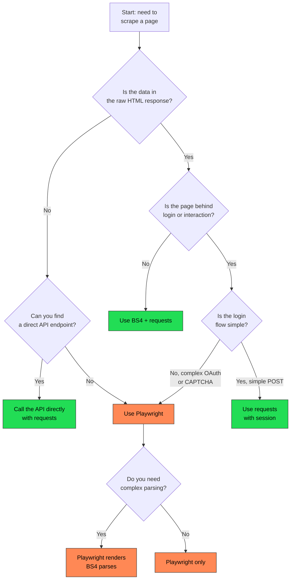

BeautifulSoup and Playwright are not interchangeable tools. They operate at completely different layers of the web stack. BeautifulSoup is an HTML parser -- you give it a string of markup and it lets you search, navigate, and extract data from that string. Playwright is a browser automation framework -- it launches a real browser engine, executes JavaScript, renders the page, and gives you programmatic control over the entire browsing session. The fact that both appear in web scraping tutorials creates confusion, but once you understand what each tool actually does, choosing between them becomes straightforward. In most projects, the decision comes down to one question: is the data you need present in the raw HTML response, or is it rendered by JavaScript after the page loads?

This post walks through what each tool does, when each is the right choice, how they compare on performance, and how to combine them when you need the best of both.

## What BeautifulSoup Does

BeautifulSoup (BS4) is a Python library for parsing HTML and XML. It does not fetch pages. It does not run JavaScript. It does not open a browser. You hand it a string of HTML, and it builds a parse tree you can query with CSS selectors, tag searches, and tree navigation.

BS4 always works in tandem with something that provides the HTML. That is usually the `requests` library, and the [performance gap between requests and browser-based tools](/posts/python-requests-vs-selenium-speed-performance-comparison/) is significant:

```python
import requests
from bs4 import BeautifulSoup

response = requests.get("https://example.com/products")
soup = BeautifulSoup(response.text, "lxml")

for product in soup.select("div.product-card"):
    name = product.select_one("h2.name").get_text(strip=True)
    price = product.select_one("span.price").get_text(strip=True)
    print(f"{name}: {price}")
```

Three things happen in that snippet:

1. `requests.get()` sends an HTTP request and receives the raw HTML response
2. `BeautifulSoup()` parses that HTML string into a navigable tree using the `lxml` parser
3. `soup.select()` finds elements matching a CSS selector

If the data you want is in the raw HTML that the server sends back, BS4 will find it. If the data is injected by JavaScript after the page loads, BS4 will never see it.

### Core BS4 Methods

The API is small and predictable:

```python
# CSS selectors
soup.select("div.product > span.price")       # all matches
soup.select_one("h1.title")                    # first match

# Tag-based search
soup.find("a", {"class": "pagination-next"})   # first match
soup.find_all("tr", class_="data-row")         # all matches

# Extracting content
element.get_text(strip=True)                   # text content
element.get("href")                            # attribute value
element["data-id"]                             # attribute (KeyError if missing)

# Tree navigation
element.parent
element.find_next_sibling("div")
list(element.children)
```

### Parser Options

BS4 supports multiple underlying parsers. The choice affects speed and how forgiving the parser is with malformed HTML:

```python
# Fast -- requires pip install lxml
soup = BeautifulSoup(html, "lxml")

# Built-in -- no extra install needed
soup = BeautifulSoup(html, "html.parser")

# Most forgiving with broken markup -- requires pip install html5lib
soup = BeautifulSoup(html, "html5lib")
```

For scraping, `lxml` is the standard choice. It is fast and handles most real-world HTML without issues.

## What Playwright Does

Playwright is a browser automation framework developed by Microsoft. It launches a real browser engine (Chromium, Firefox, or WebKit), navigates to URLs, executes JavaScript, waits for content to render, and gives you full control over the page -- clicking, typing, scrolling, screenshotting, intercepting network requests. For a deeper look at how it stacks up against other browser automation tools, see our [Playwright vs Puppeteer comparison](/posts/playwright-vs-puppeteer-speed-stealth-developer-experience/).

Here is a basic Playwright workflow in Python:

```python
from playwright.sync_api import sync_playwright

with sync_playwright() as p:
    browser = p.chromium.launch(headless=True)
    page = browser.new_page()
    page.goto("https://example.com/products")
    page.wait_for_selector("div.product-card")

    products = page.query_selector_all("div.product-card")
    for product in products:
        name = product.query_selector("h2.name").inner_text()
        price = product.query_selector("span.price").inner_text()
        print(f"{name}: {price}")

    browser.close()
```

Playwright does everything a real browser does. It downloads the HTML, parses it, loads and runs all the JavaScript, fetches additional resources, builds the DOM, applies CSS, and renders the page. When you query elements through Playwright, you are querying the fully rendered page -- the same page a human user would see.

### Key Playwright Capabilities

```python
# Navigation
page.goto("https://example.com")
page.go_back()
page.reload()

# Waiting
page.wait_for_selector("div.loaded")
page.wait_for_load_state("networkidle")

# Interaction
page.click("button.load-more")
page.fill("input[name='search']", "python scraping")
page.select_option("select#category", "electronics")

# Extraction
page.inner_text("h1.title")
page.get_attribute("a.link", "href")
page.content()  # full rendered HTML as a string

# Screenshots and PDFs
page.screenshot(path="page.png")
page.pdf(path="page.pdf")
```

## When BeautifulSoup Is Enough

BS4 paired with `requests` is the right tool when the target page delivers its data in the initial HTML response. This covers more sites than you might think:

**Server-rendered HTML.** Traditional websites built with PHP, Ruby on Rails, Django, or any server-side framework send fully rendered HTML. News sites, blogs, documentation, government portals, and e-commerce product listing pages often fall into this category.

**Static sites.** Sites built with static generators (Jekyll, Hugo, Gatsby with SSR) serve pre-rendered HTML files. All the content is in the response.

**API responses.** Many "dynamic" sites actually fetch data from APIs. If you can identify the API endpoint, you can call it directly with `requests` and parse the JSON response -- no HTML parsing needed at all. This is often faster than scraping the rendered page.

**RSS and XML feeds.** BS4 handles XML as well as HTML. Feed parsing is a natural fit.

Here is a practical example -- scraping article titles and links from a news site:

```python
import requests
from bs4 import BeautifulSoup

headers = {"User-Agent": "Mozilla/5.0 (compatible; research-bot/1.0)"}
response = requests.get("https://news.example.com/latest", headers=headers)
soup = BeautifulSoup(response.text, "lxml")

articles = []
for card in soup.select("article.story-card"):
    title = card.select_one("h3 a")
    if title:
        articles.append({
            "title": title.get_text(strip=True),
            "url": title.get("href"),
            "summary": card.select_one("p.excerpt").get_text(strip=True)
        })

for article in articles:
    print(f"{article['title']} -- {article['url']}")
```

This runs in milliseconds, uses virtually no memory, and can be parallelized trivially with `concurrent.futures` or `asyncio` + `aiohttp`.

## When You Need Playwright

Playwright becomes necessary when the data you need does not exist in the raw HTML. This happens with:

**Single-page applications (SPAs).** React, Vue, and Angular apps typically ship a near-empty HTML shell. All content is rendered by JavaScript after the page loads. The raw HTML contains a `<div id="root"></div>` and a bunch of `<script>` tags -- nothing useful for BS4.

**Lazy-loaded content.** Pages that load data as you scroll, or show content only after certain user interactions (clicking tabs, expanding accordions, loading "more results").

**Authentication flows.** Sites with complex login processes -- multi-step forms, OAuth redirects, CAPTCHA challenges -- often require a real browser to navigate.

**Content behind client-side rendering.** Some sites render critical data (prices, availability, reviews) on the client side to make scraping harder, and features like [shadow DOM can further complicate extraction](/posts/shadow-dom-the-silent-killer-of-ai-web-scraping/). The HTML might contain placeholder text that JavaScript replaces.

Here is an example -- extracting product data from an SPA:

```python
from playwright.sync_api import sync_playwright

with sync_playwright() as p:
    browser = p.chromium.launch(headless=True)
    page = browser.new_page()
    page.goto("https://spa-store.example.com/search?q=laptop")

    # Wait for the JS framework to render product cards
    page.wait_for_selector("div.product-grid div.product-card")

    # Scroll to trigger lazy loading
    for _ in range(3):
        page.evaluate("window.scrollTo(0, document.body.scrollHeight)")
        page.wait_for_timeout(1000)

    products = page.query_selector_all("div.product-card")
    for product in products:
        name = product.query_selector("h3.product-name").inner_text()
        price = product.query_selector("span.current-price").inner_text()
        print(f"{name}: {price}")

    browser.close()
```

No amount of `requests` + BS4 magic will get this data. The HTML sent by the server is an empty shell. You need a browser engine to execute the JavaScript that populates the page.


<figure>
  
  <figcaption>Parsing HTML doesn't always require a full browser. <span class="img-credit">Photo by Stanislav Kondratiev / <a href="https://www.pexels.com" target="_blank" rel="noopener noreferrer">Pexels</a></span></figcaption>
</figure>

## Performance Comparison

The performance gap between these two approaches is massive. BS4 + `requests` is an HTTP call plus string parsing. Playwright launches a browser process, allocates memory for rendering, downloads all page resources, and executes potentially megabytes of JavaScript.

Here are typical numbers for scraping a single page:

| Metric | BS4 + requests | Playwright |
|--------|---------------|------------|
| Time per page | 100-500ms | 2-10 seconds |
| Memory per instance | 20-50 MB | 200-500 MB |
| CPU usage | Minimal | Significant |
| Concurrent instances | Hundreds | 5-20 |
| Dependencies | pip install only | Browser binary required |
| Startup time | None | 1-3 seconds |

At scale, this translates directly into infrastructure cost. Scraping 10,000 pages with BS4 + `requests` can run on a small VPS. Scraping the same 10,000 pages with Playwright needs a machine with serious RAM and CPU, or a cluster of workers.

```python
# BS4 approach: scrape 100 pages concurrently
import requests
from bs4 import BeautifulSoup
from concurrent.futures import ThreadPoolExecutor

def scrape_page(url):
    resp = requests.get(url, timeout=10)
    soup = BeautifulSoup(resp.text, "lxml")
    return soup.select_one("h1").get_text(strip=True)

urls = [f"https://example.com/page/{i}" for i in range(100)]

with ThreadPoolExecutor(max_workers=20) as executor:
    results = list(executor.map(scrape_page, urls))
```

That snippet finishes in seconds. Doing the same with Playwright requires managing browser contexts carefully to avoid running out of memory:

```python
from playwright.sync_api import sync_playwright

def scrape_with_playwright(urls):
    results = []
    with sync_playwright() as p:
        browser = p.chromium.launch(headless=True)

        for url in urls:
            context = browser.new_context()
            page = context.new_page()
            try:
                page.goto(url, timeout=15000)
                page.wait_for_selector("h1")
                results.append(page.inner_text("h1"))
            finally:
                context.close()

        browser.close()
    return results
```

This runs in minutes, not seconds, and consumes far more resources.

## Code Comparison: Static Page

To see the difference clearly, here is the same extraction task on a server-rendered page using both tools.

**Target:** Extract all article titles and dates from a blog index page where the content is in the initial HTML.

### BS4 Approach

```python
import requests
from bs4 import BeautifulSoup

response = requests.get("https://blog.example.com/archive")
soup = BeautifulSoup(response.text, "lxml")

for post in soup.select("article.post-preview"):
    title = post.select_one("h2 a").get_text(strip=True)
    date = post.select_one("time").get("datetime")
    print(f"[{date}] {title}")
```

Six lines. Runs in under a second. No external process.

### Playwright Approach

```python
from playwright.sync_api import sync_playwright

with sync_playwright() as p:
    browser = p.chromium.launch(headless=True)
    page = browser.new_page()
    page.goto("https://blog.example.com/archive")
    page.wait_for_selector("article.post-preview")

    posts = page.query_selector_all("article.post-preview")
    for post in posts:
        title = post.query_selector("h2 a").inner_text()
        date = post.query_selector("time").get_attribute("datetime")
        print(f"[{date}] {title}")

    browser.close()
```

More setup. Launches a browser. Takes 3-5 seconds. Produces the same output.

For static pages, Playwright works but is overkill. BS4 is faster, simpler, and cheaper.

## Code Comparison: JavaScript-Rendered Page

Now consider a page where the content is loaded by JavaScript. The raw HTML contains:

```html
<div id="app"></div>
<script src="/bundle.js"></script>
```

### BS4 Approach (Fails)

```python
import requests
from bs4 import BeautifulSoup

response = requests.get("https://spa.example.com/dashboard")
soup = BeautifulSoup(response.text, "lxml")

# This finds nothing -- the div is empty in the raw HTML
data = soup.select("div.dashboard-widget")
print(len(data))  # 0
```

BS4 parses what it receives. The server sent an empty `<div id="app">`. There are no widgets in the raw response. The data simply does not exist until JavaScript runs.

### Playwright Approach (Works)

```python
from playwright.sync_api import sync_playwright

with sync_playwright() as p:
    browser = p.chromium.launch(headless=True)
    page = browser.new_page()
    page.goto("https://spa.example.com/dashboard")
    page.wait_for_selector("div.dashboard-widget")

    widgets = page.query_selector_all("div.dashboard-widget")
    for widget in widgets:
        label = widget.query_selector("h3").inner_text()
        value = widget.query_selector("span.value").inner_text()
        print(f"{label}: {value}")

    browser.close()
```

Playwright runs the JavaScript, waits for the DOM to populate, and then queries the rendered content. This is the scenario where Playwright is not optional -- it is required.


<figure>
  
  <figcaption>Static parsing is fast, lightweight, and perfect for well-structured pages. <span class="img-credit">Photo by Tahir Xəlfəquliyev / <a href="https://www.pexels.com" target="_blank" rel="noopener noreferrer">Pexels</a></span></figcaption>
</figure>

## Combining Playwright and BeautifulSoup

There is a powerful pattern that uses both tools together: let Playwright render the page, then hand the rendered HTML to BeautifulSoup for parsing. This gives you the rendering power of a browser with the parsing flexibility of BS4.

```python
from playwright.sync_api import sync_playwright
from bs4 import BeautifulSoup

with sync_playwright() as p:
    browser = p.chromium.launch(headless=True)
    page = browser.new_page()
    page.goto("https://spa.example.com/products")
    page.wait_for_selector("div.product-list")

    # Get the fully rendered HTML
    rendered_html = page.content()
    browser.close()

# Now parse with BS4
soup = BeautifulSoup(rendered_html, "lxml")

for product in soup.select("div.product-card"):
    name = product.select_one("h2.name").get_text(strip=True)
    price = product.select_one("span.price").get_text(strip=True)
    sku = product.get("data-sku")
    categories = [c.get_text(strip=True) for c in product.select("span.category")]
    print(f"{sku}: {name} -- {price} -- {', '.join(categories)}")
```

The `page.content()` method returns the current DOM as an HTML string -- including everything JavaScript added. You pass that string to BS4 and use its full API for extraction.

Why would you do this instead of using Playwright's built-in selectors for everything?

**Complex tree navigation.** BS4 excels at walking the DOM tree -- accessing parents, siblings, descendants with chained calls. Playwright's selector engine is powerful but less flexible for multi-step tree traversal.

**Existing BS4 code.** If you have a large extraction pipeline already written in BS4, you can upgrade the fetching layer to Playwright without rewriting all your parsing logic.

**Multiple extraction passes.** When you need to extract many different things from the same page, parsing once with BS4 and running multiple `select()` calls is cleaner than repeated Playwright queries.

```python
# One rendering pass, multiple extraction passes
rendered_html = page.content()
soup = BeautifulSoup(rendered_html, "lxml")

# Extract product data
products = extract_products(soup)

# Extract pagination info
next_page = soup.select_one("a.next-page")

# Extract filter options
filters = soup.select("div.filter-panel select option")

# Extract breadcrumb trail
breadcrumbs = [b.get_text(strip=True) for b in soup.select("nav.breadcrumb a")]
```

## Decision Flowchart

Use this flowchart to decide which tool fits your scraping target:



The green boxes are the lightweight path. The orange boxes involve a browser and cost more resources.

## Cost of Running Each at Scale

At scale, the infrastructure differences between BS4 and Playwright become the dominant factor.

### BS4 + Requests at Scale

```python
# Resource requirements for 100,000 pages/day with BS4
# - 1 small VPS (2 CPU, 4 GB RAM) handles this comfortably
# - 50 concurrent threads
# - ~500 requests/minute sustained
# - Total memory: ~200 MB
# - Monthly cost: $10-20/month on most cloud providers
```

BS4 scripts are CPU-light and memory-light. The bottleneck is network I/O, which threading handles well. You can scale horizontally by adding more workers on cheap instances.

### Playwright at Scale

```python
# Resource requirements for 100,000 pages/day with Playwright
# - Multiple servers or a large instance (8+ CPU, 32+ GB RAM)
# - 5-10 concurrent browser contexts per machine
# - ~50 pages/minute per machine sustained
# - Total memory: 2-5 GB per machine
# - Monthly cost: $100-300/month
# - Additional complexity: browser binary management, crash recovery
```

Each browser context consumes hundreds of megabytes of RAM. Chromium can crash, leak memory, or hang on problematic pages. You need supervision, restart logic, and careful resource management.

### Cost Summary

| Factor | BS4 + requests | Playwright |
|--------|---------------|------------|
| Server cost (100k pages/day) | $10-20/month | $100-300/month |
| Development time | Lower | Higher |
| Maintenance burden | Low | Medium-high |
| Failure modes | Network errors | Browser crashes, memory leaks, timeouts |
| Scaling strategy | Add threads | Add machines |

## Practical Recommendation

Start with BS4 and `requests`. Always. For every new scraping target, try the lightweight approach first:

1. **Fetch the raw HTML** with `requests` and inspect it. Open your browser's "View Page Source" (not DevTools "Elements" -- that shows the rendered DOM). If the data is in the source, BS4 is your tool.

2. **Check for API endpoints.** Open DevTools, go to the Network tab, and watch the XHR/Fetch requests as the page loads. If the data comes from a JSON API, call that API directly with `requests`. Skip HTML parsing entirely.

3. **Escalate to Playwright** only when the data is not in the raw HTML and there is no accessible API. This is more common than it used to be -- SPAs are everywhere -- but it is still not the majority of the web.

4. **Combine them** when Playwright is needed for rendering but BS4 would make the parsing cleaner. Use `page.content()` to bridge the two.

```python
# The escalation pattern in code
import requests
from bs4 import BeautifulSoup

def try_static_first(url):
    """Attempt BS4 extraction. Return None if JS rendering is needed."""
    resp = requests.get(url, timeout=10)
    soup = BeautifulSoup(resp.text, "lxml")
    data = soup.select("div.target-data")
    if data:
        return [d.get_text(strip=True) for d in data]
    return None

def fallback_to_playwright(url):
    """Use Playwright when static parsing fails."""
    from playwright.sync_api import sync_playwright
    with sync_playwright() as p:
        browser = p.chromium.launch(headless=True)
        page = browser.new_page()
        page.goto(url)
        page.wait_for_selector("div.target-data")
        rendered = page.content()
        browser.close()

    soup = BeautifulSoup(rendered, "lxml")
    data = soup.select("div.target-data")
    return [d.get_text(strip=True) for d in data]

# Usage
url = "https://example.com/data"
result = try_static_first(url)
if result is None:
    result = fallback_to_playwright(url)
```

This pattern keeps costs low for pages that do not need a browser, while still handling JS-rendered pages when necessary. If your extraction needs go beyond hardcoded selectors, you might also consider [LLM-powered structured data extraction](/posts/best-llm-structured-data-extraction-html-2026/) to handle unpredictable page layouts. Either way, starting with the lightweight approach and escalating only when needed is the strategy used by most production scraping pipelines.
