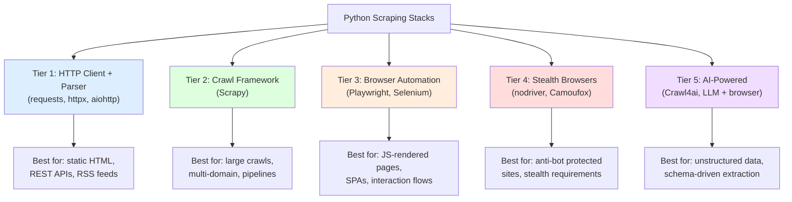
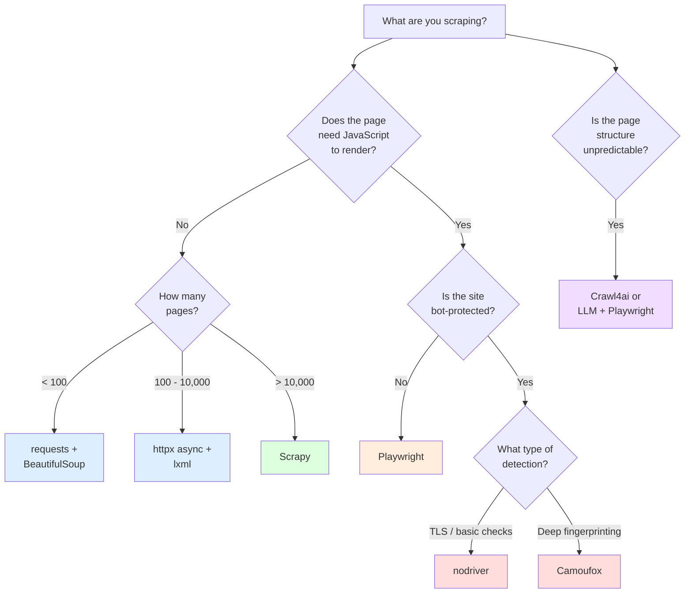
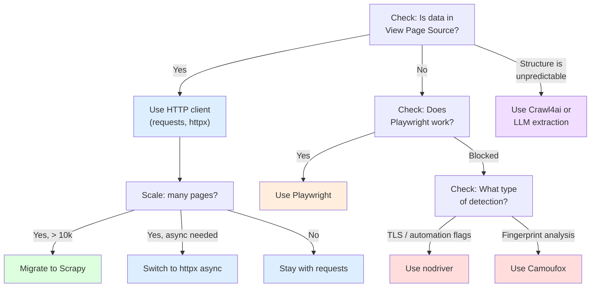

There is no single "best Python scraper." The question collapses the moment you look at what you actually need to automate. Fetching prices from a static HTML page is a fundamentally different problem from crawling 50,000 product listings across a JavaScript-heavy e-commerce site that runs Cloudflare. The tool that makes the first job trivial will make the second job impossible, and vice versa. This post walks through every major Python scraping stack, shows a minimal code example for each, and gives you a decision framework so you pick the right one on the first try instead of rewriting your scraper three times.

## The Landscape in 2026

The Python scraping ecosystem has matured into distinct tiers. Each tier adds capability but also adds complexity, resource usage, and setup time. The key insight is that you should always start at the simplest tier that can handle your target, and only escalate when you hit a wall.



## Tier 1: requests + BeautifulSoup

This is the most common Python scraping stack and the one every tutorial starts with. `requests` handles the HTTP layer. `BeautifulSoup` parses the HTML. Together they cover the majority of simple scraping tasks -- fetching a page, finding elements by CSS selector, and extracting text or attributes.

The sweet spot for this stack: sites that serve complete HTML without relying on JavaScript to render content. Product pages with server-side rendering, news articles, government databases, directory listings.

```python
import requests
from bs4 import BeautifulSoup

session = requests.Session()
session.headers.update({
    "User-Agent": "Mozilla/5.0 (Windows NT 10.0; Win64; x64) AppleWebKit/537.36"
})

response = session.get("https://example.com/products")
soup = BeautifulSoup(response.text, "html.parser")

products = []
for card in soup.select("div.product-card"):
    products.append({
        "name": card.select_one("h2.title").get_text(strip=True),
        "price": card.select_one("span.price").get_text(strip=True),
        "url": card.select_one("a")["href"],
    })

for p in products:
    print(f"{p['name']}: {p['price']}")
```

**Advantages:** Minimal dependencies. Fast to write. Low memory footprint. No browser overhead. Works in serverless environments, containers, and CI/CD pipelines without special setup.

**Limitations:** No JavaScript execution. No interaction with dynamic elements. No cookie-based session handling beyond basic cookies. Blocked easily by sites checking TLS fingerprints. For a detailed breakdown of when this lightweight approach outperforms browser-based tools, see our [Python requests vs Selenium speed comparison](/posts/python-requests-vs-selenium-speed-performance-comparison/).

**Install:**

```bash
pip install requests beautifulsoup4
```

## Tier 1 (Async): httpx or aiohttp + lxml

When you need to fetch hundreds or thousands of pages, sequential `requests` calls become a bottleneck. Async HTTP clients let you fire off many requests concurrently. Pair them with `lxml` instead of BeautifulSoup for parsing speed -- lxml's C backend parses HTML roughly 5-10x faster than BeautifulSoup with `html.parser`.

### httpx Example

`httpx` is the modern choice. It offers both sync and async interfaces with an API that mirrors `requests`, making migration straightforward.

```python
import httpx
import asyncio
from lxml import html

async def scrape_page(client: httpx.AsyncClient, url: str) -> dict:
    response = await client.get(url)
    tree = html.fromstring(response.text)

    return {
        "title": tree.xpath("//h1/text()")[0],
        "price": tree.xpath("//span[@class='price']/text()")[0],
    }

async def main():
    urls = [f"https://example.com/products/{i}" for i in range(1, 201)]

    async with httpx.AsyncClient(
        headers={"User-Agent": "Mozilla/5.0"},
        follow_redirects=True,
        timeout=30.0,
    ) as client:
        tasks = [scrape_page(client, url) for url in urls]
        results = await asyncio.gather(*tasks, return_exceptions=True)

    for result in results:
        if isinstance(result, dict):
            print(f"{result['title']}: {result['price']}")

asyncio.run(main())
```

### aiohttp Example

`aiohttp` is the older async option with a slightly different API, but it is battle-tested and performs well for high-concurrency workloads.

```python
import aiohttp
import asyncio
from lxml import html

async def scrape_page(session: aiohttp.ClientSession, url: str) -> dict:
    async with session.get(url) as response:
        text = await response.text()
        tree = html.fromstring(text)

        return {
            "title": tree.xpath("//h1/text()")[0],
            "price": tree.xpath("//span[@class='price']/text()")[0],
        }

async def main():
    urls = [f"https://example.com/products/{i}" for i in range(1, 201)]

    connector = aiohttp.TCPConnector(limit=50)
    async with aiohttp.ClientSession(
        connector=connector,
        headers={"User-Agent": "Mozilla/5.0"},
    ) as session:
        tasks = [scrape_page(session, url) for url in urls]
        results = await asyncio.gather(*tasks, return_exceptions=True)

    for result in results:
        if isinstance(result, dict):
            print(f"{result['title']}: {result['price']}")

asyncio.run(main())
```

**When to choose httpx over aiohttp:** If you want a cleaner API and the ability to switch between sync and async without changing your code structure. httpx also has better HTTP/2 support out of the box.

**When to choose aiohttp:** If you are already in an aiohttp-based project or need the raw connection-level control that aiohttp's connector system provides.

**Install:**

```bash
pip install httpx lxml
# or
pip install aiohttp lxml
```

## Tier 2: Scrapy

Scrapy is not just an HTTP client or a parser -- it is a complete crawling framework. It handles request scheduling, rate limiting, retries, redirects, item pipelines, middleware stacks, and data export out of the box. If you are building a spider that needs to crawl thousands of pages across multiple domains with structured output and error recovery, Scrapy eliminates the boilerplate you would otherwise write yourself.

```python
import scrapy

class ProductSpider(scrapy.Spider):
    name = "products"
    start_urls = ["https://example.com/products"]

    custom_settings = {
        "CONCURRENT_REQUESTS": 16,
        "DOWNLOAD_DELAY": 0.5,
        "RETRY_TIMES": 3,
        "FEEDS": {
            "products.json": {"format": "json"},
        },
    }

    def parse(self, response):
        for card in response.css("div.product-card"):
            yield {
                "name": card.css("h2.title::text").get(),
                "price": card.css("span.price::text").get(),
                "url": response.urljoin(card.css("a::attr(href)").get()),
            }

        next_page = response.css("a.next-page::attr(href)").get()
        if next_page:
            yield response.follow(next_page, callback=self.parse)
```

Run it with:

```bash
scrapy runspider products_spider.py
```

**What you get for free with Scrapy:**

- Automatic request deduplication
- Configurable concurrency and rate limiting per domain
- Built-in retry logic with exponential backoff
- Multiple output formats (JSON, CSV, XML, JSON Lines)
- Middleware system for proxies, headers, cookies
- Stats collection and logging
- `robots.txt` respect by default

**When Scrapy is overkill:** If you are scraping a single page or a handful of URLs once. The spider class structure and settings overhead do not pay off for small, one-shot tasks.

**Install:**

```bash
pip install scrapy
```

## Tier 3: Playwright

When the data you need is rendered by JavaScript after the initial page load, HTTP clients cannot help you. You need a real browser. Playwright is the current standard for browser automation in Python -- it is faster than Selenium, supports Chromium, Firefox, and WebKit, and its async-first design fits naturally into modern Python codebases.

```python
from playwright.async_api import async_playwright
import asyncio

async def scrape_spa():
    async with async_playwright() as p:
        browser = await p.chromium.launch(headless=True)
        page = await browser.new_page()

        await page.goto("https://example.com/products")
        await page.wait_for_selector("div.product-card")

        products = await page.evaluate("""
            () => Array.from(document.querySelectorAll('div.product-card')).map(card => ({
                name: card.querySelector('h2.title')?.textContent?.trim(),
                price: card.querySelector('span.price')?.textContent?.trim(),
                url: card.querySelector('a')?.href,
            }))
        """)

        for p_item in products:
            print(f"{p_item['name']}: {p_item['price']}")

        await browser.close()

asyncio.run(scrape_spa())
```

**When to use Playwright over Selenium:** Almost always in 2026. For a comprehensive breakdown of all the major options, check out our [Playwright vs Puppeteer vs Selenium vs Scrapy mega comparison](/posts/playwright-vs-puppeteer-vs-selenium-vs-scrapy-2026-mega-comparison/). Playwright launches faster, has better auto-wait mechanics, supports all major browsers with a single API, and its `page.evaluate()` gives you direct access to the DOM via JavaScript. Selenium still has a role in legacy test suites and when you need specific WebDriver protocol compatibility, but for new scraping projects, Playwright is the better choice.

```python
# Selenium equivalent for comparison
from selenium import webdriver
from selenium.webdriver.common.by import By
from selenium.webdriver.support.ui import WebDriverWait
from selenium.webdriver.support import expected_conditions as EC

driver = webdriver.Chrome()
driver.get("https://example.com/products")

wait = WebDriverWait(driver, 10)
wait.until(EC.presence_of_element_located((By.CSS_SELECTOR, "div.product-card")))

cards = driver.find_elements(By.CSS_SELECTOR, "div.product-card")
for card in cards:
    name = card.find_element(By.CSS_SELECTOR, "h2.title").text
    price = card.find_element(By.CSS_SELECTOR, "span.price").text
    print(f"{name}: {price}")

driver.quit()
```

**Install:**

```bash
pip install playwright
playwright install chromium
```


<figure>
  
  <figcaption>HTTP is the language every scraper must speak fluently. <span class="img-credit">Photo by Google DeepMind / <a href="https://www.pexels.com" target="_blank" rel="noopener noreferrer">Pexels</a></span></figcaption>
</figure>

## Tier 4: Stealth Browsers

Some sites run aggressive bot detection -- checking TLS fingerprints, canvas rendering, WebGL hashes, navigator properties, and dozens of other browser signals. Standard Playwright or Selenium will fail on these targets because their browser instances leak detectable automation artifacts. This is where stealth-focused tools come in.

### nodriver

`nodriver` launches an unmodified Chrome instance and communicates with it over the Chrome DevTools Protocol. Because it does not inject WebDriver hooks or modify the browser binary, it avoids the most common detection vectors. Our [complete guide to nodriver](/posts/nodriver-complete-guide-undetected-browser-automation-python/) covers setup and advanced usage in detail.

```python
import nodriver as uc
import asyncio

async def scrape_protected():
    browser = await uc.start()
    page = await browser.get("https://protected-site.com/data")

    # nodriver uses its own element selection API
    await page.sleep(3)  # let anti-bot checks settle

    cards = await page.query_selector_all("div.product-card")
    for card in cards:
        name_el = await card.query_selector("h2.title")
        price_el = await card.query_selector("span.price")
        if name_el and price_el:
            print(f"{name_el.text_all}: {price_el.text_all}")

    await browser.stop()

asyncio.run(scrape_protected())
```

### Camoufox

Camoufox takes a different approach -- it is a modified Firefox build that generates consistent, realistic fingerprints. Instead of trying to hide automation signals, it presents a browser profile that looks indistinguishable from a real user.

```python
from camoufox.sync_api import Camoufox

with Camoufox(headless=True) as browser:
    page = browser.new_page()
    page.goto("https://protected-site.com/data")
    page.wait_for_selector("div.product-card")

    products = page.query_selector_all("div.product-card")
    for card in products:
        name = card.query_selector("h2.title").text_content().strip()
        price = card.query_selector("span.price").text_content().strip()
        print(f"{name}: {price}")
```

**nodriver vs Camoufox:** nodriver works well against Cloudflare and similar protections because it uses an unmodified Chrome. Camoufox excels when the detection system focuses on browser fingerprint consistency -- it generates complete, coherent fingerprints that survive cross-referencing checks. For a broader look at how these tools fit into the [stealth browser landscape in 2026](/posts/stealth-browsers-in-2026-camoufox-nodriver-and-the-anti-detection-arms-race/), choose based on what your target site actually detects.

**Install:**

```bash
pip install nodriver
# or
pip install camoufox
camoufox fetch
```

## Tier 5: AI-Powered Extraction

When the page structure is unpredictable, changes frequently, or you need to extract meaning rather than specific elements, LLM-powered tools can parse pages without hardcoded selectors.

### Crawl4ai

Crawl4ai combines browser automation with LLM-based extraction. You give it a URL and a schema, and it returns structured data without you writing any selectors.

```python
from crawl4ai import AsyncWebCrawler, BrowserConfig, CrawlerRunConfig
from crawl4ai.extraction_strategy import LLMExtractionStrategy
from pydantic import BaseModel
import asyncio

class Product(BaseModel):
    name: str
    price: str
    availability: str

async def extract_products():
    strategy = LLMExtractionStrategy(
        provider="openai/gpt-4o",
        schema=Product.model_json_schema(),
        instruction="Extract all product information from this page.",
    )

    browser_config = BrowserConfig(headless=True)
    run_config = CrawlerRunConfig(extraction_strategy=strategy)

    async with AsyncWebCrawler(config=browser_config) as crawler:
        result = await crawler.arun(
            url="https://example.com/products",
            config=run_config,
        )

        print(result.extracted_content)

asyncio.run(extract_products())
```

### Custom LLM + Browser

If you do not want a framework, you can combine Playwright with any LLM API directly. Fetch the HTML, feed it to the model, and parse the structured output.

```python
from playwright.async_api import async_playwright
from openai import AsyncOpenAI
import asyncio
import json

async def llm_extract():
    async with async_playwright() as p:
        browser = await p.chromium.launch(headless=True)
        page = await browser.new_page()
        await page.goto("https://example.com/products")
        await page.wait_for_selector("div.product-card")

        html = await page.content()
        await browser.close()

    client = AsyncOpenAI()
    response = await client.chat.completions.create(
        model="gpt-4o",
        messages=[
            {
                "role": "system",
                "content": "Extract products from this HTML. Return JSON array with name, price, url.",
            },
            {"role": "user", "content": html[:50000]},
        ],
        response_format={"type": "json_object"},
    )

    products = json.loads(response.choices[0].message.content)
    print(json.dumps(products, indent=2))

asyncio.run(llm_extract())
```

**When AI extraction makes sense:** Pages with inconsistent structure. Sites that change their markup frequently. Extraction tasks where you need [LLM-powered structured data extraction](/posts/best-llm-structured-data-extraction-html-2026/) and semantic understanding (e.g., "find the return policy" rather than "find the element with class `policy-text`"). Also useful for extracting data from pages you have never seen before, without writing custom parsers.

**When AI extraction is overkill:** If the page has a stable, predictable structure. A CSS selector is cheaper, faster, and more reliable than an LLM call for well-structured pages.

**Install:**

```bash
pip install crawl4ai
crawl4ai-setup
# or for custom approach
pip install playwright openai
```

## The Decision Tree

Use this flowchart to pick your starting stack based on your actual requirements.



## Common Stack Combinations

In practice, you often combine tools from different tiers. Here are the stacks that real scraping projects commonly use.

### requests + BeautifulSoup (The Classic)

Best for quick scripts, prototyping, and sites with server-rendered HTML. This is the stack you reach for when you need to pull data from a page in 20 lines of code.

```python
# Everything you need
import requests
from bs4 import BeautifulSoup

resp = requests.get("https://example.com/page")
soup = BeautifulSoup(resp.text, "html.parser")
data = [el.text for el in soup.select(".target-class")]
```

### Scrapy + Playwright (The Crawler with JS Support)

Scrapy handles scheduling, retries, and pipelines. Playwright handles pages that need JavaScript rendering. The `scrapy-playwright` integration lets you mark specific requests for browser rendering while keeping simple pages on the fast HTTP path.

```python
import scrapy

class HybridSpider(scrapy.Spider):
    name = "hybrid"
    custom_settings = {
        "DOWNLOAD_HANDLERS": {
            "https": "scrapy_playwright.handler.ScrapyPlaywrightDownloadHandler",
        },
        "TWISTED_REACTOR": "twisted.internet.asyncioreactor.AsyncioSelectorReactor",
        "PLAYWRIGHT_LAUNCH_OPTIONS": {"headless": True},
    }

    def start_requests(self):
        # Static page -- no browser needed
        yield scrapy.Request(
            "https://example.com/sitemap.xml",
            callback=self.parse_sitemap,
        )

    def parse_sitemap(self, response):
        urls = response.xpath("//loc/text()").getall()
        for url in urls:
            # JS-rendered page -- use Playwright
            yield scrapy.Request(
                url,
                callback=self.parse_product,
                meta={"playwright": True},
            )

    def parse_product(self, response):
        yield {
            "name": response.css("h1::text").get(),
            "price": response.css(".price::text").get(),
        }
```

### httpx + lxml (The Speed Stack)

For high-volume fetching where every millisecond matters. httpx gives you async HTTP with connection pooling. lxml gives you the fastest HTML parsing available in Python.

```python
import httpx
from lxml import html
import asyncio

async def fast_scrape(urls: list[str]) -> list[dict]:
    results = []
    async with httpx.AsyncClient(timeout=20.0) as client:
        sem = asyncio.Semaphore(30)

        async def fetch(url):
            async with sem:
                resp = await client.get(url)
                tree = html.fromstring(resp.text)
                return {
                    "url": url,
                    "title": tree.xpath("//h1/text()")[0] if tree.xpath("//h1/text()") else None,
                }

        results = await asyncio.gather(*[fetch(u) for u in urls])
    return [r for r in results if r]
```


<figure>
  
  <figcaption>Requests and responses are the conversation between your scraper and the server. <span class="img-credit">Photo by RDNE Stock project / <a href="https://www.pexels.com" target="_blank" rel="noopener noreferrer">Pexels</a></span></figcaption>
</figure>

## Comparison Table

Here is how the major options stack up across the dimensions that matter most.

| Tool | Speed | Setup Complexity | JS Support | Stealth | Best For |
|------|-------|-----------------|------------|---------|----------|
| requests + BS4 | Fast | Minimal | None | None | Simple static pages |
| httpx + lxml | Very fast | Low | None | None | High-volume static scraping |
| aiohttp + lxml | Very fast | Medium | None | None | High-concurrency workloads |
| Scrapy | Fast | Medium | Via plugin | None | Large crawls with pipelines |
| Playwright | Moderate | Medium | Full | Low | JS-rendered SPAs |
| Selenium | Slow | Medium | Full | Low | Legacy projects, specific WebDriver needs |
| nodriver | Moderate | Low | Full | High | Cloudflare-protected sites |
| Camoufox | Moderate | Medium | Full | Very high | Deep fingerprint detection |
| Crawl4ai | Slow | High | Full | Medium | Unstructured/unpredictable pages |

**Speed** refers to per-page throughput. HTTP clients are inherently faster than browser-based tools because they skip rendering entirely. Browser tools add 200-2000ms per page for rendering overhead.

**Stealth** refers to how well the tool avoids bot detection. HTTP clients have no stealth because they do not present browser fingerprints. Stealth browsers are purpose-built to bypass detection. Standard browser automation tools (Playwright, Selenium) fall in between -- they run real browsers but leak automation signals.

## Mixing and Matching: A Real-World Pattern

Most production scrapers do not use a single tool. A common pattern is to start with an HTTP client for speed, detect when a page needs browser rendering, and escalate only for those pages.

```python
import httpx
from bs4 import BeautifulSoup
from playwright.async_api import async_playwright
import asyncio

async def smart_scrape(url: str) -> dict:
    """Try HTTP first. Fall back to browser if content is missing."""

    # Attempt 1: Fast HTTP fetch
    async with httpx.AsyncClient() as client:
        resp = await client.get(url)
        soup = BeautifulSoup(resp.text, "html.parser")
        title = soup.select_one("h1.product-title")

        if title:
            return {
                "source": "http",
                "title": title.get_text(strip=True),
                "price": soup.select_one("span.price").get_text(strip=True),
            }

    # Attempt 2: JS rendering needed
    async with async_playwright() as p:
        browser = await p.chromium.launch(headless=True)
        page = await browser.new_page()
        await page.goto(url)
        await page.wait_for_selector("h1.product-title", timeout=10000)

        data = await page.evaluate("""
            () => ({
                title: document.querySelector('h1.product-title')?.textContent?.trim(),
                price: document.querySelector('span.price')?.textContent?.trim(),
            })
        """)
        await browser.close()

        return {"source": "browser", **data}
```

This pattern keeps 80-90% of your scraping on the fast HTTP path while handling the remaining JS-heavy pages correctly.

## Performance Expectations

Rough throughput numbers for each stack when scraping a typical e-commerce site with 50KB pages.

| Stack | Pages/second (single machine) | Memory Usage |
|-------|-------------------------------|--------------|
| requests + BS4 (sequential) | 5-15 | ~50 MB |
| httpx async + lxml (50 concurrent) | 100-300 | ~200 MB |
| Scrapy (16 concurrent) | 50-150 | ~150 MB |
| Playwright (5 browser tabs) | 3-8 | ~500 MB |
| nodriver (single tab) | 1-3 | ~300 MB |

These numbers assume a cooperative server with reasonable response times. Real-world throughput depends heavily on network latency, server rate limits, and page complexity.

## Start Simple, Escalate When Needed

The most common mistake in scraping is reaching for a browser when an HTTP client would work. The second most common mistake is spending days fighting an HTTP client when a browser would solve the problem in minutes.

Here is the practical rule: open the page in your browser, right-click "View Page Source" (not "Inspect Element"), and search for the data you need. If the data appears in the raw HTML source, use `requests` + `BeautifulSoup` or `httpx` + `lxml`. If the data is absent from the source but visible on the rendered page, you need a browser -- start with Playwright. If Playwright gets blocked, try `nodriver` or `Camoufox`. If the page structure is chaotic or changes constantly, consider AI-powered extraction.



Every scraping tool exists because a simpler tool could not handle a specific class of problem. Understand what each tool adds, and you will never over-engineer or under-engineer your scraper again.
