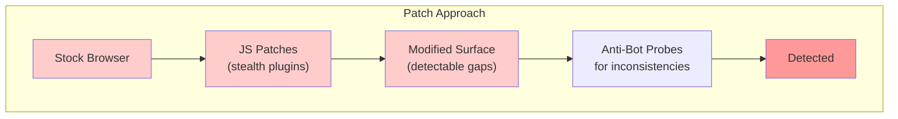
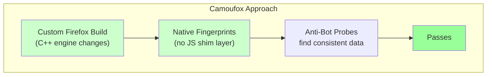
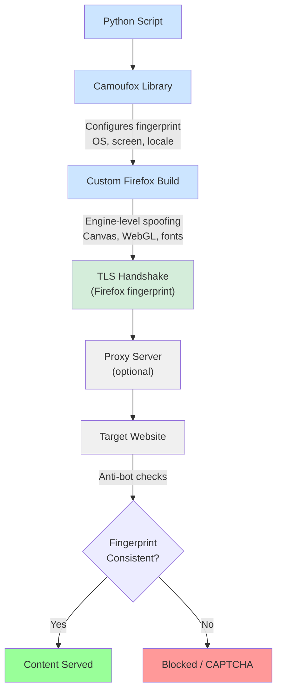

Camoufox is not a browser extension or a set of JavaScript patches layered on top of Firefox. It modifies Firefox at the C++ engine level, rewriting the source code that produces browser fingerprints so that no detectable shim exists for anti-bot systems to find. When a detection script renders a canvas, probes WebGL parameters, or enumerates font metrics, the responses come from compiled native code rather than from JavaScript overrides that can be discovered and flagged. This tutorial walks through installation, configuration, and practical usage patterns so you can start using Camoufox in your own projects.

## How Camoufox Differs from Patching

Most stealth approaches work by running a stock browser and patching its behavior from the outside. Selenium stealth plugins override `navigator.webdriver`. Puppeteer-stealth hooks into JavaScript APIs. These patches exist in JavaScript, and detection scripts can probe for inconsistencies between the patched surface and the underlying engine. Our overview of [stealth browsers in 2026](/posts/stealth-browsers-in-2026-camoufox-nodriver-and-the-anti-detection-arms-race/) covers how Camoufox fits into the broader anti-detection landscape.

Camoufox ships a custom-compiled Firefox binary where the fingerprint-producing code has been modified at the C++ level. There is no JavaScript layer to discover.





The canvas hash, WebGL renderer string, and font metrics all come from the same modified engine, so cross-referencing them produces a consistent profile that passes checks which trip up JavaScript-based stealth solutions. For a direct comparison of the two approaches, see [Camoufox vs Selenium anti-detection approaches compared](/posts/camoufox-vs-selenium-anti-detection-approaches-compared/).

## Installation

Camoufox is distributed as a Python package. The recommended install includes the GeoIP database for IP-based geolocation spoofing:

```bash
pip install camoufox[geoip]
```

On the first run, Camoufox automatically downloads its custom Firefox build. This is a one-time operation. The binary is cached locally and reused for subsequent runs. If you only need the core library without GeoIP support, use `pip install camoufox` instead.

Requirements:
- **Python 3.8+**
- **No separate Firefox installation needed** --- Camoufox downloads and manages its own custom build
- **Playwright is bundled** --- Camoufox uses Playwright internally but packages its own compatible version

Verify the installation:

```python
from camoufox.sync_api import Camoufox

with Camoufox() as browser:
    page = browser.new_page()
    page.goto("https://example.com")
    print(page.title())
```

If this prints `Example Domain`, your setup is working.

## Basic Usage with the Sync API

Camoufox provides a synchronous API that wraps Playwright's async internals. For scripts that do not need concurrency, this is the simplest way to get started.

```python
from camoufox.sync_api import Camoufox


def scrape_page(url):
    with Camoufox(headless=True) as browser:
        page = browser.new_page()
        page.goto(url, wait_until="networkidle")

        title = page.title()
        links = page.eval_on_selector_all(
            "a[href]",
            "elements => elements.map(el => ({text: el.textContent.trim(), href: el.href}))"
        )
        return {"title": title, "links": links}


result = scrape_page("https://example.com")
print(result)
```

The `with` statement ensures the browser closes cleanly when the block exits. Since Camoufox uses Playwright internally, the page object supports the full Playwright API: `page.locator()`, `page.query_selector()`, `page.evaluate()`, and everything else you would expect. You can also use Camoufox [with JavaScript for browser automation](/posts/camoufox-with-javascript-browser-automation-without-detection/) if Python is not your primary language.

## Async API for Concurrent Scraping

When you need to scrape multiple pages simultaneously, the async API lets you run browser operations concurrently:

```python
import asyncio
from camoufox.async_api import AsyncCamoufox


async def scrape_url(browser, url):
    page = await browser.new_page()
    try:
        await page.goto(url, wait_until="networkidle", timeout=30000)
        title = await page.title()
        content = await page.text_content("body")
        return {"url": url, "title": title, "length": len(content or "")}
    finally:
        await page.close()


async def main():
    urls = [
        "https://example.com",
        "https://httpbin.org/get",
        "https://quotes.toscrape.com",
    ]

    async with AsyncCamoufox(headless=True) as browser:
        tasks = [scrape_url(browser, url) for url in urls]
        results = await asyncio.gather(*tasks, return_exceptions=True)

        for result in results:
            if isinstance(result, Exception):
                print(f"Error: {result}")
            else:
                print(f"{result['url']} - {result['title']} ({result['length']} chars)")


asyncio.run(main())
```

Each URL gets its own page (tab) within a single browser instance, which is more efficient than launching separate browsers. The `return_exceptions=True` flag prevents one failed page from crashing the entire batch.

## Configuration Options

Camoufox exposes several configuration parameters that control how the browser presents itself. These are passed to the `Camoufox` or `AsyncCamoufox` constructor.

### OS Spoofing and Screen Size

```python
from camoufox.sync_api import Camoufox

with Camoufox(
    headless=True,
    os="windows",                              # "windows", "macos", or "linux"
    screen={"width": 1920, "height": 1080},    # Match a plausible resolution
) as browser:
    page = browser.new_page()
    page.goto("https://example.com")
```

When you set `os`, Camoufox adjusts not just the User-Agent but also navigator properties, platform strings, and font lists to match the target OS. This consistency is what separates engine-level spoofing from header-only changes.

### Human-Like Behavior and GeoIP

```python
from camoufox.sync_api import Camoufox

with Camoufox(
    headless=True,
    humanize=True,    # Realistic delays and mouse movement patterns
    geoip=True,       # Match locale/timezone to proxy IP location
    proxy={
        "server": "http://proxy.example.com:8080",
        "username": "user",
        "password": "pass",
    },
) as browser:
    page = browser.new_page()
    page.goto("https://example.com")
```

When `humanize` is enabled, clicks include slight position jitter and timing variation. The `geoip=True` flag eliminates a common detection vector: a browser claiming US locale and timezone while connecting from a German IP address.

## Fingerprint Verification

After configuring Camoufox, verify what anti-bot systems actually see:

```python
from camoufox.sync_api import Camoufox

with Camoufox(headless=False, os="windows") as browser:
    page = browser.new_page()

    page.goto("https://browserleaks.com/canvas")
    page.wait_for_timeout(5000)
    page.screenshot(path="canvas_fingerprint.png")

    page.goto("https://creepjs.com")
    page.wait_for_timeout(10000)
    page.screenshot(path="creepjs_report.png")
```

What to look for: the canvas hash should be consistent with the claimed OS and browser version. The CreepJS trust score should be high, indicating no detectable inconsistencies. The `navigator.webdriver` property should be `undefined` or `false`.

## Headless vs Headed Mode

Headless mode uses less memory, runs faster, and works on servers without a display. Camoufox's headless implementation avoids the fingerprint leaks that plague stock Firefox headless --- properties like `window.outerHeight` return plausible values rather than the zeros that typically betray headless browsers.

Headed mode is essential for debugging. When a site blocks your scraper, switching to headed lets you see CAPTCHA challenges, watch page loads, and inspect the DOM interactively. If you encounter blocks in headless that do not appear in headed mode, the target site likely has headless-specific detection.


<figure>
  
  <figcaption>Firefox's architecture offers unique advantages for fingerprint resistance. <span class="img-credit">Photo by Caio / <a href="https://www.pexels.com" target="_blank" rel="noopener noreferrer">Pexels</a></span></figcaption>
</figure>

## Using with Proxies

Camoufox accepts proxy configuration through the same format Playwright uses:

```python
from camoufox.sync_api import Camoufox

# HTTP proxy
with Camoufox(
    headless=True,
    proxy={"server": "http://proxy.example.com:8080", "username": "user", "password": "pass"},
) as browser:
    page = browser.new_page()
    page.goto("https://httpbin.org/ip")
    print(page.text_content("body"))

# SOCKS5 proxy
with Camoufox(
    headless=True,
    proxy={"server": "socks5://proxy.example.com:1080"},
) as browser:
    page = browser.new_page()
    page.goto("https://httpbin.org/ip")
```

Combining proxies with `geoip=True` automatically sets the browser locale and timezone to match the proxy's geographic location.

## Persistent Profiles

By default, Camoufox creates a fresh profile for each session. For tasks requiring logged-in state across runs, specify a persistent profile directory:

```python
import os
from camoufox.sync_api import Camoufox

PROFILE_DIR = os.path.expanduser("~/.camoufox_profiles/my_session")

# First run: log in and save the session
with Camoufox(headless=False, persistent_context=True, user_data_dir=PROFILE_DIR) as browser:
    page = browser.new_page()
    page.goto("https://example.com/login")
    page.fill("#username", "my_user")
    page.fill("#password", "my_password")
    page.click("#login-button")
    page.wait_for_url("**/dashboard**")

# Later runs: reuse the saved session
with Camoufox(headless=True, persistent_context=True, user_data_dir=PROFILE_DIR) as browser:
    page = browser.new_page()
    page.goto("https://example.com/dashboard")
    print(page.text_content(".dashboard-data"))
```

Be careful with persistent profiles when using fingerprint spoofing. Each profile should use a consistent set of fingerprint parameters --- logging in with one spoofed OS and resuming with a different one creates inconsistencies that detection systems can flag.

## Scraping Example: Extracting Data from a Protected Site

A complete example combining multiple Camoufox features:

```python
import json
from camoufox.sync_api import Camoufox


def scrape_protected_site():
    with Camoufox(
        headless=True,
        os="windows",
        humanize=True,
        geoip=True,
        proxy={"server": "http://us-proxy.example.com:8080", "username": "user", "password": "pass"},
    ) as browser:
        page = browser.new_page()
        page.goto("https://protected-site.example.com/products", wait_until="networkidle")

        # Wait for anti-bot check to clear
        page.wait_for_selector(".product-list", timeout=15000)

        # Scroll to trigger lazy-loaded content
        for _ in range(3):
            page.evaluate("window.scrollBy(0, window.innerHeight)")
            page.wait_for_timeout(1500)

        # Extract product data
        products = page.evaluate("""
            () => {
                const items = document.querySelectorAll('.product-card');
                return Array.from(items).map(item => ({
                    name: item.querySelector('.product-name')?.textContent?.trim(),
                    price: item.querySelector('.product-price')?.textContent?.trim(),
                    rating: item.querySelector('.product-rating')?.getAttribute('data-score'),
                    url: item.querySelector('a')?.href,
                }));
            }
        """)

        return products


products = scrape_protected_site()
with open("products.json", "w") as f:
    json.dump(products, f, indent=2)
```

## Common Issues: Firefox vs Chrome Differences

Camoufox is built on Firefox, not Chrome. If you are coming from Playwright with Chromium or from Puppeteer, there are important differences.

**Chrome DevTools Protocol is unavailable.** CDP is a Chrome-specific protocol. Any code that relies on `new_cdp_session()` or CDP events needs to be rewritten using Playwright's standard cross-browser API. If you are coming from a Playwright-based workflow, our [Playwright vs Camoufox stealth comparison](/posts/playwright-vs-camoufox-stealth-automation-head-to-head/) covers the key differences.

**Selector edge cases.** Most CSS selectors work identically, but Chrome-specific pseudo-elements may behave differently. Always test your selectors against Firefox. Standard selectors and Playwright text selectors (`text=Add to cart`) work everywhere.

**Network interception.** Route handlers work, but request and response objects may have different properties available compared to Chromium:

```python
from camoufox.sync_api import Camoufox

with Camoufox(headless=True) as browser:
    page = browser.new_page()

    # Block images and tracking scripts to speed up scraping
    page.route("**/*.{png,jpg,jpeg,gif,svg,webp}", lambda route: route.abort())
    page.route("**/analytics.js", lambda route: route.abort())

    page.goto("https://example.com")
```

## Performance Tips

Camoufox launches a full browser, which is heavier than HTTP-only scraping libraries. These practices help manage resource consumption.

**Reuse browser instances.** Open multiple pages within one browser rather than creating a new browser per page. Close pages when done with `page.close()`.

**Block unnecessary resources.** Images, fonts, and media consume bandwidth without contributing to data extraction:

```python
page.route(
    "**/*",
    lambda route: route.abort()
    if route.request.resource_type in ["image", "font", "media"]
    else route.continue_(),
)
```

**Use domcontentloaded instead of networkidle.** The `networkidle` wait stalls on sites with continuous background requests. Wait for `domcontentloaded` and then use `wait_for_selector` for the specific element you need:

```python
page.goto(url, wait_until="domcontentloaded")
page.wait_for_selector(".product-list")
```

## Architecture Overview



Each layer contributes to stealth: the Camoufox library configures fingerprint parameters, the custom Firefox build produces consistent fingerprints from native code, the TLS handshake uses Firefox's legitimate JA3/JA4 fingerprint, and the optional proxy routes traffic through a clean IP with locale matching. These layers reflect the broader [evolution of web scraping detection methods](/posts/evolution-web-scraping-detection-methods-timeline/) that have driven the need for engine-level stealth.

## Quick Reference

```python
from camoufox.sync_api import Camoufox

with Camoufox(
    headless=True,                    # Run without visible window
    os="windows",                     # Spoof as Windows/macOS/Linux
    humanize=True,                    # Human-like interaction patterns
    geoip=True,                       # Match locale to proxy IP
    screen={"width": 1920, "height": 1080},
    proxy={
        "server": "http://proxy:8080",
        "username": "user",
        "password": "pass",
    },
    persistent_context=True,
    user_data_dir="/path/to/profile",
) as browser:
    page = browser.new_page()
    page.goto("https://example.com")
```

Camoufox handles the hard part of stealth --- making fingerprints consistent at the engine level --- so you can focus on the scraping logic itself. Start with the defaults, verify your fingerprint with the tools described above, and add configuration as needed based on what the target site's detection system is actually checking.
