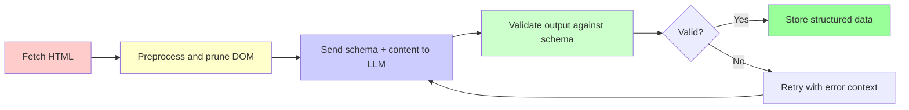
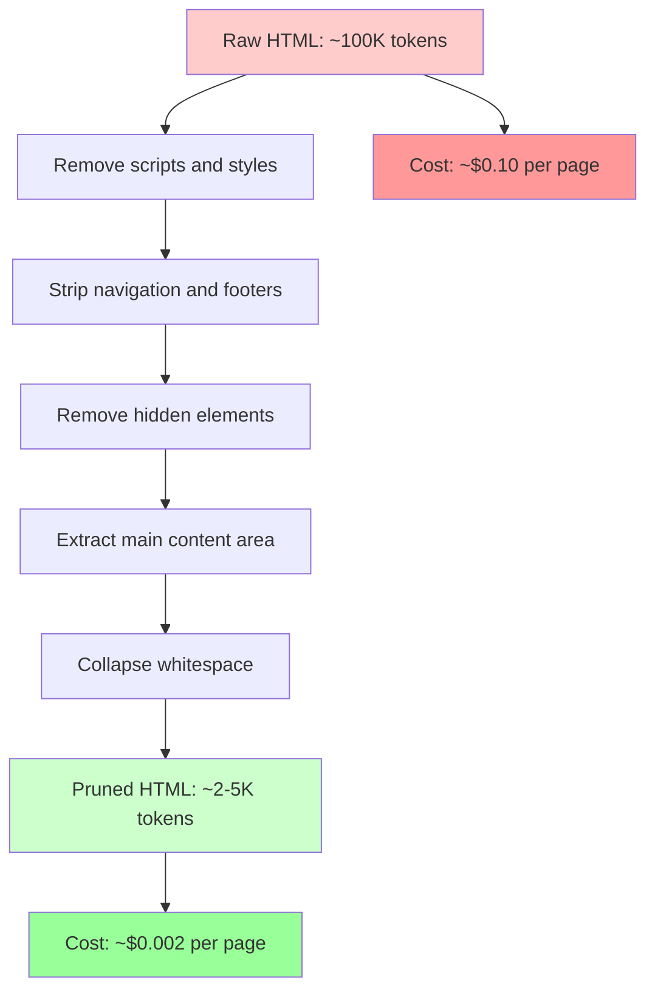
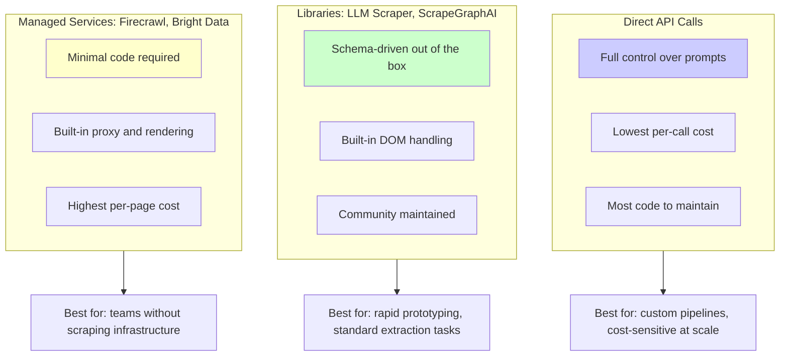

The biggest change in web scraping over the past year has not been a new browser automation framework or a faster HTTP client. It has been schema-driven LLM extraction -- a pattern where you define the exact structure of the data you want and let a language model figure out how to pull it from raw HTML. No more writing CSS selectors that break when a site redesigns. No more maintaining XPath expressions for every edge case. You describe the output, and the LLM delivers it.

Production systems are running this pattern today. ScrapeGraphAI lets you describe extraction tasks in plain English. LLM Scraper uses Zod schemas to constrain TypeScript extraction. A February 2026 paper from Cairo University demonstrated that even a 0.6 billion parameter model can hit state-of-the-art extraction accuracy when paired with intelligent DOM pruning. The AI-based web scraping market is projected to reach $3.16 billion by 2029, growing at a 39.4% compound annual rate.

This post covers the practical mechanics of schema-driven LLM extraction: how to define schemas, feed content to models, validate output, handle failures, and keep costs under control.

## The Schema-Driven Extraction Pipeline

The core idea is simple. Instead of writing imperative code that navigates the DOM and extracts fields one by one, you declare what you want and let the LLM handle the how. The pipeline has four stages.



First, fetch the raw HTML. This can be a simple HTTP request for static pages or a browser render for JavaScript-heavy sites. Then preprocess by stripping out navigation, ads, scripts, and other noise. This step matters for controlling costs, since every token sent to an LLM costs money. Next, send the cleaned content along with your schema to the LLM. The model returns structured data that conforms to your schema. Finally, validate the output against the schema. If fields are missing or types are wrong, retry with the validation error included in the prompt so the model can self-correct.

## Defining Schemas in Python with Pydantic

Pydantic is the natural choice for schema definition in Python. Its models serve double duty: they define what you want the LLM to extract, and they validate the output when it comes back.

```python
from pydantic import BaseModel, Field
from typing import Optional

class ProductListing(BaseModel):
    """Schema for extracting product data from e-commerce pages."""
    name: str = Field(description="The product name or title")
    price: float = Field(description="The current price in USD")
    original_price: Optional[float] = Field(
        default=None,
        description="The original price before discount, if shown"
    )
    currency: str = Field(default="USD", description="The price currency code")
    rating: Optional[float] = Field(
        default=None,
        description="The average rating out of 5 stars"
    )
    review_count: Optional[int] = Field(
        default=None,
        description="The total number of reviews"
    )
    in_stock: bool = Field(description="Whether the product is currently in stock")
    description: str = Field(description="The product description text")

class ProductPage(BaseModel):
    """Top-level schema for extracting all products from a page."""
    products: list[ProductListing]
    page_title: str
    total_results: Optional[int] = None
```

The `Field(description=...)` annotations are not just documentation. They become part of the prompt sent to the LLM, guiding the model on what each field means and where to look for it.

## Extraction with the OpenAI API

With your schema defined, extraction is a single API call. Modern LLM APIs support structured output natively, meaning the model is constrained to return valid JSON matching your schema.

```python
import json
import requests
from openai import OpenAI
from pydantic import ValidationError

client = OpenAI()

def extract_products(html_content: str) -> ProductPage:
    """Extract structured product data from HTML using an LLM."""

    # Generate the JSON schema from the Pydantic model
    schema = ProductPage.model_json_schema()

    response = client.chat.completions.create(
        model="gpt-4o",
        messages=[
            {
                "role": "system",
                "content": (
                    "You are a data extraction assistant. "
                    "Extract structured data from the provided HTML content. "
                    "Return only valid JSON matching the specified schema. "
                    "If a field cannot be determined, use null."
                ),
            },
            {
                "role": "user",
                "content": f"Extract product data from this HTML:\n\n{html_content[:8000]}",
            },
        ],
        response_format={
            "type": "json_schema",
            "json_schema": {
                "name": "product_extraction",
                "schema": schema,
            },
        },
    )

    raw_output = response.choices[0].message.content

    # Validate against our Pydantic model
    try:
        return ProductPage.model_validate_json(raw_output)
    except ValidationError as e:
        print(f"Validation failed: {e}")
        # Retry with error context (shown later)
        raise


# Usage
html = requests.get("https://example.com/products").text
products = extract_products(html)

for product in products.products:
    print(f"{product.name}: ${product.price} ({'In stock' if product.in_stock else 'Out of stock'})")
```

## Defining Schemas in TypeScript with Zod

In the JavaScript ecosystem, Zod schemas serve the same purpose as Pydantic models. The LLM Scraper library by Mishushakov builds on this to provide a streamlined extraction API.

```javascript
// Install: npm install zod llm-scraper playwright

import { z } from 'zod';
import LLMScraper from 'llm-scraper';
import { chromium } from 'playwright';

// Define the extraction schema with Zod
const ProductSchema = z.object({
    products: z.array(z.object({
        name: z.string().describe('The product name or title'),
        price: z.number().describe('The current price in USD'),
        originalPrice: z.number().nullable()
            .describe('The original price before discount'),
        rating: z.number().nullable()
            .describe('The average rating out of 5 stars'),
        reviewCount: z.number().nullable()
            .describe('The total number of reviews'),
        inStock: z.boolean().describe('Whether the product is in stock'),
        description: z.string().describe('The product description'),
    })),
    pageTitle: z.string(),
    totalResults: z.number().nullable(),
});

async function extractProducts(url) {
    const browser = await chromium.launch({ headless: true });
    const page = await browser.newPage();
    await page.goto(url);

    // Initialize LLM Scraper with your preferred model
    const scraper = new LLMScraper(page);

    const result = await scraper.extract(ProductSchema, {
        prompt: 'Extract all product listings from this page.',
    });

    console.log(`Found ${result.products.length} products:`);
    for (const product of result.products) {
        console.log(`  ${product.name}: $${product.price}`);
    }

    await browser.close();
    return result;
}

extractProducts('https://example.com/products');
```

## DOM Pruning: Keeping LLM Extraction Affordable

LLM-powered scraping is expensive at scale. A single product page might contain 100,000 tokens of HTML. At typical API pricing, extracting data from a million pages could cost thousands of dollars. DOM pruning changes that equation.

The AXE paper from Cairo University, published in February 2026, showed a striking result. By intelligently pruning the DOM before sending it to an LLM, researchers reduced input tokens by 97.9% while maintaining state-of-the-art extraction accuracy with an F1 score of 88.1%. This worked even with a model of only 0.6 billion parameters.

Most of a web page's HTML is irrelevant to extraction. Navigation menus, footer links, script tags, style blocks, advertisements, and tracking pixels all consume tokens without contributing useful data. Removing them before the LLM sees the page cuts cost dramatically.



A practical DOM pruning implementation:

```python
from bs4 import BeautifulSoup
import re

def prune_dom(html: str, content_selector: str = None) -> str:
    """
    Prune HTML to reduce token count while preserving extractable content.
    Inspired by the AXE paper's approach to intelligent DOM reduction.
    """
    soup = BeautifulSoup(html, "html.parser")

    # Stage 1: Remove elements that never contain useful data
    tags_to_remove = [
        "script", "style", "noscript", "iframe", "svg",
        "link", "meta", "header", "footer", "nav",
    ]
    for tag in tags_to_remove:
        for element in soup.find_all(tag):
            element.decompose()

    # Stage 2: Remove hidden elements
    for element in soup.find_all(attrs={"style": re.compile(r"display:\s*none")}):
        element.decompose()
    for element in soup.find_all(attrs={"hidden": True}):
        element.decompose()
    for element in soup.find_all(attrs={"aria-hidden": "true"}):
        element.decompose()

    # Stage 3: Remove common noise by class/id patterns
    noise_patterns = re.compile(
        r"(cookie|consent|popup|modal|overlay|sidebar|widget|social|share|newsletter|subscribe|advert|tracking)",
        re.IGNORECASE,
    )
    for element in soup.find_all(
        attrs={"class": noise_patterns}
    ):
        element.decompose()
    for element in soup.find_all(
        attrs={"id": noise_patterns}
    ):
        element.decompose()

    # Stage 4: Focus on main content if a selector is provided
    if content_selector:
        main_content = soup.select_one(content_selector)
        if main_content:
            soup = BeautifulSoup(str(main_content), "html.parser")

    # Stage 5: Strip unnecessary attributes
    for element in soup.find_all(True):
        allowed_attrs = {"href", "src", "alt", "title", "class", "id"}
        attrs_to_remove = [
            attr for attr in element.attrs if attr not in allowed_attrs
        ]
        for attr in attrs_to_remove:
            del element[attr]

    # Stage 6: Collapse whitespace
    text = str(soup)
    text = re.sub(r"\s+", " ", text)
    text = re.sub(r">\s+<", "><", text)

    return text.strip()


# Usage
import requests
raw_html = requests.get("https://example.com/products").text
print(f"Original: {len(raw_html)} characters")

pruned = prune_dom(raw_html, content_selector="main")
print(f"Pruned: {len(pruned)} characters")
print(f"Reduction: {(1 - len(pruned)/len(raw_html))*100:.1f}%")
```

```javascript
// JavaScript DOM pruning using cheerio
const cheerio = require('cheerio');

function pruneDOM(html, contentSelector = null) {
    const $ = cheerio.load(html);

    // Remove non-content elements
    const tagsToRemove = [
        'script', 'style', 'noscript', 'iframe', 'svg',
        'link', 'meta', 'header', 'footer', 'nav'
    ];
    tagsToRemove.forEach(tag => $(tag).remove());

    // Remove hidden elements
    $('[style*="display: none"], [style*="display:none"]').remove();
    $('[hidden]').remove();
    $('[aria-hidden="true"]').remove();

    // Remove common noise patterns
    const noisePattern = /cookie|consent|popup|modal|overlay|sidebar|widget|social|share|newsletter|advert/i;
    $('[class]').each((_, el) => {
        const classes = $(el).attr('class') || '';
        if (noisePattern.test(classes)) $(el).remove();
    });
    $('[id]').each((_, el) => {
        const id = $(el).attr('id') || '';
        if (noisePattern.test(id)) $(el).remove();
    });

    // Focus on main content
    if (contentSelector && $(contentSelector).length) {
        const mainContent = $(contentSelector).html();
        return mainContent.replace(/\s+/g, ' ').trim();
    }

    return $.html().replace(/\s+/g, ' ').trim();
}

// Usage
const originalLength = html.length;
const pruned = pruneDOM(html, 'main');
console.log(`Reduced from ${originalLength} to ${pruned.length} characters`);
```

## Validation and Retry Logic

LLMs are probabilistic. Even with structured output modes, extraction can fail. Fields might be null when they should not be, prices might come back as strings instead of numbers, or the model might hallucinate data that is not on the page. Robust validation and retry logic is not optional.

```python
import json
from pydantic import ValidationError
from openai import OpenAI

client = OpenAI()

def extract_with_retry(
    html: str,
    schema_class,
    max_retries: int = 3,
    model: str = "gpt-4o",
) -> dict:
    """
    Extract data with automatic retry on validation failure.
    Each retry includes the previous error in the prompt for self-correction.
    """
    schema = schema_class.model_json_schema()
    last_error = None

    for attempt in range(max_retries):
        messages = [
            {
                "role": "system",
                "content": (
                    "Extract structured data from the HTML. "
                    "Return valid JSON matching the schema exactly."
                ),
            },
            {
                "role": "user",
                "content": f"HTML content:\n\n{html[:8000]}",
            },
        ]

        # On retry, include the validation error
        if last_error:
            messages.append({
                "role": "user",
                "content": (
                    f"Your previous extraction had validation errors: "
                    f"{last_error}. Please fix these issues."
                ),
            })

        response = client.chat.completions.create(
            model=model,
            messages=messages,
            response_format={
                "type": "json_schema",
                "json_schema": {"name": "extraction", "schema": schema},
            },
        )

        raw = response.choices[0].message.content

        try:
            result = schema_class.model_validate_json(raw)
            if attempt > 0:
                print(f"Succeeded on retry {attempt}")
            return result
        except ValidationError as e:
            last_error = str(e)
            print(f"Attempt {attempt + 1} failed: {last_error}")

    raise ValueError(
        f"Extraction failed after {max_retries} attempts. Last error: {last_error}"
    )
```

## Comparing LLM Scraping Approaches

The schema-driven pattern can be implemented several ways, from raw API calls to managed services. Each approach trades off control, cost, and convenience differently.



Direct API calls give you the most flexibility. You control the prompt, the model, the preprocessing, and the retry logic. This is the best option for production systems where you need to optimize cost and handle edge cases specific to your target sites.

Libraries like LLM Scraper and ScrapeGraphAI handle the boilerplate. LLM Scraper integrates Zod schemas with Playwright for end-to-end extraction in TypeScript. ScrapeGraphAI goes further, letting you describe extraction tasks in plain English without writing schemas at all. These work well for prototyping and for extraction tasks that do not require fine-grained control.

Managed services like Firecrawl turn websites into LLM-ready markdown and integrate with frameworks like LangChain and LlamaIndex. Bright Data has emerged as a market leader in this space, using Gemini to deliver up to 25 metadata fields per page. These services eliminate infrastructure concerns but cost more per extraction.

## Cost Optimization Strategies

Cost is the factor that determines whether LLM extraction makes it to production. Four strategies matter most.

Prune the DOM first, always. As shown above, pruning can reduce tokens by 95% or more. This is the single highest-impact optimization. Playwright's CLI achieves roughly a 4x reduction by converting pages to clean markdown before extraction, taking a page from around 114,000 tokens down to around 27,000.

Use the smallest model that works. The AXE paper proved that a 0.6B parameter model can match the accuracy of much larger models when the input is properly pruned. For straightforward extraction tasks like pulling product names and prices, you do not need GPT-4o. A smaller, cheaper model with good preprocessing often suffices.

Batch similar pages. If you are scraping a hundred pages from the same site, extract from a few pages first, then use the results to build a traditional scraper with CSS selectors. Use the LLM only for the pages where the traditional approach fails.

Cache aggressively. If the same page structure appears across thousands of URLs, cache the extraction logic, not just the results. Once you know that `div.price-tag > span.amount` contains the price on a given site, you do not need to ask the LLM again.

```python
# Hybrid approach: LLM generates selectors, traditional scraping executes them
import json
from openai import OpenAI
from bs4 import BeautifulSoup

client = OpenAI()

def generate_selectors(sample_html: str, fields: list[str]) -> dict:
    """
    Ask the LLM to identify CSS selectors for desired fields.
    Run this once per site, then use traditional scraping for all pages.
    """
    response = client.chat.completions.create(
        model="gpt-4o",
        messages=[
            {
                "role": "system",
                "content": (
                    "Analyze the HTML and return CSS selectors for each "
                    "requested field. Return a JSON object mapping field "
                    "names to CSS selectors."
                ),
            },
            {
                "role": "user",
                "content": (
                    f"Fields to extract: {fields}\n\n"
                    f"HTML sample:\n{sample_html[:6000]}"
                ),
            },
        ],
        response_format={"type": "json_object"},
    )

    return json.loads(response.choices[0].message.content)


def scrape_with_selectors(html: str, selectors: dict) -> dict:
    """Use the LLM-generated selectors for fast, cheap extraction."""
    soup = BeautifulSoup(html, "html.parser")
    result = {}

    for field, selector in selectors.items():
        element = soup.select_one(selector)
        result[field] = element.get_text(strip=True) if element else None

    return result


# Step 1: Generate selectors from a sample page (costs ~$0.01)
selectors = generate_selectors(
    sample_html,
    ["product_name", "price", "rating", "review_count"]
)
print(f"Generated selectors: {json.dumps(selectors, indent=2)}")

# Step 2: Use those selectors on thousands of pages (effectively free)
for page_html in all_pages:
    data = scrape_with_selectors(page_html, selectors)
    save_to_database(data)
```

## When to Use LLM Extraction vs Traditional Scraping

LLM extraction is powerful, but it is not always the right tool. Traditional CSS selector and XPath-based scraping remains faster, cheaper, and more predictable for well-structured sites that rarely change. LLM extraction works best in specific scenarios:

- Unstructured or inconsistent layouts where the same data appears in different HTML structures across pages
- Rapid prototyping where you need data from a new site within minutes, not hours
- Sites that change frequently, making brittle selectors a maintenance burden
- Complex extraction tasks like pulling entities, relationships, or sentiment from article text
- One-off extraction where the cost of building a custom scraper exceeds the cost of LLM calls

For high-volume, recurring extraction from stable sites, the hybrid approach -- where an LLM generates selectors that a traditional scraper executes -- offers the best of both worlds.

## Looking Ahead

The schema-driven extraction pattern is maturing fast. Costs are dropping as models get cheaper and DOM pruning techniques improve. Accuracy is already production-grade for most use cases. And the developer experience of defining what you want rather than how to get it is a real improvement in making web data accessible.

The remaining challenges are real but solvable. Cost at scale still requires careful optimization. Hallucination -- where models confidently return data that does not exist on the page -- demands robust validation. And the fastest-changing sites may need a combination of LLM extraction and traditional techniques to handle reliably.

For most new scraping projects, schema-driven LLM extraction is becoming the default starting point, and the tools supporting it are improving every month.
