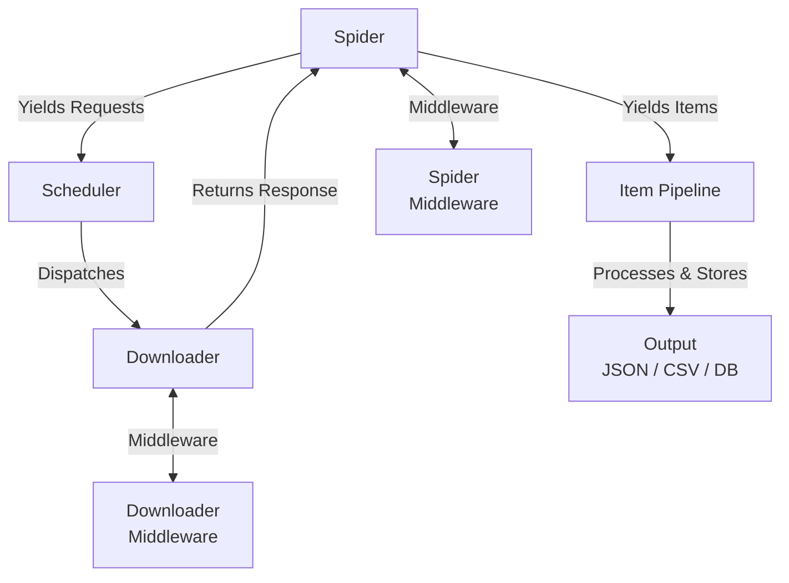
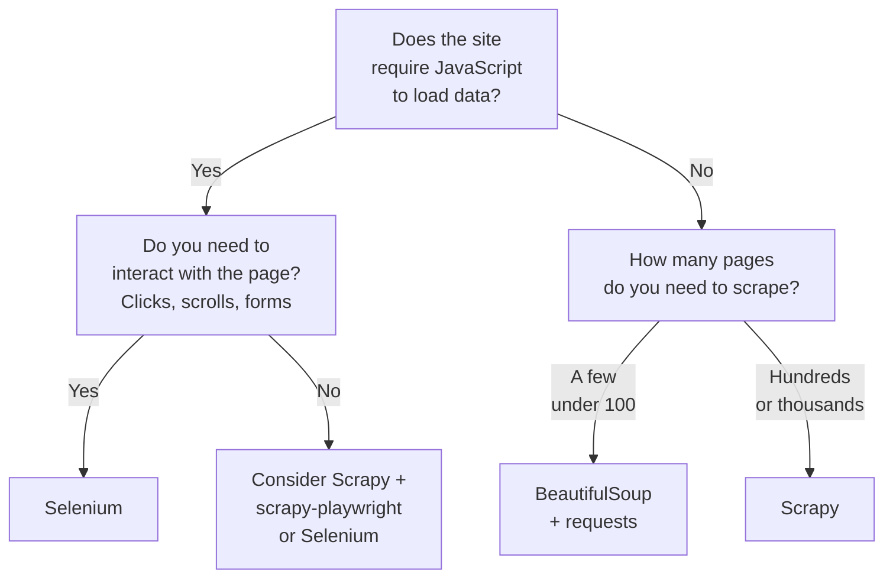
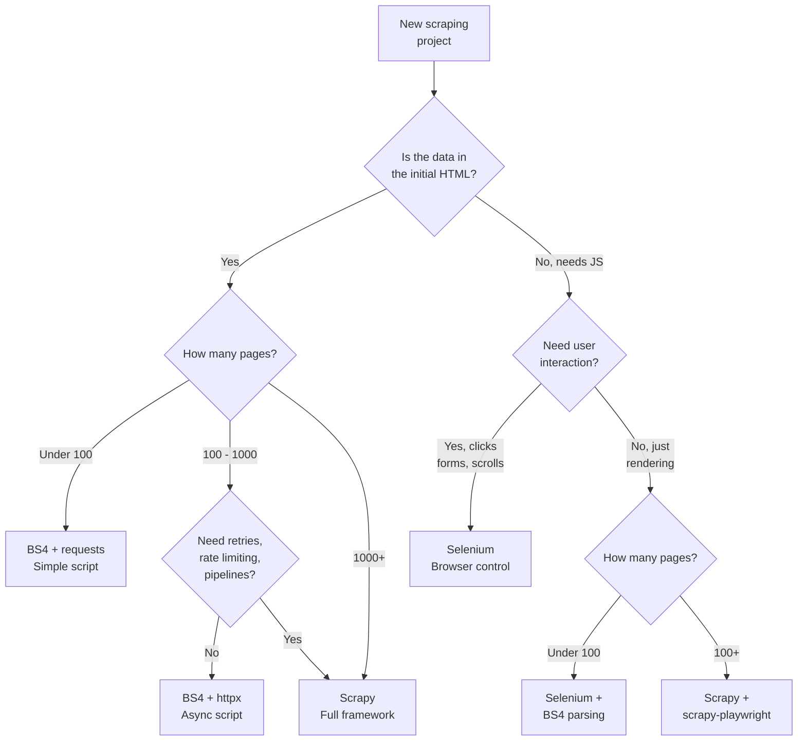

Python's three most popular scraping tools -- BeautifulSoup, Scrapy, and Selenium -- each fill a fundamentally different niche. BeautifulSoup is a parser. Scrapy is a framework. Selenium is a browser controller. Picking the wrong one does not just cost you time writing code; it costs you time rewriting code when you hit the tool's ceiling. For an even broader comparison that includes Playwright and Puppeteer, see our [Playwright vs Puppeteer vs Selenium vs Scrapy mega comparison](/posts/playwright-vs-puppeteer-vs-selenium-vs-scrapy-2026-mega-comparison/). This post gives you a decision tree, code comparisons, and a feature matrix so you can pick the right tool before writing a single line.

## BeautifulSoup: The Parser

BeautifulSoup (BS4) is not a scraper. It is an HTML and XML parser. It cannot fetch pages, execute JavaScript, or manage request sessions on its own. You pair it with an HTTP library like `requests` or `httpx`, hand it the raw HTML, and it builds a parse tree you can search.

This is its greatest strength and its greatest limitation. Because it does nothing beyond parsing, it is fast, lightweight, and simple. There are no event loops, no middleware stacks, no configuration files. You write a few lines of code and you have your data.

```python
import requests
from bs4 import BeautifulSoup

response = requests.get("https://books.toscrape.com/")
soup = BeautifulSoup(response.text, "html.parser")

for article in soup.select("article.product_pod"):
    title = article.select_one("h3 a")["title"]
    price = article.select_one("p.price_color").get_text(strip=True)
    print(f"{title}: {price}")
```

That is the entire program. No imports from a framework, no class definitions, no settings files. For small jobs -- pulling data from a handful of pages where the content is in the initial HTML -- BS4 is the fastest path from idea to data.

### What BS4 Does Well

- Parsing HTML with CSS selectors (`soup.select()`) and the find API (`soup.find()`, `soup.find_all()`)
- Navigating the document tree (parent, children, siblings)
- Handling malformed HTML gracefully
- Working with multiple parser backends (`html.parser`, `lxml`, `html5lib`)

### What BS4 Does Not Do

- Fetch pages (you need `requests`, `httpx`, or `aiohttp`)
- Execute JavaScript
- Handle concurrency, retries, or rate limiting
- Manage crawl state or URL queues
- Export data to structured formats

You build all of that yourself if you need it. For ten pages, that is fine. For ten thousand, you are reinventing Scrapy.

## Scrapy: The Framework

Scrapy is a complete web crawling framework. It handles HTTP requests, response parsing, link following, data pipelines, retries, rate limiting, middleware, and output serialization. You define spiders -- classes that describe how to navigate a site and what data to extract -- and Scrapy handles everything else.

```python
import scrapy


class BooksSpider(scrapy.Spider):
    name = "books"
    start_urls = ["https://books.toscrape.com/"]

    def parse(self, response):
        for article in response.css("article.product_pod"):
            yield {
                "title": article.css("h3 a::attr(title)").get(),
                "price": article.css("p.price_color::text").get(),
            }

        next_page = response.css("li.next a::attr(href)").get()
        if next_page:
            yield response.follow(next_page, callback=self.parse)
```

Run this with `scrapy runspider books_spider.py -o books.json` and Scrapy will crawl every page, follow pagination links, extract data, and write it to a JSON file. It handles concurrent requests, respects `DOWNLOAD_DELAY` settings, retries failed requests, and deduplicates URLs automatically.

### Scrapy's Architecture

Scrapy is built around an event-driven architecture with clearly separated components:



Each component is pluggable. You can write custom downloader middleware to rotate proxies, spider middleware to filter responses, and item pipelines to validate, deduplicate, or store data in a database.

### Key Scrapy Features

- **Asynchronous I/O**: Built on Twisted, handles many concurrent requests without threading
- **Built-in selectors**: CSS and XPath selectors on response objects
- **AutoThrottle**: Adjusts crawl speed based on server response times
- **Retry middleware**: Automatically retries failed requests with configurable policies
- **Feed exports**: Output to JSON, CSV, XML, or custom backends
- **Duplicate filtering**: Skips already-visited URLs by default
- **Robots.txt compliance**: Respects `robots.txt` by default (configurable)
- **Stats collection**: Tracks items scraped, requests made, errors, and timing

### The Boilerplate Trade-off

For a simple five-page scrape, Scrapy's structure feels heavy. You need a spider class, you deal with `yield` and callbacks, and the mental model of asynchronous request-response flow is more complex than a `for` loop with `requests.get()`. But that structure pays off the moment your crawl grows beyond a trivial size.

## Selenium: The Browser Controller

Selenium launches a real web browser -- Chrome, Firefox, Edge -- and controls it programmatically. It renders pages exactly as a human user would see them: JavaScript executes, AJAX calls fire, single-page applications load their data, and dynamic content appears in the DOM.

```python
from selenium import webdriver
from selenium.webdriver.common.by import By
from selenium.webdriver.chrome.options import Options
from selenium.webdriver.support.ui import WebDriverWait
from selenium.webdriver.support import expected_conditions as EC

options = Options()
options.add_argument("--headless=new")
driver = webdriver.Chrome(options=options)

driver.get("https://books.toscrape.com/")

wait = WebDriverWait(driver, 10)
articles = wait.until(
    EC.presence_of_all_elements_located((By.CSS_SELECTOR, "article.product_pod"))
)

for article in articles:
    title = article.find_element(By.CSS_SELECTOR, "h3 a").get_attribute("title")
    price = article.find_element(By.CSS_SELECTOR, "p.price_color").text
    print(f"{title}: {price}")

driver.quit()
```

Selenium is the heaviest option. It launches a browser process, allocates memory for rendering, and waits for page loads. But it is the only option when the data you need is generated by JavaScript after the initial page load.

### When You Need Selenium

- The page is a single-page application (React, Vue, Angular)
- Data loads via AJAX calls triggered by user interaction
- You need to click buttons, fill forms, or scroll to load content
- The site uses client-side rendering with no server-side fallback
- You need to interact with iframes, shadow DOM, or canvas elements

### When You Do Not Need Selenium

If the data is in the initial HTML response, Selenium is overkill. A `curl` to the page URL will get you the same HTML that Selenium renders, but in milliseconds instead of seconds and without launching a browser process.

## The Decision Tree

Before writing any code, ask yourself three questions. The answers point to the right tool.



The first branch is binary: does the content require a browser to render? If yes, you need a browser tool. If no, you pick between BS4 and Scrapy based on scale.


<figure>
  
  <figcaption>Parsing HTML doesn't always require a full browser. <span class="img-credit">Photo by Stanislav Kondratiev / <a href="https://www.pexels.com" target="_blank" rel="noopener noreferrer">Pexels</a></span></figcaption>
</figure>

## Code Comparison: Same Task, Three Tools

To make the differences concrete, here is the same task implemented with all three tools: scrape article titles and links from a blog's listing page, following pagination to get all articles.

### BeautifulSoup + requests

```python
import requests
from bs4 import BeautifulSoup

base_url = "https://example-blog.com"
url = f"{base_url}/articles"
articles = []

while url:
    response = requests.get(url, timeout=10)
    response.raise_for_status()
    soup = BeautifulSoup(response.text, "html.parser")

    for item in soup.select("div.article-card"):
        title = item.select_one("h2 a").get_text(strip=True)
        link = item.select_one("h2 a")["href"]
        articles.append({"title": title, "link": base_url + link})

    next_link = soup.select_one("a.next-page")
    url = base_url + next_link["href"] if next_link else None

print(f"Scraped {len(articles)} articles")
```

Straightforward. Sequential. No concurrency. You handle pagination manually with a `while` loop. Error handling, retries, and rate limiting are your responsibility.

### Scrapy

```python
import scrapy


class ArticleSpider(scrapy.Spider):
    name = "articles"
    start_urls = ["https://example-blog.com/articles"]
    custom_settings = {
        "FEEDS": {"articles.json": {"format": "json"}},
        "DOWNLOAD_DELAY": 1,
        "CONCURRENT_REQUESTS": 4,
    }

    def parse(self, response):
        for card in response.css("div.article-card"):
            yield {
                "title": card.css("h2 a::text").get().strip(),
                "link": response.urljoin(card.css("h2 a::attr(href)").get()),
            }

        next_page = response.css("a.next-page::attr(href)").get()
        if next_page:
            yield response.follow(next_page, callback=self.parse)
```

More structure, but Scrapy handles concurrency, retries, URL joining, output serialization, and duplicate filtering. The spider defines *what* to scrape; the framework handles *how*.

### Selenium

```python
from selenium import webdriver
from selenium.webdriver.common.by import By
from selenium.webdriver.chrome.options import Options
from selenium.webdriver.support.ui import WebDriverWait
from selenium.webdriver.support import expected_conditions as EC
import json

options = Options()
options.add_argument("--headless=new")
driver = webdriver.Chrome(options=options)

articles = []
driver.get("https://example-blog.com/articles")

while True:
    wait = WebDriverWait(driver, 10)
    cards = wait.until(
        EC.presence_of_all_elements_located((By.CSS_SELECTOR, "div.article-card"))
    )

    for card in cards:
        title_el = card.find_element(By.CSS_SELECTOR, "h2 a")
        articles.append({
            "title": title_el.text.strip(),
            "link": title_el.get_attribute("href"),
        })

    try:
        next_btn = driver.find_element(By.CSS_SELECTOR, "a.next-page")
        next_btn.click()
        wait.until(EC.staleness_of(cards[0]))
    except Exception:
        break

driver.quit()

with open("articles.json", "w") as f:
    json.dump(articles, f, indent=2)

print(f"Scraped {len(articles)} articles")
```

The most verbose version. You manage the browser lifecycle, wait for elements to appear, handle navigation by clicking, and detect when pagination ends with a try/except. But this is the only version that works if the blog is a JavaScript SPA.

## Complexity Comparison

Lines of code is a crude metric, but it tells a clear story for small jobs:

| Aspect | BS4 + requests | Scrapy | Selenium |
|---|---|---|---|
| Lines for basic scrape | 10-15 | 15-25 | 25-40 |
| Dependencies | 2 (requests, bs4) | 1 (scrapy) | 2 (selenium, webdriver) |
| Setup overhead | pip install | pip install + project structure | pip install + browser driver |
| Learning curve | Low | Medium | Medium |
| Mental model | Sequential script | Async callbacks + yield | Browser interaction |

For a quick one-off scrape, BS4 wins on simplicity. You open a Python file, write a script, run it, and you are done. Scrapy's class-based spiders and callback model require understanding the framework's execution flow. Selenium requires understanding browser automation, waits, and element staleness.

## Scalability

This is where the tools diverge sharply. Scaling means handling thousands or millions of pages with acceptable speed, resource usage, and reliability.

### BS4 + requests

Out of the box, `requests` is synchronous. One request at a time. You can add concurrency with `concurrent.futures` or switch to `httpx` with `asyncio`:

```python
import asyncio
import httpx
from bs4 import BeautifulSoup

async def scrape_page(client, url):
    response = await client.get(url)
    soup = BeautifulSoup(response.text, "html.parser")
    return soup.select_one("h1").get_text(strip=True)

async def main():
    urls = [f"https://example.com/page/{i}" for i in range(1, 101)]
    async with httpx.AsyncClient() as client:
        tasks = [scrape_page(client, url) for url in urls]
        results = await asyncio.gather(*tasks)
    for title in results:
        print(title)

asyncio.run(main())
```

This works, but you are building your own concurrency, error handling, and rate limiting from scratch. At a few hundred pages, it is manageable. At tens of thousands, you are writing a worse version of Scrapy.

### Scrapy

Scrapy was designed for scale. Its Twisted-based engine handles concurrent requests natively. Configuration controls everything:

```python
# settings.py
CONCURRENT_REQUESTS = 16
CONCURRENT_REQUESTS_PER_DOMAIN = 8
DOWNLOAD_DELAY = 0.5
AUTOTHROTTLE_ENABLED = True
AUTOTHROTTLE_TARGET_CONCURRENCY = 4.0
RETRY_TIMES = 3
RETRY_HTTP_CODES = [500, 502, 503, 504, 408]
HTTPCACHE_ENABLED = True
```

Scrapy also integrates with `scrapy-redis` for distributed crawling across multiple machines. For large-scale projects, Scrapy is the clear winner.

### Selenium

Selenium scales poorly, and the [speed gap between requests and Selenium](/posts/python-requests-vs-selenium-speed-performance-comparison/) is dramatic. Each browser instance consumes 200-500 MB of RAM. Running ten concurrent browsers requires 2-5 GB of memory. You can use Selenium Grid for distributed execution, but the resource cost per page is orders of magnitude higher than HTTP-only approaches.

```python
from concurrent.futures import ThreadPoolExecutor
from selenium import webdriver
from selenium.webdriver.common.by import By
from selenium.webdriver.chrome.options import Options

def scrape_with_browser(url):
    options = Options()
    options.add_argument("--headless=new")
    driver = webdriver.Chrome(options=options)
    try:
        driver.get(url)
        title = driver.find_element(By.TAG_NAME, "h1").text
        return title
    finally:
        driver.quit()

urls = [f"https://example.com/page/{i}" for i in range(1, 21)]
with ThreadPoolExecutor(max_workers=4) as executor:
    results = list(executor.map(scrape_with_browser, urls))
```

Each call launches and destroys a browser. Even with pooling, the overhead is enormous compared to HTTP requests.

## Speed Benchmarks

Raw speed for scraping 100 static HTML pages (approximate, typical hardware):

| Tool | Time (100 pages) | Requests/sec |
|---|---|---|
| BS4 + requests (sequential) | ~30s | ~3 |
| BS4 + httpx (async, 10 concurrent) | ~5s | ~20 |
| Scrapy (16 concurrent) | ~4s | ~25 |
| Selenium (headless, sequential) | ~200s | ~0.5 |
| Selenium (headless, 4 concurrent) | ~60s | ~1.7 |

The speed gap is not small. BS4 with async HTTP is roughly 40x faster than sequential Selenium. Scrapy is the fastest out of the box because concurrency and connection pooling are built in.

For JavaScript-rendered pages, the comparison is unfair -- BS4 and Scrapy simply cannot access the data without a browser, so speed is irrelevant if the tool cannot do the job.

## When to Combine Tools

The three tools are not mutually exclusive. Some of the most effective scraping setups combine them.

### Selenium + BeautifulSoup

Use Selenium to render the page, then pass the rendered HTML to BS4 for parsing. Selenium's element-finding API is functional but slower than BS4's parsing for complex extraction:

```python
from selenium import webdriver
from selenium.webdriver.chrome.options import Options
from bs4 import BeautifulSoup

options = Options()
options.add_argument("--headless=new")
driver = webdriver.Chrome(options=options)

driver.get("https://spa-example.com/dashboard")

# Wait for JS to render...
# Then hand off to BS4 for fast, flexible parsing
soup = BeautifulSoup(driver.page_source, "html.parser")

for row in soup.select("table.data tbody tr"):
    cells = row.select("td")
    print({
        "name": cells[0].get_text(strip=True),
        "value": cells[1].get_text(strip=True),
        "date": cells[2].get_text(strip=True),
    })

driver.quit()
```

This gives you the best of both worlds: Selenium handles JavaScript rendering, and BS4 handles the parsing with its richer API.

### Scrapy + scrapy-playwright

For JavaScript-heavy sites at scale, `scrapy-playwright` integrates Playwright (a browser automation library that has largely [replaced Selenium for new projects](/posts/selenium-vs-puppeteer-definitive-comparison-web-scraping/)) into Scrapy's framework. You get Scrapy's crawling infrastructure with browser rendering where needed:

```python
import scrapy


class JSSpider(scrapy.Spider):
    name = "js_spider"
    start_urls = ["https://spa-example.com/products"]

    custom_settings = {
        "DOWNLOAD_HANDLERS": {
            "https": "scrapy_playwright.handler.ScrapyPlaywrightDownloadHandler",
        },
        "TWISTED_REACTOR": "twisted.internet.asyncioreactor.AsyncioSelectorReactor",
        "PLAYWRIGHT_BROWSER_TYPE": "chromium",
        "PLAYWRIGHT_LAUNCH_OPTIONS": {"headless": True},
    }

    def start_requests(self):
        for url in self.start_urls:
            yield scrapy.Request(
                url,
                meta={"playwright": True, "playwright_include_page": True},
            )

    async def parse(self, response):
        page = response.meta["playwright_page"]
        await page.wait_for_selector("div.product-card")

        for card in response.css("div.product-card"):
            yield {
                "name": card.css("h3::text").get(),
                "price": card.css("span.price::text").get(),
            }

        await page.close()
```

This approach gives you Scrapy's scheduler, retries, and pipelines while using a real browser for rendering. It is more resource-intensive than plain Scrapy but far more manageable than raw Selenium at scale.

### Scrapy for Crawling + BS4 for Post-Processing

Sometimes you want Scrapy to handle the crawl but prefer BS4's API for complex HTML manipulation during post-processing:

```python
import scrapy
from bs4 import BeautifulSoup


class HybridSpider(scrapy.Spider):
    name = "hybrid"
    start_urls = ["https://example.com/articles"]

    def parse(self, response):
        soup = BeautifulSoup(response.text, "html.parser")

        for article in soup.select("article"):
            # Use BS4's powerful navigation for complex extraction
            content = article.select_one("div.content")

            # Remove unwanted elements
            for ad in content.select("div.advertisement"):
                ad.decompose()

            yield {
                "title": article.select_one("h2").get_text(strip=True),
                "clean_html": str(content),
                "text": content.get_text(separator="\n", strip=True),
            }
```

## Feature Comparison

| Feature | BS4 + requests | Scrapy | Selenium |
|---|---|---|---|
| HTML parsing | Yes (core feature) | Yes (CSS + XPath) | Yes (browser DOM) |
| JavaScript execution | No | No (yes with plugin) | Yes (core feature) |
| Async / concurrent | Manual (httpx/asyncio) | Built-in | Manual (threading) |
| Pagination handling | Manual loops | Built-in link following | Manual clicks |
| Retry logic | Manual | Built-in middleware | Manual |
| Rate limiting | Manual | Built-in AutoThrottle | Manual |
| Data export | Manual (json/csv) | Built-in feeds | Manual |
| Proxy support | Manual per request | Built-in middleware | Browser flags |
| Robots.txt | Manual | Built-in compliance | N/A |
| Cookie handling | requests.Session | Built-in | Browser-native |
| User interaction | No | No | Yes (clicks, typing) |
| Memory per page | ~1-5 MB | ~1-5 MB | ~200-500 MB |
| Best scale | 1 - 100 pages | 100 - 1M+ pages | 1 - 100 pages |
| Learning time | Hours | Days | Hours |

## Full Decision Flowchart

Use this flowchart when starting a new scraping project:



## Choosing Quickly

If you want a one-line answer:

- **Just need data from a few pages**: BS4 + requests
- **Crawling a large site with structure**: Scrapy
- **Page needs a browser to work**: Selenium
- **Browser-rendered pages at scale**: Scrapy + scrapy-playwright
- **Complex HTML parsing after rendering**: Selenium + BS4

The best scraping projects start with the simplest tool that works. Begin with BS4 and `requests`. If you hit a JavaScript wall, add Selenium or Playwright. If you need scale, reach for Scrapy. And if the page structure is unpredictable, consider [LLM-powered structured data extraction](/posts/best-llm-structured-data-extraction-html-2026/) to avoid writing brittle selectors. The decision tree is not about picking the most powerful tool -- it is about picking the one that matches the problem with the least overhead.
