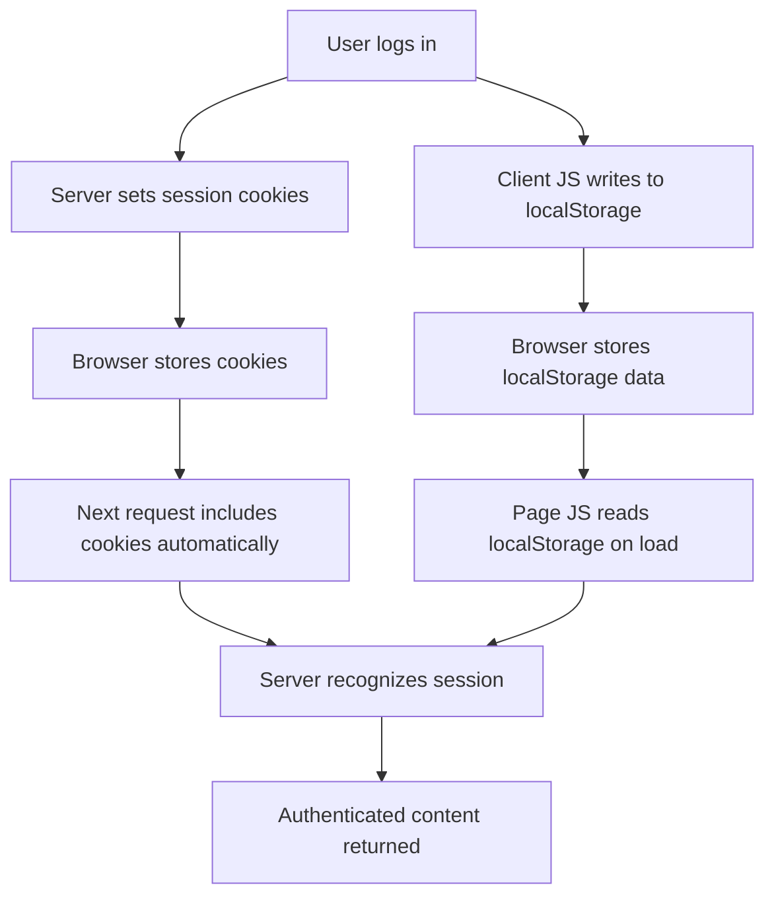
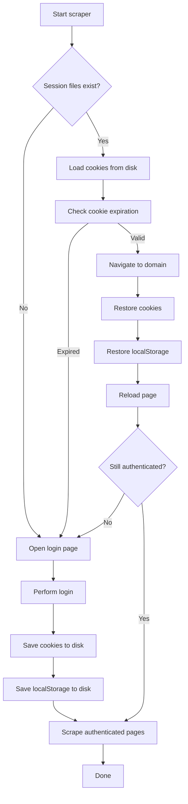
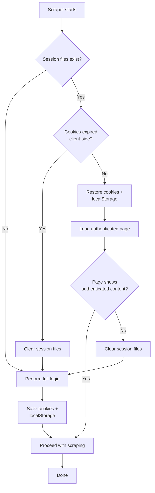

Every time your Selenium scraper opens a browser, navigates to a login page, fills in credentials, solves a CAPTCHA, waits for a redirect, and finally lands on the authenticated dashboard, you are burning time and raising your risk profile. Login flows are the single most common trigger for anti-bot systems -- they monitor login frequency, flag unusual IP addresses, and rate-limit authentication attempts. If your scraper also needs to [automate web form filling](/posts/how-to-automate-web-form-filling-complete-guide/), session persistence becomes even more critical. The fix is straightforward: log in once, save your session state to disk, and restore it on every subsequent run. This guide covers the full workflow for persisting and restoring cookies and localStorage in Selenium with Python, handling expiration gracefully, and using Chrome's built-in profile persistence as an alternative.

## How Browser Sessions Work

Before writing any code, it helps to understand what "session state" actually means in a browser context. When you log into a website, the server typically responds with one or more session cookies -- small key-value pairs sent back to the server with every subsequent request. The browser also stores data client-side in localStorage, which JavaScript on the page can read but which is never sent to the server automatically. Together, cookies and localStorage hold everything the site needs to treat you as an authenticated user.



The key insight is that your Selenium WebDriver instance holds both of these storage layers in memory. When the browser closes, they vanish. Saving session state means extracting cookies and localStorage before the browser shuts down, writing them to files, and injecting them back into a fresh browser instance on the next run.

## Saving Cookies with Selenium

Selenium exposes all cookies for the current domain through `driver.get_cookies()`. This returns a list of dictionaries, each containing the cookie's name, value, domain, path, expiry, and flags. You can serialize this list directly to JSON.

```python
import json
from selenium import webdriver

driver = webdriver.Chrome()
driver.get("https://example.com/login")

# ... perform login steps here ...

# After successful login, save all cookies
cookies = driver.get_cookies()

with open("cookies.json", "w") as f:
    json.dump(cookies, f, indent=2)

print(f"Saved {len(cookies)} cookies")
driver.quit()
```

A single cookie dictionary from `driver.get_cookies()` looks like this:

```json
{
  "name": "session_id",
  "value": "abc123def456",
  "domain": ".example.com",
  "path": "/",
  "expiry": 1740000000,
  "secure": true,
  "httpOnly": true,
  "sameSite": "Lax"
}
```

The `expiry` field is a Unix timestamp. Cookies without an `expiry` are session cookies -- they would normally vanish when the browser closes, but since you are saving them to a file, you can restore them in a new browser instance. The `domain`, `secure`, `httpOnly`, and `sameSite` fields all matter when restoring cookies, which is where most people run into trouble.

## Restoring Cookies

Restoring cookies requires two steps that trip up nearly everyone the first time. First, you must navigate to the target domain before adding cookies. Selenium will reject `add_cookie()` calls if the browser is on `about:blank` or a different domain. Second, you need to handle cookie attributes carefully -- some fields returned by `get_cookies()` can cause errors when passed back to `add_cookie()`.

```python
import json
from selenium import webdriver

driver = webdriver.Chrome()

# Step 1: Navigate to the domain first -- cookies are domain-scoped
driver.get("https://example.com")

# Step 2: Load and restore cookies
with open("cookies.json", "r") as f:
    cookies = json.load(f)

for cookie in cookies:
    # Remove problematic fields that some drivers don't accept on add
    cookie.pop("sameSite", None)
    try:
        driver.add_cookie(cookie)
    except Exception as e:
        print(f"Could not add cookie {cookie['name']}: {e}")

# Step 3: Reload the page so the server sees the restored cookies
driver.get("https://example.com/dashboard")
```

The `sameSite` field deserves special attention. Older versions of Selenium's ChromeDriver reject cookies with `sameSite` values they do not recognize, or throw errors when you try to set it. Stripping it before calling `add_cookie()` is the safest approach unless you specifically need SameSite behavior.

After restoring cookies and refreshing the page, the server should recognize your session. If the page still shows a login form instead of authenticated content, the cookies have likely expired or the site requires additional state beyond cookies.

## Saving localStorage

Cookies handle server-side session recognition, but many modern applications also store critical state in localStorage. Authentication tokens (especially JWTs), user preferences, feature flags, and cached API responses all live there. Selenium does not have a built-in method to dump localStorage, but you can access it through JavaScript execution.

```python
import json
from selenium import webdriver

driver = webdriver.Chrome()
driver.get("https://example.com/dashboard")

# Dump all localStorage entries as a JSON object
local_storage = driver.execute_script("""
    var data = {};
    for (var i = 0; i < localStorage.length; i++) {
        var key = localStorage.key(i);
        data[key] = localStorage.getItem(key);
    }
    return data;
""")

with open("localstorage.json", "w") as f:
    json.dump(local_storage, f, indent=2)

print(f"Saved {len(local_storage)} localStorage entries")
```

This script iterates over every key in localStorage and builds a plain object. The result is returned to Python as a dictionary, which you serialize to JSON. Note that localStorage values are always strings -- if the application stores JSON objects, they will appear as stringified JSON inside the dictionary values.


<figure>
  
  <figcaption>Selenium pioneered browser automation and remains widely used today. <span class="img-credit">Photo by ThisIsEngineering / <a href="https://www.pexels.com" target="_blank" rel="noopener noreferrer">Pexels</a></span></figcaption>
</figure>

## Restoring localStorage

Restoring localStorage follows the same pattern: navigate to the domain first, then inject each key-value pair via JavaScript.

```python
import json
from selenium import webdriver

driver = webdriver.Chrome()

# Must be on the correct origin before writing to localStorage
driver.get("https://example.com")

with open("localstorage.json", "r") as f:
    local_storage = json.load(f)

# Inject each entry
for key, value in local_storage.items():
    driver.execute_script(
        "localStorage.setItem(arguments[0], arguments[1]);",
        key, value
    )

# Reload so the application reads the restored state
driver.get("https://example.com/dashboard")
```

Using `arguments[0]` and `arguments[1]` instead of f-strings or string concatenation avoids issues with special characters, quotes, and injection in the values. Selenium handles the serialization for you.

## Complete Session Save and Restore Workflow

Here is the full lifecycle: log in, save everything, then restore on the next run.



The following class encapsulates this workflow. It saves cookies and localStorage to JSON files in a configurable directory and handles both save and restore operations.

```python
import json
import os
import time
from selenium import webdriver
from selenium.webdriver.chrome.options import Options
from selenium.webdriver.common.by import By
from selenium.webdriver.support.ui import WebDriverWait
from selenium.webdriver.support import expected_conditions as EC


class SessionManager:
    """Save and restore Selenium session state (cookies + localStorage)."""

    def __init__(self, session_dir="./sessions", domain="https://example.com"):
        self.session_dir = session_dir
        self.domain = domain
        self.cookies_file = os.path.join(session_dir, "cookies.json")
        self.storage_file = os.path.join(session_dir, "localstorage.json")
        os.makedirs(session_dir, exist_ok=True)

    def save_session(self, driver):
        """Save cookies and localStorage from the current driver."""
        # Save cookies
        cookies = driver.get_cookies()
        with open(self.cookies_file, "w") as f:
            json.dump(cookies, f, indent=2)

        # Save localStorage
        local_storage = driver.execute_script("""
            var data = {};
            for (var i = 0; i < localStorage.length; i++) {
                var key = localStorage.key(i);
                data[key] = localStorage.getItem(key);
            }
            return data;
        """)
        with open(self.storage_file, "w") as f:
            json.dump(local_storage, f, indent=2)

        print(f"Session saved: {len(cookies)} cookies, "
              f"{len(local_storage)} localStorage entries")

    def restore_session(self, driver):
        """Restore cookies and localStorage into the driver.
        Returns True if restoration succeeded, False if files are missing.
        """
        if not os.path.exists(self.cookies_file):
            return False

        # Navigate to domain before setting cookies
        driver.get(self.domain)
        time.sleep(1)

        # Restore cookies
        with open(self.cookies_file, "r") as f:
            cookies = json.load(f)

        for cookie in cookies:
            cookie.pop("sameSite", None)
            try:
                driver.add_cookie(cookie)
            except Exception as e:
                print(f"Skipped cookie {cookie['name']}: {e}")

        # Restore localStorage
        if os.path.exists(self.storage_file):
            with open(self.storage_file, "r") as f:
                local_storage = json.load(f)
            for key, value in local_storage.items():
                driver.execute_script(
                    "localStorage.setItem(arguments[0], arguments[1]);",
                    key, value
                )

        # Reload to apply restored state
        driver.refresh()
        return True

    def has_saved_session(self):
        """Check if session files exist on disk."""
        return os.path.exists(self.cookies_file)

    def clear_session(self):
        """Delete saved session files."""
        for path in [self.cookies_file, self.storage_file]:
            if os.path.exists(path):
                os.remove(path)
        print("Session files cleared")

    def cookies_expired(self):
        """Check if any saved cookies have expired."""
        if not os.path.exists(self.cookies_file):
            return True

        with open(self.cookies_file, "r") as f:
            cookies = json.load(f)

        now = time.time()
        for cookie in cookies:
            expiry = cookie.get("expiry")
            if expiry and expiry < now:
                return True

        return False
```

Using this class in a scraper looks like this:

```python
def run_scraper():
    session = SessionManager(
        session_dir="./sessions",
        domain="https://example.com"
    )
    driver = webdriver.Chrome()

    try:
        if session.has_saved_session() and not session.cookies_expired():
            print("Restoring saved session...")
            session.restore_session(driver)

            # Verify we are actually logged in
            if is_authenticated(driver):
                print("Session restored successfully")
                scrape_data(driver)
                return
            else:
                print("Session expired server-side, re-authenticating")
                session.clear_session()

        # No valid session -- perform login
        print("Logging in...")
        perform_login(driver)
        session.save_session(driver)
        scrape_data(driver)

    finally:
        driver.quit()


def is_authenticated(driver):
    """Check if the current page shows authenticated content."""
    try:
        WebDriverWait(driver, 5).until(
            EC.presence_of_element_located((By.CSS_SELECTOR, ".dashboard"))
        )
        return True
    except Exception:
        return False


def perform_login(driver):
    """Execute the login flow."""
    driver.get("https://example.com/login")

    WebDriverWait(driver, 10).until(
        EC.presence_of_element_located((By.ID, "username"))
    )
    driver.find_element(By.ID, "username").send_keys("your_user")
    driver.find_element(By.ID, "password").send_keys("your_pass")
    driver.find_element(By.ID, "login-button").click()

    # Wait for redirect to authenticated page
    WebDriverWait(driver, 15).until(
        EC.presence_of_element_located((By.CSS_SELECTOR, ".dashboard"))
    )


def scrape_data(driver):
    """Your actual scraping logic goes here."""
    print(f"Scraping from: {driver.current_url}")
    # ...
```

## Handling Cookie Expiration

The `cookies_expired()` method in the class above checks the `expiry` field of saved cookies. But this only catches client-side expiration. The server can invalidate a session at any time -- after a password change, after a period of inactivity, or simply because it rotates session tokens periodically.

A robust approach checks both layers:

```python
def is_session_valid(session_manager, driver):
    """Full validation: check file existence, expiry, and server-side validity."""
    if not session_manager.has_saved_session():
        return False

    if session_manager.cookies_expired():
        print("Cookies expired based on expiry timestamp")
        session_manager.clear_session()
        return False

    # Restore and test
    session_manager.restore_session(driver)
    if not is_authenticated(driver):
        print("Session rejected by server")
        session_manager.clear_session()
        return False

    return True
```

Some sites issue short-lived cookies (15 minutes to a few hours) alongside a long-lived refresh token stored in localStorage. If your session cookies have expired but the refresh token is still valid, you may be able to trigger a token refresh by simply loading the page -- the site's JavaScript will read the refresh token from localStorage and request new session cookies automatically. This is why restoring both cookies and localStorage together matters.


<figure>
  
  <figcaption>A decade of Selenium set the stage for everything that followed. <span class="img-credit">Photo by Lukas Blazek / <a href="https://www.pexels.com" target="_blank" rel="noopener noreferrer">Pexels</a></span></figcaption>
</figure>

## Using Chrome User Data Directory

Instead of manually saving and restoring session state, you can tell Chrome to use a persistent user data directory. This is the directory where Chrome stores its entire profile -- cookies, localStorage, IndexedDB, cache, saved passwords, extensions, everything.

```python
from selenium import webdriver
from selenium.webdriver.chrome.options import Options

options = Options()
options.add_argument("--user-data-dir=/path/to/chrome-profile")
# Optionally specify which profile within the directory
options.add_argument("--profile-directory=Default")

driver = webdriver.Chrome(options=options)
driver.get("https://example.com/dashboard")
```

When you use `--user-data-dir`, Chrome behaves exactly like a regular browser session. If you are evaluating whether Selenium is still the right tool for your project, our [Selenium vs Puppeteer comparison](/posts/selenium-vs-puppeteer-definitive-comparison-web-scraping/) covers the tradeoffs between the two. If you logged in during a previous run, the cookies and localStorage are already there when the browser launches again. No explicit save or restore code needed.

There are tradeoffs:

| Approach | Pros | Cons |
|---|---|---|
| JSON file save/restore | Portable, works across machines, selective about what you save | More code, must handle edge cases manually |
| Chrome user data dir | Zero save/restore code, full browser state persisted | Tied to one machine, directory can grow large, cannot run multiple instances from the same profile simultaneously |

The user data directory approach has one critical constraint: **Chrome locks the profile directory while running.** If you try to launch two Selenium instances pointing at the same `--user-data-dir`, the second one will either fail to start or behave unpredictably. For parallel scraping, use separate profile directories or stick with the JSON-based approach.

```python
# Creating isolated profiles for parallel workers
import os
from selenium import webdriver
from selenium.webdriver.chrome.options import Options


def create_driver_with_profile(worker_id):
    profile_dir = f"/tmp/chrome-profiles/worker-{worker_id}"
    os.makedirs(profile_dir, exist_ok=True)

    options = Options()
    options.add_argument(f"--user-data-dir={profile_dir}")
    return webdriver.Chrome(options=options)
```

## Security Considerations

Session files contain credentials that grant access to authenticated accounts. Treat them with the same care you would treat passwords.

**Never commit session files to version control.** Add your session directory to `.gitignore` immediately:

```text
# .gitignore
sessions/
*.session
cookies.json
localstorage.json
chrome-profiles/
```

**Encrypt session files at rest.** If you are storing session data on a shared machine or in a CI/CD pipeline, encrypt the files. Python's `cryptography` library handles this with minimal overhead:

```python
from cryptography.fernet import Fernet

# Generate a key once and store it securely (env variable, secrets manager)
key = Fernet.generate_key()
cipher = Fernet(key)

# Encrypt before writing
def save_encrypted(data, filepath, cipher):
    json_bytes = json.dumps(data).encode("utf-8")
    encrypted = cipher.encrypt(json_bytes)
    with open(filepath, "wb") as f:
        f.write(encrypted)

# Decrypt when loading
def load_encrypted(filepath, cipher):
    with open(filepath, "rb") as f:
        encrypted = f.read()
    decrypted = cipher.decrypt(encrypted)
    return json.loads(decrypted.decode("utf-8"))
```

**Use environment variables for credentials.** Never hardcode usernames or passwords in your scraper. Load them from environment variables or a secrets manager:

```python
import os

username = os.environ.get("SCRAPER_USERNAME")
password = os.environ.get("SCRAPER_PASSWORD")

if not username or not password:
    raise ValueError("Set SCRAPER_USERNAME and SCRAPER_PASSWORD env variables")
```

**Set restrictive file permissions** on session files so other users on the system cannot read them:

```python
import os
import stat

def save_session_secure(data, filepath):
    with open(filepath, "w") as f:
        json.dump(data, f)
    # Owner read/write only
    os.chmod(filepath, stat.S_IRUSR | stat.S_IWUSR)
```

## Common Issues and How to Fix Them

Working with cookies across domains, subdomains, and varying security flags introduces a category of bugs that can be difficult to diagnose. Here are the most frequent problems.

### Cookies Scoped to a Subdomain

A cookie with `domain` set to `.example.com` is valid for all subdomains, but a cookie with `domain` set to `app.example.com` is only valid on that exact subdomain. When you restore cookies, make sure the browser is on the correct subdomain.

```python
# Wrong: navigating to root domain when cookies belong to a subdomain
driver.get("https://example.com")
driver.add_cookie({"name": "token", "value": "abc", "domain": "app.example.com"})
# This will raise an error -- domain mismatch

# Right: navigate to the subdomain first
driver.get("https://app.example.com")
driver.add_cookie({"name": "token", "value": "abc", "domain": "app.example.com"})
```

If your target site uses multiple subdomains (for example, `auth.example.com` for login and `app.example.com` for the dashboard), you may need to restore cookies in stages, navigating to each subdomain and adding the relevant cookies.

### Secure and HttpOnly Flags

Cookies marked `secure: true` are only sent over HTTPS connections. If you accidentally navigate to the HTTP version of the site before restoring cookies, `add_cookie()` may fail silently or the server will never receive the cookie. Always use `https://` URLs.

The `httpOnly` flag prevents JavaScript from reading the cookie via `document.cookie`, but it does not affect Selenium's `add_cookie()` or `get_cookies()` methods. Selenium operates at the browser level, not the JavaScript level, so HttpOnly cookies are fully accessible.

### SameSite Attribute Errors

The `sameSite` attribute controls whether cookies are sent with cross-site requests. ChromeDriver versions have been inconsistent about accepting this field in `add_cookie()`. The safest approach is to strip it:

```python
def sanitize_cookie(cookie):
    """Remove fields that cause add_cookie() to fail."""
    sanitized = dict(cookie)
    sanitized.pop("sameSite", None)
    # Some drivers also choke on these
    sanitized.pop("storeId", None)
    sanitized.pop("id", None)
    return sanitized

for cookie in cookies:
    driver.add_cookie(sanitize_cookie(cookie))
```

### The Expiry Field Type

Selenium returns the `expiry` field as a float or integer (Unix timestamp), but some serialization round-trips convert it to a different type. When restoring, make sure it is an integer:

```python
for cookie in cookies:
    if "expiry" in cookie:
        cookie["expiry"] = int(cookie["expiry"])
    driver.add_cookie(cookie)
```

### Page Not Loading After Cookie Restore

If you restore cookies but the page still shows the login screen, check these things in order:

1. **Are you on the right domain?** Cookies are domain-scoped. Navigate to the exact domain before adding them.
2. **Did you refresh after adding cookies?** Cookies take effect on the next request, not retroactively on the current page.
3. **Have the cookies expired?** Check the `expiry` field against the current time.
4. **Does the site require localStorage too?** Many SPAs store JWTs or session tokens in localStorage. Restoring cookies alone is not enough.
5. **Has the server invalidated the session?** The server may have rotated the session. You need to re-authenticate.

## Putting It All Together

The complete flow for production-grade session management follows this decision tree:



Session management is not glamorous, but it is one of the highest-leverage optimizations you can make in a Selenium scraper, especially given the [speed overhead Selenium adds compared to lightweight HTTP clients](/posts/python-requests-vs-selenium-speed-performance-comparison/). A single login followed by session persistence eliminates repeated authentication, reduces your footprint on the target site, and makes your scraper faster and more reliable on every subsequent run.
