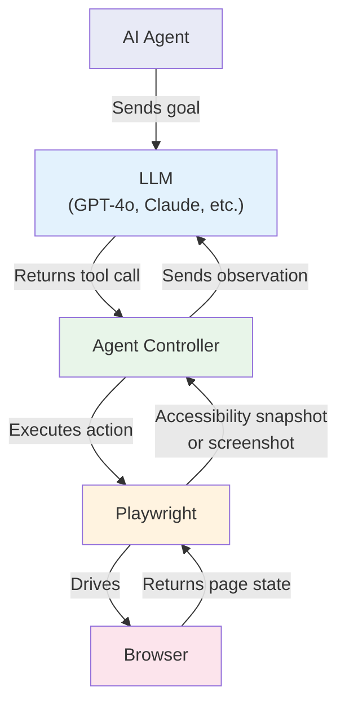
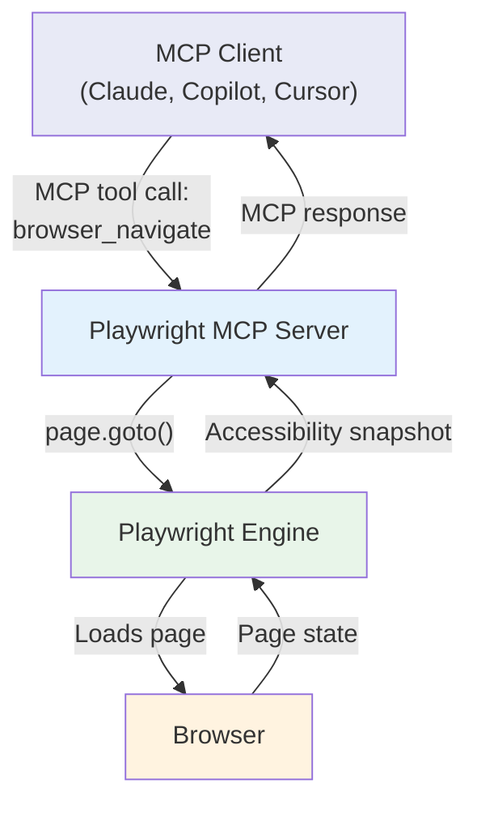
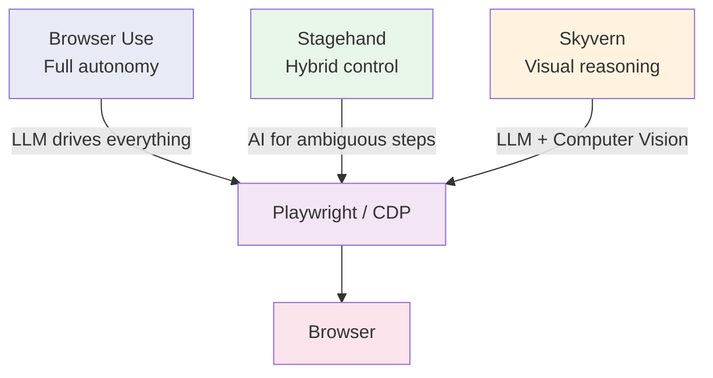
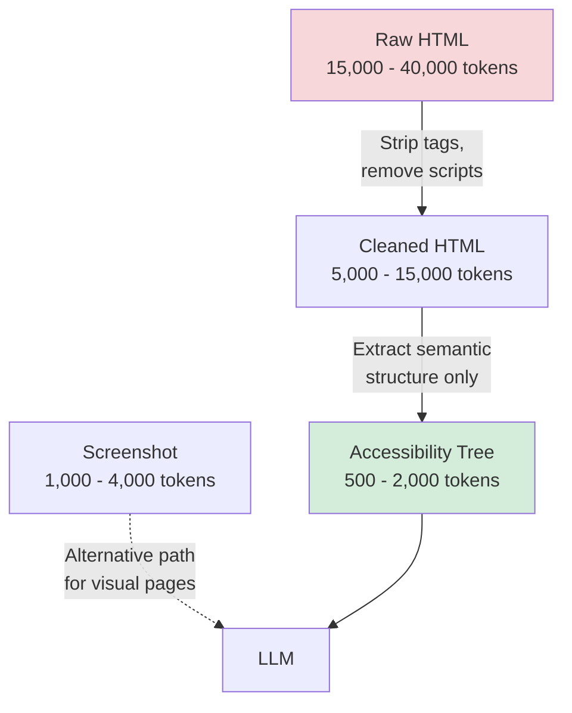
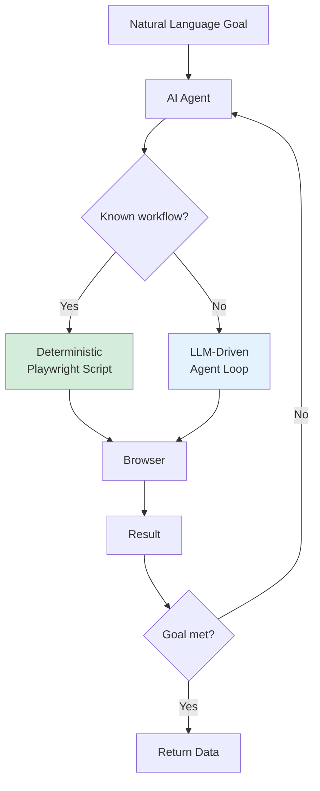

AI agents need browsers. Whether the task is filling out a form, extracting structured data from a search results page, or navigating a multi-step checkout flow, the agent eventually has to interact with a rendered web page. Playwright has become the default engine powering this interaction. Browser Use, Stagehand, Skyvern, and the official Playwright MCP Server all rely on it to translate AI decisions into real browser actions. This post covers why Playwright won this role, the three main architectural approaches teams use to connect LLMs to browsers, and the practical tradeoffs around tokens, speed, and reliability that shape every production deployment.

## Why Playwright Became the Default Engine for AI Agents

Playwright was not designed for AI agents. It was built in 2020 as a general-purpose [browser automation framework](/posts/playwright-for-browser-automation-in-ai-agents/), an improvement over Selenium and Puppeteer. But several of its design choices turned out to be exactly what AI agent builders needed.

**Multi-browser support.** Playwright provides a single API that works across Chromium, Firefox, and WebKit. An AI agent does not need separate logic for different browsers. One set of tool definitions covers all three.

**Stable, well-typed API.** The API surface is predictable. Methods like `page.goto()`, `page.click()`, and `page.fill()` map cleanly to the kinds of actions an LLM reasons about. There are no ambiguous overloads or hidden state that would confuse a code-generating model.

**Accessibility tree support.** This is the capability that matters most. Playwright can extract the browser's accessibility tree -- the structured, semantic representation of a page that screen readers use. Instead of parsing raw HTML or interpreting pixel screenshots, an AI agent reads a clean YAML tree of labeled elements with roles, names, and states. This is both cheaper (fewer tokens) and more reliable (semantic rather than structural).

**Screenshot capabilities.** When the accessibility tree is not enough -- pages with complex visual layouts, canvas elements, or poorly labeled components -- Playwright can capture full-page or element-level screenshots. Vision-capable LLMs can interpret these directly.

**Async-first architecture.** AI agents frequently manage multiple pages, wait on network responses, and react to page mutations concurrently. Playwright's native async support handles this without workarounds.

## How AI Agents Use Playwright

The basic architecture connecting an LLM to a browser through Playwright follows a consistent pattern regardless of the specific framework or approach.



The flow is cyclical. The agent observes the page state through Playwright, sends that state to the LLM, the LLM decides what action to take, the agent controller executes that action through Playwright, and the cycle repeats until the goal is achieved or the agent decides to stop.

This observe-decide-act loop is the foundation. What varies between approaches is how the LLM communicates with Playwright and how much abstraction sits between them.

## Three Approaches to AI Plus Playwright

Teams building AI browser agents have converged on three main architectural patterns. Each makes different tradeoffs between control, cost, and complexity.

### Approach 1: MCP Server

The Model Context Protocol is an open standard for connecting AI models to external tools. The Playwright MCP Server exposes browser automation as a set of discoverable tools that any MCP-compatible agent can call.



The agent does not write Playwright code. It calls high-level tools like `browser_navigate`, `browser_click`, and `browser_snapshot`. The MCP server handles element resolution, waiting, and error recovery.

```bash
# Add Playwright MCP server to Claude Code
claude mcp add playwright -- npx @playwright/mcp@latest

# Or configure for Cursor / VS Code
# .cursor/mcp.json or .vscode/mcp.json
```

```json
{
  "mcpServers": {
    "playwright": {
      "command": "npx",
      "args": ["@playwright/mcp@latest"]
    }
  }
}
```

The MCP server operates in two modes. **Snapshot mode** (default) returns the accessibility tree as structured text after every action. **Vision mode** returns screenshots instead, useful when the accessibility tree does not capture the page structure adequately.

The main limitation is token consumption. Every action triggers a full accessibility snapshot that enters the LLM's context window. A typical 10-step task consumes around 114,000 tokens through MCP. For short tasks this is acceptable. For long multi-step workflows, the accumulated snapshots crowd out the LLM's reasoning capacity.

### Approach 2: Code Generation

In this pattern, the LLM generates Playwright code directly, and the agent system executes it. The LLM acts as a programmer rather than a tool caller.

```python
import openai

client = openai.OpenAI()

def generate_playwright_code(task: str) -> str:
    """Ask the LLM to write Playwright code for a given task."""
    response = client.chat.completions.create(
        model="gpt-4o",
        messages=[
            {
                "role": "system",
                "content": (
                    "You are a Playwright automation expert. "
                    "Write Python code using playwright.sync_api "
                    "to accomplish the user's task. Return only "
                    "the code, no explanations."
                ),
            },
            {"role": "user", "content": task},
        ],
    )
    return response.choices[0].message.content


def execute_generated_code(code: str) -> dict:
    """Execute LLM-generated Playwright code in a sandboxed scope."""
    # In production, add sandboxing, timeout, and error handling
    local_vars = {}
    exec(code, {"__builtins__": __builtins__}, local_vars)
    return local_vars.get("result", {})


# Example usage
task = "Navigate to https://news.ycombinator.com and extract the top 5 story titles"
code = generate_playwright_code(task)
print("Generated code:")
print(code)
```

The LLM might generate something like:

```python
from playwright.sync_api import sync_playwright

with sync_playwright() as p:
    browser = p.chromium.launch(headless=True)
    page = browser.new_page()
    page.goto("https://news.ycombinator.com")
    page.wait_for_load_state("domcontentloaded")

    titles = page.query_selector_all(".titleline > a")
    result = [t.inner_text() for t in titles[:5]]

    for i, title in enumerate(result, 1):
        print(f"{i}. {title}")

    browser.close()
```

Code generation is powerful because the LLM has access to the full Playwright API. It can write complex logic with conditionals, loops, and error handling. But it introduces a significant risk: the generated code runs with real system access. Sandboxing, validation, and human review gates are essential for production use. The approach also requires the LLM to know the Playwright API well, which limits you to models trained on sufficient Playwright examples.

### Approach 3: Agent Frameworks

Agent frameworks like Browser Use, Stagehand, and Skyvern wrap Playwright with AI logic, providing higher-level abstractions that handle the observe-decide-act loop internally. Our [comparison of Browser Use vs Stagehand vs Skyvern](/posts/browser-agent-frameworks-compared-browser-use-vs-stagehand-vs-skyvern/) dives deeper into their respective strengths.

**Browser Use** is agent-first. You give it a goal in natural language, and it runs an autonomous loop of observing page state, reasoning about the next action, executing it, and reassessing the result.

```python
from browser_use import Agent
from langchain_openai import ChatOpenAI

agent = Agent(
    task="Go to amazon.com, search for 'noise cancelling headphones', "
         "and find the best-rated option under $100",
    llm=ChatOpenAI(model="gpt-4o"),
)

result = await agent.run()
print(result)
```

**Stagehand** is deterministic-first. You write standard Playwright scripts and hand off to AI only when the task is ambiguous. About 85% of generated code is standard Playwright.

```typescript
import { Stagehand } from "@browserbasehq/stagehand";

const stagehand = new Stagehand({
  env: "LOCAL",
  modelName: "gpt-4o",
});

await stagehand.init();
await stagehand.page.goto("https://example.com/login");

// AI handles the ambiguous part
await stagehand.act({ action: "log in with test credentials" });

// Back to deterministic Playwright
const data = await stagehand.extract({
  instruction: "extract all product names and prices",
  schema: z.object({
    products: z.array(z.object({
      name: z.string(),
      price: z.number(),
    })),
  }),
});
```

**Skyvern** is visual-first. It combines LLMs with computer vision to understand pages the way a human would, making it strong for form-heavy workflows where visual layout carries meaning that the DOM structure does not capture.

Each framework makes a different tradeoff between autonomy and control:



## The Accessibility Tree Approach

The accessibility tree is how most AI agents observe web pages through Playwright. It is the structured, semantic representation that browsers maintain for screen readers. Instead of raw HTML tags and attributes, the tree contains labeled elements with roles (button, textbox, link), names (the text label associated with each element), and states (checked, expanded, disabled).

```python
from playwright.sync_api import sync_playwright

with sync_playwright() as p:
    browser = p.chromium.launch(headless=True)
    page = browser.new_page()
    page.goto("https://httpbin.org/forms/post")
    page.wait_for_load_state("domcontentloaded")

    # Capture the accessibility tree
    snapshot = page.locator("body").aria_snapshot()
    print(snapshot)

    browser.close()
```

The output looks like this:

```yaml
- paragraph:
    - text: "Customer name:"
    - textbox "Customer name:"
- paragraph:
    - text: "Telephone:"
    - textbox "Telephone:"
- paragraph:
    - text: "E-mail address:"
    - textbox "E-mail address:"
- group "Pizza Size":
    - text: Pizza Size
    - paragraph:
        - radio "Small"
    - paragraph:
        - radio "Medium"
    - paragraph:
        - radio "Large"
- group "Pizza Toppings":
    - paragraph:
        - checkbox "Bacon"
    - paragraph:
        - checkbox "Onion"
- button "Submit order"
```

Compare this to the raw HTML of the same page, which includes `<form>`, `<fieldset>`, `<legend>`, `<label>`, `<input>` tags with `type`, `name`, `value`, `id`, and `class` attributes, plus layout and styling markup. The accessibility tree strips all of that away and keeps only what matters for interaction: what elements exist, what they do, and what they are called.

An LLM reading this snapshot can immediately understand that there is a text field labeled "Customer name:", a group of radio buttons for pizza size, checkboxes for toppings, and a submit button. It does not need to parse HTML, resolve CSS selectors, or understand the page's layout structure.

## The Screenshot Approach

When the accessibility tree falls short -- canvas-heavy applications, pages with poor semantic markup, or situations where visual context matters -- Playwright can capture screenshots for vision-capable LLMs.

```python
from playwright.sync_api import sync_playwright
import base64

with sync_playwright() as p:
    browser = p.chromium.launch(headless=True)
    page = browser.new_page()
    page.goto("https://example.com")
    page.wait_for_load_state("networkidle")

    # Full page screenshot as bytes
    screenshot_bytes = page.screenshot(full_page=True)

    # Encode for sending to a vision model
    screenshot_b64 = base64.b64encode(screenshot_bytes).decode("utf-8")

    # Send to a vision-capable LLM
    # response = client.chat.completions.create(
    #     model="gpt-4o",
    #     messages=[{
    #         "role": "user",
    #         "content": [
    #             {"type": "text", "text": "What actions can I take on this page?"},
    #             {"type": "image_url", "image_url": {
    #                 "url": f"data:image/png;base64,{screenshot_b64}"
    #             }}
    #         ]
    #     }]
    # )

    browser.close()
```

The screenshot approach gives the LLM rich visual context -- colors, layout, images, spatial relationships between elements. But it is expensive. A single full-page screenshot can consume 1,000 to 4,000 tokens depending on resolution and the model's image tokenization. The accessibility tree for the same page might use 200 to 800 tokens.

The Playwright MCP Server supports both modes. Its default snapshot mode uses the accessibility tree. Its vision mode switches to screenshots and coordinate-based clicking, where the LLM identifies click targets by their pixel coordinates in the image.


<figure>
  
  <figcaption>Modern tooling makes browser control accessible to every developer. <span class="img-credit">Photo by MASUD GAANWALA / <a href="https://www.pexels.com" target="_blank" rel="noopener noreferrer">Pexels</a></span></figcaption>
</figure>

## A Simple AI Agent Loop

Here is a conceptual but realistic implementation of an AI agent loop that uses Playwright for browser control and an LLM for decision-making.

```python
import json
from playwright.sync_api import sync_playwright
from openai import OpenAI

client = OpenAI()

# Define browser tools using the standard function calling schema
BROWSER_TOOLS = [
    {"type": "function", "function": {
        "name": "navigate",
        "description": "Navigate the browser to a URL",
        "parameters": {"type": "object", "properties": {
            "url": {"type": "string"}
        }, "required": ["url"]},
    }},
    {"type": "function", "function": {
        "name": "click",
        "description": "Click an element by its ARIA role and name",
        "parameters": {"type": "object", "properties": {
            "role": {"type": "string"},
            "name": {"type": "string"},
        }, "required": ["role", "name"]},
    }},
    {"type": "function", "function": {
        "name": "fill",
        "description": "Type text into an input field by its label",
        "parameters": {"type": "object", "properties": {
            "label": {"type": "string"},
            "value": {"type": "string"},
        }, "required": ["label", "value"]},
    }},
    {"type": "function", "function": {
        "name": "done",
        "description": "Signal that the task is complete",
        "parameters": {"type": "object", "properties": {
            "summary": {"type": "string"},
        }, "required": ["summary"]},
    }},
]


def execute_tool(page, name: str, args: dict) -> str:
    """Translate an LLM tool call into a Playwright action."""
    if name == "navigate":
        page.goto(args["url"], wait_until="domcontentloaded")
        snapshot = page.locator("body").aria_snapshot()
        return f"Navigated to {args['url']}.\n\nPage snapshot:\n{snapshot}"
    elif name == "click":
        page.get_by_role(args["role"], name=args["name"]).click()
        page.wait_for_load_state("domcontentloaded")
        snapshot = page.locator("body").aria_snapshot()
        return f"Clicked {args['role']} '{args['name']}'.\n\nPage snapshot:\n{snapshot}"
    elif name == "fill":
        page.get_by_label(args["label"]).fill(args["value"])
        return f"Filled '{args['label']}' with '{args['value']}'"
    elif name == "done":
        return f"DONE: {args['summary']}"
    return f"Unknown tool: {name}"


def run_agent(goal: str, max_steps: int = 15):
    """Run a simple AI browser agent loop."""
    messages = [
        {"role": "system", "content": (
            "You are a browser automation agent. Use accessibility tree "
            "snapshots to understand page state. Call 'done' when finished."
        )},
        {"role": "user", "content": goal},
    ]

    with sync_playwright() as p:
        browser = p.chromium.launch(headless=True)
        page = browser.new_page()

        for step in range(max_steps):
            response = client.chat.completions.create(
                model="gpt-4o", messages=messages, tools=BROWSER_TOOLS,
            )
            message = response.choices[0].message
            if not message.tool_calls:
                break

            messages.append(message)
            for tool_call in message.tool_calls:
                fn_name = tool_call.function.name
                fn_args = json.loads(tool_call.function.arguments)
                print(f"Step {step + 1}: {fn_name}({json.dumps(fn_args)})")

                result = execute_tool(page, fn_name, fn_args)
                messages.append({
                    "role": "tool",
                    "tool_call_id": tool_call.id,
                    "content": result,
                })
                if fn_name == "done":
                    browser.close()
                    return

        browser.close()

run_agent("Fill out a pizza order at httpbin.org/forms/post")
```

This is a minimal version of what frameworks like Browser Use implement at scale. The key elements are the same: tool definitions that map to Playwright actions, an execution layer that handles browser interaction, and accessibility snapshots flowing back to the LLM as observations.

## Token Efficiency: Accessibility Trees vs HTML vs Screenshots

Token consumption determines whether AI browser automation is economically viable at scale. The representation format you choose for page observation has a direct impact on cost.

Consider a moderately complex web page -- a search results page with 20 results, navigation, filters, and a footer.

| Representation | Approximate tokens | Information quality |
|---------------|-------------------|-------------------|
| Raw HTML | 15,000 - 40,000 | Complete but noisy |
| Cleaned HTML | 5,000 - 15,000 | Less noise, still verbose |
| Accessibility tree | 500 - 2,000 | Semantic, interaction-focused |
| Screenshot (vision) | 1,000 - 4,000 | Rich visual, no text structure |

The accessibility tree is the clear winner for token efficiency. It strips away everything that does not matter for interaction -- CSS classes, data attributes, layout divs, script tags, style declarations -- and keeps only the semantic structure that the LLM needs to decide what to do next.

This is why the Playwright MCP Server defaults to snapshot mode rather than vision mode. Our post on [Playwright MCP and CLI](/posts/playwright-mcp-and-cli-making-browser-automation-ai-agent-friendly/) explains how the CLI achieves a 4x token reduction over MCP for the same tasks by saving snapshots to disk rather than streaming them into the context window.



The token cost compounds across the agent loop. If the agent takes 10 actions and observes the page after each one, the total observation cost is 10 times the per-snapshot cost. At 2,000 tokens per accessibility snapshot, that is 20,000 tokens for observations alone. At 20,000 tokens per raw HTML dump, the same workflow costs 200,000 tokens just for page state -- likely exceeding the context window before the task is complete.

## Challenges in Production

AI browser automation through Playwright works well in demos but faces real challenges at production scale.

**LLM latency per action.** Every step in the agent loop requires an LLM call. Even with fast models, each call adds 1 to 5 seconds of latency. A 10-step task takes 10 to 50 seconds just in LLM inference time, on top of page load and action execution time. Traditional Playwright scripts complete the same tasks in under a second.

**Reliability.** LLMs are non-deterministic. The same page state and goal can produce different action sequences across runs. An agent that successfully fills a form 9 times out of 10 is not reliable enough for production automation. Frameworks address this with retry logic, validation steps, and fallback strategies, but reliability remains the primary concern.

**Cost at scale.** At $2.50 per million input tokens and $10 per million output tokens (GPT-4o pricing as of early 2026), a single 114,000-token MCP task costs roughly $0.30 to $0.50 in API fees. Running 1,000 such tasks per day costs $300 to $500 per day just in LLM inference. The CLI approach reduces this by 4x, but costs remain significant compared to traditional scripts.

**Error handling.** When a Playwright script fails, you get a clear error: element not found, timeout, navigation error. When an AI agent fails, the failure mode is often subtle -- the agent clicks the wrong button, fills a field with incorrect data, or enters an infinite loop of observing and re-observing without making progress. Detecting and recovering from these failures requires sophisticated monitoring.

**Anti-bot detection.** AI agents driving browsers through Playwright face the same detection challenges as traditional automation. Browser fingerprinting, behavioral analysis, and CAPTCHAs all apply. The added LLM latency between actions can actually help (it looks more human-like) or hurt (unusual timing patterns between rapid API calls and slow page interactions).

## The Future: Autonomous Web Agents

The trajectory points toward agents that can handle complex, multi-step web tasks with minimal human oversight. Fill out a government form, compare insurance quotes across three providers, monitor a competitor's pricing page and alert on changes -- all described in natural language, all executed autonomously.

Several developments are converging to make this practical:

**Better accessibility tree support.** As web frameworks improve their ARIA implementations and browsers enhance their accessibility APIs, the semantic representation available to AI agents becomes richer and more reliable.

**Cheaper, faster models.** Token costs continue to drop. Models optimized for tool use and function calling are getting faster and more accurate at mapping page state to actions.

**Standardized tool interfaces.** MCP provides a common protocol for connecting any AI agent to any browser automation backend. This means framework improvements benefit all agents, not just those using a specific tool.

**Hybrid approaches.** The most practical production systems combine deterministic Playwright code for stable, known workflows with AI-driven steps for ambiguous or dynamic parts. Stagehand's model -- write Playwright scripts, use AI only where needed -- is likely the pattern most teams will adopt.



Playwright sits at the center of this ecosystem. Whether agents call it through MCP, generate code that uses its API, or operate through frameworks that wrap it with AI logic, the underlying browser automation engine is the same. Understanding how Playwright exposes page state through accessibility trees, how tool definitions map to browser actions, and where the token cost bottlenecks are -- that is the foundation for building AI browser agents that actually work in production.
