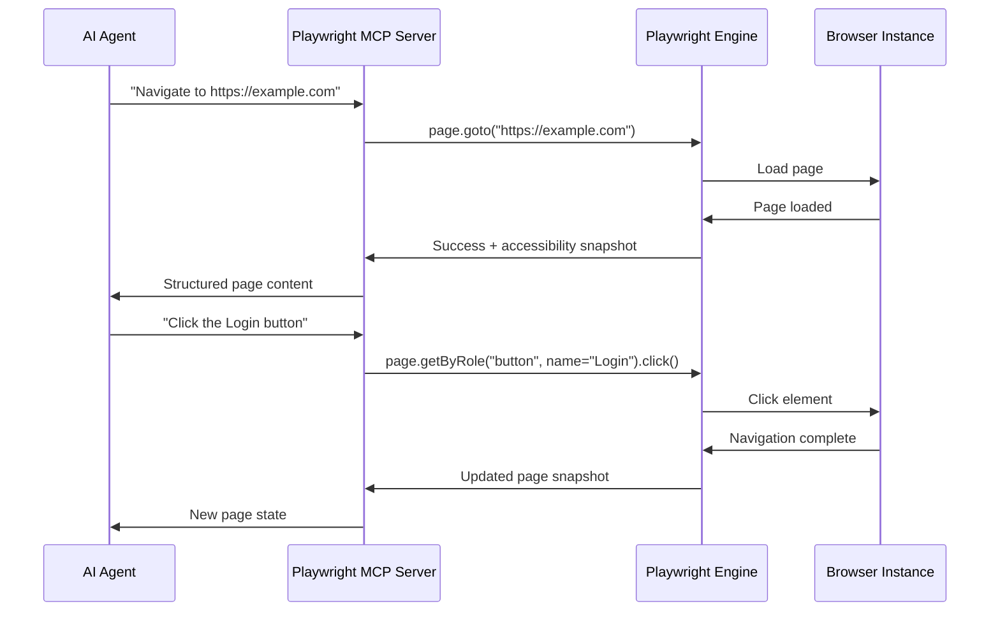
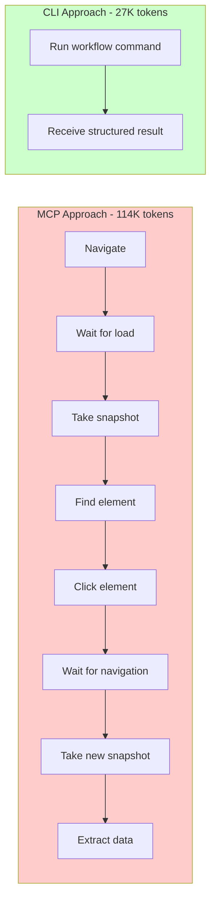
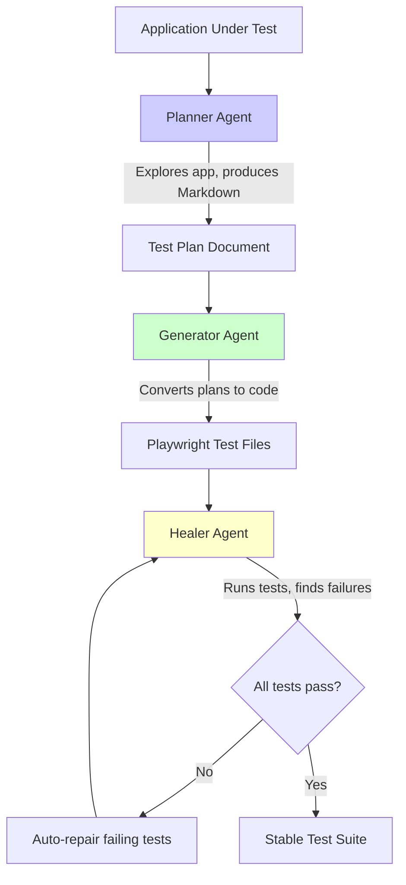

Playwright has been the go-to browser automation framework for scraping professionals and testers for years. In early 2026, Microsoft started redesigning it not just for human developers, but for AI agents. The official Playwright MCP Server and the new `@playwright/cli` package are a deliberate move toward making browser automation consumable by large language models and agentic systems.

The numbers make the case. Where a Playwright MCP integration might consume 114,000 tokens to complete a browser automation task, the new CLI achieves the same result with roughly 27,000 tokens -- a 4x reduction. When you are paying per token and running hundreds of agent tasks per day, that difference reshapes your entire cost model.

## What Is MCP and Why Does It Matter

The Model Context Protocol is an open standard for connecting AI models to external tools and services. It acts as a universal adapter between an LLM and the outside world. Instead of baking tool-specific logic into every AI agent, MCP provides a standardized interface: the agent describes what it wants to do, the MCP server translates that into concrete actions, and the results flow back to the agent in a format it can understand.

For browser automation, this means an AI agent does not need to know the Playwright API. It does not need to construct JavaScript snippets or manage browser lifecycle details. It tells the MCP server "navigate to this page" or "click the submit button," and the server handles the rest.



The Playwright MCP Server is Microsoft's official implementation of this pattern. It exposes Playwright's browser control capabilities through the MCP protocol, allowing any MCP-compatible AI agent to drive a browser without writing a single line of Playwright code.

## Setting Up the Playwright MCP Server

Getting started is straightforward. The MCP server runs as a standalone process that your AI agent connects to.

```python
# Install Playwright MCP server
# npm install -g @anthropic-ai/mcp-server-playwright
# Or use npx to run it directly

# Configuration for Claude Desktop (claude_desktop_config.json)
import json

mcp_config = {
    "mcpServers": {
        "playwright": {
            "command": "npx",
            "args": ["@anthropic-ai/mcp-server-playwright"]
        }
    }
}

# Write to Claude Desktop config
config_path = "~/.config/claude/claude_desktop_config.json"
print(json.dumps(mcp_config, indent=2))
```

```javascript
// For VS Code with GitHub Copilot, add to .vscode/settings.json
const vscodeConfig = {
  "mcp": {
    "servers": {
      "playwright": {
        "command": "npx",
        "args": ["@anthropic-ai/mcp-server-playwright"]
      }
    }
  }
};

// For a custom MCP client connecting to the Playwright server
const { Client } = require("@modelcontextprotocol/sdk/client/index.js");
const { StdioClientTransport } = require(
  "@modelcontextprotocol/sdk/client/stdio.js"
);

async function connectToPlaywright() {
  const transport = new StdioClientTransport({
    command: "npx",
    args: ["@anthropic-ai/mcp-server-playwright"],
  });

  const client = new Client({
    name: "my-browser-agent",
    version: "1.0.0",
  });

  await client.connect(transport);

  // List available tools
  const tools = await client.listTools();
  console.log("Available browser tools:", tools.tools.map((t) => t.name));

  return client;
}
```

Once running, the MCP server exposes tools like `browser_navigate`, `browser_click`, `browser_type`, `browser_screenshot`, and `browser_snapshot`. An AI agent discovers these tools through the MCP protocol and uses them to drive the browser.

## The CLI Alternative: 4x Token Reduction

While MCP is powerful, it is verbose. Every interaction between the agent and the MCP server involves a round trip: the agent requests an action, receives the result, decides what to do next, requests another action. Each exchange consumes tokens.

The `@playwright/cli` takes a different approach. Instead of exposing individual browser actions as tools, it provides higher-level commands that batch multiple operations together. The agent can describe a complete workflow in a single command rather than issuing step-by-step instructions.



```python
# Using Playwright CLI for token-efficient automation
import subprocess
import json

def run_playwright_cli(command, args=None):
    """Execute a Playwright CLI command and return structured output."""
    cmd = ["npx", "@playwright/cli", command]
    if args:
        cmd.extend(args)

    result = subprocess.run(
        cmd,
        capture_output=True,
        text=True,
        timeout=30
    )
    return json.loads(result.stdout) if result.stdout else None


# Example: Navigate and extract in a single CLI call
result = run_playwright_cli("run", [
    "--url", "https://example.com/products",
    "--action", "extract",
    "--selector", ".product-card",
    "--fields", "title:.product-name,price:.product-price"
])

print(f"Extracted {len(result['items'])} products")
for item in result["items"]:
    print(f"  {item['title']}: {item['price']}")
```

```javascript
// JavaScript equivalent using the Playwright CLI
const { execFile } = require("child_process");
const { promisify } = require("util");
const execFileAsync = promisify(execFile);

async function runPlaywrightCli(command, args = []) {
  const { stdout } = await execFileAsync(
    "npx",
    ["@playwright/cli", command, ...args],
    { timeout: 30000 }
  );
  return JSON.parse(stdout);
}

// Single command replaces multiple MCP round-trips
async function extractProducts() {
  const result = await runPlaywrightCli("run", [
    "--url", "https://example.com/products",
    "--action", "extract",
    "--selector", ".product-card",
    "--fields", "title:.product-name,price:.product-price",
  ]);

  console.log(`Extracted ${result.items.length} products`);
  result.items.forEach((item) => {
    console.log(`  ${item.title}: ${item.price}`);
  });
}
```

The token reduction matters for two reasons. First, cost: if your agent runs hundreds of browser automation tasks per day, cutting token usage by 75% directly reduces your API bill. Second, speed: fewer round trips means faster task completion. An agent that describes its intent in a single command and receives structured results will always outperform one that needs to issue ten sequential instructions.

## The Three Playwright Agents

Beyond the protocol and CLI layers, Microsoft introduced three specialized agent definitions that handle common automation workflows end to end. These agents are purpose-built for specific tasks and designed to work together.



### The Planner

The Planner agent explores your application and produces a structured Markdown test plan. You point it at a URL, and it navigates through the application, identifies key user flows, and documents what should be tested. The output is not code -- it is a human-readable plan that describes each test scenario in plain language.

```python
# Using the Planner agent to generate a test plan
import subprocess

def run_planner(target_url, output_path="test-plan.md"):
    """Run the Playwright Planner agent to explore an app."""
    result = subprocess.run(
        [
            "npx", "playwright", "agent", "planner",
            "--url", target_url,
            "--output", output_path
        ],
        capture_output=True,
        text=True,
        timeout=120
    )

    if result.returncode == 0:
        print(f"Test plan written to {output_path}")
        with open(output_path, "r") as f:
            return f.read()
    else:
        print(f"Planner failed: {result.stderr}")
        return None

# Generate a test plan for your application
plan = run_planner("https://my-app.example.com")
```

### The Generator

The Generator takes the Planner's Markdown output and converts it into actual Playwright test files. Each test scenario in the plan becomes a runnable test with proper assertions, selectors, and wait conditions.

```javascript
// Using the Generator agent to create tests from a plan
const { execFile } = require("child_process");
const { promisify } = require("util");
const execFileAsync = promisify(execFile);

async function runGenerator(planPath, outputDir = "./tests") {
  const { stdout, stderr } = await execFileAsync(
    "npx",
    [
      "playwright", "agent", "generator",
      "--plan", planPath,
      "--output-dir", outputDir,
    ],
    { timeout: 120000 }
  );

  console.log(`Generated tests in ${outputDir}`);
  console.log(stdout);
  return outputDir;
}

// Convert the plan into executable tests
runGenerator("./test-plan.md", "./tests/generated")
  .then((dir) => console.log(`Tests ready in ${dir}`));
```

### The Healer

The Healer is the most interesting of the three. It runs your test suite, identifies failing tests, diagnoses why they fail, and attempts to repair them automatically. If a CSS selector has changed because the application was updated, the Healer finds the new selector and updates the test. If a timing issue causes a flaky test, it adds appropriate wait conditions.

```python
# Using the Healer agent to auto-repair failing tests
import subprocess
import json

def run_healer(test_dir, max_iterations=3):
    """Run the Playwright Healer to fix failing tests."""
    for iteration in range(max_iterations):
        print(f"\nHealer iteration {iteration + 1}/{max_iterations}")

        result = subprocess.run(
            [
                "npx", "playwright", "agent", "healer",
                "--test-dir", test_dir,
                "--auto-fix"
            ],
            capture_output=True,
            text=True,
            timeout=300
        )

        output = result.stdout
        if "All tests passing" in output:
            print("All tests repaired and passing")
            return True

        print(f"Some tests still failing, attempting next repair cycle...")

    print("Max iterations reached, manual review needed")
    return False

# Auto-heal your test suite
success = run_healer("./tests/generated")
```

The Healer addresses one of the biggest pain points in browser automation: maintenance. Selectors break, page layouts shift, and timing changes. An automated agent that can diagnose and fix these issues reduces the ongoing cost of maintaining large test suites.

## Connecting It All: AI Agent to Browser via MCP

Here is a practical example showing how to configure a complete pipeline where an AI agent uses MCP to drive Playwright for a scraping task.

```python
# Complete example: AI agent using Playwright via MCP
import json
import asyncio

async def setup_mcp_browser_agent():
    """Set up a complete MCP-based browser automation pipeline."""

    # MCP server configuration
    server_config = {
        "name": "playwright",
        "command": "npx",
        "args": ["@anthropic-ai/mcp-server-playwright"],
        "env": {
            "PLAYWRIGHT_BROWSERS_PATH": "/usr/local/share/playwright",
            "HEADLESS": "true"  # Run headless for scraping
        }
    }

    # Define the tools the agent can use
    available_tools = [
        {
            "name": "browser_navigate",
            "description": "Navigate to a URL",
            "parameters": {"url": "string"}
        },
        {
            "name": "browser_snapshot",
            "description": "Get accessibility tree of current page",
            "parameters": {}
        },
        {
            "name": "browser_click",
            "description": "Click an element",
            "parameters": {"element": "string", "ref": "string"}
        },
        {
            "name": "browser_type",
            "description": "Type text into an input field",
            "parameters": {"element": "string", "ref": "string", "text": "string"}
        },
    ]

    return server_config, available_tools


# Example agent loop using MCP tools
async def scrape_with_mcp_agent(task, tools, mcp_client):
    """Run a scraping task through an MCP-connected agent."""
    # Navigate to the target
    await mcp_client.call_tool("browser_navigate", {
        "url": "https://example.com/products"
    })

    # Get the page accessibility snapshot
    snapshot = await mcp_client.call_tool("browser_snapshot", {})

    # The agent can now reason over the snapshot
    # and decide which elements to interact with
    print("Page snapshot received, agent can now plan actions")
    return snapshot
```

```javascript
// JavaScript: Full MCP client connecting to Playwright
const { Client } = require("@modelcontextprotocol/sdk/client/index.js");
const { StdioClientTransport } = require(
  "@modelcontextprotocol/sdk/client/stdio.js"
);

async function scrapeWithMCP(targetUrl) {
  // Connect to the Playwright MCP server
  const transport = new StdioClientTransport({
    command: "npx",
    args: ["@anthropic-ai/mcp-server-playwright"],
  });

  const client = new Client({
    name: "scraping-agent",
    version: "1.0.0",
  });

  await client.connect(transport);

  // Navigate to target
  await client.callTool("browser_navigate", { url: targetUrl });

  // Get structured page content via accessibility snapshot
  const snapshot = await client.callTool("browser_snapshot", {});
  console.log("Page content:", snapshot);

  // Click a pagination button
  await client.callTool("browser_click", {
    element: "Next Page",
    ref: "button[aria-label='Next']",
  });

  // Get next page content
  const page2 = await client.callTool("browser_snapshot", {});
  console.log("Page 2 content:", page2);

  await client.close();
  return [snapshot, page2];
}

scrapeWithMCP("https://example.com/products")
  .then((results) => console.log(`Scraped ${results.length} pages`));
```

## Chrome for Testing and What Changed in v1.57

Starting with Playwright v1.57, the framework switched from bundling its own Chromium builds to using Chrome for Testing. This is Google's dedicated browser binary built specifically for automated testing, with a stable, versioned API surface that does not change unexpectedly between releases.

For scraping professionals, this matters because Chrome for Testing behaves identically to the Chrome that real users run. This reduces the fingerprinting gap between automated and manual browsing sessions. Sites that detect automation by comparing browser behavior against a known Chrome baseline will find fewer discrepancies with Chrome for Testing than with the old Chromium builds.

## Browser Automation for Machines

Browser automation tools are being redesigned for AI agent consumption, not just human developers. Playwright's MCP server, the CLI with its token efficiency focus, the three specialized agents -- all of these point toward a future where most browser automation is initiated by AI systems rather than human-written scripts.

Browserbase's Stagehand framework builds on top of Playwright with the same philosophy: make browser automation accessible to AI agents through natural language actions.

For scraper and automation tool builders, this creates both opportunities and challenges. AI-driven automation can handle edge cases and layout changes that would break traditional scripts. But as browser automation becomes more accessible, anti-bot systems rise in response.

The most effective approach is to use these new tools where they add genuine value -- handling dynamic pages, adapting to layout changes, processing unstructured content -- while keeping traditional scripted automation for predictable, high-volume tasks where token costs would be prohibitive.

## Key Takeaways

Playwright's MCP server provides a universal interface for any AI agent to drive a browser. The CLI reduces token costs by 4x through higher-level abstractions. The three specialized agents -- Planner, Generator, and Healer -- address the full lifecycle of test creation and maintenance. And Chrome for Testing closes the fingerprinting gap between automated and manual browsing.

Whether you adopt these tools today or wait for the ecosystem to mature further, browser automation is becoming a first-class capability for AI agents, and the tooling is being designed around that assumption.
