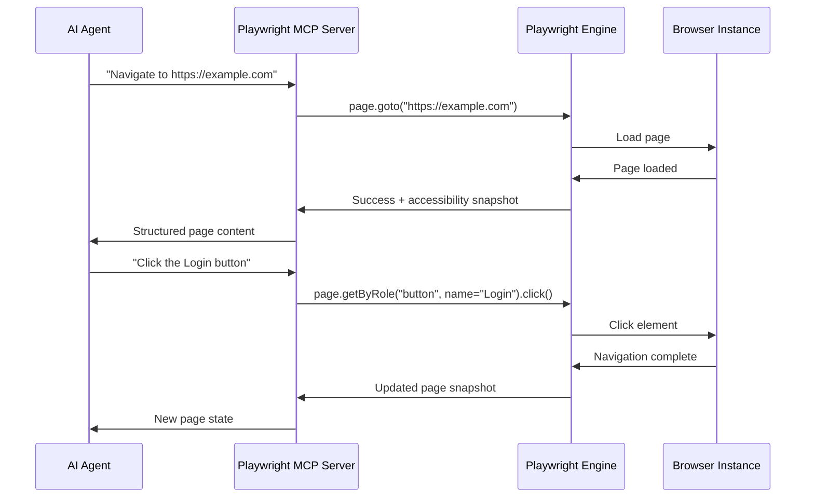
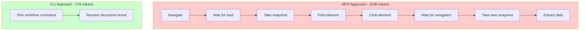
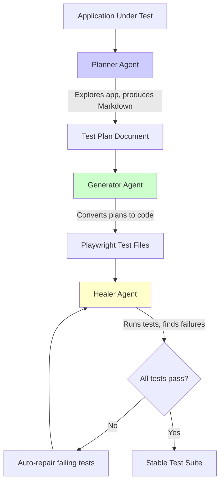

[Playwright](/posts/playwright-vs-puppeteer-speed-stealth-developer-experience/) has been the go-to browser automation framework for scraping professionals and testers for years. In early 2026, Microsoft started redesigning it not just for human developers, but for [AI agents](/posts/playwright-for-browser-automation-in-ai-agents/). The official Playwright MCP Server and the new `@playwright/cli` package are a deliberate move toward making browser automation consumable by large language models and agentic systems.

The numbers make the case. Where a Playwright MCP integration might consume 114,000 tokens to complete a browser automation task, the new CLI achieves the same result with roughly 27,000 tokens -- a 4x [token reduction](/posts/llm-powered-data-extraction-schema-driven-scraping-with-structured-output/) that matters for any [LLM extraction](/posts/best-llm-structured-data-extraction-html-2026/) pipeline. When you are paying per token and running hundreds of agent tasks per day, that difference reshapes your entire cost model.

## What Is MCP and Why Does It Matter

The Model Context Protocol is an open standard for connecting AI models to external tools and services. It acts as a universal adapter between an LLM and the outside world. Instead of baking tool-specific logic into every AI agent, MCP provides a standardized interface: the agent describes what it wants to do, the MCP server translates that into concrete actions, and the results flow back to the agent in a format it can understand.

For browser automation, this means an AI agent does not need to know the Playwright API. It does not need to construct JavaScript snippets or manage browser lifecycle details. It tells the MCP server "navigate to this page" or "click the submit button," and the server handles the rest.


```mermaid
sequenceDiagram
    participant Agent as AI Agent
    participant MCP as Playwright MCP Server
    participant PW as Playwright Engine
    participant Browser as Browser Instance

    Agent->>MCP: "Navigate to https://example.com"
    MCP->>PW: page.goto("https://example.com")
    PW->>Browser: Load page
    Browser->>PW: Page loaded
    PW->>MCP: Success + accessibility snapshot
    MCP->>Agent: Structured page content

    Agent->>MCP: "Click the Login button"
    MCP->>PW: page.getByRole("button", name="Login").click()
    PW->>Browser: Click element
    Browser->>PW: Navigation complete
    PW->>MCP: Updated page snapshot
    MCP->>Agent: New page state
```

The Playwright MCP Server is Microsoft's official implementation of this pattern. It exposes Playwright's browser control capabilities through the MCP protocol, allowing any MCP-compatible AI agent to drive a browser without writing a single line of Playwright code.

## Setting Up the Playwright MCP Server

Getting started is straightforward. The MCP server runs as a standalone process that your AI agent connects to -- whether that is Claude Desktop, [a file-based AI agent](/posts/ai-file-agents-claude-cowork-and-the-new-automation-frontier/), or a custom orchestrator.

```python
# Install Playwright MCP server
# npm install -g @playwright/mcp
# Or use npx to run it directly

# Configuration for Claude Desktop (claude_desktop_config.json)
import json

mcp_config = {
    "mcpServers": {
        "playwright": {
            "command": "npx",
            "args": ["@playwright/mcp"]
        }
    }
}

# Write to Claude Desktop config
config_path = "~/.config/claude/claude_desktop_config.json"
print(json.dumps(mcp_config, indent=2))
```

Once running, the MCP server exposes tools like `browser_navigate`, `browser_click`, `browser_type`, `browser_screenshot`, and `browser_snapshot`. An AI agent discovers these tools through the MCP protocol and uses them to drive the browser, from simple navigation to complex [form filling](/posts/how-to-automate-web-form-filling-complete-guide/) workflows.

## The CLI Alternative: 4x Token Reduction

While MCP is powerful, it is verbose. Every interaction between the agent and the MCP server involves a round trip: the agent requests an action, receives the result, decides what to do next, requests another action. Each exchange consumes tokens.

The `@playwright/cli` takes a different approach. Instead of exposing individual browser actions as tools, it provides higher-level commands that batch multiple operations together. The agent can describe a complete workflow in a single command rather than issuing step-by-step instructions.


```mermaid
flowchart TD
    subgraph MCP["MCP Approach - 114K tokens"]
        A1["Navigate"] --> A2["Wait for load"]
        A2 --> A3["Take snapshot"]
        A3 --> A4["Find element"]
        A4 --> A5["Click element"]
        A5 --> A6["Wait for navigation"]
        A6 --> A7["Take new snapshot"]
        A7 --> A8["Extract data"]
    end

    subgraph CLI["CLI Approach - 27K tokens"]
        B1["Run workflow command"] --> B2["Receive structured result"]
    end

    style MCP fill:#ffcccc
    style CLI fill:#ccffcc
```

```python
# Using Playwright CLI for token-efficient automation
import subprocess
import json

def run_playwright_cli(command, args=None):
    """Execute a Playwright CLI command and return structured output."""
    cmd = ["npx", "@playwright/cli", command]
    if args:
        cmd.extend(args)

    result = subprocess.run(
        cmd,
        capture_output=True,
        text=True,
        timeout=30
    )
    return json.loads(result.stdout) if result.stdout else None


# Example: Navigate and extract in a single CLI call
result = run_playwright_cli("run", [
    "--url", "https://example.com/products",
    "--action", "extract",
    "--selector", ".product-card",
    "--fields", "title:.product-name,price:.product-price"
])

print(f"Extracted {len(result['items'])} products")
for item in result["items"]:
    print(f"  {item['title']}: {item['price']}")
```

The token reduction matters for two reasons. First, cost: if your agent runs hundreds of browser automation tasks per day, cutting token usage by 75% directly reduces your API bill. Second, speed: fewer round trips means faster task completion. An agent that describes its intent in a single command and receives structured results will always outperform one that needs to issue ten sequential instructions.

## The Three Playwright Agents

Beyond the protocol and CLI layers, Microsoft introduced three specialized agent definitions that handle common automation workflows end to end. These agents are purpose-built for specific tasks and designed to work together.


```mermaid
flowchart TD
    A["Application Under Test"] --> B["Planner Agent"]
    B -->|"Explores app, produces Markdown"| C["Test Plan Document"]
    C --> D["Generator Agent"]
    D -->|"Converts plans to code"| E["Playwright Test Files"]
    E --> F["Healer Agent"]
    F -->|"Runs tests, finds failures"| G{"All tests pass?"}
    G -->|No| H["Auto-repair failing tests"]
    H --> F
    G -->|Yes| I["Stable Test Suite"]

    style B fill:#ccccff
    style D fill:#ccffcc
    style F fill:#ffffcc
```

### The Planner

The Planner agent explores your application and produces a structured Markdown test plan. You point it at a URL, and it navigates through the application, identifies key user flows, and documents what should be tested. The output is not code -- it is a human-readable plan that describes each test scenario in plain language.

```python
# Using the Planner agent to generate a test plan
import subprocess

def run_planner(target_url, output_path="test-plan.md"):
    """Run the Playwright Planner agent to explore an app."""
    result = subprocess.run(
        [
            "npx", "playwright", "agent", "planner",
            "--url", target_url,
            "--output", output_path
        ],
        capture_output=True,
        text=True,
        timeout=120
    )

    if result.returncode == 0:
        print(f"Test plan written to {output_path}")
        with open(output_path, "r") as f:
            return f.read()
    else:
        print(f"Planner failed: {result.stderr}")
        return None

# Generate a test plan for your application
plan = run_planner("https://my-app.example.com")
```

### The Generator

The Generator takes the Planner's Markdown output and converts it into actual Playwright test files. Each test scenario in the plan becomes a runnable test with proper assertions, selectors, and wait conditions. Run it with `npx playwright agent generator --plan ./test-plan.md --output-dir ./tests/generated`.

### The Healer

The Healer is the most interesting of the three. It runs your test suite, identifies failing tests, diagnoses why they fail, and attempts to repair them automatically. If a CSS selector has changed because the application was updated, the Healer finds the new selector and updates the test. If a timing issue causes a flaky test, it adds appropriate wait conditions.

```python
# Using the Healer agent to auto-repair failing tests
import subprocess
import json

def run_healer(test_dir, max_iterations=3):
    """Run the Playwright Healer to fix failing tests."""
    for iteration in range(max_iterations):
        print(f"\nHealer iteration {iteration + 1}/{max_iterations}")

        result = subprocess.run(
            [
                "npx", "playwright", "agent", "healer",
                "--test-dir", test_dir,
                "--auto-fix"
            ],
            capture_output=True,
            text=True,
            timeout=300
        )

        output = result.stdout
        if "All tests passing" in output:
            print("All tests repaired and passing")
            return True

        print(f"Some tests still failing, attempting next repair cycle...")

    print("Max iterations reached, manual review needed")
    return False

# Auto-heal your test suite
success = run_healer("./tests/generated")
```

The Healer addresses one of the biggest pain points in [browser automation](/posts/selenium-vs-puppeteer-definitive-comparison-web-scraping/): maintenance. Selectors break, page layouts shift, and timing changes. An automated agent that can diagnose and fix these issues reduces the ongoing cost of maintaining large test suites.

## Connecting It All: AI Agent to Browser via MCP

Here is a practical example showing how to configure a complete pipeline where an AI agent uses MCP to drive Playwright for a scraping task.

```python
# Example agent loop using MCP tools
async def scrape_with_mcp_agent(mcp_client):
    """Run a scraping task through an MCP-connected agent."""
    # Navigate to the target
    await mcp_client.call_tool("browser_navigate", {
        "url": "https://example.com/products"
    })

    # Get the page accessibility snapshot
    snapshot = await mcp_client.call_tool("browser_snapshot", {})

    # The agent reasons over the snapshot and decides next actions
    # e.g., click pagination, fill search fields, extract data
    await mcp_client.call_tool("browser_click", {
        "element": "Next Page",
        "ref": "button[aria-label='Next']",
    })

    return await mcp_client.call_tool("browser_snapshot", {})
```

## Chrome for Testing and What Changed in v1.57

Starting with Playwright v1.57, the framework switched from bundling its own Chromium builds to using Chrome for Testing. This is Google's dedicated browser binary built specifically for automated testing, with a stable, versioned API surface that does not change unexpectedly between releases.

For scraping professionals, this matters because Chrome for Testing behaves identically to the Chrome that real users run. This reduces the fingerprinting gap between automated and manual browsing sessions, a key concern in the ongoing [stealth evasion](/posts/playwright-vs-selenium-stealth-which-evades-detection-better/) arms race. Sites that detect automation by comparing browser behavior against a known Chrome baseline will find fewer discrepancies with Chrome for Testing than with the old Chromium builds or [stealth browsers like Camoufox and nodriver](/posts/stealth-browsers-in-2026-camoufox-nodriver-and-the-anti-detection-arms-race/).

## Browser Automation for Machines

Browser automation tools are being redesigned for AI agent consumption, not just human developers. Playwright's MCP server, the CLI with its token efficiency focus, the three specialized agents -- all of these point toward a future where most browser automation is initiated by AI systems rather than human-written scripts.

Browserbase's [Stagehand framework](/posts/browser-agent-frameworks-compared-browser-use-vs-stagehand-vs-skyvern/) builds on top of Playwright with the same philosophy: make browser automation accessible to AI agents through natural language actions. Meanwhile, [Google's Chrome Auto Browse](/posts/google-chrome-auto-browse-what-it-means-for-web-scraping/) signals that major browsers are moving in the same direction.

For scraper and automation tool builders, this creates both opportunities and challenges. AI-driven automation can handle edge cases, [shadow DOM boundaries](/posts/shadow-dom-the-silent-killer-of-ai-web-scraping/), and layout changes that would break traditional scripts. But as browser automation becomes more accessible, [anti-bot systems rise in response](/posts/the-unsolved-problems-of-ai-web-scraping-in-2026/).

The most effective approach is to use these new tools where they add genuine value -- handling dynamic pages, adapting to layout changes, processing unstructured content with tools like [Crawl4AI](/posts/crawl4ai-v08-crash-recovery-prefetch-mode-and-whats-new/) -- while keeping traditional scripted automation or [Puppeteer alternatives](/posts/top-puppeteer-alternatives-what-to-use-instead/) for predictable, high-volume tasks where token costs would be prohibitive.

## Key Takeaways

Playwright's MCP server provides a universal interface for any AI agent to drive a browser. The CLI reduces token costs by 4x through higher-level abstractions. The three specialized agents -- Planner, Generator, and Healer -- address the full lifecycle of test creation and maintenance. And Chrome for Testing closes the fingerprinting gap between automated and manual browsing.

Whether you adopt these tools today or wait for the ecosystem to mature further, browser automation is becoming a first-class capability for AI agents, and the tooling is being designed around that assumption.
