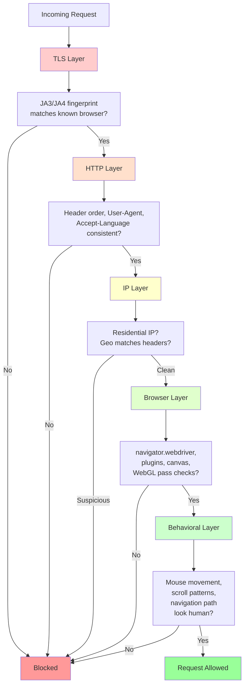

Every scraper leaves fingerprints. When your code makes a request to a website, it reveals information at every layer of the connection -- from the TLS handshake before a single byte of HTTP is exchanged, to the browser-level JavaScript properties that detection scripts probe, to the behavioral patterns of how you navigate pages. Anti-bot systems stack these signals together and use them to separate human visitors from automated tools. The [evolution of detection methods](/posts/evolution-web-scraping-detection-methods-timeline/) shows how these systems have grown more sophisticated over time. A scraper that passes one layer but fails another still gets blocked. Understanding what you reveal at each layer is the first step toward building scrapers that do not stand out.

This post walks through the major stealth layers, explains how detection works at each level, and provides practical examples for reducing your scraper's footprint. The goal is not to bypass any specific service, but to understand the mechanics of detection well enough to make informed decisions about how your scrapers behave.

## HTTP-Level Stealth

The simplest detection checks happen at the HTTP level, and they are also the easiest to get wrong. When you make a request with a library like Python's `requests`, the default headers it sends look nothing like what a real browser sends.

### User-Agent

The User-Agent header is the first thing most detection systems check. The default for Python `requests` is something like `python-requests/2.31.0`, which immediately identifies you as a script. But simply swapping in a Chrome User-Agent is not enough. The User-Agent must be consistent with the rest of your request. If you claim to be Chrome 122 on Windows but send headers that Chrome 122 never sends, the mismatch itself becomes a signal.

```python
# Bad: default User-Agent screams "bot"
import requests
response = requests.get('https://example.com')
# User-Agent: python-requests/2.31.0

# Better: realistic User-Agent, but only the beginning
headers = {
    'User-Agent': 'Mozilla/5.0 (Windows NT 10.0; Win64; x64) AppleWebKit/537.36 (KHTML, like Gecko) Chrome/122.0.0.0 Safari/537.36'
}
response = requests.get('https://example.com', headers=headers)
```

### Header Order

Browsers send headers in a specific, consistent order. Chrome sends headers differently from Firefox, and both differ from Safari. Detection systems fingerprint this order. If you send a `Referer` header before the `Accept` header when Chrome would never do that, you raise a flag.

```python
# Chrome-like header order matters
# Chrome typically sends headers in this sequence:
headers = {
    'Host': 'example.com',
    'Connection': 'keep-alive',
    'sec-ch-ua': '"Chromium";v="122", "Not(A:Brand";v="24", "Google Chrome";v="122"',
    'sec-ch-ua-mobile': '?0',
    'sec-ch-ua-platform': '"Windows"',
    'Upgrade-Insecure-Requests': '1',
    'User-Agent': 'Mozilla/5.0 (Windows NT 10.0; Win64; x64) AppleWebKit/537.36 (KHTML, like Gecko) Chrome/122.0.0.0 Safari/537.36',
    'Accept': 'text/html,application/xhtml+xml,application/xml;q=0.9,image/avif,image/webp,image/apng,*/*;q=0.8',
    'Sec-Fetch-Site': 'none',
    'Sec-Fetch-Mode': 'navigate',
    'Sec-Fetch-User': '?1',
    'Sec-Fetch-Dest': 'document',
    'Accept-Encoding': 'gzip, deflate, br',
    'Accept-Language': 'en-US,en;q=0.9',
}
```

Note that Python's `requests` library does not guarantee header order by default. The `requests` library uses a `dict` for headers, which in modern Python preserves insertion order but may also merge in default headers at unpredictable positions. Libraries like `httpx` or `curl_cffi` give you more control over this.

### Accept-Language and Referer

The `Accept-Language` header should match the locale implied by your IP address. If you are using a proxy in Germany but your `Accept-Language` is `en-US,en;q=0.9`, that inconsistency can be flagged. Similarly, the `Referer` header should make logical sense. If you are requesting a product page, arriving from a search results page is normal. Arriving with no Referer at all on an internal page is not.

```python
# Geo-matched headers for a German proxy
headers = {
    'Accept-Language': 'de-DE,de;q=0.9,en-US;q=0.8,en;q=0.7',
    'Referer': 'https://example.com/search?q=product+name',
}
```

## TLS Fingerprinting

This is the layer that catches scrapers who have perfect HTTP headers. Before any HTTP data is exchanged, the client and server perform a TLS handshake. The client sends a ClientHello message that contains its supported cipher suites, TLS extensions, supported elliptic curves, and signature algorithms. Every TLS library produces a distinct combination of these values, and detection systems hash them into fingerprints using methods like JA3 and JA4.

### JA3 and JA4 Hashes

JA3 was the original TLS fingerprinting method, creating a hash from the TLS version, cipher suites, extensions, elliptic curves, and elliptic curve formats. JA4 expanded on this with a more readable format that includes information about the ALPN protocol and the number of extensions and cipher suites.

The critical point: Python's `requests` library uses OpenSSL through Python's `ssl` module, which produces a TLS fingerprint that maps to "Python/OpenSSL." Chrome uses BoringSSL, which produces a completely different fingerprint. No amount of header manipulation can fix this because the fingerprint is extracted before HTTP headers are even sent.

```python
# Standard requests: perfect headers, Python TLS fingerprint
import requests

response = requests.get('https://tls.peet.ws/api/all')
# JA4 hash will identify this as Python/OpenSSL, not Chrome

# curl_cffi: impersonates Chrome's TLS fingerprint
from curl_cffi import requests as curl_requests

response = curl_requests.get(
    'https://tls.peet.ws/api/all',
    impersonate='chrome'
)
# JA4 hash now matches Chrome
```

### Tools That Solve TLS Fingerprinting

Several libraries have emerged to address this problem:

- **curl_cffi** -- A Python binding for curl-impersonate that can mimic the TLS fingerprint of Chrome, Firefox, and Safari. It supports HTTP/2 and provides a `requests`-compatible API.
- **[httpmorph](/posts/httpmorph-solving-tls-fingerprinting-with-a-c-native-python-http-client/)** -- A C-native Python HTTP client built on BoringSSL (the same TLS library Chrome uses) that produces accurate JA4 fingerprints for Chrome versions.
- **tls-client** -- A Go-based TLS client with Python bindings that supports custom TLS profiles.

```python
from curl_cffi import requests

# Impersonate specific browser versions
session = requests.Session(impersonate='chrome120')
response = session.get('https://example.com')

# The TLS handshake, HTTP/2 settings, and header order
# all match Chrome 120
```

## Request Pattern Stealth

Even with perfect headers and TLS fingerprints, your request patterns can give you away. No human visits a website by requesting 500 pages at exactly 1-second intervals.

### Randomized Delays

Fixed delays between requests are one of the most common mistakes. A real user browses with variable timing -- they pause to read, they click quickly between navigation links, they take breaks. Your scraper should reflect this variation.

```python
import random
import time

def human_delay(min_seconds=1.0, max_seconds=5.0):
    """Generate a random delay that follows a more human-like distribution."""
    # Log-normal distribution produces delays that are usually short
    # but occasionally longer, matching how humans browse
    delay = random.lognormvariate(0, 0.5)
    # Clamp to reasonable bounds
    delay = max(min_seconds, min(delay, max_seconds))
    time.sleep(delay)

# Between page navigations
for url in urls:
    response = session.get(url)
    process(response)
    human_delay(1.5, 8.0)
```

### Session-Like Browsing Patterns

Real users do not jump directly to deep pages. They arrive at a homepage, browse to a category page, and then visit individual items. Anti-bot systems track navigation paths and flag sessions that skip natural browsing sequences.

```python
def browse_like_human(session, target_url):
    """Navigate to a target URL through a realistic path."""
    # Start with the homepage
    session.get('https://example.com/')
    human_delay(2.0, 4.0)

    # Visit a category page
    session.get('https://example.com/products')
    human_delay(1.5, 3.5)

    # Then visit the target
    response = session.get(target_url)
    return response
```

### Avoiding Exact Intervals

Some scrapers randomize delays but still exhibit detectable patterns. For example, if every request takes between 2.0 and 4.0 seconds with uniform distribution, the statistical profile of your request timing is distinguishable from real traffic. Using a distribution like log-normal or Pareto produces more realistic variation, with many short pauses and occasional longer ones.


<figure>
  
  <figcaption>Stealth is not about hiding — it's about looking normal. <span class="img-credit">Photo by cottonbro studio / <a href="https://www.pexels.com" target="_blank" rel="noopener noreferrer">Pexels</a></span></figcaption>
</figure>

## Browser-Level Stealth

When you use a browser automation tool like [Selenium](/posts/selenium-stealth-making-selenium-less-detectable/), Playwright, or Puppeteer, the browser itself leaves traces that detection scripts look for.

### The navigator.webdriver Flag

The most basic check. When a browser is controlled by WebDriver (Selenium), the `navigator.webdriver` property is set to `true`. Real browsers return `false` or `undefined`. This single property has been the starting point for bot detection for years.

```javascript
// What detection scripts check
if (navigator.webdriver === true) {
    // Flag as bot
}

// Also checking for the presence of automation-related properties
if (window.__selenium_unwrapped !== undefined ||
    window.__webdriver_evaluate !== undefined ||
    window.__driver_evaluate !== undefined ||
    document.__selenium_unwrapped !== undefined) {
    // Flag as bot
}
```

### Removing Automation Traces

Modern stealth approaches go beyond just setting `navigator.webdriver` to `false`. Detection scripts check dozens of properties:

```javascript
// Properties that leak automation status
navigator.webdriver          // true in automated browsers
navigator.plugins            // empty in some headless modes
navigator.languages          // may be empty or wrong
window.chrome                // undefined in non-Chrome or headless
window.chrome.runtime        // present in real Chrome, missing in headless
Notification.permission      // 'denied' in headless, often 'default' in real
```

### Canvas and WebGL Fingerprinting

Detection systems render invisible elements on a canvas and hash the output. Every combination of GPU, driver, and OS produces a slightly different rendering. When a headless browser renders a canvas, the output often differs from what the same browser would produce in headed mode on the same hardware.

```javascript
// How canvas fingerprinting works
const canvas = document.createElement('canvas');
const ctx = canvas.getContext('2d');
ctx.textBaseline = 'top';
ctx.font = '14px Arial';
ctx.fillText('Browser fingerprint test', 2, 2);
const fingerprint = canvas.toDataURL();
// This hash is compared against known browser/GPU combinations
```

WebGL fingerprinting goes deeper, querying the GPU renderer and vendor strings:

```javascript
const gl = document.createElement('canvas').getContext('webgl');
const debugInfo = gl.getExtension('WEBGL_debug_renderer_info');
const vendor = gl.getParameter(debugInfo.UNMASKED_VENDOR_WEBGL);
const renderer = gl.getParameter(debugInfo.UNMASKED_RENDERER_WEBGL);
// "Google Inc. (NVIDIA)" in real Chrome
// "Brian Paul" or "Mesa" in headless/virtual environments
```

### Plugin and MimeType Emulation

Real browsers report a list of installed plugins (like Chrome PDF Plugin, Widevine) and supported MIME types. Headless browsers or freshly automated instances often report empty plugin lists, which is a strong bot signal.

## IP Stealth

Your IP address and how you use it are major factors in detection.

### Residential vs. Datacenter Proxies

Datacenter IPs come from cloud providers like AWS, Google Cloud, and DigitalOcean. These IP ranges are well-known and cataloged. When a request comes from a datacenter IP, it is immediately suspicious because real users do not browse from AWS instances.

Residential proxies route traffic through real ISP connections -- actual home internet connections. These IPs are far harder to detect because they are indistinguishable from normal users at the IP level.

| Factor | Datacenter | Residential |
|--------|-----------|-------------|
| Cost | Low ($1-5/GB) | Higher ($5-15/GB) |
| Speed | Very fast | Variable |
| Detection rate | High | Low |
| IP reputation | Often flagged | Usually clean |
| Use case | Low-protection sites | High-protection sites |

### Rotation Strategies

How you rotate IPs matters as much as the type of proxy you use. Rotating on every request looks unnatural -- no real user changes IP addresses every second. Better strategies include:

```python
import random

class ProxyRotator:
    def __init__(self, proxies, requests_per_ip=(10, 30)):
        self.proxies = proxies
        self.requests_per_ip = requests_per_ip
        self.current_proxy = random.choice(proxies)
        self.request_count = 0
        self.rotate_after = random.randint(*requests_per_ip)

    def get_proxy(self):
        """Rotate proxy after a random number of requests."""
        self.request_count += 1
        if self.request_count >= self.rotate_after:
            self.current_proxy = random.choice(self.proxies)
            self.request_count = 0
            self.rotate_after = random.randint(*self.requests_per_ip)
        return {'http': self.current_proxy, 'https': self.current_proxy}

rotator = ProxyRotator([
    'http://proxy1:8080',
    'http://proxy2:8080',
    'http://proxy3:8080',
])

for url in urls:
    response = requests.get(url, proxies=rotator.get_proxy())
```

### Geo-Matching

Your IP's geographic location should match the rest of your request. If your `Accept-Language` header says `en-US` but your IP geolocates to Japan, that mismatch gets flagged. If you are scraping a regional site, use proxies in the same region.


<figure>
  
  <figcaption>The best automation is the kind that looks like a real user. <span class="img-credit">Photo by imsogabriel Stock / <a href="https://www.pexels.com" target="_blank" rel="noopener noreferrer">Pexels</a></span></figcaption>
</figure>

## Behavioral Stealth

This is the hardest layer to fake because it requires simulating the messy, unpredictable patterns of real human interaction.

### Mouse Movements

Real human cursor paths follow curved trajectories with acceleration, deceleration, and micro-jitter. They are not straight lines. They overshoot targets slightly and correct. Detection systems collect `mousemove` events and feed them into classification models that can distinguish human movement from computed paths.

```python
# Playwright example: move mouse along a curved path
import random
import math

async def human_mouse_move(page, start_x, start_y, end_x, end_y, steps=25):
    """Move mouse along a bezier curve with jitter."""
    # Control point for quadratic bezier curve
    ctrl_x = (start_x + end_x) / 2 + random.randint(-100, 100)
    ctrl_y = (start_y + end_y) / 2 + random.randint(-50, 50)

    for i in range(steps + 1):
        t = i / steps
        # Quadratic bezier interpolation
        x = (1 - t)**2 * start_x + 2 * (1 - t) * t * ctrl_x + t**2 * end_x
        y = (1 - t)**2 * start_y + 2 * (1 - t) * t * ctrl_y + t**2 * end_y
        # Add micro-jitter
        x += random.gauss(0, 1.5)
        y += random.gauss(0, 1.5)
        await page.mouse.move(x, y)
        # Variable speed: slower at start and end
        speed = 5 + 15 * math.sin(t * math.pi)
        await page.wait_for_timeout(speed)
```

### Scroll Patterns

Real users scroll in bursts, not smooth continuous motions. They scroll down, pause to read, scroll more, sometimes scroll back up. A scraper that smoothly scrolls to the bottom of the page at constant speed is obviously automated.

```python
async def human_scroll(page, total_distance=3000):
    """Scroll down a page with human-like patterns."""
    scrolled = 0
    while scrolled < total_distance:
        # Variable scroll distance per burst
        burst = random.randint(100, 500)
        await page.mouse.wheel(0, burst)
        scrolled += burst

        # Sometimes pause to "read"
        if random.random() < 0.3:
            await page.wait_for_timeout(random.randint(1000, 3000))

        # Occasionally scroll back up slightly
        if random.random() < 0.1:
            back = random.randint(50, 150)
            await page.mouse.wheel(0, -back)
            scrolled -= back
            await page.wait_for_timeout(random.randint(500, 1500))

        # Short pause between scroll bursts
        await page.wait_for_timeout(random.randint(50, 200))
```

### Realistic Navigation Paths

Real users arrive at websites through search engines, bookmarks, or links from other sites. They do not type internal URLs directly. Their sessions have a natural flow: landing page, exploration, specific pages, and eventually leaving. Simulating this flow makes your scraper's traffic blend in with normal visitors.

## Setting Up a Stealthy Requests Session

Here is a complete example of a `curl_cffi`-based session with proper TLS fingerprinting, realistic headers, and randomized timing:

```python
from curl_cffi import requests
import random
import time

class StealthSession:
    def __init__(self, proxy=None):
        self.session = requests.Session(impersonate='chrome120')
        if proxy:
            self.session.proxies = {
                'http': proxy,
                'https': proxy,
            }
        self.request_count = 0

    def get(self, url, referer=None):
        """Make a GET request with stealth considerations."""
        headers = {}
        if referer:
            headers['Referer'] = referer

        # Randomized delay between requests
        if self.request_count > 0:
            delay = random.lognormvariate(0.5, 0.4)
            delay = max(1.0, min(delay, 10.0))
            time.sleep(delay)

        response = self.session.get(url, headers=headers)
        self.request_count += 1
        return response

    def browse_to(self, target_url, entry_url='https://example.com/'):
        """Navigate to a target through a realistic path."""
        self.get(entry_url)
        return self.get(target_url, referer=entry_url)


# Usage
session = StealthSession(proxy='http://residential-proxy:8080')
response = session.browse_to(
    'https://example.com/products/item-123',
    entry_url='https://example.com/products'
)
print(response.status_code)
```

This session impersonates Chrome 120's TLS fingerprint, maintains proper cookies across requests, and adds realistic delays between navigations.


<figure>
  
  <figcaption>Every browser leaves fingerprints. Stealth tools try to leave the right ones. <span class="img-credit">Photo by Israyosoy S. / <a href="https://www.pexels.com" target="_blank" rel="noopener noreferrer">Pexels</a></span></figcaption>
</figure>

## Configuring Playwright with Stealth Patches

For a detailed comparison of how [Playwright and Selenium compare on stealth](/posts/playwright-vs-selenium-stealth-which-evades-detection-better/), see our dedicated analysis. For sites that require full browser rendering, Playwright with stealth patches is a common approach. The `playwright-stealth` package modifies the browser instance to pass common bot detection checks.

```python
import asyncio
from playwright.async_api import async_playwright
from playwright_stealth import stealth_async
import random

async def stealth_scrape(url):
    async with async_playwright() as p:
        # Launch with realistic arguments
        browser = await p.chromium.launch(
            headless=True,
            args=[
                '--disable-blink-features=AutomationControlled',
                '--disable-features=IsolateOrigins,site-per-process',
                '--no-first-run',
                '--no-default-browser-check',
                '--disable-infobars',
            ]
        )

        context = await browser.new_context(
            viewport={'width': 1920, 'height': 1080},
            user_agent='Mozilla/5.0 (Windows NT 10.0; Win64; x64) '
                       'AppleWebKit/537.36 (KHTML, like Gecko) '
                       'Chrome/122.0.0.0 Safari/537.36',
            locale='en-US',
            timezone_id='America/New_York',
            # Emulate a real screen
            screen={'width': 1920, 'height': 1080},
            color_scheme='light',
        )

        page = await context.new_page()

        # Apply stealth patches
        await stealth_async(page)

        # Navigate with realistic behavior
        await page.goto(url, wait_until='domcontentloaded')

        # Wait a bit like a human would
        await page.wait_for_timeout(random.randint(1000, 3000))

        # Simulate some scrolling
        await page.mouse.wheel(0, random.randint(200, 400))
        await page.wait_for_timeout(random.randint(500, 1500))

        content = await page.content()
        await browser.close()
        return content

# Run the stealth scraper
html = asyncio.run(stealth_scrape('https://example.com'))
```

### What Stealth Patches Actually Do

The `playwright-stealth` package and similar tools apply a set of JavaScript overrides to the page before any detection scripts run. These overrides typically:

1. Set `navigator.webdriver` to `undefined`
2. Add realistic `navigator.plugins` entries
3. Override `navigator.permissions.query` to return expected values
4. Patch `chrome.runtime` to simulate the real Chrome extension API
5. Override `Notification.permission` to return `'default'` instead of `'denied'`
6. Modify the `navigator.languages` array to match the locale

```javascript
// Example: what stealth patches do to navigator.webdriver
Object.defineProperty(navigator, 'webdriver', {
    get: () => undefined,
});

// Fake plugins array
Object.defineProperty(navigator, 'plugins', {
    get: () => [
        { name: 'Chrome PDF Plugin', filename: 'internal-pdf-viewer' },
        { name: 'Chrome PDF Viewer', filename: 'mhjfbmdgcfjbbpaeojofohoefgiehjai' },
        { name: 'Native Client', filename: 'internal-nacl-plugin' },
    ],
});
```

## Testing Your Stealth

Before scraping a real target, test your setup against bot detection test sites. These sites run the same detection scripts used by commercial anti-bot services and show you exactly what you reveal.

### Bot Detection Test Sites

- **bot.sannysoft.com** -- Shows a dashboard of browser properties and flags ones that indicate automation. Checks `navigator.webdriver`, plugins, languages, canvas hash, WebGL renderer, and more.
- **abrahamjuliot.github.io/creepjs** -- CreepJS performs deep fingerprinting including canvas, WebGL, audio context, fonts, and hardware concurrency. It assigns a trust score and shows which properties are inconsistent.
- **browserleaks.com** -- Comprehensive fingerprint analysis covering IP geolocation, JavaScript API results, WebRTC leaks, canvas fingerprints, and font detection.
- **tls.peet.ws/api/all** -- Shows your raw TLS fingerprint including JA3 and JA4 hashes, cipher suites, and TLS extensions. Essential for verifying that your TLS impersonation is working.

```python
# Quick TLS fingerprint check
from curl_cffi import requests

# Check what fingerprint the target sees
session = requests.Session(impersonate='chrome120')
response = session.get('https://tls.peet.ws/api/all')
data = response.json()
print(f"JA4: {data.get('ja4')}")
print(f"User-Agent: {data.get('user_agent')}")
print(f"HTTP Version: {data.get('http_version')}")
```

### Checking Your Browser Fingerprint

For browser-based scraping, automate a visit to a detection test site and capture the results:

```python
import asyncio
from playwright.async_api import async_playwright
from playwright_stealth import stealth_async

async def check_stealth():
    async with async_playwright() as p:
        browser = await p.chromium.launch(headless=True)
        page = await browser.new_page()
        await stealth_async(page)

        await page.goto('https://bot.sannysoft.com')
        await page.wait_for_timeout(5000)

        # Screenshot the results
        await page.screenshot(path='stealth_test.png', full_page=True)

        # Check specific properties
        webdriver = await page.evaluate('navigator.webdriver')
        plugins = await page.evaluate('navigator.plugins.length')
        languages = await page.evaluate('navigator.languages')

        print(f"webdriver: {webdriver}")
        print(f"plugins count: {plugins}")
        print(f"languages: {languages}")

        await browser.close()

asyncio.run(check_stealth())
```

## The Stealth Layers

The following diagram shows how detection works across multiple layers. Your scraper must pass every layer to avoid being flagged. Failing at any single layer can result in blocking, regardless of how well you handle the others.



Each layer narrows the population of requests that pass through. A basic script using Python `requests` with default settings fails at the TLS layer. A script with `curl_cffi` and proper headers passes TLS and HTTP but fails at the browser layer if the site requires JavaScript execution. A headless browser with stealth patches passes the browser layer but may fail behavioral checks if it does not simulate mouse and scroll activity. Only a scraper that addresses every layer can consistently avoid detection on well-protected sites.

## The Ethics of Stealth

Understanding stealth techniques is important for anyone working with web data, but it comes with responsibilities. Not every application of stealth is appropriate, and the line between legitimate use and misuse is not always clear.

### When Stealth Is Appropriate

- **Accessing public data** -- If the data is publicly available to any visitor with a browser, using stealth techniques to access it programmatically is generally in the same spirit as visiting the page manually. [Rate limiting, respecting `robots.txt`](/posts/how-to-configure-rate-limiting-user-agent-rotation-responsibly/), and avoiding unnecessary load on servers are still important.
- **Academic and security research** -- Researchers studying anti-bot systems, web accessibility, or internet censorship often need to understand and work around detection systems as part of their work.
- **Testing your own systems** -- If you operate a website with anti-bot protection, testing it with stealth scrapers is the only way to evaluate how well your defenses work.
- **Competitive monitoring of public pricing** -- Many businesses monitor publicly listed prices. Using stealth to avoid being fed different prices than regular customers ensures data accuracy.

### When It Crosses a Line

- **Violating terms of service** -- Most websites have ToS that prohibit automated access. While ToS enforcement varies by jurisdiction, knowingly violating them carries legal risk.
- **Scraping personal or private data** -- Stealth techniques should never be used to access data that users have not made public. Privacy regulations like GDPR apply regardless of how you collect the data.
- **Causing harm to the target** -- Aggressive scraping that degrades site performance, consumes excessive resources, or interferes with normal users is harmful regardless of how stealthy it is.
- **Circumventing access controls** -- If a site requires login, payment, or other access controls to view data, bypassing those controls goes beyond scraping public information.

The general principle is straightforward: stealth should help your scraper behave more like a respectful visitor, not enable it to do things a visitor could not. Sending realistic headers, maintaining proper timing, and using standard browser features is simply good engineering. Using those techniques to scrape behind paywalls, harvest personal data, or overload servers is not.

## Conclusion

Stealth in web scraping is not a single trick or a magic library. It is a layered discipline that spans the entire connection stack -- from the TLS handshake to the mouse cursor. Each layer has its own detection mechanisms and its own solutions:

- **TLS**: Use libraries like `curl_cffi` or `httpmorph` that produce browser-accurate fingerprints.
- **HTTP**: Send headers in the correct order with consistent, realistic values.
- **IP**: Use residential proxies with geo-matching and realistic rotation strategies.
- **Browser**: Apply stealth patches using [stealth browsers](/posts/stealth-browsers-in-2026-camoufox-nodriver-and-the-anti-detection-arms-race/) or tools like [nodriver](/posts/nodriver-complete-guide-undetected-browser-automation-python/), ensure consistent fingerprints, handle canvas and WebGL probes.
- **Behavioral**: Simulate human-like mouse movements, scroll patterns, and navigation paths.

No scraper needs to implement every technique. A script hitting a lightly protected API endpoint only needs proper headers. A project targeting a site behind Cloudflare needs TLS fingerprinting. A scraper working against a site with advanced behavioral detection needs all of the above. Match your stealth investment to the detection level you face, and always scrape responsibly.
