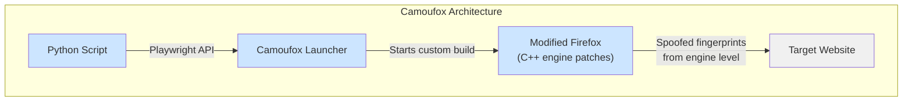
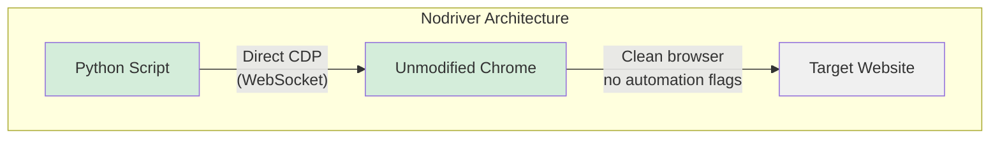
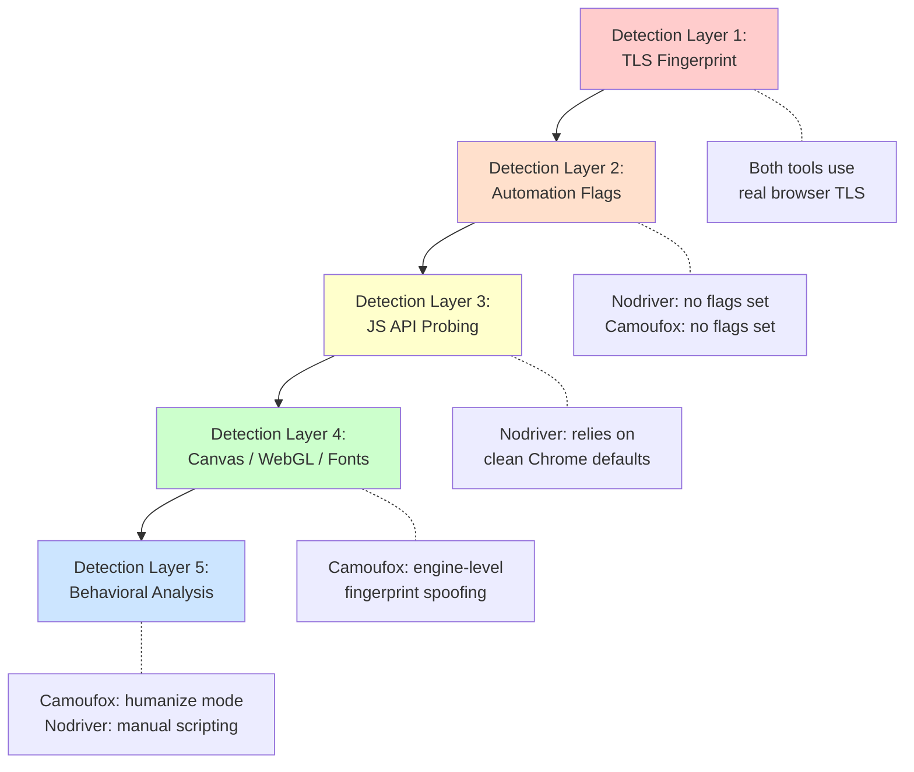
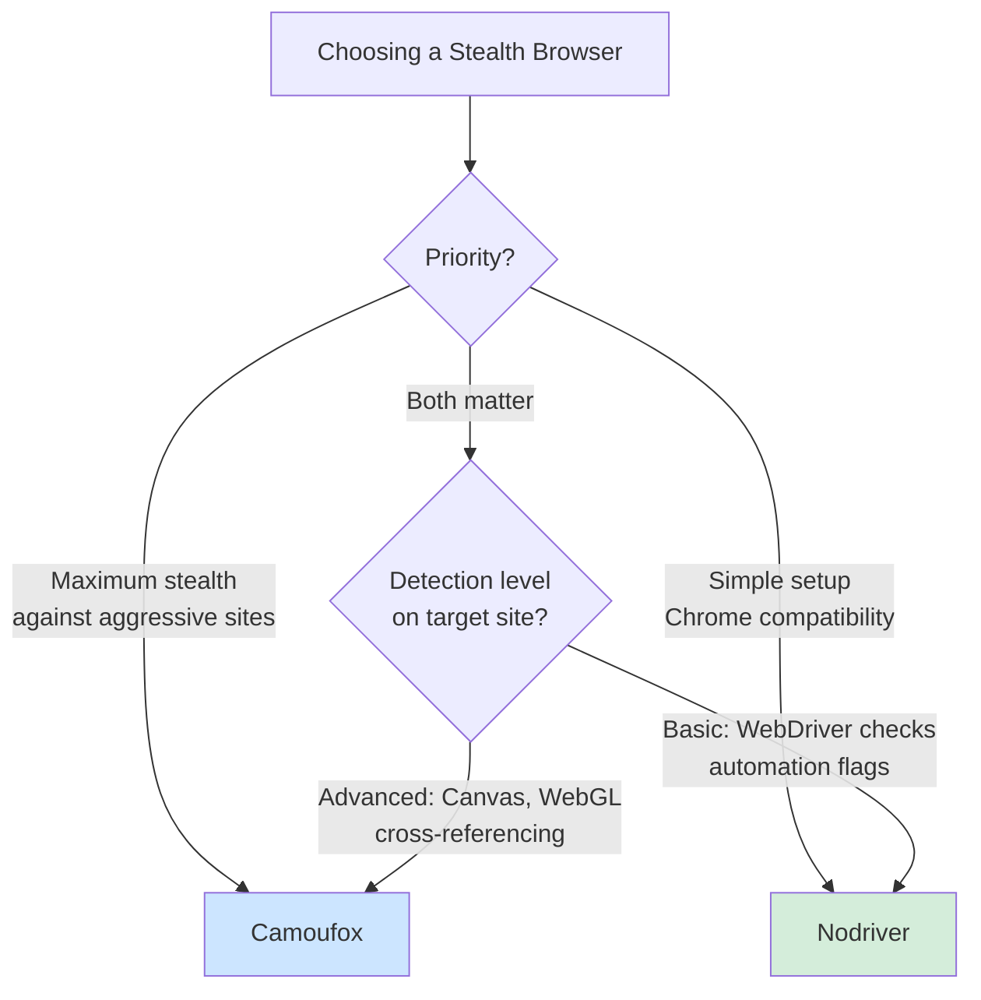

Camoufox and nodriver are the two most capable [stealth browser automation tools](/posts/stealth-browsers-in-2026-camoufox-nodriver-and-the-anti-detection-arms-race/) available today, but they achieve stealth through fundamentally different strategies. Camoufox modifies Firefox at the C++ engine level, rewriting the source code so that no JavaScript patch exists for detection scripts to find. Nodriver takes the opposite approach: it communicates with an unmodified Chrome through raw DevTools Protocol, avoiding automation markers entirely by never introducing them in the first place. If you want a deeper dive into nodriver specifically, see the [complete guide to nodriver](/posts/nodriver-complete-guide-undetected-browser-automation-python/). Choosing between them means understanding where each one excels and where it falls short.

## Two Philosophies of Stealth

The core question behind every anti-detection tool is: how do you make an automated browser look like a real one? Camoufox and nodriver answer this question in opposite ways.

Camoufox says: rewrite the browser engine so the fingerprints it produces are indistinguishable from a normal browser. Detection scripts can probe all they want --- the answers come from modified C++ code, not from JavaScript shims that can be discovered.

Nodriver says: don't touch the browser at all. Instead, remove every intermediary that introduces detectable artifacts. No ChromeDriver binary, no Selenium WebDriver flag, no automation extensions. Connect directly over the same DevTools Protocol that Chrome DevTools uses, and the browser remains in its factory-default state.





These are not just implementation details. They determine which detection layers each tool can defeat, what browser engine you are locked into, and how much setup is required.

## Understanding the Stealth Depth

Modern anti-bot systems operate at multiple layers. Where a tool intervenes in that stack determines what it can and cannot evade.



### Where Camoufox Goes Deeper

Camoufox operates at the deepest level of the stack. When a detection script renders an invisible canvas and hashes the result, Camoufox produces a fingerprint that matches a legitimate Firefox installation because the rendering engine itself has been modified. When a script enumerates WebGL parameters or font metrics, the responses come from compiled C++ code, not from JavaScript property overrides.

This matters because sophisticated detection systems like DataDome and Cloudflare's managed challenge do not just check if `navigator.webdriver` is set. They look for inconsistencies. They compare your canvas hash against known hashes for your claimed browser version and operating system. The [evolution of these detection methods](/posts/evolution-web-scraping-detection-methods-timeline/) shows how quickly each new layer has been added over the past decade. They check whether your WebGL renderer string matches what a real GPU would produce. They probe whether font rendering metrics align with the OS you claim to be running. JavaScript-level patches inevitably leave gaps in this kind of cross-referencing. Engine-level modifications do not.

### Where Nodriver Holds Its Ground

Nodriver avoids detection by absence rather than deception. Since it never installs ChromeDriver, there are no `cdc_` variables to find. Since it never uses the Selenium WebDriver protocol, `navigator.webdriver` remains `undefined`. Since it launches Chrome with clean arguments, there are no `--enable-automation` flags.

For sites using standard anti-bot checks --- Selenium detection, WebDriver flag probing, basic automation fingerprinting --- nodriver passes cleanly without needing any configuration. The limitation appears when sites deploy deep fingerprinting that examines canvas hashes, WebGL renderers, and font metrics across multiple signals. Nodriver relies on Chrome's default fingerprints, which are genuine but tied to your actual hardware and OS. You cannot spoof them without external tools.

## Code Comparison: Same Task, Both Tools

Let's scrape a product listing page with both tools to see the API differences.

### Camoufox Version

```python
from camoufox.sync_api import Camoufox

def scrape_products_camoufox():
    with Camoufox(
        headless=True,
        humanize=True,
        geoip=True,
    ) as browser:
        page = browser.new_page()
        page.goto("https://example.com/products", wait_until="networkidle")

        # Wait for product cards to render
        page.wait_for_selector(".product-card")

        # Extract product data
        products = page.query_selector_all(".product-card")
        results = []

        for product in products:
            name = product.query_selector(".product-name").inner_text()
            price = product.query_selector(".product-price").inner_text()
            results.append({"name": name, "price": price})

        print(f"Scraped {len(results)} products")
        return results

data = scrape_products_camoufox()
```

### Nodriver Version

```python
import nodriver as uc
import asyncio

async def scrape_products_nodriver():
    browser = await uc.start(headless=False)
    page = await browser.get("https://example.com/products")

    # Wait for product cards to render
    await page.wait_for(".product-card")

    # Extract product data using JavaScript evaluation
    results = await page.evaluate("""
        () => {
            const cards = document.querySelectorAll('.product-card');
            return Array.from(cards).map(card => ({
                name: card.querySelector('.product-name')?.textContent?.trim(),
                price: card.querySelector('.product-price')?.textContent?.trim()
            }));
        }
    """)

    print(f"Scraped {len(results)} products")
    browser.stop()
    return results

data = asyncio.run(scrape_products_nodriver())
```

A few differences stand out immediately.

**API style.** Camoufox exposes a Playwright-compatible API with methods like `query_selector`, `inner_text`, and `wait_for_selector`. If you already know Playwright, the learning curve is minimal. For a broader look at how Camoufox stacks up against Selenium-based approaches, see [Camoufox vs Selenium](/posts/camoufox-vs-selenium-anti-detection-approaches-compared/). Nodriver has its own API that leans more heavily on JavaScript evaluation for complex extraction tasks.

**Sync vs async.** Camoufox provides both synchronous and asynchronous APIs through `camoufox.sync_api` and `camoufox.async_api`. Nodriver is async-only, built on `asyncio` from the ground up. If your project is synchronous, Camoufox is more convenient. If you are running high-concurrency scraping, nodriver's async-first design is a natural fit.

**Headless mode.** Camoufox supports true headless operation cleanly. Nodriver traditionally works best in headed mode, though recent versions have improved headless support. Running nodriver headless can sometimes trigger additional detection on aggressive sites.

## Browser Engine: Firefox vs Chrome

This is not just a branding difference. The choice of browser engine has real consequences for scraping.

### When Firefox (Camoufox) Wins

- **Fingerprint diversity.** Most automation tools use Chrome, which means anti-bot systems are heavily optimized for detecting automated Chrome sessions. Firefox is a less common automation target, which means detection models are less tuned for it.
- **Canvas and WebGL.** Camoufox's engine-level modifications mean canvas and WebGL fingerprints are spoofed at the source. You can generate fingerprints that match any Firefox version on any OS.
- **OS spoofing.** Camoufox can convincingly pretend to be running on Windows while actually running on Linux, because the OS-dependent rendering paths have been modified in the engine.

### When Chrome (Nodriver) Wins

- **Site compatibility.** Some websites are built and tested exclusively on Chromium-based browsers. Certain JavaScript frameworks, rendering behaviors, and media codecs work differently or not at all in Firefox.
- **Extensions ecosystem.** If your scraping workflow depends on Chrome extensions (for example, CAPTCHA solving services that provide Chrome extensions), nodriver supports loading them natively.
- **Market share alignment.** Chrome holds roughly 65% of global browser market share. When you scrape with Chrome, your browser fingerprint blends in with the majority of web traffic. Firefox sits around 3%, which can actually stand out on sites that factor browser popularity into their risk scoring.


<figure>
  
  <figcaption>Firefox's architecture offers unique advantages for fingerprint resistance. <span class="img-credit">Photo by Caio / <a href="https://www.pexels.com" target="_blank" rel="noopener noreferrer">Pexels</a></span></figcaption>
</figure>

## Performance Characteristics

### Nodriver's Async Advantage

Nodriver is built on `asyncio`, which means you can run multiple tabs or browser instances concurrently within a single Python process without threading.

```python
import nodriver as uc
import asyncio

async def scrape_page(browser, url):
    page = await browser.get(url)
    await page.wait_for("body")
    title = await page.evaluate("document.title")
    return {"url": url, "title": title}

async def scrape_many():
    browser = await uc.start()

    urls = [
        "https://example.com/page/1",
        "https://example.com/page/2",
        "https://example.com/page/3",
        "https://example.com/page/4",
        "https://example.com/page/5",
    ]

    # Run all pages concurrently
    tasks = [scrape_page(browser, url) for url in urls]
    results = await asyncio.gather(*tasks)

    for result in results:
        print(f"{result['url']}: {result['title']}")

    browser.stop()

asyncio.run(scrape_many())
```

### Camoufox's Playwright Foundation

Camoufox inherits Playwright's mature concurrency model, which supports both sync and async patterns. For async workloads, you switch to `camoufox.async_api`.

```python
from camoufox.async_api import AsyncCamoufox
import asyncio

async def scrape_page(browser, url):
    page = await browser.new_page()
    await page.goto(url, wait_until="domcontentloaded")
    title = await page.title()
    await page.close()
    return {"url": url, "title": title}

async def scrape_many():
    async with AsyncCamoufox(headless=True) as browser:
        urls = [
            "https://example.com/page/1",
            "https://example.com/page/2",
            "https://example.com/page/3",
            "https://example.com/page/4",
            "https://example.com/page/5",
        ]

        tasks = [scrape_page(browser, url) for url in urls]
        results = await asyncio.gather(*tasks)

        for result in results:
            print(f"{result['url']}: {result['title']}")

asyncio.run(scrape_many())
```

In practice, both tools can handle concurrent page loads efficiently. Nodriver has a slight edge in raw async ergonomics because the entire library was designed around `asyncio`. Camoufox's async API is a wrapper around Playwright's async mode, which is battle-tested but adds a thin layer of abstraction.

## Detection Test Results

To compare these tools fairly, you need to test them against real detection systems rather than relying on marketing claims.

### Basic Detection Tests

Both tools pass the standard automation detection checks cleanly:

| Test | Camoufox | Nodriver |
|------|----------|----------|
| `navigator.webdriver` is undefined | Pass | Pass |
| No `cdc_` variables in DOM | Pass | Pass |
| No Selenium/WebDriver artifacts | Pass | Pass |
| Chrome DevTools Protocol detection | N/A (Firefox) | Pass |
| Basic bot detection pages (bot.sannysoft.com) | Pass | Pass |

### Advanced Fingerprinting Tests

This is where the tools diverge:

| Test | Camoufox | Nodriver |
|------|----------|----------|
| Canvas fingerprint consistency | Pass (spoofed) | Pass (real hardware) |
| WebGL renderer spoofing | Pass | Partial (cannot spoof) |
| Font enumeration cross-check | Pass | Depends on system |
| OS fingerprint vs actual OS | Pass (can spoof) | Fails if mismatched |
| Cloudflare managed challenge | Pass | Inconsistent |
| DataDome advanced detection | Pass | Often blocked |
| CreepJS consistency score | High | Medium |

The pattern is clear. For basic to intermediate detection, both tools work well. For advanced fingerprinting that cross-references multiple browser properties, Camoufox's engine-level approach produces more consistent results because all the spoofed values come from the same source and do not contradict each other.

Nodriver's fingerprints are genuine, which is actually an advantage in one specific scenario: when you are scraping from a machine whose hardware fingerprint is unique enough to be trackable across sessions. In that case, nodriver produces a consistent, real fingerprint that looks like a regular user. Camoufox generates different fingerprints per session by default, which is better for avoiding cross-session tracking but requires careful configuration to avoid unrealistic combinations.

## Setup and Installation

### Nodriver: Minimal Setup

```bash
pip install nodriver
```

That is it. Nodriver uses whatever Chrome or Chromium installation is already on your system. No custom browser downloads, no binary management, no additional dependencies beyond Python.

```python
import nodriver as uc
import asyncio

async def quick_test():
    browser = await uc.start()
    page = await browser.get("https://example.com")
    print(await page.evaluate("document.title"))
    browser.stop()

asyncio.run(quick_test())
```

### Camoufox: More Steps, More Power

```bash
# Install the Python package with optional geoip support
pip install camoufox[geoip]

# Download the custom Firefox build (runs automatically on first use)
python -m camoufox fetch
```

The `camoufox fetch` command downloads a custom-compiled Firefox binary, which is around 100-200 MB depending on your platform. This is a one-time download, but it means Camoufox is not a pure pip install. You need disk space for the custom browser, and CI/CD pipelines need to account for this download step.

```python
from camoufox.sync_api import Camoufox

with Camoufox(headless=True) as browser:
    page = browser.new_page()
    page.goto("https://example.com")
    print(page.title())
```

### Dependency Weight

| Factor | Camoufox | Nodriver |
|--------|----------|----------|
| pip install | `camoufox[geoip]` | `nodriver` |
| Additional download | Custom Firefox (~150 MB) | None (uses system Chrome) |
| External dependencies | Playwright | None |
| Python version | 3.8+ | 3.9+ |
| First-run setup | Automatic browser download | None |
| Docker image size impact | Significant (custom Firefox) | Minimal |

For quick prototyping or lightweight deployments, nodriver's zero-download approach is a clear advantage. For production scraping at scale where stealth is the priority, Camoufox's heavier footprint is a worthwhile trade-off.


<figure>
  
  <figcaption>Anti-detection is as much about consistency as it is about spoofing. <span class="img-credit">Photo by Mikhail Nilov / <a href="https://www.pexels.com" target="_blank" rel="noopener noreferrer">Pexels</a></span></figcaption>
</figure>

## Feature Comparison at a Glance



| Feature | Camoufox | Nodriver |
|---------|----------|----------|
| Browser engine | Modified Firefox | Unmodified Chrome |
| Stealth approach | Engine-level C++ patches | Clean CDP connection |
| API style | Playwright-compatible | Custom async API |
| Sync support | Yes | No (async only) |
| Async support | Yes | Yes (native) |
| Headless mode | Full support | Supported, some caveats |
| Fingerprint spoofing | Canvas, WebGL, fonts, OS | None (uses real fingerprints) |
| OS spoofing | Yes | No |
| GeoIP matching | Built-in | Manual configuration |
| Human-like behavior | Built-in `humanize` mode | Manual scripting |
| Proxy support | Yes (Playwright-style) | Yes (browser args) |
| Chrome extensions | No (Firefox-based) | Yes |
| Setup complexity | Medium (custom browser download) | Low (pip install only) |
| Docker friendliness | Requires custom Firefox in image | Uses standard Chrome image |
| Maintained by | daijro | ultrafunkamsterdam |
| License | MPL 2.0 | AGPL 3.0 |

## When to Use Which

### Choose Camoufox When

- The target site uses Cloudflare's managed challenge, DataDome, or similar advanced detection.
- You need to spoof OS-level fingerprints (running on Linux but appearing as Windows).
- Canvas and WebGL fingerprint consistency is critical.
- You need built-in human-like mouse movement and interaction patterns.
- Firefox compatibility is acceptable for your target sites.
- You are building a production scraping pipeline where stealth is non-negotiable.

### Choose Nodriver When

- The target site uses standard Selenium/WebDriver detection without deep fingerprinting.
- You need Chrome-specific features or site compatibility.
- You want the simplest possible setup with no custom browser downloads.
- Your scraping workflow uses Chrome extensions.
- You are prototyping or building a lightweight scraper.
- You are running in constrained environments (small Docker images, CI/CD without much disk space).
- Your project is async-first and you want native `asyncio` integration.

### Combining Both

Some teams use both tools. They start with nodriver for sites with basic detection and switch to Camoufox for the harder targets. Since the tools use different browser engines and different APIs, there is no conflict in having both installed.

```python
# router.py - Route URLs to the appropriate stealth tool
import asyncio
from camoufox.async_api import AsyncCamoufox
import nodriver as uc

# Sites known to require deep stealth
HARD_TARGETS = [
    "heavily-protected-site.com",
    "aggressive-detection.com",
]

async def scrape_with_nodriver(url):
    browser = await uc.start()
    page = await browser.get(url)
    await page.wait_for("body")
    content = await page.evaluate("document.body.innerText")
    browser.stop()
    return content

async def scrape_with_camoufox(url):
    async with AsyncCamoufox(headless=True, humanize=True) as browser:
        page = await browser.new_page()
        await page.goto(url, wait_until="networkidle")
        content = await page.inner_text("body")
        return content

async def smart_scrape(url):
    domain = url.split("//")[-1].split("/")[0]

    if any(target in domain for target in HARD_TARGETS):
        print(f"Using Camoufox for {domain}")
        return await scrape_with_camoufox(url)
    else:
        print(f"Using Nodriver for {domain}")
        return await scrape_with_nodriver(url)

# Usage
result = asyncio.run(smart_scrape("https://example.com"))
```

## The Verdict

There is no single winner. Camoufox and nodriver solve the same problem at different depths, and the right choice depends on what you are scraping.

If your targets deploy aggressive fingerprinting --- canvas hashing, WebGL cross-referencing, OS consistency checks, behavioral analysis --- Camoufox is the stronger tool. Its engine-level modifications produce fingerprints that are internally consistent in ways that JavaScript patches and clean-protocol approaches cannot match. The cost is a heavier setup, Firefox-only operation, and a larger deployment footprint.

If your targets use standard automation detection --- WebDriver flag checks, ChromeDriver artifact scanning, basic JavaScript probes --- nodriver handles them cleanly with a fraction of the complexity. A single `pip install`, no custom browser downloads, native async support, and Chrome compatibility make it the faster tool to adopt and the easier one to maintain.

For teams scraping across many sites with varying detection levels, the practical answer is to use both: nodriver for the easy targets, Camoufox for the hard ones. You can also explore how [Playwright compares to Camoufox](/posts/playwright-vs-camoufox-stealth-automation-head-to-head/) if you are evaluating a third option. The two tools complement each other rather than compete, because they operate on different browser engines and different layers of the detection stack.
