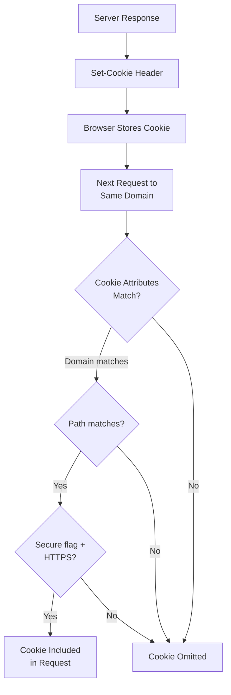
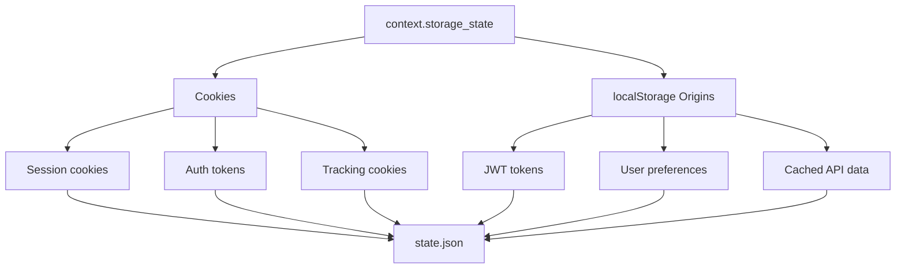
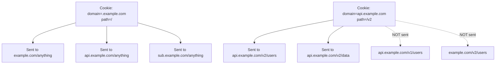
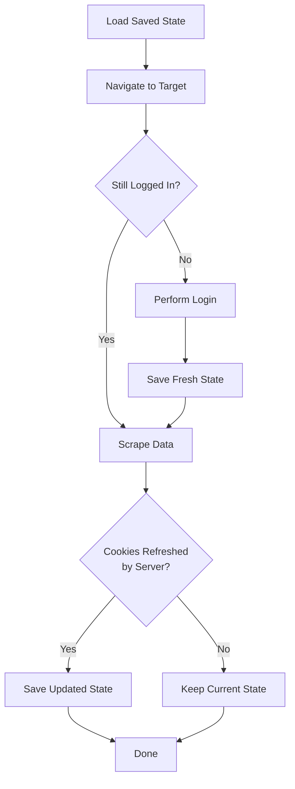

Cookies are the mechanism websites use to track sessions, remember login state, and associate a sequence of stateless HTTP requests with a single user. When you are scraping authenticated content with Playwright, managing cookies properly is not optional -- it is the difference between seeing a dashboard full of data and getting redirected to a login page on every request. Playwright gives you fine-grained control over cookies at the browser context level, which means you can read them, inject them, persist them to disk, and restore them across entirely separate scraping runs. If you are still deciding between Playwright and other automation tools, the [Playwright vs Puppeteer comparison](/posts/playwright-vs-puppeteer-speed-stealth-developer-experience/) covers the key differences. This post walks through every technique you need, from basic cookie reads to full storage state management that eliminates redundant logins.

## How Cookies Work at the HTTP Level

Before touching Playwright's API, it helps to understand what cookies actually are at the protocol level. A cookie is a small piece of data that the server sends to the browser via a `Set-Cookie` HTTP response header. The browser stores it and automatically includes it in subsequent requests to the same domain via the `Cookie` request header.

```
HTTP/1.1 200 OK
Set-Cookie: session_id=abc123; Path=/; Domain=.example.com; HttpOnly; Secure; SameSite=Lax

GET /dashboard HTTP/1.1
Host: example.com
Cookie: session_id=abc123
```

Each cookie has several attributes that control its behavior:

- **Name and Value**: the key-value pair itself
- **Domain**: which domain the cookie belongs to -- `.example.com` includes all subdomains
- **Path**: the URL path prefix where the cookie is valid
- **Expires / Max-Age**: when the cookie should be deleted -- session cookies have no expiry and disappear when the browser closes
- **HttpOnly**: prevents JavaScript from accessing the cookie via `document.cookie`
- **Secure**: cookie is only sent over HTTPS connections
- **SameSite**: controls whether the cookie is sent with cross-site requests



Playwright's browser context manages this entire lifecycle automatically, just like a real browser. Every page opened within a context shares the same cookie jar. This is the foundation that makes session persistence work.

## Reading Cookies from a Context

The `context.cookies()` method returns every cookie currently stored in the browser context. Each cookie is a dictionary with all the attributes the browser tracks.

```python
from playwright.async_api import async_playwright

# After navigating to a page, read all cookies:
cookies = await context.cookies()
for cookie in cookies:
    print(f"{cookie['name']}: {cookie['value']} "
          f"(domain={cookie['domain']}, httpOnly={cookie.get('httpOnly', False)})")
```

You can also filter cookies by URL to get only those that would be sent to a specific domain:

```python
# Get cookies that apply to a specific URL
cookies = await context.cookies("https://example.com")

# Filter for multiple URLs at once
cookies = await context.cookies(["https://example.com", "https://api.example.com"])
```

This is useful when a scraping session touches multiple domains and you need to extract just the authentication cookies for one of them.

## Setting Cookies Before Navigation

The `context.add_cookies()` method lets you inject cookies into a context before navigating to any page. This is the core technique for skipping login flows -- if you already have valid session cookies from a previous run or from a manual login, you can inject them directly.

```python
async def set_cookies_before_navigation():
    async with async_playwright() as p:
        browser = await p.chromium.launch()
        context = await browser.new_context()

        # Inject cookies before any navigation
        await context.add_cookies([
            {
                "name": "session_id",
                "value": "abc123def456",
                "domain": ".example.com",
                "path": "/",
                "httpOnly": True,
                "secure": True,
                "sameSite": "Lax"
            },
            {
                "name": "user_preferences",
                "value": "lang=en&theme=dark",
                "domain": ".example.com",
                "path": "/",
                "httpOnly": False,
                "secure": True,
                "sameSite": "Lax"
            }
        ])

        page = await context.new_page()
        # This request will include both cookies automatically
        await page.goto("https://example.com/dashboard")

        await browser.close()

asyncio.run(set_cookies_before_navigation())
```

Every cookie you add requires at minimum a `name`, `value`, and either a `domain` or a `url`. If you provide `url`, Playwright infers the domain and path from it. If you provide `domain` directly, you must also provide `path`.

```python
# Using url instead of domain + path
await context.add_cookies([
    {
        "name": "token",
        "value": "eyJhbGciOiJIUzI1NiJ9...",
        "url": "https://example.com/api"
    }
])
```

## Saving Cookies to File for Reuse

The simplest persistence strategy is to dump cookies to a JSON file after a successful login, then load them back on subsequent runs. This avoids hitting the login endpoint repeatedly and reduces the chance of triggering rate limits or CAPTCHAs on the login page.

```python
import asyncio
import json
from pathlib import Path
from playwright.async_api import async_playwright

COOKIE_FILE = Path("cookies.json")

async def login_and_save_cookies():
    async with async_playwright() as p:
        browser = await p.chromium.launch(headless=False)
        context = await browser.new_context()
        page = await context.new_page()

        # Navigate to login page
        await page.goto("https://example.com/login")

        # Fill in credentials and submit
        await page.fill("#username", "myuser")
        await page.fill("#password", "mypassword")
        await page.click("#login-button")

        # Wait for navigation to complete after login
        await page.wait_for_url("**/dashboard**")

        # Extract all cookies from the context
        cookies = await context.cookies()

        # Save to JSON file
        COOKIE_FILE.write_text(json.dumps(cookies, indent=2))
        print(f"Saved {len(cookies)} cookies to {COOKIE_FILE}")

        await browser.close()

asyncio.run(login_and_save_cookies())
```

The resulting JSON file contains an array of cookie objects, each with `name`, `value`, `domain`, `path`, `expires`, `httpOnly`, `secure`, and `sameSite` attributes -- the same structure shown later in the storage state section.

## Restoring Cookies to Skip Login

Loading cookies back is straightforward. Read the JSON file, inject the cookies into a fresh context, and navigate directly to the authenticated page.

```python
async def scrape_with_saved_cookies():
    if not COOKIE_FILE.exists():
        print("No saved cookies found. Run login first.")
        return

    cookies = json.loads(COOKIE_FILE.read_text())

    async with async_playwright() as p:
        browser = await p.chromium.launch()
        context = await browser.new_context()

        # Inject saved cookies
        await context.add_cookies(cookies)

        page = await context.new_page()
        await page.goto("https://example.com/dashboard")

        # Check if we are actually logged in
        if "/login" in page.url:
            print("Cookies expired. Need to login again.")
            return

        # Proceed with scraping
        content = await page.content()
        print(f"Page loaded, content length: {len(content)}")

        await browser.close()

asyncio.run(scrape_with_saved_cookies())
```

The practical pattern of combining cookie loading with a login fallback is shown in the full example later in this post.


<figure>
  
  <figcaption>Browser automation turns repetitive tasks into reliable scripts. <span class="img-credit">Photo by ThisIsEngineering / <a href="https://www.pexels.com" target="_blank" rel="noopener noreferrer">Pexels</a></span></figcaption>
</figure>

## Storage State: Cookies and localStorage in One Call

Playwright provides a higher-level persistence mechanism that goes beyond cookies. The `context.storage_state()` method captures both cookies and localStorage origins in a single JSON structure. This is more complete than saving cookies alone because many modern web applications store authentication tokens, user preferences, or cached data in localStorage alongside their session cookies.



Saving storage state to a file:

After a successful login, save the complete state with a single call:

```python
await context.storage_state(path="state.json")
```

The resulting `state.json` contains a `cookies` array (same format as `context.cookies()`) plus an `origins` array with `localStorage` key-value pairs for each origin. This captures JWT tokens, user preferences, and other client-side state that cookies alone would miss.

## Loading Storage State into a New Context

The real power of storage state is in the loading side. You pass the saved file directly to `browser.new_context()`, and Playwright pre-populates both cookies and localStorage before any navigation happens.

```python
async def scrape_with_saved_state():
    async with async_playwright() as p:
        browser = await p.chromium.launch()

        # Create context with pre-loaded state
        context = await browser.new_context(storage_state="state.json")

        page = await context.new_page()
        # Navigate directly to authenticated page -- no login needed
        await page.goto("https://example.com/dashboard")

        title = await page.title()
        print(f"Page title: {title}")

        await browser.close()

asyncio.run(scrape_with_saved_state())
```

You can also pass a dictionary (serialized with `json.dumps()`) instead of a file path to `storage_state`, which is useful when generating state programmatically or pulling it from a database.

## Practical Example: Login Once, Scrape Many Times

Here is a complete, self-contained script that implements the full pattern. It logs in only when necessary, saves state for reuse, and handles session expiry gracefully.

```python
import asyncio
import json
from pathlib import Path
from playwright.async_api import async_playwright

STATE_FILE = Path("scraper_state.json")
TARGET_URL = "https://example.com/dashboard"
LOGIN_URL = "https://example.com/login"


async def perform_login(context, page):
    """Handle the login flow and save state."""
    await page.goto(LOGIN_URL)
    await page.fill("#username", "myuser")
    await page.fill("#password", "mypassword")
    await page.click("#login-button")
    await page.wait_for_url("**/dashboard**")
    await context.storage_state(path=str(STATE_FILE))
    print("Login complete, state saved.")


async def is_logged_in(page) -> bool:
    """Check if the current page indicates an active session."""
    return "/login" not in page.url


async def scrape_data(page) -> list[dict]:
    """Extract structured data from the authenticated page."""
    rows = await page.query_selector_all("table.data tbody tr")
    results = []
    for row in rows:
        cells = await row.query_selector_all("td")
        if len(cells) >= 3:
            results.append({
                "name": await cells[0].inner_text(),
                "value": await cells[1].inner_text(),
                "date": await cells[2].inner_text(),
            })
    return results


async def main():
    async with async_playwright() as p:
        browser = await p.chromium.launch()

        # Load saved state if available
        if STATE_FILE.exists():
            context = await browser.new_context(
                storage_state=str(STATE_FILE)
            )
        else:
            context = await browser.new_context()

        page = await context.new_page()
        await page.goto(TARGET_URL)

        # Login if needed
        if not await is_logged_in(page):
            print("Session expired or no saved state.")
            await perform_login(context, page)

        # Scrape
        data = await scrape_data(page)
        print(f"Extracted {len(data)} records")
        for record in data:
            print(record)

        # Update saved state with any refreshed cookies
        await context.storage_state(path=str(STATE_FILE))

        await browser.close()

asyncio.run(main())
```

The key detail at the end is re-saving the storage state after scraping. Many servers rotate session tokens or update cookie expiry times during normal use. By saving the state after each successful run, you ensure the next run starts with the freshest possible session.

## Cookie Domains and Paths: Understanding Scope

Cookie scope catches people off guard when they inject cookies manually. The domain and path attributes determine which requests the cookie attaches to, and getting them wrong means your injected cookies silently fail to appear on the requests that need them.



When extracting cookies from one context and injecting them into another, pay attention to the domain values. A common mistake is injecting a cookie with `domain: "example.com"` (no leading dot) when the site originally set it as `.example.com`. Without the leading dot, the cookie will not be sent to subdomains like `api.example.com`.

```python
# Inspect cookie domains after login
cookies = await context.cookies()
for cookie in cookies:
    print(f"{cookie['name']}: domain={cookie['domain']} path={cookie['path']}")

# Common fix: ensure leading dot for subdomain coverage
fixed_cookies = []
for cookie in cookies:
    if not cookie["domain"].startswith("."):
        cookie["domain"] = "." + cookie["domain"]
    fixed_cookies.append(cookie)

await new_context.add_cookies(fixed_cookies)
```


<figure>
  
  <figcaption>Modern tooling makes browser control accessible to every developer. <span class="img-credit">Photo by MASUD GAANWALA / <a href="https://www.pexels.com" target="_blank" rel="noopener noreferrer">Pexels</a></span></figcaption>
</figure>

## Handling Cookie Consent Banners

Cookie consent banners are a practical annoyance in scraping, particularly when [automating web form filling](/posts/how-to-automate-web-form-filling-complete-guide/). They appear as modal overlays, intercept clicks, and sometimes block page interaction until accepted. In automated scraping, the fastest approach is to dismiss them programmatically.

```python
async def dismiss_cookie_banner(page):
    """Attempt to dismiss common cookie consent banners."""
    selectors = [
        "button:has-text('Accept All')",
        "button:has-text('Accept')",
        "#onetrust-accept-btn-handler",
        ".cc-accept",
    ]
    for selector in selectors:
        try:
            button = page.locator(selector).first
            if await button.is_visible(timeout=2000):
                await button.click()
                return True
        except Exception:
            continue
    return False
```

After dismissing, save storage state so the consent cookie persists and the banner does not appear on future runs.

An alternative approach is to pre-inject the consent cookie before visiting the site. Most consent management platforms store the user's choice in a cookie. If you know the cookie name and value, you can skip the banner entirely.

```python
# Pre-inject consent cookies to bypass banners entirely
await context.add_cookies([
    {
        "name": "CookieConsent",
        "value": "true",
        "domain": ".example.com",
        "path": "/"
    },
    {
        "name": "OptanonAlertBoxClosed",
        "value": "2026-02-23T12:00:00.000Z",
        "domain": ".example.com",
        "path": "/"
    }
])
```

## HttpOnly Cookies: Invisible to JavaScript, Visible to Playwright

HttpOnly cookies are set with the `HttpOnly` flag, which prevents client-side JavaScript from accessing them through `document.cookie`. This is a security feature designed to protect session tokens from cross-site scripting (XSS) attacks. When you run `document.cookie` in the browser console, HttpOnly cookies simply do not appear.

This is relevant to scraping because it means you cannot extract session cookies using `page.evaluate("document.cookie")`. The result will be incomplete.

If you try `page.evaluate("document.cookie")`, HttpOnly cookies will be missing from the result. Always use `context.cookies()` instead -- it operates at the browser engine level, below the JavaScript security boundary, and returns every cookie including HttpOnly ones.

## Cookie Expiration and Refresh Strategies

Session cookies expire. When they do, your saved state becomes useless and your scraper gets redirected to a login page. A robust scraping pipeline needs strategies for detecting and handling expiry.



You can check cookie expiry times proactively rather than waiting for a failed request:

```python
import time

async def check_cookie_expiry(context, min_remaining_seconds=300):
    """Check if any critical cookies are close to expiring."""
    cookies = await context.cookies()
    now = time.time()
    expiring = []
    for cookie in cookies:
        expires = cookie.get("expires", -1)
        if expires == -1:
            continue  # Session cookie, no explicit expiry
        remaining = expires - now
        if remaining < min_remaining_seconds:
            expiring.append({"name": cookie["name"], "expired": remaining <= 0})
    return expiring
```

Call this before starting a scraping run. If any cookies have expired, clear the state and re-authenticate. Always save fresh state with `context.storage_state(path="state.json")` after each successful run.

For long-running jobs that span hours, call `context.storage_state(path="state.json")` periodically (e.g., every 10 minutes or every N URLs) and check for session expiry by detecting login redirects after each navigation.

## Bridging Playwright Cookies to HTTP Clients

One of the most powerful patterns in scraping is using Playwright to handle the complex login flow -- JavaScript rendering, CAPTCHA solving, multi-factor authentication -- and then extracting the session cookies for use in a lightweight HTTP client like `httpx` or `requests`. The browser handles the authentication once, and then you switch to raw HTTP requests for speed.

```python
import asyncio
import httpx
from playwright.async_api import async_playwright


async def browser_login_then_http_scrape():
    # Step 1: Login with Playwright
    async with async_playwright() as p:
        browser = await p.chromium.launch()
        context = await browser.new_context()
        page = await context.new_page()

        await page.goto("https://example.com/login")
        await page.fill("#username", "myuser")
        await page.fill("#password", "mypassword")
        await page.click("#login-button")
        await page.wait_for_url("**/dashboard**")

        # Extract cookies for HTTP client
        pw_cookies = await context.cookies()
        await browser.close()

    # Step 2: Convert Playwright cookies to httpx format
    cookie_jar = {}
    for cookie in pw_cookies:
        cookie_jar[cookie["name"]] = cookie["value"]

    # Step 3: Use httpx for fast, lightweight requests
    async with httpx.AsyncClient(cookies=cookie_jar) as client:
        # No browser needed -- pure HTTP requests with session cookies
        response = await client.get("https://example.com/api/data?page=1")
        print(f"Status: {response.status_code}")
        print(f"Data: {response.json()}")

        # Scrape multiple pages efficiently
        for page_num in range(2, 11):
            response = await client.get(
                f"https://example.com/api/data?page={page_num}"
            )
            data = response.json()
            print(f"Page {page_num}: {len(data['results'])} records")

asyncio.run(browser_login_then_http_scrape())
```

This hybrid approach gives you the best of both worlds: Playwright handles the complex browser-dependent login, while the HTTP client handles the actual data extraction at much higher throughput and lower resource usage. For a detailed breakdown of when to use a browser versus a lightweight HTTP client, see [Python requests vs Selenium](/posts/python-requests-vs-selenium-speed-performance-comparison/).

## Summary

Playwright's cookie management operates at the browser context level, giving you complete control over session state. The key APIs are:

| Method | Purpose |
|--------|---------|
| `context.cookies()` | Read all cookies, including HttpOnly |
| `context.cookies(url)` | Read cookies scoped to a specific URL |
| `context.add_cookies([...])` | Inject cookies before navigation |
| `context.clear_cookies()` | Remove all cookies from the context |
| `context.storage_state(path=...)` | Save cookies + localStorage to file |
| `browser.new_context(storage_state=...)` | Load saved state into new context |

The practical workflow is straightforward: log in once with a full browser session, save the state, and reuse it across subsequent runs. When the state expires, detect the failure, re-authenticate, and save fresh state. For high-throughput scraping, extract the cookies from Playwright and transfer them to a lightweight HTTP client. This combination of browser-level authentication with HTTP-level data extraction is one of the most effective patterns in modern web scraping.
