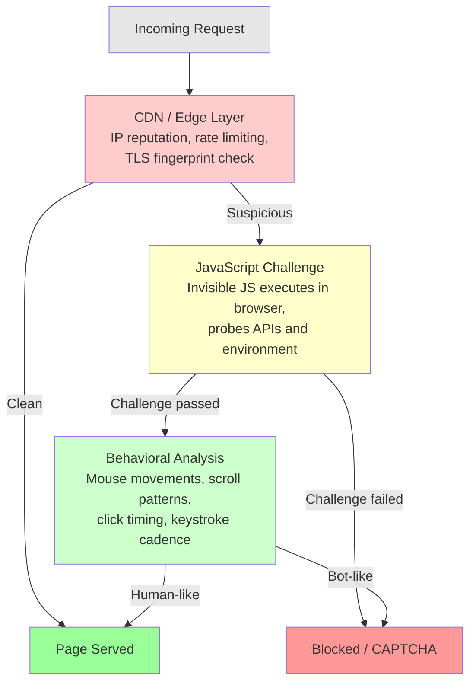
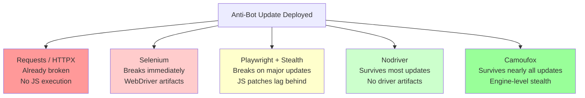
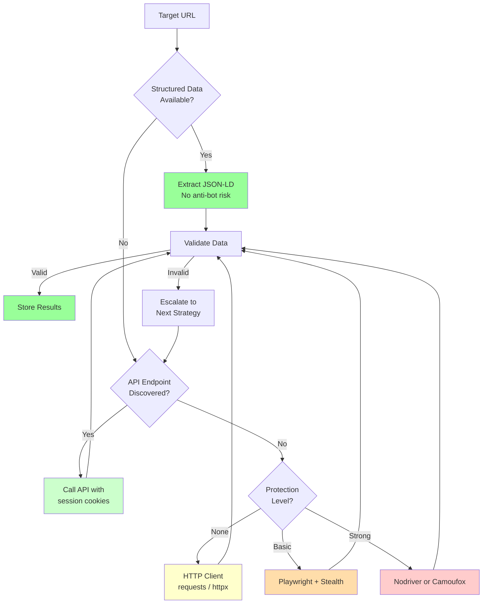

E-commerce sites update their anti-bot defenses frequently. The scraper that pulled product listings cleanly last month may be returning 403 errors or CAPTCHA walls today. These sites have strong incentives to block scrapers: protecting pricing data from competitors, preventing inventory hoarding by bots, and reducing server load from automated traffic. The result is a constant cycle of updates that break existing scrapers and force teams to adapt. This post compares the tools available for e-commerce scraping, examines how each one holds up when anti-bot systems get updated, and covers strategies for building scrapers that degrade gracefully instead of failing silently. For a broader look at how these [stealth browsers](/posts/stealth-browsers-in-2026-camoufox-nodriver-and-the-anti-detection-arms-race/) compare outside the e-commerce context, that guide covers the landscape in detail.

## The Anti-Bot Providers Behind E-Commerce Sites

Most major e-commerce platforms do not build their own anti-bot systems from scratch. They purchase solutions from specialized vendors. Understanding which provider protects a site tells you what you are up against.

**Cloudflare** is the most common. It sits in front of the site as a reverse proxy, handling DNS, CDN, and bot management in one package. Cloudflare's Bot Management uses machine learning models trained on traffic across millions of sites. When it updates, the change affects every site behind it simultaneously. You might find your scraper blocked on dozens of targets overnight.

**DataDome** specializes in bot protection and is popular with mid-to-large e-commerce sites. It runs detection scripts on the client side that probe browser fingerprints deeply. DataDome updates its detection models frequently, sometimes multiple times per week.

**PerimeterX (now HUMAN)** focuses on behavioral analysis. It watches how users interact with pages, building models of normal human behavior and flagging deviations. Its updates often target specific automation patterns it has observed.

**Akamai Bot Manager** runs at the CDN edge. It combines device fingerprinting, behavioral signals, and reputation scoring. Akamai tends to roll out changes gradually, but when updates land, they are thorough.

## How E-Commerce Anti-Bot Stacks Work

Anti-bot protection on e-commerce sites is not a single check. It is a pipeline. A request passes through multiple layers, each one capable of blocking or challenging the visitor.



The key insight is that each layer is independently updateable. A vendor might push new fingerprint checks at the JS challenge layer without touching the edge layer. This means partial breakage: your scraper might pass three out of four checks but fail the one that changed.

## What Changes When Anti-Bot Systems Update

Anti-bot vendors do not announce their updates. You discover them when your scraper starts failing. The [evolution of web scraping detection methods](/posts/evolution-web-scraping-detection-methods-timeline/) shows how these techniques have compounded over the years. Here are the common categories of change.

### New JavaScript Challenges

The JS challenge page is the most frequently updated component. Vendors rewrite their challenge scripts to probe new browser APIs, change obfuscation techniques, and add new consistency checks. A typical update might start checking `navigator.keyboard` or `navigator.ink`, APIs that exist in real browsers but are absent in many automation setups.

```javascript
// Example: a detection script probing for automation artifacts
(function() {
    const checks = [];

    // Check 1: webdriver flag
    checks.push(navigator.webdriver === true);

    // Check 2: Chrome DevTools Protocol artifacts
    checks.push(typeof window.cdc_adoQpoasnfa76pfcZLmcfl !== 'undefined');

    // Check 3: Inconsistent permissions API
    navigator.permissions.query({ name: 'notifications' }).then(function(result) {
        checks.push(result.state === 'prompt' && Notification.permission !== 'default');
    });

    // Check 4: Missing browser-specific APIs
    checks.push(typeof window.chrome === 'undefined');

    // Send results to detection endpoint
    if (checks.some(Boolean)) {
        reportBot();
    }
})();
```

### Updated Fingerprint Checks

TLS fingerprinting evolves as browsers update their cipher suite preferences. When Chrome 130 changes its default extension order, anti-bot systems update their fingerprint databases to match. If your HTTP client still presents a Chrome 125 fingerprint, it looks outdated and suspicious.

Canvas fingerprinting is another moving target. Detection scripts render specific shapes, gradients, and text to an offscreen canvas and hash the output. They know what each real browser version should produce and flag mismatches.

### Behavioral Model Retraining

The behavioral layer gets retrained on fresh data periodically. These models learn new patterns of bot behavior that have been observed in the wild. If a popular automation framework introduces a new way to simulate clicks, behavioral models will eventually learn to detect it.

### Cookie and Token Rotation

Anti-bot systems issue challenge cookies that prove a visitor passed validation. These cookies have formats and lifetimes that change with updates. A scraper that relies on a specific cookie structure may break when the format changes.


<figure>
  
  <figcaption>Anti-bot systems are getting smarter — and so are the tools to navigate them. <span class="img-credit">Photo by Kelly / <a href="https://www.pexels.com" target="_blank" rel="noopener noreferrer">Pexels</a></span></figcaption>
</figure>

## Tool Resilience Comparison

Not all scraping tools respond to anti-bot updates equally. Some break immediately. Others absorb changes and keep working. Here is how the major options stack up.

### Requests and HTTPX

**Resilience: Low**

Pure HTTP clients like Python's `requests` or `httpx` have no browser engine. They cannot execute JavaScript challenges at all. They fail at the second layer of every anti-bot stack.

```python
import httpx

# This works fine on unprotected sites
response = httpx.get("https://example-shop.com/products")

# But against Cloudflare or DataDome, you get:
# - 403 Forbidden
# - A challenge page HTML instead of product data
# - A redirect to a CAPTCHA endpoint
```

When anti-bot systems update, requests-based scrapers do not just degrade. They are already broken. The only scenario where they survive is when paired with a tool like `httpmorph` to fix TLS fingerprints and the target does not serve JS challenges. This combination works for a narrow slice of targets.

**When to use:** Unprotected sites, APIs, or as a secondary tool for fetching resources after a browser session has obtained valid cookies.

### Selenium

**Resilience: Low to Moderate**

Selenium automates a real browser, which means it can execute JavaScript challenges. However, standard Selenium leaves obvious fingerprints. The `navigator.webdriver` property is set to `true`. ChromeDriver injects identifiable variables into the page context. The browser binary itself may differ from a standard Chrome installation.

```python
from selenium import webdriver
from selenium.webdriver.chrome.options import Options

options = Options()
options.add_argument("--headless=new")

driver = webdriver.Chrome(options=options)
driver.get("https://example-shop.com/products")

# navigator.webdriver is True
# window.cdc_ variables are present
# Detection scripts catch this immediately
```

When anti-bot updates target webdriver detection, Selenium breaks. Tools like `undetected-chromedriver` patch some of these issues, but they play catch-up with every update. The fundamental problem is that Selenium was built for testing, not stealth.

**When to use:** Sites with minimal bot protection. Legacy projects where rewriting is not feasible.

### Playwright with Stealth Plugins

**Resilience: Moderate**

Playwright provides better low-level control than Selenium. Combined with stealth plugins like `playwright-stealth` (for Node.js) or `playwright-stealth` (for Python), it patches many common detection vectors.

```python
from playwright.sync_api import sync_playwright

with sync_playwright() as p:
    browser = p.chromium.launch(headless=False)
    context = browser.new_context(
        viewport={"width": 1920, "height": 1080},
        user_agent="Mozilla/5.0 (Windows NT 10.0; Win64; x64) "
                   "AppleWebKit/537.36 (KHTML, like Gecko) "
                   "Chrome/131.0.0.0 Safari/537.36",
        locale="en-US",
        timezone_id="America/New_York",
    )

    page = context.new_page()

    # Stealth patches applied here
    # navigator.webdriver = false
    # chrome.runtime injected
    # plugin array populated

    page.goto("https://example-shop.com/products")
    products = page.query_selector_all(".product-card")
```

Playwright stealth survives many routine updates. It breaks when detection scripts start probing deeper than what the stealth patches cover, such as checking Chrome-specific internal APIs or analyzing the timing of how browser APIs respond. For a direct matchup, see [Playwright vs Selenium for stealth](/posts/playwright-vs-selenium-stealth-which-evades-detection-better/). After a major anti-bot update, there is usually a gap of days to weeks before the stealth community publishes patches.

**When to use:** Sites with moderate protection. Projects where you need both scraping and interaction (form filling, pagination).

### Nodriver

**Resilience: Good**

Nodriver connects to Chrome through the raw DevTools Protocol without injecting a driver binary, as explained in the [complete nodriver guide](/posts/nodriver-complete-guide-undetected-browser-automation-python/). This eliminates the largest category of detection vectors. There is no ChromeDriver, no `cdc_` variables, no `webdriver` flag. The browser itself is a standard Chrome installation.

```python
import nodriver as uc

async def scrape():
    browser = await uc.start()
    page = await browser.get("https://example-shop.com/products")

    # No webdriver artifacts
    # No injected driver variables
    # Standard Chrome TLS fingerprint

    products = await page.select_all(".product-card")
    for product in products:
        title = await product.query_selector(".title")
        price = await product.query_selector(".price")
        print(await title.text, await price.text)

    await browser.close()
```

Nodriver survives most anti-bot updates because it starts from a clean baseline. Detection scripts that look for automation artifacts find none. It typically breaks only when vendors update behavioral models to detect the specific interaction patterns that nodriver users tend to produce, or when new Chrome-level fingerprint checks are introduced that require specific browser configuration.

**When to use:** Sites with strong protection where you need a Python-native solution.

### Camoufox

**Resilience: Excellent**

Camoufox takes a different approach entirely. It is a custom build of Firefox with anti-detection patches applied at the C++ engine level. This means that fingerprint spoofing happens inside the browser engine itself, not through JavaScript patches that detection scripts can detect.

```python
from camoufox.sync_api import Camoufox

with Camoufox(
    os="windows",
    humanize=True,
    screen={"width": 1920, "height": 1080},
) as browser:
    page = browser.new_page()
    page.goto("https://example-shop.com/products")

    # Canvas fingerprint matches spoofed OS
    # WebGL renderer consistent with claimed GPU
    # Font enumeration returns expected system fonts
    # All checks are engine-level, not JS patches

    products = page.query_selector_all(".product-card")
```

Camoufox survives anti-bot updates better than any other tool because its modifications are invisible to JavaScript inspection. Detection scripts query browser APIs and get responses that are internally consistent and match a real browser profile. When an anti-bot vendor updates its JS challenges, Camoufox usually passes them without any changes needed on the user's side.

The main risk is when anti-bot vendors start specifically fingerprinting the Camoufox build of Firefox, or when Firefox itself updates in a way that requires Camoufox patches to be refreshed.

**When to use:** Sites with the strongest protection. High-value data collection where reliability matters more than speed.

### Resilience Summary



## Monitoring Strategies: Detect Blocks Before They Cost You Data

The worst outcome is not getting blocked. It is getting blocked and not knowing it. Silent failures, where your scraper receives soft blocks (empty product listings, inflated prices, missing inventory data), can corrupt your dataset for days before anyone notices.

### HTTP Status Monitoring

Track the distribution of HTTP status codes over time. A sudden spike in 403 or 429 responses indicates a new block.

```python
import httpx
from collections import Counter
from datetime import datetime

status_log = []

async def monitored_fetch(url: str, client: httpx.AsyncClient):
    response = await client.get(url)
    status_log.append({
        "url": url,
        "status": response.status_code,
        "timestamp": datetime.utcnow().isoformat(),
    })

    # Alert on anomalies
    recent = [s["status"] for s in status_log[-100:]]
    counter = Counter(recent)
    error_rate = (counter.get(403, 0) + counter.get(429, 0)) / len(recent)

    if error_rate > 0.1:
        alert(f"Block rate at {error_rate:.0%} - possible anti-bot update")

    return response
```

### Content Validation

Status code monitoring is not enough. Some anti-bot systems return 200 OK but serve a challenge page or degraded content. Validate that the response contains the data you expect.

```python
from bs4 import BeautifulSoup

def validate_product_page(html: str) -> bool:
    soup = BeautifulSoup(html, "html.parser")

    # Check for expected elements
    has_products = len(soup.select(".product-card")) > 0
    has_prices = len(soup.select("[data-price]")) > 0

    # Check for challenge page indicators
    is_challenge = any([
        "challenge" in soup.title.text.lower() if soup.title else False,
        soup.select("#challenge-running"),
        soup.select("[data-ray]"),  # Cloudflare ray ID
        "datadome" in html.lower(),
    ])

    return has_products and has_prices and not is_challenge
```

### Fingerprint Drift Detection

Periodically check what your browser looks like from the server's perspective. Services like `browserleaks.com` or self-hosted fingerprint checkers can tell you if your browser's fingerprint has drifted from what a real browser would produce.

```python
import nodriver as uc

async def check_fingerprint():
    browser = await uc.start()
    page = await browser.get("https://browserleaks.com/javascript")

    # Extract key fingerprint values
    webdriver = await page.evaluate("navigator.webdriver")
    plugins_count = await page.evaluate("navigator.plugins.length")
    languages = await page.evaluate("navigator.languages")

    print(f"webdriver: {webdriver}")       # Should be False or undefined
    print(f"plugins: {plugins_count}")     # Should be > 0
    print(f"languages: {languages}")       # Should match locale

    await browser.close()
```


<figure>
  
  <figcaption>Evasion is a strategy game played at the protocol level. <span class="img-credit">Photo by Dmitry Demidov / <a href="https://www.pexels.com" target="_blank" rel="noopener noreferrer">Pexels</a></span></figcaption>
</figure>

## Adaptation Patterns: How to Recover Quickly

When an anti-bot update breaks your scraper, speed matters. Here are patterns that reduce your recovery time.

### Pattern 1: Layered Tool Fallback

Structure your scraper so it can switch between tools at runtime. Start with the fastest option and fall back to more resilient ones.

```python
import asyncio
import httpx

async def fetch_product(url: str) -> dict | None:
    # Layer 1: Try HTTP client first (fastest)
    result = await try_httpx(url)
    if result:
        return result

    # Layer 2: Try Playwright with stealth
    result = await try_playwright(url)
    if result:
        return result

    # Layer 3: Fall back to Camoufox (slowest but most resilient)
    result = await try_camoufox(url)
    if result:
        return result

    # All layers failed - log and alert
    log_failure(url)
    return None

async def try_httpx(url: str) -> dict | None:
    try:
        async with httpx.AsyncClient() as client:
            response = await client.get(url, timeout=10)
            if response.status_code == 200:
                data = parse_product(response.text)
                if validate_product_data(data):
                    return data
    except Exception:
        pass
    return None
```

### Pattern 2: Session Rotation

When blocks start, rotate not just proxies but entire browser profiles. Each session should look like a distinct user.

```python
import random

VIEWPORTS = [
    {"width": 1920, "height": 1080},
    {"width": 1366, "height": 768},
    {"width": 1536, "height": 864},
    {"width": 1440, "height": 900},
]

LOCALES = ["en-US", "en-GB", "en-CA", "en-AU"]

TIMEZONES = [
    "America/New_York",
    "America/Chicago",
    "America/Denver",
    "America/Los_Angeles",
]

def create_fresh_profile() -> dict:
    return {
        "viewport": random.choice(VIEWPORTS),
        "locale": random.choice(LOCALES),
        "timezone_id": random.choice(TIMEZONES),
        "color_scheme": random.choice(["light", "dark"]),
    }
```

### Pattern 3: Delay Randomization

After an anti-bot update, behavioral models are often the trigger. Add human-like timing to your interactions.

```python
import random
import asyncio

async def human_delay(min_ms: int = 800, max_ms: int = 3000):
    """Simulate human thinking time between actions."""
    delay = random.uniform(min_ms, max_ms) / 1000
    # Add occasional longer pauses (reading time)
    if random.random() < 0.1:
        delay += random.uniform(2, 5)
    await asyncio.sleep(delay)

async def scrape_with_human_timing(page, urls: list[str]):
    for url in urls:
        await page.goto(url)
        await human_delay(1000, 3000)

        # Scroll down naturally
        await page.evaluate("window.scrollBy(0, 300)")
        await human_delay(500, 1500)

        # Extract data
        data = await extract_product_data(page)
        yield data

        # Longer pause between pages
        await human_delay(2000, 5000)
```

## The API Alternative

Before investing effort in bypassing anti-bot systems, check whether the data you need is available through an API. Many e-commerce platforms expose product data through official or semi-official channels.

### Official APIs

Some platforms offer developer APIs with structured product data. These are rate-limited but reliable and not subject to anti-bot measures. Examples include product catalog APIs, affiliate data feeds, and marketplace seller APIs.

### Undocumented APIs

Modern e-commerce sites are typically single-page applications. The frontend fetches product data from internal JSON APIs. These endpoints often have lighter anti-bot protection than the HTML pages.

```python
import httpx

async def find_api_endpoints(page):
    """Monitor network requests to find JSON API endpoints."""
    api_calls = []

    page.on("response", lambda response: (
        api_calls.append({
            "url": response.url,
            "status": response.status,
            "content_type": response.headers.get("content-type", ""),
        })
        if "json" in response.headers.get("content-type", "")
        else None
    ))

    await page.goto("https://example-shop.com/products")
    await page.wait_for_load_state("networkidle")

    for call in api_calls:
        print(f"API endpoint: {call['url']}")

    # These JSON endpoints often return structured data
    # that is easier to parse than HTML
```

Once you identify these endpoints, you can often call them directly with an HTTP client, bypassing the frontend anti-bot checks entirely. The trick is that you may need valid session cookies, which you can obtain from a single browser session and reuse across many HTTP requests.


<figure>
  
  <figcaption>Each layer of defense forces scrapers to adapt or fail. <span class="img-credit">Photo by Joaquin Carfagna / <a href="https://www.pexels.com" target="_blank" rel="noopener noreferrer">Pexels</a></span></figcaption>
</figure>

## Structured Data: The Path of Least Resistance

Many e-commerce sites embed structured data in their HTML using JSON-LD or Microdata formats. This data is intended for search engines and is often served even when anti-bot systems are active, because blocking search engine crawlers would hurt the site's SEO.

```html
<!-- JSON-LD structured data embedded in a product page -->
<script type="application/ld+json">
{
    "@context": "https://schema.org",
    "@type": "Product",
    "name": "Wireless Noise-Canceling Headphones",
    "brand": {"@type": "Brand", "name": "AudioTech"},
    "offers": {
        "@type": "Offer",
        "price": "149.99",
        "priceCurrency": "USD",
        "availability": "https://schema.org/InStock"
    },
    "aggregateRating": {
        "@type": "AggregateRating",
        "ratingValue": "4.5",
        "reviewCount": "2847"
    }
}
</script>
```

Extracting this structured data is straightforward and resilient to frontend changes.

```python
import json
from bs4 import BeautifulSoup

def extract_structured_data(html: str) -> list[dict]:
    soup = BeautifulSoup(html, "html.parser")
    results = []

    for script in soup.select('script[type="application/ld+json"]'):
        try:
            data = json.loads(script.string)
            if isinstance(data, list):
                results.extend(data)
            else:
                results.append(data)
        except json.JSONDecodeError:
            continue

    return results

def extract_products(structured_data: list[dict]) -> list[dict]:
    products = []
    for item in structured_data:
        if item.get("@type") == "Product":
            products.append({
                "name": item.get("name"),
                "brand": item.get("brand", {}).get("name"),
                "price": item.get("offers", {}).get("price"),
                "currency": item.get("offers", {}).get("priceCurrency"),
                "availability": item.get("offers", {}).get("availability"),
                "rating": item.get("aggregateRating", {}).get("ratingValue"),
            })
    return products
```

This approach has a significant advantage: structured data formats rarely change when anti-bot systems are updated. The data is maintained for SEO purposes and follows standard schemas.

## Building Resilient Scrapers: The Full Architecture

A production e-commerce scraper should combine multiple strategies into a system that degrades gracefully.



### Implementing Graceful Degradation

```python
import asyncio
import logging
from dataclasses import dataclass, field
from enum import Enum

logger = logging.getLogger(__name__)

class Strategy(Enum):
    STRUCTURED_DATA = "structured_data"
    API = "api"
    HTTP_CLIENT = "http_client"
    PLAYWRIGHT = "playwright"
    NODRIVER = "nodriver"
    CAMOUFOX = "camoufox"

@dataclass
class ScrapeResult:
    url: str
    strategy: Strategy
    data: dict | None = None
    success: bool = False
    error: str | None = None
    timestamp: datetime = field(default_factory=datetime.utcnow)

@dataclass
class ResilientScraper:
    strategies: list[Strategy] = field(default_factory=lambda: [
        Strategy.STRUCTURED_DATA,
        Strategy.API,
        Strategy.HTTP_CLIENT,
        Strategy.PLAYWRIGHT,
        Strategy.NODRIVER,
        Strategy.CAMOUFOX,
    ])

    async def scrape(self, url: str) -> ScrapeResult:
        for strategy in self.strategies:
            logger.info(f"Trying {strategy.value} for {url}")
            try:
                data = await self._execute(strategy, url)
                if data and self._validate(data):
                    return ScrapeResult(
                        url=url,
                        strategy=strategy,
                        data=data,
                        success=True,
                    )
                logger.warning(f"{strategy.value} returned invalid data")
            except Exception as e:
                logger.warning(f"{strategy.value} failed: {e}")

        return ScrapeResult(url=url, strategy=self.strategies[-1], success=False)

    async def _execute(self, strategy: Strategy, url: str) -> dict | None:
        handlers = {
            Strategy.STRUCTURED_DATA: self._try_structured_data,
            Strategy.API: self._try_api,
            Strategy.HTTP_CLIENT: self._try_http,
            Strategy.PLAYWRIGHT: self._try_playwright,
            Strategy.NODRIVER: self._try_nodriver,
            Strategy.CAMOUFOX: self._try_camoufox,
        }
        return await handlers[strategy](url)

    def _validate(self, data: dict) -> bool:
        required_fields = ["name", "price"]
        return all(data.get(f) for f in required_fields)

    # Each _try_* method implements the specific strategy
    # ...
```

### Health Check Dashboard

Track which strategies are working and which are failing across your targets.

```python
from collections import defaultdict
from datetime import datetime, timedelta

class HealthTracker:
    def __init__(self):
        self.results: list[ScrapeResult] = []

    def record(self, result: ScrapeResult):
        self.results.append(result)

    def report(self, hours: int = 24) -> dict:
        cutoff = datetime.utcnow() - timedelta(hours=hours)
        recent = [r for r in self.results if r.timestamp > cutoff]

        stats = defaultdict(lambda: {"success": 0, "failure": 0})
        for r in recent:
            key = r.strategy.value
            if r.success:
                stats[key]["success"] += 1
            else:
                stats[key]["failure"] += 1

        return {
            strategy: {
                "success_rate": s["success"] / max(s["success"] + s["failure"], 1),
                "total": s["success"] + s["failure"],
            }
            for strategy, s in stats.items()
        }
```

When the health report shows a strategy's success rate dropping, that is your signal that an anti-bot update has landed. You can then investigate, update your approach, and shift traffic to strategies that are still working.

## Ethical Considerations

Building resilient scrapers does not mean building aggressive ones. The techniques in this post are about surviving anti-bot updates without disrupting the sites you scrape.

**Respect rate limits.** If a site serves you a 429 Too Many Requests response, back off. Do not retry immediately. Implement exponential backoff with jitter.

```python
import asyncio
import random

async def backoff_retry(func, max_retries: int = 5):
    for attempt in range(max_retries):
        result = await func()
        if result.status_code != 429:
            return result

        wait = (2 ** attempt) + random.uniform(0, 1)
        logger.info(f"Rate limited. Waiting {wait:.1f}s before retry {attempt + 1}")
        await asyncio.sleep(wait)

    raise Exception("Max retries exceeded")
```

**Do not hammer servers.** Space your requests out. A real human does not load 100 product pages per second. Set a reasonable crawl rate and stick to it.

**Check robots.txt.** It may not be legally binding in all jurisdictions, but it represents the site owner's stated preferences. Respecting it is good practice. Meanwhile, some providers are going further with techniques like [Cloudflare's AI Labyrinth](/posts/cloudflare-ai-labyrinth-how-honeypot-pages-are-trapping-scrapers/), which actively traps bots that ignore these boundaries.

**Prefer structured data and APIs.** When the data is available through JSON-LD or an API, use those channels. They put less load on the server than rendering full pages.

**Cache aggressively.** If product data does not change hourly, do not scrape it hourly. Reduce your footprint to what is necessary.

## Key Takeaways

The e-commerce anti-bot landscape is a moving target. No single tool guarantees permanent access to any site. The practical approach is to build systems that combine multiple strategies, monitor for breakage, and adapt quickly.

Start with the lightest approach: structured data and APIs. Escalate to browser-based tools only when necessary. When you do use browsers, choose tools with engine-level stealth over those that rely on JavaScript patches. And always monitor your success rates so you know when an update has landed before it corrupts your data.

The scrapers that survive are not the ones that break through the strongest defenses. They are the ones that find the path of least resistance and switch paths when the landscape changes.
