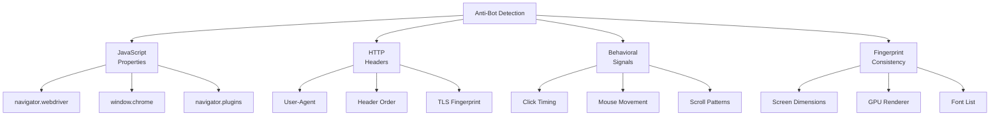
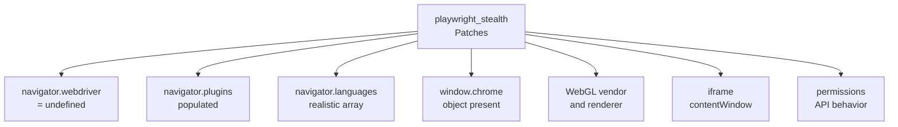
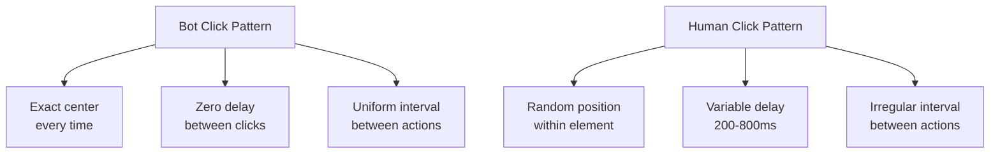
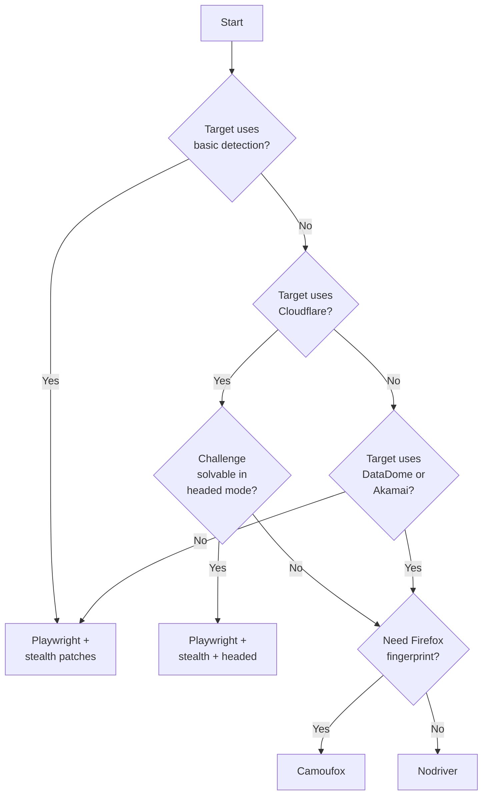

Playwright is one of the best browser automation frameworks available, but it is detectable by default. A fresh Playwright session leaks signals that anti-bot systems like Cloudflare, DataDome, and Akamai pick up instantly --- the `navigator.webdriver` flag, missing browser properties, unrealistic viewport sizes, and machine-gun click timing that no human would produce. The good news is that with the right configuration, most of these signals can be eliminated. This post walks through eight concrete techniques that, applied together, let Playwright bypass the majority of anti-bot systems you will encounter in the wild.

## The Detection Surface

Before jumping into fixes, it helps to understand what you are fighting. Anti-bot systems inspect multiple layers of your browser session simultaneously.



A single leaked signal is enough to get flagged. The [evolution of web scraping detection methods](/posts/evolution-web-scraping-detection-methods-timeline/) shows how these checks have multiplied over the years. The goal is to close every gap, not just the obvious ones.

## Step 1: Remove the Webdriver Flag

The `navigator.webdriver` property is the first thing every detection script checks. Playwright sets it to `true` by default. Removing it is the most basic and essential step.

```python
from playwright.sync_api import sync_playwright

with sync_playwright() as p:
    browser = p.chromium.launch(headless=False)
    context = browser.new_context()
    page = context.new_page()

    # Override navigator.webdriver before any page script runs
    page.add_init_script("""
        Object.defineProperty(navigator, 'webdriver', {
            get: () => undefined
        });
    """)

    page.goto("https://example.com")
    print(page.evaluate("navigator.webdriver"))  # undefined
    browser.close()
```

The `add_init_script` method injects JavaScript that runs before any page script executes. By redefining `navigator.webdriver` as a getter that returns `undefined`, the property behaves exactly as it does in a normal browser where no automation tool is attached.

This alone is not enough. Detection systems check dozens of other properties. But skipping this step guarantees you will be caught.

## Step 2: Set Realistic Viewport, User Agent, Locale, and Timezone

Default Playwright sessions use a viewport of 1280x720, a generic user agent, and system locale settings that may not match. Anti-bot systems correlate these values --- if your user agent says you are on macOS but your screen resolution is 800x600, that is a red flag.

```python
from playwright.sync_api import sync_playwright

with sync_playwright() as p:
    browser = p.chromium.launch(headless=False)

    context = browser.new_context(
        viewport={"width": 1920, "height": 1080},
        user_agent=(
            "Mozilla/5.0 (Windows NT 10.0; Win64; x64) "
            "AppleWebKit/537.36 (KHTML, like Gecko) "
            "Chrome/122.0.0.0 Safari/537.36"
        ),
        locale="en-US",
        timezone_id="America/New_York",
        color_scheme="light",
        device_scale_factor=1,
    )

    page = context.new_page()
    page.goto("https://example.com")

    # Verify the settings took effect
    ua = page.evaluate("navigator.userAgent")
    lang = page.evaluate("navigator.language")
    tz = page.evaluate("Intl.DateTimeFormat().resolvedOptions().timeZone")
    print(f"UA: {ua}")
    print(f"Language: {lang}")
    print(f"Timezone: {tz}")

    browser.close()
```

The key principle is consistency. Every value should tell the same story. A Windows user agent should pair with a Windows-appropriate screen resolution, English locale if the user agent is an English-region build, and a timezone that makes geographic sense.

### Common Mistakes

| Signal | Bad Value | Realistic Value |
|--------|-----------|-----------------|
| Viewport | 800x600 | 1920x1080 or 1366x768 |
| User-Agent | Playwright default | Current Chrome stable |
| Locale | System default | en-US or en-GB |
| Timezone | UTC | America/New_York |
| Color scheme | Not set | light |

## Step 3: Use Playwright-Stealth Patches

Manually patching every detectable property is tedious and error-prone. The `playwright-stealth` package applies a comprehensive set of patches in one call. For Python, the `playwright_stealth` package handles this.

```bash
pip install playwright-stealth
```

```python
from playwright.sync_api import sync_playwright
from playwright_stealth import stealth_sync

with sync_playwright() as p:
    browser = p.chromium.launch(headless=False)
    context = browser.new_context()
    page = context.new_page()

    # Apply all stealth patches at once
    stealth_sync(page)

    page.goto("https://bot.sannysoft.com")
    # Take a screenshot to visually inspect detection results
    page.screenshot(path="stealth_test.png")
    browser.close()
```

The stealth package patches the following properties that Playwright normally gets wrong.



For Node.js, the equivalent package is `puppeteer-extra-plugin-stealth` used through `playwright-extra`. The patches are similar --- they override `navigator.plugins`, add a fake `window.chrome` object, fix the WebGL renderer string, and normalize the permissions API.

Under the hood, these patches use `Object.defineProperty` to override `navigator.plugins` with a realistic plugin list (Chrome PDF Plugin, Chrome PDF Viewer, Native Client), add a `window.chrome` object with the `runtime`, `loadTimes`, and `csi` properties that detection scripts expect, and normalize the permissions API behavior. The net effect is making the browser session look like a standard Chrome installation instead of an automated instance.

## Step 4: Handle Cloudflare Challenges

Cloudflare is the most common anti-bot system you will encounter, and its newer defenses like the [AI Labyrinth honeypot](/posts/cloudflare-ai-labyrinth-how-honeypot-pages-are-trapping-scrapers/) add another layer of complexity. When it detects suspicious traffic, it serves a JavaScript challenge page that must be solved before the real content loads. The challenge sets a `cf_clearance` cookie that grants access for subsequent requests.

```python
from playwright.sync_api import sync_playwright
from playwright_stealth import stealth_sync
import time

def handle_cloudflare(page, url, max_wait=30):
    """Navigate to a URL and wait for Cloudflare challenge to resolve."""
    page.goto(url, wait_until="domcontentloaded")

    # Check if we hit a Cloudflare challenge
    start = time.time()
    while time.time() - start < max_wait:
        title = page.title()

        # Cloudflare challenge pages have distinctive titles
        if "Just a moment" in title or "Attention Required" in title:
            print(f"Cloudflare challenge detected, waiting... ({int(time.time() - start)}s)")
            time.sleep(2)
            continue

        # Challenge passed --- real page loaded
        print("Challenge cleared.")
        break
    else:
        print("Timed out waiting for Cloudflare challenge.")

    return page


    # Usage with your stealth-configured context:
    page = handle_cloudflare(page, "https://target-site.com")

    # Extract the cf_clearance cookie for future requests
    cf_cookie = next(
        (c for c in context.cookies() if c["name"] == "cf_clearance"), None
    )
```

The critical detail is running in headed mode (`headless=False`). Cloudflare's latest challenges use canvas and WebGL checks that fail in headless mode. If you must run headless, you will need the `--headless=new` flag in Chromium, which uses the new headless mode that is much closer to a headed session.

```python
browser = p.chromium.launch(
    headless=False,  # Prevent Playwright's default --headless flag
    args=["--headless=new"]  # Use Chrome's new headless mode instead
)
```


<figure>
  
  <figcaption>Browser automation turns repetitive tasks into reliable scripts. <span class="img-credit">Photo by ThisIsEngineering / <a href="https://www.pexels.com" target="_blank" rel="noopener noreferrer">Pexels</a></span></figcaption>
</figure>

## Step 5: Randomize Timing with Human-Like Delays

Bots click buttons the instant they appear. Humans do not. Detection systems measure the time between page load and first interaction, the interval between clicks, and the consistency of those intervals. Perfectly uniform timing is a dead giveaway.

```python
import random
import time
from playwright.sync_api import sync_playwright
from playwright_stealth import stealth_sync


def human_delay(min_ms=200, max_ms=800):
    """Sleep for a random duration to simulate human hesitation."""
    delay = random.uniform(min_ms, max_ms) / 1000.0
    time.sleep(delay)


def human_type(page, selector, text):
    """Type text character by character with random delays between keystrokes."""
    page.click(selector)
    human_delay(100, 300)

    for char in text:
        page.keyboard.type(char)
        # Variable delay between keystrokes
        time.sleep(random.uniform(0.05, 0.15))

    human_delay(200, 500)


def human_click(page, selector):
    """Click an element with a short random delay before and after."""
    human_delay(150, 400)

    # Get element bounding box and click at a random point within it
    element = page.locator(selector)
    box = element.bounding_box()
    if box:
        x = box["x"] + random.uniform(5, box["width"] - 5)
        y = box["y"] + random.uniform(5, box["height"] - 5)
        page.mouse.click(x, y)
    else:
        element.click()

    human_delay(200, 600)


with sync_playwright() as p:
    browser = p.chromium.launch(headless=False)
    context = browser.new_context()
    page = context.new_page()
    stealth_sync(page)

    page.goto("https://example.com/login")

    # Human-like interaction sequence
    human_delay(500, 1500)  # Pause after page load
    human_type(page, "#username", "user@example.com")
    human_delay(300, 800)   # Pause between fields
    human_type(page, "#password", "secretpassword")
    human_delay(400, 1000)  # Pause before clicking submit
    human_click(page, "#login-button")

    browser.close()
```

The `human_click` function is particularly important. Instead of clicking the exact center of an element every time, it picks a random point within the element bounds. Real users never click dead center --- their clicks scatter naturally across the button surface.



## Step 6: Use Persistent Browser Context

Every time you create a new browser context, you start with zero cookies, no local storage, and no browsing history. This is suspicious. Real users have cookies from previous visits, cached assets, and stored preferences.

Playwright supports persistent contexts that save and restore browser state across sessions.

```python
from playwright.sync_api import sync_playwright
from playwright_stealth import stealth_sync
import os

PROFILE_DIR = os.path.expanduser("~/.playwright-profiles/session-1")

with sync_playwright() as p:
    # launch_persistent_context saves cookies, localStorage,
    # and other state to the specified directory
    context = p.chromium.launch_persistent_context(
        user_data_dir=PROFILE_DIR,
        headless=False,
        viewport={"width": 1920, "height": 1080},
        user_agent=(
            "Mozilla/5.0 (Windows NT 10.0; Win64; x64) "
            "AppleWebKit/537.36 (KHTML, like Gecko) "
            "Chrome/122.0.0.0 Safari/537.36"
        ),
        locale="en-US",
        timezone_id="America/New_York",
    )

    page = context.pages[0] if context.pages else context.new_page()
    stealth_sync(page)

    page.goto("https://target-site.com")
    # ... perform actions ...

    # State is automatically saved when context closes
    context.close()

    # Next time you launch with the same PROFILE_DIR,
    # all cookies, localStorage, and session data persist
```

For finer control, you can also save and restore cookies manually using `context.cookies()` and `context.add_cookies()` with a JSON file, as shown in our [Playwright cookie management guide](/posts/playwright-cookie-management-http-level-scraping/). This is especially useful for sites that issue long-lived session cookies after you pass an initial challenge. Instead of solving Cloudflare's challenge on every run, solve it once, save the `cf_clearance` cookie, and reuse it until it expires.

## Step 7: Rotate User Agents and Fingerprints

Using the same user agent for hundreds of requests from the same IP is a pattern that rate limiters catch quickly. Rotating user agents and fingerprint parameters between sessions makes each session look like a different user.

```python
import random
from playwright.sync_api import sync_playwright
from playwright_stealth import stealth_sync

USER_AGENTS = [
    {
        "ua": "Mozilla/5.0 (Windows NT 10.0; Win64; x64) AppleWebKit/537.36 "
              "(KHTML, like Gecko) Chrome/122.0.0.0 Safari/537.36",
        "viewport": {"width": 1920, "height": 1080},
        "timezone": "America/New_York",
        "locale": "en-US",
    },
    {
        "ua": "Mozilla/5.0 (Macintosh; Intel Mac OS X 10_15_7) AppleWebKit/537.36 "
              "(KHTML, like Gecko) Chrome/122.0.0.0 Safari/537.36",
        "viewport": {"width": 1440, "height": 900},
        "timezone": "America/Los_Angeles",
        "locale": "en-US",
    },
    {
        "ua": "Mozilla/5.0 (X11; Linux x86_64) AppleWebKit/537.36 "
              "(KHTML, like Gecko) Chrome/122.0.0.0 Safari/537.36",
        "viewport": {"width": 1920, "height": 1080},
        "timezone": "Europe/Berlin",
        "locale": "de-DE",
    },
]


def create_rotated_session(playwright):
    """Create a browser context with a randomly selected fingerprint."""
    profile = random.choice(USER_AGENTS)

    browser = playwright.chromium.launch(headless=False)
    context = browser.new_context(
        viewport=profile["viewport"],
        user_agent=profile["ua"],
        locale=profile["locale"],
        timezone_id=profile["timezone"],
    )

    page = context.new_page()
    stealth_sync(page)

    print(f"Session using: {profile['ua'][:50]}...")
    print(f"Viewport: {profile['viewport']}")
    print(f"Timezone: {profile['timezone']}")

    return browser, context, page


with sync_playwright() as p:
    browser, context, page = create_rotated_session(p)

    page.goto("https://target-site.com")
    # ... scrape data ...

    browser.close()
```

The important detail is that every value in a profile must be internally consistent. Do not pair a Linux user agent with `America/New_York` and `en-GB` --- that combination exists in the real world but is statistically unusual enough to stand out. Keep your profiles based on common real-world configurations.

## Step 8: Block Unnecessary Resources

Many websites load analytics scripts, tracking pixels, and third-party tag managers that fingerprint visitors independently from the site's own anti-bot system. Blocking these reduces your exposure and speeds up page loads.

```python
from playwright.sync_api import sync_playwright
from playwright_stealth import stealth_sync

BLOCKED_DOMAINS = [
    "google-analytics.com",
    "googletagmanager.com",
    "facebook.net",
    "doubleclick.net",
    "hotjar.com",
    "segment.io",
    "mixpanel.com",
    "sentry.io",
    "newrelic.com",
    "datadome.co",
]

BLOCKED_RESOURCE_TYPES = ["image", "font", "media"]


def block_resources(route, request):
    """Abort requests to tracking domains and unnecessary resource types."""
    url = request.url
    resource_type = request.resource_type

    # Block known tracking domains
    if any(domain in url for domain in BLOCKED_DOMAINS):
        route.abort()
        return

    # Block heavy resources that are not needed for scraping
    if resource_type in BLOCKED_RESOURCE_TYPES:
        route.abort()
        return

    route.continue_()


with sync_playwright() as p:
    browser = p.chromium.launch(headless=False)
    context = browser.new_context()
    page = context.new_page()
    stealth_sync(page)

    # Intercept all requests and apply blocking rules
    page.route("**/*", block_resources)

    page.goto("https://target-site.com")
    # ... scrape without being tracked by analytics ...

    browser.close()
```

Be careful with what you block. Some sites check whether their analytics scripts loaded successfully and flag visitors where those scripts are missing. If you suspect this, allow loading the analytics script itself (e.g., `analytics.js`) but block the data collection endpoints (e.g., `/collect`).


<figure>
  
  <figcaption>Modern tooling makes browser control accessible to every developer. <span class="img-credit">Photo by MASUD GAANWALA / <a href="https://www.pexels.com" target="_blank" rel="noopener noreferrer">Pexels</a></span></figcaption>
</figure>

## What Still Gets Detected

Even with all eight techniques applied, some signals are extremely difficult to hide.

### Headless Mode Artifacts

The old headless mode (`headless=True`) is trivially detectable. It lacks a GPU process, reports `HeadlessChrome` in the user agent unless overridden, and fails canvas fingerprinting checks. The new headless mode (`--headless=new`) is better but still has subtle differences from headed Chrome --- the `navigator.connection` API may behave differently, and WebRTC ICE candidate generation can differ.

### Missing GPU Information

WebGL fingerprinting checks `UNMASKED_VENDOR_WEBGL` and `UNMASKED_RENDERER_WEBGL` extensions. In headless mode or on virtual machines, these return generic strings like `Google Inc. (Google)` and `ANGLE (Google, Vulkan 1.3.0, ...)` instead of real GPU names like `NVIDIA GeForce RTX 3080`. Detection systems maintain databases of valid GPU strings and flag anything that does not match.

### Screen Dimension Inconsistencies

`window.screen.width`, `window.screen.height`, `window.outerWidth`, and `window.outerHeight` must all be consistent with each other and with the viewport size. Playwright does not always set `screen.width` to match the viewport, which creates a detectable mismatch.

```python
# Check for screen dimension consistency
page.add_init_script("""
    Object.defineProperty(screen, 'width', { get: () => 1920 });
    Object.defineProperty(screen, 'height', { get: () => 1080 });
    Object.defineProperty(screen, 'availWidth', { get: () => 1920 });
    Object.defineProperty(screen, 'availHeight', { get: () => 1040 });
""")
```

### Browser Feature Support Mismatches

If your user agent claims to be Chrome 122 but the browser engine does not support APIs introduced in Chrome 122, detection systems will notice the inconsistency. Always use a Chromium version that matches your user agent string.

## Testing Your Setup

Before pointing your stealth setup at a real target, test it against public bot detection pages. These sites run the same detection scripts that anti-bot systems use in production.

Using your stealth-configured browser (from the earlier steps), visit each site, wait for detection scripts to finish (`wait_for_timeout(5000)`), and take a full-page screenshot:

```python
TEST_SITES = [
    ("SannySoft", "https://bot.sannysoft.com"),
    ("BrowserLeaks", "https://browserleaks.com/javascript"),
    ("CreepJS", "https://abrahamjuliot.github.io/creepjs/"),
    ("Fingerprint.com", "https://fingerprint.com/demo/"),
    ("Pixelscan", "https://pixelscan.net"),
]

for name, url in TEST_SITES:
    page.goto(url, wait_until="networkidle")
    page.wait_for_timeout(5000)
    page.screenshot(path=f"test_{name.lower()}.png", full_page=True)
```

Review the screenshots carefully. Green results on SannySoft mean those checks passed. CreepJS gives a trust score --- anything below 60% means you have leaks to fix. Pixelscan will flag specific inconsistencies in your fingerprint.

## When Playwright Stealth Is Not Enough

Some anti-bot systems have evolved past what Playwright-stealth can handle. If you are consistently getting blocked after applying all the techniques above, you may want to consider [dedicated stealth browsers](/posts/stealth-browsers-in-2026-camoufox-nodriver-and-the-anti-detection-arms-race/) as an alternative. Here are your escalation options.

### Camoufox

Camoufox is a modified Firefox build specifically designed for anti-detection. Instead of patching browser properties after the fact (like stealth scripts do), Camoufox modifies the browser engine itself so the properties are genuinely real values rather than JavaScript overrides.

```python
# Camoufox uses its own launcher
from camoufox.sync_api import Camoufox

with Camoufox(headless=False) as browser:
    page = browser.new_page()
    page.goto("https://target-site.com")
    # Properties are genuine, not patched ---
    # navigator.webdriver is truly absent, not overridden
    print(page.evaluate("navigator.webdriver"))  # undefined
```

The difference matters because advanced detection systems can detect when a property has been redefined using `Object.defineProperty`. The property descriptor chain shows evidence of tampering. Camoufox avoids this because the browser genuinely does not set those properties.

### Nodriver

Nodriver takes a different approach --- it controls Chrome through the DevTools protocol directly, without a separate driver process. This eliminates the ChromeDriver artifacts and WebSocket connections that detection systems look for.

```python
import nodriver as uc

async def main():
    browser = await uc.start()
    page = await browser.get("https://target-site.com")
    # No driver artifacts, no webdriver flag
    content = await page.get_content()
    print(content[:200])

if __name__ == "__main__":
    uc.loop().run_until_complete(main())
```

### Decision Framework



Playwright with stealth patches handles the vast majority of sites. For a head-to-head on how Playwright compares to Selenium specifically for stealth, see the [Playwright vs Selenium stealth breakdown](/posts/playwright-vs-selenium-stealth-which-evades-detection-better/). Escalate to Camoufox or Nodriver only when you have confirmed that Playwright is not enough by testing against the specific target. You might also explore [undetected-playwright vs playwright-stealth](/posts/undetected-playwright-vs-playwright-stealth-which-plugin/) to pick the right plugin for your needs.

## Putting It All Together

Here is a complete template that combines all eight techniques into a single reusable setup.

```python
def create_stealth_page(playwright):
    """Combines all 8 techniques into a single reusable setup."""
    profile = random.choice(PROFILES)  # From the USER_AGENTS list above

    browser = playwright.chromium.launch(headless=False)
    context = browser.new_context(
        viewport=profile["viewport"],
        user_agent=profile["ua"],
        locale=profile["locale"],
        timezone_id=profile["timezone"],
        color_scheme="light",
    )

    page = context.new_page()
    stealth_sync(page)

    # Fix webdriver flag and screen dimensions
    page.add_init_script("""
        Object.defineProperty(navigator, 'webdriver', { get: () => undefined });
        Object.defineProperty(screen, 'width', { get: () => %d });
        Object.defineProperty(screen, 'height', { get: () => %d });
    """ % (profile["viewport"]["width"], profile["viewport"]["height"]))

    # Block tracking domains
    page.route("**/*", block_resources)
    # Restore saved cookies
    load_cookies(context, COOKIE_FILE)

    return browser, context, page
```

Use `create_stealth_page()` as the entry point for every scraping session. After scraping, save cookies with `json.dump(context.cookies(), f)` for reuse.

Apply these techniques incrementally. Start with the webdriver flag removal and stealth patches, test against your target, and add more layers only if needed. Over-engineering your evasion setup wastes time if the target only checks for `navigator.webdriver`.
