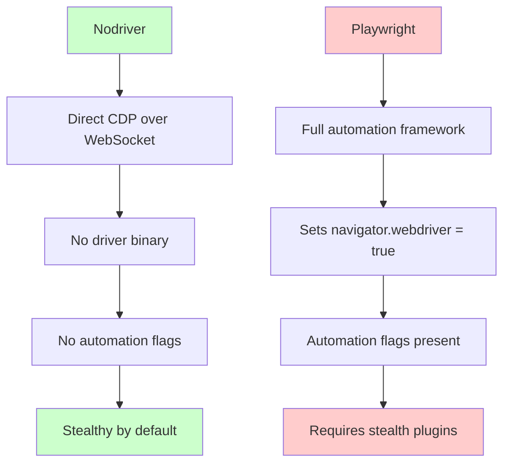
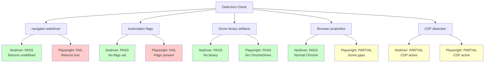
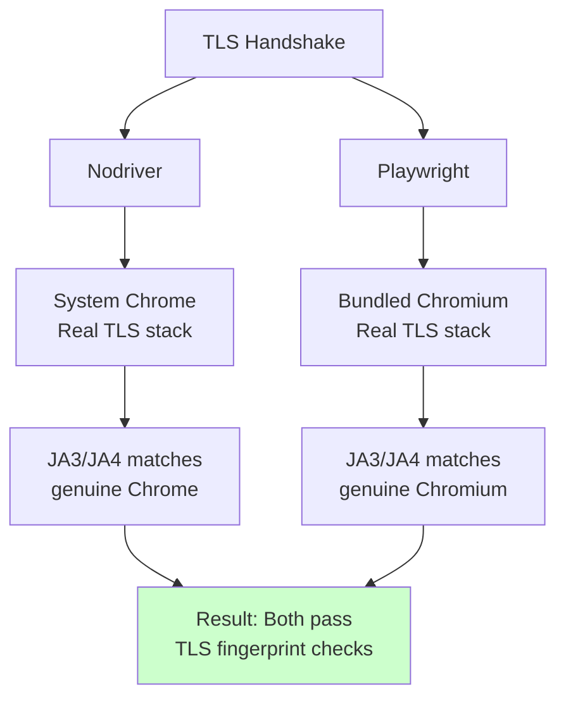
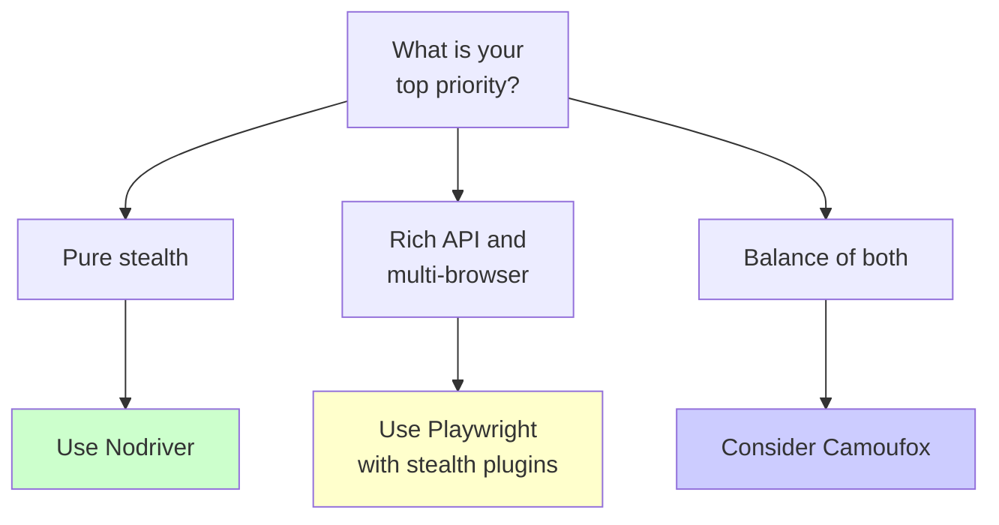

Both nodriver and Playwright can scrape protected sites, but they approach stealth from opposite directions. Nodriver achieves invisibility by removing every automation artifact before the browser even launches. Playwright achieves capability by providing a rich automation framework that can be patched toward stealth after the fact. One starts clean and stays lean. The other starts detectable and bolts on disguises. Which approach holds up better in 2026 depends on what you are building, what you are scraping, and how much detection pressure you face. The [broader stealth browser landscape](/posts/stealth-browsers-in-2026-camoufox-nodriver-and-the-anti-detection-arms-race/) provides additional context for this decision.

## Two Philosophies of Stealth

Nodriver is the successor to undetected-chromedriver, written by the same author. The [complete guide to nodriver](/posts/nodriver-complete-guide-undetected-browser-automation-python/) covers its setup and API in depth. It threw out Selenium and ChromeDriver entirely, replacing them with a direct WebSocket connection to Chrome over the Chrome DevTools Protocol. There is no driver binary, no `navigator.webdriver` flag, no `cdc_` variables injected into the DOM, and no `--enable-automation` flag passed to Chrome. The browser launches the same way it would if a human double-clicked the icon. Stealth is not a feature you enable --- it is the default state.

Playwright is a full-featured automation framework from Microsoft. It supports Chromium, Firefox, and WebKit, with a powerful API for navigation, selectors, network interception, and auto-waiting. Out of the box, it is not stealthy at all. It sets `navigator.webdriver` to `true`, launches with automation-specific flags, and leaves fingerprints that every major anti-bot system catches immediately. To make Playwright stealthy, you need third-party plugins like `playwright-stealth` or the `playwright-extra` ecosystem.



## What Each Tool Leaks by Default

Before applying any patches or plugins, here is what a default session from each tool exposes to detection scripts.

### Nodriver Default Fingerprint

Nodriver's default session is remarkably clean:

- `navigator.webdriver` returns `undefined` (the genuine browser default)
- No `cdc_` variables on the `document` object
- No ChromeDriver process running alongside Chrome
- No `--enable-automation` flag in the browser launch args
- `window.chrome` object is present and properly structured
- `navigator.plugins` contains the standard Chrome plugin entries
- No `Sec-WebDriver` HTTP header

### Playwright Default Fingerprint

A default Playwright session leaks significantly more:

- `navigator.webdriver` returns `true`
- Browser launched with `--enable-automation` and related flags
- Playwright-specific properties injected into the page context
- `navigator.plugins` may be empty or incomplete depending on configuration
- Headless mode has distinct characteristics (missing GPU info, viewport quirks)
- WebGL renderer strings may differ from standard Chrome installations

```javascript
// What a detection script sees on a default Playwright session
console.log(navigator.webdriver);        // true
console.log(navigator.plugins.length);   // 0 (in some configs)
console.log(window.__playwright);        // may exist
console.log(navigator.languages);        // may be ['en-US'] only
```

### Side-by-Side Detection Surface



## Testing Against Common Anti-Bot Checks

To make this concrete, here is how each tool performs against the detection checks that most anti-bot systems run.

### navigator.webdriver

This is the first thing every detection script checks. It is trivial but still catches a surprising number of automated sessions.

**Nodriver:** Passes without any configuration. The property returns `undefined` because no automation framework ever sets it.

**Playwright:** Fails by default. You must use `playwright-stealth` or manually inject JavaScript to override the property before page scripts execute:

```python
# Playwright: manually removing webdriver flag
from playwright.sync_api import sync_playwright

with sync_playwright() as p:
    browser = p.chromium.launch()
    context = browser.new_context()

    # Inject stealth script before any page loads
    context.add_init_script("""
        Object.defineProperty(navigator, 'webdriver', {
            get: () => undefined
        });
    """)

    page = context.new_page()
    page.goto("https://example.com")
```

### CDP Runtime Detection

Some advanced anti-bot systems try to detect active Chrome DevTools Protocol sessions by probing for side effects of CDP commands like `Runtime.evaluate`. Both nodriver and Playwright communicate over CDP, so both are theoretically vulnerable. In practice, this detection is uncommon because Chrome DevTools uses the same protocol, making it hard to distinguish automation from a developer inspecting their own browser.

### Headless Mode Detection

Running headless Chrome saves resources but introduces detectable differences: distinct user agent strings, missing GPU rendering, and viewport quirks.

**Nodriver:** Runs headed by default. When you need headless, it uses Chrome's modern `--headless=new` flag, which is harder to detect than the old headless mode.

**Playwright:** Runs headless by default. Its headless mode has improved but still differs from headed mode in some GPU and rendering checks.

## Code Examples: Basic Stealth Setup

Here is what a minimal stealth-oriented session looks like in each tool.

### Nodriver: Zero-Config Stealth

```python
import nodriver as uc


async def scrape_protected_site():
    # No stealth plugins needed --- this is already undetected
    browser = await uc.start(
        browser_args=[
            "--disable-blink-features=AutomationControlled",
        ]
    )

    page = await browser.get("https://target-site.com")

    # Wait for content to load
    await page.sleep(2)

    # Find and extract data
    items = await page.query_selector_all(".product-card")
    for item in items:
        title = await item.query_selector(".title")
        price = await item.query_selector(".price")
        if title and price:
            print(f"{title.text} - {price.text}")

    browser.stop()


if __name__ == "__main__":
    uc.loop().run_until_complete(scrape_protected_site())
```

That is the entire setup. No plugins, no patches, no binary downloads. The browser launches clean.

### Playwright: Stealth-Patched Setup

```python
from playwright.sync_api import sync_playwright

# Stealth init script covering the most common detection vectors
STEALTH_SCRIPT = """
    // Remove webdriver flag
    Object.defineProperty(navigator, 'webdriver', {
        get: () => undefined
    });

    // Fix plugins array with realistic plugin objects
    Object.defineProperty(navigator, 'plugins', {
        get: () => {
            const plugins = [
                { name: 'Chrome PDF Plugin', description: 'Portable Document Format', filename: 'internal-pdf-viewer', length: 1 },
                { name: 'Chrome PDF Viewer', description: '', filename: 'mhjfbmdgcfjbbpaeojofohoefgiehjai', length: 1 },
                { name: 'Native Client', description: '', filename: 'internal-nacl-plugin', length: 2 },
            ];
            plugins.length = 3;
            return plugins;
        }
    });

    // Fix languages
    Object.defineProperty(navigator, 'languages', {
        get: () => ['en-US', 'en']
    });

    // Add chrome runtime
    window.chrome = {
        runtime: {},
        loadTimes: function() {},
        csi: function() {},
        app: {}
    };

    // Fix permissions query
    const originalQuery = window.navigator.permissions.query;
    window.navigator.permissions.query = (parameters) =>
        parameters.name === 'notifications'
            ? Promise.resolve({ state: Notification.permission })
            : originalQuery(parameters);
"""


def scrape_protected_site():
    with sync_playwright() as p:
        browser = p.chromium.launch(
            headless=False,
            args=[
                "--disable-blink-features=AutomationControlled",
            ]
        )

        context = browser.new_context(
            viewport={"width": 1920, "height": 1080},
            user_agent=(
                "Mozilla/5.0 (Windows NT 10.0; Win64; x64) "
                "AppleWebKit/537.36 (KHTML, like Gecko) "
                "Chrome/122.0.0.0 Safari/537.36"
            ),
            locale="en-US",
        )

        # Inject stealth patches before page scripts run
        context.add_init_script(STEALTH_SCRIPT)

        page = context.new_page()
        page.goto("https://target-site.com")

        # Wait for content
        page.wait_for_selector(".product-card")

        items = page.query_selector_all(".product-card")
        for item in items:
            title = item.query_selector(".title")
            price = item.query_selector(".price")
            if title and price:
                print(f"{title.inner_text()} - {price.inner_text()}")

        browser.close()


scrape_protected_site()
```

The difference in setup complexity is immediately obvious. Playwright requires explicit stealth patches, a carefully constructed user agent, and manual property overrides. Even then, it may not cover every detection vector.

### Using playwright-stealth for Convenience

If you do not want to maintain your own stealth scripts, the `playwright-stealth` package wraps the most common patches:

```python
from playwright.sync_api import sync_playwright
from playwright_stealth import stealth_sync


def scrape_with_stealth_plugin():
    with sync_playwright() as p:
        browser = p.chromium.launch(headless=False)
        page = browser.new_page()

        # Apply stealth patches
        stealth_sync(page)

        page.goto("https://target-site.com")
        page.wait_for_load_state("networkidle")
        print(f"Page loaded, content length: {len(page.content())}")
        browser.close()


scrape_with_stealth_plugin()
```

This is cleaner, but you are still bolting stealth onto a framework that was not designed for it. The patches can break with browser updates and do not cover every detection method.


<figure>
  
  <figcaption>Staying undetected requires understanding what detection systems look for. <span class="img-credit">Photo by Maxim Landolfi / <a href="https://www.pexels.com" target="_blank" rel="noopener noreferrer">Pexels</a></span></figcaption>
</figure>

## Where Nodriver Wins

Nodriver has clear advantages in specific areas.

### Zero Automation Artifacts Out of the Box

This is nodriver's defining strength. You do not need to install stealth plugins, inject JavaScript overrides, or worry about which detection vectors you forgot to cover. The browser launches without automation markers because the tool never sets them in the first place. This is fundamentally more reliable than patching artifacts after they have been created.

### Simpler Mental Model

With Playwright stealth, you are always wondering: did I cover every detection vector? Is there a new check I missed? With nodriver, the mental model is straightforward --- you are controlling a normal Chrome browser through the same protocol that DevTools uses. There is nothing to hide because nothing abnormal was introduced.

### Smaller Attack Surface

Every stealth patch you apply in Playwright is a piece of JavaScript that detection scripts can probe. Advanced anti-bot systems do not just check `navigator.webdriver` --- they check whether the property has been redefined using `Object.defineProperty`. They examine the property descriptor, check the function source code of getters, and look for inconsistencies in the prototype chain. Nodriver avoids this entire cat-and-mouse game because it never modifies any properties.

```javascript
// How advanced detection scripts catch JavaScript patches
const desc = Object.getOwnPropertyDescriptor(navigator, 'webdriver');
if (desc && desc.get && desc.get.toString().includes('undefined')) {
    // This property was manually overridden --- suspicious
    reportAutomation('webdriver_override_detected');
}
```

### Smaller Footprint

Nodriver has minimal dependencies and uses your system Chrome. Playwright downloads separate Chromium, Firefox, and WebKit binaries during installation, totaling over 500 MB.

## Where Playwright Wins

Playwright's strengths are substantial and explain why many teams choose it despite the stealth disadvantage.

### Multi-Browser Support

Playwright supports Chromium, Firefox, and WebKit from a single API. If a target site fingerprints Chrome users specifically, you can switch to Firefox or Safari rendering with a one-line change. Nodriver only supports Chrome and Chromium.

```python
# Playwright: switch browsers trivially
with sync_playwright() as p:
    browser = p.firefox.launch()  # or p.webkit.launch()
    page = browser.new_page()
    page.goto("https://example.com")
```

### Richer API, Better Documentation, Bigger Ecosystem

Playwright's API covers network interception, request modification, route handlers, file uploads, downloads, PDF generation, screenshots, video recording, and tracing. Its documentation is professionally maintained with examples for every method. It integrates with testing frameworks, CI/CD pipelines, and cloud platforms through official Docker images and GitHub Actions.

Nodriver's API is functional but leaner. Documentation is community-maintained and some features require dropping down to raw CDP commands.

### Auto-Waiting and Reliability

Playwright automatically waits for elements to be visible, enabled, and stable before interacting with them. This produces more reliable scripts that are less likely to fail due to timing issues:

```python
# Playwright: auto-waits for the element to be actionable
page.click("#submit-button")
# This will wait until the button is visible, enabled,
# and not obscured before clicking

# Nodriver: you often need explicit waits
import nodriver as uc


async def click_with_wait():
    browser = await uc.start()
    page = await browser.get("https://example.com")

    # Must explicitly wait for the element
    button = await page.find("#submit-button", timeout=10)
    if button:
        await button.click()
```

## TLS Fingerprinting: A Wash

Both tools use real browser engines for their network connections. Nodriver uses whatever Chrome is installed on your system. Playwright uses its bundled Chromium (or Firefox or WebKit). In both cases, the TLS handshake comes from a genuine browser engine, not from a Python HTTP library.

This means the TLS fingerprint --- the JA3/JA4 hash derived from cipher suites, extensions, and handshake parameters --- looks legitimate in both cases. Neither tool has an advantage here because neither tool handles TLS at the library level. The browser handles it.



The minor difference: nodriver uses your system Chrome (exact TLS match), while Playwright bundles a specific Chromium build that may differ slightly. In practice, this rarely matters because anti-bot systems whitelist a range of Chromium-based fingerprints.


<figure>
  
  <figcaption>The less a browser looks automated, the better it performs against detection. <span class="img-credit">Photo by Rafael Rendon / <a href="https://www.pexels.com" target="_blank" rel="noopener noreferrer">Pexels</a></span></figcaption>
</figure>

## The Behavioral Layer

Stealth is not only about static fingerprints. How your automation interacts with the page matters too.

### Playwright's Auto-Waiting Advantage

Playwright's auto-waiting mechanism has an unintended stealth benefit: it naturally introduces timing delays. When Playwright waits for an element to become actionable before clicking it, the delay between page load and interaction looks more human. A bot that clicks a button 5 milliseconds after a page loads is suspicious. One that waits 200-800 milliseconds while the element renders and stabilizes looks more natural.

### Nodriver's Manual Timing Requirement

Nodriver does not have Playwright's auto-waiting sophistication. You need to add waits explicitly, which means you are responsible for making interactions look natural:

```python
import nodriver as uc
import random


async def human_like_interaction():
    browser = await uc.start()
    page = await browser.get("https://example.com")

    # Manual delay to simulate human reading time
    await page.sleep(random.uniform(1.5, 3.0))

    # Find element and wait
    search_box = await page.find("input[name='q']", timeout=10)
    if search_box:
        # Type with human-like delays
        await search_box.send_keys("search query")
        await page.sleep(random.uniform(0.5, 1.5))

        submit = await page.find("button[type='submit']", timeout=5)
        if submit:
            await submit.click()


if __name__ == "__main__":
    uc.loop().run_until_complete(human_like_interaction())
```

This works, but it puts the burden on you to simulate natural behavior. Playwright does some of this automatically.

## The Verdict

The choice between nodriver and Playwright depends on your primary constraint.

**Choose nodriver when:**

- Stealth is the top priority and you cannot afford detection
- You are scraping sites protected by Cloudflare, DataDome, or similar systems
- You only need Chrome and do not require multi-browser testing
- You want minimal setup with no stealth configuration
- Your project is Python-only

**Choose Playwright when:**

- You need multi-browser support (Chromium, Firefox, WebKit)
- You want a comprehensive API with network interception, tracing, and recording
- You need robust auto-waiting and selector engines
- You have a team and need good documentation and ecosystem support
- Stealth is important but not the absolute top priority
- You are willing to maintain stealth patches or use `playwright-stealth`



For most scraping projects in 2026, nodriver gives you better stealth with less effort. But Playwright gives you a better developer experience, a richer feature set, and more room to grow. If you are building a quick scraper to bypass a protected site, nodriver is the faster path. If you are building a production system that needs to handle complex interactions across multiple browsers, Playwright is the stronger foundation even if you need to invest in stealth patches.

## When to Use Camoufox Instead of Both

There is a third option worth considering. Camoufox is a custom-compiled Firefox that achieves stealth at the engine level --- not through JavaScript patches (like Playwright stealth) and not by avoiding automation artifacts (like nodriver), but by modifying the browser source code itself.

Camoufox covers detection vectors that neither nodriver nor Playwright can address: canvas fingerprinting from the rendering engine (not JavaScript overrides), genuine WebGL renderer strings, system-level font enumeration control, and randomized timing characteristics. For a focused matchup, the [Playwright vs Camoufox head-to-head](/posts/playwright-vs-camoufox-stealth-automation-head-to-head/) digs into the trade-offs between these two specifically. The trade-off is that Camoufox uses Firefox, not Chrome, requires downloading a custom browser build, and uses the Playwright API under the hood.

```python
# Camoufox: engine-level stealth with Playwright's API
from camoufox.sync_api import Camoufox

with Camoufox(headless=True) as browser:
    page = browser.new_page()
    page.goto("https://heavily-protected-site.com")

    # Passes canvas, WebGL, font, and plugin checks
    # without any JavaScript patching
    content = page.content()
    print(f"Content length: {len(content)}")
```

**Use Camoufox when** you face anti-bot systems that go beyond `navigator.webdriver` checks and actively probe canvas rendering, WebGL, and font metrics. These are the detection layers where nodriver's clean Chrome session and Playwright's JavaScript patches both start to show weaknesses. Camoufox is the heaviest solution, but it covers the most ground.

For most projects, start with nodriver. If you hit detection walls that nodriver cannot clear, move to Camoufox. Use Playwright when you need its API power and can tolerate the stealth maintenance overhead.
