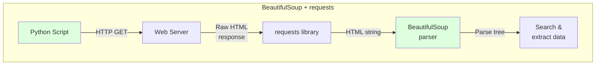
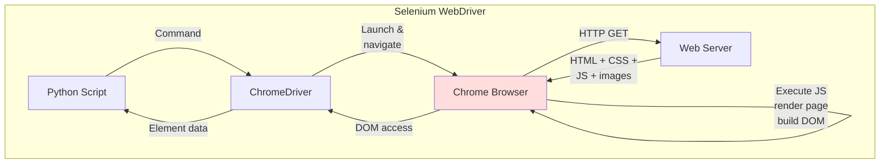
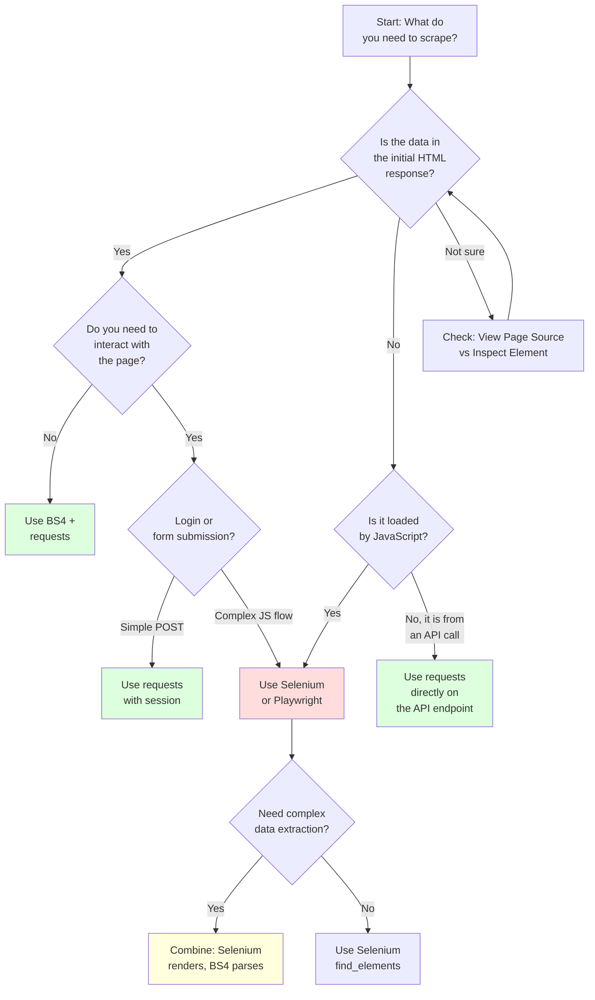

BeautifulSoup and Selenium are not competitors. They solve different problems, operate at different layers of the web stack, and excel in completely different scenarios. BeautifulSoup is an HTML parser -- it takes a string of markup and gives you tools to search and navigate the document tree. Selenium is a browser automation framework -- it launches a real browser, renders JavaScript, and lets you interact with pages the way a human would. The confusion between them is understandable because they both appear in web scraping tutorials, but choosing one over the other (or using them together) depends entirely on what the target page requires.

This post breaks down what each tool actually does, when to pick one over the other, and how to combine them when neither alone is enough.

## What BeautifulSoup Actually Does

BeautifulSoup (BS4) is a Python library for parsing HTML and XML documents. It does not fetch web pages. It does not execute JavaScript. It does not render anything. You hand it a string of HTML, and it builds a parse tree that you can search, navigate, and manipulate.

Here is the simplest possible BeautifulSoup workflow:

```python
import requests
from bs4 import BeautifulSoup

response = requests.get("https://example.com/products")
soup = BeautifulSoup(response.text, "html.parser")

titles = soup.select("h2.product-title")
for title in titles:
    print(title.get_text(strip=True))
```

Three things happen here:

1. `requests.get()` fetches the raw HTML from the server
2. `BeautifulSoup()` parses that HTML string into a navigable tree
3. `soup.select()` finds elements using CSS selectors

BS4 relies entirely on the HTML it receives. If the data you want is present in that raw HTML string, BS4 can find it. If the data is loaded by JavaScript after the initial page load, BS4 will never see it -- because BS4 does not execute JavaScript.

### Key BS4 Methods

The API is small and consistent:

```python
# CSS selector -- returns a list of matching elements
soup.select("div.product > span.price")

# Find first matching element by tag and attributes
soup.find("a", {"class": "next-page"})

# Find all matching elements
soup.find_all("tr", class_="data-row")

# Get text content
element.get_text(strip=True)

# Get attribute value
element.get("href")
element["data-id"]

# Navigate the tree
element.parent
element.find_next_sibling("div")
element.children
```

BS4 supports multiple parsers. The built-in `html.parser` works for most cases. For speed, `lxml` is faster. For broken or malformed HTML, `html5lib` is the most forgiving:

```python
# Built-in (no extra install)
soup = BeautifulSoup(html, "html.parser")

# Faster (requires: pip install lxml)
soup = BeautifulSoup(html, "lxml")

# Most forgiving (requires: pip install html5lib)
soup = BeautifulSoup(html, "html5lib")
```

## What Selenium Actually Does

Selenium is a browser automation framework. When you use Selenium to scrape a page, you are launching a full web browser (Chrome, Firefox, Edge), navigating to a URL, and waiting while the browser does everything it normally does: parse HTML, fetch CSS and images, execute JavaScript, fire AJAX requests, render the visual layout, and update the DOM.

Here is the equivalent Selenium workflow:

```python
from selenium import webdriver
from selenium.webdriver.common.by import By
from selenium.webdriver.chrome.options import Options

options = Options()
options.add_argument("--headless")

driver = webdriver.Chrome(options=options)
driver.get("https://example.com/products")

titles = driver.find_elements(By.CSS_SELECTOR, "h2.product-title")
for title in titles:
    print(title.text)

driver.quit()
```

This does far more work under the hood:

1. Launches a Chrome browser process
2. Communicates with it through the ChromeDriver bridge
3. Navigates to the URL and waits for the page to fully load
4. Parses the DOM, fetches all resources, executes all JavaScript
5. Finds elements in the live, rendered DOM
6. Returns the text content

The result may look the same for a static page, but Selenium is doing 10 to 50 times more work to get there.

## How the Request Flow Differs

The architectural difference between the two approaches is significant. BS4 plus requests operates as a lightweight HTTP client. Selenium operates as a full browser controller.





With BS4, you get the HTML and parse it yourself. With Selenium, a full browser does everything a human user's browser would do, and then you query the result. The tradeoff is clear: BS4 is fast and lean but limited to what the server sends. Selenium is slow and heavy but sees the page exactly as a human browser would.

## When to Use BeautifulSoup

BS4 is the right choice when the data you need is present in the raw HTML response from the server. These scenarios come up more often than people think:

**Static HTML pages.** Blogs, news articles, documentation sites, government data portals -- most of the web is still server-rendered HTML. BS4 handles these trivially.

**Server-rendered frameworks.** Many sites built with Django, Rails, Laravel, WordPress, or Next.js (with SSR) send complete HTML. The JavaScript on these pages adds interactivity but the data is already in the initial response.

**API responses.** If you can find the API endpoint a page uses (check the Network tab in DevTools), you can call it directly with `requests` and parse the JSON response. No HTML parsing needed at all.

**Speed matters.** If you are scraping thousands of pages, the [performance difference between BS4 and Selenium](/posts/python-requests-vs-selenium-speed-performance-comparison/) is the difference between minutes and hours.

**Resource-constrained environments.** BS4 uses negligible memory compared to a browser. On a small VPS or CI runner, this matters.

```python
import requests
from bs4 import BeautifulSoup

def scrape_product_listings(url):
    """Scrape product data from a static HTML page."""
    headers = {"User-Agent": "Mozilla/5.0 (compatible; research-bot)"}
    response = requests.get(url, headers=headers, timeout=10)
    response.raise_for_status()

    soup = BeautifulSoup(response.text, "html.parser")
    products = []

    for card in soup.select("div.product-card"):
        name = card.select_one("h2.product-name")
        price = card.select_one("span.price")
        rating = card.select_one("div.rating")
        link = card.select_one("a.product-link")

        products.append({
            "name": name.get_text(strip=True) if name else None,
            "price": price.get_text(strip=True) if price else None,
            "rating": rating.get("data-score") if rating else None,
            "url": link.get("href") if link else None,
        })

    return products
```

This is clean, fast, and uses almost no resources.

## When to Use Selenium

Selenium is necessary when the data you need does not exist in the initial HTML response. The most common scenarios:

**JavaScript-rendered content.** Single-page applications built with React, Vue, or Angular often ship a nearly empty HTML shell. The actual content is rendered by JavaScript after the page loads. BS4 would see an empty `<div id="root"></div>` and nothing else.

**Infinite scroll and lazy loading.** Pages that load content as you scroll down require JavaScript execution and often require simulated scroll events to trigger additional data loads.

**Login flows and form interaction.** If you need to log in, fill out forms, click buttons, or navigate multi-step workflows, you need something that can interact with the page -- not just read its HTML.

**AJAX-loaded data.** Many pages load their data through asynchronous JavaScript requests after the initial page load. The data appears in the DOM only after JavaScript runs and populates it.

```python
from selenium import webdriver
from selenium.webdriver.common.by import By
from selenium.webdriver.chrome.options import Options
from selenium.webdriver.support.ui import WebDriverWait
from selenium.webdriver.support import expected_conditions as EC

def scrape_js_rendered_products(url):
    """Scrape product data from a JavaScript-rendered page."""
    options = Options()
    options.add_argument("--headless")
    options.add_argument("--disable-gpu")
    options.add_argument("--no-sandbox")

    driver = webdriver.Chrome(options=options)

    try:
        driver.get(url)

        # Wait for the JS framework to render product cards
        WebDriverWait(driver, 15).until(
            EC.presence_of_all_elements_located(
                (By.CSS_SELECTOR, "div.product-card")
            )
        )

        products = []
        cards = driver.find_elements(By.CSS_SELECTOR, "div.product-card")

        for card in cards:
            name = card.find_element(By.CSS_SELECTOR, "h2.product-name")
            price = card.find_element(By.CSS_SELECTOR, "span.price")

            products.append({
                "name": name.text,
                "price": price.text,
            })

        return products

    finally:
        driver.quit()
```

Notice the `WebDriverWait` -- Selenium needs to wait for JavaScript to finish rendering before the elements exist in the DOM. This is part of why it is slower, but also why it works where BS4 cannot.


<figure>
  
  <figcaption>Parsing HTML doesn't always require a full browser. <span class="img-credit">Photo by Stanislav Kondratiev / <a href="https://www.pexels.com" target="_blank" rel="noopener noreferrer">Pexels</a></span></figcaption>
</figure>

## Code Comparison: Static HTML

For a static page where the data is in the server response, BS4 is simpler and faster in every way.

### BeautifulSoup Approach

```python
import requests
from bs4 import BeautifulSoup
import time

start = time.time()

response = requests.get("https://books.toscrape.com/")
soup = BeautifulSoup(response.text, "html.parser")

books = []
for article in soup.select("article.product_pod"):
    title = article.select_one("h3 a")["title"]
    price = article.select_one("p.price_color").get_text(strip=True)
    books.append({"title": title, "price": price})

elapsed = time.time() - start
print(f"Found {len(books)} books in {elapsed:.2f}s")
# Typical output: Found 20 books in 0.3s
```

### Selenium Approach

```python
from selenium import webdriver
from selenium.webdriver.common.by import By
from selenium.webdriver.chrome.options import Options
import time

start = time.time()

options = Options()
options.add_argument("--headless")
driver = webdriver.Chrome(options=options)

driver.get("https://books.toscrape.com/")

books = []
articles = driver.find_elements(By.CSS_SELECTOR, "article.product_pod")
for article in articles:
    title = article.find_element(By.CSS_SELECTOR, "h3 a").get_attribute("title")
    price = article.find_element(By.CSS_SELECTOR, "p.price_color").text
    books.append({"title": title, "price": price})

elapsed = time.time() - start
print(f"Found {len(books)} books in {elapsed:.2f}s")
# Typical output: Found 20 books in 3.1s

driver.quit()
```

The results are identical. The BS4 version runs in under a second. The Selenium version takes 3 or more seconds because it launches a browser, loads all resources, and renders the page -- none of which was necessary for this static site.

## Code Comparison: JS-Rendered Page

For a page where content is loaded by JavaScript, BS4 with `requests` simply cannot work.

```python
import requests
from bs4 import BeautifulSoup

# Attempting to scrape a React SPA with BS4
response = requests.get("https://spa-example.com/dashboard")
soup = BeautifulSoup(response.text, "html.parser")

# This finds nothing -- the data is rendered by JavaScript
data_rows = soup.select("tr.data-row")
print(f"Found {len(data_rows)} rows")
# Output: Found 0 rows
```

What the server actually sends for a typical SPA:

```html
<!DOCTYPE html>
<html>
<head>
    <title>Dashboard</title>
    <script src="/static/js/bundle.min.js"></script>
</head>
<body>
    <div id="root"></div>
</body>
</html>
```

There is no data in this HTML. The `bundle.min.js` script is what fetches data from an API and populates the `#root` div. BS4 cannot execute that script.

Selenium handles this correctly:

```python
from selenium import webdriver
from selenium.webdriver.common.by import By
from selenium.webdriver.chrome.options import Options
from selenium.webdriver.support.ui import WebDriverWait
from selenium.webdriver.support import expected_conditions as EC

options = Options()
options.add_argument("--headless")
driver = webdriver.Chrome(options=options)

driver.get("https://spa-example.com/dashboard")

# Wait for JavaScript to render the table rows
WebDriverWait(driver, 10).until(
    EC.presence_of_element_located((By.CSS_SELECTOR, "tr.data-row"))
)

data_rows = driver.find_elements(By.CSS_SELECTOR, "tr.data-row")
print(f"Found {len(data_rows)} rows")
# Output: Found 47 rows

driver.quit()
```

This is the clearest case for Selenium: when the data simply does not exist until JavaScript runs.

## Performance: The Numbers

The performance gap between BS4 plus `requests` and Selenium is not subtle. Here are representative numbers from scraping the same data across different scenarios:

| Metric | BS4 + requests | Selenium (headless Chrome) |
|---|---|---|
| Time per page (static) | 0.2 - 0.5s | 2 - 5s |
| Memory per session | ~30 MB | ~300 - 500 MB |
| CPU usage | Minimal | Significant |
| Pages per minute (single thread) | 120 - 300 | 12 - 30 |
| Startup time | Instant | 1 - 3s |
| Concurrent sessions | Hundreds | 5 - 20 (limited by RAM) |

For a scraping job hitting 10,000 static pages, the difference is dramatic:

- **BS4 + requests**: ~50 minutes (single-threaded), ~5 minutes (with 10 threads)
- **Selenium**: ~8 hours (single-threaded), ~50 minutes (with 10 browser instances)

The resource cost matters too. Each Selenium browser instance consumes 300 to 500 MB of RAM. Running 20 concurrent browsers requires 6 to 10 GB of RAM just for the browsers. Running 20 concurrent `requests` sessions requires almost nothing.

## Combining BS4 and Selenium

One of the most practical patterns in real-world scraping is using Selenium to render a page and then passing the rendered HTML to BeautifulSoup for parsing. This gives you the best of both worlds: Selenium handles JavaScript execution, and BS4 provides a cleaner, more Pythonic API for extracting data.

```python
from selenium import webdriver
from selenium.webdriver.chrome.options import Options
from selenium.webdriver.support.ui import WebDriverWait
from selenium.webdriver.support import expected_conditions as EC
from selenium.webdriver.common.by import By
from bs4 import BeautifulSoup

def scrape_with_both(url):
    """Use Selenium to render, BS4 to parse."""
    options = Options()
    options.add_argument("--headless")
    driver = webdriver.Chrome(options=options)

    try:
        driver.get(url)

        # Wait for the content to be rendered by JavaScript
        WebDriverWait(driver, 15).until(
            EC.presence_of_element_located(
                (By.CSS_SELECTOR, "div.product-card")
            )
        )

        # Grab the fully rendered HTML
        rendered_html = driver.page_source

    finally:
        driver.quit()

    # Now parse with BeautifulSoup -- much nicer API
    soup = BeautifulSoup(rendered_html, "html.parser")

    products = []
    for card in soup.select("div.product-card"):
        name = card.select_one("h2.product-name")
        price = card.select_one("span.price")
        specs = card.select("li.spec-item")
        reviews = card.select("div.review")

        products.append({
            "name": name.get_text(strip=True) if name else None,
            "price": price.get_text(strip=True) if price else None,
            "specs": [s.get_text(strip=True) for s in specs],
            "review_count": len(reviews),
            "review_texts": [r.get_text(strip=True) for r in reviews],
        })

    return products
```

Why use BS4 for the parsing step instead of Selenium's `find_element` methods? Several reasons:

- **BS4's selector API is more flexible.** `soup.select()` returns plain Python objects you can iterate, filter, and manipulate naturally.
- **BS4 is faster for complex extraction.** Each `find_element` call in Selenium communicates with the browser process over a bridge. BS4 operates on an in-memory tree with no IPC overhead.
- **BS4 handles edge cases better.** Getting text content, navigating siblings, extracting attributes -- BS4's API is designed for this. Selenium's API is designed for interaction (clicking, typing), not data extraction.
- **You can close the browser immediately.** Once you have `page_source`, the browser is no longer needed. This frees up the RAM and CPU sooner.


<figure>
  
  <figcaption>Static parsing is fast, lightweight, and perfect for well-structured pages. <span class="img-credit">Photo by Tahir Xəlfəquliyev / <a href="https://www.pexels.com" target="_blank" rel="noopener noreferrer">Pexels</a></span></figcaption>
</figure>

## Decision Flowchart

Use this flowchart to decide which tool fits your scraping task:



The key question is always: **is the data in the initial HTML response?** You can check this by right-clicking a page and selecting "View Page Source" in your browser. If the data appears there, BS4 can handle it. If the data only appears when you use "Inspect Element" (which shows the live DOM after JavaScript has run), you need a browser-based tool.

## A Quick Note on "View Page Source" vs "Inspect Element"

This distinction trips up many beginners:

- **View Page Source** (Ctrl+U) shows the raw HTML the server sent. This is what `requests.get()` returns and what BS4 will parse.
- **Inspect Element** (F12, Elements tab) shows the live DOM after JavaScript has executed, modified elements, and added content. This is what Selenium sees.

If data appears in Inspect Element but not in View Page Source, it was added by JavaScript. BS4 with `requests` will not see it. You need Selenium, Playwright, or a similar browser automation tool.

## Alternatives Worth Considering

BS4 and Selenium are the most commonly taught tools, but they are not your only options. For a broader look at all the major frameworks, see the [mega comparison of Playwright, Puppeteer, Selenium, and Scrapy](/posts/playwright-vs-puppeteer-vs-selenium-vs-scrapy-2026-mega-comparison/).

**Playwright.** Microsoft's browser automation library. Faster than Selenium, better API, built-in auto-waiting, and stronger stealth capabilities. If you need browser automation in 2026, Playwright is often the [better choice over Selenium](/posts/selenium-vs-puppeteer-definitive-comparison-web-scraping/).

```python
from playwright.sync_api import sync_playwright

with sync_playwright() as p:
    browser = p.chromium.launch(headless=True)
    page = browser.new_page()
    page.goto("https://example.com/products")

    # Auto-waits for elements to be ready
    cards = page.query_selector_all("div.product-card")
    for card in cards:
        print(card.inner_text())

    browser.close()
```

**Scrapy.** A full scraping framework with built-in request scheduling, rate limiting, data pipelines, and middleware. Overkill for one-off scripts, but invaluable for large-scale scraping projects. Works at the HTTP level like BS4 plus `requests`, but with far more infrastructure.

**httpx.** A modern Python HTTP client that supports async requests. Pair it with BS4 for high-performance async scraping of static pages:

```python
import httpx
import asyncio
from bs4 import BeautifulSoup

async def scrape_page(client, url):
    response = await client.get(url, timeout=10)
    soup = BeautifulSoup(response.text, "html.parser")
    title = soup.select_one("h1")
    return title.get_text(strip=True) if title else None

async def scrape_all(urls):
    async with httpx.AsyncClient() as client:
        tasks = [scrape_page(client, url) for url in urls]
        return await asyncio.gather(*tasks)

urls = [f"https://example.com/page/{i}" for i in range(100)]
results = asyncio.run(scrape_all(urls))
```

**lxml.** If you need raw parsing speed and BS4 feels slow, `lxml` provides a faster parser with XPath support. BS4 can use `lxml` as its parser backend, or you can use `lxml` directly for maximum performance.

## Summary

| | BeautifulSoup | Selenium |
|---|---|---|
| **What it does** | Parses HTML strings | Controls a real browser |
| **Fetches pages** | No (needs `requests`) | Yes (built-in navigation) |
| **Executes JavaScript** | No | Yes |
| **Speed** | Fast (0.2 - 0.5s per page) | Slow (2 - 5s per page) |
| **Memory** | ~30 MB | ~300 - 500 MB |
| **Best for** | Static HTML, APIs | JS-rendered pages, interaction |
| **Learning curve** | Low | Medium |
| **Install complexity** | `pip install beautifulsoup4` | pip install + browser + driver |

The decision is straightforward. If the data is in the raw HTML, use BeautifulSoup with `requests`. If the data requires JavaScript execution or page interaction, use Selenium (or better yet, Playwright). For pages where the data is already structured and you want to skip parsing entirely, consider using an [LLM for structured data extraction from HTML](/posts/best-llm-structured-data-extraction-html-2026/). If you need both rendering and complex parsing, use Selenium to render and BS4 to parse. Do not use Selenium to scrape static pages -- it works, but it wastes time, memory, and CPU on a problem that BS4 solves in a fraction of the time.
