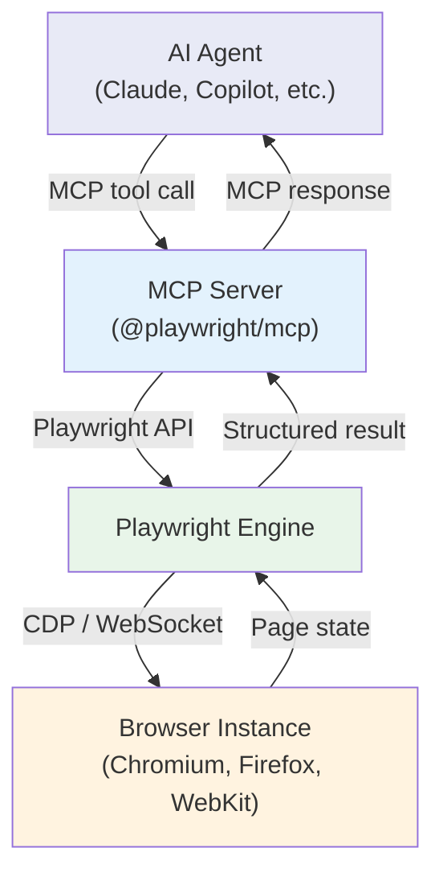
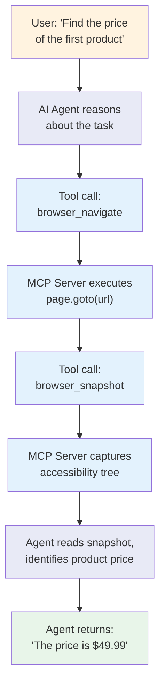
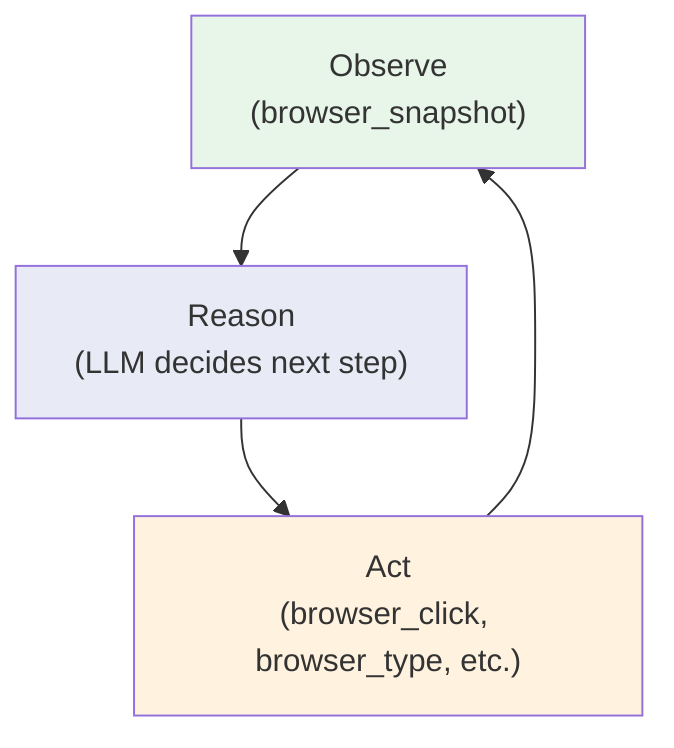
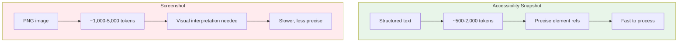
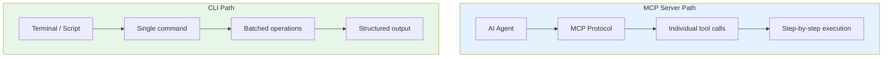

The Model Context Protocol lets AI agents like Claude drive a real browser through Playwright without writing a single line of automation code. Instead of describing what selectors to use or which API calls to make, you tell the agent "go to this page and fill in the form," and it figures out the rest. The Playwright MCP Server is what makes this possible. It sits between the language model and the browser, translating natural language intentions into concrete Playwright actions and returning structured results the model can reason about.

This post covers what MCP is, how the Playwright MCP Server works, how to set it up, what tools it exposes, and the practical tradeoffs around token consumption, speed, and reliability that determine whether it makes sense for your use case.

## What Is the Model Context Protocol

MCP is an open protocol for connecting large language models to external tools and data sources. It was introduced by Anthropic and has since been adopted across the AI ecosystem. The core idea is simple: instead of every AI agent implementing its own integration with every external service, MCP provides a standardized interface. The agent speaks MCP, the tool speaks MCP, and they can work together without custom glue code.

An MCP server exposes a set of tools that an AI agent can discover, inspect, and call. Each tool has a name, a description, and a schema for its parameters. The agent decides which tool to call based on the user's request, sends the call to the server, receives the result, and decides what to do next.



For browser automation, this means the AI agent does not need to know the Playwright API. It does not need to construct selectors, manage browser lifecycle, or handle navigation timing. It calls tools like `browser_navigate` and `browser_click`, and the MCP server handles the underlying complexity.

## The Playwright MCP Server

The Playwright MCP Server is the official MCP server that exposes Playwright's browser automation capabilities. The package has moved through a few names. It was originally published as `@anthropic-ai/mcp-server-playwright` and has since been consolidated under `@playwright/mcp` as Microsoft took over maintenance. Both package names work, but `@playwright/mcp` is the canonical home.

The server launches a Playwright browser instance and exposes a curated set of browser control tools through the MCP protocol. Any MCP-compatible client -- Claude Desktop, VS Code with Copilot, Claude Code, or a custom agent -- can connect to it and start driving the browser. If you are evaluating alternatives, there is also a [comparison of Puppeteer MCP vs Playwright MCP](/posts/puppeteer-mcp-vs-playwright-mcp-model-context-protocol-browsers/) that covers the tradeoffs between the two.

What distinguishes this from just using Playwright directly is the abstraction layer. The AI agent does not write Playwright code. It calls high-level tools and receives structured results. The server handles element resolution, waiting, error recovery, and state management internally.

## Installation and Setup

Getting the server running requires Node.js. The simplest path is `npx`, which downloads and runs the package without a global install.

```bash
# Run the Playwright MCP server directly
npx @playwright/mcp

# Or using the older package name (still works)
npx @anthropic-ai/mcp-server-playwright
```

The server starts and listens for MCP connections over stdio. It does not open a port -- MCP communication happens through standard input and output, which is how most MCP clients expect to connect.

If you want a persistent install:

```bash
# Install globally
npm install -g @playwright/mcp

# Install Playwright browsers (required on first run)
npx playwright install
```

Playwright needs browser binaries to work. The `playwright install` command downloads Chromium, Firefox, and WebKit. If you only need Chromium, you can run `npx playwright install chromium` to save time and disk space.

## Configuring MCP Clients

The most common way to use the Playwright MCP Server is through an AI client that supports MCP. Here is how to configure several popular clients.

### Claude Desktop

Add the server to your Claude Desktop configuration file. On macOS this lives at `~/Library/Application Support/Claude/claude_desktop_config.json`. On Windows it is at `%APPDATA%\Claude\claude_desktop_config.json`.

```json
{
  "mcpServers": {
    "playwright": {
      "command": "npx",
      "args": ["@playwright/mcp"]
    }
  }
}
```

Restart Claude Desktop after editing the config. You should see the Playwright tools appear in the tool list when you start a new conversation.

### Claude Code

Claude Code picks up MCP servers from its own configuration. You can add them from the command line:

```bash
claude mcp add playwright -- npx @playwright/mcp
```

Or add the configuration manually to `.claude/settings.json` in your project:

```json
{
  "mcpServers": {
    "playwright": {
      "command": "npx",
      "args": ["@playwright/mcp"]
    }
  }
}
```

### VS Code with GitHub Copilot

Add the server to your workspace settings in `.vscode/settings.json`:

```json
{
  "mcp": {
    "servers": {
      "playwright": {
        "command": "npx",
        "args": ["@playwright/mcp"]
      }
    }
  }
}
```

### Custom MCP Client

If you are building your own agent, you can connect to the Playwright MCP server programmatically using the MCP SDK:

```javascript
const { Client } = require("@modelcontextprotocol/sdk/client/index.js");
const { StdioClientTransport } = require(
  "@modelcontextprotocol/sdk/client/stdio.js"
);

async function connectToPlaywright() {
  const transport = new StdioClientTransport({
    command: "npx",
    args: ["@playwright/mcp"],
  });

  const client = new Client({
    name: "my-browser-agent",
    version: "1.0.0",
  });

  await client.connect(transport);

  // Discover available tools
  const { tools } = await client.listTools();
  console.log("Available tools:");
  tools.forEach((t) => console.log(`  ${t.name}: ${t.description}`));

  return client;
}
```


<figure>
  
  <figcaption>Browser automation turns repetitive tasks into reliable scripts. <span class="img-credit">Photo by ThisIsEngineering / <a href="https://www.pexels.com" target="_blank" rel="noopener noreferrer">Pexels</a></span></figcaption>
</figure>

## Available Tools

The Playwright MCP Server exposes a specific set of tools that an AI agent can call. Each tool maps to a browser action. Here are the core ones.

### Navigation

**`browser_navigate`** -- Navigate to a URL. This is the starting point for any browser session.

```json
{
  "name": "browser_navigate",
  "arguments": {
    "url": "https://example.com/login"
  }
}
```

**`browser_go_back`** and **`browser_go_forward`** -- Navigate browser history, just like clicking the back and forward buttons.

### Page Observation

**`browser_snapshot`** -- Returns the accessibility tree of the current page. This is the primary way an AI agent "sees" what is on the page. The result is a structured representation of every interactive and semantic element, including text content, roles, states, and reference identifiers that can be used in subsequent actions.

```yaml
# Example accessibility snapshot output
- navigation "Main":
    - link "Home" [ref=1]
    - link "Products" [ref=2]
    - link "Contact" [ref=3]
- heading "Welcome to Our Store" [level=1]
- main:
    - article:
        - heading "Featured Product" [level=2]
        - img "Product photo" [ref=4]
        - text: "$49.99"
        - button "Add to Cart" [ref=5]
    - textbox "Search products..." [ref=6]
```

**`browser_screenshot`** -- Captures a PNG screenshot of the current page. Useful for visual verification or when the accessibility tree does not capture enough layout information.

### Interaction

**`browser_click`** -- Click an element identified by its reference from a previous snapshot.

```json
{
  "name": "browser_click",
  "arguments": {
    "element": "Add to Cart button",
    "ref": "5"
  }
}
```

**`browser_type`** -- Type text into an input field.

```json
{
  "name": "browser_type",
  "arguments": {
    "element": "Search products input",
    "ref": "6",
    "text": "wireless headphones"
  }
}
```

**`browser_hover`** -- Hover over an element to trigger dropdown menus or tooltips.

**`browser_select_option`** -- Select an option from a `<select>` dropdown.

**`browser_press_key`** -- Press a keyboard key like Enter, Tab, or Escape.

### Tab Management

**`browser_tab_list`** -- List all open tabs. **`browser_tab_create`** -- Open a new tab. **`browser_tab_select`** -- Switch to a specific tab. **`browser_tab_close`** -- Close a tab.

### Utility

**`browser_wait`** -- Wait for a specified duration. Useful when a page needs time to load dynamic content. **`browser_close`** -- Close the browser entirely.

## How It Works Under the Hood

When the MCP server starts, it launches a Playwright browser instance in the background. By default this is Chromium in headed mode so you can see what the agent is doing, though you can configure it for headless operation.

Here is the flow for a typical interaction:



Each tool call is a synchronous operation from the agent's perspective. The agent sends a tool call, the MCP server executes the corresponding Playwright action, waits for it to complete, and returns the result. The agent then decides what to do next based on the result.

The key insight is that the agent operates in a loop. It observes the page state (via `browser_snapshot` or `browser_screenshot`), decides what action to take, executes it, observes the new state, and repeats until the task is complete. This observe-act loop is fundamental to how AI agents interact with browsers.



## Token Efficiency: Snapshots vs Screenshots

One of the most important practical considerations when using the Playwright MCP Server is token consumption. Every piece of information sent to the AI agent costs tokens, and the format of that information matters enormously.

The `browser_snapshot` tool returns the accessibility tree as structured text. For a typical web page, this might be 500 to 2,000 tokens. It includes element roles, names, states, and reference IDs -- everything the agent needs to understand the page and interact with it.

The `browser_screenshot` tool returns a PNG image. Images are expensive in terms of tokens. A single screenshot can cost 1,000 to 5,000 tokens depending on resolution, and the model has to interpret visual layout rather than reading structured data.



For most automation tasks, `browser_snapshot` is the better choice. It is cheaper, faster, and gives the agent actionable element references. Screenshots make sense when you need to verify visual layout, check CSS rendering, or when the accessibility tree is missing information (which happens with poorly structured pages or Shadow DOM content).

A practical rule: start with snapshots, fall back to screenshots only when the snapshot does not provide enough information.

## Real-World Use Cases

### AI-Powered Web Research

An AI agent can navigate to multiple websites, read their content through accessibility snapshots, and synthesize information across sources. This is already how Claude and other agents handle web research tasks when connected to a Playwright MCP server. The broader trend of [using Playwright for browser automation in AI agents](/posts/playwright-for-browser-automation-in-ai-agents/) is accelerating across the ecosystem.

```python
# Pseudocode for an AI research workflow
research_steps = [
    {"tool": "browser_navigate", "url": "https://news.example.com"},
    {"tool": "browser_snapshot"},           # Read headlines
    {"tool": "browser_click", "ref": "12"}, # Click an article
    {"tool": "browser_snapshot"},           # Read article content
    {"tool": "browser_navigate", "url": "https://another-source.com"},
    {"tool": "browser_snapshot"},           # Compare with second source
]
# Agent synthesizes findings from both snapshots
```

### Automated Testing with Natural Language

Instead of writing test scripts, you describe what you want to test in plain English. The agent navigates the application, performs the actions, and verifies the outcomes.

```text
User: "Go to our login page, try logging in with an invalid password,
       and verify that an error message appears."

Agent actions:
  1. browser_navigate -> https://app.example.com/login
  2. browser_snapshot -> finds email and password fields
  3. browser_type -> enters "user@example.com" in email field
  4. browser_type -> enters "wrongpassword" in password field
  5. browser_click -> clicks "Sign In" button
  6. browser_snapshot -> reads error message "Invalid credentials"
  7. Returns: "The login page correctly displays 'Invalid credentials'
              when an incorrect password is submitted."
```

### Form Filling and Data Entry

For repetitive form filling tasks, an AI agent can read a form through its accessibility snapshot, map data fields to form inputs, and fill them in sequence. The snapshot provides labeled input fields with reference IDs, making it straightforward for the agent to determine where each piece of data belongs.

```javascript
// Agent fills a multi-step form
async function fillForm(client, formData) {
  // Step 1: Navigate and observe
  await client.callTool("browser_navigate", {
    url: "https://app.example.com/registration"
  });
  const snapshot = await client.callTool("browser_snapshot", {});

  // Step 2: The agent maps formData fields to snapshot refs
  // and issues browser_type calls for each field
  for (const [field, value] of Object.entries(formData)) {
    // Agent determines the correct ref from the snapshot
    await client.callTool("browser_type", {
      element: field,
      ref: snapshot.refForField(field),
      text: value,
    });
  }

  // Step 3: Submit
  await client.callTool("browser_click", {
    element: "Submit button",
    ref: snapshot.refForButton("Submit"),
  });
}
```

## Limitations

The Playwright MCP Server is powerful, but it comes with real constraints that affect whether it is the right tool for a given task.

### Speed

Every action requires a round trip through the LLM. The agent sends a tool call, waits for the MCP server to execute it, receives the result, processes it, and decides on the next action. A simple five-step workflow that takes a human script 2 seconds might take an AI agent 15-30 seconds because each step involves LLM inference time.

### Cost

Token consumption adds up. A single page navigation plus snapshot might cost 2,000-3,000 tokens. A multi-page workflow with several interactions can easily reach 20,000-50,000 tokens. At scale, this makes MCP-driven browser automation significantly more expensive than scripted automation.

### Reliability

AI agents can make mistakes. They might click the wrong element, misinterpret a snapshot, or get stuck in loops. Unlike a deterministic script that does the same thing every time, an agent-driven workflow has inherent variability. Critical production workflows still need guardrails and fallback logic. Several [browser agent frameworks like Browser Use, Stagehand, and Skyvern](/posts/browser-agent-frameworks-compared-browser-use-vs-stagehand-vs-skyvern/) are tackling this reliability problem in different ways.

### Session and State

The MCP server manages a single browser session. If you need parallel browsing or complex multi-tab workflows, you need to coordinate carefully. The tab management tools help, but the agent can only observe and act on one tab at a time.

## Playwright MCP Server vs Playwright CLI

The `@playwright/mcp` server and the direct `npx playwright` CLI serve different purposes. The MCP server is designed for AI agent integration -- it exposes individual browser actions as tools that an LLM can call. The CLI is designed for direct terminal usage and scripted workflows.



The CLI approach reduces token consumption dramatically. Where the MCP server might require 10 round trips and 30,000 tokens to navigate a page, extract data, and return results, the CLI can accomplish the same task in a single command with structured output, consuming roughly 4x fewer tokens.

For a deeper dive into both approaches and when to choose one over the other, see the guide on [Playwright MCP and CLI for AI agent-friendly browser automation](/posts/playwright-mcp-and-cli-making-browser-automation-ai-agent-friendly/). Use the MCP server when the agent needs fine-grained control and the ability to react to unexpected page states. Use the CLI when the workflow is predictable and you want to minimize token costs.

```bash
# Direct CLI usage -- no MCP overhead
npx playwright screenshot https://example.com output.png

# Codegen to generate a script from manual actions
npx playwright codegen https://example.com
```

The CLI is better suited for tasks where you know the steps in advance. The MCP server is better suited for tasks where the agent needs to explore and adapt.

## Putting It Together

The Playwright MCP Server bridges the gap between AI language models and browser automation. It gives agents like Claude the ability to navigate web pages, read their content through accessibility snapshots, interact with forms and buttons, and extract information -- all through a standardized protocol that works with any MCP-compatible client.

The practical tradeoffs are clear. Use the MCP server when you need an AI agent to handle unpredictable web interfaces, when natural language task descriptions matter more than execution speed, or when the workflow requires judgment calls that a script cannot make. Use direct Playwright scripting or the CLI when speed, cost, and determinism are the priorities.

The accessibility snapshot is the centerpiece of the system. It gives the agent a structured, token-efficient view of the page that is far more actionable than raw HTML or screenshots. If you are evaluating the Playwright MCP Server for your own workflows, start there. Connect the server to your preferred MCP client, navigate to a target page, and examine the snapshot. That will tell you immediately whether the agent can see enough of the page to accomplish what you need.
