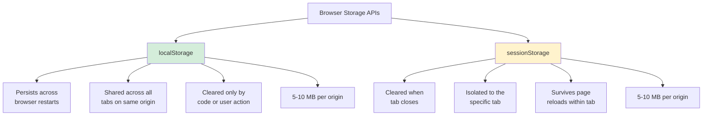
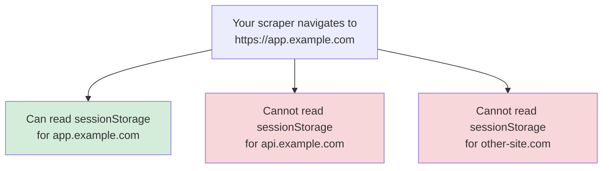

Web applications routinely stash data in the browser that never appears in the HTML source or in network responses visible to simple HTTP clients. sessionStorage is one of the most interesting hiding places because it is ephemeral by design -- the data disappears the moment the tab closes. While it exists, though, sessionStorage can contain authentication tokens, cached API responses, CSRF tokens, search results, and page state that would be expensive or impossible to reconstruct from the DOM alone. For scrapers running in a real browser context, this short-lived storage is fully accessible through a single JavaScript call.

## What Is sessionStorage

sessionStorage is a synchronous key-value storage API available in every modern browser. It stores string data under string keys, scoped to the page's origin (protocol + domain + port). Its API is identical to localStorage. For a detailed guide on reading and writing session data with Playwright specifically, see the post on [Playwright sessionStorage](/posts/playwright-sessionstorage-reading-writing-session-data/). The core API:

```javascript
// Set a value
sessionStorage.setItem("search_query", "web scraping tools");

// Get a value
sessionStorage.getItem("search_query"); // "web scraping tools"

// Remove a value
sessionStorage.removeItem("search_query");

// Clear everything for this tab
sessionStorage.clear();

// Get the number of stored items
sessionStorage.length; // 0 after clear()
```

The critical difference from localStorage is its lifetime. sessionStorage is tied to the browsing context -- the specific tab or window that created it. When that tab closes, the data is gone.

## sessionStorage vs localStorage

Both APIs share the same interface, but their persistence and scope differ in ways that matter for scraping.



| Feature | localStorage | sessionStorage |
|---|---|---|
| Persistence | Until explicitly cleared | Until the tab or window closes |
| Scope | Same origin, all tabs and windows | Same origin, same tab only |
| Capacity | 5-10 MB | 5-10 MB |
| Survives page reload | Yes | Yes |
| Survives browser restart | Yes | No |
| Shared between tabs | Yes | No |
| API | `localStorage.getItem()` / `setItem()` | `sessionStorage.getItem()` / `setItem()` |

The tab-scoped nature of sessionStorage has a direct consequence for browser automation. In Playwright, each page object created with `context.new_page()` gets its own independent sessionStorage, even for the same origin. You cannot populate sessionStorage in one tab and expect it to appear in another.

## What Apps Store in sessionStorage

Applications use sessionStorage for data that should not outlive the user's current browsing session. Here are the most common categories you will encounter.

**Auth tokens and session identifiers.** Some SPAs store short-lived JWTs or session tokens in sessionStorage rather than localStorage. The reasoning is that sessionStorage provides a slightly smaller attack surface -- if a user walks away and someone else opens a new tab, they will not inherit the token. For scraping, this means the token disappears if you close the page and open a new one.

**CSRF tokens.** Anti-forgery tokens are often written to sessionStorage during page initialization. The front-end reads them when making POST requests. If your scraper needs to submit forms or call APIs that require CSRF validation, sessionStorage is a likely place to find the token.

**Cached search results.** When a user performs a search in a SPA, the application may cache the response in sessionStorage keyed by the search query. Navigating back to the search page reloads results from storage instead of hitting the API again. These cached payloads are often complete API responses in JSON format.

**Page state and navigation history.** Scroll position, active tab index, expanded/collapsed sections, form field values, and wizard step progress are all commonly persisted in sessionStorage. This state is used to restore the UI if the user refreshes the page within the same tab.

**User preferences for the current session.** Temporary preferences like sort order, filter selections, or display density that should reset when the user starts a new session.

**Feature flags and experiment assignments.** A/B test group assignments and feature flag evaluations that are computed on page load and cached in sessionStorage for the duration of the session.

## Reading All sessionStorage in Playwright

Playwright's `page.evaluate()` method executes JavaScript in the page context and returns the result to Python. Since sessionStorage stores strings, you can dump everything with a single call.

```python
from playwright.sync_api import sync_playwright
import json

with sync_playwright() as p:
    browser = p.chromium.launch(headless=True)
    context = browser.new_context()
    page = context.new_page()

    page.goto("https://example.com/app")
    page.wait_for_load_state("networkidle")

    # Dump all of sessionStorage as a JSON string
    raw = page.evaluate(
        "JSON.stringify(Object.fromEntries(Object.entries(sessionStorage)))"
    )
    data = json.loads(raw)

    print(f"Found {len(data)} keys in sessionStorage")
    for key, value in data.items():
        print(f"  {key}: {value[:80]}...")

    browser.close()
```

The `Object.fromEntries(Object.entries(sessionStorage))` pattern creates a plain object from the Storage object, which ensures clean JSON serialization. You can also use the simpler `JSON.stringify(sessionStorage)`, but the entries-based approach handles edge cases more reliably across browsers.

For the async API:

```python
from playwright.async_api import async_playwright
import asyncio
import json

async def dump_session_storage(url):
    async with async_playwright() as p:
        browser = await p.chromium.launch(headless=True)
        page = await browser.new_page()

        await page.goto(url)
        await page.wait_for_load_state("networkidle")

        raw = await page.evaluate(
            "JSON.stringify(Object.fromEntries(Object.entries(sessionStorage)))"
        )
        data = json.loads(raw)

        await browser.close()
        return data

data = asyncio.run(dump_session_storage("https://example.com/app"))
```


<figure>
  
  <figcaption>Browsers are the universal interface to the web — and to its data. <span class="img-credit">Photo by cottonbro studio / <a href="https://www.pexels.com" target="_blank" rel="noopener noreferrer">Pexels</a></span></figcaption>
</figure>

## Reading All sessionStorage in Selenium

Selenium uses `driver.execute_script()` for JavaScript evaluation. The syntax is slightly different, but the principle is the same.

```python
from selenium import webdriver
from selenium.webdriver.chrome.options import Options
from selenium.webdriver.support.ui import WebDriverWait
import json

options = Options()
options.add_argument("--headless=new")

driver = webdriver.Chrome(options=options)
driver.get("https://example.com/app")

# Wait for the page to finish loading
WebDriverWait(driver, 10).until(
    lambda d: d.execute_script("return document.readyState") == "complete"
)

# Dump all of sessionStorage
raw = driver.execute_script("return JSON.stringify(sessionStorage);")
data = json.loads(raw)

print(f"Found {len(data)} keys in sessionStorage")
for key, value in data.items():
    print(f"  {key}: {value[:80]}...")

driver.quit()
```

Note the `return` keyword in Selenium's script. Unlike Playwright's `evaluate()`, which implicitly returns the last expression, Selenium's `execute_script()` requires an explicit `return` statement.

## Reading Specific Keys

In practice, you rarely need the entire contents of sessionStorage. Most scraping tasks target one or two known keys. The challenge is identifying which keys hold the data you need.

Start by enumerating all keys and previewing their contents:

```python
# Playwright -- enumerate and preview all sessionStorage keys
key_preview = page.evaluate("""
    () => {
        const entries = [];
        for (let i = 0; i < sessionStorage.length; i++) {
            const key = sessionStorage.key(i);
            const value = sessionStorage.getItem(key);
            entries.push({
                key: key,
                valueType: (() => {
                    try { JSON.parse(value); return 'json'; }
                    catch { return 'string'; }
                })(),
                length: value.length,
                preview: value.substring(0, 200)
            });
        }
        return entries;
    }
""")

for entry in key_preview:
    print(f"Key: {entry['key']}")
    print(f"  Type: {entry['valueType']}, Length: {entry['length']}")
    print(f"  Preview: {entry['preview']}")
    print()
```

Once you know the key names, read them directly:

```python
# Playwright -- read a single key
csrf_token = page.evaluate("sessionStorage.getItem('csrf_token')")

if csrf_token:
    print(f"CSRF token: {csrf_token}")

# Playwright -- read multiple keys in one call
keys_to_read = ["csrf_token", "search_cache", "user_session"]

result = page.evaluate("""
    (keys) => {
        const data = {};
        keys.forEach(key => {
            const value = sessionStorage.getItem(key);
            if (value !== null) {
                data[key] = value;
            }
        });
        return data;
    }
""", keys_to_read)
```

```python
# Selenium -- read a single key
csrf_token = driver.execute_script(
    "return sessionStorage.getItem('csrf_token');"
)

# Selenium -- read multiple keys
keys = ["csrf_token", "search_cache", "user_session"]

result = driver.execute_script("""
    var data = {};
    arguments[0].forEach(function(key) {
        var value = sessionStorage.getItem(key);
        if (value !== null) {
            data[key] = value;
        }
    });
    return data;
""", keys)
```

Common key naming patterns to search for:

- `*token*`, `*csrf*`, `*xsrf*` -- anti-forgery and auth tokens
- `*cache*`, `*search*`, `*results*` -- cached query responses
- `*state*`, `*step*`, `*wizard*` -- navigation and form state
- `*session*`, `*auth*` -- session identifiers
- `*filter*`, `*sort*`, `*page*` -- UI state for listings

## Writing to sessionStorage

Writing to sessionStorage lets you pre-load state before the application reads it. This is useful for skipping login flows, setting search parameters, or jumping to a specific step in a [multi-step wizard or form-filling workflow](/posts/how-to-automate-web-form-filling-complete-guide/).

### Playwright

```python
from playwright.sync_api import sync_playwright
import json

with sync_playwright() as p:
    browser = p.chromium.launch(headless=True)
    page = browser.new_page()

    # Navigate to the origin first -- sessionStorage is origin-scoped
    page.goto("https://example.com")

    # Set a CSRF token
    page.evaluate(
        "(token) => sessionStorage.setItem('csrf_token', token)",
        "a1b2c3d4e5f6"
    )

    # Set cached search results so the app skips the API call
    cached_results = {
        "query": "python scraping",
        "results": [
            {"id": 1, "title": "Getting Started with Scraping"},
            {"id": 2, "title": "Advanced Techniques"}
        ],
        "timestamp": 1740000000
    }
    page.evaluate(
        "([key, val]) => sessionStorage.setItem(key, val)",
        ["search_cache_python_scraping", json.dumps(cached_results)]
    )

    # Navigate to the search page -- the app reads cached results on load
    page.goto("https://example.com/search?q=python+scraping")

    browser.close()
```

### Selenium

```python
import json

driver.get("https://example.com")

# Set a CSRF token
driver.execute_script(
    "sessionStorage.setItem('csrf_token', arguments[0]);",
    "a1b2c3d4e5f6"
)

# Set cached search results
cached_results = {
    "query": "python scraping",
    "results": [
        {"id": 1, "title": "Getting Started with Scraping"},
        {"id": 2, "title": "Advanced Techniques"}
    ],
    "timestamp": 1740000000
}
driver.execute_script(
    "sessionStorage.setItem(arguments[0], arguments[1]);",
    "search_cache_python_scraping",
    json.dumps(cached_results)
)

# Navigate to the search page
driver.get("https://example.com/search?q=python+scraping")
```


<figure>
  
  <figcaption>Headless or headed, browsers remain the most reliable way to render the modern web. <span class="img-credit">Photo by cottonbro studio / <a href="https://www.pexels.com" target="_blank" rel="noopener noreferrer">Pexels</a></span></figcaption>
</figure>

## Monitoring sessionStorage Changes Over Time

Some applications write to sessionStorage progressively as the user interacts with the page. API responses arrive, form fields are auto-saved, and UI state is updated. Monitoring these writes can reveal data flows that are not obvious from the DOM.

### Intercepting Writes

Override the `setItem` and `removeItem` methods to log every change:

```python
# Playwright -- intercept sessionStorage writes
page.evaluate("""
    window.__sessionStorageLog = [];

    const originalSetItem = sessionStorage.setItem.bind(sessionStorage);
    sessionStorage.setItem = function(key, value) {
        window.__sessionStorageLog.push({
            action: 'set',
            key: key,
            value: value,
            timestamp: Date.now()
        });
        return originalSetItem(key, value);
    };

    const originalRemoveItem = sessionStorage.removeItem.bind(sessionStorage);
    sessionStorage.removeItem = function(key) {
        window.__sessionStorageLog.push({
            action: 'remove',
            key: key,
            timestamp: Date.now()
        });
        return originalRemoveItem(key);
    };
""")

# Interact with the page to trigger writes
page.click("#search-button")
page.wait_for_load_state("networkidle")
page.wait_for_timeout(3000)

# Retrieve the change log
changes = page.evaluate("window.__sessionStorageLog")

for change in changes:
    ts = change["timestamp"]
    action = change["action"]
    key = change["key"]
    value = change.get("value", "")
    preview = value[:100] if value else "N/A"
    print(f"[{ts}] {action} {key}: {preview}")
```

### Polling Approach

A simpler method that works in both Playwright and Selenium. Take snapshots at intervals and diff them:

```python
import time
import json

def poll_session_storage(page, duration_seconds=10, interval=0.5):
    """Poll sessionStorage and report changes over time."""
    previous = json.loads(
        page.evaluate(
            "JSON.stringify(Object.fromEntries(Object.entries(sessionStorage)))"
        )
    )
    all_changes = []
    end_time = time.time() + duration_seconds

    while time.time() < end_time:
        time.sleep(interval)
        current = json.loads(
            page.evaluate(
                "JSON.stringify("
                "Object.fromEntries(Object.entries(sessionStorage)))"
            )
        )

        for key in current:
            if key not in previous:
                all_changes.append(("added", key, current[key]))
            elif current[key] != previous[key]:
                all_changes.append(("changed", key, current[key]))

        for key in previous:
            if key not in current:
                all_changes.append(("removed", key, None))

        previous = current

    return all_changes


# Usage
changes = poll_session_storage(page, duration_seconds=15)
for action, key, value in changes:
    preview = (value[:80] + "...") if value and len(value) > 80 else value
    print(f"  [{action}] {key}: {preview}")
```

## Practical Example: Extracting Cached API Responses From a SPA

Single-page applications frequently cache API responses in sessionStorage to avoid redundant network calls during a single browsing session. A search results page, for example, might store the API response so that hitting the browser back button loads results from cache rather than re-querying.

```python
from playwright.sync_api import sync_playwright
import json
import re

def extract_cached_responses(url, wait_seconds=3):
    """
    Navigate to a SPA, wait for it to populate sessionStorage,
    and extract any keys that contain JSON objects or arrays.
    """
    with sync_playwright() as p:
        browser = p.chromium.launch(headless=True)
        page = browser.new_page()

        page.goto(url)
        page.wait_for_load_state("networkidle")
        page.wait_for_timeout(wait_seconds * 1000)

        # Dump sessionStorage and identify JSON-structured values
        raw = page.evaluate(
            "JSON.stringify("
            "Object.fromEntries(Object.entries(sessionStorage)))"
        )
        storage = json.loads(raw)

        cached_responses = {}
        for key, value in storage.items():
            try:
                parsed = json.loads(value)
                # Only keep values that are dicts or lists -- likely API data
                if isinstance(parsed, (dict, list)):
                    cached_responses[key] = parsed
            except (json.JSONDecodeError, TypeError):
                continue

        browser.close()
        return cached_responses


# Usage
cached = extract_cached_responses("https://example.com/search?q=laptops")

for key, data in cached.items():
    print(f"\nCache key: {key}")
    if isinstance(data, list):
        print(f"  Array with {len(data)} items")
        for item in data[:3]:
            print(f"    {json.dumps(item)[:120]}")
    elif isinstance(data, dict):
        print(f"  Object with keys: {list(data.keys())[:10]}")
        if "results" in data:
            print(f"  Contains {len(data['results'])} results")
```

This approach often yields data that is cleaner and more complete than what the front-end renders. The cached API response may include fields like internal IDs, availability flags, or metadata that the UI does not display.

## Practical Example: Preserving Auth State Across Scraper Runs

Because sessionStorage vanishes when the tab closes, preserving it between scraper runs requires explicitly saving and restoring the data. If you also need to persist cookies and localStorage across runs, the guide on [Selenium session management with cookies and localStorage](/posts/selenium-session-management-saving-cookies-localstorage/) covers the full picture. This is especially useful for applications that store short-lived auth tokens in sessionStorage.

```python
from playwright.sync_api import sync_playwright
from pathlib import Path
import json
import time

SESSION_FILE = Path("session_state.json")

def save_session(page, filepath=SESSION_FILE):
    """Save sessionStorage contents to a JSON file."""
    raw = page.evaluate(
        "JSON.stringify(Object.fromEntries(Object.entries(sessionStorage)))"
    )
    data = json.loads(raw)
    payload = {
        "origin": page.evaluate("window.location.origin"),
        "timestamp": time.time(),
        "storage": data
    }
    filepath.write_text(json.dumps(payload, indent=2))
    print(f"Saved {len(data)} sessionStorage entries from {payload['origin']}")


def restore_session(page, url, filepath=SESSION_FILE, max_age_seconds=3600):
    """
    Restore sessionStorage from a saved file.
    Returns True if restoration succeeded, False otherwise.
    """
    if not filepath.exists():
        print("No saved session found")
        return False

    payload = json.loads(filepath.read_text())

    # Check if the saved session is too old
    age = time.time() - payload["timestamp"]
    if age > max_age_seconds:
        print(f"Saved session is {age:.0f}s old (max {max_age_seconds}s), skipping")
        return False

    # Navigate to the origin so we can write to its sessionStorage
    page.goto(url)
    page.wait_for_load_state("domcontentloaded")

    for key, value in payload["storage"].items():
        page.evaluate(
            "([k, v]) => sessionStorage.setItem(k, v)",
            [key, value]
        )

    print(f"Restored {len(payload['storage'])} entries (age: {age:.0f}s)")

    # Reload so the application picks up the restored state
    page.reload()
    page.wait_for_load_state("networkidle")

    return True


# Full workflow
with sync_playwright() as p:
    browser = p.chromium.launch(headless=True)
    page = browser.new_page()

    restored = restore_session(page, "https://example.com/app")

    if not restored:
        # Perform login
        page.goto("https://example.com/login")
        page.fill("#email", "user@example.com")
        page.fill("#password", "password123")
        page.click("#login-button")
        page.wait_for_load_state("networkidle")

    # Scrape the protected page
    page.goto("https://example.com/dashboard")
    page.wait_for_load_state("networkidle")

    # ... extract data ...

    # Save session for next run
    save_session(page)

    browser.close()
```

The `max_age_seconds` parameter is important. Because sessionStorage is designed for temporary data, the tokens and state it contains usually have short lifespans. Restoring a session that is hours old will likely fail because the tokens have expired server-side.

## Gotchas and Edge Cases

### Same-Origin Policy

sessionStorage is strictly scoped to the origin. Your scraper can only access sessionStorage for the domain the page is currently displaying. There is no way to read sessionStorage from a different origin through `evaluate()` or `execute_script()`.



If the application loads data from a subdomain API into its own sessionStorage, you can still read it -- it has already been copied into the current origin's storage. But if a different subdomain maintains its own sessionStorage, you would need to navigate to that subdomain to access it.

### Iframes and sessionStorage

Iframes have their own sessionStorage, scoped to the iframe's origin, not the parent page's origin. To read an iframe's sessionStorage, you need to access the frame's execution context.

```python
# Playwright -- read sessionStorage from an iframe
frame = page.frame(name="checkout-frame")
# or: frame = page.frame(url="**/checkout/**")

if frame:
    iframe_storage = frame.evaluate(
        "JSON.stringify(Object.fromEntries(Object.entries(sessionStorage)))"
    )
    data = json.loads(iframe_storage)
    print(f"Iframe sessionStorage has {len(data)} keys")
```

```python
# Selenium -- read sessionStorage from an iframe
driver.switch_to.frame("checkout-frame")

iframe_storage = driver.execute_script(
    "return JSON.stringify(sessionStorage);"
)
data = json.loads(iframe_storage)
print(f"Iframe sessionStorage has {len(data)} keys")

# Switch back to the main page
driver.switch_to.default_content()
```

Cross-origin iframes are a different story. If the iframe's origin differs from the parent page, browser security prevents you from accessing its sessionStorage through the parent's execution context. You would need to navigate directly to that origin.

### Incognito and Private Browsing

In incognito mode, sessionStorage works the same way -- it is per-tab and cleared on tab close. The difference is that in incognito mode, all storage is also cleared when the incognito window closes, which is the default behavior for sessionStorage anyway.

One subtlety: some browsers restrict storage quotas in incognito mode. Older versions of Safari in private browsing mode threw exceptions on any `sessionStorage.setItem()` call. Modern browsers have mostly resolved this, but it is worth testing if your scraper runs in private mode.

### Tab Duplication and sessionStorage

When a user duplicates a tab (right-click, "Duplicate Tab"), most browsers copy the sessionStorage from the original tab to the new one. This is the only scenario where sessionStorage data transfers between tabs. In Playwright and Selenium, opening a new page with `context.new_page()` does not duplicate sessionStorage -- the new page starts with an empty sessionStorage.

```python
# Demonstrating tab isolation in Playwright
page1 = context.new_page()
page1.goto("https://example.com/app")
page1.evaluate("sessionStorage.setItem('test', 'from_page1')")

page2 = context.new_page()
page2.goto("https://example.com/app")

# This returns None -- page2 has its own empty sessionStorage
result = page2.evaluate("sessionStorage.getItem('test')")
print(result)  # None
```

If you need the same sessionStorage in multiple pages, you must manually copy the data:

```python
# Copy sessionStorage from one page to another
raw = page1.evaluate(
    "JSON.stringify(Object.fromEntries(Object.entries(sessionStorage)))"
)
storage = json.loads(raw)

page2.goto("https://example.com/app")
for key, value in storage.items():
    page2.evaluate(
        "([k, v]) => sessionStorage.setItem(k, v)",
        [key, value]
    )
page2.reload()
```

### Timing

sessionStorage is often populated by JavaScript that runs after the initial page load. If you read sessionStorage immediately after `goto()`, you may get an empty or incomplete snapshot. Always wait for the application to finish initializing:

```python
# Wait for networkidle to ensure API calls have completed
page.goto("https://example.com/app")
page.wait_for_load_state("networkidle")

# Or wait for a specific key to appear
page.wait_for_function(
    "sessionStorage.getItem('app_initialized') !== null",
    timeout=10000
)

# Now sessionStorage should be populated
data = page.evaluate(
    "JSON.stringify(Object.fromEntries(Object.entries(sessionStorage)))"
)
```

sessionStorage is the browser's scratch pad -- a place where applications keep data they need right now but not forever. For scrapers, that ephemeral data is often the most interesting: fresh API responses, current session tokens, and live application state that reflects exactly what the user sees. The fact that it vanishes when the tab closes just means you need to grab it while the tab is open.
