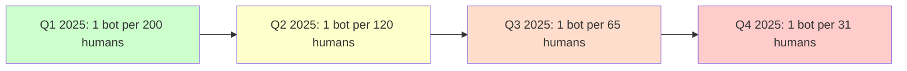
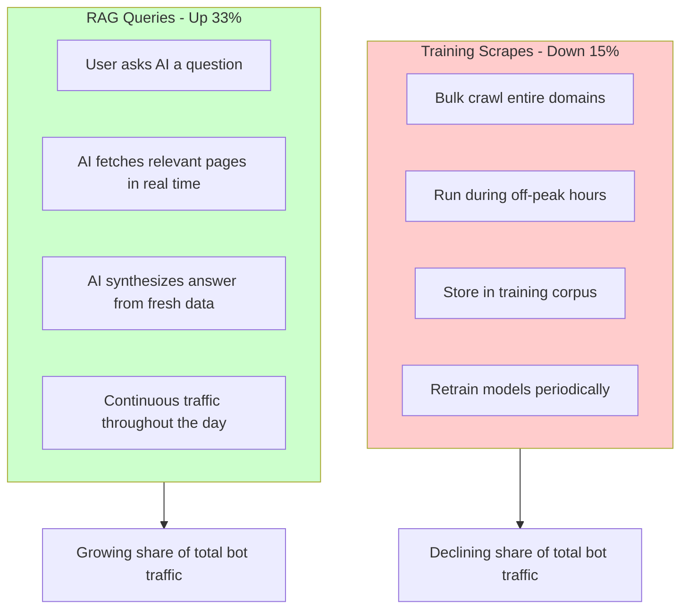
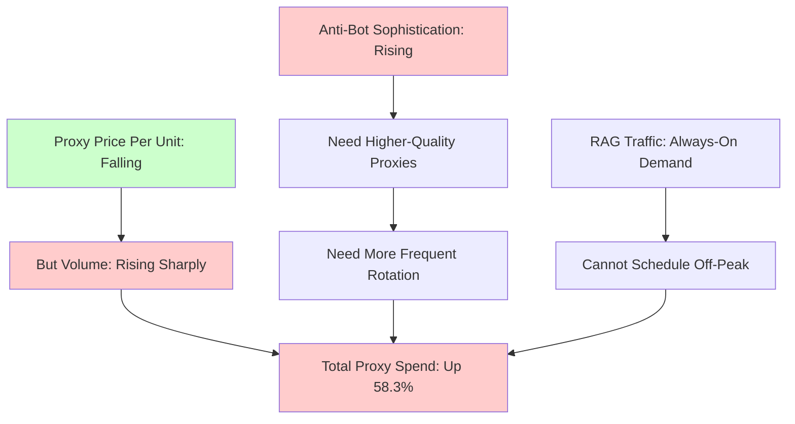

By the end of 2025, roughly 1 AI bot visit occurred for every 31 human visits on the open web. At the start of that same year, the ratio was closer to 1 in 200. That is a sixfold increase in less than twelve months. Anyone who works with web data in any capacity -- scraping, building, or defending -- needs to understand these numbers, because they define the current operating reality.

Industry data from proxy providers, CDN operators, and scraping platforms paints a consistent picture: AI-driven traffic is growing faster than anyone predicted, infrastructure costs are climbing despite falling unit prices, and the nature of bot traffic itself is changing. Here is what the numbers say and what they mean for practitioners on both sides.

## The Traffic Explosion by the Numbers

The growth in AI bot traffic over 2025 was steep. A rough timeline based on industry reports:



Several forces converged to create this acceleration. The biggest driver was the widespread adoption of retrieval-augmented generation by AI applications. RAG systems need fresh, real-time data from the web to ground their responses. Unlike training data collection, which happens in batches and can be scheduled for off-peak hours, RAG queries hit websites continuously throughout the day as end users interact with AI products.

RAG bot traffic increased roughly 33% over the course of 2025, while training-oriented scrapes actually dropped by about 15%. The AI industry is moving from stockpiling data to streaming it. Instead of downloading the entire web into a training corpus, AI systems are increasingly fetching specific pages in real time to answer specific questions.



## The Infrastructure Cost Squeeze

If you are a scraping professional, the infrastructure numbers deserve attention. Despite proxy prices falling on a per-unit basis, total spending is climbing.

The data:

- 65.8% of scraping professionals increased their proxy usage year over year
- 58.3% increased their proxy budgets despite falling per-unit prices
- 62% of scraping professionals reported increased overall spending in the 2025 to 2026 period

The math is straightforward. Proxy prices dropped because the market got more competitive and providers achieved economies of scale. But the volume of requests grew even faster. If your per-request cost drops 20% but your request volume triples, your total spend still goes up.

Anti-bot protections are also driving costs upward. As sites deploy more sophisticated defenses -- behavioral analysis, TLS fingerprinting, AI-powered challenge systems -- scrapers need higher-quality residential proxies, more frequent IP rotation, and longer session durations. The cheap datacenter proxies that worked two years ago now get blocked within minutes on major sites.



## The Funding Picture

The money flowing into web scraping infrastructure tells its own story. The web scraping software sector now comprises approximately 258 companies, with 31 having received venture funding totaling $196 million collectively. Funding hit $85 million in 2025 alone, a 232% rise year over year.

The most notable deal was Exa's $85 million Series B at a $700 million valuation in September 2025. Exa builds AI-native search and data retrieval infrastructure -- exactly the kind of tooling that powers the RAG wave. That a single company in this space can command a near-unicorn valuation shows that investors see web data retrieval as a base layer of the AI economy.

For scraping professionals, the investment surge means two things. First, better tooling is coming. More funded companies means more competition, which drives innovation in proxy management, browser automation, and anti-detection. Second, the market is professionalizing. The era of running scrapers on a personal laptop with free proxies is giving way to an industry with real budgets, real infrastructure, and real compliance requirements.

## Detecting AI Bot Traffic on Your Site

If you are a website owner or operator, understanding what this traffic surge looks like in your server logs matters. Here is a practical approach to identifying and measuring AI bot traffic.

```python
import re
from collections import Counter, defaultdict
from datetime import datetime

class BotTrafficAnalyzer:
    """Analyze server logs to identify and categorize AI bot traffic."""

    # Known AI bot user agents as of early 2026
    AI_BOT_PATTERNS = [
        (r"GPTBot", "OpenAI GPTBot"),
        (r"ChatGPT-User", "ChatGPT Browsing"),
        (r"Google-Extended", "Google AI Training"),
        (r"Amazonbot", "Amazon AI"),
        (r"anthropic-ai", "Anthropic"),
        (r"ClaudeBot", "Anthropic Claude"),
        (r"CCBot", "Common Crawl"),
        (r"Bytespider", "ByteDance"),
        (r"Applebot-Extended", "Apple AI"),
        (r"PerplexityBot", "Perplexity AI"),
        (r"Cohere-ai", "Cohere"),
        (r"YouBot", "You.com"),
    ]

    def __init__(self):
        self.human_count = 0
        self.bot_counts = Counter()
        self.hourly_distribution = defaultdict(lambda: {"human": 0, "bot": 0})

    def classify_request(self, user_agent, timestamp=None):
        """Classify a request as human or specific AI bot."""
        for pattern, bot_name in self.AI_BOT_PATTERNS:
            if re.search(pattern, user_agent, re.IGNORECASE):
                self.bot_counts[bot_name] += 1
                if timestamp:
                    hour = timestamp.hour
                    self.hourly_distribution[hour]["bot"] += 1
                return bot_name

        self.human_count += 1
        if timestamp:
            hour = timestamp.hour
            self.hourly_distribution[hour]["human"] += 1
        return "human"

    def get_ratio(self):
        """Calculate the bot-to-human ratio."""
        total_bots = sum(self.bot_counts.values())
        if total_bots == 0:
            return "No bot traffic detected"
        ratio = self.human_count / total_bots if total_bots > 0 else float("inf")
        return f"1 bot per {ratio:.0f} humans"

    def report(self):
        """Generate a summary report."""
        total_bots = sum(self.bot_counts.values())
        total = self.human_count + total_bots
        print(f"Total requests: {total:,}")
        print(f"Human: {self.human_count:,} ({self.human_count/total*100:.1f}%)")
        print(f"Bot: {total_bots:,} ({total_bots/total*100:.1f}%)")
        print(f"Ratio: {self.get_ratio()}")
        print(f"\nTop AI bots:")
        for bot, count in self.bot_counts.most_common(10):
            print(f"  {bot}: {count:,}")


# Usage with a log file
analyzer = BotTrafficAnalyzer()

# Parse Apache/Nginx combined log format
log_pattern = re.compile(
    r'(\S+) \S+ \S+ \[([^\]]+)\] "[^"]*" \d+ \d+ "[^"]*" "([^"]*)"'
)

with open("/var/log/nginx/access.log", "r") as f:
    for line in f:
        match = log_pattern.match(line)
        if match:
            ip, timestamp_str, user_agent = match.groups()
            timestamp = datetime.strptime(
                timestamp_str, "%d/%b/%Y:%H:%M:%S %z"
            )
            analyzer.classify_request(user_agent, timestamp)

analyzer.report()
```

```javascript
// JavaScript version for Node.js log analysis
const fs = require("fs");
const readline = require("readline");

const AI_BOT_PATTERNS = [
  [/GPTBot/i, "OpenAI GPTBot"],
  [/ChatGPT-User/i, "ChatGPT Browsing"],
  [/Google-Extended/i, "Google AI Training"],
  [/Amazonbot/i, "Amazon AI"],
  [/anthropic-ai/i, "Anthropic"],
  [/ClaudeBot/i, "Anthropic Claude"],
  [/CCBot/i, "Common Crawl"],
  [/Bytespider/i, "ByteDance"],
  [/PerplexityBot/i, "Perplexity AI"],
];

async function analyzeLogFile(logPath) {
  const stats = { human: 0, bots: {} };
  const logPattern =
    /(\S+) \S+ \S+ \[([^\]]+)\] "[^"]*" \d+ \d+ "[^"]*" "([^"]*)"/;

  const rl = readline.createInterface({
    input: fs.createReadStream(logPath),
    crlfDelay: Infinity,
  });

  for await (const line of rl) {
    const match = line.match(logPattern);
    if (!match) continue;

    const userAgent = match[3];
    let isBot = false;

    for (const [pattern, botName] of AI_BOT_PATTERNS) {
      if (pattern.test(userAgent)) {
        stats.bots[botName] = (stats.bots[botName] || 0) + 1;
        isBot = true;
        break;
      }
    }

    if (!isBot) stats.human++;
  }

  const totalBots = Object.values(stats.bots).reduce((a, b) => a + b, 0);
  const ratio = totalBots > 0 ? Math.round(stats.human / totalBots) : "N/A";

  console.log(`Human visits: ${stats.human.toLocaleString()}`);
  console.log(`Bot visits: ${totalBots.toLocaleString()}`);
  console.log(`Ratio: 1 bot per ${ratio} humans`);
  console.log("\nBot breakdown:");
  Object.entries(stats.bots)
    .sort(([, a], [, b]) => b - a)
    .forEach(([name, count]) => {
      console.log(`  ${name}: ${count.toLocaleString()}`);
    });
}

analyzeLogFile("/var/log/nginx/access.log");
```

## Rate Limiting for Website Operators

If you are seeing a surge in AI bot traffic and want to control it without blocking legitimate users, rate limiting is the first line of defense.

```python
import time
from collections import defaultdict

class AdaptiveRateLimiter:
    """Rate limiter that applies different limits to bots vs humans."""

    def __init__(self, human_rpm=60, bot_rpm=10, burst_allowance=5):
        self.human_rpm = human_rpm
        self.bot_rpm = bot_rpm
        self.burst_allowance = burst_allowance
        self.request_log = defaultdict(list)  # ip -> list of timestamps

    def should_allow(self, ip, is_bot=False):
        """Check if a request should be allowed."""
        now = time.time()
        window_start = now - 60  # 1-minute window

        # Clean old entries
        self.request_log[ip] = [
            t for t in self.request_log[ip] if t > window_start
        ]

        current_count = len(self.request_log[ip])
        limit = self.bot_rpm if is_bot else self.human_rpm

        if current_count >= limit + self.burst_allowance:
            return False, 429, "Rate limit exceeded"

        if current_count >= limit:
            return True, 200, "Warning: approaching rate limit"

        self.request_log[ip].append(now)
        return True, 200, "OK"

    def get_retry_after(self, ip):
        """Calculate seconds until the client can retry."""
        if not self.request_log[ip]:
            return 0
        oldest_in_window = min(self.request_log[ip])
        return max(0, int(60 - (time.time() - oldest_in_window)))


# Usage in a web framework
limiter = AdaptiveRateLimiter(human_rpm=60, bot_rpm=10)

def handle_request(request):
    ip = request.remote_addr
    user_agent = request.headers.get("User-Agent", "")

    # Detect if this is a known AI bot
    is_bot = any(
        pattern in user_agent.lower()
        for pattern in ["gptbot", "claudebot", "perplexitybot", "bytespider"]
    )

    allowed, status, message = limiter.should_allow(ip, is_bot)

    if not allowed:
        retry_after = limiter.get_retry_after(ip)
        return {
            "status": 429,
            "headers": {"Retry-After": str(retry_after)},
            "body": "Too many requests"
        }

    return process_request(request)
```

## Efficient Proxy Rotation for Scrapers

On the scraping side of the equation, proxy strategy needs to be smarter than simple round-robin rotation in this increasingly competitive environment. Here is an approach that adapts based on success rates and response patterns.

```python
import random
import time
from collections import defaultdict

class AdaptiveProxyRotator:
    """Proxy rotator that learns which proxies work best for each domain."""

    def __init__(self, proxies):
        self.proxies = proxies
        self.stats = defaultdict(lambda: {
            "success": 0, "failure": 0, "last_used": 0,
            "avg_response_time": 0, "blocked_domains": set()
        })

    def get_proxy(self, target_domain):
        """Select the best proxy for a given domain."""
        candidates = []
        now = time.time()

        for proxy in self.proxies:
            stat = self.stats[proxy]

            # Skip proxies blocked on this domain
            if target_domain in stat["blocked_domains"]:
                continue

            # Enforce cooldown between uses
            if now - stat["last_used"] < 2.0:
                continue

            # Calculate a score based on success rate
            total = stat["success"] + stat["failure"]
            if total == 0:
                score = 0.5  # Unknown proxies get neutral score
            else:
                score = stat["success"] / total

            candidates.append((proxy, score))

        if not candidates:
            # All proxies exhausted; reset blocked lists
            for proxy in self.proxies:
                self.stats[proxy]["blocked_domains"].discard(target_domain)
            return random.choice(self.proxies)

        # Weighted random selection favoring higher scores
        candidates.sort(key=lambda x: x[1], reverse=True)
        weights = [score + 0.1 for _, score in candidates]
        total_weight = sum(weights)
        probabilities = [w / total_weight for w in weights]

        selected = random.choices(
            [c[0] for c in candidates],
            weights=probabilities,
            k=1
        )[0]

        self.stats[selected]["last_used"] = now
        return selected

    def report_result(self, proxy, domain, success, response_code=200):
        """Report the result of using a proxy."""
        stat = self.stats[proxy]
        if success:
            stat["success"] += 1
        else:
            stat["failure"] += 1
            if response_code in (403, 407, 429):
                stat["blocked_domains"].add(domain)

    def get_health_report(self):
        """Show proxy health statistics."""
        for proxy in self.proxies:
            stat = self.stats[proxy]
            total = stat["success"] + stat["failure"]
            rate = stat["success"] / total * 100 if total > 0 else 0
            print(f"{proxy}: {rate:.1f}% success ({total} requests)")


# Usage
proxies = [
    "http://proxy1.example.com:8080",
    "http://proxy2.example.com:8080",
    "http://proxy3.example.com:8080",
    "http://proxy4.example.com:8080",
]

rotator = AdaptiveProxyRotator(proxies)

# In your scraping loop
for url in urls_to_scrape:
    domain = url.split("/")[2]
    proxy = rotator.get_proxy(domain)

    try:
        response = requests.get(url, proxies={"http": proxy, "https": proxy}, timeout=10)
        rotator.report_result(proxy, domain, response.status_code == 200, response.status_code)
    except Exception:
        rotator.report_result(proxy, domain, False)
```

```javascript
// JavaScript adaptive proxy rotator
class AdaptiveProxyRotator {
  constructor(proxies) {
    this.proxies = proxies;
    this.stats = new Map();
    proxies.forEach((proxy) => {
      this.stats.set(proxy, {
        success: 0,
        failure: 0,
        lastUsed: 0,
        blockedDomains: new Set(),
      });
    });
  }

  getProxy(targetDomain) {
    const now = Date.now();
    const candidates = [];

    for (const proxy of this.proxies) {
      const stat = this.stats.get(proxy);

      if (stat.blockedDomains.has(targetDomain)) continue;
      if (now - stat.lastUsed < 2000) continue;

      const total = stat.success + stat.failure;
      const score = total === 0 ? 0.5 : stat.success / total;
      candidates.push({ proxy, score });
    }

    if (candidates.length === 0) {
      // Reset blocks for this domain
      for (const [, stat] of this.stats) {
        stat.blockedDomains.delete(targetDomain);
      }
      return this.proxies[Math.floor(Math.random() * this.proxies.length)];
    }

    // Weighted random selection
    const totalScore = candidates.reduce((sum, c) => sum + c.score + 0.1, 0);
    let random = Math.random() * totalScore;

    for (const candidate of candidates) {
      random -= candidate.score + 0.1;
      if (random <= 0) {
        this.stats.get(candidate.proxy).lastUsed = now;
        return candidate.proxy;
      }
    }

    return candidates[0].proxy;
  }

  reportResult(proxy, domain, success, statusCode = 200) {
    const stat = this.stats.get(proxy);
    if (success) {
      stat.success++;
    } else {
      stat.failure++;
      if ([403, 407, 429].includes(statusCode)) {
        stat.blockedDomains.add(domain);
      }
    }
  }
}
```

## Is the Web Becoming Machine-to-Machine

When 1 in every 31 visits is a bot, and that ratio is accelerating, the question is whether the web is approaching a tipping point where more traffic is machine-generated than human-generated.

That point has not arrived yet, but the trajectory is worth watching. Consider the implications:

For website operators, the calculus of serving pages changes. If a large portion of your traffic is AI bots fetching data for RAG systems, you are providing value to AI products without direct compensation. This is driving new commercial models -- data licensing agreements, premium API access for AI companies, and Cloudflare's 402 Payment Required status code for AI crawlers.

For scraping professionals, the competition for web data is getting fiercer. More bots hitting the same sites means more aggressive anti-bot measures, which means higher infrastructure costs. The 62% who reported increased spending are experiencing this firsthand.

For the broader web ecosystem, the question is whether websites will adapt by creating machine-readable endpoints alongside their human-readable pages, or whether the adversarial dynamic will keep escalating. The sites that thrive will likely be those that embrace controlled access -- offering structured data feeds to legitimate consumers while blocking unauthorized scraping.

## Practical Recommendations

If you operate websites: start measuring your AI bot traffic today. Use the detection scripts above or tools from your CDN provider. Understand the ratio on your own sites. Set up differentiated rate limits. And explore whether commercial data licensing could turn bot traffic from a cost center into a revenue stream.

If you scrape professionally: invest in your proxy infrastructure. Costs are rising despite falling unit prices. Use adaptive rotation, monitor success rates per domain, and budget for continued increases. The days of cheap, unlimited scraping are over.

If you build AI products: be a good citizen. Identify your bot clearly in the user agent string. Respect robots.txt. Honor rate limits. And consider paying for the data you consume. The web scraping ecosystem depends on sustainable practices, and the 1-in-31 ratio only works if the relationship between data producers and consumers stays viable.

## Summary

AI bot traffic grew roughly sixfold over 2025, driven primarily by the shift from training scrapes to real-time RAG queries. Infrastructure costs are rising even as per-unit prices fall. Venture funding into the web scraping sector surged 232%, with Exa's $85 million round signaling that investors see data retrieval as a base layer of AI infrastructure.

The web is not yet a machine-to-machine medium, but it is moving in that direction faster than most people expected. The professionals who do well in this environment will be those who understand both sides: how to defend against unwanted bot traffic and how to scrape efficiently and responsibly at scale.
