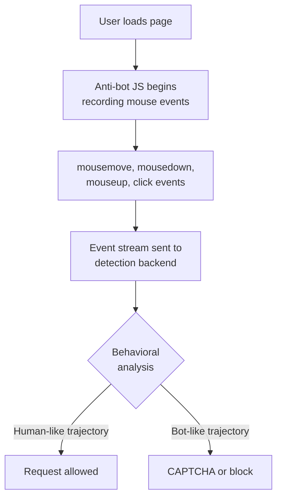
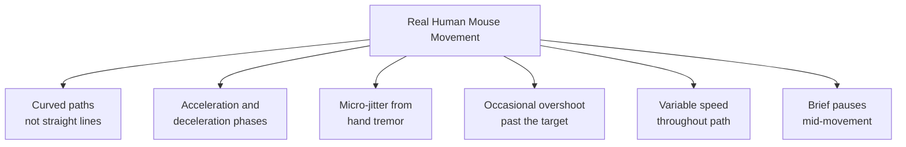
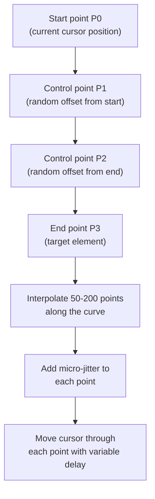
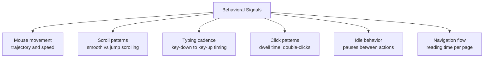
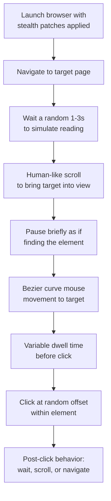

Your automated browser clicks the login button, fills in the credentials, and submits the form. Everything looks correct -- the selectors are right, the timing is reasonable, and the page loads as expected. But after a few requests, the site starts returning CAPTCHAs. The problem is not what your bot is doing. It is how the mouse gets there. Anti-bot systems have moved far beyond checking HTTP headers and JavaScript properties, as the [evolution of web scraping detection methods](/posts/evolution-web-scraping-detection-methods-timeline/) shows. They now track cursor trajectories in real time, and a mouse that teleports from point A to point B is one of the clearest signals that nobody is home behind the keyboard.

This post covers why mouse movement matters for stealth, how real human cursor behavior works, and how to implement convincing mouse movement in Playwright and Puppeteer using Bezier curves, jitter, and variable speed.

## Why Mouse Movement Matters

Modern anti-bot systems analyze behavioral signals alongside traditional fingerprinting. Mouse movement is one of the strongest signals because it is difficult to fake convincingly and easy to collect passively. Every time your cursor moves, the browser fires `mousemove` events that anti-bot scripts listen to. These scripts record the entire cursor path -- every coordinate, every timestamp -- and feed it into classification models.



The detection systems are looking for patterns that real humans never produce. A mouse that appears at coordinates (0, 0) and then instantly appears at (450, 320) with nothing in between is not human. A mouse that moves in a perfectly straight line at constant speed is not human. A click that fires without any preceding mouse movement is not human.

If your automation framework uses the default `.click()` method, it typically dispatches a click event at the element's center coordinates without generating any mouse movement at all. This matters not just for clicking, but also for [automating web form filling](/posts/how-to-automate-web-form-filling-complete-guide/) where realistic interactions are critical. Some frameworks have gotten smarter about this, but most still skip the cursor path entirely.

## How Real Humans Move Mice

Before you can fake human mouse movement, you need to understand what it actually looks like. Human cursor paths are governed by a combination of motor control principles, and the most important one is Fitts's Law.

### Fitts's Law

Fitts's Law predicts that the time required to move to a target depends on the distance to the target and the size of the target. Formally:

```
MT = a + b * log2(D / W + 1)
```

Where `MT` is movement time, `D` is distance, `W` is target width, and `a` and `b` are empirically determined constants. In practical terms: people move faster to large nearby targets and slower to small distant targets. Your simulated mouse movement should reflect this.

### Characteristics of Real Mouse Paths

Real cursor trajectories have several distinct properties that set them apart from programmatic movement:



**Curved paths.** Humans do not move the cursor in perfectly straight lines. The path between two points always has some curvature, often resembling a slight arc. The curvature varies between individuals and even between individual movements by the same person.

**Acceleration and deceleration.** A human cursor starts slow, accelerates through the middle of the movement, and decelerates as it approaches the target. This is sometimes called a bell-shaped velocity profile.

**Micro-jitter.** Even during smooth movement, the cursor jitters slightly because the human hand is never perfectly steady. The amplitude of this jitter is typically 1-3 pixels.

**Overshoot.** Especially for small targets or fast movements, people frequently overshoot the target and then make a small correction movement back. This is a well-documented phenomenon in motor control research.

**Variable speed.** No two segments of a real cursor path have exactly the same speed. There is always variation, even within a single smooth movement.

<figure>
  
  <figcaption>Every human moves a mouse differently — and detection systems know it. <span class="img-credit">Photo by Thirdman / <a href="https://www.pexels.com" target="_blank" rel="noopener noreferrer">Pexels</a></span></figcaption>
</figure>

## What Detection Systems Look For

Anti-bot systems use the characteristics above to build detection rules and machine learning classifiers. Here are the specific signals that flag automated cursor behavior:

| Signal | Why It Flags |
|--------|-------------|
| Straight-line path | Real paths always have some curvature |
| Constant velocity | Humans always accelerate and decelerate |
| No mouse movement before click | Real users move the cursor to the element first |
| Integer-only coordinates | Some synthetic events produce only whole numbers |
| Perfectly centered clicks | Humans rarely click the exact center of an element |
| Zero events between source and target | Teleportation is not a human capability |
| Uniform time intervals between events | Real events have variable timing |
| No idle periods | Humans pause to read, think, or find the next element |

Some advanced systems also look for the absence of `mouseover` and `mouseenter` events on elements along the cursor path. When you teleport the cursor, intermediate elements never receive these events, which is a signal that something is off.

## The Bezier Curve Approach

Bezier curves are the most common technique for generating smooth, curved paths between two points. A cubic Bezier curve is defined by four control points: the start point, two intermediate control points that shape the curve, and the end point. By randomizing the control points, you get a different curved path every time.



Here is a Python implementation that generates Bezier curve points:

```python
import random
import math


def bezier_curve(start, end, num_points=80):
    """
    Generate points along a cubic Bezier curve between start and end.
    Control points are randomized to create natural-looking curvature.
    """
    x0, y0 = start
    x3, y3 = end

    # Distance between start and end determines control point spread
    dist = math.hypot(x3 - x0, y3 - y0)
    spread = dist * 0.4

    # Randomize control points for natural curvature
    x1 = x0 + random.uniform(0.2, 0.5) * (x3 - x0) + random.uniform(-spread, spread)
    y1 = y0 + random.uniform(0.0, 0.3) * (y3 - y0) + random.uniform(-spread, spread)

    x2 = x0 + random.uniform(0.5, 0.8) * (x3 - x0) + random.uniform(-spread, spread)
    y2 = y0 + random.uniform(0.7, 1.0) * (y3 - y0) + random.uniform(-spread, spread)

    points = []
    for i in range(num_points):
        t = i / (num_points - 1)

        # Cubic Bezier formula
        x = (
            (1 - t) ** 3 * x0
            + 3 * (1 - t) ** 2 * t * x1
            + 3 * (1 - t) * t ** 2 * x2
            + t ** 3 * x3
        )
        y = (
            (1 - t) ** 3 * y0
            + 3 * (1 - t) ** 2 * t * y1
            + 3 * (1 - t) * t ** 2 * y2
            + t ** 3 * y3
        )

        points.append((x, y))

    return points
```

The key insight is the control point placement. The two control points (`P1` and `P2`) are placed at roughly one-third and two-thirds of the way between start and end, but with significant random offsets. This creates the natural curvature that detection systems expect to see.

## Adding Realism: Jitter, Speed, and Overshoot

A bare Bezier curve is better than a straight line, but it is still too smooth. Real cursor movement has noise at every level. Here is an enhanced version that adds micro-jitter, variable speed through easing, and occasional overshoot:

```python
import random
import math
import asyncio


def ease_out_quad(t):
    """Deceleration curve -- fast start, slow approach to target."""
    return t * (2 - t)


def add_jitter(point, amplitude=1.5):
    """Add small random offset to simulate hand tremor."""
    x, y = point
    return (
        x + random.gauss(0, amplitude),
        y + random.gauss(0, amplitude),
    )


def generate_human_path(start, end, overshoot_chance=0.15):
    """
    Generate a full human-like mouse path from start to end.
    Includes Bezier curvature, jitter, and optional overshoot.
    """
    dist = math.hypot(end[0] - start[0], end[1] - start[1])

    # More points for longer distances
    num_points = max(40, min(200, int(dist / 3)))

    # Decide whether to overshoot
    if random.random() < overshoot_chance and dist > 100:
        # Overshoot by 5-15 pixels past the target
        overshoot_dist = random.uniform(5, 15)
        dx = end[0] - start[0]
        dy = end[1] - start[1]
        angle = math.atan2(dy, dx)

        overshoot_point = (
            end[0] + overshoot_dist * math.cos(angle),
            end[1] + overshoot_dist * math.sin(angle),
        )

        # Path to overshoot point, then correction back to target
        main_path = bezier_curve(start, overshoot_point, num_points)
        correction_path = bezier_curve(overshoot_point, end, num_points // 4)
        path = main_path + correction_path
    else:
        path = bezier_curve(start, end, num_points)

    # Add jitter to each point
    path = [add_jitter(p) for p in path]

    # Ensure the last point is exactly the target
    path[-1] = end

    return path


def calculate_delays(path):
    """
    Calculate delay between each point using easing.
    Produces bell-shaped velocity profile -- slow start, fast middle, slow end.
    """
    total_duration = random.uniform(0.3, 0.8)  # Total movement time in seconds
    n = len(path)
    delays = []

    for i in range(n - 1):
        t = i / (n - 1)

        # Bell curve: slow at start and end, fast in middle
        if t < 0.5:
            speed_factor = ease_out_quad(t * 2)
        else:
            speed_factor = ease_out_quad((1 - t) * 2)

        # Avoid zero delay
        speed_factor = max(speed_factor, 0.1)

        # Base delay inversely proportional to speed
        base_delay = (total_duration / n) / speed_factor

        # Add small random variation
        delay = base_delay * random.uniform(0.8, 1.2)
        delays.append(delay)

    return delays
```

The `generate_human_path` function handles the full pipeline: Bezier curve generation, optional overshoot with correction, and per-point jitter. The `calculate_delays` function produces the timing between points, implementing the bell-shaped velocity profile where the cursor is slow at the start and end but fast in the middle.

## Implementation in Playwright

Playwright's `page.mouse.move()` method accepts x and y coordinates, which makes it straightforward to feed in the points from our path generator. Here is how to integrate the human-like path into a Playwright script:

```python
from playwright.async_api import async_playwright
import asyncio
import random


async def human_move_and_click(page, selector):
    """
    Move the mouse to an element with a human-like path and click it.
    """
    # Get current mouse position (or start from a random viewport position)
    # Playwright does not expose current mouse position, so track it yourself
    viewport = page.viewport_size
    if not hasattr(human_move_and_click, "_last_pos"):
        human_move_and_click._last_pos = (
            random.randint(100, viewport["width"] - 100),
            random.randint(100, viewport["height"] - 100),
        )

    start = human_move_and_click._last_pos

    # Get the target element's bounding box
    element = await page.wait_for_selector(selector)
    box = await element.bounding_box()

    if not box:
        raise Exception(f"Element {selector} not found or not visible")

    # Click a random point within the element, not the exact center
    target_x = box["x"] + box["width"] * random.uniform(0.25, 0.75)
    target_y = box["y"] + box["height"] * random.uniform(0.25, 0.75)
    end = (target_x, target_y)

    # Generate the path
    path = generate_human_path(start, end)
    delays = calculate_delays(path)

    # Move through each point
    for i, point in enumerate(path):
        await page.mouse.move(point[0], point[1])
        if i < len(delays):
            await asyncio.sleep(delays[i])

    # Small pause before clicking, like a human recognizing the target
    await asyncio.sleep(random.uniform(0.05, 0.15))

    # Click
    await page.mouse.click(target_x, target_y)

    # Update last known position
    human_move_and_click._last_pos = end


async def main():
    async with async_playwright() as p:
        browser = await p.chromium.launch(headless=False)
        page = await browser.new_page()
        await page.goto("https://example.com")

        # Move to and click a link with human-like movement
        await human_move_and_click(page, "a[href]")

        await asyncio.sleep(2)
        await browser.close()


asyncio.run(main())
```

A few important details in this implementation:

**Random click position.** Instead of clicking the exact center of the element, the click lands at a random point within the middle 50% of the bounding box. Real users almost never hit dead center.

**Pre-click pause.** There is a small delay between the mouse arriving at the target and the click firing. Humans need a moment to confirm they are on the right element before they click.

**Position tracking.** Since Playwright does not expose the current mouse position, the function tracks it manually so that the next movement starts from where the last one ended.

## Implementation in Puppeteer

Puppeteer's `page.mouse.move()` has a `steps` parameter that automatically interpolates between the current and target position. However, this produces a straight-line path with uniform speed, which is exactly what detection systems flag. For human-like movement, you need to supply your own intermediate points:

```javascript
const puppeteer = require("puppeteer");

function bezierCurve(start, end, numPoints = 80) {
  const [x0, y0] = start;
  const [x3, y3] = end;

  const dist = Math.hypot(x3 - x0, y3 - y0);
  const spread = dist * 0.4;

  const x1 = x0 + (0.2 + Math.random() * 0.3) * (x3 - x0)
            + (Math.random() * 2 - 1) * spread;
  const y1 = y0 + Math.random() * 0.3 * (y3 - y0)
            + (Math.random() * 2 - 1) * spread;
  const x2 = x0 + (0.5 + Math.random() * 0.3) * (x3 - x0)
            + (Math.random() * 2 - 1) * spread;
  const y2 = y0 + (0.7 + Math.random() * 0.3) * (y3 - y0)
            + (Math.random() * 2 - 1) * spread;

  const points = [];
  for (let i = 0; i < numPoints; i++) {
    const t = i / (numPoints - 1);
    const x =
      (1 - t) ** 3 * x0 +
      3 * (1 - t) ** 2 * t * x1 +
      3 * (1 - t) * t ** 2 * x2 +
      t ** 3 * x3;
    const y =
      (1 - t) ** 3 * y0 +
      3 * (1 - t) ** 2 * t * y1 +
      3 * (1 - t) * t ** 2 * y2 +
      t ** 3 * y3;

    // Add micro-jitter
    points.push([
      x + (Math.random() - 0.5) * 2,
      y + (Math.random() - 0.5) * 2,
    ]);
  }

  // Ensure final point is exact
  points[points.length - 1] = end;
  return points;
}

async function humanMoveAndClick(page, selector) {
  const element = await page.waitForSelector(selector);
  const box = await element.boundingBox();

  if (!box) throw new Error(`Element ${selector} not visible`);

  // Random point within the element
  const targetX = box.x + box.width * (0.25 + Math.random() * 0.5);
  const targetY = box.y + box.height * (0.25 + Math.random() * 0.5);

  // Get current mouse position or use a default
  const startX = humanMoveAndClick._lastX || 300;
  const startY = humanMoveAndClick._lastY || 400;

  const path = bezierCurve([startX, startY], [targetX, targetY]);

  for (const [x, y] of path) {
    await page.mouse.move(x, y);
    // Variable delay: 2-12ms between points
    const delay = 2 + Math.random() * 10;
    await new Promise((r) => setTimeout(r, delay));
  }

  // Brief pause before clicking
  await new Promise((r) => setTimeout(r, 50 + Math.random() * 100));

  await page.mouse.click(targetX, targetY);

  humanMoveAndClick._lastX = targetX;
  humanMoveAndClick._lastY = targetY;
}

(async () => {
  const browser = await puppeteer.launch({ headless: false });
  const page = await browser.newPage();
  await page.goto("https://example.com");

  await humanMoveAndClick(page, "a[href]");

  await new Promise((r) => setTimeout(r, 2000));
  await browser.close();
})();
```

The logic is the same as the Python version: generate a Bezier curve, add jitter, move through each point with variable timing, and click at a random offset within the target element. The key difference is that Puppeteer's API is JavaScript-native, so the implementation is slightly more concise.

## Libraries That Help

Writing your own mouse movement engine is educational, but there are mature libraries that handle the complexity for you.

### ghost-cursor (Puppeteer)

ghost-cursor is the most widely used library for human-like mouse movement in Puppeteer. It uses Bezier curves with randomized control points, adds overshoot and correction movements, and varies speed based on distance.

```javascript
const { createCursor } = require("ghost-cursor");
const puppeteer = require("puppeteer");

(async () => {
  const browser = await puppeteer.launch({ headless: false });
  const page = await browser.newPage();
  const cursor = createCursor(page);

  await page.goto("https://example.com");

  // Move and click with human-like movement
  await cursor.click("a[href]");

  // Move without clicking
  await cursor.move("input[type='text']");

  // Random movement to simulate reading behavior
  await cursor.moveTo({ x: 400, y: 300 });

  await browser.close();
})();
```

ghost-cursor handles position tracking, easing, overshoot, and jitter internally. It also fires the correct sequence of `mouseover`, `mouseenter`, `mousemove`, `mousedown`, `mouseup`, and `click` events, which is important because detection systems verify the full event sequence.

### playwright-stealth and Behavioral Patches

For Playwright, there is no single dominant mouse movement library, but `playwright-stealth` provides a set of patches that address multiple detection vectors. For mouse movement specifically, you will typically combine playwright-stealth for fingerprint evasion with a custom Bezier-based movement function like the one shown above.

```python
from playwright.async_api import async_playwright
from playwright_stealth import stealth_async


async def main():
    async with async_playwright() as p:
        browser = await p.chromium.launch(headless=False)
        context = await browser.new_context()
        page = await context.new_page()

        # Apply stealth patches for fingerprint evasion
        await stealth_async(page)

        await page.goto("https://example.com")

        # Use custom human movement for behavioral evasion
        await human_move_and_click(page, "a[href]")

        await browser.close()


asyncio.run(main())
```

The combination of stealth patches (for static fingerprinting) and human-like mouse movement (for behavioral analysis) covers both detection layers. For a broader look at anti-detection tools, see the overview of [stealth browsers in 2026 including Camoufox and nodriver](/posts/stealth-browsers-in-2026-camoufox-nodriver-and-the-anti-detection-arms-race/).

## Testing Your Implementation

You need to verify that your mouse paths actually look human. There are two practical approaches.

### Visual Verification with Canvas

Inject a canvas overlay that draws each mouse position as a dot. This gives you immediate visual feedback on the path shape:

```javascript
// Inject into the page to visualize mouse movement
await page.evaluate(() => {
  const canvas = document.createElement("canvas");
  canvas.width = window.innerWidth;
  canvas.height = window.innerHeight;
  canvas.style.cssText =
    "position:fixed;top:0;left:0;z-index:999999;pointer-events:none;";
  document.body.appendChild(canvas);

  const ctx = canvas.getContext("2d");
  ctx.fillStyle = "rgba(255, 0, 0, 0.4)";

  document.addEventListener("mousemove", (e) => {
    ctx.beginPath();
    ctx.arc(e.clientX, e.clientY, 2, 0, Math.PI * 2);
    ctx.fill();
  });
});
```

Run your automation in headed mode and watch the red dots trace the cursor path. You should see smooth curves with natural-looking variation, not straight lines or jagged jumps.

### Statistical Analysis

For more rigorous testing, log the coordinates and timestamps and analyze them offline:

```python
import json
import math


def analyze_path(path_data):
    """
    Analyze a recorded mouse path for human-like characteristics.
    path_data: list of (x, y, timestamp) tuples.
    """
    results = {}

    # Check for straight-line movement
    if len(path_data) >= 3:
        angles = []
        for i in range(1, len(path_data) - 1):
            x0, y0, _ = path_data[i - 1]
            x1, y1, _ = path_data[i]
            x2, y2, _ = path_data[i + 1]

            angle1 = math.atan2(y1 - y0, x1 - x0)
            angle2 = math.atan2(y2 - y1, x2 - x1)
            angles.append(abs(angle2 - angle1))

        avg_angle_change = sum(angles) / len(angles)
        results["avg_angle_change_rad"] = avg_angle_change
        results["likely_straight_line"] = avg_angle_change < 0.01

    # Check velocity variation
    velocities = []
    for i in range(1, len(path_data)):
        x0, y0, t0 = path_data[i - 1]
        x1, y1, t1 = path_data[i]
        dt = t1 - t0
        if dt > 0:
            dist = math.hypot(x1 - x0, y1 - y0)
            velocities.append(dist / dt)

    if velocities:
        avg_v = sum(velocities) / len(velocities)
        variance = sum((v - avg_v) ** 2 for v in velocities) / len(velocities)
        cv = (variance ** 0.5) / avg_v if avg_v > 0 else 0
        results["velocity_cv"] = cv
        results["likely_constant_speed"] = cv < 0.1

    return results
```

A coefficient of variation (CV) below 0.1 for velocity means the speed is almost constant -- a clear bot signal. Human mouse movement typically has a CV above 0.3.

## Beyond Mouse Movement

Mouse movement is one piece of the behavioral puzzle. Detection systems analyze multiple behavioral channels simultaneously, and inconsistency between them is itself a signal.



### Scroll Patterns

Real users scroll smoothly using a mouse wheel or trackpad, with variable speed and occasional pauses to read. Automated scripts often use `window.scrollTo()` which produces an instant jump to the target position. Use `window.scrollBy()` in small increments with variable delays, or dispatch wheel events directly.

```javascript
async function humanScroll(page, distance) {
  const steps = Math.floor(Math.abs(distance) / 50) + 1;
  const direction = distance > 0 ? 1 : -1;

  for (let i = 0; i < steps; i++) {
    const scrollAmount = (30 + Math.random() * 40) * direction;
    await page.mouse.wheel({ deltaY: scrollAmount });
    await new Promise((r) => setTimeout(r, 30 + Math.random() * 70));
  }
}
```

### Typing Cadence

Typing speed varies between characters. Spaces and punctuation typically have longer gaps than regular letters. Some people type in bursts with pauses between words.

```python
async def human_type(page, selector, text):
    """Type text with human-like variable delays."""
    await page.click(selector)

    for i, char in enumerate(text):
        await page.keyboard.type(char)

        # Base delay between keystrokes
        delay = random.uniform(0.04, 0.12)

        # Longer delay after spaces and punctuation
        if char in " .,!?":
            delay += random.uniform(0.05, 0.15)

        # Occasional longer pause (simulating thinking)
        if random.random() < 0.05:
            delay += random.uniform(0.2, 0.5)

        await asyncio.sleep(delay)
```

### Click Timing

The time between mouse arrival and the click event -- known as dwell time -- should vary. Humans take longer to click unfamiliar elements and click familiar buttons almost immediately. Add variable pre-click delays that are longer for form inputs and shorter for navigation links.

## Putting It All Together

Here is a high-level flow for a stealth automation pipeline that covers the full behavioral stack:



The order matters. Each step should feel like a natural continuation of the previous one. A user who scrolls, pauses, moves the mouse, pauses again, and then clicks is behaving normally. A bot that instantly teleports, clicks, and extracts data in 50ms is obviously automated.

None of these techniques are individually bulletproof. Anti-bot systems update their models regularly, and a technique that works today may be detected in six months. The goal is to raise the cost of detection by making your automation's behavioral fingerprint as close to human as possible across every signal channel. How well different frameworks handle this varies -- the [Playwright vs Selenium stealth comparison](/posts/playwright-vs-selenium-stealth-which-evades-detection-better/) breaks down which evades detection better out of the box. Mouse movement is the foundation, but it works best as part of a holistic behavioral strategy that includes scrolling, typing, idle time, and natural navigation patterns.
