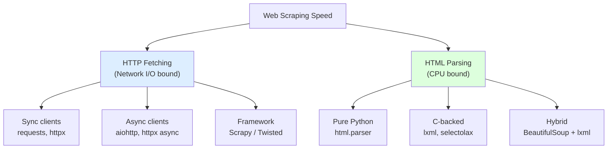
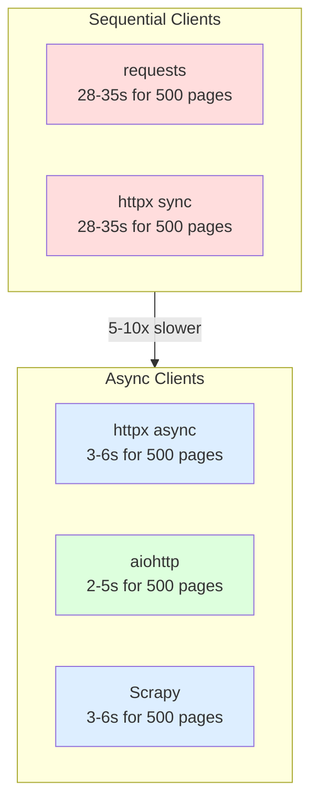
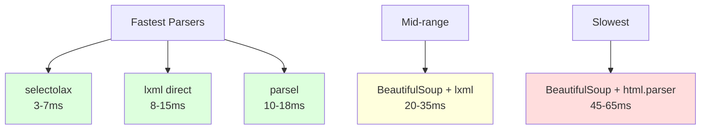
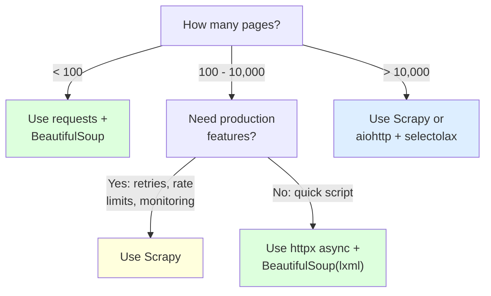

Speed matters when you are scraping thousands of pages. A scraper that takes 50 milliseconds per page finishes a 10,000-page job in eight minutes. The same job at 500 milliseconds per page takes over an hour. The choice of Python library stack -- both your HTTP client and your HTML parser -- determines which end of that range you land on. This post benchmarks the most popular options with real code and realistic numbers, then gives concrete recommendations for different use cases.

## Two Separate Speed Questions

When people ask "what is the fastest Python scraping library," they are actually asking two different questions without realizing it.

The first question is about **HTTP fetching speed** -- how quickly can you download pages from a server? This is dominated by network I/O and concurrency model. An async client that fires off 50 requests simultaneously will finish far sooner than a synchronous client that waits for each response before sending the next request.

The second question is about **HTML parsing speed** -- once you have the HTML, how quickly can you extract the data you need? This is a CPU-bound problem. A parser written in C will beat a parser written in pure Python every time.



Optimizing only one side while ignoring the other leaves performance on the table. A scraper using aiohttp for blazing fast downloads but BeautifulSoup with `html.parser` for parsing will bottleneck on the CPU side. The reverse -- `requests` with lxml -- will bottleneck on the network side.

## HTTP Client Benchmarks

All HTTP benchmarks below measure the time to fetch 500 pages from the same target server. The pages are roughly 50KB each, typical of product listing pages on e-commerce sites. Network latency to the server averages 30ms per request.

### requests -- The Synchronous Baseline

```python
import requests
import time

urls = [f"https://example.com/products?page={i}" for i in range(1, 501)]

session = requests.Session()
start = time.perf_counter()

for url in urls:
    response = session.get(url)
    _ = response.text

elapsed = time.perf_counter() - start
print(f"requests (sequential): {elapsed:.1f}s")
```

Using a `Session` object reuses TCP connections, which helps. But the fundamental problem remains: each request waits for the previous one to complete. With 30ms network latency and 20ms server processing time per request, 500 sequential requests take roughly 25 seconds at minimum. In practice, the number is higher due to DNS lookups, TLS handshakes on new connections, and variable server response times.

**Typical result: 28-35 seconds for 500 pages.**

### httpx -- Modern and Flexible

httpx offers both synchronous and asynchronous interfaces. The synchronous mode performs similarly to requests. The async mode is where it gets interesting -- for a deeper look at async HTTP for scraping, see the guide on [httpx async for fast data collection](/posts/web-scraping-httpx-async-http-fast-data-collection/).

```python
import httpx
import asyncio
import time

urls = [f"https://example.com/products?page={i}" for i in range(1, 501)]

async def fetch_all():
    async with httpx.AsyncClient() as client:
        tasks = [client.get(url) for url in urls]
        responses = await asyncio.gather(*tasks)
    return responses

start = time.perf_counter()
responses = asyncio.run(fetch_all())
elapsed = time.perf_counter() - start
print(f"httpx async: {elapsed:.1f}s")
```

The async version fires all requests concurrently (subject to connection pool limits, which default to 100 connections per host). Instead of waiting 30ms for each request sequentially, the client overlaps the waiting, and the total time is dominated by the slowest batch rather than the sum of all requests.

**Typical result: 3-6 seconds for 500 pages (async), 28-35 seconds (sync).**

### aiohttp -- Purpose-Built for Async

aiohttp is written from the ground up for async HTTP. It has lower per-request overhead than httpx's async mode because it does not carry the weight of also supporting synchronous operation.

```python
import aiohttp
import asyncio
import time

urls = [f"https://example.com/products?page={i}" for i in range(1, 501)]

async def fetch_all():
    connector = aiohttp.TCPConnector(limit=100)
    async with aiohttp.ClientSession(connector=connector) as session:
        tasks = [session.get(url) for url in urls]
        responses = await asyncio.gather(*tasks)
        pages = [await r.text() for r in responses]
    return pages

start = time.perf_counter()
pages = asyncio.run(fetch_all())
elapsed = time.perf_counter() - start
print(f"aiohttp: {elapsed:.1f}s")
```

aiohttp edges out httpx async by 10-30% in most benchmarks. The difference comes from aiohttp's leaner internal architecture -- it does less per request, which adds up over hundreds of requests.

**Typical result: 2-5 seconds for 500 pages.**

### Scrapy -- The Twisted Reactor

Scrapy is not just an HTTP client. It is a full crawling framework built on Twisted, Python's event-driven networking engine. Scrapy manages concurrency, rate limiting, retries, and request scheduling internally.

```python
import scrapy
from scrapy.crawler import CrawlerProcess

class ProductSpider(scrapy.Spider):
    name = "products"
    start_urls = [
        f"https://example.com/products?page={i}"
        for i in range(1, 501)
    ]

    custom_settings = {
        "CONCURRENT_REQUESTS": 64,
        "CONCURRENT_REQUESTS_PER_DOMAIN": 64,
        "LOG_LEVEL": "WARNING",
    }

    def parse(self, response):
        yield {"url": response.url, "length": len(response.text)}

process = CrawlerProcess()
process.crawl(ProductSpider)
process.start()
```

Scrapy's Twisted reactor is highly efficient at managing many concurrent connections. With `CONCURRENT_REQUESTS` set to 64, Scrapy processes 500 pages in a similar time range to aiohttp, but with the added benefit of built-in retry logic, rate limiting, and middleware support.

**Typical result: 3-6 seconds for 500 pages (with 64 concurrent requests).**

### HTTP Client Comparison



The takeaway is clear: for any job involving more than a handful of pages, async clients are dramatically faster. The difference between aiohttp and httpx async is relatively small; the difference between any async client and any sync client is enormous.

## HTML Parsing Benchmarks

Parsing benchmarks use a single 120KB HTML document containing a product listing page with 100 product cards. Each product has a name, price, image URL, and rating. The benchmark extracts all 100 products into a list of dictionaries. Each parser runs the extraction 1,000 times, and we report the average.

### BeautifulSoup with html.parser

```python
from bs4 import BeautifulSoup
import time

html = open("products.html").read()

start = time.perf_counter()
for _ in range(1000):
    soup = BeautifulSoup(html, "html.parser")
    products = []
    for card in soup.select(".product-card"):
        products.append({
            "name": card.select_one(".product-name").get_text(strip=True),
            "price": card.select_one(".product-price").get_text(strip=True),
            "image": card.select_one("img")["src"],
            "rating": card.select_one(".rating")["data-score"],
        })

elapsed = time.perf_counter() - start
print(f"BeautifulSoup + html.parser: {elapsed / 1000 * 1000:.1f}ms per parse")
```

`html.parser` is Python's built-in HTML parser. It is pure Python, which means it is slow. BeautifulSoup adds its own overhead on top by building a full navigable tree.

**Typical result: 45-65ms per document.**

### BeautifulSoup with lxml

```python
from bs4 import BeautifulSoup
import time

html = open("products.html").read()

start = time.perf_counter()
for _ in range(1000):
    soup = BeautifulSoup(html, "lxml")
    products = []
    for card in soup.select(".product-card"):
        products.append({
            "name": card.select_one(".product-name").get_text(strip=True),
            "price": card.select_one(".product-price").get_text(strip=True),
            "image": card.select_one("img")["src"],
            "rating": card.select_one(".rating")["data-score"],
        })

elapsed = time.perf_counter() - start
print(f"BeautifulSoup + lxml: {elapsed / 1000 * 1000:.1f}ms per parse")
```

Swapping the parser from `html.parser` to `lxml` is a one-word change that roughly halves parse time. The lxml backend parses the HTML in C, then BeautifulSoup wraps the result in its Python tree.

**Typical result: 20-35ms per document.**

### lxml Directly

```python
from lxml import html
import time

raw_html = open("products.html").read()

start = time.perf_counter()
for _ in range(1000):
    tree = html.fromstring(raw_html)
    products = []
    for card in tree.cssselect(".product-card"):
        products.append({
            "name": card.cssselect(".product-name")[0].text_content().strip(),
            "price": card.cssselect(".product-price")[0].text_content().strip(),
            "image": card.cssselect("img")[0].get("src"),
            "rating": card.cssselect(".rating")[0].get("data-score"),
        })

elapsed = time.perf_counter() - start
print(f"lxml direct: {elapsed / 1000 * 1000:.1f}ms per parse")
```

Using lxml directly skips BeautifulSoup's Python-level tree construction entirely. The parsing happens in C, and you query the C-backed tree directly. The API is less friendly than BeautifulSoup, but the speed gain is substantial. lxml also supports XPath, which can be faster than CSS selectors for complex queries.

```python
# XPath version -- slightly faster for complex queries
for card in tree.xpath('//div[contains(@class, "product-card")]'):
    name = card.xpath('.//span[@class="product-name"]/text()')[0].strip()
    price = card.xpath('.//span[@class="product-price"]/text()')[0].strip()
    image = card.xpath('.//img/@src')[0]
    rating = card.xpath('.//*[@class="rating"]/@data-score')[0]
```

**Typical result: 8-15ms per document.**

### selectolax

```python
from selectolax.parser import HTMLParser
import time

html = open("products.html").read()

start = time.perf_counter()
for _ in range(1000):
    tree = HTMLParser(html)
    products = []
    for card in tree.css(".product-card"):
        products.append({
            "name": card.css_first(".product-name").text(strip=True),
            "price": card.css_first(".product-price").text(strip=True),
            "image": card.css_first("img").attributes.get("src"),
            "rating": card.css_first(".rating").attributes.get("data-score"),
        })

elapsed = time.perf_counter() - start
print(f"selectolax: {elapsed / 1000 * 1000:.1f}ms per parse")
```

selectolax wraps the Modest C library (or optionally the Lexbor library) for HTML parsing and CSS selector matching. It is the fastest CSS selector-based parser available in Python. The API is minimal but covers the common scraping use cases.

**Typical result: 3-7ms per document.**

### parsel (Scrapy's Parser)

```python
from parsel import Selector
import time

html = open("products.html").read()

start = time.perf_counter()
for _ in range(1000):
    sel = Selector(text=html)
    products = []
    for card in sel.css(".product-card"):
        products.append({
            "name": card.css(".product-name::text").get("").strip(),
            "price": card.css(".product-price::text").get("").strip(),
            "image": card.css("img::attr(src)").get(),
            "rating": card.css(".rating::attr(data-score)").get(),
        })

elapsed = time.perf_counter() - start
print(f"parsel: {elapsed / 1000 * 1000:.1f}ms per parse")
```

parsel is the selector library that Scrapy uses internally. It is built on top of lxml and adds convenient pseudo-elements like `::text` and `::attr()` that make extraction cleaner. Performance is close to raw lxml, with a small overhead from the convenience layer.

**Typical result: 10-18ms per document.**

## Parser Speed Comparison

| Parser | Avg Time (120KB doc) | Relative Speed | Language |
|--------|---------------------|----------------|----------|
| **selectolax** | 3-7ms | 1x (fastest) | C (Modest/Lexbor) |
| **lxml direct** | 8-15ms | ~2x slower | C (libxml2) |
| **parsel** | 10-18ms | ~2.5x slower | C (libxml2 via lxml) |
| **BeautifulSoup + lxml** | 20-35ms | ~5x slower | C parse + Python tree |
| **BeautifulSoup + html.parser** | 45-65ms | ~10x slower | Pure Python |



The gap between selectolax and BeautifulSoup with `html.parser` is roughly 10x. On a single page, that is the difference between 5ms and 50ms -- barely noticeable. On 100,000 pages, it is the difference between 8 minutes and 83 minutes of pure parse time.


<figure>
  
  <figcaption>HTTP is the language every scraper must speak fluently. <span class="img-credit">Photo by Google DeepMind / <a href="https://www.pexels.com" target="_blank" rel="noopener noreferrer">Pexels</a></span></figcaption>
</figure>

## Combined Stack Benchmarks

The real question is how these stack up when you combine an HTTP client with a parser. Here is a benchmark fetching and parsing 500 product pages, each with 100 items to extract.

### Fastest: aiohttp + selectolax

```python
import aiohttp
import asyncio
from selectolax.parser import HTMLParser

async def scrape_all(urls):
    results = []
    connector = aiohttp.TCPConnector(limit=100)
    async with aiohttp.ClientSession(connector=connector) as session:
        tasks = [session.get(url) for url in urls]
        responses = await asyncio.gather(*tasks)
        for resp in responses:
            html = await resp.text()
            tree = HTMLParser(html)
            for card in tree.css(".product-card"):
                results.append({
                    "name": card.css_first(".product-name").text(strip=True),
                    "price": card.css_first(".product-price").text(strip=True),
                    "image": card.css_first("img").attributes.get("src"),
                    "rating": card.css_first(".rating").attributes.get("data-score"),
                })
    return results

urls = [f"https://example.com/products?page={i}" for i in range(1, 501)]
products = asyncio.run(scrape_all(urls))
```

**Typical result: 4-8 seconds total (500 pages, 50,000 products extracted).**

### Best Balance: httpx async + BeautifulSoup(lxml)

```python
import httpx
import asyncio
from bs4 import BeautifulSoup

async def scrape_all(urls):
    results = []
    async with httpx.AsyncClient() as client:
        tasks = [client.get(url) for url in urls]
        responses = await asyncio.gather(*tasks)
        for resp in responses:
            soup = BeautifulSoup(resp.text, "lxml")
            for card in soup.select(".product-card"):
                results.append({
                    "name": card.select_one(".product-name").get_text(strip=True),
                    "price": card.select_one(".product-price").get_text(strip=True),
                    "image": card.select_one("img")["src"],
                    "rating": card.select_one(".rating")["data-score"],
                })
    return results

urls = [f"https://example.com/products?page={i}" for i in range(1, 501)]
products = asyncio.run(scrape_all(urls))
```

**Typical result: 8-18 seconds total.** httpx async handles the fetching efficiently, and BeautifulSoup with lxml provides a familiar, well-documented API. This is the stack most teams should start with.

### Easiest: requests + BeautifulSoup

```python
import requests
from bs4 import BeautifulSoup

session = requests.Session()
results = []

for i in range(1, 501):
    url = f"https://example.com/products?page={i}"
    resp = session.get(url)
    soup = BeautifulSoup(resp.text, "lxml")
    for card in soup.select(".product-card"):
        results.append({
            "name": card.select_one(".product-name").get_text(strip=True),
            "price": card.select_one(".product-price").get_text(strip=True),
            "image": card.select_one("img")["src"],
            "rating": card.select_one(".rating")["data-score"],
        })
```

**Typical result: 40-55 seconds total.** Slow, but dead simple. No async, no event loops, no callback chains. For scripts you run once or jobs under a few hundred pages, this is fine.

### Framework: Scrapy

```python
import scrapy

class ProductSpider(scrapy.Spider):
    name = "products"
    start_urls = [
        f"https://example.com/products?page={i}"
        for i in range(1, 501)
    ]

    custom_settings = {
        "CONCURRENT_REQUESTS": 64,
        "CONCURRENT_REQUESTS_PER_DOMAIN": 64,
        "LOG_LEVEL": "WARNING",
        "FEEDS": {
            "products.json": {"format": "json"},
        },
    }

    def parse(self, response):
        for card in response.css(".product-card"):
            yield {
                "name": card.css(".product-name::text").get("").strip(),
                "price": card.css(".product-price::text").get("").strip(),
                "image": card.css("img::attr(src)").get(),
                "rating": card.css(".rating::attr(data-score)").get(),
            }
```

**Typical result: 5-10 seconds total.** Scrapy handles concurrency, connection pooling, retries, and output serialization. The parsing uses parsel (lxml-based) internally. For production crawlers, Scrapy is hard to beat because it handles the operational complexity that raw aiohttp + selectolax does not.

## Full Stack Comparison Table

| Stack | 500 Pages Total | Parse per Page | Async | Difficulty |
|-------|----------------|----------------|-------|------------|
| **aiohttp + selectolax** | 4-8s | ~5ms | Yes | Moderate |
| **aiohttp + lxml** | 5-10s | ~12ms | Yes | Moderate |
| **Scrapy (parsel)** | 5-10s | ~14ms | Built-in | Low-moderate |
| **httpx async + BS4(lxml)** | 8-18s | ~28ms | Yes | Low-moderate |
| **httpx async + selectolax** | 4-8s | ~5ms | Yes | Moderate |
| **requests + lxml** | 30-40s | ~12ms | No | Low |
| **requests + BS4(lxml)** | 40-55s | ~28ms | No | Low |
| **requests + BS4(html.parser)** | 50-70s | ~55ms | No | Low |

The table reveals an important pattern: once you switch to async HTTP, the parser choice has a smaller impact on total time. The HTTP fetching is the dominant factor. But when you are processing cached HTML or parsing pages from disk, the parser choice is everything.

## Decision Flowchart




<figure>
  
  <figcaption>Requests and responses are the conversation between your scraper and the server. <span class="img-credit">Photo by RDNE Stock project / <a href="https://www.pexels.com" target="_blank" rel="noopener noreferrer">Pexels</a></span></figcaption>
</figure>

## When Speed Does Not Matter

Not every scraping job benefits from optimization. There are situations where the fastest library stack is irrelevant.

**Small jobs.** If you are scraping 50 pages once, the difference between 2 seconds and 5 seconds is meaningless. Use whatever you know best. The time you spend learning a new library will exceed the time you save at runtime.

**Browser-required sites.** If the target site requires JavaScript execution to render content, no HTTP client library will work. You need Playwright, Selenium, or a similar browser automation tool. For a direct comparison of when an HTTP client suffices versus when you need a full browser, see the [Python requests vs Selenium speed comparison](/posts/python-requests-vs-selenium-speed-performance-comparison/). Parsing speed is irrelevant when the browser takes 1-3 seconds per page just to render.

**Rate-limited targets.** If the server limits you to 2 requests per second, your theoretical throughput ceiling is 2 pages per second regardless of whether you use aiohttp or requests. The HTTP client does not matter. The parser might still matter if pages are large and complex, but typically the rate limit dominates.

**Pages requiring session management.** Sites with complex login flows, CSRF tokens, and cookie-based state are harder to manage with aiohttp than with requests or httpx. The development time cost of debugging async session management can outweigh the runtime speed gain.

## Practical Tips for Speed

A few optimizations apply regardless of which stack you choose.

**Reuse sessions and connections.** Create a single `requests.Session`, `httpx.AsyncClient`, or `aiohttp.ClientSession` and reuse it across all requests. Connection reuse avoids repeated TCP handshakes and TLS negotiations.

```python
# Good: one session for all requests
session = requests.Session()
for url in urls:
    resp = session.get(url)

# Bad: new connection per request
for url in urls:
    resp = requests.get(url)
```

**Set concurrency limits.** Firing 10,000 requests simultaneously will overwhelm the target server (and your own machine). Use connection pool limits with async clients.

```python
# aiohttp: limit concurrent connections
connector = aiohttp.TCPConnector(limit=50)
async with aiohttp.ClientSession(connector=connector) as session:
    ...

# httpx: limit connection pool
client = httpx.AsyncClient(limits=httpx.Limits(max_connections=50))
```

**Use semaphores for controlled concurrency.** When using `asyncio.gather`, a semaphore prevents all requests from launching at once.

```python
import asyncio

semaphore = asyncio.Semaphore(50)

async def fetch(session, url):
    async with semaphore:
        async with session.get(url) as resp:
            return await resp.text()

async def main():
    async with aiohttp.ClientSession() as session:
        tasks = [fetch(session, url) for url in urls]
        results = await asyncio.gather(*tasks)
```

**Skip what you do not need.** If you only need text content, disable image loading. If you do not need response headers, do not process them. With selectolax, you can use `strip=True` to skip whitespace handling in your own code.

**Parse only what you need.** If the data you want is in a small section of a large page, extract that section first, then parse only the fragment.

```python
from selectolax.parser import HTMLParser

tree = HTMLParser(large_html)
# Parse only the product grid, not the entire 200KB page
grid = tree.css_first("#product-grid")
if grid:
    for card in grid.css(".product-card"):
        ...
```

## Summary

The fastest Python web scraping stack is **aiohttp + selectolax**. It delivers async HTTP fetching with the lowest per-request overhead and the fastest CSS-selector-based HTML parsing available in Python. For 500 pages with structured data extraction, this combination finishes in 4-8 seconds.

But "fastest" is not always "best." Scrapy provides production-grade features that raw aiohttp does not -- for a full breakdown of how it compares to browser-based tools, see the [Playwright, Puppeteer, Selenium, and Scrapy mega comparison](/posts/playwright-vs-puppeteer-vs-selenium-vs-scrapy-2026-mega-comparison/). httpx + BeautifulSoup(lxml) offers a gentle learning curve with good performance. And plain requests + BeautifulSoup is perfectly fine for small jobs where development speed matters more than runtime speed.

Pick the stack that matches your job size and your team's familiarity. Then, if you hit a performance wall, move up the speed ladder -- swap `html.parser` for `lxml`, swap requests for httpx async, swap BeautifulSoup for selectolax. Each step is incremental, and you do not need to start at the top. And if you are working with messy HTML where writing selectors feels tedious, an [LLM-based approach to structured data extraction](/posts/best-llm-structured-data-extraction-html-2026/) might eliminate the parsing step entirely.
