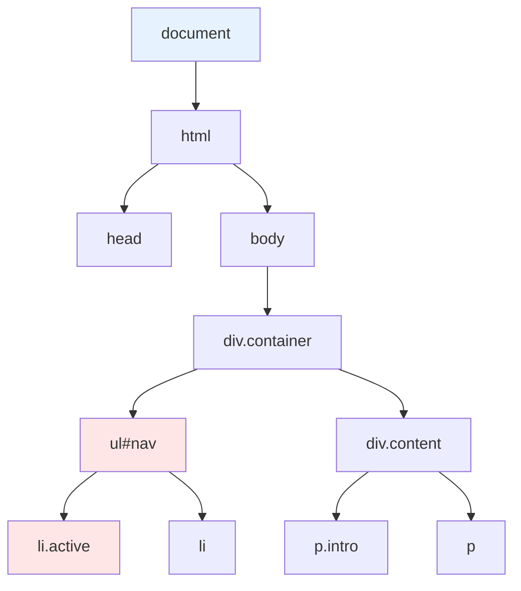
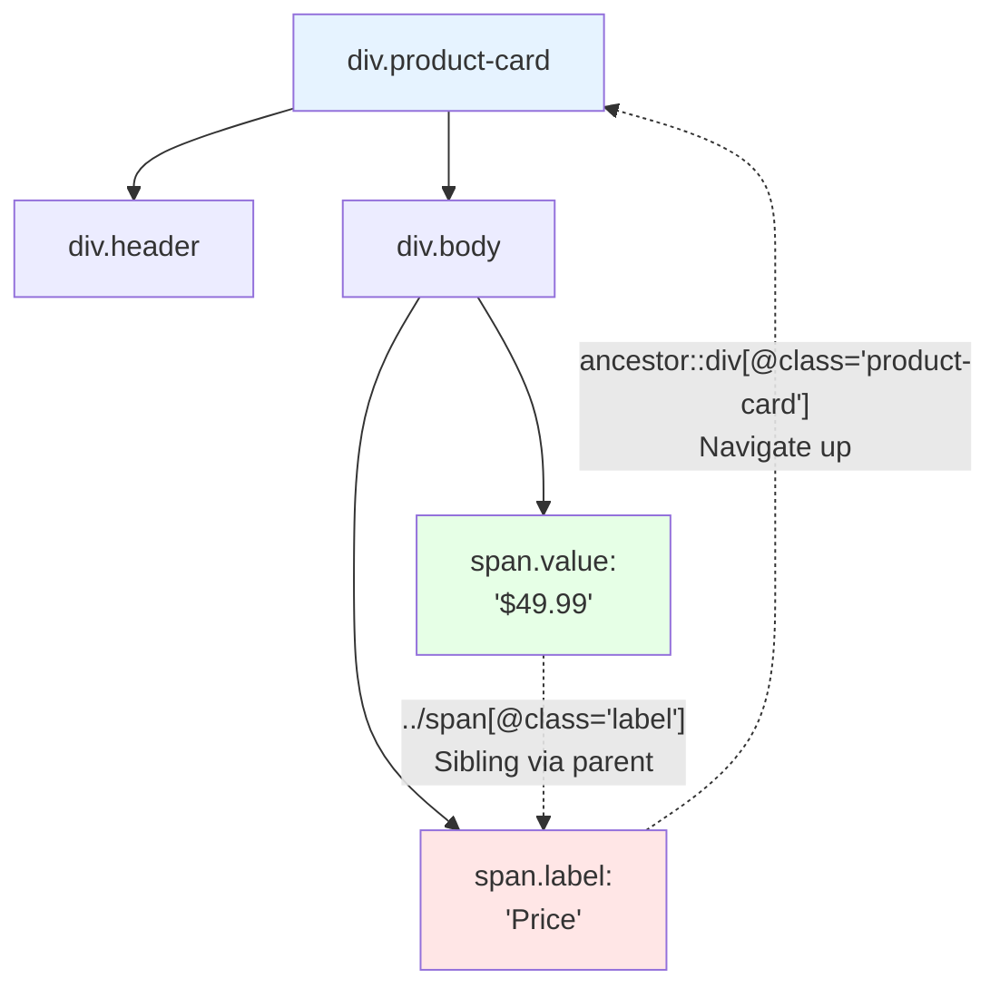
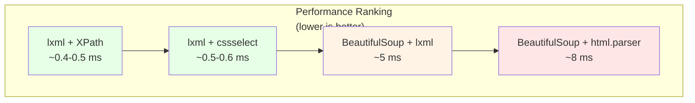
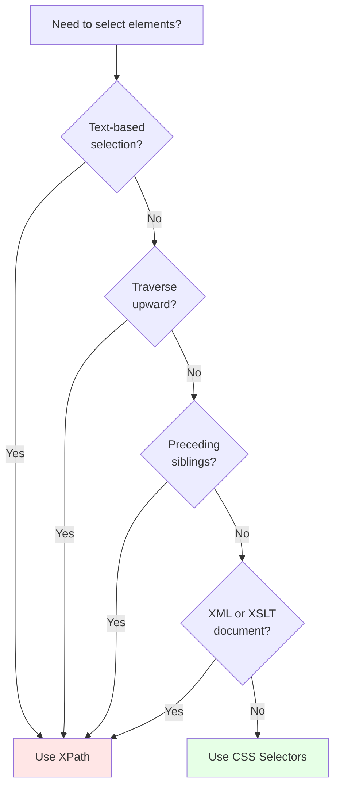

Every web scraper needs a way to point at elements on a page and say "give me that one." The two dominant languages for doing this are CSS selectors and XPath. [CSS selectors](/posts/css-selectors-made-simple/) grew out of stylesheets -- the same syntax browsers use to apply styles is reused to locate elements. [XPath](/posts/xpath-basics-navigating-web-pages-like-map/) comes from the XML world, designed as a full path-based query language for navigating tree structures. Both can target the same elements in most cases, but they differ in syntax, capability, and performance in ways that matter when you are writing scrapers that need to be fast, readable, and maintainable. If you are still getting comfortable with [HTML structure and tags](/posts/html-basics-for-scrapers-finding-way-around-tags/), start there before diving into selectors.

## How They Think About the Document

CSS selectors think in terms of **patterns**: match elements that have this class, this attribute, or this structural relationship. They describe what something looks like. `ul#nav > li.active` reads as "an `li` with class `active` that is a direct child of a `ul` with id `nav`."

XPath thinks in terms of **paths**: navigate from one node to another through the tree. It describes where something is and how to get there. `/html/body/div/ul[@id='nav']/li[@class='active']` reads as a step-by-step walk from the root to the target.



This difference in philosophy drives everything else -- syntax complexity, readability, and the features each language supports.

## Syntax Comparison

Here are the most common selection patterns shown side by side.

| Task | CSS Selector | XPath |
|---|---|---|
| By ID | `#product-title` | `//*[@id='product-title']` |
| By class | `.price` | `//*[contains(@class, 'price')]` |
| By attribute | `a[href^="https://"]` | `//a[starts-with(@href, 'https://')]` |
| Attribute exists | `div[data-id]` | `//div[@data-id]` |
| Direct child | `div > p` | `//div/p` |
| Any descendant | `div p` | `//div//p` |
| Nth child | `ul li:nth-child(3)` | `//ul/li[3]` |
| First child | `li:first-child` | `//li[1]` |
| Last child | `li:last-child` | `//li[last()]` |
| Multiple conditions | `div.product[data-available="true"]` | `//div[contains(@class, 'product') and @data-available='true']` |
| Starts with | `a[href^="https"]` | `//a[starts-with(@href, 'https')]` |
| Ends with | `a[href$=".pdf"]` | `//a[substring(@href, string-length(@href)-3)='.pdf']` |
| Not | `input:not([type="hidden"])` | `//input[not(@type='hidden')]` |

Note that XPath has no native concept of space-separated class lists. If an element has `class="sale price featured"`, the CSS selector `.price` matches directly, but XPath's `@class='price'` does not. You need `contains(@class, 'price')`, which can produce false matches on classes like `price-old`. A more precise XPath would be `contains(concat(' ', @class, ' '), ' price ')`.

## What XPath Can Do That CSS Cannot

Several common scraping scenarios are flat-out impossible with CSS selectors.

### Select by Text Content

```xpath
<!-- Find a link containing "Next Page" -->
//a[contains(text(), 'Next Page')]

<!-- Find any element containing "out of stock" -->
//*[contains(., 'out of stock')]
```

CSS selectors have no text-matching capability. In scraping, this is a significant gap -- you often need to find elements based on their visible text.

### Traverse Upward (Parent and Ancestor)

```xpath
<!-- Find the parent of an element with class "price" -->
//*[@class='price']/..

<!-- Find the nearest ancestor table of a cell -->
//td[@id='target']/ancestor::table

<!-- Find the div containing a specific link -->
//a[@href='/checkout']/ancestor::div[1]
```

CSS selectors can only traverse downward and sideways. In scraping, you frequently find a known element and need to navigate to its container. XPath makes this trivial.



### Select Attributes Directly and Navigate Siblings

```xpath
<!-- Get href values directly as strings -->
//a/@href

<!-- First div after an h2 -->
//h2/following-sibling::div[1]

<!-- All paragraphs before a heading -->
//h2[@id='section-2']/preceding-sibling::p
```

XPath can select attribute nodes as first-class results and navigate siblings in both directions. CSS only supports following siblings with `+` and `~`.

## What CSS Does More Cleanly

CSS selectors win on brevity for common patterns.

```css
/* CSS -- clean multi-class matching */
.product.featured.sale
```

```xpath
<!-- XPath -- verbose equivalent -->
//*[contains(@class, 'product') and contains(@class, 'featured') and contains(@class, 'sale')]
```

The `ends-with` case is particularly painful in XPath 1.0, which is what most Python libraries implement. CSS handles it with a simple `$=` operator. For a handy reference of all these operators, see the [CSS selectors cheat sheet](/posts/css-selectors-web-scraping-practical-cheat-sheet/).

## Performance Benchmarks in Python

The three most common Python approaches are lxml with XPath, lxml with cssselect (which compiles CSS to XPath internally), and BeautifulSoup with its CSS selector support.

```python
import time
from lxml import html
from bs4 import BeautifulSoup

def generate_html(num_products=500):
    rows = []
    for i in range(num_products):
        rows.append(f'''
        <div class="product-card" data-id="{i}">
            <h2 class="product-title">Product {i}</h2>
            <span class="price">${i * 10 + 9.99:.2f}</span>
            <a href="/product/{i}" class="details-link">View Details</a>
        </div>''')
    return f'<html><body>{"".join(rows)}</body></html>'

html_content = generate_html(500)

def benchmark(name, func, iterations=1000):
    start = time.perf_counter()
    for _ in range(iterations):
        result = func()
    elapsed = time.perf_counter() - start
    print(f"{name:40s} | {elapsed/iterations*1000:.3f}ms/iter")

tree = html.fromstring(html_content)
soup = BeautifulSoup(html_content, "html.parser")
soup_lxml = BeautifulSoup(html_content, "lxml")

benchmark("lxml XPath",
    lambda: tree.xpath('//h2[@class="product-title"]'))
benchmark("lxml cssselect",
    lambda: tree.cssselect('h2.product-title'))
benchmark("BeautifulSoup (html.parser)",
    lambda: soup.select('h2.product-title'))
benchmark("BeautifulSoup (lxml parser)",
    lambda: soup_lxml.select('h2.product-title'))
```

### Typical Results

| Approach | Simple Select | Attribute Extract |
|---|---|---|
| lxml XPath | ~0.45 ms | ~0.38 ms |
| lxml cssselect | ~0.48 ms | ~0.51 ms |
| BeautifulSoup (lxml parser) | ~5.10 ms | ~5.30 ms |
| BeautifulSoup (html.parser) | ~8.20 ms | ~8.50 ms |



Key takeaways:

- **lxml dominates.** Whether you use XPath or cssselect, you are in the same performance tier. cssselect compiles CSS to XPath internally, so overhead is minimal.
- **BeautifulSoup is 10-15x slower.** Pure Python tree walking adds up on large documents.
- **XPath attribute selection is faster** because it returns strings directly instead of element objects you then query.


<figure>
  
  <figcaption>XPath navigates documents the way a map navigates terrain. <span class="img-credit">Photo by Саша Алалыкин / <a href="https://www.pexels.com" target="_blank" rel="noopener noreferrer">Pexels</a></span></figcaption>
</figure>

## Code Examples: Python

### lxml with XPath

```python
from lxml import html
import requests

response = requests.get("https://example.com/products")
tree = html.fromstring(response.content)

# Select text content directly
titles = tree.xpath('//h2[@class="product-title"]/text()')

# Navigate up: find product cards containing "Out of Stock"
out_of_stock = tree.xpath(
    '//*[contains(text(), "Out of Stock")]/ancestor::div[@class="product-card"]'
)

# Extract structured data
for card in tree.xpath('//div[@class="product-card"]'):
    title = card.xpath('.//h2[@class="product-title"]/text()')[0]
    price = card.xpath('.//span[@class="price"]/text()')[0]
    link = card.xpath('.//a[@class="details-link"]/@href')[0]
    print(f"{title}: {price} -> {link}")
```

### [BeautifulSoup](/posts/beautifulsoup-css-selectors-python-parsing-made-easy/) with CSS Selectors

```python
from bs4 import BeautifulSoup
import requests

response = requests.get("https://example.com/products")
soup = BeautifulSoup(response.content, "lxml")

# Clean class-based selection
titles = [el.get_text() for el in soup.select('h2.product-title')]

# Nested extraction
for card in soup.select('div.product-card'):
    title = card.select_one('h2.product-title').get_text()
    price = card.select_one('span.price').get_text()
    link = card.select_one('a.details-link')['href']
    print(f"{title}: {price} -> {link}")
```

## Code Examples: JavaScript

### CSS with querySelector

```javascript
// In Playwright page.evaluate or browser console
const products = [...document.querySelectorAll('.product-card')].map(card => ({
    title: card.querySelector('h2.product-title')?.textContent,
    price: card.querySelector('span.price')?.textContent,
    link: card.querySelector('a.details-link')?.href
}));
```

### XPath with document.evaluate

```javascript
function xpathAll(expr, context = document) {
    const result = [];
    const iterator = document.evaluate(
        expr, context, null,
        XPathResult.ORDERED_NODE_ITERATOR_TYPE, null
    );
    let node;
    while ((node = iterator.iterateNext())) result.push(node);
    return result;
}

// Text-based selection -- impossible with CSS
const nextButton = xpathAll('//a[contains(text(), "Next Page")]');

// Upward navigation -- impossible with CSS
const cards = xpathAll(
    '//span[contains(text(), "Out of Stock")]/ancestor::div[@class="product-card"]'
);
```

### Playwright

```python
from playwright.sync_api import sync_playwright

with sync_playwright() as p:
    browser = p.chromium.launch()
    page = browser.new_page()
    page.goto("https://example.com/products")

    # CSS selectors (default)
    titles = page.locator('h2.product-title').all_text_contents()

    # XPath when needed (prefix with xpath=)
    next_link = page.locator('xpath=//a[contains(text(), "Next")]')

    # Playwright text selector as XPath alternative
    next_link_alt = page.locator('a:has-text("Next")')
    browser.close()
```

## When to Use Which



**Reach for XPath when you need:**

- **Text-based selection.** "Find the button that says 'Load More'" is natural in XPath, impossible in CSS.
- **Upward navigation.** The `ancestor::` and `parent::` axes let you find containers from known child elements.
- **Bidirectional sibling traversal.** `following-sibling::` and `preceding-sibling::` go both ways.
- **XML documents.** For XML feeds, SOAP responses, or SVG, XPath is the native query language.
- **Direct attribute extraction.** `//a/@href` returns strings without selecting elements first.

**Default to CSS selectors for:**

- **Simple selections.** Class, ID, attribute, and structural position are shorter and clearer in CSS.
- **Team readability.** Every web developer already knows CSS selectors.
- **Browser-based scraping.** Playwright, Puppeteer, and DevTools all default to CSS.
- **Most scraping tasks.** Most elements are identifiable by class, ID, or attribute without needing XPath features.

## Mixing Both in Practice

The pragmatic approach is to use both, choosing whichever fits the specific task.

```python
from lxml import html

tree = html.fromstring(page_content)

for card in tree.cssselect('div.product-card'):
    # CSS for straightforward class-based selection
    title = card.cssselect('h2.product-title')[0].text_content()

    # XPath when you need text matching
    in_stock = bool(card.xpath('.//*[contains(text(), "In Stock")]'))

    # XPath for direct attribute extraction
    image_url = card.xpath('.//img/@src')[0]

    # CSS for class-based selection
    badges = [b.text_content() for b in card.cssselect('span.badge')]

    print(f"{title} | stock: {in_stock} | img: {image_url} | {badges}")
```

This is not indecisive -- it is practical.

## The Bottom Line

Use CSS selectors as your default. They are shorter, more readable, and sufficient for roughly 90% of element selection tasks in web scraping. Every browser, every scraping framework, and every web developer already speaks CSS.

Switch to XPath when you hit a wall: when you need text content matching, upward navigation, preceding siblings, or complex multi-condition queries. XPath is not harder to learn -- it is just more verbose for simple tasks and more powerful for complex ones.

If you are using lxml in Python, the performance difference between the two is negligible. If you are using BeautifulSoup, the selector language matters less than the parser -- switch to the lxml parser for a significant speedup regardless.

The tools are complementary. Learn both. Default to CSS. Reach for XPath when CSS cannot get you there.
