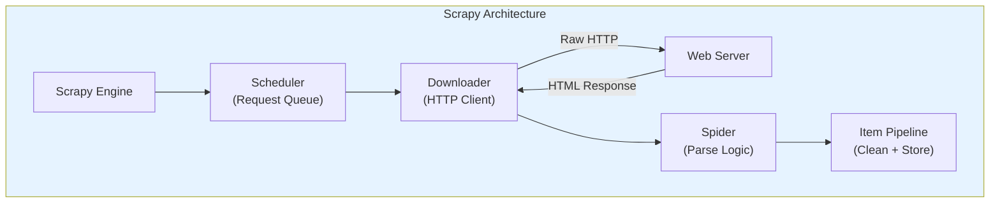
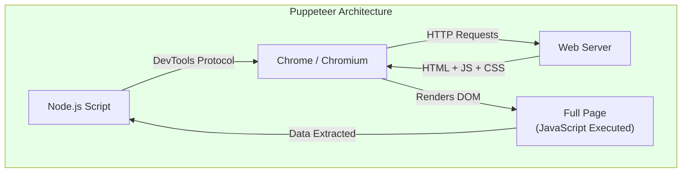
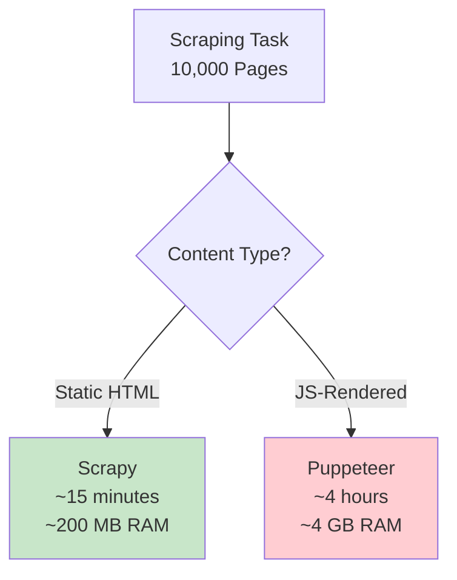
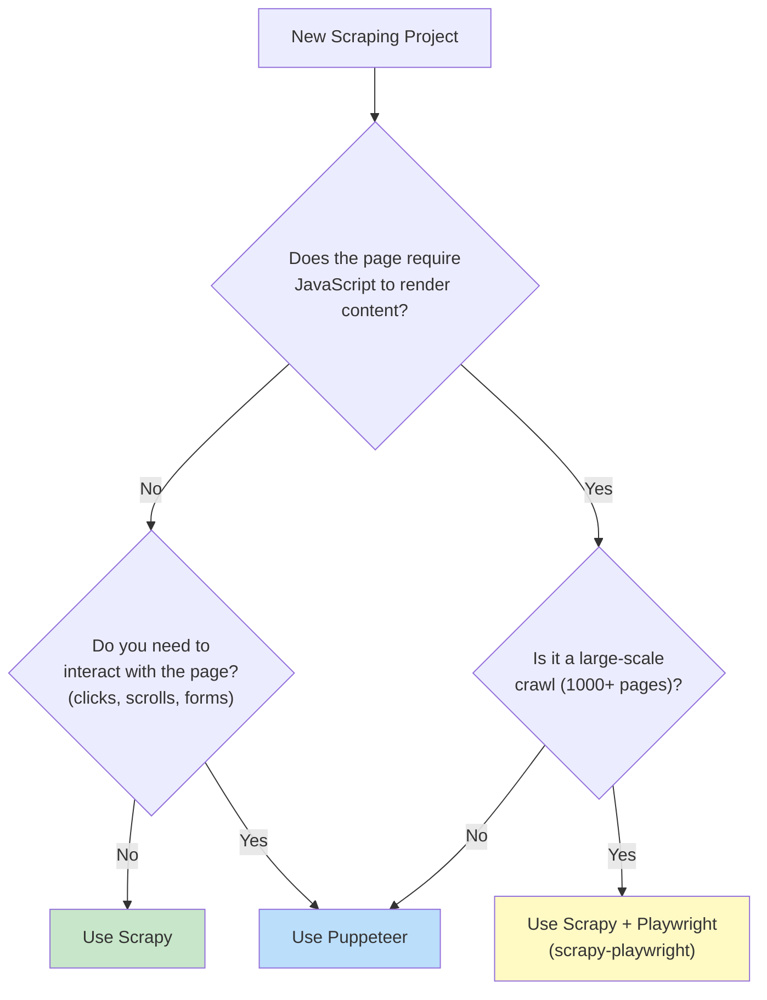
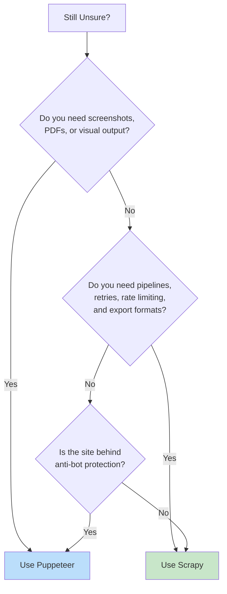

Scrapy and Puppeteer are both used for web scraping, but they solve fundamentally different problems. The distinction between [crawling and scraping](/posts/scraping-vs-crawling-differences/) is at the core of understanding when to use each tool. Scrapy is a crawling framework -- it sends HTTP requests, parses responses, and follows links across thousands of pages with built-in concurrency, pipelines, and retry logic. Puppeteer is a browser controller -- it launches a real Chrome instance, renders JavaScript, clicks buttons, fills forms, and gives you access to the full DOM as a user would see it. Choosing between them is not about which is "better." It is about which tool matches the problem you are actually trying to solve.

This post breaks down their architectures, strengths, performance characteristics, and ideal use cases, then shows you how to combine them when a project demands both.

## How They Work Under the Hood

The architectural difference between Scrapy and Puppeteer is not a detail -- it is the entire story. Every practical difference flows from this one design choice: Scrapy talks to servers directly over HTTP, while Puppeteer drives a full browser.



Scrapy operates at the HTTP layer. For a deeper look at [how web crawling works](/posts/how-web-crawling-works-principles-basic-architecture/), see our architecture guide. Its engine coordinates a scheduler that queues requests, a downloader that sends them, spiders that parse responses, and pipelines that process extracted data. There is no browser, no rendering engine, no JavaScript interpreter. Scrapy sees exactly what `curl` would see -- the raw HTML returned by the server.



Puppeteer launches a real Chromium browser and controls it over the Chrome DevTools Protocol. When you navigate to a page, Chrome does everything a normal browser does: fetches HTML, downloads CSS and JavaScript, executes scripts, renders the DOM, fires event listeners, and makes XHR/fetch calls. Puppeteer then lets you query that fully rendered page.

This means Scrapy is lightweight and fast but blind to JavaScript-rendered content. Puppeteer sees everything a user sees but carries the full weight of a browser process.

## When to Use Scrapy

Scrapy excels in scenarios where the data you need is present in the raw HTML response and you need to collect it at scale.

**Static content sites.** News sites, blogs, documentation portals, and directories that serve fully rendered HTML are Scrapy's sweet spot. If you can view-source in your browser and see the data, Scrapy can extract it.

**Large-scale crawling.** Scrapy's asynchronous architecture (built on Twisted) can handle thousands of concurrent requests with minimal memory. If you are comparing lighter-weight options for static sites, [requests vs Selenium](/posts/python-requests-vs-selenium-speed-performance-comparison/) is another common decision point. Crawling a million pages is routine with Scrapy; doing the same with Puppeteer would require a fleet of machines.

**Data pipelines.** Scrapy's built-in pipeline system lets you validate, clean, deduplicate, and export data as part of the scraping process. You can write items to JSON, CSV, databases, or S3 without any external tooling.

**API and feed scraping.** Many sites expose RSS feeds, XML sitemaps, or JSON APIs alongside their HTML. Scrapy handles all of these natively with its feed exporters and built-in XML/JSON parsers.

**Polite crawling.** Scrapy has built-in support for `robots.txt`, auto-throttling based on server response times, per-domain concurrency limits, and configurable delays between requests.

## When to Use Puppeteer

Puppeteer is the right tool when a browser is genuinely required to access the content.

**JavaScript-rendered pages.** Single-page applications built with React, Angular, or Vue often return a nearly empty HTML shell. The actual content is rendered client-side by JavaScript. Scrapy would see an empty `<div id="root"></div>` -- Puppeteer sees the fully populated page.

**Sites requiring interaction.** Some data only appears after clicking a "Load More" button, scrolling to the bottom, selecting a dropdown value, or navigating a multi-step flow. Puppeteer can simulate all of these user actions.

**Authentication with complex flows.** Login forms that use CAPTCHA, OAuth redirects, multi-factor authentication, or JavaScript-based token generation are difficult or impossible to replicate with raw HTTP requests. Puppeteer handles them by simply filling the form and clicking submit.

**Anti-bot bypass.** Many bot detection systems (Cloudflare, PerimeterX, DataDome) check for a real browser environment -- JavaScript execution, canvas fingerprinting, WebGL rendering, proper navigator properties. A real browser passes these checks naturally; raw HTTP requests do not.

**Visual tasks.** Screenshots, PDF generation, visual regression testing, and any task that requires seeing the page as rendered all require a browser.

## Performance: Orders of Magnitude Apart

The performance gap between Scrapy and Puppeteer is not marginal. It is structural.

Scrapy sends lightweight HTTP requests -- each one costs a few kilobytes of memory and a few milliseconds of CPU time. A single Scrapy process on a modest machine can sustain 500 to 2,000 concurrent requests and crawl tens of thousands of pages per minute.

Puppeteer launches a Chromium process that consumes 100-300 MB of RAM per browser instance. Each page tab adds another 50-150 MB. Network traffic increases 10-50x because the browser downloads CSS, JavaScript, images, fonts, and tracking scripts. A single machine can typically run 5 to 20 concurrent Puppeteer pages before memory becomes the bottleneck.



These numbers are rough estimates for a typical product listing scrape, but they illustrate the gap. Scrapy is not just faster -- it operates in a different performance class entirely.

## Code Comparison: Scraping the Same Data

Let us scrape product names and prices from a hypothetical static e-commerce page using both tools. This comparison highlights the structural differences in how you write code for each.

### Scrapy Spider

```python
import scrapy


class ProductSpider(scrapy.Spider):
    name = "products"
    start_urls = ["https://example.com/products"]

    custom_settings = {
        "CONCURRENT_REQUESTS": 16,
        "DOWNLOAD_DELAY": 0.5,
        "FEEDS": {
            "products.json": {
                "format": "json",
                "encoding": "utf-8",
                "overwrite": True,
            }
        },
    }

    def parse(self, response):
        for product in response.css("div.product-card"):
            yield {
                "name": product.css("h2.product-title::text").get(),
                "price": product.css("span.price::text").get(),
                "url": response.urljoin(
                    product.css("a.product-link::attr(href)").get()
                ),
            }

        next_page = response.css("a.next-page::attr(href)").get()
        if next_page:
            yield response.follow(next_page, callback=self.parse)
```

Run it with:

```bash
scrapy crawl products
```

A few things to notice. The spider declares its start URLs and Scrapy handles scheduling, downloading, and retrying. The `parse` method receives a response object with CSS and XPath selectors built in. Yielding a dictionary automatically feeds it into the item pipeline. Yielding a `response.follow()` call schedules the next page for crawling. Pagination, concurrency, rate limiting, and output format are all handled by configuration.

### Puppeteer Script

```javascript
const puppeteer = require("puppeteer");
const fs = require("fs");

(async () => {
  const browser = await puppeteer.launch({ headless: "new" });
  const page = await browser.newPage();

  // Block images and stylesheets to speed things up
  await page.setRequestInterception(true);
  page.on("request", (req) => {
    if (["image", "stylesheet", "font"].includes(req.resourceType())) {
      req.abort();
    } else {
      req.continue();
    }
  });

  const allProducts = [];
  let currentUrl = "https://example.com/products";

  while (currentUrl) {
    await page.goto(currentUrl, { waitUntil: "networkidle2" });

    const products = await page.evaluate(() => {
      const cards = document.querySelectorAll("div.product-card");
      return Array.from(cards).map((card) => ({
        name: card.querySelector("h2.product-title")?.textContent?.trim(),
        price: card.querySelector("span.price")?.textContent?.trim(),
        url: card.querySelector("a.product-link")?.href,
      }));
    });

    allProducts.push(...products);

    currentUrl = await page.evaluate(() => {
      const next = document.querySelector("a.next-page");
      return next ? next.href : null;
    });
  }

  fs.writeFileSync("products.json", JSON.stringify(allProducts, null, 2));
  await browser.close();
})();
```

The Puppeteer version requires manual management of the browser lifecycle, pagination loop, data collection array, and file output. There is no built-in retry logic, rate limiting, or pipeline system. You write all of that yourself. On the other hand, Puppeteer gives you full access to the DOM via `page.evaluate()`, which runs arbitrary JavaScript inside the browser context. If the page requires JavaScript to render products, this version works and the Scrapy version does not.

## Scrapy's Built-in Strengths

Scrapy is not just an HTTP client. It is a complete framework with production-grade features built in.

**Middleware stack.** Scrapy's downloader middleware lets you intercept every request and response. You can rotate user agents, inject proxies, handle cookies, decompress responses, and retry failed requests -- all without touching your spider code.

```python
# settings.py
DOWNLOADER_MIDDLEWARES = {
    "scrapy.downloadermiddlewares.retry.RetryMiddleware": 550,
    "scrapy.downloadermiddlewares.httpproxy.HttpProxyMiddleware": 750,
    "myproject.middlewares.RotateUserAgentMiddleware": 400,
}

RETRY_TIMES = 3
RETRY_HTTP_CODES = [500, 502, 503, 504, 408, 429]
```

**Item pipelines.** Pipelines process every scraped item in sequence. You can validate fields, drop duplicates, normalize prices, convert currencies, and write to multiple backends.

```python
class PricePipeline:
    def process_item(self, item, spider):
        raw = item.get("price", "")
        cleaned = raw.replace("$", "").replace(",", "").strip()
        try:
            item["price"] = float(cleaned)
        except ValueError:
            raise scrapy.exceptions.DropItem(
                f"Invalid price: {raw}"
            )
        return item


class DuplicatesPipeline:
    def __init__(self):
        self.seen = set()

    def process_item(self, item, spider):
        url = item.get("url")
        if url in self.seen:
            raise scrapy.exceptions.DropItem(
                f"Duplicate: {url}"
            )
        self.seen.add(url)
        return item
```

**Export formats.** Scrapy can write scraped data to JSON, JSON Lines, CSV, XML, and pickled Python objects. With extensions, it supports S3, GCS, and FTP destinations directly.

**Auto-throttle.** Scrapy's auto-throttle extension dynamically adjusts request delays based on server response times and current load. It slows down when the server is struggling and speeds up when it responds quickly.

```python
# settings.py
AUTOTHROTTLE_ENABLED = True
AUTOTHROTTLE_START_DELAY = 1.0
AUTOTHROTTLE_MAX_DELAY = 30.0
AUTOTHROTTLE_TARGET_CONCURRENCY = 2.0
```

**Stats and logging.** Scrapy tracks request counts, response codes, item counts, and error rates out of the box. After every crawl, it prints a stats summary showing exactly what happened.

## Puppeteer's Unique Capabilities

Puppeteer's power comes from controlling a real browser. Several capabilities are simply impossible without one.

**Full DOM access.** After JavaScript execution, you can query the DOM exactly as a user's browser sees it. Shadow DOM, dynamically inserted elements, canvas content -- all accessible.

```javascript
// Extract data from a shadow DOM component
const data = await page.evaluate(() => {
  const host = document.querySelector("product-carousel");
  const shadow = host.shadowRoot;
  const items = shadow.querySelectorAll(".carousel-item");
  return Array.from(items).map((item) => ({
    name: item.querySelector(".name")?.textContent,
    image: item.querySelector("img")?.src,
  }));
});
```

**Screenshots and PDFs.** Capture visual snapshots of pages at any point during interaction.

```javascript
await page.goto("https://example.com/report");
await page.screenshot({
  path: "report.png",
  fullPage: true,
});
await page.pdf({
  path: "report.pdf",
  format: "A4",
  printBackground: true,
});
```

**Network interception.** Intercept, modify, or block any network request the browser makes. This is useful for blocking analytics, injecting headers, or capturing API responses that contain the data you need.

```javascript
page.on("response", async (response) => {
  const url = response.url();
  if (url.includes("/api/products")) {
    const json = await response.json();
    console.log("Captured API data:", json);
  }
});

await page.goto("https://example.com/products");
```

**JavaScript execution.** Run arbitrary code in the browser context to trigger application logic, extract computed styles, read localStorage, or call application-specific JavaScript functions.

```javascript
// Scroll to the bottom to trigger infinite scroll loading
await page.evaluate(async () => {
  await new Promise((resolve) => {
    let totalHeight = 0;
    const distance = 300;
    const timer = setInterval(() => {
      window.scrollBy(0, distance);
      totalHeight += distance;
      if (totalHeight >= document.body.scrollHeight) {
        clearInterval(timer);
        resolve();
      }
    }, 200);
  });
});
```


<figure>
  
  <figcaption>Scrapy handles the plumbing so you can focus on the data. <span class="img-credit">Photo by Google DeepMind / <a href="https://www.pexels.com" target="_blank" rel="noopener noreferrer">Pexels</a></span></figcaption>
</figure>

## Combining Them: Scrapy + Playwright

You do not have to choose one or the other. The `scrapy-playwright` integration lets you use Scrapy's framework (spiders, pipelines, middleware, scheduling) while delegating specific requests to a Playwright-controlled browser. Playwright serves the same role as Puppeteer here -- it drives a real browser -- but integrates with Scrapy's async architecture more cleanly.

```python
import scrapy


class HybridSpider(scrapy.Spider):
    name = "hybrid"
    start_urls = ["https://example.com/categories"]

    custom_settings = {
        "DOWNLOAD_HANDLERS": {
            "https": "scrapy_playwright.handler.ScrapyPlaywrightDownloadHandler",
        },
        "TWISTED_REACTOR": "twisted.internet.asyncioreactor.AsyncioSelectorReactor",
        "PLAYWRIGHT_BROWSER_TYPE": "chromium",
        "PLAYWRIGHT_LAUNCH_OPTIONS": {"headless": True},
    }

    def parse(self, response):
        """Parse category links -- static HTML, no browser needed."""
        for link in response.css("a.category-link::attr(href)").getall():
            yield response.follow(
                link,
                callback=self.parse_category,
                meta={"playwright": True},  # This page needs a browser
            )

    async def parse_category(self, response):
        """Parse product listing -- JS-rendered, browser required."""
        for product in response.css("div.product-card"):
            yield {
                "name": product.css("h2::text").get(),
                "price": product.css(".price::text").get(),
                "category": response.css("h1.category-title::text").get(),
            }

        # Click "Load More" if present
        next_page = response.css("a.next-page::attr(href)").get()
        if next_page:
            yield response.follow(
                next_page,
                callback=self.parse_category,
                meta={"playwright": True},
            )
```

The key line is `meta={"playwright": True}`. This tells Scrapy to route that specific request through a Playwright browser instead of its normal HTTP downloader. Static pages get crawled at full Scrapy speed; JavaScript-heavy pages get rendered by a browser. You keep Scrapy's pipeline, middleware, and scheduling system for all of it.

This hybrid approach is increasingly common for large-scale projects where most pages are static but a few sections require JavaScript rendering.

## Decision Flowchart

Use this flowchart when deciding which tool to reach for on a new scraping project.





## Comparison Table

| Feature | Scrapy | Puppeteer |
|---|---|---|
| **Language** | Python | JavaScript (Node.js) |
| **Architecture** | HTTP client + framework | Browser controller |
| **JavaScript rendering** | No (without plugins) | Yes |
| **Concurrency** | Thousands of requests | 5-20 browser tabs |
| **Memory per page** | ~1-5 MB | ~50-150 MB |
| **Speed (static sites)** | Very fast | Slow (unnecessary overhead) |
| **Speed (JS sites)** | Cannot scrape | Normal browser speed |
| **Built-in pipelines** | Yes | No |
| **Built-in retries** | Yes | No |
| **Rate limiting** | Built-in auto-throttle | Manual implementation |
| **robots.txt** | Built-in respect | Manual implementation |
| **Export formats** | JSON, CSV, XML, JSON Lines | Manual file writing |
| **Screenshots/PDF** | No | Yes |
| **DOM interaction** | No | Full access |
| **Network interception** | Via middleware (HTTP only) | Full browser network |
| **Anti-bot bypass** | Limited (no browser fingerprint) | Better (real browser) |
| **Learning curve** | Moderate (framework concepts) | Low (imperative scripting) |
| **Best for** | Large-scale static crawling | JS-heavy, interactive sites |

## Choosing Based on Your Project

The choice is rarely about preference. It is driven by the target site's architecture.

If the site serves static HTML -- traditional server-rendered pages, blogs, news sites, government databases, academic repositories -- Scrapy will be faster, more reliable, and more resource-efficient by a wide margin. Its framework features (pipelines, middleware, auto-throttle, built-in exports) save you from reinventing infrastructure that every production scraper needs.

If the site is a modern single-page application, requires user interaction to reveal data, or is behind aggressive anti-bot protection, Puppeteer (or Playwright) is the only realistic option. For a head-to-head breakdown, see [Selenium vs Puppeteer](/posts/selenium-vs-puppeteer-definitive-comparison-web-scraping/). You pay the performance cost because there is no alternative -- the data simply does not exist until a browser renders it.

For a broader look at how these tools stack up against other options, see our [mega comparison of Playwright, Puppeteer, Selenium, and Scrapy](/posts/playwright-vs-puppeteer-vs-selenium-vs-scrapy-2026-mega-comparison/). If your project involves both -- a mix of static and dynamic pages across a large site -- the `scrapy-playwright` integration gives you the best of both worlds. Use Scrapy's engine for scheduling, rate limiting, and data processing; use a browser only for the pages that actually need one.

The worst outcome is using Puppeteer to scrape a static site at scale (wasting 10x the resources) or using Scrapy against a JavaScript-rendered SPA (getting empty responses). Match the tool to the problem, and both will serve you well.
